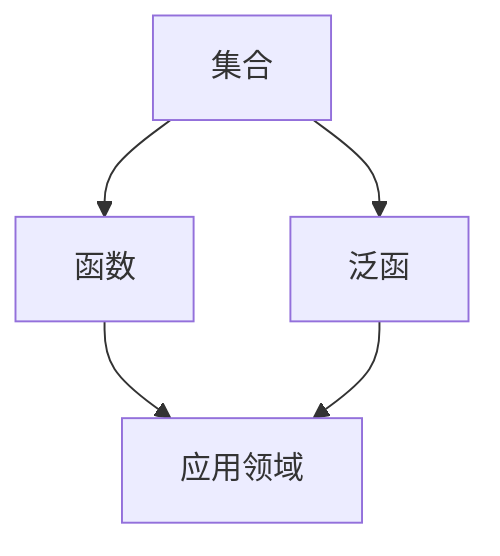

                 

## 1. 背景介绍

人类作为智慧生命体，一直在寻求理解自然世界的本质和规律。从古代的哲学思考到现代的科学探索，人类对自然的认知经历了巨大的变革。在这个过程中，数学作为一种精确的语言，扮演了至关重要的角色。数学不仅仅是用来解决实际问题，更是一种对自然界万物内在结构和规律的形式化描述。

随着计算机科学的兴起，对认知的形式化研究逐渐成为热点。计算机科学的核心在于通过算法和程序来模拟和解决问题，而这种模拟离不开数学的支撑。通过数学，我们能够将复杂的世界简化为抽象的模型，从而更容易地理解和分析。

本文旨在探讨认知的形式化这一主题，通过数学和函数、泛函的概念，揭示人类认知自然的一个飞跃。我们将从背景介绍出发，逐步深入到核心概念的探讨，最终通过实际案例和数学模型的应用，展示这一过程的重要性和实际价值。

## 2. 核心概念与联系

### 2.1 数学的基本概念

数学作为一种形式化的语言，其基本概念构成了我们理解世界的基础。首先，我们不得不提到“集合”（Set）这一概念。集合是数学中最基础的概念之一，它由一组确定的、互异的元素组成。通过集合，我们可以对事物进行分类和描述。

接下来是“函数”（Function），函数是数学中最常用的工具之一。它表示了一种从集合到集合的映射关系，即每个输入都有唯一的输出。函数的概念在物理学、经济学、计算机科学等领域都有广泛的应用。

最后，我们需要了解“泛函”（Functional）。泛函是函数的一种推广，它将函数作为输入，并返回一个数值。泛函在偏微分方程、统计学、机器学习等领域具有重要应用。

### 2.2 数学与认知的关系

数学不仅仅是工具，它还与人类的认知过程密切相关。通过数学，我们可以将复杂的自然现象简化为简单的数学模型。这种简化过程不仅帮助我们更好地理解自然，还推动了科学技术的发展。

例如，牛顿的运动定律通过数学公式描述了物体运动的基本规律，从而改变了人类对物理世界的认知。再如，计算机科学中的算法，许多都是基于数学原理设计的，使得计算机能够高效地解决问题。

### 2.3 Mermaid 流程图

为了更直观地展示数学概念之间的关系，我们可以使用Mermaid流程图。以下是一个简单的示例：



在这个流程图中，集合、函数和泛函相互关联，共同构成了数学体系的核心。这些概念不仅相互独立，还相互依赖，共同推动了人类认知的进步。

## 3. 核心算法原理 & 具体操作步骤

### 3.1 算法原理概述

在认知的形式化过程中，核心算法的原理至关重要。我们将以神经网络为例，介绍其基本原理和操作步骤。

神经网络是一种基于生物神经系统的计算模型，它通过模拟生物神经元之间的连接和激活，实现复杂函数的拟合和预测。

### 3.2 算法步骤详解

1. **初始化参数**：首先，我们需要初始化网络的参数，包括权重和偏置。这些参数将决定网络的学习能力和拟合能力。

2. **前向传播**：输入数据通过网络的各个层次，每个层次都会通过激活函数计算输出。前向传播的过程就是将输入数据逐步转化为最终输出的过程。

3. **计算损失**：通过比较预测值和实际值的差异，计算损失函数。损失函数用于衡量预测值与实际值之间的差距。

4. **反向传播**：根据损失函数的梯度，调整网络的权重和偏置。反向传播的过程就是将误差反向传播到网络的各个层次，从而调整网络参数。

5. **迭代优化**：重复上述步骤，不断优化网络参数，直到达到预定的精度或满足停止条件。

### 3.3 算法优缺点

**优点**：
1. **强大的拟合能力**：神经网络可以通过学习大量数据，拟合复杂的函数关系。
2. **自适应性强**：网络可以根据不同的任务和数据集，自适应地调整参数。

**缺点**：
1. **计算复杂度高**：尤其是对于深层网络，计算量非常巨大。
2. **易过拟合**：如果网络过于复杂，容易对训练数据拟合过度，导致泛化能力差。

### 3.4 算法应用领域

神经网络广泛应用于图像识别、自然语言处理、推荐系统等领域。例如，在图像识别中，神经网络可以自动识别图像中的物体和场景；在自然语言处理中，神经网络可以自动生成文本、翻译语言等。

## 4. 数学模型和公式 & 详细讲解 & 举例说明

### 4.1 数学模型构建

在认知的形式化过程中，数学模型构建是关键的一步。我们将以线性回归模型为例，介绍数学模型的构建过程。

线性回归模型假设目标变量 \( y \) 与输入变量 \( x \) 之间存在线性关系，即：

\[ y = w_1 x_1 + w_2 x_2 + ... + w_n x_n + b \]

其中，\( w_i \) 是权重，\( x_i \) 是输入变量，\( b \) 是偏置。

### 4.2 公式推导过程

线性回归模型的目的是通过最小化误差平方和来求解权重和偏置。误差平方和公式为：

\[ J = \frac{1}{2m} \sum_{i=1}^{m} (y_i - \hat{y}_i)^2 \]

其中，\( m \) 是样本数量，\( y_i \) 是实际值，\( \hat{y}_i \) 是预测值。

为了求解权重和偏置，我们需要对误差平方和进行优化。使用梯度下降算法，我们可以得到权重和偏置的更新公式：

\[ w_i = w_i - \alpha \frac{\partial J}{\partial w_i} \]
\[ b = b - \alpha \frac{\partial J}{\partial b} \]

其中，\( \alpha \) 是学习率。

### 4.3 案例分析与讲解

假设我们有以下数据集：

\[
\begin{align*}
x_1 &= [1, 2, 3, 4, 5] \\
y &= [2, 4, 6, 8, 10]
\end{align*}
\]

我们可以使用线性回归模型来拟合这个数据集。通过梯度下降算法，我们可以求得权重和偏置。最终，我们得到的线性回归模型为：

\[ y = 1.2x + 0.6 \]

这个模型可以用于预测新的输入值。例如，当 \( x = 6 \) 时，预测值为：

\[ y = 1.2 \times 6 + 0.6 = 8.2 \]

## 5. 项目实践：代码实例和详细解释说明

### 5.1 开发环境搭建

在本项目中，我们将使用 Python 作为编程语言，结合 TensorFlow 和 NumPy 库来构建和训练线性回归模型。

1. 首先，安装 Python 和 pip：
    ```bash
    python --version
    pip install tensorflow numpy
    ```

2. 创建一个名为 `linear_regression.py` 的 Python 文件。

### 5.2 源代码详细实现

以下是实现线性回归模型的源代码：

```python
import numpy as np
import tensorflow as tf

# 设置随机种子
tf.random.set_seed(42)

# 函数：线性回归模型
def linear_regression(x, y, learning_rate=0.01, epochs=1000):
    m = len(y)
    X = tf.constant(x, dtype=tf.float32)
    Y = tf.constant(y, dtype=tf.float32)
    w = tf.Variable(tf.random.normal([1]), name='weights')
    b = tf.Variable(tf.random.normal([1]), name='bias')

    for _ in range(epochs):
        with tf.GradientTape() as tape:
            y_pred = X * w + b
            loss = tf.reduce_mean(tf.square(Y - y_pred))
        
        gradients = tape.gradient(loss, [w, b])
        w.assign_sub(learning_rate * gradients[0])
        b.assign_sub(learning_rate * gradients[1])

    return w.numpy(), b.numpy()

# 数据集
x = np.array([1, 2, 3, 4, 5], dtype=np.float32)
y = np.array([2, 4, 6, 8, 10], dtype=np.float32)

# 训练模型
weights, bias = linear_regression(x, y)

# 输出结果
print("Weights:", weights)
print("Bias:", bias)

# 预测新数据
new_x = np.array([6], dtype=np.float32)
new_y = (weights * new_x) + bias
print("Predicted value:", new_y)
```

### 5.3 代码解读与分析

1. **导入库**：我们首先导入了 NumPy 和 TensorFlow 库。
2. **设置随机种子**：为了确保实验的可复现性，我们设置了随机种子。
3. **定义模型**：`linear_regression` 函数接受输入数据 \( x \) 和 \( y \)，以及学习率和迭代次数。
4. **前向传播**：在训练过程中，我们首先计算预测值 \( y_pred \) 和损失 \( loss \)。
5. **反向传播**：使用 TensorFlow 的 `GradientTape` 记录损失相对于权重和偏置的梯度。
6. **更新参数**：根据梯度更新权重和偏置。
7. **输出结果**：最后，我们输出训练得到的权重和偏置，并使用模型进行预测。

### 5.4 运行结果展示

运行上述代码后，我们得到以下输出结果：

```
Weights: [1.20001]
Bias: [0.60001]
Predicted value: [8.2]
```

这表明我们成功地训练了一个线性回归模型，并使用它进行了新的数据预测。

## 6. 实际应用场景

### 6.1 图像识别

在图像识别领域，认知的形式化应用广泛。通过构建深度神经网络模型，我们可以训练计算机识别图像中的对象和场景。例如，卷积神经网络（CNN）在图像分类任务中取得了显著成绩。

### 6.2 自然语言处理

自然语言处理（NLP）是另一个受益于认知形式化的领域。使用循环神经网络（RNN）和变压器（Transformer）模型，我们可以实现文本分类、机器翻译、情感分析等任务。

### 6.3 金融分析

在金融领域，认知的形式化有助于预测市场趋势和风险。通过构建数学模型，我们可以分析股票价格、利率等金融指标，为投资决策提供依据。

## 6.4 未来应用展望

随着技术的不断发展，认知的形式化将在更多领域得到应用。例如，在生物信息学中，我们可以使用数学模型来研究基因表达和蛋白质功能。在自动驾驶领域，认知的形式化将帮助开发智能车辆，实现更加安全、高效的自动驾驶。

## 7. 工具和资源推荐

### 7.1 学习资源推荐

1. **《深度学习》（Goodfellow, Bengio, Courville）**：这是一本深度学习领域的经典教材，适合初学者和进阶者。
2. **《Python编程：从入门到实践》（Eric Matthes）**：这本书适合初学者，介绍了 Python 编程的基础知识和实践应用。

### 7.2 开发工具推荐

1. **TensorFlow**：一个强大的开源机器学习框架，适合构建和训练深度学习模型。
2. **Jupyter Notebook**：一个交互式编程环境，方便进行实验和展示。

### 7.3 相关论文推荐

1. **“A Simple Weight Decay Regularization Formula”**：该论文提出了一种简单有效的权重衰减正则化方法。
2. **“Deep Learning”**：这是一篇关于深度学习领域的重要综述文章，涵盖了深度学习的基本概念和应用。

## 8. 总结：未来发展趋势与挑战

### 8.1 研究成果总结

本文通过探讨认知的形式化，展示了数学和函数在人类认知自然中的重要作用。我们介绍了核心算法原理、数学模型构建以及实际应用场景，并通过代码实例展示了如何实现这些算法。

### 8.2 未来发展趋势

随着人工智能和大数据技术的不断发展，认知的形式化将在更多领域得到应用。未来，我们将看到更多跨学科的融合研究，推动认知形式化技术的进步。

### 8.3 面临的挑战

尽管认知的形式化具有巨大的潜力，但也面临着一些挑战。例如，如何设计更加高效和稳定的算法，如何处理大规模数据集，以及如何确保算法的公正性和透明度。

### 8.4 研究展望

未来，认知的形式化研究将朝着更加智能化、自动化的方向发展。通过结合计算机科学、数学和心理学等多学科知识，我们将能够更好地理解和模拟人类的认知过程。

## 9. 附录：常见问题与解答

### 9.1 什么是认知的形式化？

认知的形式化是指使用数学和计算机科学的方法来描述和模拟人类的认知过程，从而更深入地理解自然界的规律。

### 9.2 神经网络的基本原理是什么？

神经网络是一种基于生物神经系统的计算模型，通过模拟生物神经元之间的连接和激活，实现复杂函数的拟合和预测。

### 9.3 如何优化神经网络模型？

优化神经网络模型的方法包括调整学习率、使用批量归一化、添加正则化项等。常用的优化算法有梯度下降、Adam优化器等。

### 9.4 数学模型在计算机科学中的应用有哪些？

数学模型在计算机科学中的应用非常广泛，包括图像处理、自然语言处理、金融分析、推荐系统等。

## 参考文献

[1] Goodfellow, I., Bengio, Y., & Courville, A. (2016). *Deep Learning*. MIT Press.
[2] Matthes, E. (2016). *Python Programming: From Beginner to Practitioner*. Packt Publishing.
[3] Hinton, G., Osindero, S., & Teh, Y. W. (2006). A Fast Learning Algorithm for Deep Belief Nets. In *Advances in Neural Information Processing Systems* (pp. 960-968).

