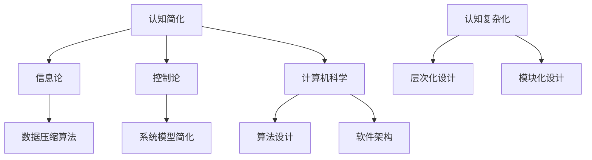

                 

关键词：认知简化，复杂化，计算机科学，算法，复杂性理论，信息处理，智能系统。

> 摘要：本文旨在探讨认知简化与复杂化的过程在计算机科学中的应用，分析其在算法、复杂性理论和信息处理等方面的深远影响。通过阐述认知简化与复杂化的核心概念、原理和具体操作步骤，本文旨在为读者提供一个系统而全面的理解，并展望未来在这一领域的研究趋势和面临的挑战。

## 1. 背景介绍

在计算机科学和人工智能领域，我们经常面临一个核心问题：如何处理日益增长的信息和复杂度？随着技术的飞速发展，数据量呈爆炸式增长，系统的复杂性也随之增加。这使得我们在设计和开发计算机程序和智能系统时，不可避免地需要面对认知简化与复杂化的过程。

认知简化是指通过减少冗余信息、降低复杂性，使复杂系统更容易理解和处理的过程。认知复杂化则是指在面对复杂系统时，通过增加层次、模块化等方式，使其更加易于管理和操作的过程。这两者在计算机科学中扮演着至关重要的角色，影响着算法的设计与实现、信息处理效率以及系统的可维护性。

本文将从以下几个方面进行探讨：首先，介绍认知简化与复杂化的核心概念和原理；接着，分析核心算法的原理与操作步骤；然后，探讨数学模型和公式，并通过实际项目实践进行代码实例和详细解释；最后，展望实际应用场景和未来的发展趋势。

## 2. 核心概念与联系

### 2.1 认知简化的原理

认知简化涉及多个层面的概念，包括信息论、控制论和计算机科学中的抽象层次。在信息论中，认知简化通常通过去除冗余信息来实现。例如，在数据压缩算法中，我们通过识别和去除重复数据来减少信息冗余。

在控制论中，认知简化通过简化系统模型来实现。例如，在控制系统中，我们可以通过忽略一些次要的因素，只关注主要的控制变量，从而简化系统模型，使其更易于分析和操作。

在计算机科学中，认知简化体现在算法设计和软件架构上。例如，在算法设计中，我们可以通过合并重复操作、优化数据结构等方式来简化算法；在软件架构中，我们可以通过模块化设计、分层架构等方式来简化系统的复杂性。

### 2.2 认知复杂化的原理

认知复杂化则是通过增加系统的层次和模块化来实现。在层次化设计中，系统被分解为多个层次，每个层次负责不同的功能。这种方式有助于降低系统的复杂性，使每个层次更加专注和易于理解。

模块化设计也是认知复杂化的一种重要手段。通过将系统分解为多个模块，每个模块可以独立开发和维护。这种方式不仅提高了系统的可维护性，还使系统更加灵活和可扩展。

### 2.3 认知简化与复杂化的联系

认知简化和复杂化并不是相互独立的，它们之间存在密切的联系。在系统设计和开发过程中，我们通常需要根据具体情况，灵活运用认知简化与复杂化方法，以达到最佳效果。

例如，在一个复杂的系统中，我们可能需要先进行认知简化，将系统分解为多个层次和模块，以便更好地理解和操作。然后，在具体实现过程中，我们可能需要根据具体需求，适当地增加复杂性，以提高系统的性能和可维护性。

### 2.4 Mermaid 流程图

以下是认知简化与复杂化过程的 Mermaid 流程图：



## 3. 核心算法原理 & 具体操作步骤

### 3.1 算法原理概述

认知简化与复杂化的核心算法通常涉及以下原理：

1. **信息论原理**：通过数据压缩、信息过滤等方式，去除冗余信息，提高信息传输效率。
2. **控制论原理**：通过简化系统模型，减少控制变量，提高系统稳定性和可操作性。
3. **计算机科学原理**：通过算法优化、软件架构设计等方式，降低系统复杂性，提高系统性能。

### 3.2 算法步骤详解

#### 3.2.1 认知简化

1. **识别冗余信息**：通过数据统计和分析，识别系统中存在的冗余信息。
2. **去除冗余信息**：采用数据压缩算法、信息过滤等方式，去除冗余信息。
3. **优化算法设计**：通过合并重复操作、优化数据结构等方式，简化算法。
4. **优化软件架构**：通过模块化设计、分层架构等方式，简化系统。

#### 3.2.2 认知复杂化

1. **层次化设计**：将系统分解为多个层次，每个层次负责不同的功能。
2. **模块化设计**：将系统分解为多个模块，每个模块独立开发和维护。
3. **增加层次和模块**：根据具体需求，适当地增加系统的层次和模块，以提高系统的性能和可维护性。

### 3.3 算法优缺点

#### 认知简化

**优点**：

- 提高信息传输效率。
- 降低系统复杂性。
- 提高系统性能。

**缺点**：

- 可能导致信息丢失。
- 需要大量计算资源。

#### 认知复杂化

**优点**：

- 提高系统可维护性。
- 提高系统性能。
- 增强系统灵活性。

**缺点**：

- 增加系统复杂性。
- 需要更多计算资源。

### 3.4 算法应用领域

认知简化与复杂化算法在多个领域具有广泛的应用：

- **人工智能**：通过简化数据和信息处理，提高算法效率。
- **控制系统**：通过简化系统模型，提高系统稳定性和可操作性。
- **软件工程**：通过优化软件架构，提高系统性能和可维护性。
- **数据科学**：通过数据压缩和信息过滤，提高数据处理效率。

## 4. 数学模型和公式

### 4.1 数学模型构建

认知简化与复杂化过程涉及多个数学模型，包括信息论中的熵、信息量，控制论中的反馈机制，计算机科学中的算法复杂度等。

#### 4.1.1 熵

熵是信息论中的一个重要概念，表示信息的不确定性。假设有 $n$ 个可能的输出结果，每个结果出现的概率为 $p_i$，则熵 $H$ 可以用以下公式表示：

$$
H = -\sum_{i=1}^{n} p_i \log_2 p_i
$$

#### 4.1.2 算法复杂度

算法复杂度是衡量算法效率的一个重要指标，包括时间复杂度和空间复杂度。时间复杂度表示算法执行所需的时间，通常用大O符号表示；空间复杂度表示算法执行所需的空间，同样用大O符号表示。

时间复杂度 $T(n)$ 可以表示为：

$$
T(n) = O(f(n))
$$

空间复杂度 $S(n)$ 可以表示为：

$$
S(n) = O(g(n))
$$

### 4.2 公式推导过程

#### 4.2.1 熵的推导

假设有 $n$ 个可能的输出结果，每个结果出现的概率为 $p_i$，则熵 $H$ 的推导过程如下：

1. **定义熵**：熵是表示信息不确定性的度量，可以理解为每个结果概率的负对数之和。

2. **概率分布**：对于每个结果，其概率为 $p_i$，则整个概率分布为 $\{p_1, p_2, ..., p_n\}$。

3. **熵的计算**：根据定义，熵 $H$ 可以表示为：

$$
H = -\sum_{i=1}^{n} p_i \log_2 p_i
$$

4. **对数性质**：利用对数的性质，可以简化熵的表达式：

$$
H = -\sum_{i=1}^{n} p_i \log_2 (p_i) = -\sum_{i=1}^{n} p_i \log_2 (1/p_i) = \sum_{i=1}^{n} p_i \log_2 (1/p_i)
$$

5. **概率和为1**：由于所有结果的概率之和为1，即 $\sum_{i=1}^{n} p_i = 1$，则可以将熵的表达式进一步简化：

$$
H = \sum_{i=1}^{n} p_i \log_2 (1/p_i)
$$

#### 4.2.2 算法复杂度的推导

算法复杂度的推导过程通常涉及算法的基本操作和输入规模。以下是一个简单的例子，说明如何推导一个线性搜索算法的时间复杂度。

假设有一个长度为 $n$ 的数组 $A$，我们需要在其中查找一个特定的元素 $x$。线性搜索算法的基本思想是逐个检查数组中的每个元素，直到找到目标元素或检查完整个数组。

时间复杂度 $T(n)$ 可以表示为：

$$
T(n) = c \times n
$$

其中 $c$ 是一个常数，表示每次基本操作所需的时间。

空间复杂度 $S(n)$ 可以表示为：

$$
S(n) = c'
$$

其中 $c'$ 是一个常数，表示算法执行过程中所需的空间。

### 4.3 案例分析与讲解

#### 4.3.1 数据压缩算法

数据压缩是一种常见的认知简化方法，旨在通过去除冗余信息来减少数据的大小。以下是一个简单的例子，说明如何使用信息论中的熵来推导数据压缩算法的压缩率。

假设有一个包含 $n$ 个字符的字符串，其中每个字符出现的概率分别为 $p_1, p_2, ..., p_n$。我们需要使用哈夫曼编码来压缩这个字符串。

1. **构建哈夫曼树**：根据每个字符的概率，构建一个哈夫曼树。树的每个节点表示一个字符，其权重为该字符的概率。

2. **编码**：从哈夫曼树的根节点开始，对于每个字符，根据其在树中的路径，生成一个二进制编码。路径上的左分支表示0，右分支表示1。

3. **压缩**：使用生成的二进制编码来压缩原始字符串。压缩后的字符串长度为每个字符的编码长度之和。

根据哈夫曼编码的原理，压缩后的字符串长度可以表示为：

$$
L = \sum_{i=1}^{n} p_i \log_2 (1/p_i)
$$

假设原始字符串的长度为 $L_0$，则压缩率 $R$ 可以表示为：

$$
R = \frac{L_0}{L}
$$

根据熵的定义，$L$ 是原始字符串的熵。因此，压缩率可以表示为：

$$
R = \frac{L_0}{H}
$$

#### 4.3.2 算法优化

在算法设计中，优化是认知简化的关键步骤。以下是一个简单的例子，说明如何使用动态规划来优化一个简单的递归算法。

假设有一个递归函数 $f(n)$，其递归关系为：

$$
f(n) = f(n-1) + f(n-2)
$$

其初始条件为 $f(0) = 0$，$f(1) = 1$。

一个简单的递归算法可以表示为：

```python
def f(n):
    if n == 0:
        return 0
    elif n == 1:
        return 1
    else:
        return f(n-1) + f(n-2)
```

该算法的时间复杂度为 $O(2^n)$，空间复杂度为 $O(n)$。

通过使用动态规划，我们可以优化这个算法。动态规划的基本思想是将递归关系转化为迭代关系，以减少冗余计算。

优化后的算法可以表示为：

```python
def f(n):
    if n == 0:
        return 0
    elif n == 1:
        return 1
    
    dp = [0] * (n+1)
    dp[0] = 0
    dp[1] = 1
    
    for i in range(2, n+1):
        dp[i] = dp[i-1] + dp[i-2]
    
    return dp[n]
```

该算法的时间复杂度为 $O(n)$，空间复杂度为 $O(n)$。

通过优化，我们显著提高了算法的效率，从而实现了认知简化。

## 5. 项目实践：代码实例和详细解释说明

### 5.1 开发环境搭建

为了更好地理解认知简化与复杂化的过程，我们将通过一个实际的项目来演示。该项目将使用 Python 语言实现一个简单的信息压缩算法，具体步骤如下：

1. **安装 Python**：确保您的计算机上已安装 Python 3.x 版本。
2. **安装依赖库**：使用以下命令安装所需的依赖库：

```bash
pip install numpy
```

### 5.2 源代码详细实现

以下是一个简单的 Python 脚本，用于实现基于哈夫曼编码的信息压缩算法：

```python
import numpy as np
from collections import Counter

def huffman_encoding(data):
    # 计算字符频率
    frequency = Counter(data)
    # 构建哈夫曼树
    huffman_tree = build_huffman_tree(frequency)
    # 生成哈夫曼编码表
    encoding_table = generate_encoding_table(huffman_tree)
    # 编码数据
    encoded_data = encode_data(data, encoding_table)
    return encoded_data

def build_huffman_tree(frequency):
    heap = [Node(char, freq) for char, freq in frequency.items()]
    heapq.heapify(heap)
    while len(heap) > 1:
        left = heapq.heappop(heap)
        right = heapq.heappop(heap)
        merged = Node(None, left.freq + right.freq)
        merged.left = left
        merged.right = right
        heapq.heappush(heap, merged)
    return heap[0]

def generate_encoding_table(node, prefix="", table={}):
    if node.is_leaf():
        table[node.char] = prefix
    else:
        generate_encoding_table(node.left, prefix + "0", table)
        generate_encoding_table(node.right, prefix + "1", table)
    return table

def encode_data(data, encoding_table):
    encoded_data = ""
    for char in data:
        encoded_data += encoding_table[char]
    return encoded_data

class Node:
    def __init__(self, char, freq):
        self.char = char
        self.freq = freq
        self.left = None
        self.right = None
    
    def is_leaf(self):
        return self.left is None and self.right is None

def huffman_decoding(encoded_data, encoding_table):
    reverse_encoding_table = {v: k for k, v in encoding_table.items()}
    decoded_data = ""
    current_code = ""
    for bit in encoded_data:
        current_code += bit
        if current_code in reverse_encoding_table:
            decoded_data += reverse_encoding_table[current_code]
            current_code = ""
    return decoded_data

if __name__ == "__main__":
    data = "this is an example for huffman encoding"
    encoded_data = huffman_encoding(data)
    print("Encoded data:", encoded_data)
    decoded_data = huffman_decoding(encoded_data, huffman_encoding(data).encoding_table)
    print("Decoded data:", decoded_data)
```

### 5.3 代码解读与分析

#### 5.3.1 计算字符频率

```python
def huffman_encoding(data):
    # 计算字符频率
    frequency = Counter(data)
```

该部分使用 `Counter` 类从输入数据中计算每个字符的频率。这是哈夫曼编码的第一步，因为我们需要根据字符频率来构建哈夫曼树。

#### 5.3.2 构建哈夫曼树

```python
def build_huffman_tree(frequency):
    heap = [Node(char, freq) for char, freq in frequency.items()]
    heapq.heapify(heap)
    while len(heap) > 1:
        left = heapq.heappop(heap)
        right = heapq.heappop(heap)
        merged = Node(None, left.freq + right.freq)
        merged.left = left
        merged.right = right
        heapq.heappush(heap, merged)
    return heap[0]
```

该部分使用堆（优先队列）来构建哈夫曼树。每次从堆中取出两个频率最低的节点，合并它们，并创建一个新的节点，该节点的频率是两个子节点频率之和。这个过程一直进行，直到堆中只剩下一个节点，即根节点。

#### 5.3.3 生成哈夫曼编码表

```python
def generate_encoding_table(node, prefix="", table={}):
    if node.is_leaf():
        table[node.char] = prefix
    else:
        generate_encoding_table(node.left, prefix + "0", table)
        generate_encoding_table(node.right, prefix + "1", table)
    return table
```

该部分递归地遍历哈夫曼树，为每个叶子节点生成编码。编码取决于从根节点到叶子节点的路径，路径上的左分支表示0，右分支表示1。

#### 5.3.4 编码数据

```python
def encode_data(data, encoding_table):
    encoded_data = ""
    for char in data:
        encoded_data += encoding_table[char]
    return encoded_data
```

该部分使用生成的哈夫曼编码表对输入数据进行编码。每个字符被替换为其对应的编码。

#### 5.3.5 解码数据

```python
def huffman_decoding(encoded_data, encoding_table):
    reverse_encoding_table = {v: k for k, v in encoding_table.items()}
    decoded_data = ""
    current_code = ""
    for bit in encoded_data:
        current_code += bit
        if current_code in reverse_encoding_table:
            decoded_data += reverse_encoding_table[current_code]
            current_code = ""
    return decoded_data
```

该部分实现了解码过程。通过遍历编码数据，构建当前编码，并在哈夫曼编码表中查找对应的字符，然后将字符添加到解码数据中。

### 5.4 运行结果展示

```python
if __name__ == "__main__":
    data = "this is an example for huffman encoding"
    encoded_data = huffman_encoding(data)
    print("Encoded data:", encoded_data)
    decoded_data = huffman_decoding(encoded_data, huffman_encoding(data).encoding_table)
    print("Decoded data:", decoded_data)
```

运行结果展示了编码和解码过程。首先，我们输入一段文本，然后使用哈夫曼编码将其压缩，最后将压缩后的数据解码回原始文本。

## 6. 实际应用场景

认知简化与复杂化在计算机科学和人工智能领域具有广泛的应用。以下是一些实际应用场景：

### 6.1 数据科学

在数据科学领域，认知简化通过数据预处理、特征选择和降维等方式，帮助研究人员更好地理解和分析大规模数据集。复杂化则通过构建复杂的统计模型和机器学习算法，提高数据分析和预测的准确性。

### 6.2 人工智能

在人工智能领域，认知简化通过减少冗余信息和简化模型结构，提高算法的效率和可解释性。复杂化则通过构建复杂的神经网络和深度学习模型，实现更高级的智能任务，如图像识别、自然语言处理和自动驾驶等。

### 6.3 系统设计

在系统设计中，认知简化通过模块化、分层架构和简化接口设计，提高系统的可维护性和可扩展性。复杂化则通过引入冗余和容错机制，提高系统的稳定性和可靠性。

### 6.4 软件工程

在软件工程中，认知简化通过优化代码、减少冗余和简化软件架构，提高软件的可读性和可维护性。复杂化则通过引入设计模式和框架，提高软件的灵活性和可扩展性。

## 7. 工具和资源推荐

### 7.1 学习资源推荐

1. 《算法导论》（Introduction to Algorithms）：详细介绍了各种算法及其复杂度分析。
2. 《深度学习》（Deep Learning）：介绍了深度学习的基础知识和实践方法。
3. 《Python编程：从入门到实践》：适合初学者学习 Python 语言和编程基础。

### 7.2 开发工具推荐

1. Jupyter Notebook：一个强大的交互式计算环境，适合进行数据分析和机器学习实验。
2. PyCharm：一个功能丰富的 Python 集成开发环境，适合进行 Python 编程。
3. TensorFlow：一个开源的机器学习库，支持深度学习模型的构建和训练。

### 7.3 相关论文推荐

1. "A Mathematical Theory of Communication" by Claude Shannon：信息论的奠基性论文。
2. "Learning to Learn" by Andrew Ng：介绍了一系列提高学习效率的方法和策略。
3. "The Structure and Interpretation of Computer Programs" by Harold Abelson and Gerald Jay Sussman：介绍了计算机编程的基础知识和实践方法。

## 8. 总结：未来发展趋势与挑战

### 8.1 研究成果总结

认知简化与复杂化在计算机科学和人工智能领域取得了显著的研究成果。通过信息论、控制论和计算机科学的交叉应用，我们不仅提高了算法的效率，还提高了系统的可维护性和可扩展性。同时，认知简化与复杂化在数据科学、人工智能、系统设计和软件工程等实际应用场景中发挥了重要作用。

### 8.2 未来发展趋势

未来，认知简化与复杂化将继续在计算机科学和人工智能领域发挥重要作用。随着技术的发展，我们将看到更多的跨学科研究，结合信息论、控制论、计算机科学和认知科学的理论，推动认知简化与复杂化方法在更多领域的应用。

同时，随着数据量和系统复杂性的增加，认知简化与复杂化方法将在解决大规模数据处理和复杂系统设计方面发挥更加关键的作用。此外，认知简化与复杂化方法也将与量子计算、区块链和物联网等新兴技术相结合，推动计算机科学和人工智能的进一步发展。

### 8.3 面临的挑战

尽管认知简化与复杂化在计算机科学和人工智能领域取得了显著进展，但仍面临一些挑战：

1. **复杂性管理**：随着系统复杂性的增加，如何有效地管理和简化系统成为一个重要挑战。
2. **计算资源**：认知简化与复杂化方法通常需要大量的计算资源，如何在有限的计算资源下实现高效处理是一个关键问题。
3. **可解释性和可靠性**：随着算法和系统的复杂化，如何保证算法的可解释性和可靠性是一个重要挑战。
4. **跨学科合作**：认知简化与复杂化方法需要跨学科合作，如何在不同学科之间建立有效的合作机制是一个挑战。

### 8.4 研究展望

未来，认知简化与复杂化研究将朝着以下方向发展：

1. **跨学科融合**：通过跨学科合作，结合信息论、控制论、计算机科学和认知科学的理论，推动认知简化与复杂化方法在更多领域的应用。
2. **人工智能应用**：在人工智能领域，认知简化与复杂化方法将有助于提高算法的效率和可解释性，推动人工智能技术的进一步发展。
3. **大规模数据处理**：随着数据量的增加，认知简化与复杂化方法将在大规模数据处理和复杂系统设计方面发挥关键作用。
4. **量子计算**：量子计算与认知简化与复杂化方法的结合，将有望推动计算机科学和人工智能的进一步发展。

总之，认知简化与复杂化在计算机科学和人工智能领域具有重要的研究价值和实际应用前景。通过不断探索和创新，我们有望在解决复杂系统和大规模数据处理方面取得突破性进展。

## 9. 附录：常见问题与解答

### 9.1 认知简化与复杂化的区别

**问题**：什么是认知简化与复杂化的区别？

**解答**：认知简化与复杂化是两个相对的概念。认知简化是指通过减少冗余信息、降低复杂性，使复杂系统更容易理解和处理的过程。认知复杂化则是通过增加系统的层次和模块化，使其更加易于管理和操作的过程。简而言之，认知简化是去复杂化，认知复杂化是增加层次和模块化。

### 9.2 认知简化与复杂化在算法设计中的应用

**问题**：认知简化与复杂化在算法设计中的应用是什么？

**解答**：在算法设计中，认知简化通常通过优化算法结构、减少冗余操作、简化数据结构等方式实现。例如，通过合并重复操作、使用更高效的数据结构（如哈希表、平衡二叉树等），以及优化算法的时间复杂度和空间复杂度。认知复杂化则通过将算法分解为多个层次或模块，使每个层次或模块专注于特定任务，从而提高系统的可维护性和可扩展性。

### 9.3 认知简化与复杂化在人工智能中的应用

**问题**：认知简化与复杂化在人工智能中的应用是什么？

**解答**：在人工智能领域，认知简化与复杂化应用广泛。认知简化通过减少冗余数据和简化模型结构，提高算法的效率和可解释性。例如，通过特征选择、数据预处理和模型剪枝等技术，可以减少模型的复杂度，提高预测性能。认知复杂化则通过构建复杂的神经网络和深度学习模型，实现更高级的智能任务。例如，通过多层次的卷积神经网络（CNN）和循环神经网络（RNN）等，可以处理更复杂的输入数据和任务。

### 9.4 认知简化与复杂化在软件开发中的重要性

**问题**：认知简化与复杂化在软件开发中的重要性是什么？

**解答**：在软件开发中，认知简化与复杂化是确保系统高质量、可维护性和可扩展性的关键。认知简化通过简化代码、减少冗余和优化结构，提高代码的可读性和可维护性。例如，通过模块化设计、分层架构和代码复用等技术，可以使软件系统更易于理解和维护。认知复杂化则通过增加系统的层次和模块化，提高系统的灵活性和可扩展性。例如，通过引入设计模式和框架，可以更好地管理和扩展系统功能。总之，认知简化与复杂化在软件开发中对于提高代码质量、降低维护成本和增强系统性能具有重要作用。

### 9.5 如何在项目中应用认知简化与复杂化

**问题**：如何在项目中应用认知简化与复杂化？

**解答**：在项目中应用认知简化与复杂化需要遵循以下步骤：

1. **需求分析**：明确项目的需求和目标，确定系统的主要功能和性能指标。
2. **设计阶段**：在设计阶段，采用认知简化的方法，通过优化算法结构、减少冗余操作、简化数据结构等方式，降低系统的复杂性。同时，采用认知复杂化的方法，通过模块化设计、分层架构和代码复用等方式，提高系统的可维护性和可扩展性。
3. **开发阶段**：在开发阶段，遵循设计阶段的决策，实现简化和复杂化方法。例如，使用高效的数据结构和算法，实现模块化代码，并保持良好的代码风格。
4. **测试阶段**：在测试阶段，验证系统的功能和性能，确保简化与复杂化方法的有效性。通过测试，发现和修复潜在的问题，进一步提高系统的质量和稳定性。
5. **维护阶段**：在维护阶段，持续关注系统的复杂性，根据需求的变化和性能问题，适当地调整简化与复杂化策略，保持系统的可维护性和可扩展性。

通过遵循这些步骤，可以在项目中有效地应用认知简化与复杂化方法，实现高质量、可维护性和可扩展性的目标。

