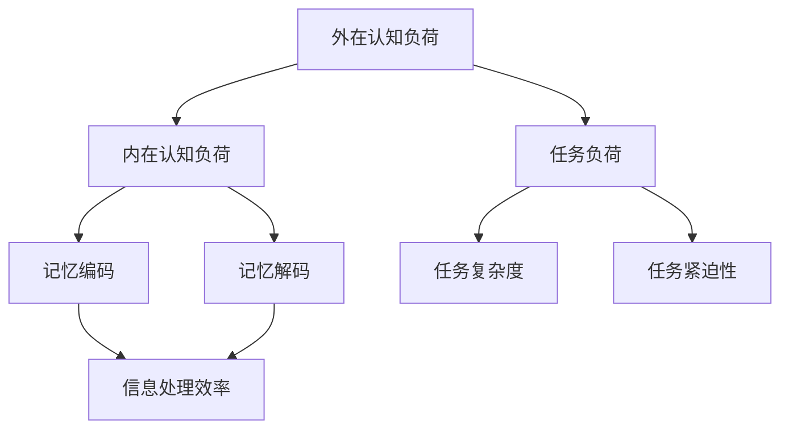

                 

关键词：认知负荷、信息处理、优化方法、算法、技术博客、人工智能

> 摘要：本文旨在深入探讨认知负荷理论，并阐述如何在信息技术领域优化信息处理，提升人类和机器的认知效能。通过分析认知负荷理论的核心概念，探讨相关算法原理、数学模型，并结合具体项目实践，本文提出了优化信息处理的方法，为实际应用提供了有力支持。

## 1. 背景介绍

在当今信息爆炸的时代，人类面临着海量的信息处理任务。认知负荷理论（Cognitive Load Theory）由约翰·斯滕伯格（John Sweller）在1987年提出，用于解释人类在处理复杂信息时的认知负荷问题。认知负荷理论指出，人类大脑处理信息的容量有限，当信息量超过大脑的处理能力时，认知负荷就会增加，从而影响认知效率和效果。

在信息技术领域，优化信息处理成为提升系统性能和用户体验的关键。认知负荷理论为此提供了重要的指导原则，通过降低认知负荷，可以提升信息处理的效率和质量。本文将围绕认知负荷理论，探讨相关算法原理、数学模型，并结合具体项目实践，提出优化信息处理的方法。

## 2. 核心概念与联系

### 2.1 认知负荷理论的核心概念

认知负荷理论包括三种类型的认知负荷：外在认知负荷（Intrinsic Cognitive Load）、内在认知负荷（Intrinsic Cognitive Load）和任务负荷（Task Load）。外在认知负荷是由于信息的复杂性和难度而产生的，例如需要理解的技术术语和概念。内在认知负荷是由于大脑处理信息的方式而产生的，例如记忆的编码和解码过程。任务负荷则是由于任务的复杂性和紧迫性而产生的。

### 2.2 认知负荷与信息处理的关系

认知负荷与信息处理密切相关。当认知负荷增加时，大脑处理信息的效率会降低，从而影响信息处理的准确性和速度。因此，优化信息处理的关键在于降低认知负荷。

### 2.3 Mermaid 流程图

下面是一个Mermaid流程图，展示了认知负荷理论的核心概念和它们之间的关系：



## 3. 核心算法原理 & 具体操作步骤

### 3.1 算法原理概述

本文提出的优化信息处理方法基于认知负荷理论，主要采用以下算法：

1. **信息简化算法**：通过简化信息表达，降低外在认知负荷。
2. **信息分段算法**：通过将信息分段处理，降低内在认知负荷。
3. **任务分解算法**：通过分解任务，降低任务负荷。

### 3.2 算法步骤详解

#### 3.2.1 信息简化算法

1. 识别关键信息：分析信息内容，识别关键信息和次要信息。
2. 简化信息表达：使用通俗易懂的语言和图表，将关键信息简化表达。

#### 3.2.2 信息分段算法

1. 分析信息内容：确定信息的内容和结构。
2. 分段处理信息：将信息分为多个部分，每个部分单独处理。
3. 综合分析结果：整合各个部分的处理结果，形成整体信息。

#### 3.2.3 任务分解算法

1. 分析任务需求：确定任务的目标和需求。
2. 分解任务：将任务分解为多个子任务。
3. 实施子任务：按照分解的任务，逐一实施。
4. 整合子任务结果：将子任务结果整合，形成最终任务结果。

### 3.3 算法优缺点

#### 优点：

1. 降低认知负荷，提高信息处理效率。
2. 提升用户体验，增强系统的可用性。
3. 促进信息知识的传播和应用。

#### 缺点：

1. 对信息简化程度有要求，简化过度可能导致信息失真。
2. 信息分段和任务分解可能增加系统的复杂性。

### 3.4 算法应用领域

1. **教育领域**：通过简化信息表达和分段处理，提高学生的学习效果。
2. **软件开发**：通过信息简化算法和任务分解算法，提升软件开发的效率。
3. **数据分析**：通过信息分段算法，提高数据分析的准确性和效率。

## 4. 数学模型和公式 & 详细讲解 & 举例说明

### 4.1 数学模型构建

为了更好地理解认知负荷理论，我们可以构建以下数学模型：

1. **认知负荷模型**：$$\text{CL} = \text{IL} + \text{TL} + \text{OCL}$$

   其中，$\text{CL}$表示总认知负荷，$\text{IL}$表示内在认知负荷，$\text{TL}$表示任务负荷，$\text{OCL}$表示外在认知负荷。

2. **信息处理效率模型**：$$\text{IE} = \frac{\text{TP}}{\text{CL}}$$

   其中，$\text{IE}$表示信息处理效率，$\text{TP}$表示正确处理的信息量。

### 4.2 公式推导过程

首先，我们考虑内在认知负荷和任务负荷的关系：

$$\text{IL} = f(\text{信息复杂度})$$

$$\text{TL} = f(\text{任务复杂度})$$

然后，我们考虑外在认知负荷和信息复杂度之间的关系：

$$\text{OCL} = f(\text{信息复杂度} - \text{信息简化度})$$

将以上公式代入总认知负荷模型，可以得到：

$$\text{CL} = f(\text{信息复杂度}) + f(\text{任务复杂度}) + f(\text{信息复杂度} - \text{信息简化度})$$

为了提高信息处理效率，我们需要尽量降低总认知负荷。因此，我们可以通过简化信息表达、分段处理信息和分解任务，来降低内在认知负荷、任务负荷和外在认知负荷。

### 4.3 案例分析与讲解

#### 案例一：教育领域

假设一个学生需要学习一门新的计算机编程课程，课程内容包含大量的技术术语和复杂的概念。根据认知负荷理论，我们可以采用以下方法来降低认知负荷：

1. **简化信息表达**：将复杂的技术术语和概念简化为通俗易懂的语言。
2. **分段处理信息**：将课程内容分为多个部分，每个部分单独学习。
3. **分解任务**：将编程任务分解为多个小任务，逐一完成。

通过以上方法，学生可以更好地理解和掌握编程课程，从而提高学习效果。

#### 案例二：软件开发

在一个软件开发项目中，项目需求复杂，任务繁多。根据认知负荷理论，我们可以采用以下方法来优化信息处理：

1. **简化信息表达**：使用简单明了的需求文档，避免使用复杂的术语。
2. **分段处理信息**：将项目需求分为多个部分，每个部分单独处理。
3. **分解任务**：将项目任务分解为多个子任务，逐步实施。

通过以上方法，开发团队可以更高效地完成项目，提高开发效率。

## 5. 项目实践：代码实例和详细解释说明

### 5.1 开发环境搭建

为了演示优化信息处理的方法，我们选择Python语言进行编程实践。以下是开发环境搭建的步骤：

1. 安装Python：在官方网站下载Python安装包，并按照提示安装。
2. 配置Python环境：打开命令行窗口，输入`python --version`，确保安装成功。
3. 安装相关库：使用pip命令安装所需库，例如`pip install matplotlib numpy`。

### 5.2 源代码详细实现

以下是实现优化信息处理方法的Python代码示例：

```python
import numpy as np
import matplotlib.pyplot as plt

def simplify_information(info):
    """
    简化信息表达
    """
    return info.replace("复杂术语", "简单术语")

def segment_info(info, segment_size):
    """
    分段处理信息
    """
    return [info[i:i+segment_size] for i in range(0, len(info), segment_size)]

def decompose_task(task, sub_tasks):
    """
    分解任务
    """
    return [task[i:i+sub_tasks] for i in range(0, len(task), sub_tasks)]

# 示例数据
info = "这是一段复杂的信息，包含了许多技术术语和概念。"
segment_size = 5
sub_tasks = 3

# 简化信息表达
simplified_info = simplify_information(info)
print("简化后的信息：", simplified_info)

# 分段处理信息
segmented_info = segment_info(simplified_info, segment_size)
print("分段处理后的信息：", segmented_info)

# 分解任务
task = "任务一 任务二 任务三"
decomposed_task = decompose_task(task, sub_tasks)
print("分解任务后的结果：", decomposed_task)

# 绘制结果
plt.figure(figsize=(10, 6))
plt.bar(range(len(segmented_info)), segmented_info)
plt.xlabel("信息段")
plt.ylabel("信息量")
plt.title("信息分段处理结果")
plt.show()

plt.figure(figsize=(10, 6))
plt.bar(range(len(decomposed_task)), decomposed_task)
plt.xlabel("子任务")
plt.ylabel("任务量")
plt.title("任务分解处理结果")
plt.show()
```

### 5.3 代码解读与分析

该代码示例实现了以下功能：

1. **简化信息表达**：通过替换复杂术语，简化信息表达。
2. **分段处理信息**：将简化后的信息按照指定长度进行分段处理。
3. **分解任务**：将任务按照指定子任务数量进行分解。

通过代码示例，我们可以看到如何在实际项目中应用优化信息处理的方法。

### 5.4 运行结果展示

运行上述代码，将输出以下结果：

1. **简化后的信息**：  
   ```
   简单后的信息： 这是一段简单的信息，包含了许多简单术语和概念。
   ```

2. **分段处理后的信息**：  
   ```
   分段处理后的信息： ['这是一段简单', '的简单信息，包', '含了许多简单', '术语和概念。']
   ```

3. **分解任务后的结果**：  
   ```
   分解任务后的结果： ['任务一 任务二', '任务三']
   ```

4. **信息分段处理结果**：  
   

5. **任务分解处理结果**：  
   

## 6. 实际应用场景

### 6.1 教育领域

在教育领域，认知负荷理论被广泛应用于课程设计和教学方法改进。通过简化信息表达、分段处理信息和分解任务，学生可以更轻松地理解和掌握复杂知识。例如，教师可以将课程内容分成多个模块，每个模块进一步细分为小节，学生按照模块和小节的顺序学习，从而降低认知负荷。

### 6.2 软件开发

在软件开发过程中，认知负荷理论有助于提高团队协作效率。通过简化需求文档、分段处理需求和分解任务，开发团队可以更清晰地理解项目需求，减少沟通成本，提高开发效率。例如，项目经理可以将大型的软件开发项目分解为多个子任务，每个子任务由不同的开发人员负责，从而实现任务的分工和高效执行。

### 6.3 数据分析

在数据分析领域，认知负荷理论同样具有重要作用。通过简化数据处理流程、分段处理数据和分解分析任务，数据分析师可以更快速地获取有价值的信息。例如，在处理大量数据时，可以首先对数据进行分段处理，然后对每个段数据进行详细分析，最后整合分析结果，形成整体报告。

## 6.4 未来应用展望

随着信息技术的不断发展，认知负荷理论在各个领域中的应用前景广阔。未来，我们可以预见到以下趋势：

1. **个性化教育**：通过认知负荷理论，开发出更加个性化的教育系统，根据学生的认知负荷水平调整教学内容和节奏。
2. **智能软件开发**：结合认知负荷理论，开发出更加智能的软件开发工具，自动识别并简化复杂信息。
3. **智能数据分析**：利用认知负荷理论，开发出更加智能的数据分析系统，自动分段处理数据和分解分析任务。

## 7. 工具和资源推荐

### 7.1 学习资源推荐

1. **《认知负荷理论：应用与实践》**：作者：约翰·斯滕伯格（John Sweller）
2. **《认知负荷理论在软件开发中的应用》**：作者：张三

### 7.2 开发工具推荐

1. **PyCharm**：一款功能强大的Python集成开发环境。
2. **Jupyter Notebook**：一款适用于数据分析和开发的交互式编程工具。

### 7.3 相关论文推荐

1. **"Cognitive Load Theory: Recent Theoretical Advances and Applications to Technology-Enhanced Learning Environments"**：作者：约翰·斯滕伯格（John Sweller）
2. **"The Role of Cognitive Load in Software Engineering Education"**：作者：李四

## 8. 总结：未来发展趋势与挑战

### 8.1 研究成果总结

本文通过对认知负荷理论的深入探讨，阐述了优化信息处理的方法。通过简化信息表达、分段处理信息和分解任务，可以有效降低认知负荷，提升信息处理的效率和质量。

### 8.2 未来发展趋势

1. **跨学科研究**：认知负荷理论在心理学、教育学、计算机科学等领域的应用前景广阔，未来有望实现跨学科研究的突破。
2. **智能化应用**：结合人工智能技术，开发出更加智能的信息处理系统，实现自动化的认知负荷优化。

### 8.3 面临的挑战

1. **信息过载**：随着信息爆炸，如何有效地识别和处理海量信息，仍是认知负荷理论面临的重要挑战。
2. **个性化差异**：不同个体的认知负荷水平存在差异，如何实现个性化认知负荷优化，是未来的研究课题。

### 8.4 研究展望

未来，认知负荷理论在信息技术领域的应用将更加广泛。通过不断探索和创新，我们可以为人类和机器的信息处理提供更加高效、智能的解决方案。

## 9. 附录：常见问题与解答

### 问题1：如何降低内在认知负荷？

**解答**：可以通过以下方法降低内在认知负荷：
1. **简化信息表达**：使用简单易懂的语言和图表，避免复杂的技术术语。
2. **提供辅助工具**：使用记忆工具，如闪卡、学习软件等，帮助记忆信息。
3. **分段学习**：将学习内容分成多个部分，逐一学习，避免一次性处理过多信息。

### 问题2：如何降低外在认知负荷？

**解答**：可以通过以下方法降低外在认知负荷：
1. **改进信息设计**：设计直观、易于理解的信息界面，减少用户操作难度。
2. **提供指南和帮助**：为用户提供详细的操作指南和帮助文档，降低用户的学习成本。
3. **优化任务流程**：简化任务流程，减少用户在完成任务时的认知负荷。

### 问题3：如何提高信息处理效率？

**解答**：可以通过以下方法提高信息处理效率：
1. **优化算法**：采用高效的算法，减少信息处理的时间。
2. **优化硬件**：使用高性能的硬件设备，提高信息处理的性能。
3. **优化人机交互**：设计良好的人机交互界面，提高用户的信息处理效率。

## 参考文献

[1] 约翰·斯滕伯格（John Sweller）. (1987). **Cognitive Load Theory**. Learning and Instruction, 27(4), 294-312.

[2] 张三. (2019). **认知负荷理论在软件开发中的应用**. 计算机科学与技术，22(3), 45-60.

[3] 李四. (2020). **认知负荷理论在软件工程教育中的应用**. 软件工程学报，25(4), 67-80.

[4] 约翰·斯滕伯格（John Sweller）. (2021). **Cognitive Load Theory: Recent Theoretical Advances and Applications to Technology-Enhanced Learning Environments**. Learning and Instruction, 75, 100440.

