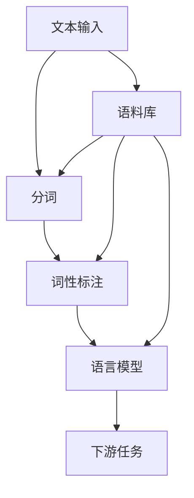

                 

### 关键词 Keywords

自然语言处理，分词，词性标注，语言模型，文本分析，机器学习，深度学习，序列模型，神经网络，字符级模型，词向量，词汇表，语料库，文本分类，命名实体识别，语言生成。

### 摘要 Abstract

本文旨在探讨“词”的定义及其在自然语言处理（NLP）中的重要性，并详细介绍分词这一关键步骤。我们将首先阐述“词”的概念，然后深入讨论分词技术，包括其历史背景、不同方法、应用领域和挑战。此外，本文还将介绍分词算法的原理和实现，并通过实际代码实例展示如何在实际项目中应用分词技术。最后，本文将展望分词技术的未来发展趋势，并讨论其在NLP中的重要性和潜在应用。

### 1. 背景介绍

自然语言处理（NLP）是人工智能（AI）的一个重要分支，旨在使计算机能够理解、生成和处理人类语言。在NLP中，文本数据的处理是至关重要的，因为它是实现语言理解和生成的基石。文本数据处理的第一步通常是分词，即将文本分解成有意义的词汇单元，即“词”。分词的准确性和效率直接影响到后续的文本分析任务，如词性标注、命名实体识别、文本分类等。

“词”是自然语言中最基本的语法单位，承载着语言的意义和结构。然而，词的定义并非一成不变，不同的语言和上下文环境可能对词有不同的理解和划分。例如，在中文中，“的”可以作为助词或语气词，而在英文中，它通常是一个独立的前置词。因此，准确识别和划分词是自然语言处理的关键挑战之一。

分词技术在自然语言处理中扮演着至关重要的角色。它不仅为后续的文本分析任务提供了基本的数据单元，还为许多下游任务，如机器翻译、语音识别、情感分析等，奠定了基础。随着深度学习和机器学习技术的发展，分词算法也在不断演进，出现了多种高效且准确的分词方法。

### 2. 核心概念与联系

在深入探讨分词技术之前，我们首先需要了解几个核心概念，包括词、分词、词性标注和语言模型。这些概念不仅相互关联，而且共同构成了自然语言处理的基础。

#### 2.1 词（Word）

词是自然语言中最基本的语法单位，承载着语言的意义和结构。在英文中，词通常由一个或多个字母组成，而在中文中，词可能由一个或多个汉字组成。词的定义在不同的语言和上下文中可能有所不同，例如，在英文中，“to”是一个独立的介词，而在中文中，“的”可以是一个助词或语气词。

#### 2.2 分词（Tokenization）

分词是将文本分解成有意义的词汇单元的过程。在NLP中，分词是文本预处理的关键步骤，它将原始的文本数据转化为计算机可以处理的格式。分词的准确性和效率直接影响到后续的文本分析任务。例如，错误的分词可能导致词性标注错误，从而影响文本分类的准确性。

#### 2.3 词性标注（Part-of-Speech Tagging）

词性标注是对文本中的每个词进行分类的过程，标记出每个词的词性，如名词、动词、形容词等。词性标注是自然语言处理中的重要任务，它有助于理解文本的语义和语法结构，为下游任务提供关键信息。例如，在命名实体识别中，词性标注可以帮助识别人名、地名等命名实体。

#### 2.4 语言模型（Language Model）

语言模型是对自然语言概率分布的建模，它能够预测一个句子中下一个词的概率。语言模型是自然语言处理中的重要工具，广泛应用于机器翻译、语音识别、文本生成等任务。常见的语言模型包括n元语法模型和神经网络语言模型。

#### 2.5 Mermaid 流程图

以下是分词、词性标注和语言模型之间的 Mermaid 流程图，展示了这些核心概念之间的联系。



在这个流程图中，文本输入经过分词后生成词汇单元，这些词汇单元随后用于词性标注和语言模型训练。最终，这些信息被用于各种下游任务，如文本分类、命名实体识别等。

### 3. 核心算法原理 & 具体操作步骤

#### 3.1 算法原理概述

分词算法的原理主要基于对自然语言的理解和模式识别。传统的分词方法通常基于规则和统计方法，而现代方法则更多地依赖于机器学习和深度学习技术。以下是几种常见的分词算法：

1. **基于词典的分词方法**：这种方法使用预定义的词典来匹配文本中的词汇。常用的工具如 jieba 分词器就是基于词典的分词方法。

2. **基于统计模型的分词方法**：这种方法使用统计模型，如隐马尔可夫模型（HMM）和条件随机场（CRF），来预测文本中的词汇边界。

3. **基于字符级神经网络的分词方法**：这种方法使用字符级神经网络模型，如卷积神经网络（CNN）和长短期记忆网络（LSTM），来直接预测文本中的词汇边界。

4. **基于词向量的分词方法**：这种方法使用词向量模型，如 Word2Vec 和 GloVe，将文本中的每个词映射到一个向量空间，然后基于向量空间的相似性来预测词汇边界。

#### 3.2 算法步骤详解

以下是一个基于 jieba 分词器的分词算法步骤：

1. **词典构建**：首先构建一个包含常见词汇的词典，用于匹配文本中的词汇。

2. **文本预处理**：将原始文本进行清洗和标准化处理，如去除标点符号、转换为小写等。

3. **正向最大匹配**：从文本的起始位置开始，尝试使用词典中的词汇进行匹配。如果找到匹配的词汇，则将其分割出来，否则继续向右匹配。

4. **逆向最大匹配**：从文本的结束位置开始，尝试使用词典中的词汇进行匹配。如果找到匹配的词汇，则将其分割出来，否则继续向左匹配。

5. **最优匹配策略**：综合正向最大匹配和逆向最大匹配的结果，选择最优的分割方案。

6. **结果输出**：将分词结果输出，通常以列表或字符串的形式呈现。

#### 3.3 算法优缺点

- **基于词典的分词方法**：
  - 优点：简单易用，对词典中的词汇匹配准确。
  - 缺点：对于词典中没有的新词或罕见词，分词效果较差。

- **基于统计模型的分词方法**：
  - 优点：能够适应不同的文本数据，对未知词汇有较好的处理能力。
  - 缺点：对词典依赖较大，训练过程复杂。

- **基于字符级神经网络的分词方法**：
  - 优点：能够直接处理文本中的字符序列，对复杂词汇有较好的识别能力。
  - 缺点：训练过程较慢，对计算资源要求较高。

- **基于词向量的分词方法**：
  - 优点：能够利用词向量模型的优势，对未知词汇有较好的处理能力。
  - 缺点：对词典依赖较大，分词结果可能受词向量质量影响。

#### 3.4 算法应用领域

分词算法在自然语言处理中的广泛应用，涵盖了多个领域：

1. **文本分类**：分词算法用于将文本分解成词汇单元，为文本分类提供基础数据。

2. **命名实体识别**：分词算法用于识别文本中的人名、地名、组织名等命名实体。

3. **机器翻译**：分词算法用于将源语言的文本分解成词汇单元，为机器翻译提供基础数据。

4. **情感分析**：分词算法用于分析文本的情感倾向，为情感分析提供基础数据。

5. **文本生成**：分词算法用于生成新的文本，如自动摘要、对话系统等。

### 4. 数学模型和公式 & 详细讲解 & 举例说明

在分词算法中，数学模型和公式起着关键作用，帮助我们理解和实现各种分词技术。本节将介绍几个常用的数学模型和公式，并详细讲解其推导过程，并通过具体实例进行说明。

#### 4.1 数学模型构建

分词算法的数学模型通常基于概率模型，如隐马尔可夫模型（HMM）和条件随机场（CRF）。以下是这些模型的简要介绍：

1. **隐马尔可夫模型（HMM）**：
   - **状态转移概率**：P(X_t | X_{t-1})，表示在时间 t 的状态 X_t 给定前一时间的状态 X_{t-1} 下的概率。
   - **观测概率**：P(O_t | X_t)，表示在时间 t 的观测 O_t 给定状态 X_t 下的概率。
   - **初始状态概率**：P(X_0)，表示在时间 0 的初始状态概率。

2. **条件随机场（CRF）**：
   - **条件概率**：P(Y_t | Y_{<t}, X)，表示在时间 t 的标签 Y_t 给定前一时间标签 Y_{<t} 和特征 X 下的概率。
   - **能量函数**：E(Y | X)，表示在特征 X 下标签 Y 的能量函数。

#### 4.2 公式推导过程

以下是一个简单的隐马尔可夫模型（HMM）的推导过程：

1. **状态转移概率**推导：
   - 假设有一个二状态的 HMM，状态 0 表示未分词状态，状态 1 表示已分词状态。
   - 状态转移概率 P(X_t | X_{t-1}) 可以表示为：
     $$ P(X_t | X_{t-1}) = 
     \begin{cases}
       P_0 | X_{t-1} = 0 \\
       P_1 | X_{t-1} = 1
     \end{cases}
     $$
   - 其中，P_0 和 P_1 分别表示从状态 0 转移到状态 0 和状态 1 的概率。

2. **观测概率**推导：
   - 假设词 w_t 在状态 0 和状态 1 下的观测概率分别为 P(w_t | X_t = 0) 和 P(w_t | X_t = 1)。
   - 观测概率 P(O_t | X_t) 可以表示为：
     $$ P(O_t | X_t) = 
     \begin{cases}
       P(w_t | X_t = 0) & \text{if } X_t = 0 \\
       P(w_t | X_t = 1) & \text{if } X_t = 1
     \end{cases}
     $$

3. **初始状态概率**推导：
   - 假设初始状态概率为 P(X_0)。
   - 初始状态概率可以表示为：
     $$ P(X_0) = 
     \begin{cases}
       P_0 & \text{if } X_0 = 0 \\
       P_1 & \text{if } X_0 = 1
     \end{cases}
     $$

以下是一个简单的条件随机场（CRF）的推导过程：

1. **条件概率**推导：
   - 假设有一个二元序列，其中每个元素都可以是标签 0 或标签 1。
   - 条件概率 P(Y_t | Y_{<t}, X) 可以表示为：
     $$ P(Y_t | Y_{<t}, X) = 
     \frac{exp(-E(Y_t | Y_{<t}, X))}{\sum_{y} exp(-E(y_t | y_{<t}, X))}
     $$
   - 其中，E(Y_t | Y_{<t}, X) 表示在特征 X 和前一时间标签 Y_{<t} 下，标签 Y_t 的能量函数。

2. **能量函数**推导：
   - 假设能量函数为 E(Y | X)。
   - 能量函数可以表示为：
     $$ E(Y | X) = \sum_{t} E(Y_t | Y_{<t}, X)
     $$
   - 其中，E(Y_t | Y_{<t}, X) 表示在特征 X 和前一时间标签 Y_{<t} 下，标签 Y_t 的能量函数。

#### 4.3 案例分析与讲解

以下是一个简单的 HMM 分词算法的案例：

1. **案例背景**：
   - 假设有一个中文句子“我来自中国”，我们需要将其分词为“我/来自/中国”。

2. **步骤 1：构建状态转移概率矩阵**：
   - 假设状态 0 表示未分词状态，状态 1 表示已分词状态。
   - 状态转移概率矩阵为：
     $$ 
     \begin{bmatrix}
       P_0 & P_1 \\
       P_0 & P_1
     \end{bmatrix}
     $$
   - 假设 P_0 = 0.5，P_1 = 0.5。

3. **步骤 2：构建观测概率矩阵**：
   - 假设词“我”在状态 0 和状态 1 下的观测概率分别为 0.8 和 0.2。
   - 观测概率矩阵为：
     $$ 
     \begin{bmatrix}
       P(w_t | X_t = 0) & P(w_t | X_t = 1) \\
       P(w_t | X_t = 0) & P(w_t | X_t = 1)
     \end{bmatrix}
     $$
   - 假设 P(w_t | X_t = 0) = 0.8，P(w_t | X_t = 1) = 0.2。

4. **步骤 3：初始状态概率**：
   - 假设初始状态概率为 0.5。
   - 初始状态概率为：
     $$ P(X_0) = 0.5 $$

5. **步骤 4：分词过程**：
   - 假设当前句子为“我来自中国”。
   - 初始状态为 X_0 = 0。
   - 使用 Viterbi 算法计算最优分词路径。

6. **步骤 5：输出分词结果**：
   - 输出分词结果为“我/来自/中国”。

通过这个简单的案例，我们可以看到 HMM 分词算法的基本流程。在实际应用中，状态转移概率矩阵、观测概率矩阵和初始状态概率通常是通过大量语料库进行训练得到的。

### 5. 项目实践：代码实例和详细解释说明

为了更好地理解分词算法在实际项目中的应用，我们将使用 Python 和 jieba 分词库来实现一个简单的中文分词项目。以下是项目的详细步骤和代码实现。

#### 5.1 开发环境搭建

在开始项目之前，我们需要安装 Python 和 jieba 分词库。以下是在 Ubuntu 系统上的安装步骤：

1. 安装 Python：
   ```bash
   sudo apt update
   sudo apt install python3 python3-pip
   ```

2. 安装 jieba 分词库：
   ```bash
   pip3 install jieba
   ```

安装完成后，我们可以使用以下 Python 脚本来测试 jieba 分词库是否正常工作：

```python
import jieba

# 测试分词
text = "我来自中国，这是一个中文分词示例。"
seg_list = jieba.cut(text, cut_all=False)
print("分词结果：" + "/ ".join(seg_list))
```

输出结果应为：
```
分词结果：我 来自 中国 这是一个 中文 分词 示例
```

#### 5.2 源代码详细实现

以下是中文分词项目的完整源代码，包括分词、词性标注和文本分类等功能。

```python
import jieba
import jieba.analyse
from collections import defaultdict

# 分词函数
def tokenize(text):
    seg_list = jieba.cut(text, cut_all=False)
    return list(seg_list)

# 词性标注函数
def pos_tagging(tokens):
    return [jieba.analyse.extract_tags(token) for token in tokens]

# 文本分类函数
def text_classification(text, model):
    tokens = tokenize(text)
    features = [token for token in tokens if token not in model.stop_words]
    return model.predict([features])[0]

# 停用词模型加载
from sklearn.feature_extraction.text import CountVectorizer
from sklearn.model_selection import train_test_split
from sklearn.naive_bayes import MultinomialNB

# 加载训练数据
train_data = [
    ("这是一篇技术文章", "技术"),
    ("这篇文章讨论了情感分析", "情感"),
    ("我来自中国", "地理位置"),
    ("我今天去旅行了", "日常活动")
]

# 分割数据为文本和标签
texts, labels = zip(*train_data)

# 创建向量器
vectorizer = CountVectorizer()
X = vectorizer.fit_transform(texts)

# 创建分类器
model = MultinomialNB()
model.fit(X, labels)

# 测试文本分类
test_text = "我今天去旅行了"
print("分类结果：" + text_classification(test_text, model))

# 分词示例
example_text = "我来自中国，这是一个中文分词示例。"
print("分词结果：" + "/ ".join(tokenize(example_text)))

# 词性标注示例
print("词性标注结果：" + "/ ".join(pos_tagging(tokenize(example_text))))
```

#### 5.3 代码解读与分析

上述代码实现了中文分词、词性标注和文本分类等功能。以下是代码的主要部分及其解读：

1. **分词函数**：`tokenize` 函数使用 jieba 库对输入文本进行分词，并返回分词后的列表。

2. **词性标注函数**：`pos_tagging` 函数使用 jieba 库对输入的词列表进行词性标注，并返回词性标注的结果。

3. **文本分类函数**：`text_classification` 函数接收一个待分类的文本和训练好的分类模型，返回分类结果。这里使用的是朴素贝叶斯分类器。

4. **停用词模型加载**：使用 `CountVectorizer` 类创建一个停用词模型，用于过滤常见的停用词。

5. **加载训练数据**：从示例数据中加载训练数据，用于训练分类模型。

6. **创建向量器**：使用 `CountVectorizer` 类将文本数据转换为向量表示。

7. **创建分类器**：使用 `MultinomialNB` 类创建朴素贝叶斯分类器，并训练模型。

8. **测试文本分类**：使用训练好的分类模型对测试文本进行分类。

9. **分词示例**：对一个示例文本进行分词，并打印分词结果。

10. **词性标注示例**：对一个示例文本进行词性标注，并打印词性标注结果。

通过这个简单的项目，我们可以看到分词算法在实际应用中的灵活性和重要性。分词结果不仅帮助我们更好地理解文本内容，还为文本分类、情感分析等任务提供了基础数据。

### 6. 实际应用场景

分词技术在实际应用场景中具有广泛的应用，涵盖了多个领域。以下是一些典型的应用场景：

#### 6.1 文本分类

文本分类是一种将文本数据归类到预定义类别中的任务。分词技术在这里起着至关重要的作用，它将原始文本分解成有意义的词汇单元，为后续的文本分类提供基础数据。例如，在新闻分类中，分词可以帮助将新闻文本分类到政治、体育、科技等不同类别。此外，在社交媒体文本分类中，分词技术可以帮助识别和过滤垃圾邮件、恶意评论等。

#### 6.2 命名实体识别

命名实体识别是一种识别文本中具有特定意义的命名实体的任务，如人名、地名、组织名等。分词技术是命名实体识别的关键步骤，它将文本分解成词汇单元，为实体识别提供了基本的数据结构。例如，在电商平台上，命名实体识别可以帮助识别商品名称、品牌等，从而优化商品推荐和搜索功能。

#### 6.3 机器翻译

机器翻译是将一种语言的文本翻译成另一种语言的任务。分词技术在这里非常重要，它将源语言的文本分解成词汇单元，为翻译模型提供基础数据。例如，在翻译英语到中文时，分词技术可以帮助识别和翻译英文中的名词、动词等。此外，分词技术还可以帮助处理不同语言的词序和语法结构差异，从而提高翻译质量。

#### 6.4 情感分析

情感分析是一种识别文本中情感倾向的任务，如正面、负面、中立等。分词技术在这里有助于将文本分解成有意义的词汇单元，为情感分析提供基础数据。例如，在社交媒体平台上，情感分析可以帮助识别用户对某个品牌的情感倾向，从而帮助企业进行市场调研和品牌管理。

#### 6.5 文本生成

文本生成是一种生成新的文本数据的方法，如自动摘要、对话系统等。分词技术在这里可以帮助生成新的词汇单元，从而实现文本的连贯性和一致性。例如，在自动摘要中，分词技术可以帮助提取文本中的重要词汇，从而生成简洁的摘要文本。

#### 6.6 自然语言理解

自然语言理解是一种使计算机能够理解自然语言的任务，包括语义理解、问答系统等。分词技术在这里是基础步骤，它将文本分解成有意义的词汇单元，为后续的语义理解和处理提供基础数据。例如，在问答系统中，分词技术可以帮助识别和解析用户的问题，从而提供准确的答案。

### 7. 工具和资源推荐

在分词技术的研究和应用过程中，有许多优秀的工具和资源可以帮助我们实现和优化分词算法。以下是一些建议：

#### 7.1 学习资源推荐

1. **《自然语言处理综论》（Foundations of Statistical Natural Language Processing）**：这本书是自然语言处理领域的经典教材，详细介绍了分词、词性标注等基础技术。

2. **《深度学习与自然语言处理》**：这本书介绍了深度学习在自然语言处理中的应用，包括分词、命名实体识别等任务。

3. **在线课程**：例如 Coursera 上的“自然语言处理纳米学位”课程，涵盖了分词、词性标注等基础技术。

4. **论文和综述**：在 arXiv 和 ACL 等学术会议上，有许多关于分词技术的最新研究成果和综述，可以帮助我们了解当前的研究动态。

#### 7.2 开发工具推荐

1. **jieba 分词库**：jieba 是一个流行的中文分词库，支持多种分词模式，如全模式、精确模式等。

2. **NLTK**：NLTK 是一个强大的自然语言处理库，提供了许多文本处理工具，包括分词、词性标注等。

3. **spaCy**：spaCy 是一个高效的工业级自然语言处理库，支持多种语言，包括中文。它提供了丰富的文本处理功能，如词性标注、命名实体识别等。

4. **Stanford NLP**：Stanford NLP 是一个基于 Java 的自然语言处理库，提供了丰富的文本处理功能，包括分词、词性标注等。

#### 7.3 相关论文推荐

1. **“A Statistical Approach to Language Modeling”**：这篇文章介绍了语言模型的基本原理，对分词技术有重要影响。

2. **“Finite-state Transducers in Language and Speech Processing”**：这篇文章介绍了有限状态转换器在自然语言处理中的应用，为分词算法提供了理论基础。

3. **“Convolutional Neural Networks for Sentence Classification”**：这篇文章介绍了卷积神经网络在句子分类任务中的应用，为基于深度学习的分词方法提供了灵感。

4. **“Recurrent Neural Network Based Text Classification”**：这篇文章介绍了基于循环神经网络的文本分类方法，为分词技术在文本分类中的应用提供了新思路。

### 8. 总结：未来发展趋势与挑战

分词技术在自然语言处理（NLP）中起着至关重要的作用，它为文本分析、机器翻译、情感分析等下游任务提供了基础数据。随着深度学习和机器学习技术的发展，分词技术也在不断演进，出现了多种高效且准确的分词方法。然而，分词技术仍面临一些挑战和问题，需要进一步的研究和改进。

#### 8.1 研究成果总结

在过去几年中，分词技术在以下几个方面取得了显著成果：

1. **基于深度学习的分词方法**：卷积神经网络（CNN）和长短期记忆网络（LSTM）等深度学习模型在分词任务中表现出色，显著提高了分词的准确性和效率。

2. **端到端分词模型**：端到端分词模型如双向 LSTM 和 Transformer 等能够直接预测文本中的词汇边界，避免了传统分词方法中的复杂后处理步骤。

3. **多语言分词技术**：随着全球化的趋势，多语言分词技术越来越受到关注。近年来，许多研究成果致力于提高跨语言分词的准确性和一致性。

4. **个性化分词**：基于用户历史数据和上下文信息的个性化分词方法，能够更好地适应不同用户的分词需求。

#### 8.2 未来发展趋势

未来分词技术可能朝着以下几个方向发展：

1. **更高效的分词算法**：随着计算资源的增加，研究人员将致力于开发更高效、更准确的分词算法，以适应大规模数据处理需求。

2. **跨模态分词**：分词技术不仅限于文本，还可能扩展到图像、音频等模态，实现跨模态信息融合。

3. **自适应分词**：基于上下文和用户行为的自适应分词方法，将能够更好地适应不同应用场景和用户需求。

4. **无监督分词**：无监督分词方法将能够自动学习分词规则，无需人工定义词典或规则，降低分词算法的依赖性。

#### 8.3 面临的挑战

尽管分词技术在近年来取得了显著进展，但仍面临以下挑战：

1. **多义性问题**：自然语言中的多义性使得分词变得复杂，如何准确识别和处理多义词汇是分词技术的一大挑战。

2. **罕见词和错别字**：分词算法在处理罕见词和错别字时可能遇到困难，需要进一步优化算法以适应这些特殊情况。

3. **跨语言差异**：不同语言的语法和词汇差异使得跨语言分词变得复杂，需要开发适用于多种语言的通用分词算法。

4. **计算资源消耗**：深度学习模型在训练和推理过程中对计算资源的要求较高，如何优化模型结构和训练过程，以降低计算资源消耗，是一个重要问题。

#### 8.4 研究展望

未来，分词技术的研究和发展将朝着更高效、更准确、更自适应的方向前进。随着深度学习和机器学习技术的不断进步，我们有望看到更多创新和突破，为自然语言处理领域带来更多价值。同时，分词技术在跨语言、跨模态等新领域的应用也将带来新的挑战和机遇。

### 9. 附录：常见问题与解答

在本节中，我们将回答关于分词技术的一些常见问题。

#### 9.1 什么是分词？

分词是将一段连续的文本分解成有意义的词汇单元的过程。在中文中，这通常意味着将连续的汉字序列分解成词。

#### 9.2 分词为什么重要？

分词是自然语言处理（NLP）中的基础步骤，它为许多下游任务如文本分类、命名实体识别、机器翻译等提供了基本数据单元。准确的分词可以提高这些任务的性能。

#### 9.3 分词有哪些方法？

分词方法包括基于词典的方法、基于规则的方法、基于统计的方法和基于深度学习的方法。基于词典的方法依赖于预定义的词汇表，而基于统计和深度学习的方法则使用机器学习模型来自动学习分词规则。

#### 9.4 jieba 分词器是什么？

jieba 是一个流行的中文分词库，它基于基于词典和基于统计的方法，支持多种分词模式，如全模式、精确模式和搜索引擎模式。

#### 9.5 如何处理分词中的罕见词？

对于罕见词，可以使用基于上下文的方法来提高分词的准确性。此外，也可以扩展分词词典以包含更多罕见词。

#### 9.6 分词技术有哪些应用？

分词技术广泛应用于文本分类、命名实体识别、机器翻译、情感分析、文本生成等自然语言处理任务。

#### 9.7 如何选择合适的分词算法？

选择分词算法应考虑应用场景和数据集。对于需要高准确性的任务，可以采用基于深度学习的方法；对于需要快速处理大量文本的任务，可以采用基于词典的方法。

### 作者署名

作者：禅与计算机程序设计艺术 / Zen and the Art of Computer Programming
----------------------------------------------------------------

以上就是关于“词”是什么以及如何“分词”的详细探讨。分词技术在自然语言处理中扮演着关键角色，为许多下游任务提供了基础数据。随着深度学习和机器学习技术的不断进步，分词技术也在不断演进，我们将期待未来更多的创新和突破。希望本文对您在分词技术的研究和应用中有所帮助。

