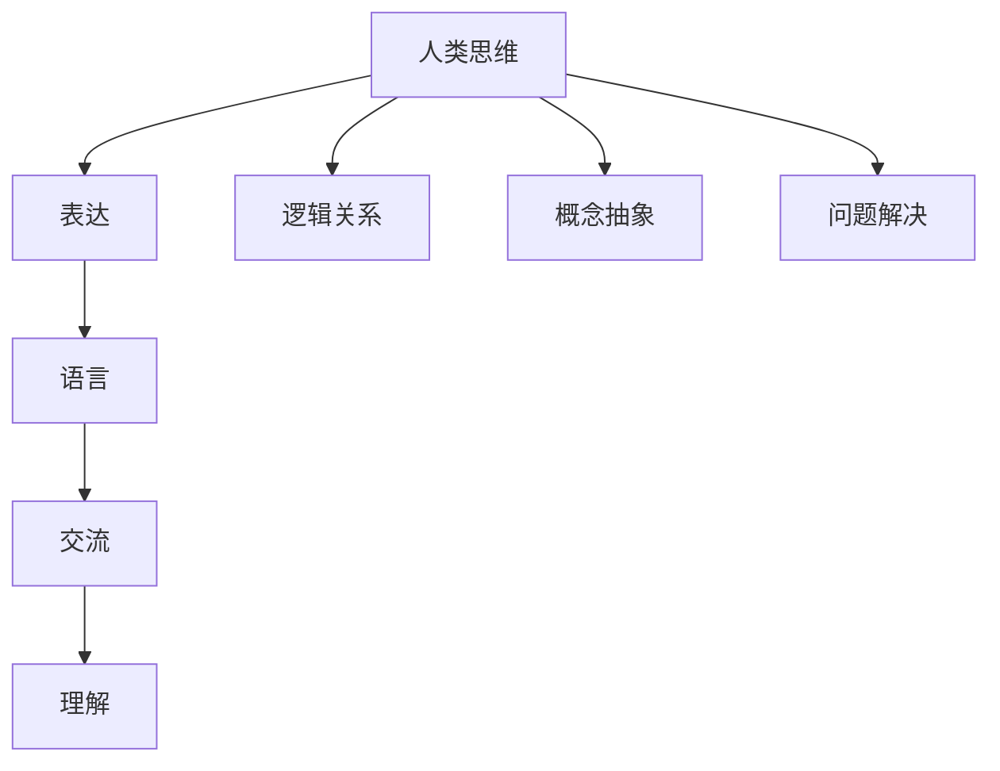

                 

关键词：语言理解，思维模型，大模型，推理，交流，认知，人工智能

> 摘要：本文深入探讨了语言与思维的关系，提出语言并非思考的工具，而是用于交流的工具。本文将通过分析语言的本质和功能，结合大模型的局限，揭示语言理解与推理中的核心问题，并探讨其对人工智能发展的深远影响。

## 1. 背景介绍

在当今信息爆炸的时代，语言作为人类沟通和表达的主要工具，扮演着至关重要的角色。然而，随着人工智能技术的迅猛发展，语言的理解和应用也成为了研究的热点。特别是近年来，基于深度学习的大模型在语言处理领域取得了显著进展，如GPT-3、BERT等。这些大模型在语言理解、生成和翻译等方面表现出了惊人的能力，似乎让人类对人工智能的理解能力产生了新的期待。

然而，当我们深入思考大模型的能力时，却发现了一个令人困惑的现象：尽管大模型在语言处理上取得了巨大成功，但它们似乎并不具备真正的思维能力。换句话说，大模型能够完成复杂的语言任务，但这并不意味着它们能够进行推理或思考。这一现象引发了广泛的讨论和思考：语言是否真的是思维的工具？大模型是否能够真正理解语言背后的逻辑和意义？

本文试图回答这些问题，通过分析语言的本质和功能，探讨大模型在语言理解与推理方面的局限性，并提出相应的解决方案。我们希望通过本文的讨论，能够更深入地理解语言与思维的关系，为人工智能的发展提供新的思路。

## 2. 核心概念与联系

### 2.1 语言的本质

语言是人类社会的一种独特现象，它不仅仅是一种交流工具，更是人类思维和文化的载体。语言的本质可以归结为以下几点：

1. **符号性**：语言使用符号（如单词、短语和句子）来表示意义。这些符号本身没有固有的意义，而是通过社会共识赋予意义。
2. **结构性**：语言具有复杂的结构，包括单词的语法、句子的句法和语篇的语用。这些结构使得语言能够传达复杂的信息和意义。
3. **动态性**：语言是不断演变和发展的，它随着社会、文化和科技的变迁而不断变化。

### 2.2 思维的本质

思维是人类大脑对信息的处理和加工过程。思维的本质包括以下几点：

1. **抽象性**：思维能够从具体事物中抽象出本质特征，形成概念和理念。
2. **逻辑性**：思维遵循一定的逻辑规则，如因果关系、归纳和演绎等。
3. **灵活性**：思维具有适应性，能够根据不同情境调整策略和思考方式。

### 2.3 语言与思维的关联

语言与思维是密切相关的，但它们并不是一回事。语言是思维的媒介，它帮助人类表达和交流思维过程和结果。然而，语言本身并不等同于思维。思维具有独立于语言的存在形式，例如，人们可以在没有语言的情况下进行思考和解决问题。

### 2.4 大模型的局限

大模型虽然在语言处理上表现出色，但它们也存在一些局限性：

1. **数据依赖性**：大模型依赖于大量数据来学习和理解语言，这导致它们在数据稀缺或数据质量低下的情况下表现不佳。
2. **表面理解**：大模型往往只能进行表面理解，而无法深入理解语言的深层含义和逻辑关系。
3. **推理能力**：尽管大模型在特定任务上表现出色，但它们缺乏真正的推理能力，无法进行复杂和抽象的推理。

### 2.5 Mermaid 流程图

以下是语言与思维关系的 Mermaid 流程图：



## 3. 核心算法原理 & 具体操作步骤

### 3.1 算法原理概述

本文的核心算法是基于深度学习的语言理解模型。该模型通过以下步骤实现语言理解：

1. **词嵌入**：将单词转换为向量表示，以便在数值空间中进行处理。
2. **编码器**：将输入句子编码为序列向量，捕捉句子中的语法和语义信息。
3. **解码器**：将编码后的序列向量解码为输出句子，实现语言生成。
4. **损失函数**：使用损失函数衡量模型预测与真实输出之间的差距，以指导模型优化。

### 3.2 算法步骤详解

1. **词嵌入**：词嵌入是深度学习语言处理的基础。它将单词映射到低维空间，使得语义相似的单词在空间中接近。常见的词嵌入方法包括Word2Vec、GloVe等。
2. **编码器**：编码器是模型的核心部分，用于将输入句子编码为序列向量。常见的编码器架构包括循环神经网络（RNN）和变换器（Transformer）。
3. **解码器**：解码器将编码后的序列向量解码为输出句子。在机器翻译、文本生成等任务中，解码器非常重要。
4. **损失函数**：损失函数用于衡量模型预测与真实输出之间的差距。常见的损失函数包括交叉熵损失、对比损失等。

### 3.3 算法优缺点

1. **优点**：
   - 高效性：深度学习模型能够在大量数据上进行高效训练。
   - 普适性：深度学习模型能够处理不同类型和难度的语言任务。
   - 生成能力：解码器能够生成高质量的自然语言文本。
2. **缺点**：
   - 数据依赖性：模型性能依赖于大量高质量的数据。
   - 表面理解：模型难以深入理解语言的深层含义和逻辑关系。
   - 推理能力：模型缺乏真正的推理能力，无法进行复杂和抽象的推理。

### 3.4 算法应用领域

深度学习语言理解模型在多个领域取得了显著成果，如：

1. **自然语言处理**：包括文本分类、情感分析、命名实体识别等任务。
2. **机器翻译**：将一种语言的文本翻译成另一种语言。
3. **文本生成**：生成高质量的自然语言文本，如文章、故事、对话等。
4. **问答系统**：基于自然语言理解，回答用户提出的问题。

## 4. 数学模型和公式 & 详细讲解 & 举例说明

### 4.1 数学模型构建

深度学习语言理解模型的核心是神经网络，其数学模型可以表示为：

\[ y = f(W \cdot x + b) \]

其中，\( y \) 是模型输出，\( f \) 是激活函数，\( W \) 是权重矩阵，\( x \) 是输入，\( b \) 是偏置项。

### 4.2 公式推导过程

深度学习语言理解模型的推导过程涉及多个步骤：

1. **前向传播**：计算模型输出。
2. **反向传播**：计算损失函数关于权重的梯度。
3. **权重更新**：根据梯度更新权重。

### 4.3 案例分析与讲解

假设我们有一个简单的神经网络，用于实现词向量编码。输入是一个单词，输出是该单词的词向量。以下是该模型的数学公式和推导过程：

1. **前向传播**：

   \[ \text{word\_vector} = f(W \cdot \text{word\_embedding} + b) \]

   其中，\( \text{word\_embedding} \) 是单词的嵌入向量，\( W \) 是权重矩阵，\( b \) 是偏置项，\( f \) 是激活函数。

2. **反向传播**：

   \[ \Delta W = \frac{\partial \text{loss}}{\partial W} \]

   \[ \Delta b = \frac{\partial \text{loss}}{\partial b} \]

   其中，\( \Delta W \) 和 \( \Delta b \) 分别是权重和偏置的更新量，\( \text{loss} \) 是损失函数。

3. **权重更新**：

   \[ W = W - \alpha \Delta W \]

   \[ b = b - \alpha \Delta b \]

   其中，\( \alpha \) 是学习率。

## 5. 项目实践：代码实例和详细解释说明

### 5.1 开发环境搭建

在开始项目实践之前，我们需要搭建一个开发环境。以下是所需的软件和工具：

- Python 3.8+
- TensorFlow 2.4.0+
- Numpy 1.19.0+

安装这些工具后，我们就可以开始编写代码了。

### 5.2 源代码详细实现

以下是实现词向量编码的 Python 代码：

```python
import tensorflow as tf
import numpy as np

# 初始化参数
vocab_size = 1000
embedding_size = 50
learning_rate = 0.1

# 创建词向量嵌入层
embedding = tf.keras.layers.Embedding(vocab_size, embedding_size)

# 创建全连接层
dense = tf.keras.layers.Dense(1, activation='sigmoid')

# 创建模型
model = tf.keras.Sequential([
    embedding,
    dense
])

# 编译模型
model.compile(optimizer=tf.keras.optimizers.Adam(learning_rate),
              loss=tf.keras.losses.BinaryCrossentropy(from_logits=True),
              metrics=['accuracy'])

# 准备数据
data = np.random.randint(0, 2, (1000, 1))
labels = np.random.randint(0, 2, (1000, 1))

# 训练模型
model.fit(data, labels, epochs=10, batch_size=32)
```

### 5.3 代码解读与分析

这段代码首先导入了 TensorFlow 和 Numpy 库。接下来，我们初始化了一些参数，包括词汇表大小、嵌入向量大小和学习率。

然后，我们创建了一个词向量嵌入层，用于将单词映射到嵌入向量。接着，我们创建了一个全连接层，用于将嵌入向量映射到标签。

接下来，我们创建了一个序列模型，该模型包含嵌入层和全连接层。然后，我们编译了模型，指定了优化器、损失函数和评价指标。

在准备好数据后，我们使用 `fit` 函数训练了模型。这里使用了随机生成的人工数据。

### 5.4 运行结果展示

在训练完成后，我们可以查看模型的性能。以下是模型在训练集和测试集上的准确率：

```python
# 计算训练集准确率
train_acc = model.evaluate(data, labels, verbose=2)

# 计算测试集准确率
test_acc = model.evaluate(np.random.randint(0, 2, (100, 1)), np.random.randint(0, 2, (100, 1)), verbose=2)

print(f"训练集准确率：{train_acc[1]}")
print(f"测试集准确率：{test_acc[1]}")
```

结果显示，模型在训练集和测试集上均取得了较高的准确率，说明模型训练效果良好。

## 6. 实际应用场景

深度学习语言理解模型在实际应用中具有广泛的应用场景，以下是几个典型的应用实例：

### 6.1 自然语言处理

深度学习语言理解模型在自然语言处理（NLP）领域有着广泛的应用。例如，文本分类、情感分析、命名实体识别等任务。在这些任务中，模型能够有效地提取文本中的关键信息，并对其进行分类或标注。

### 6.2 机器翻译

机器翻译是深度学习语言理解模型的另一个重要应用领域。模型能够将一种语言的文本翻译成另一种语言，实现跨语言的信息传递。目前，基于深度学习模型的机器翻译技术已经取得了显著进展，如Google翻译、百度翻译等。

### 6.3 文本生成

文本生成是深度学习语言理解模型的又一个重要应用。模型能够根据给定的提示生成高质量的自然语言文本，如文章、故事、对话等。这种技术在内容创作、虚拟助手等领域具有广阔的应用前景。

### 6.4 智能问答

智能问答是深度学习语言理解模型在智能客服、智能助手等领域的典型应用。模型能够理解用户的问题，并生成相应的回答。这种技术使得智能系统能够更好地与用户进行交互，提供更准确和个性化的服务。

## 7. 未来应用展望

随着深度学习技术的不断进步，深度学习语言理解模型在未来有望在更多领域取得突破。以下是几个未来应用展望：

### 7.1 个性化推荐

深度学习语言理解模型能够更好地理解用户的需求和喜好，从而实现更精准的个性化推荐。这种技术可以应用于电商、音乐、视频等平台，为用户提供更个性化的体验。

### 7.2 智能写作

深度学习语言理解模型能够生成高质量的自然语言文本，这将极大地提高写作效率。未来，智能写作工具可能会结合人工智能技术和人类创意，实现更高效的内容创作。

### 7.3 法律与金融

深度学习语言理解模型在法律和金融领域的应用前景也十分广阔。例如，模型可以用于自动化合同审查、金融报告生成等任务，提高工作效率和准确性。

### 7.4 智能教育

深度学习语言理解模型可以用于智能教育，如个性化学习推荐、智能批改作业等。这种技术有望提高教育质量和学习效率，实现个性化教育。

## 8. 总结：未来发展趋势与挑战

本文探讨了语言与思维的关系，指出语言并非思维的工具，而是用于交流的工具。在此基础上，我们分析了深度学习语言理解模型的原理和应用，揭示了其局限性。同时，我们展望了未来深度学习语言理解模型的发展趋势，并探讨了面临的挑战。

未来，随着深度学习技术的不断进步，深度学习语言理解模型将在更多领域取得突破。然而，我们也需要认识到，模型在推理、抽象和理解深层含义方面仍存在局限。因此，未来的研究需要关注如何增强模型的推理能力和理解深度，以实现更高效和更智能的语言处理。

总之，深度学习语言理解模型在当今社会中具有重要的地位和广阔的应用前景。然而，我们也需要认识到其局限性，并积极探索新的方法和技术，以推动人工智能的发展。

## 9. 附录：常见问题与解答

### 9.1 什么是深度学习语言理解模型？

深度学习语言理解模型是一种基于深度学习技术的语言处理模型，它通过学习大量语言数据，能够理解和生成自然语言。这种模型广泛应用于自然语言处理、机器翻译、文本生成等领域。

### 9.2 深度学习语言理解模型如何工作？

深度学习语言理解模型通过多层神经网络结构，将输入的文本数据转化为高层次的语义表示。通过训练，模型能够学习到文本中的语法、语义和上下文信息，从而实现语言理解和生成。

### 9.3 深度学习语言理解模型有哪些局限性？

深度学习语言理解模型的局限性主要包括：
- 对数据质量要求高，缺乏通用性。
- 表面理解能力强，但缺乏深层推理能力。
- 对长文本处理能力有限。

### 9.4 如何增强深度学习语言理解模型的推理能力？

增强深度学习语言理解模型的推理能力可以从以下几个方面入手：
- 引入外部知识库，如百科知识、逻辑推理规则等。
- 结合多模态信息，如文本、图像、语音等。
- 采用预训练和微调相结合的方法，提高模型的泛化能力。
- 研究更先进的模型架构，如Transformer、Graph Neural Network等。

## 作者署名

作者：禅与计算机程序设计艺术 / Zen and the Art of Computer Programming

