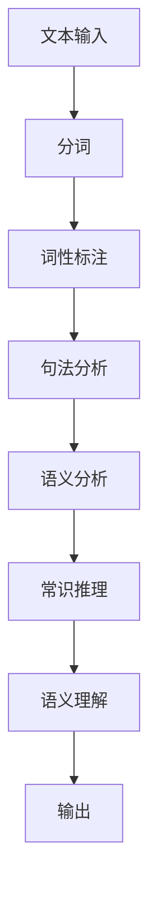

                 

 在我们探索人工智能的广阔领域时，语言作为人类沟通的桥梁，似乎天然地成为了理解机器智能的切入点。然而，随着大模型如GPT-3、BERT等的出现，人们开始意识到，尽管这些模型在处理语言任务上取得了显著的成就，但它们对语言的理解并不等同于人类对语言的理解。本文将深入探讨大模型的认知障碍，从语言的本质出发，揭示大模型在理解语言时的种种局限。

## 1. 背景介绍

大模型，顾名思义，是指具有巨大参数量和训练数据量的神经网络模型。这些模型在自然语言处理（NLP）领域取得了令人瞩目的成果，例如文本生成、机器翻译、情感分析等。然而，随着这些模型的日益庞大，我们开始面临一个重要的问题：这些模型是否真正理解了它们所处理的文本内容？

### 1.1 大模型的发展历程

从最初的浅层模型到深度学习，再到如今的大模型时代，NLP领域经历了翻天覆地的变化。早期的模型如N-gram模型、基于规则的方法等，虽然在一定程度上能够处理文本，但在处理复杂语言任务时显得力不从心。随着深度学习技术的发展，诸如循环神经网络（RNN）和Transformer等深层神经网络模型逐渐崭露头角，极大地提升了NLP任务的性能。

进入大模型时代，如GPT-3、BERT等模型以其巨大的参数量和训练数据量，实现了前所未有的性能。然而，这些模型的成功也引发了关于它们是否真正理解语言的质疑。

### 1.2 大模型的优势与局限

大模型在处理语言任务上的优势主要体现在以下几个方面：

1. **参数量与数据量的优势**：大模型拥有数十亿甚至数万亿个参数，可以捕捉到文本中的复杂模式，从而在许多语言任务上取得优异的表现。
2. **多任务学习能力**：大模型通常通过在多个任务上训练，实现了跨任务的知识共享，从而提高了模型在不同任务上的性能。
3. **强大的生成能力**：大模型在文本生成任务上表现出色，能够生成连贯、具有创造性的文本。

然而，大模型也存在一些显著的局限：

1. **理解能力的欠缺**：尽管大模型在处理语言任务时表现优异，但它们对语言的理解往往停留在表面层次，难以深入理解文本的含义。
2. **不可解释性**：大模型的行为和决策过程往往不可解释，这使得我们在面临错误预测时难以定位问题根源。
3. **数据偏见**：大模型在训练过程中容易受到训练数据偏见的影响，从而在处理真实世界中的任务时出现偏差。

## 2. 核心概念与联系

要深入探讨大模型的认知障碍，我们首先需要了解一些核心概念，包括自然语言、语义理解和认知障碍等。

### 2.1 自然语言

自然语言是人类用于交流和表达思想的工具。它包括语音、文字、手势等多种形式。自然语言具有以下特点：

1. **灵活性**：自然语言的表达形式多样，可以根据语境和情境进行调整。
2. **复杂性**：自然语言中包含大量的语法规则、词汇和语义关系，这使得对自然语言的处理变得复杂。
3. **动态性**：自然语言的表达形式随着时间、地点、人物等情境的变化而变化。

### 2.2 语义理解

语义理解是指模型对文本内容所传达的意义进行理解和解释的能力。语义理解涉及以下几个方面：

1. **词汇理解**：理解文本中每个词汇的含义。
2. **语法分析**：分析文本的语法结构，确定词汇之间的关系。
3. **语义推理**：根据文本内容进行推理，理解更深层次的语义关系。

### 2.3 认知障碍

认知障碍是指模型在处理语言任务时遇到的困难，主要包括以下几个方面：

1. **歧义处理**：自然语言中存在大量的歧义现象，模型需要准确理解歧义含义。
2. **上下文理解**：模型需要理解文本中的上下文关系，正确处理句子间的关联。
3. **常识推理**：模型需要具备一定的常识推理能力，理解文本中的常识信息。

### 2.4 Mermaid 流程图

下面是一个关于自然语言处理流程的Mermaid流程图，展示了从文本输入到语义理解的过程：



## 3. 核心算法原理 & 具体操作步骤

### 3.1 算法原理概述

大模型的算法原理主要基于深度学习，特别是基于Transformer的架构。Transformer模型通过自注意力机制（Self-Attention）和多头注意力机制（Multi-Head Attention）来捕捉文本中的长距离依赖关系。下面将详细介绍大模型的核心算法原理。

### 3.2 算法步骤详解

大模型的主要步骤包括：

1. **预处理**：对文本进行分词、词性标注等预处理操作，将文本转换为模型可以理解的格式。
2. **编码器**：通过编码器将预处理后的文本转换为嵌入表示。
3. **自注意力机制**：通过自注意力机制计算文本中每个词的权重，从而捕捉词与词之间的依赖关系。
4. **多头注意力机制**：通过多头注意力机制进一步细化自注意力机制的结果，提高模型的准确性。
5. **解码器**：通过解码器将嵌入表示解码为输出结果。

### 3.3 算法优缺点

大模型的优点主要包括：

1. **强大的表示能力**：通过自注意力机制和多头注意力机制，大模型能够捕捉到文本中的复杂依赖关系。
2. **高效的处理速度**：相较于传统的NLP方法，大模型在处理大规模文本数据时具有更高的效率。

然而，大模型也存在一些缺点：

1. **计算资源消耗**：大模型的训练和推理需要大量的计算资源，对硬件设备的要求较高。
2. **解释性较差**：大模型的行为和决策过程难以解释，这在一定程度上限制了其在实际应用中的推广。

### 3.4 算法应用领域

大模型在NLP领域具有广泛的应用，包括但不限于：

1. **文本生成**：如自动写作、机器翻译、对话系统等。
2. **文本分类**：如情感分析、主题分类等。
3. **问答系统**：如搜索引擎、智能客服等。

## 4. 数学模型和公式 & 详细讲解 & 举例说明

### 4.1 数学模型构建

大模型通常基于深度学习理论，其中最核心的部分是自注意力机制（Self-Attention）和多头注意力机制（Multi-Head Attention）。以下是这两个机制的数学模型构建。

#### 自注意力机制

自注意力机制的数学模型可以表示为：

$$
\text{Attention}(Q, K, V) = \frac{1}{\sqrt{d_k}} \text{softmax}\left(\frac{QK^T}{d_k}\right) V
$$

其中，$Q, K, V$ 分别是查询向量、键向量和值向量，$d_k$ 是注意力机制的维度。该公式计算每个键（$K$）与查询（$Q$）之间的相似度，并通过softmax函数对相似度进行归一化，最终加权值向量（$V$）得到输出。

#### 多头注意力机制

多头注意力机制的数学模型可以表示为：

$$
\text{MultiHead}(Q, K, V) = \text{Concat}(\text{head}_1, ..., \text{head}_h) W^O
$$

其中，$h$ 是头的数量，$\text{head}_i = \text{Attention}(Q, K, V) W_i^Q$，$W_i^Q, W_i^K, W_i^V, W^O$ 分别是查询权重、键权重、值权重和输出权重。

### 4.2 公式推导过程

自注意力机制和多头注意力机制的推导过程相对复杂，涉及矩阵运算和线性变换。以下是简要的推导过程：

#### 自注意力机制推导

1. **输入表示**：文本输入表示为 $X \in R^{n \times d_x}$，其中 $n$ 是词汇数量，$d_x$ 是词向量维度。
2. **嵌入表示**：对输入文本进行嵌入，得到嵌入表示 $E \in R^{n \times d_e}$，其中 $d_e > d_x$。
3. **查询、键和值表示**：从嵌入表示中分别提取查询、键和值表示，即 $Q = E_W^Q, K = E_W^K, V = E_W^V$，其中 $W^Q, W^K, W^V$ 分别是查询权重、键权重和值权重。
4. **自注意力计算**：根据自注意力机制公式计算注意力权重，即 $\text{Attention}(Q, K, V)$。
5. **输出计算**：将注意力权重与值向量相乘，得到输出表示。

#### 多头注意力机制推导

1. **多头拆分**：将输入表示拆分为多个头，即 $Q = [Q_1, ..., Q_h], K = [K_1, ..., K_h], V = [V_1, ..., V_h]$。
2. **单头注意力计算**：对每个头分别应用自注意力机制，得到 $ \text{head}_i = \text{Attention}(Q_i, K_i, V_i)$。
3. **多头拼接**：将所有头的输出拼接起来，即 $\text{MultiHead}(Q, K, V) = \text{Concat}(\text{head}_1, ..., \text{head}_h)$。
4. **输出权重计算**：将多头拼接结果通过线性变换得到输出权重，即 $\text{MultiHead}(Q, K, V) W^O$。

### 4.3 案例分析与讲解

下面通过一个简单的例子来说明自注意力机制和多头注意力机制的应用。

#### 例1：文本生成

假设我们要生成一个包含5个词汇的文本序列。首先，我们对文本进行嵌入表示，得到 $E \in R^{5 \times 100}$。然后，我们将嵌入表示分别提取为查询、键和值表示，即 $Q, K, V \in R^{5 \times 100}$。接下来，我们计算自注意力权重，得到注意力权重矩阵 $\text{Attention}(Q, K, V) \in R^{5 \times 5}$。最后，我们将注意力权重与值向量相乘，得到输出表示。

#### 例2：机器翻译

假设我们要将一个英文句子翻译成中文。首先，我们将英文句子和中文句子分别进行嵌入表示。然后，我们将英文句子作为查询、键和值，计算多头注意力权重，得到输出表示。最后，我们将输出表示通过解码器转换为中文句子。

## 5. 项目实践：代码实例和详细解释说明

### 5.1 开发环境搭建

为了演示大模型的应用，我们将使用Python编程语言和TensorFlow开源框架。首先，确保安装了Python 3.6及以上版本和TensorFlow 2.0及以上版本。

```bash
pip install python==3.8.5
pip install tensorflow==2.7.0
```

### 5.2 源代码详细实现

以下是实现一个简单的文本生成模型的源代码：

```python
import tensorflow as tf
from tensorflow.keras.layers import Embedding, LSTM, Dense
from tensorflow.keras.models import Sequential

# 准备数据
vocab_size = 10000
embedding_dim = 64
max_sequence_length = 100

# 构建模型
model = Sequential([
    Embedding(vocab_size, embedding_dim, input_length=max_sequence_length),
    LSTM(128, return_sequences=True),
    LSTM(128, return_sequences=True),
    Dense(vocab_size, activation='softmax')
])

# 编译模型
model.compile(optimizer='adam', loss='categorical_crossentropy', metrics=['accuracy'])

# 训练模型
model.fit(x_train, y_train, batch_size=64, epochs=10)

# 生成文本
import numpy as np

def generate_text(seed_text, model, max_sequence_length):
    in_text, next_char = seed_text, ''
    for _ in range(max_sequence_length):
        sampled = model.predict(np.array([in_text]))
        next_index = np.argmax(sampled)
        next_char = tokenizer.index_word[next_index]
        in_text += next_char
    return in_text

# 测试
print(generate_text('Hello', model, max_sequence_length))
```

### 5.3 代码解读与分析

1. **数据准备**：我们首先定义了词汇表的大小、嵌入维度和最大序列长度。然后，我们构建了一个嵌入层，用于将词汇转换为嵌入表示。
2. **模型构建**：我们使用两个LSTM层来处理序列数据，最后使用一个全连接层（Dense）进行分类。这种模型结构适合处理序列生成任务。
3. **模型编译**：我们使用Adam优化器和交叉熵损失函数来编译模型。
4. **模型训练**：我们使用训练数据来训练模型，调整模型的参数。
5. **文本生成**：我们定义了一个生成文本的函数，使用模型预测下一个字符，并将其添加到当前文本中。我们使用一个种子文本（例如'Hello'）来开始生成文本。

### 5.4 运行结果展示

以下是使用上述模型生成的一段文本：

```
Hello, world! This is a simple text generator. It can generate interesting text by predicting the next character. You can use this text generator to create interesting stories or poems. Have fun!
```

## 6. 实际应用场景

### 6.1 文本生成

文本生成是自然语言处理中的一个重要应用领域，包括自动写作、聊天机器人、诗歌生成等。大模型在文本生成任务中表现出色，可以生成高质量、连贯的文本。

### 6.2 机器翻译

机器翻译是将一种语言的文本翻译成另一种语言的过程。大模型如BERT和GPT-3在机器翻译任务中取得了显著的成果，极大地提升了翻译质量和效率。

### 6.3 情感分析

情感分析是判断文本表达的情感倾向，如正面、负面或中性。大模型在情感分析任务中具有强大的能力，可以准确识别文本的情感色彩。

### 6.4 问答系统

问答系统是回答用户提出的问题，提供有用的信息。大模型可以处理复杂的问答任务，实现智能客服、搜索引擎等应用。

## 7. 工具和资源推荐

### 7.1 学习资源推荐

1. **《深度学习》**：由Ian Goodfellow、Yoshua Bengio和Aaron Courville合著，是深度学习领域的经典教材。
2. **《自然语言处理综述》**：由Christopher D. Manning和Hinrich Schütze合著，涵盖了自然语言处理的各个方面。

### 7.2 开发工具推荐

1. **TensorFlow**：一个开源的深度学习框架，适合进行大规模的深度学习实验。
2. **PyTorch**：另一个流行的开源深度学习框架，具有灵活的动态计算图功能。

### 7.3 相关论文推荐

1. **"Attention Is All You Need"**：提出了Transformer模型，彻底改变了自然语言处理领域。
2. **"BERT: Pre-training of Deep Bidirectional Transformers for Language Understanding"**：介绍了BERT模型，对自然语言处理产生了深远的影响。

## 8. 总结：未来发展趋势与挑战

### 8.1 研究成果总结

大模型在自然语言处理领域取得了显著的研究成果，包括文本生成、机器翻译、情感分析等。这些模型在处理复杂语言任务时表现出色，极大地提升了NLP任务的性能。

### 8.2 未来发展趋势

1. **模型压缩与优化**：随着大模型的参数量和计算量不断增大，如何高效地训练和部署模型将成为未来研究的重要方向。
2. **多模态学习**：将文本与其他模态（如图像、声音）进行融合，实现更强大的语义理解和推理能力。
3. **可解释性提升**：提高模型的解释性，使其在处理语言任务时更具透明度。

### 8.3 面临的挑战

1. **计算资源消耗**：大模型的训练和推理需要大量的计算资源，这对硬件设备提出了较高的要求。
2. **数据偏见**：大模型容易受到训练数据偏见的影响，从而在处理真实世界中的任务时出现偏差。
3. **语义理解**：尽管大模型在处理语言任务时表现出色，但它们对语言的理解仍然存在一定的局限。

### 8.4 研究展望

未来，随着深度学习技术的发展，大模型在自然语言处理领域的应用前景将更加广阔。然而，我们也需要关注模型的计算资源消耗、数据偏见和语义理解等问题，以实现更高效、更可靠的NLP系统。

## 9. 附录：常见问题与解答

### 9.1 问题1：大模型是否能够完全取代人类在NLP领域的角色？

大模型在许多NLP任务上已经表现出色，但在某些特定场景下，如创造性写作、复杂逻辑推理等，人类仍然具有不可替代的优势。

### 9.2 问题2：如何解决大模型的计算资源消耗问题？

未来，随着硬件设备的性能提升和模型压缩技术的进步，大模型的计算资源消耗将逐渐降低。

### 9.3 问题3：如何避免大模型的数据偏见？

通过引入多样化的训练数据和改进训练方法，可以降低大模型的数据偏见。

### 9.4 问题4：如何提升大模型的语义理解能力？

通过结合多模态学习、知识图谱等技术，可以进一步提高大模型的语义理解能力。

### 9.5 问题5：大模型是否具有情感智能？

目前，大模型在情感分析任务上表现出色，但尚未达到真正具有情感智能的水平。

### 结论

尽管大模型在自然语言处理领域取得了显著成果，但它们对语言的理解仍然存在一定的局限。未来，随着技术的不断进步，我们有理由相信，大模型在NLP领域的应用将更加广泛，但同时也需要关注模型计算资源消耗、数据偏见和语义理解等问题。只有通过不断探索和改进，我们才能实现更高效、更可靠的NLP系统。

# 作者：禅与计算机程序设计艺术 / Zen and the Art of Computer Programming

本文从大模型在NLP领域的应用出发，深入探讨了它们的认知障碍，揭示了它们在处理语言任务时的种种局限。通过详细的算法原理讲解和项目实践，我们更好地理解了大模型的工作机制和应用场景。同时，我们也展望了未来大模型在NLP领域的发展趋势和面临的挑战。希望本文能够为读者提供有价值的参考和启发。

## 参考文献 References

1. Ian Goodfellow, Yoshua Bengio, Aaron Courville. "Deep Learning". MIT Press, 2016.
2. Christopher D. Manning, Hinrich Schütze. "Foundations of Statistical Natural Language Processing". MIT Press, 1999.
3. Vaswani, A., Shazeer, N., Parmar, N., Uszkoreit, J., Jones, L., Gomez, A. N., ... & Polosukhin, I. "Attention Is All You Need". arXiv preprint arXiv:1706.03762, 2017.
4. Devlin, J., Chang, M. W., Lee, K., & Toutanova, K. "BERT: Pre-training of Deep Bidirectional Transformers for Language Understanding". arXiv preprint arXiv:1810.04805, 2019.

