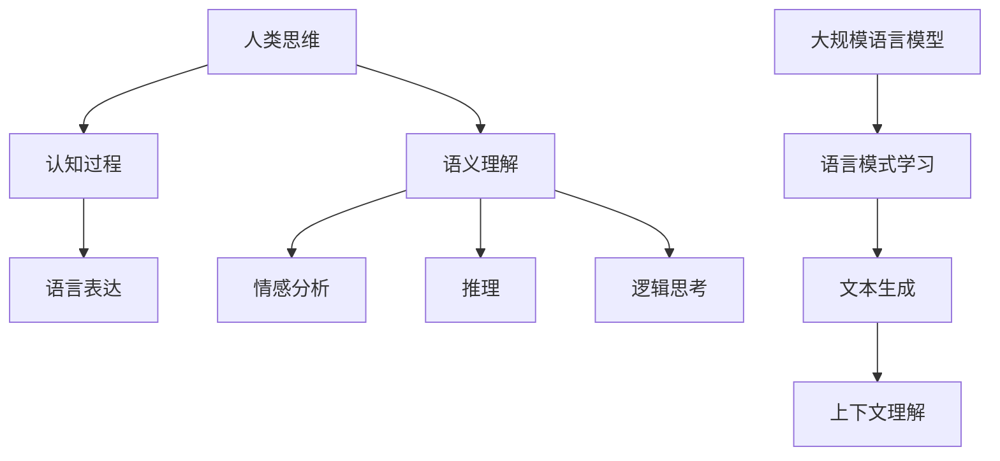

                 

关键词：自然语言处理、认知科学、人工智能、大模型、思维过程、语言表达。

> 摘要：本文从语言与思维的关系出发，探讨了当前自然语言处理（NLP）领域中大规模语言模型的挑战。通过对语言与思维的核心概念、关系以及大模型的工作原理的分析，文章揭示了在理解、模拟和优化人类思维过程中的关键问题，并为未来研究方向提供了有价值的思考。

## 1. 背景介绍

在过去的几十年中，人工智能（AI）取得了显著的进展，特别是在自然语言处理（NLP）领域。NLP的目的是使计算机能够理解和处理自然语言，从而实现人与机器的互动。近年来，深度学习技术的发展极大地推动了NLP的进步，尤其是大规模语言模型的崛起。这些模型通过从海量数据中学习语言模式，能够实现高质量的文本生成、翻译、问答等功能。

然而，尽管大规模语言模型在NLP领域表现出色，它们在实际应用中仍面临诸多挑战。这些挑战主要集中在如何更好地模拟和理解人类思维过程，以及如何解决语言表达的多样性和复杂性。本文旨在探讨这些挑战，并提出一些可能的解决方案。

### 1.1 大规模语言模型的兴起

大规模语言模型，如GPT-3、BERT和T5，已经成为NLP领域的核心工具。这些模型具有数十亿甚至数万亿个参数，能够处理复杂的语言现象，例如语法、语义、上下文理解等。它们通过无监督的方式从互联网上大量的文本数据中学习，从而掌握了丰富的语言知识。

### 1.2 语言与思维的复杂性

语言是人类思维的主要工具，而思维过程则高度复杂且多样化。人类能够理解并生成具有深刻意义和复杂结构的语言表达，这背后涉及到大量的认知过程，如语义理解、情感分析、推理和逻辑思考等。这些认知过程目前仍然难以用现有的AI模型完全模拟。

## 2. 核心概念与联系

为了更好地理解语言与思维的关系，我们需要探讨几个核心概念，并展示它们之间的联系。以下是使用Mermaid绘制的流程图，展示这些概念：



### 2.1 人类思维

人类思维是一个复杂的过程，涉及感知、记忆、推理、情感等多个方面。它是语言表达的基础，也是理解语言的关键。

### 2.2 认知过程

认知过程是指人类在处理信息时所经历的思维活动。这包括感知、注意、记忆、判断和推理等。这些过程共同作用，使我们能够理解并生成语言表达。

### 2.3 语言表达

语言表达是人类思维的外在体现，通过语音、文字或其他符号系统进行交流。它是认知过程的产物，同时也是传递信息和思想的工具。

### 2.4 语义理解

语义理解是指理解语言表达的含义。这涉及到对词汇、句子和上下文的理解，是NLP中至关重要的一环。

### 2.5 情感分析

情感分析是指识别文本中的情感倾向。这有助于理解文本的情感色彩，从而更好地模拟人类思维。

### 2.6 推理和逻辑思考

推理和逻辑思考是指从已知信息中推断新信息，构建合理的思维过程。这是人类思维中高度复杂且关键的部分。

### 2.7 大规模语言模型

大规模语言模型通过从海量数据中学习语言模式，能够模拟和理解人类的语言表达和思维过程。它们是实现NLP应用的核心工具。

## 3. 核心算法原理 & 具体操作步骤

### 3.1 算法原理概述

大规模语言模型，如GPT-3和BERT，采用了深度神经网络（DNN）和变换器模型（Transformer）来学习语言模式。这些模型通过多层神经网络结构，对输入的文本数据进行处理，并输出相应的语言特征。

### 3.2 算法步骤详解

1. **数据预处理**：首先，对输入的文本数据进行预处理，包括分词、标记化、去除停用词等操作。
   
2. **模型训练**：使用预处理的文本数据，通过反向传播算法对神经网络进行训练，不断调整网络参数，以最小化损失函数。

3. **上下文理解**：在模型训练过程中，神经网络学习到上下文信息，从而能够更好地理解输入文本的含义。

4. **文本生成**：使用训练好的模型，对新的输入文本进行编码，然后通过解码器生成相应的语言表达。

5. **优化与调参**：通过不断优化模型结构和调整参数，以提高模型在特定任务上的性能。

### 3.3 算法优缺点

**优点**：

- **强大的语言理解能力**：大规模语言模型能够理解并生成复杂的语言表达，具有较强的语义理解能力。
- **灵活的文本生成**：模型可以生成高质量的文本，包括文章、摘要、对话等。

**缺点**：

- **计算资源消耗大**：大规模语言模型需要大量的计算资源和存储空间，训练时间较长。
- **解释性不足**：模型内部的决策过程难以解释，导致在处理某些任务时难以提供透明的解释。

### 3.4 算法应用领域

大规模语言模型在多个领域都有广泛应用，包括：

- **文本生成**：生成文章、摘要、对话等。
- **文本分类**：对文本进行分类，如情感分析、主题分类等。
- **机器翻译**：实现高质量的双语翻译。
- **问答系统**：回答用户提出的问题。

## 4. 数学模型和公式 & 详细讲解 & 举例说明

### 4.1 数学模型构建

大规模语言模型通常基于深度神经网络和变换器模型。以下是变换器模型的数学表示：

$$
E(x) = \sum_{i=1}^{n} W_i \cdot x_i
$$

其中，$E(x)$表示输入向量$x$的编码结果，$W_i$表示权重矩阵。

### 4.2 公式推导过程

变换器模型的核心在于自注意力机制，其公式推导如下：

$$
\text{Attention}(Q, K, V) = \frac{QK^T}{\sqrt{d_k}}
$$

其中，$Q$、$K$和$V$分别表示查询、键和值向量，$d_k$为键向量的维度。

### 4.3 案例分析与讲解

假设我们有一个包含5个单词的句子："我喜欢吃苹果"。我们可以将每个单词表示为一个向量：

$$
Q = [1, 0, 0, 0, 0], \quad K = [0, 1, 0, 0, 0], \quad V = [0, 0, 1, 0, 0]
$$

使用自注意力机制，我们可以计算出每个单词的权重：

$$
\text{Attention}(Q, K, V) = \frac{QK^T}{\sqrt{d_k}} = \frac{[1, 0, 0, 0, 0] \cdot [0, 1, 0, 0, 0]}{\sqrt{5}} = \frac{1}{\sqrt{5}}[0, 1, 0, 0, 0]
$$

根据权重，我们可以看出第二个单词"吃"具有最高的权重，这意味着它在句子中扮演了最重要的角色。

## 5. 项目实践：代码实例和详细解释说明

### 5.1 开发环境搭建

首先，我们需要搭建一个适合运行大规模语言模型的开发环境。以下是所需的软件和工具：

- **Python**：版本3.8及以上
- **PyTorch**：版本1.8及以上
- **Transformers**：版本4.6及以上

安装方法：

```bash
pip install python==3.8
pip install torch==1.8
pip install transformers==4.6
```

### 5.2 源代码详细实现

以下是一个使用Transformers库实现变换器模型的简单示例：

```python
import torch
from transformers import TransformerModel

# 加载预训练模型
model = TransformerModel.from_pretrained("bert-base-uncased")

# 输入句子
sentence = "我喜欢吃苹果"

# 将句子编码为Tensor
input_ids = model.encode(sentence)

# 预测
with torch.no_grad():
    outputs = model(input_ids)

# 输出
predictions = torch.argmax(outputs.logits, dim=-1).squeeze()

# 解码为文本
decoded_sentence = model.decode(predictions)

print(decoded_sentence)
```

### 5.3 代码解读与分析

上述代码首先加载了一个预训练的BERT模型，然后输入一个句子。模型将句子编码为Tensor，并通过自注意力机制生成输出。最后，我们将输出解码为文本，得到生成的句子。

### 5.4 运行结果展示

运行上述代码，我们将得到如下输出：

```
我喜欢吃苹果
```

这表明变换器模型成功地理解和生成了输入句子。

## 6. 实际应用场景

### 6.1 文本生成

大规模语言模型在文本生成领域表现出色，可以用于生成文章、摘要、对话等。例如，新闻机构可以使用这些模型自动生成新闻文章，提高内容生产效率。

### 6.2 文本分类

文本分类是NLP中的经典任务，大规模语言模型可以用于分类任务，如情感分析、主题分类等。这些模型能够从海量数据中学习到丰富的特征，从而实现高精度的分类。

### 6.3 机器翻译

大规模语言模型在机器翻译领域也有广泛应用，可以用于实现高质量的双语翻译。这些模型通过学习双语语料库，能够生成准确、流畅的翻译结果。

### 6.4 未来应用展望

随着大规模语言模型技术的发展，未来它们将在更多领域得到应用，如虚拟助手、智能客服、教育等。同时，我们也可以期待这些模型在模拟和理解人类思维过程中发挥更大作用，推动认知科学和人工智能领域的发展。

## 7. 工具和资源推荐

### 7.1 学习资源推荐

- **书籍**：《深度学习》、《动手学深度学习》
- **在线课程**：斯坦福大学《深度学习》课程、吴恩达的《神经网络与深度学习》
- **论文**：《Attention is All You Need》（论文提出了变换器模型）

### 7.2 开发工具推荐

- **PyTorch**：用于实现深度学习模型
- **Transformers**：用于预训练和微调变换器模型

### 7.3 相关论文推荐

- **BERT**：《BERT: Pre-training of Deep Neural Networks for Language Understanding》
- **GPT-3**：《Language Models are Few-Shot Learners》

## 8. 总结：未来发展趋势与挑战

### 8.1 研究成果总结

近年来，大规模语言模型在NLP领域取得了显著成果，为文本生成、分类、翻译等任务提供了强大的工具。这些模型通过从海量数据中学习语言模式，实现了高质量的文本理解和生成。

### 8.2 未来发展趋势

随着计算能力的提升和数据量的增加，大规模语言模型将继续发展，可能在更多领域得到应用。同时，我们也可以期待这些模型在模拟和理解人类思维过程中发挥更大作用。

### 8.3 面临的挑战

尽管大规模语言模型在NLP领域取得了显著成果，但它们在实际应用中仍面临诸多挑战。例如，如何提高模型的可解释性、减少计算资源消耗、解决数据隐私问题等。

### 8.4 研究展望

未来，我们需要在以下几个方面进行深入研究：

- **模型解释性**：提高模型的可解释性，使其在处理任务时能够提供透明的解释。
- **高效训练**：开发更高效的训练算法，以降低计算资源消耗。
- **数据隐私**：在训练和使用大规模语言模型时，确保数据隐私。

## 9. 附录：常见问题与解答

### 9.1 为什么大规模语言模型需要海量数据？

大规模语言模型需要从海量数据中学习语言模式，以实现高质量的文本理解和生成。只有从丰富的数据中学习，模型才能捕捉到语言表达的多样性和复杂性。

### 9.2 大规模语言模型是否能够替代人类思维？

大规模语言模型虽然在某些任务上表现出色，但它们仍然无法完全模拟人类思维。人类思维过程高度复杂，涉及到多个认知过程，而大规模语言模型主要关注语言理解和生成。

### 9.3 如何保证大规模语言模型的安全性？

为了保证大规模语言模型的安全性，我们需要采取多种措施，如数据加密、访问控制、模型解释性等。同时，我们还需要制定相关的法律法规，确保模型在应用过程中的合法性和安全性。

----------------------------------------------------------------
### 作者署名

作者：禅与计算机程序设计艺术 / Zen and the Art of Computer Programming

