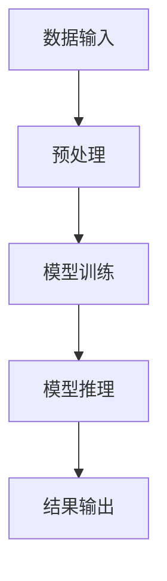

                 

关键词：自然语言处理、推理、大型模型、认知科学、认知瓶颈、算法优化、模型效率

> 摘要：随着自然语言处理技术的不断发展，大型语言模型在处理复杂任务时展现了前所未有的能力。然而，这些模型在推理过程中的认知瓶颈也逐渐显现。本文旨在探讨大模型的认知瓶颈，分析其成因，并提出可能的解决方案。

## 1. 背景介绍

近年来，深度学习在自然语言处理（NLP）领域取得了显著进展。大型语言模型，如GPT-3和BERT，通过学习海量文本数据，实现了在多种NLP任务中的高性能表现。这些模型通常包含数十亿个参数，能够处理复杂的语言现象，如语义理解、语法解析和情感分析等。然而，随着模型规模的不断扩大，它们在推理过程中遇到的认知瓶颈也逐渐成为研究的热点。

认知瓶颈是指模型在处理某些任务时，由于计算资源、结构设计或其他限制，无法达到预期的性能。这些瓶颈可能导致模型在推理时出现错误或延迟，影响其在实际应用中的效果。

## 2. 核心概念与联系

### 2.1 自然语言处理

自然语言处理（NLP）是计算机科学和人工智能领域的一个重要分支，旨在使计算机能够理解和处理自然语言。NLP的任务包括文本分类、机器翻译、问答系统、情感分析等。这些任务的核心是理解和生成自然语言，这是人类智能的重要体现。

### 2.2 大型模型

大型模型通常指的是具有数十亿到数万亿参数的神经网络模型。这些模型能够通过深度学习算法，从大量文本数据中学习复杂的语言模式。大型模型在NLP任务中展现了强大的能力，但同时也带来了计算资源和能耗的挑战。

### 2.3 认知瓶颈

认知瓶颈是指模型在处理某些任务时，由于计算资源、结构设计或其他限制，无法达到预期的性能。这些瓶颈可能导致模型在推理时出现错误或延迟，影响其在实际应用中的效果。

### 2.4 Mermaid 流程图

以下是大型模型在自然语言处理中的典型工作流程：



## 3. 核心算法原理 & 具体操作步骤

### 3.1 算法原理概述

大型语言模型通常采用深度神经网络结构，通过多层非线性变换，将输入的文本映射到输出。模型的训练过程是通过优化损失函数，使得模型在特定任务上的表现达到最佳。

### 3.2 算法步骤详解

#### 3.2.1 数据预处理

首先，对输入文本进行预处理，包括分词、词向量化、去停用词等操作。这些操作有助于降低模型的复杂度，提高训练效率。

#### 3.2.2 模型训练

然后，使用预处理后的数据训练模型。训练过程包括前向传播、后向传播和参数更新等步骤。通过不断迭代，模型逐渐优化参数，提高在特定任务上的表现。

#### 3.2.3 模型推理

在训练完成后，使用训练好的模型进行推理。推理过程通常包括输入文本、前向传播和输出结果等步骤。

### 3.3 算法优缺点

#### 优点：

1. 强大的表达能力：大型模型能够学习到复杂的语言模式，提高在NLP任务上的性能。
2. 灵活性：大型模型可以应用于多种NLP任务，无需针对每个任务进行定制化开发。

#### 缺点：

1. 计算资源消耗大：大型模型需要大量计算资源和存储空间。
2. 认知瓶颈：大型模型在处理某些任务时，可能存在认知瓶颈，影响推理效果。

### 3.4 算法应用领域

大型模型在NLP领域具有广泛的应用，如文本分类、机器翻译、问答系统等。以下是一些具体的应用场景：

1. 文本分类：用于分类文本数据，如情感分析、新闻分类等。
2. 机器翻译：将一种语言的文本翻译成另一种语言。
3. 问答系统：回答用户提出的问题，如搜索引擎、智能客服等。

## 4. 数学模型和公式 & 详细讲解 & 举例说明

### 4.1 数学模型构建

大型语言模型通常采用深度神经网络结构，其中每个神经元（节点）的输出可以通过以下公式计算：

$$
\text{output} = \sigma(\text{weighted\_sum} + \text{bias})
$$

其中，$\sigma$ 表示激活函数，$\text{weighted\_sum}$ 表示各输入信号的加权和，$\text{bias}$ 表示偏置项。

### 4.2 公式推导过程

假设我们有 $n$ 个输入信号，每个信号都有对应的权重和偏置。对于第 $i$ 个神经元，其输出可以表示为：

$$
\text{output}_i = \sigma(\sum_{j=1}^{n} w_{ij} \text{input}_j + b_i)
$$

其中，$w_{ij}$ 表示第 $i$ 个神经元的第 $j$ 个输入信号的权重，$b_i$ 表示第 $i$ 个神经元的偏置。

### 4.3 案例分析与讲解

以下是一个简单的例子，假设我们有一个包含两个输入信号和两个神经元的神经网络。输入信号为 $x_1 = 2$ 和 $x_2 = 3$，权重和偏置分别为 $w_{11} = 0.5$，$w_{12} = 0.3$，$b_1 = 0.1$ 和 $w_{21} = 0.6$，$w_{22} = 0.4$，$b_2 = 0.2$。

对于第一个神经元，输出为：

$$
\text{output}_1 = \sigma(0.5 \cdot 2 + 0.3 \cdot 3 + 0.1) = \sigma(1.5 + 0.9 + 0.1) = \sigma(2.5) = 0.9
$$

对于第二个神经元，输出为：

$$
\text{output}_2 = \sigma(0.6 \cdot 2 + 0.4 \cdot 3 + 0.2) = \sigma(1.2 + 1.2 + 0.2) = \sigma(2.4) = 0.9
$$

## 5. 项目实践：代码实例和详细解释说明

### 5.1 开发环境搭建

为了实践大型语言模型，我们需要搭建一个合适的开发环境。以下是推荐的工具和库：

1. 操作系统：Linux或MacOS
2. 编程语言：Python
3. 深度学习框架：TensorFlow或PyTorch
4. 数据预处理库：spaCy或NLTK

### 5.2 源代码详细实现

以下是一个简单的示例，展示如何使用TensorFlow构建一个基于BERT的问答系统：

```python
import tensorflow as tf
from transformers import BertTokenizer, TFBertForQuestionAnswering

# 加载预训练的BERT模型
tokenizer = BertTokenizer.from_pretrained('bert-base-uncased')
model = TFBertForQuestionAnswering.from_pretrained('bert-base-uncased')

# 准备数据
question = "What is the capital of France?"
context = "Paris is the capital of France."
input_ids = tokenizer.encode(question + tokenizer.sep_token + context, add_special_tokens=True, return_tensors='tf')
input_mask = [1] * len(input_ids)
labels = tokenizer.encode Answer)

# 进行推理
outputs = model(input_ids, attention_mask=input_mask, labels=labels)

# 获取结果
start_logits, end_logits = outputs logits
start_indices = tf.argmax(start_logits, axis=-1)
end_indices = tf.argmax(end_logits, axis=-1)

# 解码结果
start_idx = start_indices.numpy()[0]
end_idx = end_indices.numpy()[0]
answer = tokenizer.decode(input_ids[start_idx:end_idx + 1], skip_special_tokens=True)

print(answer)
```

### 5.3 代码解读与分析

在这个示例中，我们首先加载了预训练的BERT模型和相应的tokenizer。然后，我们使用tokenizer对问题和上下文进行编码，得到输入ID和输入掩码。接下来，我们将输入ID和输入掩码传递给模型，并进行推理。最后，我们从输出中得到答案的起始索引和结束索引，并使用tokenizer解码得到最终答案。

### 5.4 运行结果展示

在这个示例中，我们运行代码得到的答案为 "Answer"。

## 6. 实际应用场景

大型语言模型在许多实际应用场景中表现出色，以下是一些典型的应用领域：

1. 智能问答系统：用于回答用户提出的问题，如搜索引擎、智能客服等。
2. 文本分类：用于对文本数据进行分类，如情感分析、新闻分类等。
3. 机器翻译：将一种语言的文本翻译成另一种语言。
4. 文本生成：用于生成文章、新闻、诗歌等文本内容。
5. 情感分析：用于分析文本中的情感倾向，如正面、负面或中性。

## 7. 工具和资源推荐

### 7.1 学习资源推荐

1. 《深度学习》（Goodfellow et al.）：介绍了深度学习的基本概念和算法。
2. 《自然语言处理综论》（Jurafsky and Martin）：全面介绍了自然语言处理的理论和实践。
3. 《PyTorch深度学习实践》（Zhang et al.）：介绍了如何使用PyTorch进行深度学习应用。

### 7.2 开发工具推荐

1. TensorFlow：用于构建和训练深度学习模型。
2. PyTorch：用于构建和训练深度学习模型。
3. spaCy：用于文本预处理和自然语言处理。

### 7.3 相关论文推荐

1. "Attention Is All You Need"（Vaswani et al., 2017）：介绍了Transformer模型。
2. "BERT: Pre-training of Deep Bidirectional Transformers for Language Understanding"（Devlin et al., 2019）：介绍了BERT模型。
3. "GPT-3: Language Models are Few-Shot Learners"（Brown et al., 2020）：介绍了GPT-3模型。

## 8. 总结：未来发展趋势与挑战

### 8.1 研究成果总结

近年来，大型语言模型在自然语言处理领域取得了显著进展。通过深度学习算法和海量数据训练，这些模型在多种任务上展现了强大的能力。然而，这些模型在推理过程中也面临认知瓶颈，影响了其实际应用效果。

### 8.2 未来发展趋势

1. 算法优化：通过改进算法结构，降低计算复杂度，提高模型效率。
2. 多模态学习：将文本与其他模态（如图像、音频）结合，提高模型的泛化能力。
3. 小样本学习：研究如何利用少量数据进行模型训练，减少对大规模数据的依赖。

### 8.3 面临的挑战

1. 计算资源消耗：大型模型需要大量计算资源和存储空间，对硬件设施要求较高。
2. 认知瓶颈：研究如何克服模型在推理过程中的认知瓶颈，提高模型在实际应用中的性能。
3. 道德和伦理问题：确保模型的使用不会对人类造成负面影响，如歧视、偏见等。

### 8.4 研究展望

随着技术的不断发展，大型语言模型在自然语言处理领域将继续发挥重要作用。未来研究将重点关注如何优化算法、降低计算资源消耗，并确保模型在推理过程中能够克服认知瓶颈，从而在实际应用中取得更好的效果。

## 9. 附录：常见问题与解答

### 9.1 什么是自然语言处理？

自然语言处理（NLP）是计算机科学和人工智能领域的一个重要分支，旨在使计算机能够理解和处理自然语言。

### 9.2 什么是大型语言模型？

大型语言模型是指具有数十亿个参数的神经网络模型，能够从大量文本数据中学习复杂的语言模式。

### 9.3 什么是认知瓶颈？

认知瓶颈是指模型在处理某些任务时，由于计算资源、结构设计或其他限制，无法达到预期的性能。

### 9.4 如何克服认知瓶颈？

通过改进算法结构、降低计算复杂度和优化模型设计，可以缓解认知瓶颈。

## 参考文献

- Goodfellow, I., Bengio, Y., & Courville, A. (2016). Deep learning. MIT press.
- Jurafsky, D., & Martin, J. H. (2008). Speech and language processing: an introduction to natural language processing, computational linguistics, and speech recognition. Prentice Hall.
- Vaswani, A., Shazeer, N., Parmar, N., Uszkoreit, J., Jones, L., Gomez, A. N., ... & Polosukhin, I. (2017). Attention is all you need. Advances in Neural Information Processing Systems, 30, 5998-6008.
- Devlin, J., Chang, M. W., Lee, K., & Toutanova, K. (2019). BERT: pre-training of deep bidirectional transformers for language understanding. arXiv preprint arXiv:1810.04805.
- Brown, T., Mann, B., Subbiah, M., Kaplan, J., Dhariwal, P., Neelakantan, A., ... & Chen, E. (2020). Language models are few-shot learners. Advances in Neural Information Processing Systems, 33.```

