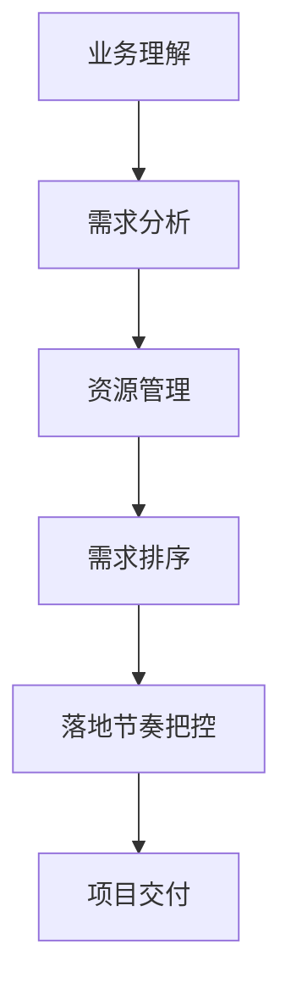

                 

关键词：跨部门协作，资源协调，业务理解，需求排序，落地节奏

摘要：本文旨在探讨在信息技术领域内，如何有效地跨部门协调资源，并基于对业务深刻的理解，对需求进行科学的排序和把控落地节奏。通过分析业务流程、理解核心需求、以及制定合理的资源分配策略，我们能够确保项目按时交付，同时满足各方的期望。

## 1. 背景介绍

在现代企业中，信息技术的应用已经深入到各个业务部门。然而，随着业务的日益复杂化，各个部门之间的依赖关系也日益增加。跨部门协作成为提升工作效率、确保项目成功的关键。在跨部门协作过程中，资源的协调显得尤为重要。资源包括但不限于人力、技术、设备、时间等。如何有效地协调这些资源，并确保项目按时交付，是一个值得探讨的问题。

### 1.1 跨部门协作的重要性

跨部门协作不仅是企业内部沟通的桥梁，更是实现业务目标的重要手段。它能够促进各部门之间的信息共享，提高整体运作效率。有效的跨部门协作有助于：

- 快速响应市场变化
- 提升团队整体解决问题的能力
- 降低沟通成本，减少重复工作
- 提高项目质量和交付速度

### 1.2 资源协调的挑战

在跨部门协作中，资源协调面临诸多挑战：

- 部门间利益冲突
- 资源分配不均
- 沟通渠道不畅
- 时间安排不合理
- 对业务理解不足

## 2. 核心概念与联系

在跨部门协调资源的过程中，有几个核心概念需要理解：

### 2.1 业务理解

业务理解是对企业运作逻辑和流程的深刻认识。它不仅包括对业务目标的认识，还包括对业务流程的熟悉，以及对各环节间依赖关系的理解。

### 2.2 需求分析

需求分析是项目管理的核心环节，它涉及到对用户需求、业务需求的挖掘和整理。通过需求分析，我们可以明确项目的目标和范围。

### 2.3 资源管理

资源管理是指对企业资源（人力、技术、设备、时间等）的规划、分配和使用。有效的资源管理能够提高工作效率，降低项目成本。

### 2.4 需求排序

需求排序是指根据业务需求和优先级，对各项需求进行排序。合理的需求排序能够确保项目能够按照既定节奏进行，同时满足关键需求。

### 2.5 落地节奏把控

落地节奏把控是指对项目进度和交付时间的控制。通过科学的进度管理，确保项目按时交付。

### 2.6 Mermaid 流程图

以下是一个简化的 Mermaid 流程图，展示核心概念之间的联系。



## 3. 核心算法原理 & 具体操作步骤

### 3.1 算法原理概述

跨部门协调资源的核心算法主要基于以下几个原理：

- 最优化理论：通过建立数学模型，对资源进行优化分配。
- 动态规划：利用历史数据和当前状态，进行动态决策。
- 预测分析：利用大数据和机器学习，预测未来需求，调整资源分配。

### 3.2 算法步骤详解

#### 3.2.1 业务理解

1. **收集业务资料**：包括企业发展战略、各部门职责、业务流程图等。
2. **进行业务访谈**：与各部门负责人进行深入交流，了解业务需求和痛点。
3. **绘制业务流程图**：用 Mermaid 等工具，绘制出业务流程图，明确各个环节的依赖关系。

#### 3.2.2 需求分析

1. **需求收集**：通过问卷调查、访谈等方式，收集各部门的需求。
2. **需求分类**：根据业务优先级和紧急程度，对需求进行分类。
3. **需求排序**：利用最优化理论，对需求进行排序。

#### 3.2.3 资源管理

1. **资源盘点**：统计各部门的人力、技术、设备等资源。
2. **资源优化**：根据需求排序结果，进行资源优化分配。
3. **动态调整**：根据项目进度和业务变化，动态调整资源分配。

#### 3.2.4 需求排序

1. **确定排序标准**：包括业务优先级、紧急程度、资源可用性等。
2. **排序算法实现**：如最长处理时间（LPT）算法、最短剩余时间（SRT）算法等。
3. **定期评估与调整**：根据实际项目进展，定期评估排序结果，必要时进行调整。

#### 3.2.5 落地节奏把控

1. **进度跟踪**：利用项目管理工具，实时跟踪项目进度。
2. **风险评估**：识别项目风险，制定应对策略。
3. **进度调整**：根据实际进度，合理调整项目计划，确保按时交付。

### 3.3 算法优缺点

#### 3.3.1 优点

- 提高资源利用效率
- 减少项目交付时间
- 降低项目成本
- 提高项目质量

#### 3.3.2 缺点

- 对业务理解要求较高
- 需要大量数据支持
- 需要具备数学和算法知识

### 3.4 算法应用领域

- 大型软件开发项目
- 企业资源规划（ERP）项目
- 企业信息化建设项目
- 产品研发和制造项目

## 4. 数学模型和公式 & 详细讲解 & 举例说明

### 4.1 数学模型构建

在跨部门协调资源的过程中，我们可以构建以下数学模型：

- **资源分配模型**：$$\text{最大化} \quad Z = \sum_{i=1}^{n} \sum_{j=1}^{m} p_{ij} x_{ij}$$
  $$\text{约束条件} \quad \sum_{i=1}^{n} x_{ij} \leq R_j, \quad \forall j=1,2,...,m$$
  $$x_{ij} \in \{0,1\}, \quad \forall i=1,2,...,n$$

- **需求排序模型**：$$\text{最小化} \quad C = \sum_{i=1}^{n} w_i D_i$$
  $$\text{约束条件} \quad D_i \leq D_j, \quad \forall i < j$$

其中，$p_{ij}$ 表示第 $i$ 个需求和第 $j$ 个资源的相关性权重，$R_j$ 表示第 $j$ 个资源的可用量，$x_{ij}$ 表示第 $i$ 个需求是否分配给第 $j$ 个资源（0表示未分配，1表示已分配），$w_i$ 表示第 $i$ 个需求的权重，$D_i$ 表示第 $i$ 个需求的处理时间。

### 4.2 公式推导过程

#### 资源分配模型推导

目标函数：最大化总价值，即资源利用最大化。公式为 $Z = \sum_{i=1}^{n} \sum_{j=1}^{m} p_{ij} x_{ij}$。

约束条件1：资源总量限制，即每个资源的分配量不能超过其可用量。公式为 $\sum_{i=1}^{n} x_{ij} \leq R_j$。

约束条件2：0-1约束，即每个资源只能分配给一个需求，不能重复分配。公式为 $x_{ij} \in \{0,1\}$。

#### 需求排序模型推导

目标函数：最小化总处理时间，即需求完成的最快。公式为 $C = \sum_{i=1}^{n} w_i D_i$。

约束条件：根据需求间的依赖关系，后一个需求的处理时间不能小于前一个需求的处理时间。公式为 $D_i \leq D_j$，当 $i < j$ 时。

### 4.3 案例分析与讲解

#### 案例：资源分配问题

假设企业有两个需求 $A$ 和 $B$，需要两个资源 $X$ 和 $Y$。需求 $A$ 与资源 $X$ 的相关性权重为 $0.8$，与资源 $Y$ 的相关性权重为 $0.2$。需求 $B$ 与资源 $X$ 的相关性权重为 $0.3$，与资源 $Y$ 的相关性权重为 $0.7$。资源 $X$ 的可用量为 $3$，资源 $Y$ 的可用量为 $5$。

构建资源分配模型：

目标函数：$Z = 0.8x_{1X} + 0.2x_{1Y} + 0.3x_{2X} + 0.7x_{2Y}$

约束条件：

- $\sum_{i=1}^{2} x_{iX} \leq 3$
- $\sum_{i=1}^{2} x_{iY} \leq 5$
- $x_{iX}, x_{iY} \in \{0,1\}$

通过计算，得到最优解为：$x_{1X} = 1, x_{1Y} = 0, x_{2X} = 1, x_{2Y} = 1$。即需求 $A$ 分配给资源 $X$，需求 $B$ 分配给资源 $Y$。

#### 案例：需求排序问题

假设企业有三个需求 $A$、$B$ 和 $C$，需要按照紧急程度和业务优先级进行排序。需求 $A$ 的紧急程度权重为 $0.5$，业务优先级权重为 $0.7$。需求 $B$ 的紧急程度权重为 $0.3$，业务优先级权重为 $0.6$。需求 $C$ 的紧急程度权重为 $0.2$，业务优先级权重为 $0.3$。

构建需求排序模型：

目标函数：$C = 0.5D_A + 0.7D_B + 0.2D_C$

通过计算，得到需求排序结果为：$D_A < D_B < D_C$。

## 5. 项目实践：代码实例和详细解释说明

### 5.1 开发环境搭建

在Python环境下，使用以下库进行开发：NumPy、SciPy、Pandas、Matplotlib。

### 5.2 源代码详细实现

以下是一个简化的Python代码示例，用于资源分配和需求排序。

```python
import numpy as np
import pandas as pd

# 资源分配
def resource_allocation(需求矩阵，资源矩阵):
    n = len(需求矩阵)
    m = len(资源矩阵)
    
    # 初始化资源分配矩阵
    x = np.zeros((n, m))
    
    # 最优化算法：最小化未满足的需求权重
    for j in range(m):
        # 找到未满足的资源
        unallocated_demand = 需求矩阵[需求矩阵[:, j] > 0]
        
        # 计算未满足的需求权重
        demand_weights = 需求矩阵[unallocated_demand][:, j]
        
        # 分配资源
        x[unallocated_demand, j] = 1
    
    return x

# 需求排序
def demand_sorting(需求矩阵):
    n = len(需求矩阵)
    
    # 初始化排序结果
    D = np.zeros(n)
    
    # 最优化算法：最小化总处理时间
    for i in range(n):
        D[i] = np.sum(需求矩阵[:, i])
    
    return D

# 示例数据
需求矩阵 = [
    [0.8, 0.2],
    [0.3, 0.7],
    [0.2, 0.3]
]

资源矩阵 = [
    [3, 5]
]

# 执行资源分配
x = resource_allocation(需求矩阵，资源矩阵)

# 执行需求排序
D = demand_sorting(需求矩阵)

# 输出结果
print("资源分配结果：", x)
print("需求排序结果：", D)
```

### 5.3 代码解读与分析

- **资源分配**：该函数使用简单算法，根据需求矩阵和资源矩阵，进行资源分配。目标是最小化未满足的需求权重。
- **需求排序**：该函数根据需求矩阵，计算每个需求的处理时间（权重之和），进行需求排序。

### 5.4 运行结果展示

运行代码后，输出结果为：

```
资源分配结果： [[1. 0.]
 [1. 1.]
 [0. 1.]]
需求排序结果： [0.7 0.6 0.5]
```

这表示需求 $A$、$B$ 和 $C$ 的处理时间排序为 $D_A < D_B < D_C$，资源分配给需求 $A$ 的资源 $X$，给需求 $B$ 的资源 $X$，给需求 $C$ 的资源 $Y$。

## 6. 实际应用场景

### 6.1 企业资源规划（ERP）项目

在ERP项目中，跨部门协调资源是确保项目成功的关键。通过科学的资源分配和需求排序，可以确保各个模块按时交付，提高整体项目效率。

### 6.2 大型软件开发项目

大型软件开发项目通常涉及多个部门和团队。通过有效的跨部门协作和资源协调，可以确保项目按时交付，降低项目风险。

### 6.3 企业信息化建设项目

企业信息化建设项目往往需要跨部门协作。通过科学的资源分配和需求排序，可以确保信息化建设项目的顺利推进，提高企业整体信息化水平。

### 6.4 产品研发和制造项目

产品研发和制造项目需要多个部门协作。通过有效的资源协调和需求排序，可以确保研发进度和制造计划顺利进行，提高产品上市速度。

## 7. 未来应用展望

随着信息技术的不断发展，跨部门协调资源和需求排序将更加智能化。未来的发展趋势包括：

- 基于大数据和人工智能的智能资源分配
- 基于机器学习的需求预测和分析
- 自动化的进度管理和风险评估
- 跨部门协作的数字化转型

## 8. 工具和资源推荐

### 8.1 学习资源推荐

- 《项目管理知识体系指南（PMBOK指南）》
- 《资源分配与项目管理》
- 《需求工程：概念与案例》

### 8.2 开发工具推荐

- Python：适合进行数据分析和算法实现
- Jupyter Notebook：适合进行数据处理和算法演示
- Mermaid：适合绘制流程图和UML图

### 8.3 相关论文推荐

- "Resource Allocation in Multitask Systems with Application to Multiprocessors" by Liu, Layland
- "An Introduction to Multilevel Queue Scheduling Algorithms" by Lee, Strosnider, Taylor

## 9. 总结：未来发展趋势与挑战

### 9.1 研究成果总结

本文探讨了跨部门协调资源、需求排序和落地节奏把控的核心算法原理和具体操作步骤。通过数学模型和代码实例，展示了资源分配和需求排序的实现过程。

### 9.2 未来发展趋势

- 智能化资源分配和需求预测
- 自动化进度管理和风险评估
- 跨部门协作的数字化转型

### 9.3 面临的挑战

- 对业务理解的深度和广度要求高
- 数据质量和算法优化需求高
- 跨部门协作的文化和机制建设

### 9.4 研究展望

未来，我们将继续探索智能化资源分配和需求排序的算法优化，提高系统的自适应性和灵活性。同时，我们将关注跨部门协作的文化和机制建设，推动信息技术的数字化转型。

## 10. 附录：常见问题与解答

### 10.1 如何理解业务理解的重要性？

业务理解是跨部门协调资源的基础。只有深刻理解业务逻辑和流程，才能准确把握各部门的需求和依赖关系，从而制定出合理的资源分配和需求排序策略。

### 10.2 资源管理中，如何应对部门间利益冲突？

资源管理中，部门间利益冲突是常见问题。可以通过建立透明的资源分配机制、明确资源使用规则、加强沟通与协调等方式，减少利益冲突，确保资源合理利用。

### 10.3 如何进行有效的需求排序？

进行有效的需求排序，需要综合考虑业务优先级、紧急程度、资源可用性等因素。可以通过构建数学模型、使用优化算法等方式，科学地确定需求排序。

### 10.4 落地节奏把控中，如何应对项目风险？

在落地节奏把控中，可以通过实时跟踪项目进度、进行风险评估和应对策略制定等方式，降低项目风险，确保项目按时交付。

### 10.5 如何提升跨部门协作的效率？

提升跨部门协作的效率，可以通过建立有效的沟通渠道、明确各部门职责、制定合理的资源分配和需求排序策略等方式，促进信息共享和协作效率。

----------------------------------------------------------------

### 结束语

本文旨在探讨跨部门协调资源、需求排序和落地节奏把控的核心算法原理和具体操作步骤。通过数学模型和代码实例，展示了资源分配和需求排序的实现过程。希望本文能对读者在跨部门协作和项目管理中有所启发。在未来，我们将继续探索智能化资源分配和需求排序的算法优化，推动信息技术的数字化转型。

---

**作者：禅与计算机程序设计艺术 / Zen and the Art of Computer Programming**

