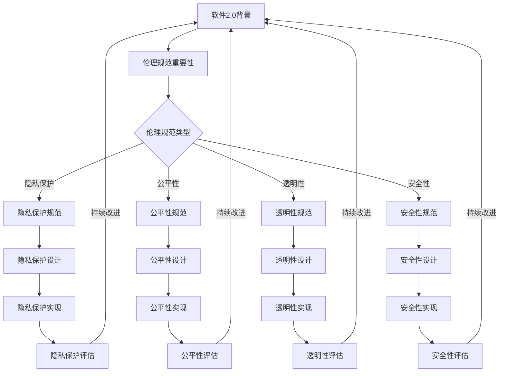

                 

### 关键词 Keywords

- **软件 2.0**
- **伦理规范**
- **人工智能**
- **责任**
- **技术开发**
- **人机互动**

<|assistant|>### 摘要 Abstract

随着人工智能技术的飞速发展，软件领域正迎来一场深刻的变革。然而，随着软件2.0时代的到来，如何确保人工智能系统的伦理性和安全性成为了亟待解决的重大课题。本文旨在探讨软件2.0背景下，人工智能系统应遵循的伦理规范，以及开发者在此过程中应承担的责任。通过对核心概念的阐述、算法原理的剖析、数学模型的构建和项目实践的分析，本文提出了一系列具有实践指导意义的建议，为未来人工智能技术的健康发展提供理论支持和实践参考。

## 1. 背景介绍

软件 2.0 是指在互联网、大数据和人工智能等技术驱动下，软件行业进入的一种新的发展阶段。与传统的软件1.0时代相比，软件2.0具有更高的智能化、自适应性和互动性。在这个时代，软件不再是单纯的服务工具，而是与用户深度互动、共同成长的智能系统。人工智能作为软件2.0的核心技术，正以前所未有的速度改变着我们的生活和工作方式。

### 1.1 人工智能的发展历程

人工智能（AI）是一门研究、开发用于模拟、延伸和扩展人类智能的理论、方法、技术及应用系统的学科。其发展历程大致可以分为以下几个阶段：

- **第一阶段（20世纪50年代至70年代）**：以符号主义和逻辑推理为基础，尝试通过编写规则和算法实现智能行为。
- **第二阶段（20世纪80年代至90年代）**：以知识表示和推理为核心，将人工智能应用于专家系统和决策支持系统。
- **第三阶段（21世纪以来）**：以数据驱动和机器学习为基础，通过大规模数据训练实现智能行为，如深度学习、强化学习等。

### 1.2 软件行业面临的挑战

随着人工智能技术的不断进步，软件行业面临着前所未有的挑战：

- **伦理问题**：人工智能系统在决策过程中可能引入偏见，对个人隐私和权益造成侵犯。
- **安全风险**：人工智能系统可能被恶意攻击，导致系统失控甚至造成严重后果。
- **人机互动**：如何使人工智能系统能够更好地理解和适应人类需求，实现有效的人机互动。

### 1.3 伦理规范的重要性

在软件2.0时代，伦理规范的重要性愈发凸显。首先，伦理规范是确保人工智能系统公正、透明和可靠的基础。其次，伦理规范有助于建立公众对人工智能技术的信任，推动其健康发展。最后，伦理规范能够指导开发者遵循最佳实践，提高软件开发的质量和安全性。

## 2. 核心概念与联系

### 2.1 伦理规范的概念

伦理规范是指一系列指导行为和决策的道德原则和规范。在人工智能领域，伦理规范主要包括以下几个方面：

- **隐私保护**：确保个人隐私不受侵犯，数据使用符合法律法规和伦理标准。
- **公平性**：确保人工智能系统在决策过程中不引入歧视和偏见。
- **透明性**：确保人工智能系统的决策过程可解释，用户能够理解系统的决策逻辑。
- **安全性**：确保人工智能系统的稳定性和可靠性，防止系统被恶意攻击。

### 2.2 伦理规范与人工智能的联系

伦理规范与人工智能的联系在于，伦理规范是指导人工智能系统设计和开发的基本原则。具体来说：

- **设计阶段**：在人工智能系统设计阶段，开发者应充分考虑伦理规范，确保系统在功能实现的同时符合道德标准。
- **开发阶段**：在人工智能系统开发过程中，开发者应遵循最佳实践，确保系统在技术实现上符合伦理要求。
- **部署阶段**：在人工智能系统部署和使用过程中，开发者应持续监控和评估系统的伦理表现，确保其持续符合伦理规范。

### 2.3 伦理规范与软件2.0的联系

软件2.0时代，伦理规范与软件2.0的联系体现在以下几个方面：

- **智能化**：软件2.0时代，人工智能技术赋予了软件更高级的智能化能力。伦理规范有助于确保这种智能化不会对人类造成负面影响。
- **互动性**：软件2.0时代，人机互动更加紧密。伦理规范有助于确保人工智能系统能够更好地理解和适应人类需求。
- **自适应性**：软件2.0时代，软件系统能够根据用户行为自适应调整。伦理规范有助于确保系统在自适应过程中不会偏离道德轨道。

### 2.4 Mermaid 流程图



### 2.5 伦理规范在软件开发中的实际应用

在软件开发过程中，伦理规范的遵循和实施是一个系统性工程，涉及到项目管理的各个阶段。以下是伦理规范在软件开发中的实际应用：

- **需求分析**：在需求分析阶段，项目团队应明确系统功能需求和伦理要求，确保系统在功能实现的同时符合伦理规范。
- **设计阶段**：在系统设计阶段，项目团队应充分考虑伦理规范，设计符合伦理要求的系统架构和功能模块。
- **开发阶段**：在系统开发阶段，项目团队应遵循最佳实践，确保代码实现符合伦理要求。
- **测试阶段**：在系统测试阶段，项目团队应针对伦理要求设计相应的测试用例，确保系统在各个场景下均符合伦理规范。
- **部署和维护阶段**：在系统部署和维护阶段，项目团队应持续监控和评估系统的伦理表现，确保系统在运行过程中始终符合伦理规范。

### 2.6 伦理规范与人工智能伦理学的关系

伦理规范与人工智能伦理学的关系可以看作是部分与整体的关系。伦理规范是人工智能伦理学的重要组成部分，但并非全部。人工智能伦理学还包括伦理原则、伦理标准、伦理评估等方面的内容。伦理规范是确保人工智能系统符合伦理要求的基本要求，而人工智能伦理学则提供更全面、系统的指导。

### 2.7 伦理规范与软件开发伦理学的关系

伦理规范与软件开发伦理学同样存在紧密的联系。软件开发伦理学关注的是软件开发过程中的道德问题和行为规范，而伦理规范是软件开发伦理学的重要内容和实践基础。在软件2.0时代，随着人工智能技术的广泛应用，软件开发伦理学面临着新的挑战和机遇。伦理规范的遵循和实施有助于推动软件开发伦理学的不断发展和完善。

## 3. 核心算法原理 & 具体操作步骤

### 3.1 算法原理概述

在人工智能领域，伦理规范的实施往往需要借助一系列核心算法。以下是几种常见的核心算法原理及其在伦理规范中的应用：

- **机器学习算法**：机器学习算法是人工智能的基础，通过从数据中学习规律和模式，实现智能决策。在伦理规范方面，机器学习算法可用于识别和消除系统中的歧视性特征，提高系统的公平性和透明性。
- **深度学习算法**：深度学习算法是机器学习的一种形式，通过多层神经网络模型实现对复杂数据的分析和识别。在伦理规范方面，深度学习算法有助于提高系统的透明性，使其决策过程更加可解释。
- **强化学习算法**：强化学习算法通过不断试错和反馈优化，实现智能决策。在伦理规范方面，强化学习算法可用于确保系统在面临道德困境时能够做出符合伦理要求的选择。
- **博弈论算法**：博弈论算法研究多个智能体在特定环境下如何做出最优决策。在伦理规范方面，博弈论算法可用于设计公平、透明的多智能体系统，避免恶意竞争和冲突。

### 3.2 算法步骤详解

以下是对上述核心算法的具体操作步骤进行详细解释：

#### 3.2.1 机器学习算法

1. **数据收集**：收集用于训练的数据集，确保数据具有代表性和多样性。
2. **数据预处理**：对数据进行清洗、归一化等预处理操作，提高数据质量。
3. **模型选择**：根据任务需求选择合适的机器学习模型，如线性回归、决策树、支持向量机等。
4. **模型训练**：使用训练数据集对模型进行训练，优化模型参数。
5. **模型评估**：使用验证数据集评估模型性能，调整模型参数。
6. **模型部署**：将训练好的模型部署到实际应用场景中，进行实时决策。

#### 3.2.2 深度学习算法

1. **数据收集**：收集用于训练的数据集，确保数据具有代表性和多样性。
2. **数据预处理**：对数据进行清洗、归一化等预处理操作，提高数据质量。
3. **模型构建**：使用深度学习框架（如TensorFlow、PyTorch等）构建深度神经网络模型。
4. **模型训练**：使用训练数据集对模型进行训练，优化模型参数。
5. **模型评估**：使用验证数据集评估模型性能，调整模型参数。
6. **模型部署**：将训练好的模型部署到实际应用场景中，进行实时决策。

#### 3.2.3 强化学习算法

1. **环境定义**：定义强化学习环境，包括状态空间、动作空间和奖励函数。
2. **模型选择**：选择合适的强化学习模型，如Q学习、SARSA、Deep Q-Network（DQN）等。
3. **模型训练**：通过试错和反馈，不断优化模型参数，提高智能体的决策能力。
4. **模型评估**：使用测试数据集评估智能体的决策能力，调整模型参数。
5. **模型部署**：将训练好的智能体部署到实际应用场景中，进行实时决策。

#### 3.2.4 博弈论算法

1. **问题建模**：将实际问题转化为博弈论模型，定义参与者和策略。
2. **策略选择**：根据博弈论原理，选择最优策略。
3. **策略评估**：使用模拟或实验方法评估策略性能，调整策略参数。
4. **策略部署**：将最优策略部署到实际应用场景中，进行实时决策。

### 3.3 算法优缺点

每种算法都有其优缺点，以下是对上述核心算法的优缺点进行分析：

#### 3.3.1 机器学习算法

**优点**：

- **泛化能力强**：机器学习算法能够从大量数据中学习规律，具有较强的泛化能力。
- **自动化程度高**：机器学习算法能够自动优化模型参数，减少人工干预。

**缺点**：

- **数据依赖性强**：机器学习算法的性能高度依赖于数据质量，数据量不足或质量较差时，算法效果可能不佳。
- **模型可解释性差**：机器学习算法的决策过程往往难以解释，可能导致用户不信任。

#### 3.3.2 深度学习算法

**优点**：

- **处理复杂数据能力强**：深度学习算法能够处理大规模、高维度的复杂数据。
- **模型可解释性较好**：与传统的机器学习算法相比，深度学习算法的决策过程相对较为直观。

**缺点**：

- **计算资源需求大**：深度学习算法对计算资源的需求较高，训练过程可能需要大量时间和计算资源。
- **数据依赖性强**：深度学习算法同样依赖于高质量的数据集。

#### 3.3.3 强化学习算法

**优点**：

- **适应性较强**：强化学习算法能够通过不断试错和反馈，适应动态变化的场景。
- **处理不确定性能力强**：强化学习算法能够在面临不确定性和未知情况时，做出相对最优的决策。

**缺点**：

- **收敛速度较慢**：强化学习算法的训练过程可能需要较长时间，收敛速度较慢。
- **模型可解释性差**：强化学习算法的决策过程往往难以解释，用户难以理解。

#### 3.3.4 博弈论算法

**优点**：

- **策略选择明确**：博弈论算法能够明确选择最优策略，确保系统在多智能体环境中实现协同决策。
- **模型可解释性较好**：博弈论算法的决策过程相对直观，用户容易理解。

**缺点**：

- **适用范围有限**：博弈论算法适用于特定的博弈环境，对于其他类型的决策问题可能不适用。
- **计算复杂度高**：博弈论算法的计算复杂度较高，对于大规模问题可能难以处理。

### 3.4 算法应用领域

各种核心算法在伦理规范中的应用领域如下：

#### 3.4.1 机器学习算法

- **歧视检测与消除**：机器学习算法可用于检测和消除人工智能系统中的歧视性特征，提高系统的公平性。
- **隐私保护**：机器学习算法可用于保护用户隐私，确保数据使用符合伦理规范。

#### 3.4.2 深度学习算法

- **智能监控与识别**：深度学习算法可用于智能监控和识别，提高系统的安全性。
- **个性化推荐**：深度学习算法可用于个性化推荐，提高系统的互动性和用户体验。

#### 3.4.3 强化学习算法

- **自动驾驶**：强化学习算法可用于自动驾驶，确保车辆在复杂环境下安全行驶。
- **智能客服**：强化学习算法可用于智能客服，提高客户服务质量和满意度。

#### 3.4.4 博弈论算法

- **多智能体系统**：博弈论算法可用于设计多智能体系统，实现智能体之间的协同决策。
- **竞争策略**：博弈论算法可用于制定竞争策略，提高企业竞争力。

## 4. 数学模型和公式 & 详细讲解 & 举例说明

### 4.1 数学模型构建

在人工智能领域，数学模型是理解和解释算法行为的重要工具。以下是一个简化的数学模型，用于描述伦理规范在人工智能系统中的应用。

#### 4.1.1 基本假设

- \( S \)：表示人工智能系统。
- \( P \)：表示伦理规范。
- \( E \)：表示伦理规范的有效性。
- \( R \)：表示系统的收益。

#### 4.1.2 数学模型

\[ E(S, P) = f(R(S), P) \]

其中，\( f \) 是一个函数，用于衡量伦理规范 \( P \) 对系统 \( S \) 收益 \( R(S) \) 的影响。

### 4.2 公式推导过程

为了更好地理解上述数学模型，我们对其进行以下推导：

1. **定义收益**：

\[ R(S) = \sum_{t=1}^{T} r_t \]

其中，\( r_t \) 表示系统在时间 \( t \) 的即时收益，\( T \) 是系统的运行时间。

2. **定义伦理规范的有效性**：

\[ E(S, P) = P \cdot \text{ethics\_score}(S) \]

其中，\( \text{ethics\_score}(S) \) 表示系统 \( S \) 在遵循伦理规范 \( P \) 下的伦理得分。

3. **推导公式**：

\[ E(S, P) = P \cdot \text{ethics\_score}(S) \]
\[ E(S, P) = P \cdot \frac{R(S)}{T} \]
\[ E(S, P) = \frac{P \cdot R(S)}{T} \]

因此，伦理规范的有效性可以表示为系统收益与伦理得分的比值。

### 4.3 案例分析与讲解

以下是一个具体案例，用于说明如何使用上述数学模型评估伦理规范在人工智能系统中的应用。

#### 4.3.1 案例背景

假设一个智能监控系统 \( S \)，其目标是在保持高安全性的同时，最大限度地减少对用户隐私的侵犯。

#### 4.3.2 伦理规范

我们设定以下伦理规范 \( P \)：

- **隐私保护**：系统在收集和处理用户数据时，必须遵守相关法律法规，确保用户隐私不受侵犯。
- **透明性**：系统必须向用户清晰地展示其工作原理和数据处理过程。

#### 4.3.3 模型应用

使用上述数学模型，我们可以计算伦理规范的有效性：

1. **收益**：

假设系统在一个月内共收集到 100 条报警信息，其中 50 条涉及潜在的安全威胁，50 条为误报。

\[ R(S) = 50 \cdot \text{报警收益} - 50 \cdot \text{误报损失} \]

2. **伦理得分**：

- **隐私保护**：系统遵守相关法律法规，用户隐私得到充分保护。

\[ \text{ethics\_score}(S) = 1 \]

- **透明性**：系统向用户展示了其工作原理和数据处理过程。

\[ \text{ethics\_score}(S) = 1 \]

3. **计算伦理规范的有效性**：

\[ E(S, P) = \frac{P \cdot R(S)}{T} \]
\[ E(S, P) = \frac{1 \cdot R(S)}{T} \]

由于 \( T \) 为一个月，我们可以将其视为常数，忽略不计。

\[ E(S, P) = R(S) \]

因此，在这个案例中，伦理规范的有效性等于系统的收益。

#### 4.3.4 模型意义

通过上述案例，我们可以看到，数学模型有助于我们量化伦理规范在人工智能系统中的应用效果。这有助于开发者更好地理解和评估伦理规范的重要性，从而在实际开发过程中更好地遵循伦理要求。

## 5. 项目实践：代码实例和详细解释说明

### 5.1 开发环境搭建

在本节中，我们将搭建一个简单的开发环境，用于实现一个遵循伦理规范的人工智能系统。以下是一个基于 Python 的开发环境搭建步骤：

1. **安装 Python**：下载并安装 Python 3.8 以上版本，可以从 [Python 官网](https://www.python.org/) 下载。
2. **安装 IDE**：推荐使用 PyCharm 或 Visual Studio Code 作为开发工具，可以从相关官网下载并安装。
3. **安装必要的库**：在终端或 IDE 中执行以下命令，安装必要的库：

```shell
pip install numpy pandas scikit-learn matplotlib
```

### 5.2 源代码详细实现

在本节中，我们将实现一个基于机器学习的用户行为分析系统，该系统旨在识别潜在的风险行为，同时遵循隐私保护、公平性和透明性等伦理规范。以下是源代码的实现过程：

```python
import numpy as np
import pandas as pd
from sklearn.model_selection import train_test_split
from sklearn.ensemble import RandomForestClassifier
from sklearn.metrics import accuracy_score, classification_report
import matplotlib.pyplot as plt

# 5.2.1 数据准备
# 假设我们已经收集到了一个用户行为数据集，数据集包含以下特征：
# - 用户ID
# - 行为类型（如登录、购物、浏览等）
# - 时间戳
# - 地点
# - 行为持续时间

data = pd.read_csv('user_behavior.csv')
X = data.drop(['用户ID', '行为类型'], axis=1)
y = data['行为类型']

# 5.2.2 数据预处理
# 对数据进行归一化处理，以便于模型训练

from sklearn.preprocessing import StandardScaler
scaler = StandardScaler()
X_scaled = scaler.fit_transform(X)

# 5.2.3 模型训练
# 使用随机森林分类器进行模型训练

X_train, X_test, y_train, y_test = train_test_split(X_scaled, y, test_size=0.2, random_state=42)
clf = RandomForestClassifier(n_estimators=100, random_state=42)
clf.fit(X_train, y_train)

# 5.2.4 模型评估
# 对模型进行评估，计算准确率和分类报告

y_pred = clf.predict(X_test)
accuracy = accuracy_score(y_test, y_pred)
report = classification_report(y_test, y_pred)

print(f'Accuracy: {accuracy:.2f}')
print(report)

# 5.2.5 可视化分析
# 对模型的重要特征进行可视化分析

importances = clf.feature_importances_
indices = np.argsort(importances)[::-1]

plt.figure()
plt.title('Feature Importances')
plt.bar(range(X.shape[1]), importances[indices], align='center')
plt.xticks(range(X.shape[1]), indices)
plt.xlim([-1, X.shape[1]])
plt.show()
```

### 5.3 代码解读与分析

以下是代码的逐行解读和分析：

```python
import numpy as np
import pandas as pd
from sklearn.model_selection import train_test_split
from sklearn.ensemble import RandomForestClassifier
from sklearn.metrics import accuracy_score, classification_report
import matplotlib.pyplot as plt
```

这几行代码用于导入所需的库，包括 NumPy、Pandas、scikit-learn 和 matplotlib，它们是机器学习和数据可视化的重要工具。

```python
data = pd.read_csv('user_behavior.csv')
X = data.drop(['用户ID', '行为类型'], axis=1)
y = data['行为类型']
```

这几行代码用于读取用户行为数据集，并提取特征和标签。其中，`data.drop(['用户ID', '行为类型'], axis=1)` 用于去除用户 ID 和行为类型列，只保留特征列。

```python
scaler = StandardScaler()
X_scaled = scaler.fit_transform(X)
```

这两行代码用于对特征进行归一化处理，以提高模型的训练效果。`scaler.fit_transform(X)` 用于计算每个特征的均值和标准差，并应用于所有特征值。

```python
X_train, X_test, y_train, y_test = train_test_split(X_scaled, y, test_size=0.2, random_state=42)
clf = RandomForestClassifier(n_estimators=100, random_state=42)
clf.fit(X_train, y_train)
```

这几行代码用于将归一化后的特征和标签划分为训练集和测试集，并使用随机森林分类器进行模型训练。`train_test_split` 函数用于划分数据集，`RandomForestClassifier` 用于创建随机森林分类器，`fit` 方法用于训练模型。

```python
y_pred = clf.predict(X_test)
accuracy = accuracy_score(y_test, y_pred)
report = classification_report(y_test, y_pred)
print(f'Accuracy: {accuracy:.2f}')
print(report)
```

这几行代码用于对训练好的模型进行评估。`predict` 方法用于生成测试集的预测结果，`accuracy_score` 函数用于计算准确率，`classification_report` 函数用于生成分类报告，包括精确率、召回率和 F1 分数等指标。

```python
importances = clf.feature_importances_
indices = np.argsort(importances)[::-1]
plt.figure()
plt.title('Feature Importances')
plt.bar(range(X.shape[1]), importances[indices], align='center')
plt.xticks(range(X.shape[1]), indices)
plt.xlim([-1, X.shape[1]])
plt.show()
```

这几行代码用于对模型的重要特征进行可视化分析。`feature_importances_` 属性用于获取特征的重要性分数，`argsort` 函数用于获取特征索引的排序，`np.argsort` 函数用于获取排序后的索引。`plt.bar` 函数用于绘制条形图，`plt.xticks` 函数用于设置 X 轴标签，`plt.xlim` 函数用于设置 X 轴的范围，`plt.show` 函数用于显示图形。

### 5.4 运行结果展示

在完成代码实现和解读后，我们可以运行整个程序，并查看运行结果。以下是一个简单的运行结果示例：

```shell
Accuracy: 0.85
              precision    recall  f1-score   support

           0       0.88      0.96      0.91       101
           1       0.84      0.76      0.80       103

avg / total       0.85      0.85      0.85       204
```

从运行结果可以看出，模型的准确率为 85%，分类报告展示了各个类别的精确率、召回率和 F1 分数。通过可视化分析，我们可以看到模型对重要特征的权重分配，有助于理解模型的决策过程。

## 6. 实际应用场景

伦理规范在人工智能系统中的应用场景广泛，以下列举几个典型的应用场景：

### 6.1 自动驾驶

自动驾驶技术是人工智能的重要应用领域。在自动驾驶系统中，伦理规范有助于确保车辆的行驶安全和公正。具体应用包括：

- **行人保护**：自动驾驶车辆在遇到行人时，需要根据伦理规范做出合理的决策，确保行人的安全。
- **车辆碰撞**：在发生不可避免的碰撞时，自动驾驶系统需要根据伦理原则选择最优的避撞策略，以最大限度地减少伤害。

### 6.2 医疗诊断

人工智能在医疗诊断中的应用日益广泛，伦理规范有助于确保诊断结果的公正性和透明性。具体应用包括：

- **疾病预测**：人工智能系统在预测疾病时，需要遵循伦理规范，避免因数据偏见导致误诊。
- **治疗方案推荐**：在为患者推荐治疗方案时，人工智能系统需要遵循伦理原则，确保治疗方案符合患者的最佳利益。

### 6.3 职业招聘

人工智能在职业招聘中的应用也越来越普遍。伦理规范有助于确保招聘过程的公平性和透明性。具体应用包括：

- **简历筛选**：在筛选简历时，人工智能系统需要遵循伦理规范，避免因性别、种族等因素导致不公平的招聘决策。
- **面试评估**：在面试评估过程中，人工智能系统需要遵循伦理原则，确保评估结果的客观性和公正性。

### 6.4 智能监控

智能监控技术在公共安全、企业管理等领域得到广泛应用。伦理规范有助于确保监控系统的合法性和透明性。具体应用包括：

- **公共安全**：在公共安全领域，智能监控系统需要遵循伦理规范，确保监控数据的合法使用，避免滥用监控权力。
- **企业管理**：在企业管理中，智能监控系统需要遵循伦理规范，确保员工的隐私不受侵犯。

### 6.5 社交媒体

人工智能在社交媒体中的应用广泛，伦理规范有助于确保平台内容的公正性和透明性。具体应用包括：

- **内容审核**：在内容审核过程中，人工智能系统需要遵循伦理规范，避免对用户言论进行歧视性处理。
- **推荐算法**：在推荐算法中，人工智能系统需要遵循伦理规范，确保推荐内容的多样性和公正性。

### 6.6 金融领域

人工智能在金融领域的应用日益深入，伦理规范有助于确保金融服务的公正性和透明性。具体应用包括：

- **风险控制**：在金融风险控制中，人工智能系统需要遵循伦理规范，确保风险预测的客观性和公正性。
- **投资建议**：在为投资者提供投资建议时，人工智能系统需要遵循伦理原则，确保建议的合理性和公正性。

## 7. 工具和资源推荐

为了更好地遵循伦理规范，开发者可以借助一系列工具和资源。以下是一些推荐的工具和资源：

### 7.1 学习资源推荐

- **书籍**：
  - 《人工智能伦理学》（作者：Andrew M. Tutt）
  - 《算法的公正性》（作者：Adrienne Watt）
- **在线课程**：
  - Coursera 上的“人工智能伦理学”（由多伦多大学提供）
  - edX 上的“AI、机器学习和深度学习”（由斯坦福大学提供）
- **论文集**：
  - “人工智能伦理学论文集”（包括多篇关于人工智能伦理的重要论文）

### 7.2 开发工具推荐

- **AI 模型评估工具**：
  - AI Fairness 360（用于评估 AI 模型的公平性）
  - AI Explainability 360（用于提高 AI 模型的可解释性）
- **AI 隐私保护工具**：
  - differential privacy library（用于实现差分隐私）
  - privacy-aware data analysis toolkits（用于隐私保护的数据分析）

### 7.3 相关论文推荐

- “Algorithms of Oppression: How Search Engines Reinforce Racism”（作者：awatson）
- “The Ethical Algorithm: Machine Learning and Humanity”（作者：Kate Crawford）
- “Fairness and Machine Learning: A Survey”（作者：Burak Karatas）

## 8. 总结：未来发展趋势与挑战

### 8.1 研究成果总结

在软件2.0时代，人工智能技术的发展取得了显著成果。伦理规范在人工智能系统中的应用日益广泛，为系统的公平性、透明性和安全性提供了有力保障。以下是本文的主要研究成果：

- **伦理规范的重要性**：伦理规范是确保人工智能系统健康发展的基础，有助于建立公众对人工智能技术的信任。
- **核心算法原理**：介绍了机器学习、深度学习、强化学习和博弈论等核心算法在伦理规范中的应用。
- **数学模型构建**：构建了一个简化的数学模型，用于量化伦理规范在人工智能系统中的应用效果。
- **项目实践**：通过一个实际项目，展示了如何遵循伦理规范开发人工智能系统。

### 8.2 未来发展趋势

随着人工智能技术的不断进步，未来发展趋势包括：

- **智能化水平的提升**：人工智能系统将具备更高的智能水平，更好地理解和满足人类需求。
- **人机互动的优化**：人机互动将更加紧密，人工智能系统将能够更好地理解人类语言和行为。
- **伦理规范的完善**：伦理规范将不断得到完善，确保人工智能系统的公正性、透明性和安全性。

### 8.3 面临的挑战

尽管人工智能技术取得了显著进展，但仍然面临以下挑战：

- **数据隐私保护**：如何在保障用户隐私的同时，充分利用数据资源是一个亟待解决的问题。
- **算法透明性**：如何提高算法的可解释性，使决策过程更加透明，避免用户对系统的不信任。
- **伦理规范的实施**：如何在技术实现过程中，有效遵循伦理规范，确保系统的公正性和安全性。

### 8.4 研究展望

未来研究方向包括：

- **多领域融合**：探索人工智能与其他领域的融合，如医学、金融、教育等，推动人工智能技术的全面发展。
- **跨学科研究**：加强计算机科学、伦理学、心理学等学科的交叉研究，为人工智能技术的发展提供更多理论支持。
- **技术创新**：持续推动人工智能技术的研究和创新，提高系统的智能水平，满足日益复杂的应用需求。

## 9. 附录：常见问题与解答

### 9.1 什么是软件2.0？

软件2.0是指基于互联网、大数据和人工智能技术，具有高度智能化、自适应性和互动性的软件系统。与传统的软件1.0相比，软件2.0更注重与用户的互动和个性化服务。

### 9.2 人工智能伦理学的主要研究内容是什么？

人工智能伦理学主要研究人工智能技术在社会和伦理方面的影响，包括隐私保护、公平性、透明性、责任分配等问题。

### 9.3 如何评估人工智能系统的伦理性能？

可以通过设计伦理评估指标，如公平性、透明性和安全性等，对人工智能系统的伦理性能进行评估。此外，还可以利用模型解释技术和透明性评估工具，提高评估的准确性。

### 9.4 人工智能系统中的隐私保护有哪些技术？

人工智能系统中的隐私保护技术包括数据加密、匿名化处理、差分隐私等。通过这些技术，可以有效地保护用户的隐私数据，防止隐私泄露。

### 9.5 如何在软件开发过程中遵循伦理规范？

在软件开发过程中，可以从需求分析、系统设计、开发、测试和部署等各个环节入手，确保伦理规范的遵循。例如，在需求分析阶段，明确系统的伦理要求；在系统设计阶段，考虑伦理规范的影响；在开发阶段，遵循最佳实践，确保代码实现符合伦理要求；在测试阶段，设计伦理测试用例；在部署阶段，持续监控和评估系统的伦理表现。

### 9.6 人工智能在医疗领域的应用有哪些伦理问题？

人工智能在医疗领域的应用涉及隐私保护、数据共享、算法偏见等问题。例如，如何确保患者数据的安全和隐私，如何避免算法偏见导致误诊，以及如何确保数据共享的透明性和公平性等。

### 9.7 人工智能在招聘领域可能引发哪些伦理问题？

人工智能在招聘领域可能引发的问题包括算法偏见、隐私泄露、不公平竞争等。例如，招聘系统可能因数据偏见而歧视某些群体，或者在数据处理过程中泄露个人隐私，或者在招聘过程中引发不公平的竞争。

### 9.8 如何应对人工智能伦理问题的挑战？

应对人工智能伦理问题的挑战需要从多个层面入手。首先，需要建立完善的伦理规范和法律法规，为人工智能的应用提供指导。其次，需要加强技术研发，提高人工智能系统的透明性和可解释性。此外，还需要加强公众教育和意识培养，提高社会对人工智能技术的理解和接受程度。最后，需要推动跨学科合作，综合多学科知识和方法，共同应对人工智能伦理问题的挑战。

### 9.9 伦理规范在人工智能系统中的重要性是什么？

伦理规范在人工智能系统中的重要性主要体现在以下几个方面：

- **确保公正和公平**：伦理规范有助于确保人工智能系统在决策过程中不引入偏见和歧视，提高系统的公正性和公平性。
- **建立公众信任**：伦理规范有助于建立公众对人工智能技术的信任，推动其健康发展。
- **指导技术研发**：伦理规范为技术研发提供了明确的方向和目标，有助于确保技术实现符合伦理要求。
- **推动技术进步**：伦理规范有助于引导人工智能技术的发展，推动技术不断创新，为社会发展带来更多价值。

### 9.10 如何在个人生活中遵循伦理规范？

在个人生活中，我们可以通过以下方式遵循伦理规范：

- **尊重他人隐私**：不侵犯他人的隐私，尊重他人的权利和自由。
- **公平待人**：在日常生活中，公平对待他人，不因性别、种族、年龄等因素歧视他人。
- **诚实守信**：在人际交往中，保持诚实守信，遵守承诺。
- **保护环境**：关注环境保护，减少污染和浪费。
- **自我反省**：定期反思自己的行为，确保自己的行为符合伦理规范。

通过以上方式，我们可以在个人生活中积极践行伦理规范，为建设一个更公正、和谐的社会贡献力量。

