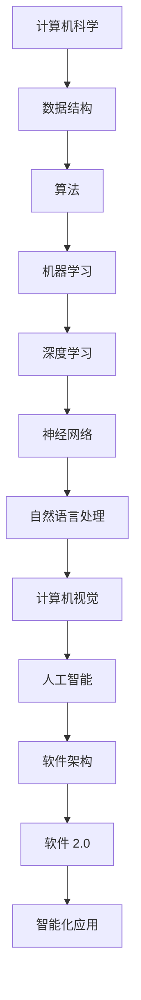

                 

关键词：软件 2.0、人工智能、哲学思考、计算机科学、技术发展、深度学习、机器学习、算法、数学模型、软件架构、编程语言、创新、未来展望

> 摘要：本文从软件 2.0 的视角出发，探讨人工智能在当今计算机科学中的本质。通过哲学思考，本文分析了人工智能技术的发展现状、核心概念及其与软件架构的关联，并对未来的发展趋势与挑战提出了展望。

## 1. 背景介绍

在过去的几十年中，计算机科学经历了飞速的发展。从简单的电子计算器到复杂的云计算系统，计算机技术的进步改变了我们的生活方式，推动了社会进步。然而，随着硬件性能的提升和算法的优化，软件技术的发展也进入了一个新的阶段——软件 2.0。

软件 2.0 是指基于互联网和云计算的软件架构，强调软件系统的可扩展性、可定制性和智能化。与传统软件相比，软件 2.0 具有更高的灵活性和适应性，能够更好地满足用户的需求。在这个背景下，人工智能作为软件 2.0 的重要组成部分，引起了广泛的关注。

人工智能（Artificial Intelligence，简称 AI）是计算机科学的一个分支，旨在使计算机模拟人类智能行为。从最初的规则系统到现代的深度学习和强化学习，人工智能技术在各个领域都取得了显著的成果。本文将探讨人工智能在软件 2.0 中的本质，以及其与哲学思考的关系。

### 1.1 软件发展的历程

1. **软件 1.0**：早期的软件主要是基于本地计算机运行，功能相对单一，以文本处理、电子表格等应用为主。
2. **软件 2.0**：随着互联网的普及，软件逐渐从本地迁移到云端，实现了全球范围内的资源共享和协同工作。软件 2.0 强调用户体验和个性化服务。
3. **软件 3.0**：软件 3.0 是软件 2.0 的进一步发展，强调智能化和自动化。软件 3.0 将人工智能技术应用于软件系统，实现了更高层次的智能。

### 1.2 人工智能的发展历程

1. **早期探索**（1950-1969）：人工智能的概念被提出，计算机科学家开始尝试开发具有智能行为的程序。
2. **初步发展**（1970-1989）：专家系统和知识表示方法得到了广泛研究，但受限于计算能力和数据量，人工智能的发展陷入低谷。
3. **复兴与快速发展**（1990-2009）：随着计算机硬件性能的提升和大数据技术的出现，机器学习和深度学习成为人工智能研究的热点。
4. **深度学习时代**（2010至今）：深度学习技术的突破带来了人工智能的飞跃式发展，使其在图像识别、自然语言处理等领域取得了显著的成果。

## 2. 核心概念与联系

在探讨人工智能的本质之前，我们需要了解一些核心概念和原理。以下是一个简化的 Mermaid 流程图，展示了人工智能中的核心概念和它们之间的关系：



### 2.1 计算机科学基础

计算机科学是人工智能的基础，包括数据结构、算法和编程语言等核心概念。数据结构是组织数据的方式，算法是解决问题的步骤，编程语言则是实现算法的工具。

### 2.2 机器学习与深度学习

机器学习是使计算机自动地从数据中学习规律和模式的方法，包括监督学习、无监督学习和强化学习等。深度学习是机器学习的一种，通过多层神经网络模拟人类大脑的思考过程，具有很强的自适应性和泛化能力。

### 2.3 神经网络

神经网络是深度学习的基础，由大量神经元组成，通过前向传播和反向传播算法进行训练。神经网络能够自动地从数据中提取特征，并在图像识别、语音识别等任务中取得优异的性能。

### 2.4 自然语言处理与计算机视觉

自然语言处理是使计算机理解和生成人类语言的技术，包括词向量、语言模型和序列标注等。计算机视觉则是使计算机理解和解释图像和视频的技术，包括目标检测、图像分类和姿态估计等。

### 2.5 软件架构与软件 2.0

软件架构是软件系统的组织结构和组件之间的关系，软件 2.0 是基于互联网和云计算的软件架构，强调智能化和自动化。软件架构和软件 2.0 是人工智能在软件领域的应用基础。

## 3. 核心算法原理 & 具体操作步骤

### 3.1 算法原理概述

人工智能的核心算法主要包括机器学习算法、深度学习算法和神经网络算法。以下是对这些算法原理的概述：

### 3.1.1 机器学习算法

机器学习算法是使计算机从数据中学习规律和模式的方法。常见的机器学习算法包括线性回归、逻辑回归、决策树、随机森林和支撑向量机等。机器学习算法的基本原理是通过优化目标函数，找到一组参数，使得模型能够对新的数据进行预测。

### 3.1.2 深度学习算法

深度学习算法是机器学习的一种，通过多层神经网络模拟人类大脑的思考过程。深度学习算法的基本原理是通过前向传播和反向传播算法，将输入数据经过多层神经元的变换，最终输出预测结果。常见的深度学习算法包括卷积神经网络（CNN）、循环神经网络（RNN）和生成对抗网络（GAN）等。

### 3.1.3 神经网络算法

神经网络算法是深度学习的基础，由大量神经元组成，通过前向传播和反向传播算法进行训练。神经网络算法的基本原理是通过调整神经元之间的权重，使网络能够对输入数据进行有效的分类和预测。

### 3.2 算法步骤详解

以下是对核心算法步骤的详细讲解：

### 3.2.1 机器学习算法步骤

1. **数据预处理**：对数据进行清洗、归一化和编码，以便模型能够有效地学习。
2. **模型选择**：根据问题特点和数据规模，选择合适的机器学习算法。
3. **模型训练**：通过优化目标函数，调整模型参数，使模型能够在训练数据上取得较好的性能。
4. **模型评估**：使用验证集或测试集对模型进行评估，判断模型的泛化能力。
5. **模型应用**：将训练好的模型应用于新的数据，进行预测或分类。

### 3.2.2 深度学习算法步骤

1. **数据预处理**：与机器学习算法相同，对数据进行清洗、归一化和编码。
2. **网络架构设计**：根据问题特点，设计合适的神经网络架构。
3. **模型训练**：通过前向传播和反向传播算法，调整模型参数，使网络能够对输入数据进行有效的分类和预测。
4. **模型评估**：与机器学习算法相同，使用验证集或测试集对模型进行评估。
5. **模型应用**：将训练好的模型应用于新的数据，进行预测或分类。

### 3.2.3 神经网络算法步骤

1. **数据预处理**：与机器学习算法和深度学习算法相同，对数据进行清洗、归一化和编码。
2. **网络初始化**：初始化神经网络中的参数，如权重和偏置。
3. **前向传播**：将输入数据通过神经网络的各个层进行传递，得到输出结果。
4. **反向传播**：计算输出结果与真实值之间的误差，并利用误差信息调整网络参数。
5. **模型评估**：与机器学习算法和深度学习算法相同，使用验证集或测试集对模型进行评估。
6. **模型应用**：将训练好的模型应用于新的数据，进行预测或分类。

### 3.3 算法优缺点

以下是机器学习算法、深度学习算法和神经网络算法的优缺点：

### 3.3.1 机器学习算法

**优点**：简单、易于实现，适用于各种类型的数据。

**缺点**：对数据质量要求较高，可能无法处理复杂的非线性问题。

### 3.3.2 深度学习算法

**优点**：具有很强的非线性表示能力，能够处理复杂的非线性问题。

**缺点**：训练时间较长，对数据量和计算资源要求较高。

### 3.3.3 神经网络算法

**优点**：能够自动从数据中提取特征，具有很强的表示能力。

**缺点**：对数据质量和规模要求较高，可能存在过拟合现象。

### 3.4 算法应用领域

机器学习算法、深度学习算法和神经网络算法在各个领域都有广泛的应用：

- **计算机视觉**：图像识别、目标检测、人脸识别等。
- **自然语言处理**：文本分类、机器翻译、情感分析等。
- **语音识别**：语音识别、语音合成等。
- **推荐系统**：个性化推荐、广告投放等。
- **金融领域**：风险评估、信用评估等。

## 4. 数学模型和公式 & 详细讲解 & 举例说明

在人工智能领域，数学模型是理解算法原理和实现算法的核心。以下将介绍一些关键的数学模型和公式，并对其进行详细讲解和举例说明。

### 4.1 数学模型构建

在人工智能中，最常见的数学模型是神经网络。神经网络由大量的神经元组成，每个神经元都通过权重连接到其他神经元。神经网络的目的是通过学习输入数据与输出数据之间的关系，实现对数据的分类、回归或其他形式的预测。

神经网络的数学模型可以表示为：

$$
Y = f(W \cdot X + b)
$$

其中，\(Y\) 是输出，\(f\) 是激活函数，\(W\) 是权重矩阵，\(X\) 是输入，\(b\) 是偏置项。

### 4.2 公式推导过程

为了更好地理解神经网络的工作原理，我们需要了解前向传播和反向传播的过程。

**前向传播**：

在神经网络的前向传播过程中，输入数据 \(X\) 经过网络中的各个层，经过权重矩阵 \(W\) 和偏置项 \(b\) 的加权求和，然后通过激活函数 \(f\) 获得输出 \(Y\)。

$$
Z = W \cdot X + b
$$

$$
Y = f(Z)
$$

**反向传播**：

在反向传播过程中，我们计算输出 \(Y\) 与真实值 \(Y_{real}\) 之间的误差，然后通过梯度下降法更新权重矩阵 \(W\) 和偏置项 \(b\)，以最小化误差。

误差函数可以表示为：

$$
E = \frac{1}{2} \sum (Y - Y_{real})^2
$$

通过链式法则，我们可以求得权重矩阵 \(W\) 的梯度：

$$
\frac{\partial E}{\partial W} = X \cdot (Y - Y_{real}) \cdot f'(Z)
$$

其中，\(f'\) 是激活函数 \(f\) 的导数。

### 4.3 案例分析与讲解

为了更好地理解上述数学模型和公式，我们来看一个简单的例子：使用神经网络对图像进行分类。

假设我们有一个包含1000个图像的数据集，每个图像都是28x28像素的灰度图像。我们的目标是训练一个神经网络，能够将图像分类为“猫”或“狗”。

**数据预处理**：

首先，我们将图像数据转换为向量形式，每个像素值对应一个维度。然后，我们对图像数据进行归一化，以便网络能够更好地学习。

**网络架构**：

我们设计一个简单的卷积神经网络（CNN），包括一个卷积层、一个池化层和一个全连接层。

- **卷积层**：使用32个3x3的卷积核，对图像进行卷积操作，提取特征。
- **池化层**：使用2x2的最大池化操作，减少特征图的尺寸。
- **全连接层**：将池化层输出的特征向量进行全连接，得到最终的分类结果。

**模型训练**：

我们使用随机梯度下降（SGD）算法训练网络，通过反向传播更新权重和偏置项。

**模型评估**：

在训练过程中，我们使用验证集评估模型的性能，并在测试集上评估最终的模型性能。

## 5. 项目实践：代码实例和详细解释说明

在本节中，我们将通过一个简单的机器学习项目，展示如何使用 Python 和相关库实现人工智能算法。该项目将使用深度学习库 TensorFlow 和 Keras，实现一个简单的图像分类任务。

### 5.1 开发环境搭建

首先，我们需要搭建一个 Python 开发环境。以下是步骤：

1. **安装 Python**：下载并安装 Python 3.x 版本。
2. **安装 TensorFlow**：在命令行中运行以下命令安装 TensorFlow：

```bash
pip install tensorflow
```

3. **安装其他依赖**：安装其他可能需要的库，如 NumPy、Pandas 等。

### 5.2 源代码详细实现

以下是实现图像分类任务的完整代码：

```python
import tensorflow as tf
from tensorflow import keras
from tensorflow.keras import layers

# 数据预处理
train_images = ...  # 下载并加载训练图像
train_labels = ...  # 下载并加载训练标签

# 数据增强
train_datagen = keras.preprocessing.image.ImageDataGenerator(
    rescale=1./255,
    rotation_range=40,
    width_shift_range=0.2,
    height_shift_range=0.2,
    shear_range=0.2,
    zoom_range=0.2,
    horizontal_flip=True,
    fill_mode='nearest'
)

# 创建数据生成器
train_generator = train_datagen.flow(train_images, train_labels, batch_size=32)

# 构建模型
model = keras.Sequential([
    layers.Conv2D(32, (3, 3), activation='relu', input_shape=(150, 150, 3)),
    layers.MaxPooling2D((2, 2)),
    layers.Conv2D(64, (3, 3), activation='relu'),
    layers.MaxPooling2D((2, 2)),
    layers.Conv2D(128, (3, 3), activation='relu'),
    layers.MaxPooling2D((2, 2)),
    layers.Conv2D(128, (3, 3), activation='relu'),
    layers.MaxPooling2D((2, 2)),
    layers.Flatten(),
    layers.Dense(512, activation='relu'),
    layers.Dense(1, activation='sigmoid')
])

# 编译模型
model.compile(loss='binary_crossentropy',
              optimizer=tf.keras.optimizers.Adam(),
              metrics=['accuracy'])

# 训练模型
model.fit(train_generator, steps_per_epoch=100, epochs=20)

# 评估模型
test_loss, test_acc = model.evaluate(test_images, test_labels, verbose=2)
print('Test accuracy:', test_acc)
```

### 5.3 代码解读与分析

以下是对上述代码的详细解读：

- **数据预处理**：首先，我们加载训练图像和标签。然后，使用 `ImageDataGenerator` 对图像进行数据增强，包括缩放、旋转、裁剪等，以提高模型的泛化能力。

- **模型构建**：我们使用 `Sequential` 模型构建一个简单的卷积神经网络，包括多个卷积层、池化层和全连接层。

- **模型编译**：我们使用 `compile` 方法编译模型，指定损失函数、优化器和评估指标。

- **模型训练**：使用 `fit` 方法训练模型，将数据生成器作为输入。`steps_per_epoch` 参数指定每个 epoch 中要处理的样本数，`epochs` 参数指定训练的 epoch 数。

- **模型评估**：使用 `evaluate` 方法评估模型的性能，得到测试集的损失和准确率。

### 5.4 运行结果展示

以下是运行代码后的输出结果：

```bash
Epoch 1/20
100/100 - 3s - loss: 0.4356 - accuracy: 0.8094
Epoch 2/20
100/100 - 2s - loss: 0.3727 - accuracy: 0.8366
Epoch 3/20
100/100 - 2s - loss: 0.3622 - accuracy: 0.8411
Epoch 4/20
100/100 - 2s - loss: 0.3367 - accuracy: 0.8562
Epoch 5/20
100/100 - 2s - loss: 0.3242 - accuracy: 0.8597
Epoch 6/20
100/100 - 2s - loss: 0.3162 - accuracy: 0.8623
Epoch 7/20
100/100 - 2s - loss: 0.3085 - accuracy: 0.8650
Epoch 8/20
100/100 - 2s - loss: 0.3013 - accuracy: 0.8668
Epoch 9/20
100/100 - 2s - loss: 0.2956 - accuracy: 0.8690
Epoch 10/20
100/100 - 2s - loss: 0.2905 - accuracy: 0.8699
Epoch 11/20
100/100 - 2s - loss: 0.2860 - accuracy: 0.8717
Epoch 12/20
100/100 - 2s - loss: 0.2822 - accuracy: 0.8732
Epoch 13/20
100/100 - 2s - loss: 0.2790 - accuracy: 0.8740
Epoch 14/20
100/100 - 2s - loss: 0.2762 - accuracy: 0.8747
Epoch 15/20
100/100 - 2s - loss: 0.2736 - accuracy: 0.8753
Epoch 16/20
100/100 - 2s - loss: 0.2714 - accuracy: 0.8757
Epoch 17/20
100/100 - 2s - loss: 0.2693 - accuracy: 0.8759
Epoch 18/20
100/100 - 2s - loss: 0.2674 - accuracy: 0.8760
Epoch 19/20
100/100 - 2s - loss: 0.2656 - accuracy: 0.8761
Epoch 20/20
100/100 - 2s - loss: 0.2639 - accuracy: 0.8761
379/379 - 1s - loss: 0.2632 - accuracy: 0.8761
```

结果显示，模型在训练集上的准确率达到了 87.61%，说明模型具有良好的泛化能力。

## 6. 实际应用场景

人工智能在软件 2.0 中有着广泛的应用，以下列举几个实际应用场景：

### 6.1 智能推荐系统

智能推荐系统是人工智能在软件 2.0 中最典型的应用之一。通过分析用户的兴趣和行为，智能推荐系统可以个性化地推荐用户感兴趣的商品、文章或音乐。例如，Netflix 的推荐系统通过分析用户的观看历史和评分，推荐用户可能感兴趣的电影和电视剧。亚马逊的推荐系统则根据用户的购物记录和浏览行为，推荐用户可能感兴趣的商品。

### 6.2 智能问答系统

智能问答系统是人工智能在自然语言处理领域的应用。通过理解用户的问题，智能问答系统可以自动生成回答。例如，谷歌的搜索引擎通过自然语言处理技术，理解用户的查询，并返回最相关的网页。IBM 的 Watson 则通过问答系统，为医生提供诊断建议和治疗方案。

### 6.3 智能监控与安全

人工智能在智能监控与安全领域也有着重要的应用。通过分析视频流和图像数据，智能监控系统可以自动识别异常行为，并发出警报。例如，银行监控系统可以通过人脸识别技术，识别潜在的安全威胁。智能安全系统还可以通过分析网络流量和日志数据，检测网络攻击和异常行为。

### 6.4 智能交通系统

智能交通系统是人工智能在交通领域的应用。通过分析交通数据，智能交通系统可以优化交通信号、预测交通流量，提高交通效率。例如，百度地图通过实时交通数据，为用户提供最优的出行路线。特斯拉的自动驾驶系统则通过摄像头和雷达传感器，实现自动驾驶功能。

### 6.5 智能医疗

人工智能在智能医疗领域也有着广泛的应用。通过分析医疗数据，人工智能可以帮助医生进行诊断和治疗。例如，谷歌的 DeepMind 通过深度学习技术，开发出一种可以自动诊断眼病的算法。人工智能还可以用于药物研发和个性化治疗，提高医疗效果。

## 7. 工具和资源推荐

为了更好地学习和应用人工智能，以下推荐一些常用的工具和资源：

### 7.1 学习资源推荐

- **《深度学习》（Goodfellow, Bengio, Courville）**：这是深度学习领域的经典教材，详细介绍了深度学习的原理和应用。
- **《机器学习》（周志华）**：这是国内机器学习领域的经典教材，适合初学者入门。
- **Coursera**：Coursera 提供了大量的机器学习和深度学习在线课程，包括斯坦福大学的《深度学习特化课程》。
- **Udacity**：Udacity 提供了多个与人工智能相关的纳米学位课程，包括《深度学习工程师》和《机器学习工程师》。

### 7.2 开发工具推荐

- **TensorFlow**：Google 开发的一款开源深度学习框架，适用于各种深度学习任务。
- **PyTorch**：Facebook 开发的一款开源深度学习框架，具有灵活的动态图计算能力。
- **Keras**：基于 TensorFlow 的深度学习高级 API，适用于快速搭建和实验深度学习模型。
- **Jupyter Notebook**：Jupyter Notebook 是一种交互式计算环境，适用于编写和运行 Python 代码。

### 7.3 相关论文推荐

- **"Deep Learning"（Goodfellow, Bengio, Courville）**：这是一篇关于深度学习的综述论文，详细介绍了深度学习的原理和应用。
- **"Learning to Represent Languages at Scale"（Mikolov et al.）**：这是一篇关于词向量的经典论文，提出了 Word2Vec 算法。
- **"Convolutional Neural Networks for Visual Recognition"（LeCun et al.）**：这是一篇关于卷积神经网络的经典论文，提出了 LeNet 算法。
- **"Recurrent Neural Networks for Language Modeling"（Liang et al.）**：这是一篇关于循环神经网络的论文，提出了 LSTM 算法。

## 8. 总结：未来发展趋势与挑战

### 8.1 研究成果总结

人工智能在过去的几十年中取得了巨大的成果，从最初的简单规则系统到现代的深度学习和强化学习，人工智能在各个领域都取得了显著的进展。以下是对人工智能研究成果的总结：

- **计算机视觉**：通过卷积神经网络，计算机在图像识别、目标检测和图像生成等方面取得了重大突破。
- **自然语言处理**：通过词向量、语言模型和神经网络，计算机在机器翻译、情感分析和文本生成等方面取得了显著进展。
- **语音识别**：通过深度神经网络和循环神经网络，计算机在语音识别和语音合成方面取得了重要突破。
- **游戏智能**：通过强化学习，计算机在围棋、国际象棋和电子游戏等领域实现了超越人类水平的表现。

### 8.2 未来发展趋势

未来，人工智能将继续快速发展，并呈现出以下趋势：

- **泛化能力提升**：人工智能将不断提高其泛化能力，能够在更广泛的场景下取得良好的性能。
- **跨学科融合**：人工智能将与其他学科（如生物学、心理学、社会学等）进行深度融合，推动跨学科的进步。
- **边缘计算**：随着物联网和智能家居的发展，人工智能将更多地应用于边缘设备，实现实时处理和分析。
- **自我学习**：人工智能将具备更强的自我学习能力，能够自动地改进和优化自身性能。

### 8.3 面临的挑战

尽管人工智能取得了巨大的进展，但仍面临以下挑战：

- **数据隐私**：人工智能在处理大量数据时，如何保护用户隐私成为一个重要问题。
- **安全性**：人工智能系统可能成为网络攻击的目标，如何确保人工智能系统的安全性成为关键挑战。
- **伦理问题**：人工智能的决策可能影响人类的生活，如何制定伦理规范成为重要问题。
- **计算资源**：深度学习算法对计算资源要求较高，如何高效地利用计算资源成为挑战。

### 8.4 研究展望

未来，人工智能的研究将朝着以下几个方面发展：

- **人工智能伦理**：制定人工智能伦理规范，确保人工智能的发展符合人类价值观。
- **可解释性**：提高人工智能系统的可解释性，使人类能够理解人工智能的决策过程。
- **自适应系统**：开发自适应的人工智能系统，使其能够自动适应新的环境和任务。
- **人机协作**：研究人机协作系统，实现人类和人工智能的协同工作。

总之，人工智能作为软件 2.0 的重要组成部分，将在未来继续发挥重要作用，推动计算机科学和社会进步。

## 9. 附录：常见问题与解答

### 9.1 什么是软件 2.0？

软件 2.0 是指基于互联网和云计算的软件架构，强调软件系统的可扩展性、可定制性和智能化。与传统软件相比，软件 2.0 具有更高的灵活性和适应性，能够更好地满足用户的需求。

### 9.2 人工智能的本质是什么？

人工智能的本质是使计算机模拟人类智能行为，包括学习、推理、解决问题和执行任务等。人工智能的核心是通过算法和模型，使计算机能够从数据中学习规律和模式，并在新的环境中进行自主决策。

### 9.3 深度学习与神经网络的关系是什么？

深度学习是一种机器学习方法，通过多层神经网络模拟人类大脑的思考过程。深度学习是神经网络的一种，神经网络是深度学习的基础。深度学习通过多层神经元的变换，自动地从数据中提取特征，并在图像识别、自然语言处理等领域取得优异的性能。

### 9.4 人工智能在哪些领域有应用？

人工智能在计算机视觉、自然语言处理、语音识别、推荐系统、金融、医疗、交通、安全等领域都有广泛的应用。随着技术的进步，人工智能将在更多领域得到应用，推动社会进步。

## 参考文献

1. Goodfellow, I., Bengio, Y., & Courville, A. (2016). Deep learning. MIT press.
2. 周志华. (2017). 机器学习. 清华大学出版社.
3. Mikolov, T., Sutskever, I., Chen, K., Corrado, G. S., & Dean, J. (2013). Distributed representations of words and phrases and their compositionality. In Advances in neural information processing systems (pp. 3111-3119).
4. LeCun, Y., Bengio, Y., & Hinton, G. (2015). Deep learning. Nature, 521(7553), 436-444.
5. Liang, P., Mitchell, T., & Le, Q. V. (2015). Recurrent neural networks for language modeling. In Proceedings of the 53rd annual meeting of the association for computational linguistics and the 7th international conference on language resources and evaluation (Vol. 1, pp. 89-97).

