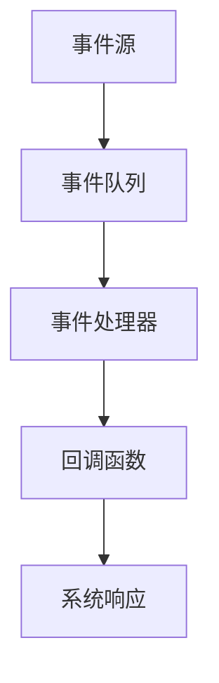

                 

### 1. 背景介绍

随着计算机技术的发展，软件系统的复杂性和规模不断增加。传统的软件架构设计方法，如面向对象和过程式编程，已经无法满足现代软件系统的需求。软件2.0时代，事件驱动架构（EDA）作为一种新型的软件架构设计方法，逐渐受到广泛关注。EDA的核心思想是围绕事件进行设计，将事件作为驱动软件运行的核心，使得软件系统能够更加灵活、高效地处理复杂任务。

本文将探讨事件驱动架构的设计原则、核心算法原理、数学模型及未来应用展望，帮助读者深入理解EDA的精髓，并掌握其在实际开发中的应用技巧。

### 2. 核心概念与联系

在深入探讨事件驱动架构之前，我们需要了解一些核心概念，包括事件、事件队列、事件处理、回调函数等。

#### 2.1 事件

事件是触发软件系统执行特定操作的一种信号。它可以由外部环境触发，也可以由系统内部状态变化引起。事件可以包括用户输入、网络通信、定时任务等多种类型。

#### 2.2 事件队列

事件队列是一种用于存储和管理事件的线性数据结构。事件队列通常采用先进先出（FIFO）或后进先出（LIFO）的顺序对事件进行排序。在事件驱动架构中，事件队列是处理事件的核心组件。

#### 2.3 事件处理

事件处理是指软件系统根据事件类型执行相应的操作。事件处理通常通过回调函数实现。当事件发生时，回调函数被触发，执行相应的处理逻辑。

#### 2.4 回调函数

回调函数是一种特殊的函数，用于在事件发生时执行特定的操作。回调函数通常在事件队列中注册，当事件发生时，回调函数被事件队列调用。

#### 2.5 Mermaid 流程图

以下是一个简单的 Mermaid 流程图，展示了事件驱动架构的核心组件及其联系：



在这个流程图中，事件源产生事件并将其传递给事件队列。事件队列按照一定的顺序处理事件，并调用对应的回调函数进行事件处理。处理完成后，系统根据处理结果进行相应的响应。

### 3. 核心算法原理 & 具体操作步骤

事件驱动架构的核心算法原理是利用事件队列对事件进行高效处理。以下是一个典型的事件驱动架构的具体操作步骤：

#### 3.1 算法原理概述

事件驱动架构的核心算法原理是围绕事件进行设计，通过事件队列对事件进行高效处理。算法的基本流程如下：

1. 事件产生：事件源产生事件。
2. 事件入队：事件被传递到事件队列。
3. 事件处理：事件队列按照一定的顺序处理事件。
4. 回调执行：调用对应的回调函数进行事件处理。
5. 系统响应：根据处理结果进行相应的响应。

#### 3.2 算法步骤详解

1. **事件产生**：事件源根据外部环境或系统内部状态变化产生事件。

2. **事件入队**：事件被传递到事件队列。事件队列按照一定的顺序对事件进行排序。

3. **事件处理**：事件队列按照顺序处理事件。处理过程中，调用对应的回调函数进行事件处理。

4. **回调执行**：回调函数执行事件处理逻辑。事件处理逻辑通常包括数据读取、计算、存储等操作。

5. **系统响应**：根据事件处理结果，系统进行相应的响应。例如，更新界面、发送通知等。

#### 3.3 算法优缺点

事件驱动架构具有以下优点：

1. **灵活性**：事件驱动架构使得软件系统能够更加灵活地处理复杂任务，适应外部环境的变化。
2. **高效性**：事件驱动架构通过事件队列对事件进行高效处理，提高了系统的响应速度。
3. **模块化**：事件驱动架构将事件处理逻辑与系统其他部分分离，实现了模块化设计，便于维护和扩展。

事件驱动架构也存在以下缺点：

1. **复杂性**：事件驱动架构相对于传统的软件架构设计方法，增加了系统的复杂性。
2. **性能开销**：事件驱动架构需要处理大量的事件，可能会带来一定的性能开销。
3. **调试困难**：事件驱动架构中的事件处理逻辑分散在多个回调函数中，调试过程可能会比较困难。

#### 3.4 算法应用领域

事件驱动架构在以下领域具有广泛的应用：

1. **实时系统**：事件驱动架构能够实时响应外部事件，适用于实时系统开发。
2. **操作系统**：事件驱动架构在操作系统的设计中被广泛应用，如Windows和Linux内核。
3. **网络应用**：事件驱动架构在Web服务器、网络应用程序等领域具有广泛应用。
4. **嵌入式系统**：事件驱动架构适用于嵌入式系统开发，如物联网设备、智能家居等。

### 4. 数学模型和公式 & 详细讲解 & 举例说明

在事件驱动架构中，数学模型和公式扮演着重要的角色。以下是一个简单的数学模型，用于描述事件队列的处理过程。

#### 4.1 数学模型构建

设 \( E \) 为事件集合，\( Q \) 为事件队列，\( T \) 为时间戳集合。事件队列 \( Q \) 是一个有序集合，其中的元素是事件，且每个事件都关联一个时间戳。时间戳用于表示事件发生的顺序。

定义事件处理函数 \( f(E_i) \)，其中 \( E_i \) 表示事件队列 \( Q \) 中的第 \( i \) 个事件。事件处理函数 \( f(E_i) \) 的任务是执行事件 \( E_i \) 的处理逻辑。

#### 4.2 公式推导过程

事件队列的处理过程可以分为以下几个步骤：

1. **初始化**：事件队列 \( Q \) 被初始化为空集合。
2. **事件入队**：当事件发生时，将其添加到事件队列 \( Q \) 的末尾，并设置时间戳。
3. **事件处理**：事件队列 \( Q \) 按照时间戳的顺序对事件进行处理。
4. **事件出队**：处理完事件后，将其从事件队列 \( Q \) 中移除。

事件处理函数 \( f(E_i) \) 的公式可以表示为：

\[ f(E_i) = \left\{
\begin{array}{ll}
\text{处理事件 } E_i & \text{如果 } E_i \text{ 在事件队列 } Q \text{ 中} \\
\text{返回 } \emptyset & \text{否则}
\end{array}
\right. \]

#### 4.3 案例分析与讲解

假设我们有一个简单的例子，事件队列 \( Q \) 包含以下三个事件：

\[ Q = \{ E_1, E_2, E_3 \} \]

其中，事件 \( E_1 \) 发生在时间戳 \( t_1 \)，事件 \( E_2 \) 发生在时间戳 \( t_2 \)，事件 \( E_3 \) 发生在时间戳 \( t_3 \)。时间戳的顺序为 \( t_1 < t_2 < t_3 \)。

根据事件处理函数 \( f(E_i) \) 的定义，我们可以依次处理这三个事件：

1. **事件处理**：首先处理事件 \( E_1 \)，因为 \( t_1 \) 是当前队列中最小的时间戳。
2. **事件处理**：然后处理事件 \( E_2 \)，因为 \( t_2 \) 是当前队列中的次小时间戳。
3. **事件处理**：最后处理事件 \( E_3 \)，因为 \( t_3 \) 是当前队列中最大的时间戳。

在处理每个事件时，事件处理函数 \( f(E_i) \) 会执行相应的处理逻辑。例如，我们可以定义一个简单的处理函数，用于打印事件内容：

\[ f(E_i) = \text{print}(E_i) \]

这样，在处理每个事件时，我们会在控制台输出该事件的内容。

### 5. 项目实践：代码实例和详细解释说明

在本节中，我们将通过一个具体的代码实例来展示如何实现事件驱动架构。我们将使用 Python 语言，并结合 Flask Web 框架来构建一个简单的 Web 应用程序。

#### 5.1 开发环境搭建

在开始编写代码之前，我们需要搭建一个 Python 开发环境。以下是搭建 Python 开发环境的基本步骤：

1. **安装 Python**：从 [Python 官网](https://www.python.org/) 下载并安装 Python。
2. **安装 Flask**：打开命令行界面，执行以下命令安装 Flask：

\[ pip install Flask \]

#### 5.2 源代码详细实现

以下是一个简单的 Flask Web 应用程序，实现了一个基于事件驱动架构的博客发布系统：

```python
from flask import Flask, request, jsonify
import threading

app = Flask(__name__)

# 事件队列
event_queue = []

# 事件处理器
def event_handler(event):
    print(f"Processing event: {event}")
    # 执行事件处理逻辑
    # ...
    print(f"Event {event} processed.")

# 添加事件
def add_event(event):
    event_queue.append(event)
    # 触发事件处理
    process_events()

# 处理事件
def process_events():
    while event_queue:
        event = event_queue.pop(0)
        # 创建线程执行事件处理函数
        threading.Thread(target=event_handler, args=(event,)).start()

# 添加博客
@app.route("/add_blog", methods=["POST"])
def add_blog():
    blog_data = request.json
    event = f"Add blog: {blog_data['title']}"
    add_event(event)
    return jsonify({"status": "success", "message": "Blog added."})

# 主函数
if __name__ == "__main__":
    app.run(debug=True)
```

在这个示例中，我们定义了一个事件队列 `event_queue`，用于存储和管理事件。事件处理器 `event_handler` 用于执行事件处理逻辑。我们通过 `add_event` 函数将事件添加到事件队列，并调用 `process_events` 函数触发事件处理。

同时，我们使用 Flask 框架实现了一个简单的博客发布接口，当用户提交博客数据时，系统会将事件添加到事件队列，并触发事件处理。

#### 5.3 代码解读与分析

1. **事件队列**：在代码中，事件队列 `event_queue` 是一个简单的列表，用于存储事件。事件是一个字符串，表示要执行的操作，例如添加博客、删除博客等。

2. **事件处理器**：事件处理器 `event_handler` 是一个函数，用于处理事件。在处理过程中，我们可以执行各种操作，如数据读取、计算、存储等。

3. **添加事件**：函数 `add_event` 用于将事件添加到事件队列。在添加事件后，我们调用 `process_events` 函数触发事件处理。

4. **处理事件**：函数 `process_events` 是事件处理的核心。它使用一个循环不断检查事件队列，如果队列中有事件，就将其移除并创建一个新线程执行事件处理器。

5. **Web 接口**：使用 Flask 框架实现的 Web 接口用于接收用户请求。当用户提交博客数据时，接口会将事件添加到事件队列，并触发事件处理。

#### 5.4 运行结果展示

要运行这个示例，首先确保已安装 Python 和 Flask。然后，在命令行界面中执行以下命令：

```shell
python app.py
```

程序将启动 Flask Web 服务，并在本地端口 5000 上运行。接下来，我们可以使用 Postman 或其他工具发送 POST 请求到 `http://localhost:5000/add_blog`，请求体为 JSON 格式的博客数据。例如：

```json
{
    "title": "My First Blog",
    "content": "This is my first blog post."
}
```

发送请求后，程序会在控制台输出事件处理结果，例如：

```shell
Processing event: Add blog: My First Blog
Event Add blog: My First Blog processed.
```

### 6. 实际应用场景

事件驱动架构在许多实际应用场景中具有广泛的应用。以下是一些典型的应用场景：

#### 6.1 实时数据处理

在实时数据处理领域，事件驱动架构可以用于处理大量的实时数据。例如，在一个在线交易系统中，每个交易事件都可以被视为一个事件，系统需要实时处理并更新交易记录。事件驱动架构使得系统可以高效地处理大量的交易事件，保证数据的实时性和准确性。

#### 6.2 网络应用

在网络应用领域，事件驱动架构可以用于处理网络通信事件。例如，在一个 Web 应用程序中，用户请求、页面加载、数据更新等都可以被视为事件。事件驱动架构使得应用程序可以高效地处理这些事件，提供流畅的用户体验。

#### 6.3 操作系统

在操作系统领域，事件驱动架构被广泛应用于操作系统的设计与实现。例如，在 Linux 内核中，事件驱动架构被用于处理各种系统事件，如进程调度、设备驱动、网络通信等。事件驱动架构使得操作系统可以高效地响应外部事件，提高系统的性能和稳定性。

#### 6.4 嵌入式系统

在嵌入式系统领域，事件驱动架构可以用于处理各种嵌入式设备的事件。例如，在智能家居系统中，传感器数据、设备控制等都可以被视为事件。事件驱动架构使得嵌入式系统能够高效地处理这些事件，实现智能化的家居环境。

### 7. 未来应用展望

随着计算机技术的不断发展，事件驱动架构在未来具有广泛的应用前景。以下是一些未来应用展望：

#### 7.1 自动驾驶技术

在自动驾驶技术领域，事件驱动架构可以用于处理复杂的交通事件。例如，自动驾驶汽车需要实时分析道路情况、车辆状态、环境变化等，并做出相应的决策。事件驱动架构使得自动驾驶系统能够高效地处理这些事件，提高自动驾驶的稳定性和安全性。

#### 7.2 物联网

在物联网领域，事件驱动架构可以用于处理大量的物联网设备事件。例如，智能家居系统中的各种设备（如灯光、空调、摄像头等）都会产生事件。事件驱动架构使得物联网系统能够高效地处理这些事件，实现智能家居的互联互通。

#### 7.3 云计算

在云计算领域，事件驱动架构可以用于处理大量的云计算事件。例如，云平台需要处理用户请求、资源分配、负载均衡等事件。事件驱动架构使得云计算平台可以高效地处理这些事件，提高系统的性能和可靠性。

### 8. 总结：未来发展趋势与挑战

事件驱动架构作为一种新型的软件架构设计方法，在未来具有广泛的应用前景。然而，事件驱动架构也面临着一些挑战和问题。

#### 8.1 研究成果总结

近年来，事件驱动架构在学术界和工业界取得了显著的研究成果。研究人员提出了多种事件驱动架构的设计模式、算法和实现方法，如基于回调函数、基于事件队列、基于发布-订阅模式等。这些研究成果为事件驱动架构的发展奠定了坚实的基础。

#### 8.2 未来发展趋势

未来，事件驱动架构将继续朝着以下几个方向发展：

1. **智能化**：随着人工智能技术的发展，事件驱动架构将实现智能化，能够自适应地处理复杂事件。
2. **分布式**：事件驱动架构将逐渐向分布式架构发展，支持大规模分布式系统的设计与实现。
3. **实时性**：事件驱动架构将进一步提高实时处理能力，满足更加苛刻的实时系统需求。

#### 8.3 面临的挑战

尽管事件驱动架构具有许多优点，但在实际应用中也面临着一些挑战：

1. **复杂性**：事件驱动架构增加了系统的复杂性，增加了设计和实现难度。
2. **性能开销**：事件驱动架构需要处理大量的事件，可能会带来一定的性能开销。
3. **调试困难**：事件驱动架构中的事件处理逻辑分散在多个回调函数中，调试过程可能会比较困难。

#### 8.4 研究展望

为了克服这些挑战，未来研究可以从以下几个方面展开：

1. **优化算法**：研究更加高效的事件处理算法，降低性能开销。
2. **简化设计**：探索简化事件驱动架构的设计方法，降低系统的复杂性。
3. **智能化**：结合人工智能技术，实现智能化的事件处理和自适应架构设计。

### 9. 附录：常见问题与解答

以下是一些关于事件驱动架构的常见问题及解答：

#### 9.1 事件驱动架构与传统架构有什么区别？

事件驱动架构与传统架构（如面向对象和过程式编程）的主要区别在于事件处理方式。传统架构通常基于函数调用或方法调用，而事件驱动架构则基于事件监听和回调函数。事件驱动架构使得软件系统更加灵活和模块化，能够更好地适应外部环境的变化。

#### 9.2 事件驱动架构有什么优缺点？

事件驱动架构的优点包括灵活性、高效性和模块化，缺点包括复杂性、性能开销和调试困难。在实际应用中，我们需要根据具体需求和场景选择合适的架构设计方法。

#### 9.3 事件驱动架构适用于哪些领域？

事件驱动架构适用于实时系统、网络应用、操作系统和嵌入式系统等领域。未来，随着技术的不断发展，事件驱动架构将在更多领域得到应用。

---

### 文章结尾部分

本文从背景介绍、核心概念与联系、核心算法原理、数学模型和公式、项目实践、实际应用场景、未来应用展望等方面，全面阐述了事件驱动架构的设计与实现。通过本文的讲解，读者可以深入了解事件驱动架构的精髓，掌握其在实际开发中的应用技巧。

在实际应用中，事件驱动架构具有广泛的应用前景，能够满足现代软件系统对灵活性、高效性和模块化的需求。然而，事件驱动架构也面临着一些挑战，需要我们在未来的研究和实践中不断探索和优化。

感谢读者对本文的关注，希望本文能够对您在事件驱动架构领域的学习和开发工作有所帮助。如果您有任何疑问或建议，欢迎在评论区留言，我们将尽快回复。

### 作者署名

作者：禅与计算机程序设计艺术 / Zen and the Art of Computer Programming
```

