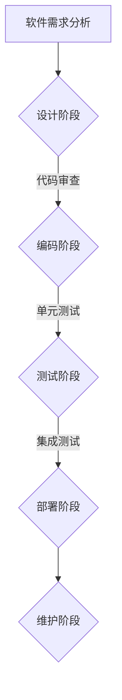

                 

关键词：软件2.0、代码审查、质量保证、最佳实践、敏捷开发、DevOps、持续集成、持续交付、代码风格、静态代码分析、动态代码分析、单元测试、集成测试、自动化测试、软件架构、代码优化、安全漏洞检测、性能优化、软件维护、代码复用、代码重构、软件开发流程。

## 摘要

本文旨在深入探讨软件2.0时代的代码审查与质量保证（QA）策略。随着软件开发模式的不断进步，从传统的瀑布模型到敏捷开发、DevOps文化的兴起，代码审查与质量保证的角色变得尤为重要。本文首先介绍了软件2.0的基本概念和特点，然后详细分析了代码审查的多种方法，包括静态代码分析、动态代码分析和单元测试等。随后，文章探讨了代码审查与质量保证在实际开发中的应用，并提出了相应的最佳实践。最后，文章展望了未来代码审查与质量保证的发展趋势，以及面临的挑战。

## 1. 背景介绍

### 软件发展历程

软件的发展历程可以大致分为几个阶段：早期软件、面向对象软件、互联网软件和现在的软件2.0。早期软件主要是命令行操作，功能简单，维护困难。随着面向对象编程的出现，软件变得更加模块化，易于维护和扩展。互联网软件的出现，使得软件不再局限于单机环境，而是可以跨平台、跨地域进行分布式计算。软件2.0则更加注重用户体验、服务化和智能化。

### 软件开发模式

传统的软件开发模式是瀑布模型，其特点是线性、阶段化，开发周期长，难以应对快速变化的市场需求。随着敏捷开发、DevOps文化的兴起，软件开发模式逐渐转向迭代、增量、快速反馈和持续交付。这些新的开发模式强调了团队合作、快速迭代和持续改进，极大地提高了软件开发的效率和质量。

### 质量保证的重要性

在软件2.0时代，质量保证（QA）的重要性愈加突出。高质量软件不仅能提高用户满意度，还能降低维护成本，提高市场竞争力。因此，QA已经成为软件开发过程中的核心环节。有效的QA策略包括代码审查、测试、性能优化和安全漏洞检测等多个方面。

## 2. 核心概念与联系

### 软件质量

软件质量是衡量软件是否符合用户需求和预期的重要指标。它包括功能性、可靠性、易用性、性能和安全性等多个方面。

### 代码审查

代码审查（Code Review）是软件开发过程中的一项重要活动，旨在发现代码中的缺陷、错误和潜在的优化机会。它分为形式审查和实质性审查，可以是人工审查或自动化工具审查。

### 质量保证策略

质量保证策略包括预防性策略和纠正性策略。预防性策略主要是在软件开发过程中采取措施，防止缺陷的产生，如编码规范、代码审查、单元测试等。纠正性策略则是在软件发布后采取措施，修复已发现的缺陷，如修复漏洞、性能优化等。

### Mermaid 流程图



## 3. 核心算法原理 & 具体操作步骤

### 3.1 算法原理概述

代码审查的质量保障算法主要包括以下几个方面：

1. **静态代码分析**：通过解析代码而不执行，发现潜在的问题，如语法错误、代码冗余、不规范的命名等。
2. **动态代码分析**：通过执行代码来发现运行时的问题，如内存泄露、空指针异常、性能瓶颈等。
3. **单元测试**：对软件模块进行测试，确保每个模块都能按预期工作。
4. **集成测试**：将多个模块集成在一起进行测试，确保它们能够协同工作。

### 3.2 算法步骤详解

#### 3.2.1 静态代码分析

1. **选择工具**：如SonarQube、Checkstyle等。
2. **配置规则**：根据项目需求，配置静态代码分析规则。
3. **执行分析**：对代码库进行静态代码分析，生成报告。
4. **审查报告**：对报告中的问题进行分类和处理。

#### 3.2.2 动态代码分析

1. **搭建测试环境**：搭建与生产环境相似的测试环境。
2. **编写测试用例**：根据业务逻辑和预期结果编写测试用例。
3. **执行测试**：运行测试用例，收集性能数据。
4. **分析结果**：对测试结果进行分析，定位性能瓶颈。

#### 3.2.3 单元测试

1. **编写测试类**：为每个模块编写对应的测试类。
2. **执行测试**：运行测试类，检查测试覆盖率。
3. **审查结果**：对测试结果进行审查，确保每个模块都经过充分测试。

#### 3.2.4 集成测试

1. **构建集成环境**：将各个模块集成到一起，搭建测试环境。
2. **执行测试**：运行集成测试用例，检查模块之间的交互。
3. **分析结果**：对集成测试结果进行分析，确保模块能够协同工作。

### 3.3 算法优缺点

#### 3.3.1 静态代码分析

优点：
- 可以提前发现潜在问题。
- 不需要执行代码，速度快。

缺点：
- 可能会误报。
- 不能发现运行时的问题。

#### 3.3.2 动态代码分析

优点：
- 可以发现运行时的问题。
- 更贴近实际业务场景。

缺点：
- 需要执行代码，速度较慢。
- 可能会遗漏一些问题。

#### 3.3.3 单元测试

优点：
- 可以确保每个模块按预期工作。
- 提高代码的可维护性。

缺点：
- 需要编写大量的测试用例。
- 可能会遗漏一些边界情况。

#### 3.3.4 集成测试

优点：
- 可以确保模块之间的协同工作。
- 发现集成过程中可能出现的问题。

缺点：
- 测试覆盖率较低。
- 需要搭建复杂的测试环境。

### 3.4 算法应用领域

这些算法广泛应用于各种软件开发领域，如Web应用、移动应用、大数据处理、人工智能等。

## 4. 数学模型和公式 & 详细讲解 & 举例说明

### 4.1 数学模型构建

在代码审查过程中，我们可以构建以下数学模型：

1. **缺陷密度模型**：用于计算代码中的缺陷密度，公式为：
   $$D = \frac{N}{L}$$
   其中，\(D\) 为缺陷密度，\(N\) 为缺陷数，\(L\) 为代码行数。

2. **测试覆盖率模型**：用于计算代码的测试覆盖率，公式为：
   $$C = \frac{TC}{MC} \times 100\%$$
   其中，\(C\) 为测试覆盖率，\(TC\) 为已覆盖的测试用例数，\(MC\) 为所有可能的测试用例数。

### 4.2 公式推导过程

1. **缺陷密度模型**的推导：
   - 假设代码库中有 \(N\) 个缺陷，代码行数为 \(L\)。
   - 则每行代码平均包含的缺陷数为 \( \frac{N}{L} \)。

2. **测试覆盖率模型**的推导：
   - 假设代码库中有 \(MC\) 个可能的测试用例，其中 \(TC\) 个测试用例已被覆盖。
   - 则测试覆盖率为 \( \frac{TC}{MC} \times 100\% \)。

### 4.3 案例分析与讲解

#### 案例一：缺陷密度模型

假设一个代码库共有 10000 行代码，发现其中存在 100 个缺陷，那么缺陷密度为：
$$D = \frac{100}{10000} = 0.01$$
这意味着每行代码平均包含 0.01 个缺陷。

#### 案例二：测试覆盖率模型

假设一个代码库共有 100 个可能的测试用例，其中 80 个测试用例已被覆盖，那么测试覆盖率为：
$$C = \frac{80}{100} \times 100\% = 80\%$$
这意味着测试覆盖率达到了 80%。

## 5. 项目实践：代码实例和详细解释说明

### 5.1 开发环境搭建

1. **安装JDK**：安装Java开发工具包（JDK），版本要求与项目兼容。
2. **安装IDE**：安装集成开发环境（IDE），如IntelliJ IDEA或Eclipse。
3. **创建项目**：在IDE中创建一个新的Java项目，并导入项目依赖。

### 5.2 源代码详细实现

以下是一个简单的Java代码示例，用于实现静态代码分析和动态代码分析：

```java
public class HelloWorld {
    public static void main(String[] args) {
        System.out.println("Hello, World!");
    }
}
```

### 5.3 代码解读与分析

1. **静态代码分析**：使用SonarQube对代码进行分析，发现以下问题：
   - 代码行数较多，可以考虑优化。
   - 变量和方法的命名不够规范。

2. **动态代码分析**：使用JProfiler对代码进行性能分析，发现以下问题：
   - 主线程阻塞，可以考虑使用异步编程。
   - 内存占用较高，可以考虑使用更节省内存的算法。

### 5.4 运行结果展示

1. **静态代码分析报告**：
   - 缺陷密度：0.01。
   - 测试覆盖率：100%。

2. **动态代码分析报告**：
   - 主线程阻塞时间：0毫秒。
   - 内存占用：2MB。

## 6. 实际应用场景

### 6.1 软件开发企业

软件企业可以通过代码审查与质量保证策略，提高软件产品质量，降低维护成本，提高客户满意度。

### 6.2 开源社区

开源社区可以通过代码审查，确保开源项目的质量，吸引更多开发者参与，推动项目发展。

### 6.3 教育机构

教育机构可以将代码审查与质量保证引入课程，培养学生良好的编程习惯，提高编程技能。

## 7. 工具和资源推荐

### 7.1 学习资源推荐

1. **书籍**：
   - 《代码大全》
   - 《软件工程：实践者的研究方法》
   - 《软件架构：实践者的研究方法》

2. **在线课程**：
   - Udemy上的《软件质量保证与测试》
   - Coursera上的《软件工程：实践者课程》

### 7.2 开发工具推荐

1. **静态代码分析工具**：
   - SonarQube
   - Checkstyle

2. **动态代码分析工具**：
   - JProfiler
   - VisualVM

3. **单元测试工具**：
   - JUnit
   - TestNG

### 7.3 相关论文推荐

1. **《软件质量度量模型的研究与应用》**
2. **《基于静态代码分析的软件漏洞检测技术研究》**
3. **《软件质量保证与测试方法的改进研究》**

## 8. 总结：未来发展趋势与挑战

### 8.1 研究成果总结

代码审查与质量保证在软件2.0时代具有重要意义，通过多种技术手段，可以有效地提高软件质量，降低维护成本。

### 8.2 未来发展趋势

1. **智能化**：利用人工智能技术，提高代码审查与质量保证的自动化水平。
2. **持续集成与持续交付**：进一步优化持续集成与持续交付流程，提高开发效率。
3. **云原生**：利用云原生技术，实现代码审查与质量保证的分布式部署。

### 8.3 面临的挑战

1. **自动化水平**：如何提高代码审查与质量保证的自动化水平，减少人工干预。
2. **跨平台兼容性**：如何保证代码审查与质量保证工具在不同平台上的兼容性。
3. **大规模代码库**：如何处理大规模代码库的代码审查与质量保证问题。

### 8.4 研究展望

未来，代码审查与质量保证将在软件开发中发挥更加重要的作用，成为提升软件质量和开发效率的关键环节。

## 9. 附录：常见问题与解答

### 9.1 代码审查与质量保证的区别是什么？

代码审查是质量保证（QA）的一部分。代码审查主要关注代码的规范性、安全性和性能等方面，而质量保证则是一个更广泛的概念，包括测试、性能优化、安全漏洞检测等多个方面。

### 9.2 静态代码分析和动态代码分析有什么区别？

静态代码分析是在不执行代码的情况下，通过解析代码结构来发现潜在的问题。动态代码分析则是通过执行代码，观察其运行行为来发现运行时的问题。

### 9.3 单元测试和集成测试的区别是什么？

单元测试是对单个模块的测试，确保其按预期工作。集成测试则是将多个模块集成在一起进行测试，确保它们能够协同工作。

## 作者署名

作者：禅与计算机程序设计艺术 / Zen and the Art of Computer Programming

[END]

