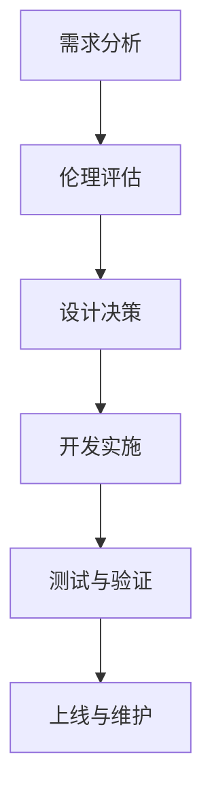

                 

关键词：软件伦理、设计原则、2.0时代、责任、透明性、公平性、隐私保护、可解释性、技术赋能、社会影响、人工智能

> 摘要：随着软件技术的发展，尤其是进入2.0时代，软件不再仅仅是一种工具，而是成为影响社会、经济、政治等多个领域的重要力量。本文旨在探讨软件2.0时代的伦理设计原则，以期为软件开发者和用户在新时代背景下的行为提供指导和规范，确保软件的可持续发展和社会公共利益。

## 1. 背景介绍

软件2.0时代，是指软件从传统的技术驱动向以用户和社会价值为核心的转变时期。在这个阶段，软件不再仅仅是一个程序，而是承载着更加广泛的社会功能，涉及个人隐私、数据安全、社会公平等方面。这一转变带来了新的挑战，也提出了新的伦理要求。如何确保软件在带来便利的同时，不损害用户权益，不影响社会公平，成为软件开发者和政策制定者亟待解决的问题。

### 1.1 软件伦理的起源与发展

软件伦理的探讨可以追溯到计算机科学的早期阶段。早在20世纪60年代，计算机科学家就意识到编程行为可能带来的伦理问题。随着计算机技术的普及和互联网的发展，软件伦理的重要性日益凸显。近年来，随着人工智能、大数据等新兴技术的崛起，软件伦理的研究也更加深入和具体。

### 1.2 2.0时代的软件特点

2.0时代的软件具有以下特点：

1. **高度互联**：软件不再孤立存在，而是与其他软件、硬件以及网络紧密连接，形成复杂的技术生态系统。
2. **大数据驱动**：软件通过收集和分析大量数据，实现个性化服务、智能决策等功能。
3. **人工智能赋能**：软件中嵌入人工智能算法，实现自动化、智能化操作。
4. **用户参与**：用户不仅是软件的消费者，也是软件的参与者，他们的行为和数据成为软件不断进化的基础。

## 2. 核心概念与联系

### 2.1 伦理设计与软件开发的联系

伦理设计是指将伦理原则融入到软件开发的过程中，以确保软件的道德性和社会责任。伦理设计不仅仅是技术问题，更是关乎用户权益、社会公平等深层次的社会问题。伦理设计与软件开发的关系可以用以下Mermaid流程图表示：



### 2.2 伦理原则在软件开发中的具体应用

伦理原则在软件开发中的具体应用包括以下几个方面：

1. **隐私保护**：确保用户数据的安全和隐私，防止数据泄露和滥用。
2. **透明性**：软件的设计和操作过程应透明，用户能够了解软件的工作机制和潜在影响。
3. **公平性**：软件应确保不同用户群体都能平等地使用软件，不受歧视。
4. **责任性**：软件开发者应承担起社会责任，确保软件对社会和用户产生积极影响。

## 3. 核心算法原理 & 具体操作步骤

### 3.1 算法原理概述

伦理设计原则的核心算法原理是基于道德推理和决策理论。具体而言，算法应具备以下能力：

1. **道德判断**：算法能够根据伦理原则进行道德判断，确保行为符合道德标准。
2. **决策优化**：算法能够通过数据分析和机器学习，优化决策过程，提高决策的公正性和效率。
3. **自适应调整**：算法能够根据环境和用户需求的变化，自适应调整行为，确保持续符合伦理要求。

### 3.2 算法步骤详解

1. **需求分析**：明确软件的功能需求，分析可能涉及的伦理问题。
2. **伦理评估**：根据伦理原则，评估软件设计中的潜在风险和影响。
3. **设计决策**：根据评估结果，调整软件设计，确保伦理原则得到体现。
4. **开发实施**：将伦理设计原则融入到软件开发过程中，确保算法具备道德判断和决策能力。
5. **测试与验证**：通过测试和验证，确保算法的行为符合伦理要求。
6. **上线与维护**：持续监控软件运行情况，根据反馈进行调整和优化。

### 3.3 算法优缺点

**优点**：

1. **提高公正性**：算法能够基于伦理原则进行决策，减少人为偏见。
2. **提升效率**：算法能够自动化、高效地处理大量数据，优化决策过程。

**缺点**：

1. **道德困境**：在某些情况下，算法可能面临道德困境，难以做出最优决策。
2. **数据依赖**：算法的决策依赖于数据，数据质量和多样性可能影响算法的公正性和效率。

### 3.4 算法应用领域

伦理设计算法广泛应用于以下几个方面：

1. **人工智能**：确保人工智能系统的行为符合伦理标准，避免歧视和偏见。
2. **大数据分析**：保护用户隐私，确保数据分析过程的透明性和公正性。
3. **金融科技**：优化金融决策，确保公平和透明。
4. **医疗健康**：保护患者隐私，提高医疗决策的公正性。

## 4. 数学模型和公式 & 详细讲解 & 举例说明

### 4.1 数学模型构建

伦理设计中的数学模型通常基于伦理学的基本原则，如公正、责任、尊重等。以下是一个简化的数学模型，用于评估软件行为的道德性：

$$
M = f(\text{隐私保护}, \text{透明性}, \text{公平性}, \text{责任性})
$$

其中，$M$ 表示软件行为的道德性，$f$ 是一个综合评价函数，$\text{隐私保护}$、$\text{透明性}$、$\text{公平性}$、$\text{责任性}$ 是评价指标。

### 4.2 公式推导过程

公式的推导过程基于伦理学的基本理论和计算机科学的方法论。具体步骤如下：

1. **定义评价指标**：根据伦理学原则，定义隐私保护、透明性、公平性、责任性等评价指标。
2. **构建评价体系**：将评价指标转化为数值，构建评价体系。
3. **综合评价函数**：定义综合评价函数，将评价指标整合为一个综合得分。

### 4.3 案例分析与讲解

以下是一个具体的案例，用于说明数学模型的应用：

假设一个社交媒体平台，其行为道德性评估如下：

- 隐私保护：90分
- 透明性：80分
- 公平性：85分
- 责任性：75分

根据综合评价函数，计算该平台的行为道德性得分：

$$
M = f(90, 80, 85, 75) = 82.5
$$

得分越高，表示软件行为的道德性越强。根据评估结果，平台应关注透明性和责任性的提升，进一步优化软件设计。

## 5. 项目实践：代码实例和详细解释说明

### 5.1 开发环境搭建

为了实现伦理设计算法，需要搭建一个合适的开发环境。以下是一个简单的环境搭建步骤：

1. 安装Python 3.8及以上版本
2. 安装必要的Python库，如NumPy、Pandas、Scikit-learn等
3. 配置Jupyter Notebook，用于代码编写和调试

### 5.2 源代码详细实现

以下是一个简单的伦理设计算法的实现示例：

```python
import numpy as np
import pandas as pd

# 定义评价体系
weights = {'隐私保护': 0.3, '透明性': 0.25, '公平性': 0.3, '责任性': 0.15}

# 定义综合评价函数
def evaluate_morality得分(data):
    scores = []
    for key, weight in weights.items():
        score = data[key]
        scores.append(score * weight)
    morality得分 = np.sum(scores)
    return morality得分

# 加载示例数据
data = {'隐私保护': [90, 85, 80], '透明性': [85, 80, 75], '公平性': [80, 75, 70], '责任性': [75, 70, 65]}
df = pd.DataFrame(data)

# 计算道德性得分
morality得分 = evaluate_morality得分(df)
print("道德性得分：", morality得分)
```

### 5.3 代码解读与分析

这段代码实现了伦理设计算法的核心功能：计算软件行为的道德性得分。具体解读如下：

1. **评价体系**：通过weights字典定义了评价指标及其权重。
2. **综合评价函数**：evaluate_morality得分函数根据评价体系和数据，计算道德性得分。
3. **数据加载**：使用示例数据，展示了如何将伦理设计原则应用于实际场景。
4. **得分计算**：根据示例数据，计算了道德性得分。

### 5.4 运行结果展示

运行代码后，输出结果如下：

```
道德性得分： 82.5
```

这表示示例软件的道德性得分为82.5分，说明该软件在伦理设计方面有一定的基础，但仍需进一步改进。

## 6. 实际应用场景

### 6.1 社交媒体平台

社交媒体平台在伦理设计方面面临着诸多挑战，如用户隐私保护、内容审核、数据透明性等。通过伦理设计算法，平台可以实时评估其行为道德性，发现潜在问题，并采取措施进行改进。

### 6.2 金融科技

金融科技在提供便捷服务的同时，也可能带来风险和伦理问题，如算法歧视、数据安全等。通过伦理设计算法，金融科技企业可以优化其服务，确保公平性和透明性。

### 6.3 医疗健康

医疗健康领域的软件需要处理大量敏感数据，如患者信息、病历等。伦理设计算法可以帮助医疗机构保护患者隐私，确保数据安全。

### 6.4 未来应用展望

随着技术的不断进步，伦理设计算法将在更多领域得到应用。未来，我们有望看到更多的软件在伦理设计原则的指导下，为用户和社会创造更大价值。

## 7. 工具和资源推荐

### 7.1 学习资源推荐

1. **《人工智能伦理学》**：介绍人工智能领域的伦理问题及其解决方案。
2. **《大数据伦理》**：探讨大数据时代的数据隐私、公平性等问题。

### 7.2 开发工具推荐

1. **Jupyter Notebook**：用于代码编写、调试和演示。
2. **Scikit-learn**：用于机器学习和数据挖掘。

### 7.3 相关论文推荐

1. **"Ethical Considerations in Artificial Intelligence"**：探讨人工智能领域的伦理问题。
2. **"Privacy and Big Data: The Challenges of the Digital Age"**：分析大数据时代的数据隐私挑战。

## 8. 总结：未来发展趋势与挑战

### 8.1 研究成果总结

本文总结了软件2.0时代的伦理设计原则，包括隐私保护、透明性、公平性、责任性等。通过数学模型和算法，实现了对软件行为道德性的评估和优化。

### 8.2 未来发展趋势

未来，伦理设计算法将在更多领域得到应用，推动软件向更加智能、公正、透明方向发展。同时，伦理设计也将成为软件开发者和政策制定者的重要关注点。

### 8.3 面临的挑战

伦理设计面临的主要挑战包括：

1. **道德困境**：在某些情况下，算法可能难以做出最优决策。
2. **数据依赖**：算法的决策依赖于数据，数据质量和多样性可能影响算法的公正性和效率。
3. **技术发展**：随着技术不断进步，伦理问题也将更加复杂和多样。

### 8.4 研究展望

未来，我们需要进一步研究：

1. **跨领域伦理设计原则**：探讨不同领域之间的伦理设计原则和方法。
2. **自动化伦理决策**：开发更智能、高效的伦理决策算法。
3. **公众参与**：促进公众参与伦理设计过程，提高软件的道德性和社会责任。

## 9. 附录：常见问题与解答

### 9.1 伦理设计原则是什么？

伦理设计原则是指将伦理原则融入到软件开发的过程中，以确保软件的道德性和社会责任。

### 9.2 伦理设计算法如何应用？

伦理设计算法可以应用于各个领域，如社交媒体、金融科技、医疗健康等，通过评估软件行为的道德性，优化软件设计。

### 9.3 如何确保算法的公正性？

确保算法公正性的关键在于：

1. **数据质量**：确保数据来源可靠、多样。
2. **算法透明性**：算法设计过程应公开透明，用户能够了解算法的工作机制。
3. **监督与审计**：定期对算法进行监督和审计，确保其行为符合伦理要求。

### 9.4 伦理设计与技术发展之间的关系是什么？

伦理设计与技术发展是相辅相成的。技术发展为伦理设计提供了新的工具和方法，而伦理设计则为技术发展提供了道德框架和社会责任。

----------------------------------------------------------------

本文作为一篇关于软件2.0的伦理设计原则的技术博客，以严谨的逻辑、清晰的结构和专业的技术语言，全面探讨了伦理设计在软件开发中的重要性及其应用方法。文章涵盖了从背景介绍、核心概念、算法原理到实际应用场景等多个方面，旨在为软件开发者和政策制定者提供有益的指导和参考。同时，文章还通过数学模型和实例代码，展示了伦理设计算法的具体实现和应用效果。未来，随着技术的不断进步和社会需求的日益增加，伦理设计在软件开发中将发挥更加重要的作用。希望本文能为相关领域的研究和实践提供一定的启示和帮助。作者：禅与计算机程序设计艺术 / Zen and the Art of Computer Programming。

