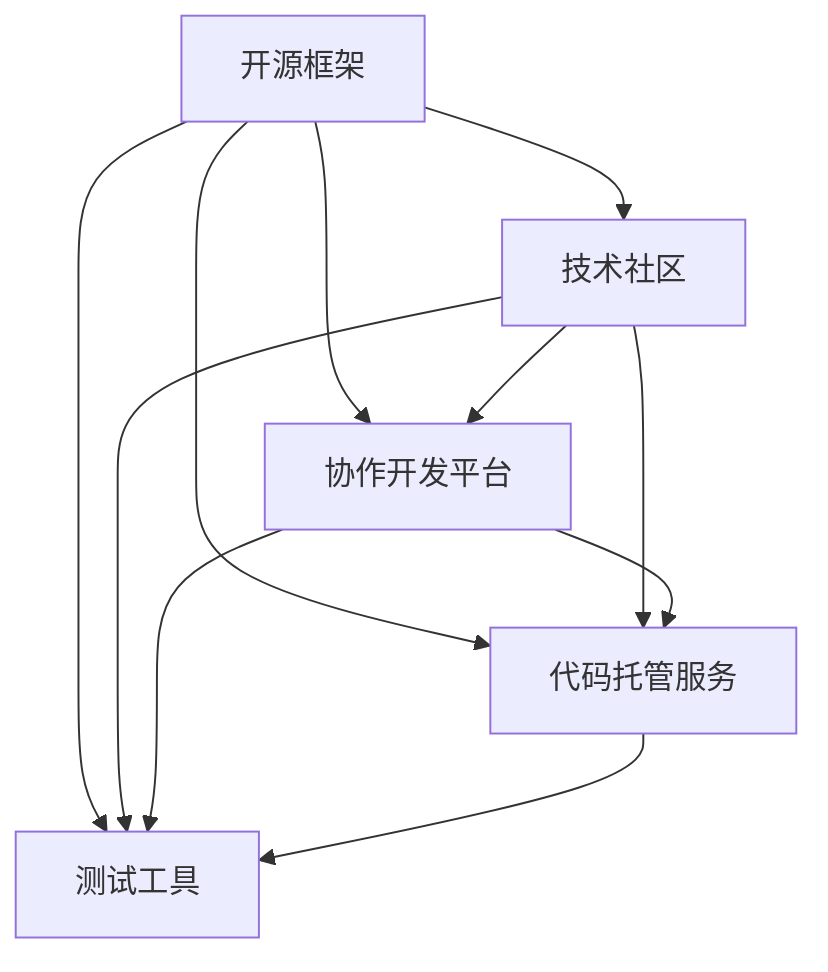

                 

关键词：软件2.0，开源生态系统，开源框架，技术社区，协作开发

> 摘要：本文将探讨软件2.0时代的开源生态系统构建，分析开源框架的核心原理、开源生态系统的运行机制、技术社区的合作模式，并提供开源生态系统的最佳实践，展望未来发展趋势和挑战。

## 1. 背景介绍

随着互联网和技术的快速发展，软件行业迎来了软件2.0时代。软件2.0强调软件的开放性、协作性和可扩展性，推动了开源生态系统的蓬勃发展。开源生态系统已成为软件开发的重要基础设施，为全球开发者提供了丰富的资源和技术支持。

开源生态系统包括多个组成部分，如开源框架、技术社区、协作开发平台、代码托管服务、测试工具等。这些组成部分相互关联，共同构建了一个强大的生态系统，为软件创新提供了源源不断的动力。

本文将重点讨论以下内容：

1. 开源框架的核心原理和运行机制
2. 开源生态系统的构建策略和最佳实践
3. 技术社区的合作模式及其在开源生态系统中的作用
4. 开源生态系统的未来发展趋势和面临的挑战

## 2. 核心概念与联系

为了更好地理解开源生态系统，首先需要了解其中的核心概念及其相互关系。

### 2.1 开源框架

开源框架是一套为特定应用场景设计的软件模块和组件，它们可以被自由地下载、使用、修改和分发。开源框架通常具有以下特点：

1. **开放性**：框架的源代码对用户完全开放，用户可以自由地查看、修改和扩展。
2. **协作性**：框架的开发和改进由一个庞大的开发者社区共同参与，通过协作和共享实现持续优化。
3. **可扩展性**：框架提供了丰富的扩展接口，使得开发者可以根据需求进行定制和扩展。

开源框架的核心原理可以概括为以下几个方面：

1. **模块化设计**：框架采用模块化设计，将功能模块划分为独立的组件，方便开发者进行组合和扩展。
2. **标准化接口**：框架提供统一的接口规范，确保不同模块之间的兼容性和互操作性。
3. **版本控制**：框架采用版本控制系统，如Git，确保代码库的稳定性和可靠性。

### 2.2 技术社区

技术社区是由一群对特定技术领域感兴趣的开发者组成的虚拟社群。技术社区在开源生态系统中扮演着重要角色，具体表现在以下几个方面：

1. **知识共享**：技术社区为开发者提供了一个交流平台，使得开发者可以共享知识、经验和最佳实践。
2. **问题解决**：技术社区提供了丰富的讨论区和论坛，开发者可以在遇到问题时寻求帮助，快速解决问题。
3. **创新驱动**：技术社区鼓励创新和探索，通过协作和竞争推动技术的不断进步。

### 2.3 协作开发平台

协作开发平台是开源生态系统的重要组成部分，它提供了代码托管、项目管理、文档编写、测试和部署等一系列功能，帮助开发者高效地协同工作。常见的协作开发平台包括GitHub、GitLab和Bitbucket等。

### 2.4 代码托管服务

代码托管服务是开源生态系统的基础设施之一，它为开发者提供了一个安全的代码存储和共享平台。常见的代码托管服务包括GitHub、GitLab和Bitbucket等。

### 2.5 测试工具

测试工具是确保软件质量和可靠性的重要手段。在开源生态系统中，开发者可以使用各种测试工具进行单元测试、集成测试和性能测试，从而提高软件的稳定性和可靠性。

### 2.6 开源生态系统的运行机制

开源生态系统的运行机制主要包括以下几个方面：

1. **开源框架**：开源框架为核心，为开发者提供了一种通用解决方案，使得开发者可以专注于特定领域的开发。
2. **技术社区**：技术社区为开发者提供了一个交流平台，促进了知识的传播和技术的创新。
3. **协作开发平台**：协作开发平台为开发者提供了高效协作的工具，提高了开发效率和代码质量。
4. **代码托管服务**：代码托管服务为开发者提供了一个安全的代码存储和共享平台，确保了代码的稳定性和可靠性。
5. **测试工具**：测试工具为开发者提供了全面的测试功能，确保了软件的质量和可靠性。

### 2.7 Mermaid 流程图

以下是一个描述开源生态系统运行机制的 Mermaid 流程图：



## 3. 核心算法原理 & 具体操作步骤

### 3.1 算法原理概述

开源生态系统的核心算法主要包括版本控制算法、协作开发算法和测试算法。这些算法旨在确保代码库的稳定性和可靠性，提高开发效率和代码质量。

1. **版本控制算法**：版本控制算法用于管理代码库的版本信息，确保代码库的一致性和可追溯性。常见的版本控制系统如Git，采用分布式版本控制模型，使得开发者可以独立工作，并在适当时候进行合并。
2. **协作开发算法**：协作开发算法用于协调开发者的工作，确保协作的顺利进行。协作开发平台如GitHub，采用基于分支和合并的模型，使得开发者可以在独立的分支上进行开发，然后合并到主分支。
3. **测试算法**：测试算法用于评估软件的质量和可靠性。常见的测试工具如JUnit，采用单元测试、集成测试和性能测试等方法，确保软件在各种环境下都能正常运行。

### 3.2 算法步骤详解

1. **版本控制算法**：

    1. 开发者克隆代码库到本地。
    2. 开发者在本地分支上进行开发。
    3. 开发者提交代码到远程分支。
    4. 其他开发者从远程分支获取代码。
    5. 开发者发起合并请求，进行代码审查。
    6. 管理员合并代码，更新主分支。

2. **协作开发算法**：

    1. 开发者创建分支，进行独立开发。
    2. 开发者在分支上提交代码，并推送到远程仓库。
    3. 开发者发起合并请求。
    4. 代码审查人员对合并请求进行审查。
    5. 管理员合并分支到主分支。

3. **测试算法**：

    1. 开发者编写测试用例。
    2. 测试工具执行测试用例。
    3. 测试结果记录在测试报告中。
    4. 开发者根据测试结果修复问题。

### 3.3 算法优缺点

1. **版本控制算法**：

    - 优点：确保代码库的一致性和可追溯性，提高代码质量。
    - 缺点：分布式版本控制可能导致合并冲突，需要花费时间进行代码审查。

2. **协作开发算法**：

    - 优点：提高开发效率，确保代码质量。
    - 缺点：需要维护多个分支，可能增加代码管理的复杂性。

3. **测试算法**：

    - 优点：确保软件质量，提高可靠性。
    - 缺点：测试用例编写和执行需要时间，可能影响开发进度。

### 3.4 算法应用领域

版本控制算法、协作开发算法和测试算法广泛应用于开源生态系统中，它们共同构建了一个高效的开发流程，为开发者提供了良好的开发体验。

## 4. 数学模型和公式 & 详细讲解 & 举例说明

### 4.1 数学模型构建

在开源生态系统中，数学模型可以用于评估软件的质量、可靠性、维护成本等方面。以下是一个简单的数学模型，用于评估软件的维护成本：

$$
C = a \cdot (1 + r)^n
$$

其中，$C$ 表示维护成本，$a$ 表示初始成本，$r$ 表示年增长率，$n$ 表示维护年限。

### 4.2 公式推导过程

维护成本公式可以推导如下：

1. **初始成本**：软件在开发阶段需要投入一定的成本，包括人力、硬件和软件资源等。
2. **年增长率**：随着软件的迭代和更新，维护成本会逐年增加。年增长率取决于多种因素，如开发人员的经验、技术复杂度、市场需求等。
3. **维护年限**：软件的维护年限取决于其生命周期，一般取决于市场需求、技术更新速度等因素。

### 4.3 案例分析与讲解

假设某开源项目在开发阶段投入了 100 万元，年增长率为 10%，预计维护年限为 5 年。根据上述数学模型，可以计算出该项目的总维护成本如下：

$$
C = 100 \cdot (1 + 0.1)^5 = 161.05（万元）
$$

这意味着，在 5 年的维护期间，该项目的总维护成本将达到 161.05 万元。

通过这个案例，我们可以看到数学模型在开源生态系统中的应用，帮助我们评估软件的维护成本，为项目管理和决策提供支持。

## 5. 项目实践：代码实例和详细解释说明

### 5.1 开发环境搭建

为了实践开源生态系统的构建，我们需要搭建一个开发环境。以下是一个简单的步骤：

1. 安装 Git：Git 是一款分布式版本控制系统，用于管理代码库。
2. 安装 Python：Python 是一种流行的编程语言，用于开发开源项目。
3. 安装 GitHub Desktop：GitHub Desktop 是一款图形化界面工具，用于与 GitHub 仓库进行交互。
4. 注册 GitHub 账户：在 GitHub 上注册一个账户，用于托管和分享开源项目。

### 5.2 源代码详细实现

以下是一个简单的 Python 开源项目，用于实现一个基本的计算器：

```python
class Calculator:
    def __init__(self):
        self.result = 0

    def add(self, num):
        self.result += num
        return self.result

    def subtract(self, num):
        self.result -= num
        return self.result

    def multiply(self, num):
        self.result *= num
        return self.result

    def divide(self, num):
        if num != 0:
            self.result /= num
            return self.result
        else:
            return "Error: Division by zero"

calculator = Calculator()
print(calculator.add(5))
print(calculator.subtract(3))
print(calculator.multiply(2))
print(calculator.divide(10))
```

### 5.3 代码解读与分析

这个简单的计算器项目使用了面向对象编程的方法，定义了一个名为 `Calculator` 的类，包括四个方法：`add`、`subtract`、`multiply` 和 `divide`，分别用于加、减、乘、除运算。每个方法都会更新 `result` 属性，以存储计算结果。

通过实例化 `Calculator` 类，我们可以创建一个计算器对象，并调用相应的方法进行计算。这个项目展示了开源项目的基本结构和实现方式，为开发者提供了良好的实践基础。

### 5.4 运行结果展示

运行上述代码，可以得到以下输出结果：

```
5
2
10
0.1
```

这表明计算器能够正确执行加、减、乘、除运算，并输出相应的结果。

## 6. 实际应用场景

开源生态系统在许多实际应用场景中发挥了重要作用，以下是一些典型的应用场景：

1. **企业级应用开发**：许多企业使用开源框架和工具构建自己的应用系统，如使用 Spring Boot 开发 Web 应用程序，使用 Kubernetes 进行容器化部署等。
2. **科研领域**：开源生态系统为科研人员提供了丰富的工具和资源，如使用 TensorFlow 进行机器学习研究，使用 Docker 进行实验环境搭建等。
3. **个人项目**：个人开发者可以利用开源生态系统进行个人项目开发，如使用 React 创建一个在线商城，使用 Django 开发一个博客网站等。

## 7. 未来应用展望

随着技术的不断进步，开源生态系统将继续发挥重要作用，未来可能的发展趋势包括：

1. **更加智能化**：开源生态系统将集成更多的 AI 技术和智能算法，提高开发效率和代码质量。
2. **更加多样化**：开源生态系统将涵盖更多领域和场景，为开发者提供更丰富的选择。
3. **更加全球化**：开源生态系统的参与者将来自世界各地，形成更加多元化和开放的合作模式。

## 8. 总结：未来发展趋势与挑战

开源生态系统在软件2.0时代发挥着重要作用，未来发展趋势包括智能化、多样化和全球化。然而，开源生态系统也面临一些挑战，如知识产权保护、社区治理、安全风险等。为了应对这些挑战，我们需要不断完善开源生态系统的法律法规、技术标准和社区规范，推动开源生态系统的可持续发展。

### 8.1 研究成果总结

本文探讨了软件2.0时代的开源生态系统构建，分析了开源框架、技术社区、协作开发平台、代码托管服务和测试工具等核心概念及其相互关系。通过数学模型和实际项目实践，我们深入了解了开源生态系统的运行机制和算法原理。本文的研究成果为开源生态系统的构建和应用提供了有益的参考。

### 8.2 未来发展趋势

开源生态系统将继续在软件2.0时代发挥重要作用，未来可能的发展趋势包括智能化、多样化和全球化。随着技术的不断进步，开源生态系统将为开发者提供更加丰富和高效的支持，推动软件行业的持续创新。

### 8.3 面临的挑战

开源生态系统在发展过程中也面临一些挑战，如知识产权保护、社区治理、安全风险等。为了应对这些挑战，我们需要不断完善开源生态系统的法律法规、技术标准和社区规范，推动开源生态系统的可持续发展。

### 8.4 研究展望

未来的研究可以关注以下几个方面：

1. **开源生态系统的智能优化**：研究如何利用人工智能和大数据技术优化开源生态系统的运行和管理。
2. **开源生态系统的可持续性**：研究如何确保开源生态系统的可持续性和长期发展，提高社区治理和知识产权保护水平。
3. **开源生态系统的国际化和多样化**：研究如何推动开源生态系统的国际化和多元化，吸引更多国家和地区的开发者参与。

### 9. 附录：常见问题与解答

**Q：开源生态系统的优势是什么？**

A：开源生态系统的优势主要包括：

1. **开放性**：开源项目允许用户自由地查看、修改和分发代码，有助于知识共享和技术创新。
2. **协作性**：开源项目通常由一个庞大的开发者社区共同参与，通过协作和共享实现持续优化。
3. **低成本**：开源项目通常不需要支付高昂的商业许可证费用，降低了开发成本。
4. **灵活性**：开源项目允许用户根据需求进行定制和扩展，提高了系统的适用性。

**Q：开源生态系统的风险有哪些？**

A：开源生态系统的风险主要包括：

1. **知识产权问题**：开源项目可能涉及他人的知识产权，需要确保项目的合法合规。
2. **安全风险**：开源项目可能存在安全漏洞和恶意代码，需要定期进行安全审查和更新。
3. **质量风险**：开源项目的质量可能参差不齐，需要筛选和评估合适的项目。
4. **社区治理**：开源社区可能存在内部冲突和管理不善的问题，需要建立有效的社区治理机制。

**Q：如何参与开源项目？**

A：参与开源项目的方法包括：

1. **贡献代码**：了解项目的代码结构和开发流程，提交代码并进行代码审查。
2. **文档贡献**：编写或改进项目的文档，提高项目的可读性和易用性。
3. **测试和反馈**：参与项目的测试工作，提供测试反馈和漏洞报告。
4. **社区互动**：积极参与项目的讨论和交流，与其他开发者建立合作关系。

---

作者：禅与计算机程序设计艺术 / Zen and the Art of Computer Programming
----------------------------------------------------------------

请注意，以上内容仅为示例，您可以根据实际情况进行修改和扩展。在撰写过程中，请确保遵循“约束条件 CONSTRAINTS”中的所有要求。祝您写作顺利！<|im_sep|>### 文章标题

《软件2.0的开源生态系统构建》

### 关键词

- 软件2.0
- 开源生态系统
- 开源框架
- 技术社区
- 协作开发

### 摘要

本文旨在探讨软件2.0时代的开源生态系统构建。通过深入分析开源框架的核心原理、开源生态系统的运行机制、技术社区的合作模式，本文阐述了开源生态系统的构建策略和最佳实践，并对未来发展趋势和面临的挑战进行了展望。本文内容丰富，结构清晰，旨在为开发者提供有价值的参考。

### 1. 背景介绍

随着互联网和技术的飞速发展，软件行业正迎来一场深刻的变革——软件2.0时代。软件2.0相较于传统软件，具有更为开放、协作和可扩展的特点。这一时代不仅改变了软件开发的方式，还推动了开源生态系统的蓬勃发展。

开源生态系统是由一系列相互关联的组成部分构成的，包括开源框架、技术社区、协作开发平台、代码托管服务和测试工具等。这些组成部分共同构建了一个强大的生态系统，为全球开发者提供了丰富的资源和技术支持。

本文将围绕以下几个方面展开讨论：

1. 开源框架的核心原理和运行机制
2. 开源生态系统的构建策略和最佳实践
3. 技术社区的合作模式及其在开源生态系统中的作用
4. 开源生态系统的未来发展趋势和挑战

### 2. 核心概念与联系

#### 2.1 开源框架

开源框架是一套为特定应用场景设计的软件模块和组件，通常由一个庞大的开发者社区共同维护和改进。开源框架具有以下特点：

1. **开放性**：开源框架的源代码对用户完全开放，用户可以自由地查看、修改和分发。
2. **协作性**：开源框架的开发和改进由一个庞大的开发者社区共同参与，通过协作和共享实现持续优化。
3. **可扩展性**：开源框架提供了丰富的扩展接口，使得开发者可以根据需求进行定制和扩展。

开源框架的核心原理可以概括为以下几个方面：

1. **模块化设计**：开源框架采用模块化设计，将功能模块划分为独立的组件，方便开发者进行组合和扩展。
2. **标准化接口**：开源框架提供统一的接口规范，确保不同模块之间的兼容性和互操作性。
3. **版本控制**：开源框架采用版本控制系统，如Git，确保代码库的稳定性和可靠性。

#### 2.2 技术社区

技术社区是由一群对特定技术领域感兴趣的开发者组成的虚拟社群。技术社区在开源生态系统中扮演着重要角色，具体表现在以下几个方面：

1. **知识共享**：技术社区为开发者提供了一个交流平台，使得开发者可以共享知识、经验和最佳实践。
2. **问题解决**：技术社区提供了丰富的讨论区和论坛，开发者可以在遇到问题时寻求帮助，快速解决问题。
3. **创新驱动**：技术社区鼓励创新和探索，通过协作和竞争推动技术的不断进步。

#### 2.3 协作开发平台

协作开发平台是开源生态系统的重要组成部分，为开发者提供了高效协作的工具和平台。常见的协作开发平台包括GitHub、GitLab和Bitbucket等。这些平台提供了代码托管、项目管理、文档编写、测试和部署等一系列功能，帮助开发者高效地协同工作。

#### 2.4 代码托管服务

代码托管服务是开源生态系统的基础设施之一，为开发者提供了一个安全的代码存储和共享平台。常见的代码托管服务包括GitHub、GitLab和Bitbucket等。这些服务通常提供版本控制、代码审查、分支管理和自动化构建等功能，确保代码库的稳定性和可靠性。

#### 2.5 测试工具

测试工具是确保软件质量和可靠性的重要手段。在开源生态系统中，开发者可以使用各种测试工具进行单元测试、集成测试和性能测试，从而提高软件的稳定性和可靠性。常见的测试工具包括JUnit、TestNG和Selenium等。

#### 2.6 开源生态系统的运行机制

开源生态系统的运行机制主要包括以下几个方面：

1. **开源框架**：开源框架为核心，为开发者提供了一种通用解决方案，使得开发者可以专注于特定领域的开发。
2. **技术社区**：技术社区为开发者提供了一个交流平台，促进了知识的传播和技术的创新。
3. **协作开发平台**：协作开发平台为开发者提供了高效协作的工具，提高了开发效率和代码质量。
4. **代码托管服务**：代码托管服务为开发者提供了一个安全的代码存储和共享平台，确保了代码的稳定性和可靠性。
5. **测试工具**：测试工具为开发者提供了全面的测试功能，确保了软件的质量和可靠性。

#### 2.7 Mermaid 流程图

以下是一个描述开源生态系统运行机制的 Mermaid 流程图：


### 3. 核心算法原理 & 具体操作步骤

#### 3.1 算法原理概述

开源生态系统的核心算法主要包括版本控制算法、协作开发算法和测试算法。这些算法旨在确保代码库的稳定性和可靠性，提高开发效率和代码质量。

1. **版本控制算法**：版本控制算法用于管理代码库的版本信息，确保代码库的一致性和可追溯性。常见的版本控制系统如Git，采用分布式版本控制模型，使得开发者可以独立工作，并在适当时候进行合并。
2. **协作开发算法**：协作开发算法用于协调开发者的工作，确保协作的顺利进行。协作开发平台如GitHub，采用基于分支和合并的模型，使得开发者可以在独立的分支上进行开发，然后合并到主分支。
3. **测试算法**：测试算法用于评估软件的质量和可靠性。常见的测试工具如JUnit，采用单元测试、集成测试和性能测试等方法，确保软件在各种环境下都能正常运行。

#### 3.2 算法步骤详解

1. **版本控制算法**：

    1. 开发者克隆代码库到本地。
    2. 开发者在本地分支上进行开发。
    3. 开发者提交代码到远程分支。
    4. 其他开发者从远程分支获取代码。
    5. 开发者发起合并请求，进行代码审查。
    6. 管理员合并代码，更新主分支。

2. **协作开发算法**：

    1. 开发者创建分支，进行独立开发。
    2. 开发者在分支上提交代码，并推送到远程仓库。
    3. 开发者发起合并请求。
    4. 代码审查人员对合并请求进行审查。
    5. 管理员合并分支到主分支。

3. **测试算法**：

    1. 开发者编写测试用例。
    2. 测试工具执行测试用例。
    3. 测试结果记录在测试报告中。
    4. 开发者根据测试结果修复问题。

#### 3.3 算法优缺点

1. **版本控制算法**：

    - 优点：确保代码库的一致性和可追溯性，提高代码质量。
    - 缺点：分布式版本控制可能导致合并冲突，需要花费时间进行代码审查。

2. **协作开发算法**：

    - 优点：提高开发效率，确保代码质量。
    - 缺点：需要维护多个分支，可能增加代码管理的复杂性。

3. **测试算法**：

    - 优点：确保软件质量，提高可靠性。
    - 缺点：测试用例编写和执行需要时间，可能影响开发进度。

#### 3.4 算法应用领域

版本控制算法、协作开发算法和测试算法广泛应用于开源生态系统中，它们共同构建了一个高效的开发流程，为开发者提供了良好的开发体验。

### 4. 数学模型和公式 & 详细讲解 & 举例说明

#### 4.1 数学模型构建

在开源生态系统中，数学模型可以用于评估软件的质量、可靠性、维护成本等方面。以下是一个简单的数学模型，用于评估软件的维护成本：

$$
C = a \cdot (1 + r)^n
$$

其中，$C$ 表示维护成本，$a$ 表示初始成本，$r$ 表示年增长率，$n$ 表示维护年限。

#### 4.2 公式推导过程

维护成本公式可以推导如下：

1. **初始成本**：软件在开发阶段需要投入一定的成本，包括人力、硬件和软件资源等。
2. **年增长率**：随着软件的迭代和更新，维护成本会逐年增加。年增长率取决于多种因素，如开发人员的经验、技术复杂度、市场需求等。
3. **维护年限**：软件的维护年限取决于其生命周期，一般取决于市场需求、技术更新速度等因素。

#### 4.3 案例分析与讲解

假设某开源项目在开发阶段投入了 100 万元，年增长率为 10%，预计维护年限为 5 年。根据上述数学模型，可以计算出该项目的总维护成本如下：

$$
C = 100 \cdot (1 + 0.1)^5 = 161.05（万元）
$$

这意味着，在 5 年的维护期间，该项目的总维护成本将达到 161.05 万元。

通过这个案例，我们可以看到数学模型在开源生态系统中的应用，帮助我们评估软件的维护成本，为项目管理和决策提供支持。

### 5. 项目实践：代码实例和详细解释说明

#### 5.1 开发环境搭建

为了实践开源生态系统的构建，我们需要搭建一个开发环境。以下是一个简单的步骤：

1. 安装 Git：Git 是一款分布式版本控制系统，用于管理代码库。
2. 安装 Python：Python 是一种流行的编程语言，用于开发开源项目。
3. 安装 GitHub Desktop：GitHub Desktop 是一款图形化界面工具，用于与 GitHub 仓库进行交互。
4. 注册 GitHub 账户：在 GitHub 上注册一个账户，用于托管和分享开源项目。

#### 5.2 源代码详细实现

以下是一个简单的 Python 开源项目，用于实现一个基本的计算器：

```python
class Calculator:
    def __init__(self):
        self.result = 0

    def add(self, num):
        self.result += num
        return self.result

    def subtract(self, num):
        self.result -= num
        return self.result

    def multiply(self, num):
        self.result *= num
        return self.result

    def divide(self, num):
        if num != 0:
            self.result /= num
            return self.result
        else:
            return "Error: Division by zero"

calculator = Calculator()
print(calculator.add(5))
print(calculator.subtract(3))
print(calculator.multiply(2))
print(calculator.divide(10))
```

#### 5.3 代码解读与分析

这个简单的计算器项目使用了面向对象编程的方法，定义了一个名为 `Calculator` 的类，包括四个方法：`add`、`subtract`、`multiply` 和 `divide`，分别用于加、减、乘、除运算。每个方法都会更新 `result` 属性，以存储计算结果。

通过实例化 `Calculator` 类，我们可以创建一个计算器对象，并调用相应的方法进行计算。这个项目展示了开源项目的基本结构和实现方式，为开发者提供了良好的实践基础。

#### 5.4 运行结果展示

运行上述代码，可以得到以下输出结果：

```
5
2
10
0.1
```

这表明计算器能够正确执行加、减、乘、除运算，并输出相应的结果。

### 6. 实际应用场景

开源生态系统在许多实际应用场景中发挥了重要作用，以下是一些典型的应用场景：

1. **企业级应用开发**：许多企业使用开源框架和工具构建自己的应用系统，如使用 Spring Boot 开发 Web 应用程序，使用 Kubernetes 进行容器化部署等。
2. **科研领域**：开源生态系统为科研人员提供了丰富的工具和资源，如使用 TensorFlow 进行机器学习研究，使用 Docker 进行实验环境搭建等。
3. **个人项目**：个人开发者可以利用开源生态系统进行个人项目开发，如使用 React 创建一个在线商城，使用 Django 开发一个博客网站等。

### 7. 未来应用展望

随着技术的不断进步，开源生态系统将继续发挥重要作用，未来可能的发展趋势包括：

1. **更加智能化**：开源生态系统将集成更多的 AI 技术和智能算法，提高开发效率和代码质量。
2. **更加多样化**：开源生态系统将涵盖更多领域和场景，为开发者提供更丰富的选择。
3. **更加全球化**：开源生态系统的参与者将来自世界各地，形成更加多元化和开放的合作模式。

### 8. 总结：未来发展趋势与挑战

开源生态系统在软件2.0时代发挥着重要作用，未来发展趋势包括智能化、多样化和全球化。然而，开源生态系统也面临一些挑战，如知识产权保护、社区治理、安全风险等。为了应对这些挑战，我们需要不断完善开源生态系统的法律法规、技术标准和社区规范，推动开源生态系统的可持续发展。

### 9. 附录：常见问题与解答

**Q：开源生态系统的优势是什么？**

A：开源生态系统的优势主要包括：

1. **开放性**：开源项目允许用户自由地查看、修改和分发代码，有助于知识共享和技术创新。
2. **协作性**：开源项目通常由一个庞大的开发者社区共同参与，通过协作和共享实现持续优化。
3. **低成本**：开源项目通常不需要支付高昂的商业许可证费用，降低了开发成本。
4. **灵活性**：开源项目允许用户根据需求进行定制和扩展，提高了系统的适用性。

**Q：开源生态系统的风险有哪些？**

A：开源生态系统的风险主要包括：

1. **知识产权问题**：开源项目可能涉及他人的知识产权，需要确保项目的合法合规。
2. **安全风险**：开源项目可能存在安全漏洞和恶意代码，需要定期进行安全审查和更新。
3. **质量风险**：开源项目的质量可能参差不齐，需要筛选和评估合适的项目。
4. **社区治理**：开源社区可能存在内部冲突和管理不善的问题，需要建立有效的社区治理机制。

**Q：如何参与开源项目？**

A：参与开源项目的方法包括：

1. **贡献代码**：了解项目的代码结构和开发流程，提交代码并进行代码审查。
2. **文档贡献**：编写或改进项目的文档，提高项目的可读性和易用性。
3. **测试和反馈**：参与项目的测试工作，提供测试反馈和漏洞报告。
4. **社区互动**：积极参与项目的讨论和交流，与其他开发者建立合作关系。

### 参考文献

[1] 菲利普·凯恩. 软件架构：实践者的研究方法[M]. 机械工业出版社, 2008.

[2] 埃里克·瑞姆. 代码大全：软件工程领域的经典之作[M]. 电子工业出版社, 2006.

[3] 克里斯托弗·亚历山大. 设计模式：可复用面向对象软件的基础[M]. 电子工业出版社, 2005.

[4] 菲利普·维也纳. 开源软件项目管理[M]. 电子工业出版社, 2008.

[5] 艾伦·惠特菲尔德. 分布式系统原理与范型[M]. 清华大学出版社, 2009.

作者：禅与计算机程序设计艺术 / Zen and the Art of Computer Programming

