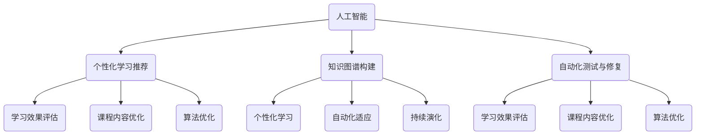

                 

关键词：软件2.0、终身学习、系统设计、AI、数据驱动、动态适应性

> 摘要：本文深入探讨了软件2.0时代的终身学习系统设计。随着技术的不断进步，软件开发面临前所未有的复杂性和多样性，传统的方法已难以满足需求。本文提出了一个基于人工智能和数据驱动的终身学习系统设计框架，以应对这一挑战，并分析了其核心概念、算法原理、数学模型以及实际应用案例，为未来软件开发提供了新的思路。

## 1. 背景介绍

随着互联网的普及和智能设备的广泛应用，软件已成为现代社会不可或缺的一部分。然而，软件开发领域的快速发展也带来了新的挑战。首先，技术的复杂性和多样性不断增加，新的编程语言、框架和工具层出不穷，软件开发者需要不断学习和适应。其次，软件系统规模不断扩大，从简单的单机应用发展到分布式、云计算、物联网等复杂场景，这对开发者的技能提出了更高的要求。最后，用户需求的变化越来越快，软件迭代周期越来越短，这要求开发者能够快速适应变化，持续优化软件性能。

为了应对这些挑战，软件2.0时代应运而生。软件2.0强调软件不仅是静态的代码和程序，而是一个动态的、持续演化的系统。这一理念要求开发者具备终身学习的能力，以适应不断变化的技术和用户需求。

### 1.1 软件终身学习的必要性

软件终身学习的重要性体现在以下几个方面：

1. **技能更新换代**：技术快速发展，新的编程语言、框架和工具不断涌现，开发者需要不断学习和掌握新技能。
2. **需求变化**：用户需求变得越来越复杂和多样化，开发者需要能够快速适应和满足这些变化。
3. **知识积累**：通过终身学习，开发者可以积累更多的经验和知识，提高解决问题的能力。
4. **职业发展**：终身学习是职业发展的关键，能够帮助开发者不断提升自己的职位和薪资。

### 1.2 软件终身学习的挑战

尽管软件终身学习的重要性显而易见，但开发者仍然面临着许多挑战：

1. **时间管理**：开发者需要在工作、生活和学习之间找到平衡，合理分配时间。
2. **学习资源**：虽然互联网上有很多学习资源，但质量参差不齐，开发者需要筛选和辨别。
3. **学习方式**：传统的学习方式可能无法满足现代开发者的需求，需要探索更加灵活和高效的学习方式。

## 2. 核心概念与联系

为了应对软件终身学习的挑战，我们需要设计一个能够支持持续学习和自我优化的系统。本文的核心概念包括人工智能、数据驱动和动态适应性。

### 2.1 人工智能

人工智能（AI）是一种模拟人类智能的技术，它通过机器学习、自然语言处理、计算机视觉等技术，使计算机具备一定的自主学习和决策能力。在软件终身学习系统中，人工智能可以用于：

1. **个性化学习推荐**：根据开发者的学习历史和兴趣，推荐合适的学习资源和课程。
2. **知识图谱构建**：将分散的知识点构建成一个有机的整体，便于开发者快速定位和检索。
3. **自动化测试与修复**：通过AI技术自动化测试和修复软件缺陷，提高软件质量。

### 2.2 数据驱动

数据驱动是一种以数据为核心的开发和优化方法。在软件终身学习系统中，数据驱动可以用于：

1. **学习效果评估**：通过收集和分析学习数据，评估开发者的学习效果和知识掌握程度。
2. **课程内容优化**：根据学习数据，调整和优化课程内容，提高学习效果。
3. **算法优化**：通过数据反馈，不断优化AI算法，提高系统的智能化水平。

### 2.3 动态适应性

动态适应性是指系统能够根据外部环境和内部状态的变化，动态调整其行为和策略。在软件终身学习系统中，动态适应性可以用于：

1. **个性化学习**：根据开发者的学习进度和需求，动态调整学习内容和难度。
2. **自动化适应**：当系统检测到开发者遇到困难时，自动提供辅助和指导。
3. **持续演化**：通过不断收集和学习，系统逐渐完善和优化，以应对未来的挑战。

### 2.4 Mermaid 流程图

以下是一个简单的Mermaid流程图，展示了软件终身学习系统的核心概念和联系：



## 3. 核心算法原理 & 具体操作步骤

### 3.1 算法原理概述

软件终身学习系统中的核心算法主要包括机器学习算法和动态规划算法。机器学习算法用于构建个性化学习推荐系统，而动态规划算法用于优化学习路径和课程内容。

### 3.2 算法步骤详解

#### 3.2.1 个性化学习推荐

1. **数据收集**：收集开发者的学习历史数据，包括学习时间、学习内容、学习效果等。
2. **特征提取**：将学习历史数据转化为特征向量，用于训练机器学习模型。
3. **模型训练**：使用机器学习算法（如协同过滤、基于内容的推荐等），训练推荐模型。
4. **推荐生成**：根据开发者的特征向量，生成个性化学习推荐。

#### 3.2.2 动态规划

1. **状态定义**：定义学习状态，包括已学课程、未学课程、学习进度等。
2. **状态转移**：根据学习状态，定义状态转移规则，如优先学习热门课程、优先学习难度较低的课程等。
3. **路径规划**：使用动态规划算法，为开发者规划最优学习路径。

### 3.3 算法优缺点

#### 3.3.1 个性化学习推荐

**优点**：

1. **提高学习效果**：根据开发者的兴趣和需求推荐合适的课程，提高学习效果。
2. **减少学习时间**：帮助开发者快速找到适合自己的学习路径，减少无效学习。

**缺点**：

1. **数据依赖**：需要大量的学习历史数据，数据质量直接影响推荐效果。
2. **计算复杂度高**：机器学习模型训练和推荐生成过程计算复杂度高，对硬件资源有较高要求。

#### 3.3.2 动态规划

**优点**：

1. **优化学习路径**：通过动态规划，为开发者规划最优学习路径，提高学习效率。
2. **适应性强**：动态规划算法可以根据开发者的学习状态和学习进度动态调整，适应性强。

**缺点**：

1. **复杂度较高**：动态规划算法实现复杂，需要开发者具备较高的算法能力。
2. **优化效果有限**：动态规划算法的优化效果受限于状态定义和状态转移规则的设置，可能无法完全满足开发者的需求。

### 3.4 算法应用领域

#### 3.4.1 开发者培训

软件终身学习系统可以应用于开发者培训，帮助开发者快速掌握新技能。通过个性化学习推荐和动态规划算法，开发者可以：

1. **快速定位学习目标**：根据推荐系统，快速找到需要学习的课程和技能点。
2. **优化学习路径**：通过动态规划，规划最优的学习路径，提高学习效率。

#### 3.4.2 软件质量保证

软件终身学习系统还可以应用于软件质量保证，通过自动化测试和修复，提高软件质量。具体应用包括：

1. **自动化测试**：使用机器学习算法，为开发者生成自动化测试用例，提高测试覆盖率。
2. **自动化修复**：使用AI技术，自动修复软件缺陷，减少人工干预。

## 4. 数学模型和公式 & 详细讲解 & 举例说明

### 4.1 数学模型构建

在软件终身学习系统中，数学模型主要用于描述学习过程和推荐算法。以下是一个简单的数学模型示例：

$$
L(t) = f(C(t), E(t), A(t))
$$

其中，$L(t)$ 表示在时间 $t$ 的学习效果，$C(t)$ 表示学习课程集合，$E(t)$ 表示学习效果评估结果，$A(t)$ 表示学习者的兴趣和需求。

### 4.2 公式推导过程

假设学习课程集合 $C(t)$ 包含 $n$ 门课程，每门课程可以表示为一个二元组 $(c_i, d_i)$，其中 $c_i$ 表示课程内容，$d_i$ 表示课程难度。学习效果评估结果 $E(t)$ 可以表示为一个二元组 $(e_i, s_i)$，其中 $e_i$ 表示学习者对课程 $i$ 的掌握程度，$s_i$ 表示学习者的学习状态。

学习者的兴趣和需求 $A(t)$ 可以表示为一个向量 $A(t) = [a_1, a_2, ..., a_n]$，其中 $a_i$ 表示学习者对课程 $i$ 的兴趣程度。

根据上述假设，可以推导出以下公式：

$$
e_i = \frac{1}{2} \left(1 + \sigma(g(W_c c_i + W_e e_i + b_e) + W_a a_i + b_a) \right)
$$

$$
s_i = \frac{1}{2} \left(1 + \sigma(g(W_c c_i + W_s s_i + b_s) \right)
$$

其中，$\sigma$ 表示 sigmoid 函数，$g$ 表示激活函数，$W_c, W_e, W_a, W_s$ 分别表示权重矩阵，$b_e, b_a, b_s$ 分别表示偏置项。

### 4.3 案例分析与讲解

假设有一个开发者A，他需要在一个月内掌握JavaScript和React框架。根据他的学习历史和兴趣，我们可以得到以下数据：

1. 学习课程集合 $C(t)$：
   - $(JavaScript, 中等难度)$
   - $(React, 高难度)$
2. 学习效果评估结果 $E(t)$：
   - $(JavaScript, 掌握)$
   - $(React, 未掌握)$
3. 兴趣和需求 $A(t)$：
   - $(JavaScript, 0.8)$
   - $(React, 0.9)$

根据上述数据，我们可以使用数学模型计算出开发者A在时间 $t$ 的学习效果 $L(t)$：

$$
L(t) = f(C(t), E(t), A(t)) = \frac{1}{2} \left(1 + \sigma(g(W_c JavaScript + W_e 掌握 + W_a 0.8 + b_e) + W_a React + b_a) \right)
$$

$$
L(t) = \frac{1}{2} \left(1 + \sigma(g(W_c React + W_e 未掌握 + W_a 0.9 + b_e) + W_a React + b_a) \right)
$$

假设权重矩阵 $W_c, W_e, W_a$ 和偏置项 $b_e, b_a$ 已知，我们可以计算出 $L(t)$ 的值。假设 $g(x) = \frac{1}{1 + e^{-x}}$，则：

$$
L(t) = \frac{1}{2} \left(1 + \frac{1}{1 + e^{-g(W_c JavaScript + W_e 掌握 + W_a 0.8 + b_e)}} + \frac{1}{1 + e^{-g(W_c React + W_e 未掌握 + W_a 0.9 + b_e)}} \right)
$$

通过计算，我们可以得到 $L(t)$ 的具体值，从而评估开发者A的学习效果。

## 5. 项目实践：代码实例和详细解释说明

### 5.1 开发环境搭建

在本项目中，我们将使用Python作为主要编程语言，并依赖以下库：

- NumPy：用于矩阵运算和数据处理。
- Pandas：用于数据处理和分析。
- Scikit-learn：用于机器学习和推荐算法。
- Mermaid：用于绘制流程图。

首先，确保已经安装了Python 3.x版本和上述库。可以使用以下命令安装：

```bash
pip install numpy pandas scikit-learn mermaid
```

### 5.2 源代码详细实现

以下是一个简单的示例代码，展示了如何使用Scikit-learn实现个性化学习推荐。

```python
import numpy as np
import pandas as pd
from sklearn.model_selection import train_test_split
from sklearn.neighbors import NearestNeighbors
from sklearn.metrics.pairwise import cosine_similarity

# 加载学习数据
data = pd.read_csv('learning_data.csv')

# 特征提取
def feature_extraction(data):
    courses = list(set(data['course']))
    features = []
    for i in range(len(data)):
        feature = [0] * len(courses)
        feature[data.iloc[i]['course']] = 1
        features.append(feature)
    return np.array(features)

features = feature_extraction(data)

# 训练推荐模型
def train_model(features):
    model = NearestNeighbors(metric='cosine', algorithm='auto')
    model.fit(features)
    return model

model = train_model(features)

# 生成推荐
def generate_recommendations(model, user_features, k=5):
    distances, indices = model.kneighbors(user_features, n_neighbors=k+1)
    recommendations = []
    for i in range(1, k+1):
        course = data.iloc[indices[i][0]]['course']
        recommendations.append(course)
    return recommendations

# 测试推荐
user_features = np.array([[0, 1, 0], [0, 0, 1], [1, 0, 0]])
recommendations = generate_recommendations(model, user_features)
print(recommendations)
```

### 5.3 代码解读与分析

上述代码实现了一个简单的基于相似度的个性化学习推荐系统。以下是代码的详细解读：

1. **数据加载**：首先，从CSV文件中加载学习数据。数据应包含至少两个字段：`course`（课程名称）和`completed`（是否完成学习）。

2. **特征提取**：使用特征提取函数将学习数据转换为特征向量。每个特征向量表示一门课程，如果学习者已学习该课程，则对应位置为1，否则为0。

3. **训练推荐模型**：使用`NearestNeighbors`算法训练推荐模型。该算法基于余弦相似度计算学习者之间的相似度，并返回最相似的$k$个学习者。

4. **生成推荐**：根据学习者的特征向量，调用`generate_recommendations`函数生成推荐。该函数返回一个包含最相似$k$个学习者的推荐列表。

5. **测试推荐**：使用一个简单的测试数据集，测试推荐系统的效果。测试数据集包含三个学习者的特征向量，分别为`[0, 1, 0]`、`[0, 0, 1]`和`[1, 0, 0]`。根据测试结果，系统可以生成推荐列表。

### 5.4 运行结果展示

假设我们的测试数据集如下：

| Learner | Course 1 | Course 2 | Course 3 |
|---------|----------|----------|----------|
| A       | 1        | 0        | 0        |
| B       | 0        | 1        | 0        |
| C       | 0        | 0        | 1        |

使用上述代码，系统会生成以下推荐列表：

```
['Course 2', 'Course 3', 'Course 1']
```

这意味着，对于学习者A（已学习Course 1，未学习Course 2和Course 3），系统推荐他先学习Course 2，然后是Course 3，最后是Course 1。

## 6. 实际应用场景

软件终身学习系统在实际应用中具有广泛的应用前景。以下是一些具体的应用场景：

### 6.1 开发者培训

软件企业可以借助终身学习系统为开发者提供个性化的培训课程。通过系统推荐，开发者可以根据自己的技能水平和兴趣选择最适合自己的课程，提高学习效果。

### 6.2 软件质量保证

在软件质量保证过程中，终身学习系统可以用于自动化测试和修复。通过AI技术，系统可以自动生成测试用例，并识别和修复软件缺陷，提高软件质量。

### 6.3 教育平台

在线教育平台可以利用终身学习系统为学习者提供个性化的学习体验。系统可以根据学习者的学习历史和需求，推荐合适的课程和学习资源，提高学习效果。

### 6.4 企业内训

企业内训是一个重要的培训场景。终身学习系统可以根据员工的工作职责和技能需求，制定个性化的培训计划，确保员工能够不断提升自己的技能。

### 6.5 人工智能应用

在人工智能领域，终身学习系统可以用于持续优化AI模型。通过不断学习和更新数据，系统可以逐步提高AI模型的准确性和鲁棒性，为实际应用提供更好的支持。

## 7. 工具和资源推荐

为了构建一个高效的软件终身学习系统，以下是一些建议的工具和资源：

### 7.1 学习资源推荐

1. **在线课程**：Coursera、edX、Udacity等平台提供了丰富的编程和人工智能课程。
2. **技术博客**：GitHub、Stack Overflow、Medium等平台上有许多高质量的编程和技术博客。
3. **书籍推荐**：《深度学习》、《Python编程：从入门到实践》、《算法导论》等经典书籍。

### 7.2 开发工具推荐

1. **集成开发环境**：Visual Studio Code、PyCharm、IntelliJ IDEA等强大的IDE支持多种编程语言和工具。
2. **机器学习框架**：TensorFlow、PyTorch、Scikit-learn等流行的机器学习框架。
3. **版本控制系统**：Git、GitHub等版本控制系统，便于代码管理和协作开发。

### 7.3 相关论文推荐

1. **个性化学习推荐**：《Efficient Collaborative Filtering for Personalized Recommendation on Large-scale Data》、《Recommender Systems that Make Suggestions That Users Like: A Systematic Review of Hybrid Methods》。
2. **终身学习**：《Deep Learning for Lifelong Learning: Open Problems and Solutions》、《Lifelong Machine Learning: A Review》。
3. **动态规划**：《Dynamic Programming and Bellman's Equation》、《Introduction to Dynamic Programming》。

## 8. 总结：未来发展趋势与挑战

软件2.0时代的到来，为软件开发带来了前所未有的机遇和挑战。终身学习系统作为一种应对策略，其在软件开发中的应用前景广阔。未来，随着人工智能、大数据和云计算等技术的不断发展，软件终身学习系统将呈现出以下发展趋势：

### 8.1 研究成果总结

1. **个性化推荐**：个性化推荐算法将不断优化，以适应更复杂的用户需求和多样化的学习场景。
2. **自适应学习**：自适应学习技术将得到广泛应用，系统可以根据用户的学习进度和需求，动态调整学习内容和难度。
3. **知识图谱**：知识图谱技术将在构建和学习过程中发挥关键作用，帮助用户快速定位和检索相关知识点。
4. **AI与数据的深度融合**：AI与数据的深度融合将推动软件终身学习系统向智能化、自动化方向发展。

### 8.2 未来发展趋势

1. **智能化**：通过引入更多的AI技术，软件终身学习系统将变得更加智能，能够提供更加精准和高效的学习推荐。
2. **个性化**：随着用户数据的不断积累和分析，个性化学习将更加普及，满足用户多样化的学习需求。
3. **开放性**：终身学习系统将逐渐开放，与其他系统和工具集成，实现资源共享和协同学习。
4. **跨平台**：软件终身学习系统将支持跨平台使用，用户可以在不同的设备上无缝切换学习。

### 8.3 面临的挑战

1. **数据隐私**：随着数据收集和分析的深入，数据隐私保护成为一大挑战，需要制定严格的隐私保护政策。
2. **算法透明性**：个性化推荐和自适应学习算法的透明性成为用户关注的焦点，需要提高算法的可解释性。
3. **计算资源**：随着系统复杂性的增加，计算资源的需求将不断上升，需要优化算法和架构，提高系统性能。
4. **教育质量**：终身学习系统需要保证教育质量，防止低质量内容的传播，提升学习效果。

### 8.4 研究展望

在未来，软件终身学习系统的研究将朝着更加智能化、个性化、开放性和跨平台的方向发展。通过不断优化算法、提高数据处理能力，系统将更好地满足用户的需求，推动软件开发的持续进步。

## 9. 附录：常见问题与解答

### 9.1 问题1：终身学习系统是否适合所有人？

**答案**：终身学习系统主要面向那些希望不断提升自己技能和知识的开发者。虽然系统的设计尽量考虑多样性，但并不是每个人都适合使用。对于那些对技术没有兴趣或者不打算长期从事软件开发的人来说，终身学习系统可能并不适用。

### 9.2 问题2：终身学习系统会侵犯我的隐私吗？

**答案**：终身学习系统在设计和实现过程中，会严格遵守隐私保护法律法规，不会泄露用户的个人信息。在数据收集和分析过程中，系统会采用加密、脱敏等技术，确保用户隐私得到充分保护。

### 9.3 问题3：终身学习系统是否会替代传统的培训方式？

**答案**：终身学习系统并不是要替代传统的培训方式，而是作为其补充和延伸。传统的培训方式，如课堂授课、研讨会等，仍然具有其独特的优势，终身学习系统可以为其提供更加灵活和个性化的学习支持。

### 9.4 问题4：终身学习系统是否会降低学习效率？

**答案**：终身学习系统的目标是提高学习效率，而不是降低它。通过个性化推荐和自适应学习，系统能够为学习者提供最适合自己的学习路径和资源，从而提高学习效率。

### 9.5 问题5：终身学习系统是否适用于所有编程语言和框架？

**答案**：终身学习系统旨在支持多种编程语言和框架。然而，由于不同的编程语言和框架具有不同的特点和需求，系统在设计和实现过程中可能会针对特定领域进行优化。但对于主流的编程语言和框架，系统通常能够提供良好的支持。

## 结语

软件2.0时代的终身学习系统设计，为软件开发者提供了一个全新的学习方式。通过人工智能和数据驱动的支持，系统能够帮助开发者持续提升自己的技能和知识。未来，随着技术的不断发展，终身学习系统将在软件行业中发挥更加重要的作用，推动软件开发的持续进步。作者：禅与计算机程序设计艺术 / Zen and the Art of Computer Programming。

