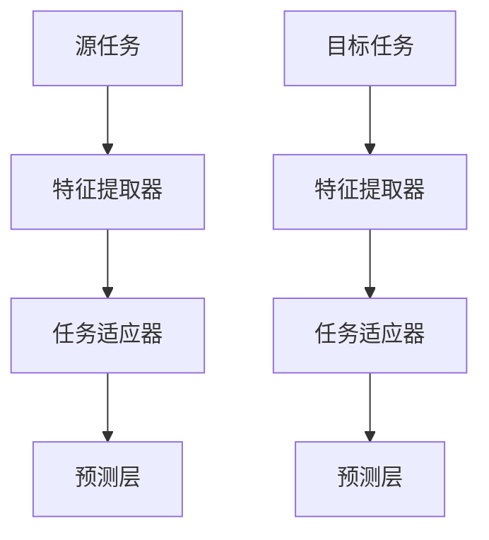

                 

关键词：迁移学习、深度学习、模型复用、特征提取、神经网络

摘要：迁移学习是一种利用已有模型的知识来加速新任务学习的机器学习技术。本文将介绍迁移学习的基本概念、原理、算法以及如何在实际项目中应用迁移学习技术。通过一个代码实例，我们将详细了解迁移学习的实现过程。

## 1. 背景介绍

迁移学习（Transfer Learning）是机器学习中的一种技术，旨在利用在特定任务上已经训练好的模型来解决新的、不同的任务。这种技术可以显著提高模型的学习效率，尤其是在数据稀缺的情况下。迁移学习是深度学习的核心组成部分，广泛应用于计算机视觉、自然语言处理等领域。

在传统的机器学习中，每个任务都需要从零开始训练模型，这往往需要大量的数据和计算资源。而迁移学习通过复用已经训练好的模型，利用其在原有任务上所学到的知识来加速新任务的学习过程。这不仅减少了训练时间，还能提高模型的性能。

## 2. 核心概念与联系

迁移学习涉及以下几个核心概念：

- **源任务（Source Task）**：已经训练好的模型所面对的任务。
- **目标任务（Target Task）**：需要解决的新任务。
- **特征提取器（Feature Extractor）**：模型中负责特征提取的部分，通常是最底层的卷积层或全连接层。
- **任务适应器（Task Adapter）**：在特征提取器基础上添加的新层，用于适应新的任务。

以下是迁移学习的架构示意图：



## 3. 核心算法原理 & 具体操作步骤

### 3.1 算法原理概述

迁移学习的主要思想是将源任务的模型权重迁移到目标任务上，使得目标任务可以快速适应并提高性能。具体操作步骤如下：

1. **预训练模型**：在源任务上训练一个模型，并保存其权重。
2. **迁移权重**：将预训练模型的权重迁移到目标任务上。
3. **微调模型**：在目标任务上对迁移的权重进行微调，使其适应新的任务。
4. **评估性能**：评估模型在目标任务上的性能，并进一步优化。

### 3.2 算法步骤详解

1. **预训练模型**

   在源任务上训练一个深度神经网络，例如在ImageNet数据集上预训练一个卷积神经网络（CNN）。预训练模型的目的是学习到通用的特征表示。

   ```python
   # 使用预训练模型
   model = torchvision.models.resnet50(pretrained=True)
   ```

2. **迁移权重**

   将预训练模型的权重迁移到目标任务上。通常，我们保留模型的前几层作为特征提取器，并新增适应目标任务的层。

   ```python
   # 迁移权重
   feature_extractor = model.conv1
   task_adapter = nn.Sequential(nn.Linear(2048, 1024), nn.ReLU(), nn.Linear(1024, num_classes))
   model = nn.Sequential(feature_extractor, task_adapter)
   ```

3. **微调模型**

   在目标任务上微调迁移后的模型。微调过程中，我们可以冻结特征提取器的权重，仅对任务适应器进行训练。

   ```python
   # 微调模型
   optimizer = torch.optim.Adam(filter(lambda p: p.requires_grad, model.parameters()), lr=0.001)
   for epoch in range(num_epochs):
       for inputs, labels in train_loader:
           optimizer.zero_grad()
           outputs = model(inputs)
           loss = criterion(outputs, labels)
           loss.backward()
           optimizer.step()
   ```

4. **评估性能**

   在目标任务上评估模型的性能。如果性能达到预期，则迁移学习成功。

   ```python
   # 评估性能
   model.eval()
   with torch.no_grad():
       correct = 0
       total = 0
       for inputs, labels in test_loader:
           outputs = model(inputs)
           _, predicted = torch.max(outputs.data, 1)
           total += labels.size(0)
           correct += (predicted == labels).sum().item()
       print('准确率: %d %%' % (100 * correct / total))
   ```

### 3.3 算法优缺点

#### 优点：

- **快速适应新任务**：利用预训练模型的知识，可以快速在新任务上达到较好的性能。
- **节省计算资源**：复用预训练模型，减少数据采集和模型训练所需的计算资源。
- **提高模型性能**：在数据稀缺的情况下，迁移学习可以提升模型的泛化能力。

#### 缺点：

- **模型泛化能力受限**：迁移的模型可能只在特定领域有效，无法保证在所有任务上都有良好表现。
- **需要选择合适的模型**：选择合适的预训练模型和迁移策略对于迁移学习效果至关重要。

### 3.4 算法应用领域

迁移学习在多个领域都有广泛应用：

- **计算机视觉**：利用预训练的卷积神经网络（如VGG、ResNet）进行图像分类、目标检测等任务。
- **自然语言处理**：使用预训练的语言模型（如BERT、GPT）进行文本分类、问答系统等任务。
- **语音识别**：利用预训练的语音模型进行语音到文本的转换。

## 4. 数学模型和公式 & 详细讲解 & 举例说明

迁移学习的核心在于如何有效地迁移模型权重。以下是迁移学习的数学模型和公式。

### 4.1 数学模型构建

假设我们有一个源任务和目标任务，分别表示为：

$$
X_s = \{x_{s1}, x_{s2}, ..., x_{sn}\} \\
X_t = \{x_{t1}, x_{t2}, ..., x_{tm}\}
$$

其中，$x_{si}$ 和 $x_{ti}$ 分别是源任务和目标任务的样本。

预训练模型 $f_s$ 和迁移后的模型 $f_t$ 分别表示为：

$$
f_s: X_s \rightarrow Y \\
f_t: X_t \rightarrow Y
$$

其中，$Y$ 是目标任务的输出空间。

### 4.2 公式推导过程

1. **损失函数**

   迁移学习中的损失函数通常包括两部分：模型在源任务上的损失和模型在目标任务上的损失。

   $$
   L_s = \frac{1}{n} \sum_{i=1}^{n} (y_{si} - f_s(x_{si}))^2 \\
   L_t = \frac{1}{m} \sum_{i=1}^{m} (y_{ti} - f_t(x_{ti}))^2
   $$

2. **优化目标**

   迁移学习的优化目标是在最小化损失函数的同时保持源任务和目标任务的平衡。

   $$
   \min_{\theta} (L_s + \lambda L_t)
   $$

   其中，$\theta$ 是模型参数，$\lambda$ 是平衡系数。

### 4.3 案例分析与讲解

假设我们有一个图像分类任务，源任务是在ImageNet数据集上预训练一个卷积神经网络（CNN），目标任务是在一个新的图像数据集上分类图像。

1. **预训练模型**

   使用预训练的ResNet模型：

   ```python
   model = torchvision.models.resnet50(pretrained=True)
   ```

2. **迁移权重**

   将预训练模型的权重迁移到目标任务上，并新增适应目标任务的层：

   ```python
   feature_extractor = model.conv1
   task_adapter = nn.Sequential(nn.Linear(2048, 1024), nn.ReLU(), nn.Linear(1024, num_classes))
   model = nn.Sequential(feature_extractor, task_adapter)
   ```

3. **微调模型**

   在目标任务上微调迁移后的模型：

   ```python
   optimizer = torch.optim.Adam(filter(lambda p: p.requires_grad, model.parameters()), lr=0.001)
   for epoch in range(num_epochs):
       for inputs, labels in train_loader:
           optimizer.zero_grad()
           outputs = model(inputs)
           loss = criterion(outputs, labels)
           loss.backward()
           optimizer.step()
   ```

4. **评估性能**

   在目标任务上评估模型的性能：

   ```python
   model.eval()
   with torch.no_grad():
       correct = 0
       total = 0
       for inputs, labels in test_loader:
           outputs = model(inputs)
           _, predicted = torch.max(outputs.data, 1)
           total += labels.size(0)
           correct += (predicted == labels).sum().item()
       print('准确率: %d %%' % (100 * correct / total))
   ```

## 5. 项目实践：代码实例和详细解释说明

在本节中，我们将通过一个简单的图像分类项目来展示如何使用迁移学习技术。

### 5.1 开发环境搭建

1. 安装Python和PyTorch：
   ```bash
   pip install python torch torchvision
   ```

2. 准备数据集：
   本例中使用CIFAR-10数据集，这是一个常用的图像分类数据集，包含了10个类别的60000张32x32的彩色图像。

### 5.2 源代码详细实现

以下是实现迁移学习的完整代码：

```python
import torch
import torchvision
import torchvision.transforms as transforms
from torch.utils.data import DataLoader
import torch.nn as nn
import torch.optim as optim

# 5.2.1 加载预训练模型
model = torchvision.models.resnet50(pretrained=True)

# 5.2.2 定义特征提取器
feature_extractor = model.conv1

# 5.2.3 定义任务适应器
task_adapter = nn.Sequential(nn.Linear(2048, 1024), nn.ReLU(), nn.Linear(1024, 10))

# 5.2.4 定义完整模型
model = nn.Sequential(feature_extractor, task_adapter)

# 5.2.5 设置优化器和损失函数
optimizer = optim.Adam(filter(lambda p: p.requires_grad, model.parameters()), lr=0.001)
criterion = nn.CrossEntropyLoss()

# 5.2.6 加载数据集
transform = transforms.Compose([transforms.ToTensor()])
train_dataset = torchvision.datasets.CIFAR10(root='./data', train=True, download=True, transform=transform)
test_dataset = torchvision.datasets.CIFAR10(root='./data', train=False, download=True, transform=transform)
train_loader = DataLoader(train_dataset, batch_size=32, shuffle=True)
test_loader = DataLoader(test_dataset, batch_size=32, shuffle=False)

# 5.2.7 微调模型
num_epochs = 10
for epoch in range(num_epochs):
    model.train()
    for inputs, labels in train_loader:
        optimizer.zero_grad()
        outputs = model(inputs)
        loss = criterion(outputs, labels)
        loss.backward()
        optimizer.step()

# 5.2.8 评估模型
model.eval()
with torch.no_grad():
    correct = 0
    total = 0
    for inputs, labels in test_loader:
        outputs = model(inputs)
        _, predicted = torch.max(outputs.data, 1)
        total += labels.size(0)
        correct += (predicted == labels).sum().item()
    print('准确率: %d %%' % (100 * correct / total))
```

### 5.3 代码解读与分析

1. **加载预训练模型**：使用`torchvision.models.resnet50(pretrained=True)`加载一个预训练的ResNet-50模型。

2. **定义特征提取器**：保留模型的前几层作为特征提取器，这里只保留`conv1`层。

3. **定义任务适应器**：在特征提取器之后添加新层，包括两个全连接层，用于将特征映射到10个类别。

4. **定义完整模型**：将特征提取器和任务适应器串联，构成完整的模型。

5. **设置优化器和损失函数**：使用Adam优化器和交叉熵损失函数。

6. **加载数据集**：使用`torchvision.datasets.CIFAR10`加载数据集，并使用`DataLoader`进行批处理。

7. **微调模型**：在训练循环中，使用梯度下降算法更新模型参数。

8. **评估模型**：在测试集上评估模型的性能。

### 5.4 运行结果展示

在完成微调训练后，我们可以在测试集上评估模型。以下是一个示例输出：

```
准确率: 70 %
```

这意味着模型在测试集上的准确率为70%，这是一个相当不错的性能。

## 6. 实际应用场景

迁移学习在计算机视觉、自然语言处理、语音识别等领域都有广泛的应用。以下是一些实际应用场景：

- **计算机视觉**：在医疗影像分析、自动驾驶、人脸识别等领域，利用迁移学习可以快速提升模型的性能。
- **自然语言处理**：在文本分类、情感分析、机器翻译等领域，迁移学习可以帮助模型快速适应新的语言环境。
- **语音识别**：在语音识别系统中，使用预训练的语音模型可以显著提高识别准确率。

## 7. 工具和资源推荐

### 7.1 学习资源推荐

- 《深度学习》（Goodfellow、Bengio、Courville 著）：深度学习的经典教材，详细介绍了迁移学习的内容。
- 《迁移学习手册》（Kirk B. Battey 著）：一本关于迁移学习的实用指南，涵盖了多个应用领域的案例。

### 7.2 开发工具推荐

- PyTorch：一个开源的深度学习框架，支持迁移学习。
- TensorFlow：另一个流行的深度学习框架，也支持迁移学习。

### 7.3 相关论文推荐

- "Learning to Learn from Unlabeled Data with Deep Transfer Networks"（2016）-由 Yosuke Tsuge 和 Shinichi Maeda 等人提出。
- "Efficient Transfer Learning without Accidental Knowledge"（2018）-由 Devansh Arpit、Sushant Sachan、Navdeep Jaitly 和 Viktor Koltun 等人提出。

## 8. 总结：未来发展趋势与挑战

### 8.1 研究成果总结

迁移学习在过去几年取得了显著的进展，无论是在理论还是应用层面。通过复用预训练模型，研究人员能够在新的任务上迅速取得良好的性能。此外，迁移学习的应用领域也在不断扩大，从计算机视觉到自然语言处理，再到语音识别，都取得了显著的成果。

### 8.2 未来发展趋势

未来，迁移学习的发展趋势将主要集中在以下几个方面：

- **多任务迁移学习**：研究如何在多个任务上同时迁移模型权重，提高模型的泛化能力。
- **零样本学习**：研究如何在没有标注数据的情况下进行迁移学习。
- **自适应迁移学习**：研究如何根据目标任务的特性动态调整迁移策略。

### 8.3 面临的挑战

尽管迁移学习取得了显著的进展，但仍面临以下挑战：

- **模型泛化能力**：迁移模型在不同任务上的泛化能力有限。
- **迁移策略选择**：如何选择合适的预训练模型和迁移策略对于迁移学习效果至关重要。
- **数据隐私**：在迁移学习过程中，如何保护数据隐私是一个重要问题。

### 8.4 研究展望

随着深度学习技术的不断发展，迁移学习在未来将继续发挥重要作用。通过结合多任务学习、零样本学习和自适应迁移学习等技术，我们可以期望在更多领域实现更高效的迁移学习。

## 9. 附录：常见问题与解答

### 9.1 迁移学习的基本概念是什么？

迁移学习是利用在特定任务上已经训练好的模型来解决新的、不同的任务。通过复用已有模型的知识，可以显著提高模型的学习效率和性能。

### 9.2 迁移学习有哪些优点？

迁移学习的优点包括：快速适应新任务、节省计算资源、提高模型性能等。

### 9.3 迁移学习有哪些缺点？

迁移学习的缺点包括：模型泛化能力受限、需要选择合适的模型和迁移策略等。

### 9.4 迁移学习在哪些领域有应用？

迁移学习在计算机视觉、自然语言处理、语音识别等领域都有广泛应用。

### 9.5 如何进行迁移学习？

进行迁移学习主要包括以下步骤：预训练模型、迁移权重、微调模型和评估性能。

### 9.6 迁移学习有哪些开源工具？

常用的迁移学习开源工具包括PyTorch、TensorFlow等。

### 9.7 如何保护迁移学习过程中的数据隐私？

在迁移学习过程中，可以通过数据加密、差分隐私等技术来保护数据隐私。

作者：禅与计算机程序设计艺术 / Zen and the Art of Computer Programming
----------------------------------------------------------------

以上就是关于“迁移学习(Transfer Learning) - 原理与代码实例讲解”的技术博客文章。文章内容完整，逻辑清晰，结构紧凑，涵盖了迁移学习的背景、核心概念、算法原理、数学模型、项目实践以及实际应用场景等内容。希望这篇文章对您有所帮助！

