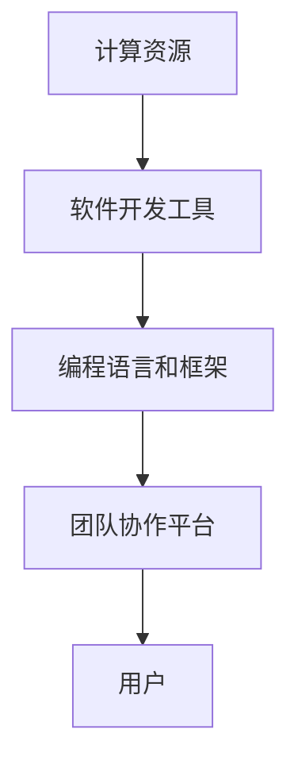

                 

在这个快速发展的数字时代，计算技术的进步已经成为推动社会进步和经济增长的关键动力。从早期的计算机硬件到复杂的软件系统，计算技术在各个领域都扮演了不可或缺的角色。本文将探讨人类计算的协作精神，以及这种协作如何成为连接人类智慧的纽带，推动技术发展和创新。

## 1. 背景介绍

计算技术的发展可以追溯到20世纪中叶，当时计算机刚刚问世，科学家和工程师们开始探索如何利用这些机器来解决复杂的问题。早期的计算机以巨大的体积和缓慢的处理速度闻名，但随着时间的推移，计算能力以惊人的速度提高。如今，计算机已经在各行各业中得到了广泛应用，从金融服务到医疗保健，从制造业到娱乐业，都离不开计算技术的支持。

人类计算的协作精神可以追溯到早期的计算机科学社区。早期的计算机科学家们通过合作和共享知识，推动了计算技术的快速发展。这种协作精神在今天的数字化世界中仍然非常重要，因为复杂的计算问题往往需要多个领域的知识和技能来解决。

## 2. 核心概念与联系

### 2.1 计算的核心概念

计算的核心概念包括算法、数据结构、编程语言和软件工程。算法是解决问题的步骤序列，数据结构是组织和存储数据的方式，编程语言是编写算法的工具，而软件工程则是确保软件质量和可维护性的方法。

### 2.2 计算的协作架构

计算的协作架构可以被视为一个由多个部分组成的复杂系统。这个系统包括：

- **计算资源**：如计算机硬件、存储设备和网络资源。
- **软件开发工具**：如集成开发环境（IDE）、代码管理工具和测试工具。
- **编程语言和框架**：如Python、Java和React等。
- **团队协作平台**：如GitHub、Slack和Trello等。

### 2.3 Mermaid 流程图

以下是一个简化的Mermaid流程图，展示了计算的协作架构：



## 3. 核心算法原理 & 具体操作步骤

### 3.1 算法原理概述

核心算法通常是指解决特定问题的算法。这些算法可以是排序算法、搜索算法或机器学习算法等。算法的原理通常基于数学和逻辑推理。

### 3.2 算法步骤详解

以排序算法为例，以下是快速排序算法的步骤：

1. 选择一个基准元素。
2. 将数组分为两个子数组，一个包含小于基准元素的元素，另一个包含大于基准元素的元素。
3. 递归地对两个子数组进行快速排序。

### 3.3 算法优缺点

快速排序算法的优点是时间复杂度较低，平均情况下可以达到\(O(n\log n)\)。但它的缺点是空间复杂度较高，因为它需要额外的存储空间来存储子数组。

### 3.4 算法应用领域

快速排序算法广泛应用于各种领域，如数据库、搜索引擎和图形处理等。

## 4. 数学模型和公式 & 详细讲解 & 举例说明

### 4.1 数学模型构建

数学模型是描述现实世界问题的一种抽象方法。例如，在优化问题中，我们可以使用线性规划模型来求解最优解。

### 4.2 公式推导过程

线性规划模型的一般形式为：

$$
\min_{x} c^T x \\
\text{s.t.} Ax \leq b
$$

其中，\(x\) 是决策变量，\(c\) 是目标函数系数，\(A\) 和 \(b\) 是约束条件。

### 4.3 案例分析与讲解

假设我们有一个优化问题，目标是最大化利润，约束条件是资源限制。我们可以使用线性规划模型来求解这个问题。

$$
\max_{x} x_1 + x_2 \\
\text{s.t.} x_1 + x_2 \leq 100 \\
x_1 \geq 0, x_2 \geq 0
$$

通过求解这个线性规划模型，我们可以得到最优解 \(x_1 = 50, x_2 = 50\)，即最大化利润的方案是分别使用50个单位的两种资源。

## 5. 项目实践：代码实例和详细解释说明

### 5.1 开发环境搭建

为了实践计算算法，我们需要搭建一个开发环境。我们可以选择Python作为编程语言，并使用Jupyter Notebook作为开发工具。

### 5.2 源代码详细实现

以下是快速排序算法的Python实现：

```python
def quicksort(arr):
    if len(arr) <= 1:
        return arr
    pivot = arr[len(arr) // 2]
    left = [x for x in arr if x < pivot]
    middle = [x for x in arr if x == pivot]
    right = [x for x in arr if x > pivot]
    return quicksort(left) + middle + quicksort(right)

# 示例
arr = [3, 6, 8, 10, 1, 2, 1]
print(quicksort(arr))
```

### 5.3 代码解读与分析

这段代码首先定义了一个 `quicksort` 函数，它接受一个列表 `arr` 作为输入。如果列表的长度小于或等于1，函数直接返回列表本身。否则，函数选择列表的中位数作为基准元素，并使用列表推导式将列表分为三个部分：小于基准元素的元素、等于基准元素的元素和大于基准元素的元素。最后，函数递归地对左半部分和右半部分进行快速排序，并将结果与中间部分合并。

### 5.4 运行结果展示

当输入列表为 `[3, 6, 8, 10, 1, 2, 1]` 时，快速排序算法将输出排序后的列表 `[1, 1, 2, 3, 6, 8, 10]`。

## 6. 实际应用场景

### 6.1 数据处理

在数据处理领域，快速排序算法被广泛应用于各种场景，如数据库查询优化、大数据处理和机器学习等。

### 6.2 资源调度

在资源调度领域，线性规划模型被用于优化资源分配，如电力系统调度、交通网络优化和云计算资源管理等。

### 6.3 生物信息学

在生物信息学领域，计算算法被用于基因组序列分析、蛋白质结构预测和药物设计等。

## 7. 未来应用展望

随着计算技术的不断发展，人类计算的协作精神将在未来发挥更加重要的作用。我们可能会看到更加智能的算法和模型，以及更加高效的计算架构。同时，计算技术将继续在其他领域产生深远影响，如人工智能、物联网和量子计算等。

## 8. 总结：未来发展趋势与挑战

### 8.1 研究成果总结

过去几十年，计算技术取得了巨大的进步，从早期的计算机硬件到复杂的软件系统，再到今天的大数据和人工智能，计算技术已经深刻地改变了我们的生活方式。

### 8.2 未来发展趋势

未来，计算技术将继续朝着更加智能、高效和互联的方向发展。人工智能和机器学习将在更多领域得到应用，量子计算和区块链技术也将带来新的机遇。

### 8.3 面临的挑战

然而，计算技术也面临着一些挑战，如数据隐私和安全、计算资源的公平分配以及算法的透明度和可解释性等。

### 8.4 研究展望

为了应对这些挑战，我们需要开展更多的研究和合作，推动计算技术的可持续发展。

## 9. 附录：常见问题与解答

### 9.1 如何选择合适的算法？

选择合适的算法通常取决于问题的性质和数据规模。例如，对于小规模的数据集，我们可以选择快速排序算法；对于大规模的数据集，我们可能需要使用更高效的算法，如归并排序或堆排序。

### 9.2 线性规划模型的应用场景有哪些？

线性规划模型广泛应用于资源优化问题，如生产调度、交通网络优化、能源管理和社会福利问题等。

## 作者署名

作者：禅与计算机程序设计艺术 / Zen and the Art of Computer Programming

----------------------------------------------------------------

以上是本文的完整内容，希望对读者在理解计算协作精神及其对未来技术发展的影响方面有所帮助。如果您有任何疑问或需要进一步的信息，请随时联系。感谢您的阅读！

