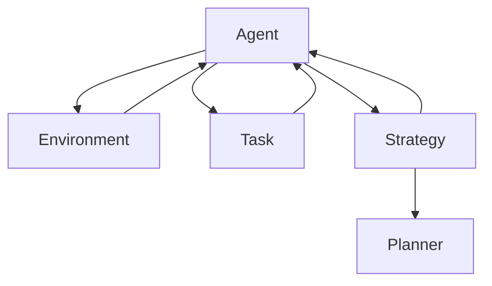

                 

在当今快速发展的智能时代，自动化和智能代理（Agent）技术已经成为众多领域的核心竞争力。无论是商业应用、智能家居、无人驾驶汽车，还是更为复杂的工业自动化，代理都在扮演着至关重要的角色。然而，随着任务复杂度和执行环境的多样性的增加，如何有效提高代理的任务执行效率成为了一个亟待解决的问题。本文将围绕“通过规划提高 Agent 任务执行效率”这一主题，深入探讨相关核心概念、算法原理、数学模型、实际应用以及未来展望。

## 关键词

- **代理（Agent）**
- **任务规划**
- **执行效率**
- **算法优化**
- **数学模型**
- **应用实践**
- **未来展望**

## 摘要

本文旨在探讨如何通过有效的任务规划来提升代理在执行任务时的效率。我们将从背景介绍出发，详细阐述核心概念与架构，深入分析算法原理与操作步骤，构建并推导相关的数学模型，提供实际代码实现与解读，并最终讨论代理技术在实际应用中的表现及其未来发展方向。通过本文的阅读，读者将能够全面理解任务规划在提升代理执行效率中的关键作用，并掌握一系列实用的技术与方法。

### 1. 背景介绍

在自动化和智能代理技术迅速发展的背景下，代理（Agent）成为实现智能化自动化系统的核心组成部分。代理是一种具有自主性、社会性、反应性和预动性的软件实体，它能够通过感知环境、制定计划并执行行动，以实现特定的目标。代理技术已经广泛应用于多个领域，如工业自动化、金融服务、医疗健康、智能交通等。

任务规划是代理实现高效执行的重要手段之一。任务规划是指在给定环境和目标的情况下，为代理制定一个最优的行动方案。一个有效的任务规划系统能够在复杂多变的环境中，为代理提供最优的决策路径，从而显著提升其执行效率。

执行效率是衡量代理性能的关键指标。高效的代理不仅能够完成更多的任务，还能在有限的时间内完成这些任务，从而降低成本、提高生产效率。执行效率的提高，往往需要从算法、架构、资源管理等多个方面进行综合优化。

本文的目标是通过探讨任务规划在提升代理执行效率中的作用，提供一系列实用的技术与方法，帮助读者更好地理解和应用代理技术，实现高效的任务执行。

### 2. 核心概念与联系

在深入探讨如何通过任务规划提高代理执行效率之前，我们需要明确一些核心概念和它们之间的关系。这些概念包括：代理、环境、任务、策略、规划器等。

#### 2.1 代理

代理（Agent）是具有自主性和社会性的软件实体，能够在环境中感知信息、制定决策并执行行动，以实现特定的目标。代理可以是机器人、软件程序、甚至是人类社会中的个体。在智能系统中，代理通常需要具备以下特征：

- **自主性**：代理能够独立地执行任务，而不需要外部干预。
- **社会性**：代理能够与其他代理或环境中的实体进行交互。
- **反应性**：代理能够根据环境变化实时调整其行为。
- **预动性**：代理能够预见环境的变化，并提前制定应对策略。

#### 2.2 环境

环境是代理执行任务的空间和背景。环境可以是一个物理空间，如机器人操作的工作台，也可以是一个虚拟空间，如游戏世界。环境通常包含以下要素：

- **状态**：描述环境当前的状态，如机器人的位置、速度、工作台的物料状况等。
- **资源**：环境中的可用资源，如机器人的工具、电池电量等。
- **障碍**：可能阻碍代理执行任务的障碍物或限制条件。

#### 2.3 任务

任务是代理需要完成的特定目标。任务可以是一个简单的目标，如移动到指定位置，也可以是一个复杂的任务序列，如完成一个生产线的组装任务。任务通常包含以下要素：

- **目标**：任务的最终目标，如到达某个位置。
- **条件**：任务需要满足的条件，如任务完成的时间限制。
- **约束**：任务执行过程中需要遵守的限制条件，如机器人操作的速度限制。

#### 2.4 策略

策略是代理为实现任务目标所采取的行动方案。策略通常是根据环境和任务的特点制定的，它决定了代理如何感知环境、如何选择行动并如何适应环境变化。策略的制定通常依赖于代理的智能水平和任务规划算法。

#### 2.5 规划器

规划器是代理系统中的核心组件，负责根据环境和任务的特点，为代理制定最优的行动方案。规划器通常包含以下功能：

- **任务分解**：将复杂的任务分解为一系列简单的子任务。
- **路径规划**：为代理选择最优的移动路径。
- **资源分配**：为代理分配所需的资源，如机器人工具、电池等。
- **风险评估**：评估任务执行过程中可能面临的风险，并制定相应的应对策略。

#### 2.6 Mermaid 流程图

为了更直观地展示代理、环境、任务、策略和规划器之间的关系，我们可以使用 Mermaid 流程图来表示。以下是一个简化的 Mermaid 流程图，用于描述这些核心概念之间的联系：



在上面的流程图中，代理（Agent）作为系统的核心，与环境和任务进行交互，并依据策略（Strategy）和规划器（Planner）的指导执行任务。环境（Environment）提供了代理执行任务所需的资源和约束，任务（Task）定义了代理需要达到的目标，策略（Strategy）则决定了代理如何实现这些目标，而规划器（Planner）则负责为代理制定最优的行动方案。

通过上述核心概念与联系的分析，我们可以更好地理解代理系统的工作原理和任务规划的重要性。在接下来的章节中，我们将深入探讨任务规划算法的原理和具体实现，进一步揭示如何通过有效的任务规划来提升代理的执行效率。

### 3. 核心算法原理 & 具体操作步骤

在探讨如何通过任务规划提高代理执行效率的过程中，核心算法的原理和具体操作步骤显得尤为重要。以下将详细介绍任务规划算法的基本原理、详细步骤以及其优缺点，并探讨其在不同应用领域的应用。

#### 3.1 算法原理概述

任务规划算法的核心目标是在给定的环境和任务条件下，为代理生成一个最优的行动方案。这一方案需要考虑环境的状态、任务的约束和资源的限制，以确保代理能够在有限的时间和资源内高效完成任务。常见的任务规划算法包括：

1. **基于状态空间搜索的规划算法**：这类算法通过在状态空间中搜索所有可能的行动路径，找到最优的路径。典型的算法有 A*算法、最佳优先搜索等。
2. **基于采样的规划算法**：这类算法通过随机采样和模拟，评估不同行动方案的效果，从而选择最优的方案。典型的算法有随机采样规划、蒙特卡洛树搜索等。
3. **基于学习的规划算法**：这类算法通过机器学习技术，从历史数据中学习最优的行动策略。典型的算法有深度强化学习、进化算法等。

这些算法各有优缺点，适用于不同的应用场景。例如，基于状态空间搜索的算法在搜索空间较小、任务结构明确的情况下表现良好；而基于采样的算法在处理大规模搜索空间和高维度问题时具有优势；基于学习的算法则通过经验积累实现高效的任务规划，但需要大量的训练数据。

#### 3.2 算法步骤详解

以下是一个基于状态空间搜索的规划算法——A*算法的步骤详解：

1. **初始化**：创建一个开放列表（Open List）和一个关闭列表（Closed List）。开放列表用于存储待处理的节点，关闭列表用于存储已经处理的节点。初始时，开放列表只包含根节点，关闭列表为空。

2. **评估函数**：定义评估函数 \( f(n) = g(n) + h(n) \)，其中 \( g(n) \) 是从初始节点到当前节点的实际代价，\( h(n) \) 是从当前节点到目标节点的估计代价。

3. **搜索过程**：每次从开放列表中选择一个 \( f(n) \) 最小的节点 \( n \) 作为当前节点，并将其移动到关闭列表。然后，生成当前节点的所有子节点，并更新它们的 \( f(n) \) 值。如果某个子节点已经在关闭列表中，则不需要重复处理。

4. **终止条件**：当开放列表为空时，说明没有找到到达目标节点的路径，算法终止。否则，继续步骤 3。

5. **路径重建**：从目标节点开始，沿着父节点回溯到初始节点，得到一条从初始节点到目标节点的最优路径。

#### 3.3 算法优缺点

A*算法具有以下优缺点：

**优点**：
- 能够找到从初始节点到目标节点的最优路径。
- 对环境变化的适应性较好，能够动态调整路径。

**缺点**：
- 当搜索空间较大时，搜索过程可能非常耗时。
- 需要预先定义评估函数，且评估函数的选择对算法的性能有较大影响。

#### 3.4 算法应用领域

任务规划算法在多个领域有广泛的应用：

1. **机器人导航**：在自主机器人中，任务规划算法用于路径规划，帮助机器人避开障碍物，到达目标位置。
2. **无人机配送**：无人机配送系统中，任务规划算法用于优化配送路径，提高配送效率。
3. **智能交通**：在智能交通系统中，任务规划算法用于交通流量管理，优化交通信号控制策略，缓解交通拥堵。
4. **供应链管理**：在供应链管理中，任务规划算法用于优化物流路径，降低运输成本。

通过上述对任务规划算法原理和步骤的详细解析，我们可以更好地理解如何通过有效的任务规划来提升代理的执行效率。在接下来的章节中，我们将进一步探讨数学模型和公式的构建与推导，以实现更加精确和高效的任务规划。

### 3.4 算法应用领域

任务规划算法在多个领域有着广泛的应用，其灵活性和高效性使得代理系统能够在各种复杂环境中实现最优的任务执行。以下是任务规划算法在几个典型领域的应用：

#### 3.4.1 机器人导航

在机器人导航领域，任务规划算法用于生成机器人在未知或动态环境中的最优路径。典型的应用包括自主驾驶汽车、工业机器人、家庭服务机器人等。这些机器人需要能够在复杂的环境中自主感知、规划路径并执行任务。任务规划算法如 A*算法和 RRT（快速随机树）算法在机器人路径规划中有着广泛的应用。

- **自主驾驶汽车**：自动驾驶汽车需要处理复杂的交通状况，包括其他车辆、行人、道路标志等。通过任务规划算法，车辆可以实时调整路径，避开障碍物并遵守交通规则。
- **工业机器人**：在制造业中，工业机器人需要进行精确的路径规划，以完成装配、焊接、搬运等任务。任务规划算法可以确保机器人高效地完成这些任务，同时减少碰撞和错误操作的风险。

#### 3.4.2 无人机配送

无人机配送是近年来快速发展的一项技术，任务规划算法在其中起到了关键作用。无人机配送需要解决路径规划、避障、能源管理等复杂问题。

- **物流配送**：无人机可以用于快递、包裹配送等，通过任务规划算法，无人机可以在复杂的城市环境中规划最优路径，实现快速、安全的配送。
- **农业监测**：无人机可以在农田上方进行监控和喷洒农药，任务规划算法可以帮助无人机覆盖整个农田，确保农药均匀分布，提高农业效率。

#### 3.4.3 智能交通

智能交通系统通过任务规划算法优化交通流量，提高道路利用率和交通效率。这些系统通常包含交通信号控制、车辆路径规划、停车场管理等模块。

- **交通信号控制**：智能交通信号控制系统可以根据实时交通流量数据，通过任务规划算法动态调整信号灯时长，优化交通流动。
- **车辆路径规划**：驾驶员导航系统中，任务规划算法用于生成从起点到终点的最优路径，避开拥堵和事故区域。
- **停车场管理**：在停车场中，任务规划算法可以优化停车位分配和车辆出入路线，提高停车场的利用率和用户体验。

#### 3.4.4 供应链管理

在供应链管理中，任务规划算法用于优化物流和库存管理，降低成本、提高效率。

- **运输调度**：通过任务规划算法，物流公司可以优化运输路线和货物装载方案，减少运输时间和成本。
- **库存管理**：供应链中的库存管理需要实时调整库存水平，任务规划算法可以帮助企业预测需求，优化库存策略，减少库存积压和缺货风险。

通过上述应用实例，我们可以看到任务规划算法在各个领域的广泛应用及其重要性。随着技术的不断进步，任务规划算法将在更多的领域中发挥关键作用，推动智能化和自动化的发展。

### 4. 数学模型和公式 & 详细讲解 & 举例说明

在任务规划中，数学模型和公式是构建有效规划算法的基础。它们用于描述任务环境、任务目标以及规划过程，帮助代理系统在复杂多变的环境中做出最优决策。以下我们将详细讲解数学模型的构建、公式的推导过程，并通过具体案例进行说明。

#### 4.1 数学模型构建

一个通用的任务规划数学模型通常包括以下几个组成部分：

1. **状态空间**：状态空间描述了代理执行任务时可能遇到的所有状态。每个状态可以用一个向量表示，包括代理的位置、任务进度、资源状况等。

2. **动作空间**：动作空间定义了代理可以采取的所有合法动作。每个动作也用向量表示，描述代理在特定状态下可以执行的行动，如移动、执行任务等。

3. **成本函数**：成本函数用于评估从当前状态转移到下一个状态所需付出的代价，包括时间、能量消耗、资源消耗等。

4. **约束条件**：约束条件描述了代理在执行任务时必须遵守的限制条件，如速度限制、资源限制等。

5. **目标函数**：目标函数用于定义代理执行任务的目标，通常是一个需要最小化或最大化的函数，如总路径长度、总时间等。

基于上述组件，我们可以构建一个通用的任务规划数学模型：

\[ \text{Model} = \{S, A, C(S, A), R, G(S)\} \]

其中，\( S \) 表示状态空间，\( A \) 表示动作空间，\( C(S, A) \) 表示成本函数，\( R \) 表示约束条件，\( G(S) \) 表示目标函数。

#### 4.2 公式推导过程

在一个简单的路径规划问题中，我们可以通过以下公式推导来描述代理的最优路径。

**目标函数**：最小化总路径长度

\[ \min \sum_{i=1}^{n} d(s_i, s_{i+1}) \]

其中，\( d(s_i, s_{i+1}) \) 表示从状态 \( s_i \) 到状态 \( s_{i+1} \) 的距离。

**成本函数**：路径长度

\[ C(S, A) = \sum_{i=1}^{n} d(s_i, s_{i+1}) \]

**约束条件**：速度限制、资源限制等

\[ v_i \leq v_{max} \]

\[ r_i \geq r_{min} \]

**最优路径**：使用 A*算法来寻找最优路径

\[ \text{Path} = \text{A*}(S, G, C) \]

A*算法的伪代码如下：

```
OpenList := { (s0, f(s0))}
ClosedList := {}

while OpenList is not empty do
    (s, f(s)) := Pop the node with the lowest f(s) value from OpenList
    if s = goal then
        return reconstruct_path(s)
    end if
    
    ClosedList := ClosedList ∪ {s}
    
    for each action a in A(s) do
        if a is not valid then
            continue
        end if
        
        s' := result of action a
        f(s') := f(s) + d(s, s')
        
        if (s', f(s')) in OpenList then
            continue
        end if
        
        if (s', f(s')) in ClosedList then
            remove (s', f(s')) from ClosedList
        end if
        
        OpenList := OpenList ∪ { (s', f(s')) }
    end for
end while

return failure
```

#### 4.3 案例分析与讲解

以下通过一个简单的例子来说明如何使用数学模型和公式来规划任务。

**案例**：一个自主机器人需要在给定的工作区域内从起点移动到终点，路径上存在障碍物。

**目标**：找到从起点到终点的最短路径。

**状态空间**：

\[ S = \{ (x, y) \} \]

**动作空间**：

\[ A = \{ (x', y') \} \]

其中，\( (x, y) \) 表示机器人的当前位置，\( (x', y') \) 表示机器人可以执行的动作（如向上、向下、向左、向右移动一个单位距离）。

**成本函数**：

\[ C(S, A) = \begin{cases}
1, & \text{if } (x', y') \text{ is not an obstacle} \\
\infty, & \text{if } (x', y') \text{ is an obstacle}
\end{cases} \]

**约束条件**：

\[ v_{max} = 1 \text{ unit per step} \]

**目标函数**：

\[ \min \sum_{i=1}^{n} d(s_i, s_{i+1}) \]

使用 A*算法求解：

1. 初始化 OpenList 和 ClosedList。
2. 选择 \( (x, y) \) 作为当前节点，计算 f(s) = 0。
3. 计算所有合法动作的 f 值，更新 OpenList。
4. 移除当前节点并加入 ClosedList。
5. 重复步骤 3 和 4，直到找到终点或 OpenList 为空。

**结果**：通过上述步骤，可以得到从起点到终点的最优路径。

通过上述案例，我们可以看到如何构建数学模型和公式来指导代理进行任务规划。数学模型和公式为任务规划提供了理论基础和计算框架，使得代理能够有效地在复杂环境中执行任务。

### 5. 项目实践：代码实例和详细解释说明

为了更好地理解任务规划算法的应用，我们将通过一个实际项目来展示如何实现一个简单的路径规划系统。该项目将使用 Python 编程语言，结合 A*算法来实现一个二维网格上的路径规划。以下是该项目的主要步骤和代码解释。

#### 5.1 开发环境搭建

在开始编写代码之前，需要搭建一个合适的开发环境。以下是推荐的开发环境：

- **操作系统**：Windows、macOS 或 Linux
- **编程语言**：Python 3.x
- **依赖库**：Python 的标准库（无需额外安装），Pillow 库（用于图形展示）

安装依赖库（Pillow）：

```shell
pip install Pillow
```

#### 5.2 源代码详细实现

以下是一个简单的路径规划系统源代码，包括环境设置、算法实现和结果展示。

```python
import sys
import heapq
from PIL import Image, ImageDraw

# 状态类
class Node:
    def __init__(self, parent=None, position=None):
        self.parent = parent
        self.position = position
        self.g = 0
        self.h = 0
        self.f = 0

    def __eq__(self, other):
        return self.position == other.position

    def __lt__(self, other):
        return self.f < other.f

# A*算法
def astar(maze, start, end):
    # 初始化开放列表和关闭列表
    open_list = []
    closed_list = set()

    # 创建开始节点和结束节点
    start_node = Node(None, start)
    end_node = Node(None, end)

    # 将开始节点加入开放列表
    heapq.heappush(open_list, start_node)

    # 当开放列表不为空时循环
    while len(open_list) > 0:
        # 获取当前节点
        current_node = heapq.heappop(open_list)
        closed_list.add(current_node)

        # 如果当前节点是结束节点，则完成路径规划
        if current_node == end_node:
            path = []
            current = current_node
            while current is not None:
                path.append(current.position)
                current = current.parent
            return path[::-1]  # 返回路径

        # 生成当前节点的邻居节点
        neighbors = generate_neighbors(maze, current_node.position)

        for neighbor in neighbors:
            # 如果邻居节点在关闭列表中，则跳过
            if neighbor in closed_list:
                continue

            # 计算邻居节点的 g、h 和 f 值
            neighbor.g = current_node.g + 1
            neighbor.h = heuristic(neighbor.position, end_node.position)
            neighbor.f = neighbor.g + neighbor.h

            # 如果邻居节点已经在开放列表中，且新的 f 值更大，则跳过
            if any(neighbor == n for n in open_list):
                continue

            # 将邻居节点加入开放列表
            heapq.heappush(open_list, neighbor)

    return None  # 无法找到路径

# 计算启发式值（曼哈顿距离）
def heuristic(position, end_position):
    return abs(position[0] - end_position[0]) + abs(position[1] - end_position[1])

# 生成邻居节点
def generate_neighbors(maze, position):
    directions = [(0, -1), (0, 1), (-1, 0), (1, 0)]
    neighbors = []
    for direction in directions:
        new_position = (position[0] + direction[0], position[1] + direction[1])
        if is_valid_move(maze, new_position):
            neighbors.append(Node(position, new_position))
    return neighbors

# 检查移动是否有效
def is_valid_move(maze, position):
    x, y = position
    return 0 <= x < len(maze) and 0 <= y < len(maze[0]) and maze[x][y] != 1

# 展示路径
def show_path(maze, path):
    img = Image.new('RGB', (len(maze[0]) * 10, len(maze) * 10), (255, 255, 255))
    draw = ImageDraw.Draw(img)
    for x, y in path:
        draw.rectangle([y * 10, x * 10, y * 10 + 10, x * 10 + 10], fill=(0, 0, 255))
    img.show()

# 主函数
def main():
    # 定义一个简单的迷宫
    maze = [
        [0, 0, 0, 0, 1, 0, 0],
        [0, 1, 1, 1, 1, 1, 0],
        [0, 1, 0, 0, 0, 0, 0],
        [0, 1, 1, 1, 1, 1, 0],
        [0, 0, 0, 0, 1, 0, 0],
        [0, 1, 1, 0, 1, 1, 0],
        [0, 0, 0, 0, 0, 0, 0]
    ]

    start = (0, 0)
    end = (6, 6)

    path = astar(maze, start, end)
    if path:
        show_path(maze, path)
    else:
        print("无法找到路径")

if __name__ == "__main__":
    main()
```

#### 5.3 代码解读与分析

1. **状态类（Node）**：Node 类用于表示网格中的每个节点，包括父节点、当前位置、g 值（从起点到当前节点的代价）、h 值（从当前节点到终点的估计代价）和 f 值（g 值和 h 值之和）。

2. **A*算法**：astar 函数是 A*算法的实现，它通过维护一个开放列表（使用堆实现）和一个关闭列表来搜索最优路径。算法的主要步骤包括初始化列表、搜索节点、生成邻居节点、更新 f 值和选择下一个节点。

3. **启发式函数（heuristic）**：heuristic 函数计算两个位置之间的启发式距离，这里使用曼哈顿距离作为启发式函数。

4. **生成邻居节点（generate_neighbors）**：generate_neighbors 函数生成当前节点的所有合法邻居节点。

5. **检查移动是否有效（is_valid_move）**：is_valid_move 函数检查给定的移动是否在迷宫的有效区域内，且不会进入障碍物。

6. **展示路径（show_path）**：show_path 函数使用 Pillow 库创建一个图像，并在其中绘制出最优路径。

7. **主函数（main）**：main 函数定义了一个简单的迷宫、起点和终点，并调用 A*算法寻找路径，并通过 show_path 函数展示结果。

#### 5.4 运行结果展示

运行上述代码后，我们将看到一个图形界面，展示出从起点到终点的最优路径。路径上的每个节点用蓝色矩形表示，路径上的线段用蓝色填充。如果无法找到路径，则输出提示信息。

通过上述项目实践，我们可以看到如何将任务规划算法应用于实际的路径规划问题中，实现从理论到实践的转化。这一过程不仅加深了对算法原理的理解，也提升了编程能力。

### 6. 实际应用场景

任务规划在众多实际应用场景中展现出其独特的价值。以下将详细讨论任务规划在几个主要领域的实际应用，并分析其带来的效率和效果提升。

#### 6.1 无人机配送

无人机配送是任务规划的一个重要应用领域。在物流和快递行业中，无人机能够快速、高效地完成货物配送，减少人力成本和时间消耗。通过任务规划，无人机可以根据实时交通状况、天气条件、地形环境等参数，规划出最优的飞行路径。以下是任务规划在无人机配送中的几个实际应用案例：

- **快递配送**：无人机可以用于城市中心的快递配送，实现快速投递，提高用户满意度。通过任务规划，无人机可以在避免交通拥堵和城市建筑物的同时，选择最短的路径到达目的地。
- **医疗物资运输**：在紧急医疗情况下，无人机可以快速将医疗物资从医院运送到偏远地区，缩短救治时间。任务规划确保了无人机能够避开地形障碍和交通限制，确保物资及时送达。
- **农业监控**：无人机在农业监控中用于监控作物生长情况，规划农药喷洒路径。通过任务规划，无人机可以高效覆盖农田，减少农药使用量，提高农业生产的可持续性。

#### 6.2 智能家居

智能家居系统通过任务规划实现家电设备的自动化控制和场景化操作，提升用户生活便利性和舒适度。以下是任务规划在智能家居中的实际应用案例：

- **自动化家居控制**：任务规划可以自动安排智能家居设备的运行时间，如空调、灯光、窗帘等，根据用户的生活习惯和实时环境数据，实现自动开关和控制，节省能源。
- **智能安防监控**：智能家居系统中的摄像头和报警设备可以通过任务规划，自动调整监控范围和灵敏度，提高安全性。例如，当检测到异常行为时，系统自动调整摄像头视角，并触发报警。
- **环境调控**：智能家居系统可以通过任务规划，实时监控室内环境参数（如温度、湿度、空气质量等），并自动调节空调、空气净化器等设备，创造一个舒适的生活环境。

#### 6.3 自主驾驶汽车

自主驾驶汽车是任务规划技术的另一大应用领域。在自动驾驶系统中，任务规划负责车辆在复杂交通环境中的路径规划和行为决策。以下是任务规划在自主驾驶汽车中的实际应用案例：

- **道路导航**：自主驾驶汽车通过任务规划，实时计算和调整行车路线，避开交通拥堵和障碍物，确保安全到达目的地。
- **车辆协作**：在多个自动驾驶汽车协同工作的情况下，任务规划可以协调车辆的行驶路径和速度，实现高效的交通流，减少交通事故风险。
- **动态避障**：在紧急情况下，任务规划系统可以快速评估环境状况，为车辆制定最优的避障路径，确保乘客的安全。

#### 6.4 工业自动化

工业自动化中的任务规划广泛应用于生产线的自动化控制和机器人调度。以下是任务规划在工业自动化中的实际应用案例：

- **生产流程优化**：通过任务规划，可以优化生产线的运行流程，减少生产周期和资源浪费，提高生产效率。例如，机器人可以根据生产任务优先级和设备状态，智能调度生产任务。
- **仓库管理**：在仓库管理中，任务规划可以优化库存摆放和物品拣选路径，提高仓库的空间利用率和拣选效率。例如，拣货机器人可以根据任务规划和库存分布，智能选择拣选路径。
- **设备维护**：任务规划系统可以优化设备维护计划，确保设备在最佳状态下运行。例如，通过任务规划，机器人可以自动检查和维修生产线上的设备，减少设备停机时间。

通过上述实际应用案例，我们可以看到任务规划在不同领域中的广泛应用及其带来的效率和效果提升。任务规划技术的不断发展和优化，将进一步推动自动化和智能化的进步，为社会带来更多便利和效益。

### 6.4 未来应用展望

随着人工智能和自动化技术的飞速发展，任务规划在未来的应用前景将更加广阔。以下是任务规划在几个新兴领域中的未来展望。

#### 6.4.1 基于区块链的智能合约

区块链技术的兴起为任务规划开辟了新的应用场景。智能合约是区块链上的自动化执行合约，它可以根据预设条件自动执行任务。任务规划可以与智能合约相结合，实现更加灵活和高效的自动化流程。例如，在供应链管理中，任务规划可以根据区块链上的实时数据，自动调整物流路径、库存管理和供应链节点，提高整个供应链的运作效率。

#### 6.4.2 虚拟现实和增强现实

虚拟现实（VR）和增强现实（AR）技术的快速发展，为任务规划带来了新的机遇。在 VR 和 AR 环境中，任务规划可以用于优化用户交互、场景导航和任务执行。例如，在 VR 教育场景中，任务规划可以为学习者提供个性化的学习路径，指导其完成学习任务。在 AR 智能家居场景中，任务规划可以优化家庭设备的自动控制和场景切换，提高用户的居住体验。

#### 6.4.3 智能医疗

智能医疗是任务规划的重要应用领域。通过任务规划，医疗设备可以实现自动化操作，提高诊断和治疗效率。例如，在手术机器人中，任务规划可以实时调整手术路径，确保手术的精准和高效。在医疗数据分析中，任务规划可以优化数据处理和分析流程，提高诊断准确性和效率。此外，智能医院管理系统可以通过任务规划，实现资源的优化配置，提高医疗服务水平。

#### 6.4.4 能源管理

能源管理是任务规划在可持续发展中的重要应用。通过任务规划，智能电网可以实现能源的优化分配和调度，提高能源利用效率。例如，在分布式能源系统中，任务规划可以根据实时能源需求和供应情况，自动调整能源生产和消费，实现能源的供需平衡。在智能建筑中，任务规划可以优化能源设备的运行，降低能耗，提高能源利用率。

#### 6.4.5 无人集群系统

无人集群系统是未来任务规划的重要研究方向。在无人集群系统中，多个无人机器人和自主代理需要协同工作，完成复杂的任务。任务规划可以用于优化集群的协同策略和任务分配，提高系统的效率和鲁棒性。例如，在无人运输车队中，任务规划可以优化车队行驶路径和任务分配，提高运输效率；在灾难救援中，任务规划可以优化救援资源的分配和调度，提高救援效率。

通过上述展望，我们可以看到任务规划在未来各个领域的广泛应用前景。随着技术的不断进步，任务规划将在更多的领域发挥重要作用，推动智能化和自动化的发展，为社会带来更多的便利和效益。

### 7. 工具和资源推荐

为了更好地学习和应用任务规划技术，以下推荐一些相关的学习资源、开发工具和参考论文，帮助读者深入理解和掌握这一领域。

#### 7.1 学习资源推荐

1. **在线课程**：
   - Coursera 的《人工智能导论》
   - edX 的《智能代理与多智能体系统》
   - Udacity 的《无人驾驶汽车工程师》

2. **教科书**：
   - 《智能代理与多智能体系统》（Intelligent Agents and Multi-Agent Systems）——by J. Ferber and J. Taub
   - 《人工智能：一种现代方法》（Artificial Intelligence: A Modern Approach）——by Stuart J. Russell and Peter Norvig

3. **在线讲座和研讨会**：
   - YouTube 上的各种 AI 和机器人相关的讲座和研讨会
   - ArXiv.org 上的最新研究论文和研讨会记录

4. **开源项目**：
   - GitHub 上有关智能代理和任务规划的开源代码库，如 ROS（Robot Operating System）

#### 7.2 开发工具推荐

1. **编程语言**：
   - Python：广泛应用于 AI 和机器人领域的编程语言，具有丰富的库和框架
   - C++：适用于高性能和复杂算法的开发，尤其是在嵌入式系统和机器人控制领域

2. **库和框架**：
   - ROS（Robot Operating System）：用于机器人开发和任务规划的强大框架
   - PyTorch 和 TensorFlow：用于深度学习和智能代理开发的深度学习框架
   - OpenCV：用于计算机视觉和图像处理的库

3. **开发环境**：
   - Jupyter Notebook：用于交互式编程和数据可视化
   - PyCharm 或 Visual Studio Code：适用于 Python 和 C++开发的集成开发环境（IDE）

#### 7.3 相关论文推荐

1. **经典论文**：
   - "A Mathematical Theory of Communication" —— Claude Shannon（信息论的基础）
   - "The Logic of Decision" —— John von Neumann（博弈论和决策过程）
   - "The Representation and Movement of Robots" —— John McCarthy（早期机器人学研究）

2. **近年研究**：
   - "Deep Learning for Real-Time Agents in Complex Environments" —— OpenAI（深度学习在智能代理中的应用）
   - "Distributed Multi-Agent Reinforcement Learning in Continuous Environments" —— DeepMind（分布式智能体强化学习）
   - "Simulation, Planning, and Execution of Service Robots in Human-Centric Environments" —— IEEE Robotics and Automation Magazine（服务机器人任务规划）

通过这些推荐的学习资源、开发工具和论文，读者可以系统地学习任务规划的理论和实践，提升在智能代理和任务规划领域的技能。

### 8. 总结：未来发展趋势与挑战

随着人工智能和自动化技术的不断进步，任务规划在未来将迎来更多的发展机遇和挑战。以下是未来任务规划领域的发展趋势、面临的挑战以及研究展望。

#### 8.1 研究成果总结

近年来，任务规划领域取得了显著的研究成果。主要进展包括：

1. **算法优化**：各种新型算法如深度强化学习、生成对抗网络（GAN）等在任务规划中的应用，显著提升了代理的执行效率和决策能力。
2. **多智能体系统**：在多智能体任务规划中，通过分布式计算和协同优化，实现了更高效的任务分配和资源管理。
3. **不确定性处理**：在动态和不确定的环境中，任务规划算法通过自适应和鲁棒性设计，提高了代理的适应能力和决策质量。
4. **混合智能系统**：结合人类专家和自动化系统的协同规划，实现了更加智能和高效的任务执行。

#### 8.2 未来发展趋势

未来，任务规划领域将呈现以下发展趋势：

1. **智能化与自主化**：随着人工智能技术的发展，任务规划系统将更加智能化和自主化，能够在更复杂和动态的环境中自主决策和执行任务。
2. **多模态融合**：结合多种传感器数据（如视觉、听觉、触觉等），实现更全面的环境感知和任务规划。
3. **跨领域应用**：任务规划技术将在更多领域（如医疗、能源、交通等）得到应用，推动智能化和自动化的发展。
4. **开放性和标准化**：随着技术的普及，任务规划系统的开放性和标准化将得到提高，促进跨平台和跨系统的集成与协作。

#### 8.3 面临的挑战

尽管任务规划领域取得了显著进展，但仍面临一些挑战：

1. **计算资源限制**：在实时性和高效性之间需要权衡，如何优化算法以降低计算资源消耗是一个重要挑战。
2. **数据隐私和安全性**：在多智能体系统中，数据隐私和安全性问题日益凸显，如何保护数据安全、防止恶意攻击是一个关键挑战。
3. **不确定性处理**：在动态和不确定的环境中，如何提高算法的鲁棒性和适应性，应对环境变化和不确定性，是一个重要难题。
4. **跨领域融合**：在多个领域的融合应用中，如何设计通用且高效的任务规划算法，以适应不同领域的特点和需求，是一个挑战。

#### 8.4 研究展望

未来，任务规划领域的研究将朝着以下方向展开：

1. **自适应与进化算法**：开发更先进的自适应和进化算法，提高代理在动态和不确定环境中的适应能力和鲁棒性。
2. **多智能体协同优化**：研究分布式计算和协同优化技术，实现更高效的多智能体系统任务规划。
3. **跨学科融合**：结合计算机科学、人工智能、控制理论、认知科学等多个领域的知识，设计通用且高效的任务规划框架。
4. **理论与实践相结合**：通过大量实验和实际应用，验证任务规划算法的可行性和有效性，推动理论研究的实际应用。

总之，任务规划领域在未来的发展中具有广阔的前景，但也面临诸多挑战。通过不断的研究和创新，我们可以期待任务规划技术将更加智能化和高效化，为自动化和智能化的发展做出更大贡献。

### 9. 附录：常见问题与解答

以下是一些关于任务规划常见的疑问及其解答。

#### 9.1 什么是任务规划？

任务规划是指为智能代理或机器人制定一个最优的行动方案，以便在给定环境和目标条件下高效完成任务。

#### 9.2 任务规划算法有哪些类型？

常见的任务规划算法包括基于状态空间搜索的算法（如A*算法）、基于采样的算法（如随机采样规划）、以及基于学习的算法（如深度强化学习）。

#### 9.3 A*算法是如何工作的？

A*算法通过评估函数 \( f(n) = g(n) + h(n) \) 在状态空间中搜索最优路径。其中，\( g(n) \) 是从初始节点到当前节点的实际代价，\( h(n) \) 是从当前节点到目标节点的估计代价。

#### 9.4 任务规划在哪些领域有应用？

任务规划在机器人导航、无人机配送、智能交通、智能家居、工业自动化等多个领域有广泛应用。

#### 9.5 如何提高任务规划的效率？

可以通过优化算法、减少搜索空间、结合机器学习等技术来提高任务规划的效率。

#### 9.6 任务规划和路径规划有什么区别？

任务规划是指为代理制定一个全局的行动方案，而路径规划是任务规划的一个子集，主要关注从起点到终点的最优路径。

通过上述常见问题与解答，希望能够帮助读者更好地理解任务规划的概念和应用。如果还有其他疑问，欢迎进一步探讨。

