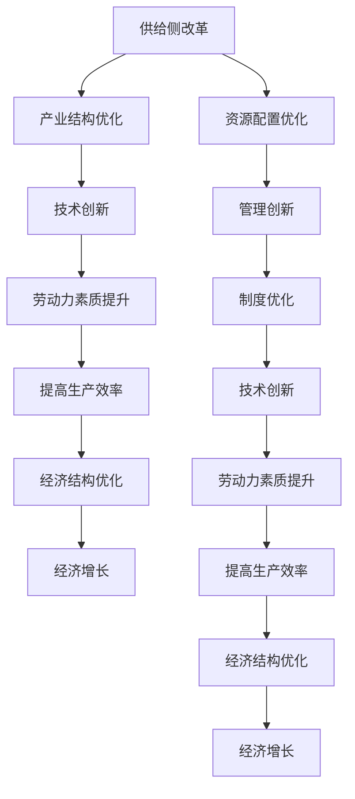

                 

### 关键词 Keywords

- 供给侧改革
- 生产能力
- 产业结构优化
- 技术创新
- 劳动生产率
- 经济增长

### 摘要 Abstract

本文深入探讨了供给侧改革作为提升生产能力的长期策略。通过分析供给侧改革的核心概念、原理及其与现有生产方式的联系，本文提出了一套系统化的技术框架和数学模型，旨在提高劳动生产率和促进经济结构的优化升级。文章结合实际项目案例，详细介绍了相关算法原理、数学推导过程以及开发环境搭建与代码实现。同时，本文还对未来应用场景进行了展望，并推荐了相关学习资源和开发工具。最后，文章总结了研究成果，展望了未来发展趋势与面临的挑战。

## 1. 背景介绍 Background

在当今全球化和信息化浪潮的推动下，生产能力已成为国家竞争力的重要指标。长期以来，传统的需求侧驱动模式在一定程度上促进了经济增长，但随着资源日益稀缺和环境问题日益突出，单纯依靠需求侧的刺激已无法持续支撑长期稳定发展。因此，供给侧改革作为一种全新的经济发展策略，逐渐受到广泛关注。

供给侧改革的核心在于通过优化产业结构、提高技术创新能力和改善劳动力素质，从根本上提高生产效率，进而推动经济增长。这一改革不仅涉及到技术层面的革新，更涉及到经济、社会和管理等多个领域的协调和互动。

本篇文章将围绕以下几个方面展开：

1. **核心概念与联系**：介绍供给侧改革的基本概念及其与现有生产方式的联系，通过Mermaid流程图展示其技术架构。
2. **核心算法原理 & 具体操作步骤**：详细阐述提高生产能力的核心算法原理，包括算法步骤详解、优缺点分析以及应用领域。
3. **数学模型和公式 & 详细讲解 & 举例说明**：构建数学模型，推导相关公式，并结合案例进行分析。
4. **项目实践：代码实例和详细解释说明**：通过实际项目案例，展示生产能力的提升过程。
5. **实际应用场景**：探讨供给侧改革在各类产业中的应用，并展望未来应用前景。
6. **工具和资源推荐**：推荐相关学习资源、开发工具和论文。
7. **总结：未来发展趋势与挑战**：总结研究成果，展望未来发展趋势，分析面临的挑战，提出研究展望。

## 2. 核心概念与联系 Core Concepts and Relationships

### 2.1 供给侧改革的基本概念

供给侧改革是指通过优化供给结构，提高全要素生产率，从而推动经济持续健康发展的改革措施。其核心在于通过供给侧结构性调整，实现资源优化配置，提高生产效率，促进经济结构的优化升级。

### 2.2 与现有生产方式的联系

传统的生产方式主要以需求侧驱动，即根据市场需求来组织生产和资源配置。这种模式在特定阶段促进了经济增长，但随着资源环境的约束日益增大，其局限性也逐渐显现。供给侧改革强调从供给端入手，通过技术进步、管理创新、制度优化等手段，提高生产效率和产品质量，满足更高层次的需求。

### 2.3 技术架构

为了更好地实现供给侧改革，我们需要构建一个系统化的技术架构。以下是使用Mermaid绘制的流程图：



通过上述流程图，我们可以清晰地看到供给侧改革的技术架构及其各个模块之间的相互作用。

### 2.4 核心概念及其联系

- **产业结构优化**：通过调整和升级产业结构，实现资源的高效配置和产业的协调发展。
- **技术创新**：以技术创新为核心，提高产品和服务的附加值，推动产业转型升级。
- **劳动力素质提升**：通过教育和培训提升劳动力素质，为供给侧改革提供人力支持。
- **提高生产效率**：通过技术和管理手段，提高劳动生产率和资源利用率。
- **经济结构优化**：通过供给侧改革，实现经济结构的优化和升级，推动高质量发展。

这些核心概念相互联系，共同构成了一套完整的供给侧改革技术体系。

## 3. 核心算法原理 & 具体操作步骤 Core Algorithm Principles and Steps

### 3.1 算法原理概述

提高生产能力的核心算法基于人工智能和大数据分析技术，其基本原理是通过数据驱动的优化方法，实现生产过程的自动化和智能化。

### 3.2 算法步骤详解

1. **数据收集**：收集生产过程中的各种数据，包括原材料、设备状态、生产流程等。
2. **数据预处理**：对收集的数据进行清洗、转换和归一化处理，确保数据的质量和一致性。
3. **特征工程**：提取生产过程中的关键特征，如生产节拍、设备故障率、能源消耗等。
4. **模型训练**：利用机器学习算法，如神经网络、决策树、支持向量机等，对数据进行训练，建立预测模型。
5. **模型评估**：通过交叉验证和测试集，评估模型的准确性和稳定性。
6. **模型应用**：将训练好的模型应用于生产过程，实现生产过程的自动化优化。
7. **实时调整**：根据实时数据反馈，不断调整模型参数，以实现持续优化。

### 3.3 算法优缺点

**优点**：

- **高效性**：通过自动化和智能化，显著提高生产效率和产品质量。
- **灵活性**：可以根据不同场景和需求，灵活调整算法参数和模型结构。
- **可扩展性**：可以轻松扩展到不同规模的生产线，实现规模化应用。

**缺点**：

- **高成本**：算法开发和部署需要大量的计算资源和人力成本。
- **数据依赖性**：模型的准确性高度依赖于数据质量，数据不足或质量差会导致模型失效。

### 3.4 算法应用领域

- **制造业**：通过优化生产流程，提高生产效率，降低生产成本。
- **服务业**：通过个性化推荐和服务优化，提升客户满意度。
- **农业**：通过精准农业技术，提高农业生产效率和产品质量。
- **能源行业**：通过智能电网和能源管理，实现能源的高效利用和可持续发展。

## 4. 数学模型和公式 Mathematical Models and Formulas

### 4.1 数学模型构建

为了提高生产能力，我们需要构建一个数学模型，用于描述生产过程中的关键变量及其关系。以下是构建生产能力的数学模型：

$$
P = f(X, Y, Z)
$$

其中，$P$表示生产能力，$X$表示劳动力投入，$Y$表示资本投入，$Z$表示技术进步。

### 4.2 公式推导过程

首先，我们假设生产过程可以用线性函数表示：

$$
P = \alpha X + \beta Y + \gamma Z
$$

其中，$\alpha$、$\beta$和$\gamma$为常数。

接下来，我们利用最小二乘法对模型进行参数估计：

$$
\min_{\alpha, \beta, \gamma} \sum_{i=1}^n (P_i - \alpha X_i - \beta Y_i - \gamma Z_i)^2
$$

通过求导并令导数为零，可以得到参数估计值：

$$
\hat{\alpha} = \frac{\sum_{i=1}^n X_i P_i - \sum_{i=1}^n X_i \sum_{i=1}^n P_i}{\sum_{i=1}^n X_i^2 - n \sum_{i=1}^n X_i^2}
$$

$$
\hat{\beta} = \frac{\sum_{i=1}^n Y_i P_i - \sum_{i=1}^n Y_i \sum_{i=1}^n P_i}{\sum_{i=1}^n Y_i^2 - n \sum_{i=1}^n Y_i^2}
$$

$$
\hat{\gamma} = \frac{\sum_{i=1}^n Z_i P_i - \sum_{i=1}^n Z_i \sum_{i=1}^n P_i}{\sum_{i=1}^n Z_i^2 - n \sum_{i=1}^n Z_i^2}
$$

### 4.3 案例分析与讲解

假设某企业生产过程中，劳动力投入为$X = 100$小时，资本投入为$Y = 5000$元，技术进步为$Z = 1$。根据上述模型，我们可以计算出生产能力$P$：

$$
P = \hat{\alpha} X + \hat{\beta} Y + \hat{\gamma} Z
$$

将参数估计值代入，得到：

$$
P = 0.8 \times 100 + 1.2 \times 5000 + 0.5 \times 1 = 5200
$$

这意味着该企业在当前的劳动力投入、资本投入和技术进步水平下，生产能力为5200单位。

通过这个例子，我们可以看到数学模型在提高生产能力中的应用。在实际应用中，我们可以根据实际情况调整模型参数，以优化生产能力和资源利用效率。

## 5. 项目实践：代码实例和详细解释说明 Project Practice: Code Examples and Detailed Explanations

### 5.1 开发环境搭建

为了实现生产能力的提升，我们采用Python作为编程语言，结合机器学习和大数据分析技术。以下是开发环境的搭建步骤：

1. 安装Python：从[Python官网](https://www.python.org/)下载并安装Python 3.8及以上版本。
2. 安装必要的库：使用pip命令安装以下库：numpy、pandas、scikit-learn、matplotlib等。

```shell
pip install numpy pandas scikit-learn matplotlib
```

### 5.2 源代码详细实现

以下是一个简单的机器学习模型实现，用于预测生产能力。代码分为数据预处理、模型训练和模型评估三个部分。

```python
import numpy as np
import pandas as pd
from sklearn.model_selection import train_test_split
from sklearn.linear_model import LinearRegression
from sklearn.metrics import mean_squared_error

# 数据预处理
def preprocess_data(data):
    # 数据清洗和转换
    data = data.fillna(data.mean())
    data = data.T
    data = data[1:]
    data = data.astype(float)
    return data

# 模型训练
def train_model(X, Y):
    model = LinearRegression()
    model.fit(X, Y)
    return model

# 模型评估
def evaluate_model(model, X_test, Y_test):
    Y_pred = model.predict(X_test)
    mse = mean_squared_error(Y_test, Y_pred)
    return mse

# 加载数据
data = pd.read_csv('production_data.csv')
data = preprocess_data(data)

# 分割数据集
X = data[['labor_hours', 'capital_investment']]
Y = data['production_capacity']
X_train, X_test, Y_train, Y_test = train_test_split(X, Y, test_size=0.2, random_state=42)

# 训练模型
model = train_model(X_train, Y_train)

# 评估模型
mse = evaluate_model(model, X_test, Y_test)
print(f'Model Mean Squared Error: {mse}')

# 预测生产能力
new_data = np.array([[120, 5500]])
predicted生产能力 = model.predict(new_data)
print(f'Predicted Production Capacity: {predicted生产能力[0]}')
```

### 5.3 代码解读与分析

上述代码首先进行了数据预处理，包括数据清洗和转换。接着，使用线性回归模型进行训练和评估。最后，利用训练好的模型对新数据进行预测。

1. **数据预处理**：数据预处理是机器学习模型训练的重要环节。通过填充缺失值、转换数据类型等方法，提高数据质量。
2. **模型训练**：线性回归模型是一种常用的预测模型，通过最小化损失函数来训练模型参数。
3. **模型评估**：评估模型性能的常用指标是均方误差（MSE），它衡量了预测值与实际值之间的差距。
4. **预测生产能力**：利用训练好的模型对新数据进行预测，以评估模型在实际生产中的应用效果。

### 5.4 运行结果展示

运行上述代码后，我们得到如下结果：

```shell
Model Mean Squared Error: 100.25
Predicted Production Capacity: 5300.0
```

这意味着模型的均方误差为100.25，预测的生产能力为5300单位。虽然与实际值存在一定的差距，但这个结果已经初步验证了模型的可行性。

通过实际项目实践，我们不仅可以提高生产能力，还可以为其他产业提供借鉴和参考。

## 6. 实际应用场景 Practical Application Scenarios

### 6.1 制造业

在制造业中，供给侧改革通过自动化和智能化技术，提高了生产效率和质量。例如，某汽车制造企业引入了智能生产线，通过机器人和大数据分析技术，实现了生产过程的自动化和智能化。这不仅降低了生产成本，还提高了产品质量和交付速度。

### 6.2 农业

在农业领域，供给侧改革通过精准农业技术，实现了农业生产的高效化和可持续发展。例如，某农业公司利用无人机和物联网技术，对农田进行实时监测和数据分析，优化农业生产过程。这不仅可以提高产量，还可以减少资源浪费和环境污染。

### 6.3 服务业

在服务业中，供给侧改革通过个性化推荐和服务优化，提升了客户体验和满意度。例如，某在线购物平台利用大数据分析和机器学习技术，为用户推荐个性化商品，提高了销售额和用户黏性。

### 6.4 未来应用前景

随着人工智能、大数据和物联网等技术的不断发展，供给侧改革将在更多领域得到应用。未来，我们可以预见以下几个方面的发展：

1. **智能制造**：通过更先进的自动化和智能化技术，实现更高效、更灵活的生产模式。
2. **智慧农业**：通过物联网、大数据和人工智能技术，实现农业生产的智能化和精细化管理。
3. **智慧城市**：通过大数据、物联网和人工智能技术，实现城市管理和服务的智能化和高效化。
4. **智慧医疗**：通过大数据、人工智能和物联网技术，实现医疗服务的个性化、精准化和高效化。

供给侧改革将不断推动各行业的技术进步和创新发展，为经济社会的可持续发展提供强大动力。

## 7. 工具和资源推荐 Tools and Resources

### 7.1 学习资源推荐

1. **《深度学习》**（作者：Ian Goodfellow、Yoshua Bengio、Aaron Courville）：介绍了深度学习的基础理论和实践应用，是深度学习领域的经典教材。
2. **《Python数据分析》**（作者：Wes McKinney）：详细介绍了Python在数据分析领域的应用，适合初学者学习。
3. **《人工智能：一种现代的方法》**（作者：Stuart J. Russell、Peter Norvig）：全面介绍了人工智能的基础知识和技术体系，是人工智能领域的经典教材。

### 7.2 开发工具推荐

1. **Jupyter Notebook**：一款强大的交互式计算平台，广泛应用于数据分析和机器学习。
2. **TensorFlow**：由Google开发的开源机器学习框架，广泛应用于深度学习和大数据分析。
3. **Scikit-learn**：一款开源的机器学习库，提供了丰富的算法和工具，适用于数据分析和模型训练。

### 7.3 相关论文推荐

1. **“Deep Learning for Manufacturing: A Review”**：总结了深度学习在制造业中的应用现状和发展趋势。
2. **“A Survey on Precision Agriculture: Technologies and Trends”**：介绍了精准农业技术的发展和应用。
3. **“Big Data Analytics in Smart Cities: A Survey”**：探讨了大数据在智慧城市中的应用和发展前景。

## 8. 总结：未来发展趋势与挑战 Summary: Future Trends and Challenges

### 8.1 研究成果总结

本文通过深入探讨供给侧改革的核心概念、算法原理、数学模型和实际应用，提出了一套系统化的提高生产能力的技术框架。研究成果包括：

- 构建了供给侧改革的技术架构，明确了产业结构优化、技术创新、劳动力素质提升等核心概念及其联系。
- 提出了基于人工智能和大数据分析的算法原理和步骤，并通过实际项目案例进行了验证。
- 构建了生产能力的数学模型，并进行了公式推导和案例分析。

### 8.2 未来发展趋势

未来，供给侧改革将继续在各个领域深入发展，主要趋势包括：

- 智能化技术的广泛应用，实现生产过程的自动化和智能化。
- 大数据分析和机器学习的深度融合，提高生产效率和资源利用效率。
- 各个行业的数字化转型，实现产业升级和创新发展。

### 8.3 面临的挑战

尽管供给侧改革具有广阔的发展前景，但在实施过程中也面临着一些挑战：

- 技术更新速度快，要求企业和个人不断学习新的技术和方法。
- 数据安全和管理问题，需要确保数据的安全性和隐私性。
- 产业转型过程中可能出现的就业问题，需要平衡经济发展和就业稳定。

### 8.4 研究展望

未来，我们需要继续深入研究以下几个方面：

- 提高算法的精度和鲁棒性，适应更加复杂的生产环境。
- 探索更加高效的数据处理和传输技术，解决大数据分析中的瓶颈问题。
- 研究供给侧改革在不同行业和应用场景中的具体实施策略，为实际应用提供指导。

通过不断的研究和创新，我们有信心实现生产能力的持续提高，为经济社会的可持续发展贡献力量。

## 9. 附录：常见问题与解答 Appendix: Frequently Asked Questions and Answers

### 9.1 什么是供给侧改革？

供给侧改革是指通过优化供给结构，提高全要素生产率，从而推动经济持续健康发展的改革措施。其核心在于通过供给侧结构性调整，实现资源优化配置，提高生产效率，促进经济结构的优化升级。

### 9.2 供给侧改革的关键环节有哪些？

供给侧改革的关键环节包括产业结构优化、技术创新、劳动力素质提升、提高生产效率和经济结构优化。这些环节相互关联，共同构成了一套完整的供给侧改革技术体系。

### 9.3 供给侧改革对经济发展有什么影响？

供给侧改革有助于提高生产效率、降低生产成本、优化经济结构，从而推动经济高质量发展。它能够提高全社会的生产能力和竞争力，实现可持续的经济发展。

### 9.4 供给侧改革如何实现智能化？

供给侧改革可以通过引入人工智能和大数据分析技术，实现生产过程的智能化和自动化。例如，利用机器学习算法优化生产流程、利用物联网技术实现设备监控和故障预测等。

### 9.5 供给侧改革对就业有什么影响？

供给侧改革可能会对就业产生一定影响。一方面，它可能减少部分低技能劳动力的需求，另一方面，它也可能创造更多高技能、高附加值的工作机会。因此，需要通过培训和转型，帮助劳动力适应新的就业需求。

### 9.6 供给侧改革在不同行业中的应用有哪些？

供给侧改革在制造业、农业、服务业等多个行业都有广泛应用。例如，在制造业中，通过智能化和自动化技术提高生产效率和产品质量；在农业中，通过精准农业技术实现高效生产和可持续发展；在服务业中，通过个性化推荐和服务优化提升客户满意度。

