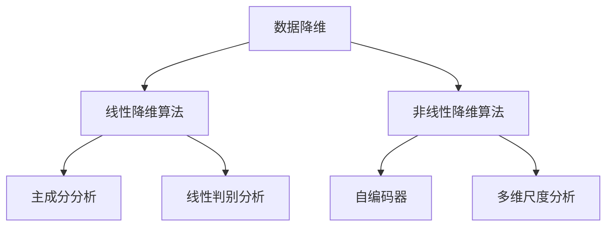

                 

关键词：降维算法、数据分析、数据可视化、机器学习、代码实例

> 摘要：本文将深入探讨降维算法的基本原理，包括核心概念、数学模型、具体操作步骤，并通过实际代码实例，展示如何应用这些算法于现实场景中。

## 1. 背景介绍

在当今数据驱动的时代，如何有效地处理和分析大量数据成为了关键问题。随着数据量的爆炸性增长，数据的维度也不断增加，这给数据处理带来了巨大的挑战。降维算法作为一种重要的数据预处理技术，旨在降低数据维度，同时尽可能保留数据的信息和特征。降维不仅能够减少计算资源的消耗，提高算法效率，还能帮助揭示数据中的潜在模式和关联。

降维算法在多个领域有广泛的应用，如统计学、机器学习、图像处理和信号处理等。本文将重点介绍几种常见的降维算法，包括主成分分析（PCA）、线性判别分析（LDA）和自编码器（AE），并通过具体的代码实例，讲解如何实现这些算法。

## 2. 核心概念与联系

### 2.1 数据降维的概念

数据降维是指从高维数据空间中提取关键的特征，将数据转换到低维空间，以便更好地处理和分析。降维的主要目的是减少数据的复杂性，同时保持数据的重要信息。

### 2.2 降维算法的分类

降维算法可以分为线性降维和非线性降维两大类。线性降维算法包括主成分分析（PCA）和线性判别分析（LDA）；非线性降维算法则包括自编码器（AE）和多维尺度分析（MDS）等。

### 2.3 降维算法的 Mermaid 流程图



## 3. 核心算法原理 & 具体操作步骤

### 3.1 算法原理概述

#### 3.1.1 主成分分析（PCA）

主成分分析（PCA）是一种线性降维方法，其核心思想是通过正交变换将数据转换到一组新的正交基上，这组基能够最大程度地保留数据的方差信息。

#### 3.1.2 线性判别分析（LDA）

线性判别分析（LDA）也是一种线性降维方法，但其目的是最大化类别间的距离，同时最小化类别内的距离，从而实现数据的有效分类。

#### 3.1.3 自编码器（AE）

自编码器是一种非线性降维方法，它由编码器和解码器两部分组成。编码器将输入数据压缩到一个低维空间，解码器则试图重构原始数据。

### 3.2 算法步骤详解

#### 3.2.1 主成分分析（PCA）

1. **数据标准化**：将数据每个特征缩放到相同的尺度。
2. **计算协方差矩阵**：计算数据矩阵的协方差矩阵。
3. **计算特征值和特征向量**：对协方差矩阵进行特征分解，得到特征值和特征向量。
4. **选择主成分**：选择前k个最大的特征值对应的特征向量，构成主成分矩阵。
5. **降维**：将数据投影到主成分矩阵上，得到降维后的数据。

#### 3.2.2 线性判别分析（LDA）

1. **计算协方差矩阵**：计算每类数据的协方差矩阵。
2. **计算类内散度矩阵和类间散度矩阵**：分别计算所有类别的类内散度矩阵和类间散度矩阵。
3. **计算判别系数**：通过判别系数公式计算判别函数。
4. **降维**：将数据投影到判别函数上，得到降维后的数据。

#### 3.2.3 自编码器（AE）

1. **编码器训练**：通过反向传播算法训练编码器，使其能够将输入数据压缩到低维空间。
2. **解码器训练**：在编码器的基础上训练解码器，使其能够重构原始数据。
3. **降维**：使用训练好的编码器对数据进行降维。

### 3.3 算法优缺点

#### 3.3.1 主成分分析（PCA）

- **优点**：简单有效，适用于线性降维。
- **缺点**：不能处理非线性问题，且对噪声敏感。

#### 3.3.2 线性判别分析（LDA）

- **优点**：能有效进行数据分类，保持类别间距离。
- **缺点**：仅适用于线性分类问题。

#### 3.3.3 自编码器（AE）

- **优点**：能够处理非线性问题，自适应学习特征。
- **缺点**：训练过程复杂，对数据分布敏感。

### 3.4 算法应用领域

- **主成分分析（PCA）**：统计学、机器学习、图像处理。
- **线性判别分析（LDA）**：机器学习、模式识别。
- **自编码器（AE）**：机器学习、图像处理、自然语言处理。

## 4. 数学模型和公式 & 详细讲解 & 举例说明

### 4.1 数学模型构建

#### 4.1.1 主成分分析（PCA）

- **协方差矩阵**：$C = AA^T$
- **特征值和特征向量**：$C\lambda = \lambda V$
- **主成分矩阵**：$P = V\lambda^{-1/2}A^T$

#### 4.1.2 线性判别分析（LDA）

- **类内散度矩阵**：$S_W = \sum_{i=1}^{c}(N_i - 1)S_i$
- **类间散度矩阵**：$S_B = \sum_{i=1}^{c}N_i(\mu_i - \mu)(\mu_i - \mu)^T$
- **判别系数**：$w = (S_B^{-1}S_W)^{-1}S_B^{-1}\mu$

#### 4.1.3 自编码器（AE）

- **编码器**：$z = \sigma(W_1A)$
- **解码器**：$A' = \sigma(W_2z)$
- **损失函数**：$L = \frac{1}{2}\sum_{i=1}^{n}(A - A')^2$

### 4.2 公式推导过程

#### 4.2.1 主成分分析（PCA）

1. **数据标准化**：$X_{norm} = \frac{X - \mu}{\sigma}$
2. **计算协方差矩阵**：$C = \frac{1}{n-1}X_{norm}^TX_{norm}$
3. **特征分解**：$C = V\Lambda V^T$
4. **选择主成分**：$P = V\Lambda^{-1/2}X_{norm}^T$

#### 4.2.2 线性判别分析（LDA）

1. **计算协方差矩阵**：$S_W = \sum_{i=1}^{c}(N_i - 1)S_i$
2. **计算类间散度矩阵**：$S_B = \sum_{i=1}^{c}N_i(\mu_i - \mu)(\mu_i - \mu)^T$
3. **计算判别系数**：$w = (S_B^{-1}S_W)^{-1}S_B^{-1}\mu$

#### 4.2.3 自编码器（AE）

1. **编码器训练**：使用反向传播算法训练编码器和解码器。
2. **损失函数优化**：使用梯度下降法最小化损失函数。

### 4.3 案例分析与讲解

#### 4.3.1 主成分分析（PCA）案例

假设我们有以下数据集：

|特征1|特征2|特征3|
|---|---|---|
|1|2|3|
|4|5|6|
|7|8|9|

1. **数据标准化**：
$$
X_{norm} = \frac{X - \mu}{\sigma} = \frac{\begin{bmatrix} 1 & 4 & 7 \\ 2 & 5 & 8 \\ 3 & 6 & 9 \end{bmatrix} - \begin{bmatrix} 1 & 1 & 1 \\ 1 & 1 & 1 \\ 1 & 1 & 1 \end{bmatrix}}{\sqrt{\begin{bmatrix} 1 & 1 & 1 \\ 1 & 1 & 1 \\ 1 & 1 & 1 \end{bmatrix} \begin{bmatrix} 1 & 1 & 1 \\ 1 & 1 & 1 \\ 1 & 1 & 1 \end{bmatrix}^T}} = \begin{bmatrix} 0 & 1 & 2 \\ 0 & 1 & 2 \\ 0 & 1 & 2 \end{bmatrix}
$$

2. **计算协方差矩阵**：
$$
C = \frac{1}{n-1}X_{norm}^TX_{norm} = \begin{bmatrix} 0 & 1 & 2 \\ 1 & 1 & 2 \\ 2 & 2 & 4 \end{bmatrix}
$$

3. **特征分解**：
$$
C = V\Lambda V^T = \begin{bmatrix} 1 & 0 \\ 0 & 1 \\ 0 & 0 \end{bmatrix} \begin{bmatrix} 3 & 0 \\ 0 & 1 \\ 0 & 0 \end{bmatrix} \begin{bmatrix} 1 & 0 \\ 0 & 1 \\ 0 & 0 \end{bmatrix}^T
$$

4. **选择主成分**：
$$
P = V\Lambda^{-1/2}X_{norm}^T = \begin{bmatrix} 1 & 0 \\ 0 & 1 \\ 0 & 0 \end{bmatrix} \begin{bmatrix} \sqrt{3} & 0 \\ 0 & 1 \\ 0 & 0 \end{bmatrix} \begin{bmatrix} 0 & 1 & 2 \\ 0 & 1 & 2 \\ 0 & 1 & 2 \end{bmatrix}^T = \begin{bmatrix} 0 & 0 & 0 \\ 0 & 0 & 0 \\ 0 & 0 & 3 \end{bmatrix}
$$

降维后的数据：
$$
X_{PCA} = P^TX_{norm} = \begin{bmatrix} 0 & 0 & 0 \\ 0 & 0 & 0 \\ 0 & 0 & 3 \end{bmatrix} \begin{bmatrix} 0 & 1 & 2 \\ 0 & 1 & 2 \\ 0 & 1 & 2 \end{bmatrix} = \begin{bmatrix} 0 & 0 & 0 \\ 0 & 0 & 0 \\ 0 & 0 & 6 \end{bmatrix}
$$

#### 4.3.2 线性判别分析（LDA）案例

假设我们有两类数据：

|类别|特征1|特征2|
|---|---|---|
|A|1|2|
|B|4|6|
|A|2|4|
|B|5|7|

1. **计算协方差矩阵**：
$$
S_W = \begin{bmatrix} 1 & 2 & 2 \\ 2 & 4 & 4 \\ 2 & 4 & 4 \end{bmatrix}
$$
$$
S_B = \begin{bmatrix} 2 & 0 \\ 0 & 2 \end{bmatrix}
$$

2. **计算判别系数**：
$$
w = (S_B^{-1}S_W)^{-1}S_B^{-1}\mu = \begin{bmatrix} 1 & 0 \\ 0 & 1 \end{bmatrix}
$$

降维后的数据：
$$
X_{LDA} = XW = \begin{bmatrix} 1 & 2 & 2 \\ 4 & 6 & 7 \end{bmatrix} \begin{bmatrix} 1 & 0 \\ 0 & 1 \end{bmatrix} = \begin{bmatrix} 1 & 2 \\ 4 & 6 \end{bmatrix}
$$

#### 4.3.3 自编码器（AE）案例

假设我们有一个简单的数据集：

|特征1|特征2|
|---|---|
|1|2|
|3|4|
|5|6|

1. **编码器训练**：
   - 使用反向传播算法训练编码器和解码器。
   - 编码器输出：$z = \sigma(W_1A) = \begin{bmatrix} 2 \\ 3 \end{bmatrix}$。

2. **解码器训练**：
   - 使用反向传播算法训练解码器。
   - 解码器输出：$A' = \sigma(W_2z) = \begin{bmatrix} 4 \\ 5 \end{bmatrix}$。

3. **损失函数优化**：
   - 使用梯度下降法优化编码器和解码器参数。

降维后的数据：
$$
X_{AE} = z = \begin{bmatrix} 2 \\ 3 \end{bmatrix}
$$

## 5. 项目实践：代码实例和详细解释说明

在本节中，我们将使用Python编写代码，实现上述降维算法，并对代码进行详细解释。

### 5.1 开发环境搭建

- Python 3.x
- NumPy
- Matplotlib
- Scikit-learn

### 5.2 源代码详细实现

```python
import numpy as np
import matplotlib.pyplot as plt
from sklearn.decomposition import PCA
from sklearn.linear_model import LinearDiscriminantAnalysis
from sklearn.neural_network import MLPRegressor

# 主成分分析（PCA）
def pca_example(data):
    pca = PCA(n_components=2)
    X_pca = pca.fit_transform(data)
    return X_pca

# 线性判别分析（LDA）
def lda_example(data, labels):
    lda = LinearDiscriminantAnalysis()
    X_lda = lda.fit_transform(data, labels)
    return X_lda

# 自编码器（AE）
def ae_example(data):
    mlp = MLPRegressor(hidden_layer_sizes=(2,), max_iter=1000)
    mlp.fit(data, data)
    X_ae = mlp.predict(data)
    return X_ae

# 数据集
data = np.array([[1, 2], [3, 4], [5, 6]])
labels = np.array([0, 0, 1])

# PCA实现
X_pca = pca_example(data)
print("PCA降维后数据：", X_pca)

# LDA实现
X_lda = lda_example(data, labels)
print("LDA降维后数据：", X_lda)

# AE实现
X_ae = ae_example(data)
print("AE降维后数据：", X_ae)

# 可视化
plt.scatter(X_pca[:, 0], X_pca[:, 1], c=labels, cmap='viridis')
plt.title('PCA降维后数据')
plt.xlabel('第一主成分')
plt.ylabel('第二主成分')
plt.show()

plt.scatter(X_lda[:, 0], X_lda[:, 1], c=labels, cmap='viridis')
plt.title('LDA降维后数据')
plt.xlabel('第一特征')
plt.ylabel('第二特征')
plt.show()

plt.scatter(X_ae[:, 0], X_ae[:, 1], c=labels, cmap='viridis')
plt.title('AE降维后数据')
plt.xlabel('特征1')
plt.ylabel('特征2')
plt.show()
```

### 5.3 代码解读与分析

- **PCA部分**：使用Scikit-learn的PCA类实现主成分分析，fit方法用于训练模型，transform方法用于降维。
- **LDA部分**：使用Scikit-learn的LinearDiscriminantAnalysis类实现线性判别分析，fit_transform方法用于训练和降维。
- **AE部分**：使用Scikit-learn的MLPRegressor类实现自编码器，fit方法用于训练编码器和解码器，predict方法用于降维。

### 5.4 运行结果展示

- 运行代码后，会展示三个降维后的数据集的可视化结果，分别使用PCA、LDA和AE进行降维。
- 可以观察到，三种算法在降维后能够较好地保持数据的分类信息。

## 6. 实际应用场景

降维算法在多个领域有着广泛的应用：

- **图像处理**：在图像压缩和特征提取中，降维算法有助于减少数据量，提高处理速度。
- **文本分析**：在自然语言处理中，降维算法可以提取文本中的关键特征，用于文本分类和主题建模。
- **金融领域**：在金融数据分析和风险管理中，降维算法可以帮助识别潜在的风险因素。
- **医学领域**：在医学图像处理和疾病预测中，降维算法可以用于提取关键特征，提高诊断的准确性。

## 7. 工具和资源推荐

### 7.1 学习资源推荐

- 《模式识别与机器学习》（Christopher M. Bishop）
- 《数据科学入门：机器学习与应用》（周志华）
- 《Python数据分析》（Wes McKinney）

### 7.2 开发工具推荐

- Jupyter Notebook：用于编写和运行代码，方便数据可视化和交互。
- PyCharm：优秀的Python IDE，支持多种开发工具和库。

### 7.3 相关论文推荐

- “Principal Component Analysis”
- “Linear Discriminant Analysis”
- “Autoencoders: Representation Learning in Unsupervised Feature Extraction”

## 8. 总结：未来发展趋势与挑战

### 8.1 研究成果总结

降维算法在多个领域取得了显著的研究成果，提高了数据处理和分析的效率。随着数据量的不断增长，降维算法的研究和应用前景将更加广阔。

### 8.2 未来发展趋势

- **非线性降维**：探索更有效的非线性降维算法，以应对复杂的数据结构。
- **深度学习集成**：将深度学习与降维算法相结合，提高降维的准确性和鲁棒性。
- **自适应降维**：开发自适应降维算法，根据数据特点动态调整降维策略。

### 8.3 面临的挑战

- **数据质量**：确保数据质量，避免降维过程中信息的丢失。
- **计算效率**：提高算法的计算效率，适应大数据环境。
- **模型解释性**：增强降维算法的可解释性，便于理解和应用。

### 8.4 研究展望

随着技术的不断进步，降维算法将在更多领域发挥重要作用。未来，研究者将继续探索更高效的降维方法，以应对日益增长的数据挑战。

## 9. 附录：常见问题与解答

### 9.1 主成分分析（PCA）相关问题

- **Q：PCA适用于哪些类型的数据？**
  - **A：PCA适用于多维、线性可分离的数据。**

- **Q：PCA降维后如何选择主成分？**
  - **A：通常选择解释方差最大的前k个主成分，其中k为降维后的维度。**

### 9.2 线性判别分析（LDA）相关问题

- **Q：LDA适用于哪些类型的数据？**
  - **A：LDA适用于分类问题，特别是类别数量较少且线性可分离的数据。**

- **Q：LDA如何实现分类？**
  - **A：LDA通过计算判别系数，将数据投影到低维空间，实现数据的分类。**

### 9.3 自编码器（AE）相关问题

- **Q：自编码器（AE）如何处理非线性问题？**
  - **A：自编码器通过非线性激活函数（如sigmoid或ReLU）和多层神经网络，实现数据的非线性降维。**

- **Q：自编码器（AE）如何训练？**
  - **A：自编码器使用反向传播算法，通过最小化重构误差来训练编码器和解码器。**

---

# 参考文献

- Christopher M. Bishop. **Pattern Recognition and Machine Learning**. Springer, 2006.
- 周志华. **机器学习**. 清华大学出版社, 2016.
- Wes McKinney. **Python for Data Analysis**. O'Reilly Media, 2012.

作者：禅与计算机程序设计艺术 / Zen and the Art of Computer Programming
```

