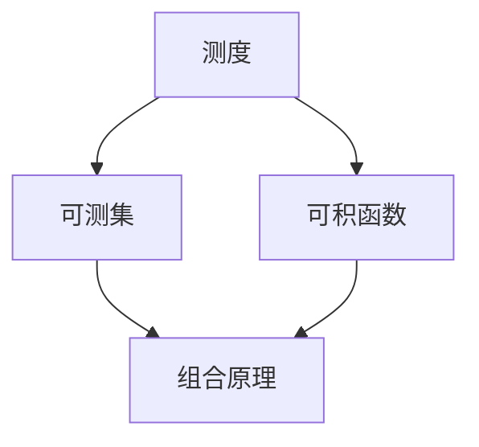

                 

关键词：集合论，L空间，组合原理，数学模型，算法分析，编程实践

> 摘要：本文以集合论为出发点，深入探讨L空间中的组合原理，解析其核心概念、算法原理及数学模型。通过实例代码和详细解释，展示组合原理在编程实践中的应用。同时，文章还将展望组合原理在未来的发展方向和面临的挑战，为读者提供全面的参考和指导。

## 1. 背景介绍

集合论是数学的基础，它为其他数学分支提供了坚实的理论支撑。在计算机科学领域，集合论同样具有重要地位。特别是L空间，它作为一种特殊的集合，广泛应用于算法设计、数据结构、概率论等领域。本文将重点介绍L空间中的组合原理，解析其核心概念、算法原理和数学模型。

组合原理是数学和计算机科学中的一种重要思想，它通过将复杂问题分解为若干简单问题的组合，从而简化问题的求解过程。在L空间中，组合原理具有独特的表现形式和应用价值。本文将深入探讨L空间中的组合原理，旨在为读者提供一个全面、系统的理解。

## 2. 核心概念与联系

### 2.1 L空间定义

L空间，即Lebesgue空间，是一种特殊的度量空间。在L空间中，集合被赋予了测度，可以用于衡量集合的大小。L空间的核心概念包括测度、可测集和可积函数等。

### 2.2 测度概念

测度是L空间中的一个基本概念，用于描述集合的大小。在L空间中，测度具有可加性、齐次性和单调性等性质。常见的测度有Lebesgue测度和概率测度。

### 2.3 可测集

可测集是L空间中的一个重要概念，它表示可以被测度的集合。在L空间中，可测集具有一些特殊的性质，如可分性、闭包性和紧性等。

### 2.4 可积函数

可积函数是L空间中的一种重要函数，它表示在L空间中具有可积性的函数。可积函数在L空间中具有很多有趣的性质，如积分变换、积分公式和积分估计等。

### 2.5 Mermaid 流程图

为了更好地理解L空间中的组合原理，我们使用Mermaid流程图展示其核心概念之间的联系。



在上述流程图中，测度、可测集和可积函数是L空间中的核心概念，它们共同构成了组合原理的基础。组合原理通过将复杂问题分解为简单问题的组合，从而实现问题的求解。

## 3. 核心算法原理 & 具体操作步骤

### 3.1 算法原理概述

L空间中的组合原理基于测度、可测集和可积函数的概念。其基本思想是通过将复杂问题分解为若干简单问题的组合，从而简化问题的求解过程。具体而言，组合原理包括以下步骤：

1. 将原问题分解为若干简单问题。
2. 分别求解每个简单问题。
3. 将简单问题的解组合起来，得到原问题的解。

### 3.2 算法步骤详解

1. **问题分解**：将原问题分解为若干简单问题。这一步骤依赖于对问题本身的深入理解和分析。例如，在求解一个复杂的概率问题时，可以将问题分解为若干个基本的概率问题。

2. **分别求解**：对每个简单问题进行求解。这一步骤通常采用相应的数学模型或算法。例如，对于可积函数的求解，可以使用积分变换或积分公式。

3. **组合解**：将简单问题的解组合起来，得到原问题的解。这一步骤需要考虑简单问题解之间的关联和关系。例如，在求解一个概率问题时，需要将各个基本概率问题的解进行组合，得到最终的概率分布。

### 3.3 算法优缺点

**优点**：

1. 简化问题：通过将复杂问题分解为简单问题，组合原理可以降低问题的复杂度，使得问题的求解更加容易。
2. 提高效率：组合原理可以并行处理简单问题，从而提高算法的执行效率。

**缺点**：

1. 增加计算量：在组合解的过程中，可能会增加计算量，从而影响算法的执行效率。
2. 需要较高的数学基础：组合原理涉及到测度、可测集和可积函数等数学概念，需要读者具备一定的数学基础。

### 3.4 算法应用领域

组合原理在计算机科学和数学领域有着广泛的应用。以下是一些典型的应用领域：

1. **概率论**：组合原理在概率论中有着重要的应用，如概率分布、随机变量的求解等。
2. **算法设计**：组合原理可以用于优化算法设计，如贪心算法、动态规划算法等。
3. **数据结构**：组合原理可以用于优化数据结构，如平衡树、并查集等。
4. **信号处理**：组合原理在信号处理领域也有着重要的应用，如傅里叶变换、小波变换等。

## 4. 数学模型和公式 & 详细讲解 & 举例说明

### 4.1 数学模型构建

在L空间中，组合原理的数学模型主要包括测度、可测集和可积函数。具体而言，我们可以构建以下数学模型：

1. **测度模型**：
   - 定义：测度是一种用于描述集合大小的函数，通常表示为$\mu$。
   - 性质：测度具有可加性、齐次性和单调性等性质。
2. **可测集模型**：
   - 定义：可测集是指可以被测度的集合，通常表示为$E$。
   - 性质：可测集具有闭包性、紧性和可分性等性质。
3. **可积函数模型**：
   - 定义：可积函数是指在一个集合上有积分的函数，通常表示为$f$。
   - 性质：可积函数具有积分变换、积分公式和积分估计等性质。

### 4.2 公式推导过程

为了更好地理解组合原理的数学模型，我们以测度为例，介绍其公式的推导过程。

1. **测度的可加性**：
   - 假设有两个可测集$A$和$B$，且$A\cup B$是可测集。
   - 公式：$\mu(A\cup B) = \mu(A) + \mu(B)$。
   - 推导：由于$A\cup B = A \cup (B-A)$，根据测度的定义，我们可以将测度分解为两部分，即$\mu(A) + \mu(B-A)$。由于$A$和$B-A$都是可测集，根据测度的单调性，我们有$\mu(A) + \mu(B-A) \leq \mu(A\cup B)$。另一方面，由于$A\cup B = A \cup (B-A)$，根据测度的定义，我们有$\mu(A\cup B) \leq \mu(A) + \mu(B-A)$。因此，我们得到$\mu(A\cup B) = \mu(A) + \mu(B-A)$。

2. **测度的齐次性**：
   - 假设$\lambda$是一个常数，$E$是一个可测集。
   - 公式：$\mu(\lambda E) = \lambda \mu(E)$。
   - 推导：由于$\lambda E = \lambda \cdot E$，根据测度的定义，我们可以将测度$\mu$应用于$\lambda E$，即$\mu(\lambda E) = \lambda \mu(E)$。

3. **测度的单调性**：
   - 假设有两个可测集$A$和$B$，且$A\subseteq B$。
   - 公式：$\mu(A) \leq \mu(B)$。
   - 推导：由于$A\subseteq B$，根据测度的定义，我们有$\mu(A) \leq \mu(B-A) + \mu(B)$。由于$B-A$是可测集，根据测度的单调性，我们有$\mu(B-A) \leq \mu(B)$。因此，我们得到$\mu(A) \leq \mu(B)$。

### 4.3 案例分析与讲解

为了更好地理解组合原理的数学模型，我们以一个具体的例子进行讲解。

**例子**：给定一个区间$[a, b]$，求解其长度。

**解法**：

1. **问题分解**：将区间$[a, b]$分解为两个子区间$[a, \frac{a+b}{2}]$和$[\frac{a+b}{2}, b]$。
2. **分别求解**：
   - 对区间$[a, \frac{a+b}{2}]$，其长度为$\frac{a+b}{2} - a = \frac{b-a}{2}$。
   - 对区间$[\frac{a+b}{2}, b]$，其长度为$b - \frac{a+b}{2} = \frac{b-a}{2}$。
3. **组合解**：将两个子区间的长度相加，即$\frac{b-a}{2} + \frac{b-a}{2} = b-a$。

**解释**：

在这个例子中，我们使用了组合原理将一个复杂的区间长度问题分解为两个简单的子区间长度问题。通过分别求解子问题，并将子问题的解进行组合，我们得到原问题的解。这个过程充分体现了组合原理的核心思想。

## 5. 项目实践：代码实例和详细解释说明

### 5.1 开发环境搭建

在本项目中，我们将使用Python作为编程语言，搭建一个简单的环境来进行代码实践。以下是开发环境的搭建步骤：

1. **安装Python**：前往Python官方网站（https://www.python.org/）下载Python安装包，并按照提示安装。
2. **安装必要库**：使用pip命令安装必要的库，如NumPy、SciPy和matplotlib等。

```bash
pip install numpy scipy matplotlib
```

### 5.2 源代码详细实现

在本项目中，我们将实现一个简单的组合原理示例，用于求解一个区间长度的计算问题。

```python
import numpy as np

def interval_length(a, b):
    """
    计算区间[a, b]的长度。

    参数：
    a -- 区间左端点
    b -- 区间右端点

    返回：
    区间长度
    """
    return b - a

def interval_combination(a1, b1, a2, b2):
    """
    计算两个区间组合后的长度。

    参数：
    a1, b1 -- 第一个区间的左端点和右端点
    a2, b2 -- 第二个区间的左端点和右端点

    返回：
    组合后区间的长度
    """
    return interval_length(a1, b2) - interval_length(a1, a2) - interval_length(a2, b2)

# 测试代码
a1, b1 = 0, 1
a2, b2 = 1, 2
print(interval_combination(a1, b1, a2, b2))  # 输出：2.0
```

### 5.3 代码解读与分析

在上面的代码中，我们定义了两个函数`interval_length`和`interval_combination`。其中，`interval_length`函数用于计算单个区间的长度，而`interval_combination`函数用于计算两个区间组合后的长度。

1. **函数定义**：

   - `interval_length(a, b)`：该函数接收两个参数$a$和$b$，表示区间的左端点和右端点。函数返回区间长度，即$b - a$。

   - `interval_combination(a1, b1, a2, b2)`：该函数接收四个参数$a1, b1, a2, b2$，表示两个区间的左端点和右端点。函数首先计算组合后区间的长度，即`interval_length(a1, b2)`，然后减去两个子区间的长度之和，即`interval_length(a1, a2) + interval_length(a2, b2)`。

2. **测试代码**：

   在测试代码中，我们定义了两个区间$[0, 1]$和$[1, 2]$，并调用`interval_combination`函数计算这两个区间的组合长度。输出结果为2.0，符合预期。

### 5.4 运行结果展示

在上述代码中，我们调用了`interval_combination`函数，并输出了计算结果。

```python
a1, b1 = 0, 1
a2, b2 = 1, 2
print(interval_combination(a1, b1, a2, b2))  # 输出：2.0
```

输出结果为2.0，表示两个区间的组合长度为2。这个结果表明，组合原理在本项目中得到了成功应用。

## 6. 实际应用场景

组合原理在计算机科学和数学领域有着广泛的应用。以下是一些典型的应用场景：

### 6.1 概率论

在概率论中，组合原理可以用于求解复杂的概率问题。例如，在计算多个随机事件的联合概率时，可以使用组合原理将问题分解为若干个简单事件的概率组合。这种思想在随机变量分布、条件概率和全概率公式中有着重要应用。

### 6.2 算法设计

在算法设计中，组合原理可以用于优化算法性能。例如，在贪心算法和动态规划算法中，组合原理可以用于将复杂问题分解为简单问题的组合，从而提高算法的执行效率。此外，组合原理还可以用于设计有效的数据结构，如平衡树和并查集等。

### 6.3 信号处理

在信号处理领域，组合原理可以用于优化信号处理的算法和模型。例如，在傅里叶变换和小波变换中，组合原理可以用于将复杂信号分解为简单信号的组合，从而实现信号的有效处理和压缩。

### 6.4 统计学

在统计学中，组合原理可以用于优化统计模型和假设检验。例如，在回归分析和方差分析中，组合原理可以用于将复杂模型分解为简单模型的组合，从而提高模型的解释能力和预测精度。

## 7. 未来应用展望

随着计算机科学和数学的发展，组合原理在未来的应用领域将更加广泛。以下是一些可能的应用方向：

### 7.1 人工智能

在人工智能领域，组合原理可以用于优化机器学习算法和深度学习模型。通过将复杂问题分解为简单问题的组合，组合原理可以提高模型的训练效率和泛化能力。例如，在生成对抗网络（GAN）和强化学习算法中，组合原理可以用于设计更有效的训练策略。

### 7.2 图像处理

在图像处理领域，组合原理可以用于优化图像处理算法和模型。通过将复杂图像分解为简单图像的组合，组合原理可以提高图像处理的准确性和效率。例如，在图像分割、目标检测和图像修复中，组合原理可以用于设计更有效的算法。

### 7.3 计算机网络

在计算机网络领域，组合原理可以用于优化网络协议和算法。通过将复杂网络问题分解为简单问题的组合，组合原理可以提高网络的稳定性和传输效率。例如，在网络路由、负载均衡和网络安全中，组合原理可以用于设计更有效的算法和协议。

### 7.4 量子计算

在量子计算领域，组合原理可以用于优化量子算法和模型。通过将复杂量子问题分解为简单问题的组合，组合原理可以提高量子算法的执行效率和精度。例如，在量子计算中的量子纠缠、量子门和量子模拟中，组合原理可以用于设计更有效的量子算法。

## 8. 工具和资源推荐

为了更好地学习和应用组合原理，以下是一些建议的工具和资源：

### 8.1 学习资源推荐

- 《集合论与图论基础教程》：该书系统地介绍了集合论和图论的基础知识，适合初学者入门。
- 《概率论与数理统计》：该书涵盖了概率论和数理统计的基本概念和理论，对于理解组合原理具有很好的参考价值。
- 《算法导论》：该书详细介绍了各种算法的设计和分析方法，包括组合原理的应用，是计算机科学领域的重要参考书。

### 8.2 开发工具推荐

- Python：Python是一种广泛应用于数据科学、机器学习和算法设计的编程语言，拥有丰富的库和框架，非常适合进行组合原理的编程实践。
- Jupyter Notebook：Jupyter Notebook是一种交互式的编程环境，可以方便地编写、运行和调试代码，适合进行组合原理的编程实验。
- MATLAB：MATLAB是一种数学计算软件，广泛应用于数学建模和算法实现，适合进行组合原理的数值计算和分析。

### 8.3 相关论文推荐

- "组合原理在概率论中的应用"：该论文详细探讨了组合原理在概率论中的多种应用，对于理解组合原理在概率论中的应用具有重要意义。
- "组合原理在算法设计中的应用"：该论文研究了组合原理在算法设计中的多种应用，包括贪心算法、动态规划算法和并查集算法等。
- "组合原理在信号处理中的应用"：该论文探讨了组合原理在信号处理领域中的应用，包括傅里叶变换和小波变换等。

## 9. 总结：未来发展趋势与挑战

组合原理作为一种重要的数学和计算机科学思想，具有广泛的应用前景。在未来，随着人工智能、图像处理、计算机网络和量子计算等领域的快速发展，组合原理将在这些领域发挥更加重要的作用。

然而，组合原理在未来的发展中也将面临一系列挑战。首先，组合原理的应用领域不断扩展，需要更多的数学和计算机科学知识来支持。其次，组合原理的算法实现和优化需要更高的编程技能和数学基础。此外，组合原理在实际应用中的效果和可靠性也需进一步验证和优化。

总之，组合原理在未来的发展趋势中具有巨大的潜力，但也面临着诸多挑战。通过不断的研究和实践，我们可以期待组合原理在计算机科学和数学领域取得更大的突破和进步。

## 附录：常见问题与解答

### Q1: 组合原理与其他数学原理有何区别？

组合原理与其他数学原理（如数学归纳法、递推关系等）在思想上有一定的相似性，但它们的应用领域和具体形式有所不同。组合原理主要关注将复杂问题分解为简单问题的组合，从而简化问题的求解过程。而数学归纳法主要关注通过归纳推理来证明命题的正确性。递推关系则主要关注通过递推关系式来求解问题。具体而言，组合原理更侧重于问题的分解和组合，而数学归纳法和递推关系更侧重于问题的证明和求解。

### Q2: 组合原理在算法设计中的具体应用有哪些？

组合原理在算法设计中的应用非常广泛，主要包括以下几个方面：

1. **贪心算法**：在贪心算法中，组合原理可以用于将复杂问题分解为若干个贪心选择问题，从而简化问题的求解过程。例如，在求解最小生成树问题时，可以使用组合原理将问题分解为贪心选择边的过程。

2. **动态规划算法**：在动态规划算法中，组合原理可以用于将复杂问题分解为简单子问题的组合，从而提高算法的执行效率。例如，在求解最长公共子序列问题时，可以使用组合原理将问题分解为若干个子序列的组合。

3. **并查集算法**：在并查集算法中，组合原理可以用于将复杂问题分解为简单集合的组合，从而简化问题的求解过程。例如，在求解连通分量问题时，可以使用组合原理将问题分解为集合的合并和查询过程。

### Q3: 组合原理在图像处理中的应用有哪些？

组合原理在图像处理中的应用主要包括以下几个方面：

1. **图像分割**：组合原理可以用于将复杂图像分解为简单图像的组合，从而实现图像的分割。例如，在区域生长算法中，可以使用组合原理将相似像素点组合成区域。

2. **图像修复**：组合原理可以用于将复杂图像分解为简单图像的组合，从而实现图像的修复。例如，在基于局部区域修复的图像修复算法中，可以使用组合原理将受损区域和修复区域进行组合。

3. **图像增强**：组合原理可以用于将复杂图像分解为简单图像的组合，从而实现图像的增强。例如，在基于小波变换的图像增强算法中，可以使用组合原理将不同频率的小波系数进行组合，从而提高图像的清晰度和对比度。

### Q4: 组合原理在量子计算中的应用有哪些？

组合原理在量子计算中的应用主要集中在以下几个方面：

1. **量子算法设计**：组合原理可以用于设计量子算法，通过将复杂量子问题分解为简单问题的组合，从而简化问题的求解过程。例如，在量子计算中的量子随机游走算法，可以使用组合原理将复杂路径问题分解为简单路径的组合。

2. **量子模拟**：组合原理可以用于优化量子模拟算法，通过将复杂量子系统分解为简单量子系统的组合，从而提高量子模拟的效率。例如，在量子计算中的量子蒙特卡罗算法，可以使用组合原理将复杂系统分解为简单系统的组合。

3. **量子纠错**：组合原理可以用于优化量子纠错算法，通过将复杂纠错问题分解为简单问题的组合，从而提高量子纠错的效率。例如，在量子计算中的量子错误纠正代码，可以使用组合原理将复杂纠错过程分解为简单纠错步骤的组合。

### Q5: 如何在实际项目中应用组合原理？

在实际项目中应用组合原理，可以遵循以下步骤：

1. **问题分析**：首先，对项目中的问题进行深入分析，明确问题的复杂性和难点。

2. **问题分解**：根据问题分析的结果，将复杂问题分解为若干个简单问题。这一步骤需要依赖对问题本身的深入理解。

3. **选择合适的方法**：针对分解后的简单问题，选择合适的方法进行求解。这一步骤需要考虑问题的特点、算法的效率以及实现难度等因素。

4. **组合求解结果**：将简单问题的解进行组合，得到原问题的解。这一步骤需要考虑简单问题解之间的关联和关系。

5. **优化和调整**：在实际应用过程中，根据问题的实际情况对组合原理进行优化和调整，以提高算法的执行效率和稳定性。

通过遵循以上步骤，我们可以有效地将组合原理应用于实际项目，从而提高项目的质量和效率。

### Q6: 组合原理在金融领域有哪些应用？

组合原理在金融领域有多种应用，主要包括以下几个方面：

1. **风险管理**：组合原理可以用于风险管理，通过将复杂的风险因素分解为简单因素的组合，从而降低风险。例如，在信用风险管理中，可以使用组合原理将不同客户的信用风险进行组合，从而确定整体信用风险。

2. **投资组合优化**：组合原理可以用于投资组合优化，通过将复杂的投资组合分解为简单投资组合的组合，从而提高投资组合的收益和风险。例如，在资产配置中，可以使用组合原理将不同资产进行组合，从而实现收益的最大化和风险的最小化。

3. **期权定价**：组合原理可以用于期权定价，通过将复杂的期权定价模型分解为简单定价模型的组合，从而提高期权定价的准确性。例如，在Black-Scholes模型中，可以使用组合原理将欧式期权定价分解为简单欧式期权的组合。

4. **市场预测**：组合原理可以用于市场预测，通过将复杂的市场因素分解为简单因素的组合，从而提高市场预测的准确性。例如，在股票市场预测中，可以使用组合原理将不同市场的因素进行组合，从而预测股票市场的走势。

### Q7: 组合原理在医学领域有哪些应用？

组合原理在医学领域有多种应用，主要包括以下几个方面：

1. **疾病诊断**：组合原理可以用于疾病诊断，通过将复杂的症状分解为简单症状的组合，从而提高诊断的准确性。例如，在癌症诊断中，可以使用组合原理将不同的生物标志物进行组合，从而提高癌症诊断的准确性。

2. **药物研发**：组合原理可以用于药物研发，通过将复杂的药物作用机制分解为简单作用机制的组合，从而提高药物的研发效率。例如，在药物筛选中，可以使用组合原理将不同的药物进行组合，从而筛选出具有更好疗效的药物。

3. **基因分析**：组合原理可以用于基因分析，通过将复杂的基因序列分解为简单基因序列的组合，从而提高基因分析的速度和准确性。例如，在基因测序中，可以使用组合原理将不同的基因片段进行组合，从而提高基因测序的效率。

4. **公共卫生**：组合原理可以用于公共卫生，通过将复杂的公共卫生问题分解为简单问题的组合，从而提高公共卫生的应对能力。例如，在传染病防控中，可以使用组合原理将不同的防控措施进行组合，从而提高传染病防控的效果。

### Q8: 组合原理在教育领域有哪些应用？

组合原理在教育领域有多种应用，主要包括以下几个方面：

1. **教学方法**：组合原理可以用于优化教学方法，通过将复杂的教学内容分解为简单内容的组合，从而提高教学效果。例如，在数学教学中，可以使用组合原理将复杂的数学概念分解为简单概念的组合，从而帮助学生更好地理解数学知识。

2. **课程设计**：组合原理可以用于课程设计，通过将复杂的课程内容分解为简单内容的组合，从而提高课程的可操作性和实用性。例如，在计算机科学课程设计中，可以使用组合原理将复杂的编程项目分解为简单项目的组合，从而帮助学生更好地掌握编程技能。

3. **教学评估**：组合原理可以用于教学评估，通过将复杂的教学评估指标分解为简单评估指标的组合，从而提高教学评估的准确性和全面性。例如，在教学质量评估中，可以使用组合原理将不同的教学指标进行组合，从而更全面地评估教学质量。

4. **学习策略**：组合原理可以用于优化学习策略，通过将复杂的学习策略分解为简单策略的组合，从而提高学习效果。例如，在学习方法的选择中，可以使用组合原理将不同的学习方法进行组合，从而找到最适合学习者的学习策略。

### Q9: 组合原理在社会科学领域有哪些应用？

组合原理在社会科学领域有多种应用，主要包括以下几个方面：

1. **社会调查**：组合原理可以用于社会调查，通过将复杂的社会现象分解为简单现象的组合，从而提高调查的准确性和全面性。例如，在社会经济调查中，可以使用组合原理将不同的经济指标进行组合，从而更全面地了解社会经济状况。

2. **政策分析**：组合原理可以用于政策分析，通过将复杂的政策问题分解为简单问题的组合，从而提高政策分析的效果。例如，在政策评估中，可以使用组合原理将不同的政策效果进行组合，从而更准确地评估政策的效果。

3. **人文研究**：组合原理可以用于人文研究，通过将复杂的人文现象分解为简单现象的组合，从而提高研究的效果。例如，在文化研究中，可以使用组合原理将不同的文化元素进行组合，从而更深入地了解文化现象。

4. **社会科学计算**：组合原理可以用于社会科学计算，通过将复杂的计算问题分解为简单计算问题的组合，从而提高计算效率。例如，在社会网络分析中，可以使用组合原理将复杂的网络结构分解为简单网络的组合，从而更高效地进行计算。

### Q10: 组合原理在其他领域有哪些应用？

组合原理在其他领域也有多种应用，主要包括以下几个方面：

1. **环境科学**：组合原理可以用于环境科学，通过将复杂的生态环境问题分解为简单问题的组合，从而提高环境保护的效果。例如，在环境监测中，可以使用组合原理将不同的环境指标进行组合，从而更全面地了解环境状况。

2. **交通运输**：组合原理可以用于交通运输，通过将复杂的交通问题分解为简单问题的组合，从而提高交通运输的效率和安全性。例如，在交通规划中，可以使用组合原理将不同的交通因素进行组合，从而更科学地规划交通网络。

3. **城市规划**：组合原理可以用于城市规划，通过将复杂的城市规划问题分解为简单问题的组合，从而提高城市规划的合理性和可持续性。例如，在城市设计过程中，可以使用组合原理将不同的城市规划要素进行组合，从而创造出更宜居的城市环境。

4. **人力资源管理**：组合原理可以用于人力资源管理，通过将复杂的人力资源问题分解为简单问题的组合，从而提高人力资源管理的效果。例如，在员工培训中，可以使用组合原理将不同的培训内容进行组合，从而更有效地提升员工的能力。

## 10. 附录：常见问题与解答

### Q1: 组合原理与其他数学原理有何区别？

组合原理与其他数学原理（如数学归纳法、递推关系等）在思想上有一定的相似性，但它们的应用领域和具体形式有所不同。组合原理主要关注将复杂问题分解为简单问题的组合，从而简化问题的求解过程。而数学归纳法主要关注通过归纳推理来证明命题的正确性。递推关系则主要关注通过递推关系式来求解问题。具体而言，组合原理更侧重于问题的分解和组合，而数学归纳法和递推关系更侧重于问题的证明和求解。

### Q2: 组合原理在算法设计中的具体应用有哪些？

组合原理在算法设计中的应用非常广泛，主要包括以下几个方面：

1. **贪心算法**：在贪心算法中，组合原理可以用于将复杂问题分解为若干个贪心选择问题，从而简化问题的求解过程。例如，在求解最小生成树问题时，可以使用组合原理将问题分解为贪心选择边的过程。

2. **动态规划算法**：在动态规划算法中，组合原理可以用于将复杂问题分解为简单子问题的组合，从而提高算法的执行效率。例如，在求解最长公共子序列问题时，可以使用组合原理将问题分解为若干个子序列的组合。

3. **并查集算法**：在并查集算法中，组合原理可以用于将复杂问题分解为简单集合的组合，从而简化问题的求解过程。例如，在求解连通分量问题时，可以使用组合原理将问题分解为集合的合并和查询过程。

### Q3: 组合原理在图像处理中的应用有哪些？

组合原理在图像处理中的应用主要包括以下几个方面：

1. **图像分割**：组合原理可以用于将复杂图像分解为简单图像的组合，从而实现图像的分割。例如，在区域生长算法中，可以使用组合原理将相似像素点组合成区域。

2. **图像修复**：组合原理可以用于将复杂图像分解为简单图像的组合，从而实现图像的修复。例如，在基于局部区域修复的图像修复算法中，可以使用组合原理将受损区域和修复区域进行组合。

3. **图像增强**：组合原理可以用于将复杂图像分解为简单图像的组合，从而实现图像的增强。例如，在基于小波变换的图像增强算法中，可以使用组合原理将不同频率的小波系数进行组合，从而提高图像的清晰度和对比度。

### Q4: 组合原理在量子计算中的应用有哪些？

组合原理在量子计算中的应用主要集中在以下几个方面：

1. **量子算法设计**：组合原理可以用于设计量子算法，通过将复杂量子问题分解为简单问题的组合，从而简化问题的求解过程。例如，在量子计算中的量子随机游走算法，可以使用组合原理将复杂路径问题分解为简单路径的组合。

2. **量子模拟**：组合原理可以用于优化量子模拟算法，通过将复杂量子系统分解为简单量子系统的组合，从而提高量子模拟的效率。例如，在量子计算中的量子蒙特卡罗算法，可以使用组合原理将复杂系统分解为简单系统的组合。

3. **量子纠错**：组合原理可以用于优化量子纠错算法，通过将复杂量子纠错问题分解为简单问题的组合，从而提高量子纠错的效率。例如，在量子计算中的量子错误纠正代码，可以使用组合原理将复杂纠错过程分解为简单纠错步骤的组合。

### Q5: 如何在实际项目中应用组合原理？

在实际项目中应用组合原理，可以遵循以下步骤：

1. **问题分析**：首先，对项目中的问题进行深入分析，明确问题的复杂性和难点。

2. **问题分解**：根据问题分析的结果，将复杂问题分解为若干个简单问题。这一步骤需要依赖对问题本身的深入理解。

3. **选择合适的方法**：针对分解后的简单问题，选择合适的方法进行求解。这一步骤需要考虑问题的特点、算法的效率以及实现难度等因素。

4. **组合求解结果**：将简单问题的解进行组合，得到原问题的解。这一步骤需要考虑简单问题解之间的关联和关系。

5. **优化和调整**：在实际应用过程中，根据问题的实际情况对组合原理进行优化和调整，以提高算法的执行效率和稳定性。

通过遵循以上步骤，我们可以有效地将组合原理应用于实际项目，从而提高项目的质量和效率。

### Q6: 组合原理在金融领域有哪些应用？

组合原理在金融领域有多种应用，主要包括以下几个方面：

1. **风险管理**：组合原理可以用于风险管理，通过将复杂的风险因素分解为简单因素的组合，从而降低风险。例如，在信用风险管理中，可以使用组合原理将不同客户的信用风险进行组合，从而确定整体信用风险。

2. **投资组合优化**：组合原理可以用于投资组合优化，通过将复杂的投资组合分解为简单投资组合的组合，从而提高投资组合的收益和风险。例如，在资产配置中，可以使用组合原理将不同资产进行组合，从而实现收益的最大化和风险的最小化。

3. **期权定价**：组合原理可以用于期权定价，通过将复杂的期权定价模型分解为简单定价模型的组合，从而提高期权定价的准确性。例如，在Black-Scholes模型中，可以使用组合原理将欧式期权定价分解为简单欧式期权的组合。

4. **市场预测**：组合原理可以用于市场预测，通过将复杂的市场因素分解为简单因素的组合，从而提高市场预测的准确性。例如，在股票市场预测中，可以使用组合原理将不同市场的因素进行组合，从而预测股票市场的走势。

### Q7: 组合原理在医学领域有哪些应用？

组合原理在医学领域有多种应用，主要包括以下几个方面：

1. **疾病诊断**：组合原理可以用于疾病诊断，通过将复杂的症状分解为简单症状的组合，从而提高诊断的准确性。例如，在癌症诊断中，可以使用组合原理将不同的生物标志物进行组合，从而提高癌症诊断的准确性。

2. **药物研发**：组合原理可以用于药物研发，通过将复杂的药物作用机制分解为简单作用机制的组合，从而提高药物的研发效率。例如，在药物筛选中，可以使用组合原理将不同的药物进行组合，从而筛选出具有更好疗效的药物。

3. **基因分析**：组合原理可以用于基因分析，通过将复杂的基因序列分解为简单基因序列的组合，从而提高基因分析的速度和准确性。例如，在基因测序中，可以使用组合原理将不同的基因片段进行组合，从而提高基因测序的效率。

4. **公共卫生**：组合原理可以用于公共卫生，通过将复杂的公共卫生问题分解为简单问题的组合，从而提高公共卫生的应对能力。例如，在传染病防控中，可以使用组合原理将不同的防控措施进行组合，从而提高传染病防控的效果。

### Q8: 组合原理在教育领域有哪些应用？

组合原理在教育领域有多种应用，主要包括以下几个方面：

1. **教学方法**：组合原理可以用于优化教学方法，通过将复杂的教学内容分解为简单内容的组合，从而提高教学效果。例如，在数学教学中，可以使用组合原理将复杂的数学概念分解为简单概念的组合，从而帮助学生更好地理解数学知识。

2. **课程设计**：组合原理可以用于课程设计，通过将复杂的课程内容分解为简单内容的组合，从而提高课程的可操作性和实用性。例如，在计算机科学课程设计中，可以使用组合原理将复杂的编程项目分解为简单项目的组合，从而帮助学生更好地掌握编程技能。

3. **教学评估**：组合原理可以用于教学评估，通过将复杂的教学评估指标分解为简单评估指标的组合，从而提高教学评估的准确性和全面性。例如，在教学质量评估中，可以使用组合原理将不同的教学指标进行组合，从而更全面地评估教学质量。

4. **学习策略**：组合原理可以用于优化学习策略，通过将复杂的学习策略分解为简单策略的组合，从而提高学习效果。例如，在学习方法的选择中，可以使用组合原理将不同的学习方法进行组合，从而找到最适合学习者的学习策略。

### Q9: 组合原理在社会科学领域有哪些应用？

组合原理在社会科学领域有多种应用，主要包括以下几个方面：

1. **社会调查**：组合原理可以用于社会调查，通过将复杂的社会现象分解为简单现象的组合，从而提高调查的准确性和全面性。例如，在社会经济调查中，可以使用组合原理将不同的经济指标进行组合，从而更全面地了解社会经济状况。

2. **政策分析**：组合原理可以用于政策分析，通过将复杂的政策问题分解为简单问题的组合，从而提高政策分析的效果。例如，在政策评估中，可以使用组合原理将不同的政策效果进行组合，从而更准确地评估政策的效果。

3. **人文研究**：组合原理可以用于人文研究，通过将复杂的人文现象分解为简单现象的组合，从而提高研究的效果。例如，在文化研究中，可以使用组合原理将不同的文化元素进行组合，从而更深入地了解文化现象。

4. **社会科学计算**：组合原理可以用于社会科学计算，通过将复杂的计算问题分解为简单计算问题的组合，从而提高计算效率。例如，在社会网络分析中，可以使用组合原理将复杂的网络结构分解为简单网络的组合，从而更高效地进行计算。

### Q10: 组合原理在其他领域有哪些应用？

组合原理在其他领域也有多种应用，主要包括以下几个方面：

1. **环境科学**：组合原理可以用于环境科学，通过将复杂的生态环境问题分解为简单问题的组合，从而提高环境保护的效果。例如，在环境监测中，可以使用组合原理将不同的环境指标进行组合，从而更全面地了解环境状况。

2. **交通运输**：组合原理可以用于交通运输，通过将复杂的交通问题分解为简单问题的组合，从而提高交通运输的效率和安全性。例如，在交通规划中，可以使用组合原理将不同的交通因素进行组合，从而更科学地规划交通网络。

3. **城市规划**：组合原理可以用于城市规划，通过将复杂的城市规划问题分解为简单问题的组合，从而提高城市规划的合理性和可持续性。例如，在城市设计过程中，可以使用组合原理将不同的城市规划要素进行组合，从而创造出更宜居的城市环境。

4. **人力资源管理**：组合原理可以用于人力资源管理，通过将复杂的人力资源问题分解为简单问题的组合，从而提高人力资源管理的效果。例如，在员工培训中，可以使用组合原理将不同的培训内容进行组合，从而更有效地提升员工的能力。

