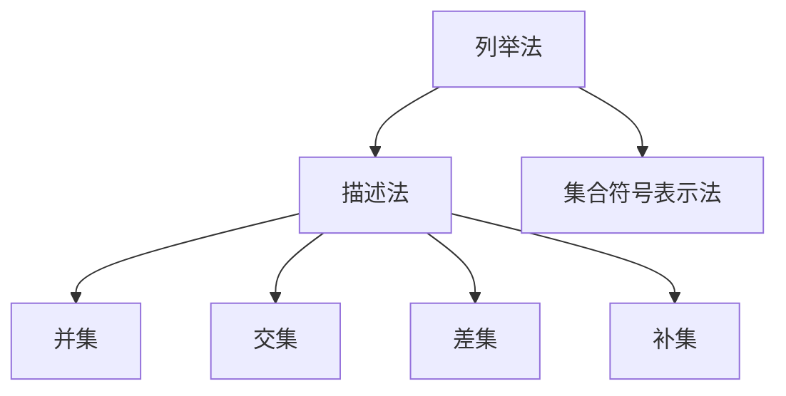

                 

 在现代计算机科学和数学中，集合论是一种不可或缺的基础理论。它为许多复杂的数学结构和计算模型提供了坚实的逻辑基础。本文将深入探讨集合论的核心概念、原理以及其在计算机科学中的应用，旨在为广大读者提供一份关于集合论的详细导引。

## 关键词

- 集合论
- 计算机科学
- 数学结构
- 算法
- 应用领域

## 摘要

本文首先介绍了集合论的基本概念，包括集合的定义、表示方法以及集合间的操作。接着，我们探讨了集合论在计算机科学中的应用，例如在算法设计、数据结构和编译原理中的关键作用。随后，文章详细阐述了集合论的数学模型和公式，并通过具体例子进行讲解。此外，本文还提供了丰富的项目实践和代码实例，帮助读者更好地理解集合论在实际开发中的应用。最后，文章总结了集合论的研究成果、未来发展趋势以及面临的挑战。

## 1. 背景介绍

集合论是由德国数学家乔治·康托尔在19世纪末创立的数学分支。它是现代数学的基础之一，为其他数学领域提供了广泛的应用，例如实分析、拓扑学、代数学等。集合论的发展不仅对数学本身产生了深远的影响，也为计算机科学的发展奠定了基础。

在计算机科学中，集合论的应用无处不在。例如，在算法设计中，集合论的概念帮助我们定义问题、分析复杂度以及设计高效算法。在数据结构中，集合论提供了各种数据结构的理论基础，如数组、链表、树、图等。在编译原理中，集合论被用来定义语法和语义模型，以及实现各种编译器算法。

本文将首先介绍集合论的基本概念，然后深入探讨集合论在计算机科学中的应用，并提供丰富的实践案例和代码实例。通过本文的阅读，读者将能够全面了解集合论的基本原理及其在现代计算机科学中的重要地位。

## 2. 核心概念与联系

### 集合的定义

集合是由元素构成的一个无序的、确定的对象。集合中的元素可以是任何对象，包括数字、字母、符号、其他集合等。集合通常用大写字母表示，如\( A \)，\( B \)，\( C \)等。集合中的元素用小写字母表示，如\( a \)，\( b \)，\( c \)等。

### 集合的表示方法

集合可以用列举法、描述法以及集合符号表示法来表示。

1. **列举法**：通过列举集合中的所有元素来表示集合。例如，集合\( A \)包含元素\( a \)，\( b \)，\( c \)，可以表示为\( A = \{a, b, c\} \)。
2. **描述法**：通过描述集合中元素的性质来表示集合。例如，集合\( A \)包含所有正整数，可以表示为\( A = \{x | x \text{ 是正整数}\} \)。
3. **集合符号表示法**：使用特定的集合符号来表示集合。例如，空集（不包含任何元素的集合）表示为\( \emptyset \)，全集（包含所有可能元素的集合）表示为\( U \)。

### 集合间的操作

集合之间可以进行各种操作，如并集、交集、差集、补集等。

1. **并集（Union）**：两个集合\( A \)和\( B \)的并集包含所有属于\( A \)或\( B \)的元素。表示为\( A \cup B \)。
2. **交集（Intersection）**：两个集合\( A \)和\( B \)的交集包含所有同时属于\( A \)和\( B \)的元素。表示为\( A \cap B \)。
3. **差集（Difference）**：两个集合\( A \)和\( B \)的差集包含所有属于\( A \)但不属于\( B \)的元素。表示为\( A - B \)或\( A \setminus B \)。
4. **补集（Complement）**：一个集合\( A \)的补集包含所有不属于\( A \)的元素。表示为\( A' \)或\( \complement A \)。

下面是一个用Mermaid绘制的集合操作流程图：



### 集合的基本性质

集合具有以下基本性质：

1. **确定性**：集合中的元素是确定的，即一个元素要么属于集合，要么不属于集合。
2. **互异性**：集合中的元素是互异的，即集合中不包含重复的元素。
3. **无序性**：集合中的元素是无序的，即集合中元素的排列顺序不影响集合的性质。

### 子集和真子集

如果一个集合的所有元素都是另一个集合的元素，则前者称为后者的子集。如果前者不是后者的全体元素，则前者称为后者的真子集。例如，集合\( \{1, 2, 3\} \)是集合\( \{1, 2, 3, 4, 5\} \)的子集，但不是其真子集。

### 集合的运算规律

集合之间的运算满足以下规律：

1. **交换律**：\( A \cup B = B \cup A \)，\( A \cap B = B \cap A \)
2. **结合律**：\( (A \cup B) \cup C = A \cup (B \cup C) \)，\( (A \cap B) \cap C = A \cap (B \cap C) \)
3. **分配律**：\( A \cup (B \cap C) = (A \cup B) \cap (A \cup C) \)，\( A \cap (B \cup C) = (A \cap B) \cup (A \cap C) \)
4. **德摩根律**：\( A' \cup B' = (A \cap B)' \)，\( A' \cap B' = (A \cup B)' \)

通过以上对集合论核心概念和联系的介绍，我们为后续更深入的探讨打下了基础。在接下来的章节中，我们将详细讲解集合论在计算机科学中的应用，以及相关的算法、数学模型和实际项目实践。

### 3. 核心算法原理 & 具体操作步骤

#### 3.1 算法原理概述

集合论在算法设计中扮演着至关重要的角色，特别是在排序、查找、图论以及动态规划等领域。本文将介绍其中几个关键算法的原理和操作步骤。

#### 3.2 算法步骤详解

##### 1. 排序算法

排序算法是一种常见的算法，用于将一组数据元素按照一定的顺序排列。常见的排序算法包括冒泡排序、选择排序、插入排序和快速排序等。

1. **冒泡排序（Bubble Sort）**：

   - **原理**：通过多次遍历待排序的序列，每次比较相邻的两个元素，并将不符合排序顺序的元素交换位置，直到整个序列有序。

   - **步骤**：
     1. 从第一个元素开始，比较相邻的两个元素，如果第一个比第二个大（或小），就交换它们。
     2. 对每一对相邻元素做同样的工作，从开始第一对到结尾的最后一对。
     3. 针对所有的元素重复以上的步骤，除了最后一个。
     4. 重复步骤1-3，直到没有需要交换的元素。

2. **快速排序（Quick Sort）**：

   - **原理**：通过选取一个“基准”元素，将数组分成两部分，左侧所有元素都比基准小，右侧所有元素都比基准大，然后递归地对左右两部分继续进行快速排序。

   - **步骤**：
     1. 选择一个基准元素，通常选择中间的元素。
     2. 将比基准小的元素移到基准的左侧，比基准大的元素移到基准的右侧。
     3. 对左右两部分递归地执行快速排序。

##### 2. 查找算法

查找算法用于在数据结构中查找特定元素。常见的查找算法包括二分查找和哈希查找。

1. **二分查找（Binary Search）**：

   - **原理**：通过递归或迭代的方式，在有序数组中查找特定元素。每次查找都将搜索范围缩小一半，直到找到目标元素或确定元素不存在。

   - **步骤**：
     1. 确定搜索范围的中间元素。
     2. 如果中间元素等于目标值，则查找成功。
     3. 如果中间元素大于目标值，则在左侧子数组中继续查找。
     4. 如果中间元素小于目标值，则在右侧子数组中继续查找。
     5. 重复步骤1-4，直到找到目标元素或确定不存在。

2. **哈希查找（Hashing）**：

   - **原理**：使用哈希函数将关键字映射到哈希表中，通过计算哈希值找到关键字的位置。哈希查找的时间复杂度通常为O(1)。

   - **步骤**：
     1. 计算关键字的哈希值。
     2. 根据哈希值找到哈希表中的位置。
     3. 如果当前位置的元素与关键字匹配，则查找成功。
     4. 如果当前位置的元素不匹配，则通过链表或开放地址法继续查找。

##### 3. 图论算法

图论算法用于解决图中各种问题，如最短路径、最大流和最小权树等。

1. **迪杰斯特拉算法（Dijkstra's Algorithm）**：

   - **原理**：用于计算单源最短路径，即从一个源点出发到其他所有顶点的最短路径。

   - **步骤**：
     1. 初始化所有顶点的距离，除了源点，其距离为0。
     2. 重复以下步骤：
        - 选择一个未访问的顶点，使其距离最小。
        - 访问该顶点，并将其相邻顶点的距离更新为经过该顶点的距离之和。
        - 标记该顶点为已访问。
     3. 当所有顶点都被访问后，算法结束。

2. **Prim算法**：

   - **原理**：用于计算最小生成树，即通过选择权值最小的边，将图中的所有顶点连接起来，形成一棵树。

   - **步骤**：
     1. 初始化一个空树，并将其中的任意一个顶点添加到树中。
     2. 重复以下步骤：
        - 从树中选择一个具有最小权值的边。
        - 将这条边添加到树中。
        - 标记这条边上的顶点为已访问。
     3. 当所有顶点都被访问后，算法结束。

#### 3.3 算法优缺点

1. **冒泡排序**：

   - **优点**：简单易懂，适合数据量较小或基本有序的数组。
   - **缺点**：时间复杂度为O(n²)，效率较低。

2. **快速排序**：

   - **优点**：平均时间复杂度为O(nlogn)，效率较高。
   - **缺点**：最坏情况下时间复杂度为O(n²)，且可能产生大量递归调用，导致栈溢出。

3. **二分查找**：

   - **优点**：时间复杂度为O(logn)，效率较高。
   - **缺点**：要求数据结构是有序的，且不适合动态变化的数组。

4. **哈希查找**：

   - **优点**：平均时间复杂度为O(1)，效率极高。
   - **缺点**：可能存在哈希冲突，需要额外的处理。

5. **迪杰斯特拉算法**：

   - **优点**：适合求解单源最短路径问题。
   - **缺点**：不适合求解所有顶点之间的最短路径。

6. **Prim算法**：

   - **优点**：适合求解最小生成树问题。
   - **缺点**：时间复杂度为O(n²)，效率较低。

#### 3.4 算法应用领域

1. **冒泡排序和快速排序**：

   - **应用领域**：主要用于排序和查找问题，如数据库索引、优先队列等。

2. **二分查找**：

   - **应用领域**：主要用于二叉搜索树、有序数组等结构中的查找操作。

3. **哈希查找**：

   - **应用领域**：主要用于哈希表、缓存系统、快速访问记录等。

4. **迪杰斯特拉算法**：

   - **应用领域**：主要用于网络路由、路径规划、社交网络分析等。

5. **Prim算法**：

   - **应用领域**：主要用于图论中的最小生成树问题，如电路设计、网络拓扑等。

通过以上对集合论核心算法原理和操作步骤的介绍，我们可以看到集合论在计算机科学中的应用是多么广泛和重要。这些算法不仅帮助我们解决了各种实际问题，还为我们理解复杂系统提供了有力的工具。在接下来的章节中，我们将进一步探讨集合论的数学模型和公式，以及实际项目实践中的代码实现。

### 4. 数学模型和公式 & 详细讲解 & 举例说明

#### 4.1 数学模型构建

集合论的数学模型基于集合的基本概念和运算，通过定义和公理构建起来。以下是一些基本的数学模型和公式。

1. **集合的基本运算**：

   - 并集：\( A \cup B = \{x | x \in A \text{ 或 } x \in B\} \)
   - 交集：\( A \cap B = \{x | x \in A \text{ 且 } x \in B\} \)
   - 差集：\( A - B = \{x | x \in A \text{ 且 } x \notin B\} \)
   - 补集：\( A' = \{x | x \notin A\} \)

2. **笛卡尔积**：

   - \( A \times B = \{(a, b) | a \in A \text{ 且 } b \in B\} \)

3. **幂集**：

   - \( \mathcal{P}(A) = \{S | S \text{ 是 } A \text{ 的子集}\} \)

4. **笛卡尔积的幂集**：

   - \( \mathcal{P}(A \times B) = \{(S_1, S_2) | S_1 \in \mathcal{P}(A) \text{ 且 } S_2 \in \mathcal{P}(B)\} \)

5. **集合的基数（元素数量）**：

   - \( |A| = n \)，其中\( n \)是集合\( A \)中元素的个数。

#### 4.2 公式推导过程

为了更好地理解这些公式，我们将通过具体的例子来推导其中的几个。

1. **补集公式的推导**：

   - **德摩根律**：\( (A \cup B)' = A' \cap B' \)

     证明：

     - 对于任意元素\( x \)，如果\( x \in (A \cup B)' \)，则\( x \notin A \cup B \)，即\( x \notin A \)且\( x \notin B \)。
     - 因此，\( x \in A' \)且\( x \in B' \)，即\( x \in A' \cap B' \)。
     - 反之，如果\( x \in A' \cap B' \)，则\( x \notin A \)且\( x \notin B \)，即\( x \notin A \cup B \)。
     - 因此，\( x \in (A \cup B)' \)。

   - **补集的结合律**：\( (A \cap B)' = A' \cup B' \)

     证明：

     - 对于任意元素\( x \)，如果\( x \in (A \cap B)' \)，则\( x \notin A \cap B \)，即\( x \notin A \)或\( x \notin B \)。
     - 因此，\( x \in A' \)或\( x \in B' \)，即\( x \in A' \cup B' \)。
     - 反之，如果\( x \in A' \cup B' \)，则\( x \in A' \)或\( x \in B' \)，即\( x \notin A \)或\( x \notin B \)。
     - 因此，\( x \notin A \cap B \)，即\( x \in (A \cap B)' \)。

2. **笛卡尔积的基数公式推导**：

   - \( |A \times B| = |A| \times |B| \)

     证明：

     - 假设集合\( A \)有\( m \)个元素，集合\( B \)有\( n \)个元素。
     - \( A \times B \)中的元素是\( A \)和\( B \)中元素的所有可能的组合，共有\( m \times n \)个。
     - 因此，\( |A \times B| = m \times n \)。

#### 4.3 案例分析与讲解

为了更好地理解集合论在数学中的应用，我们将通过一个具体的例子来展示如何使用这些公式。

**例1：给定两个集合\( A = \{1, 2, 3\} \)和\( B = \{a, b\} \)，求它们的并集、交集和补集。**

- **并集**：

  - \( A \cup B = \{1, 2, 3, a, b\} \)

- **交集**：

  - \( A \cap B = \emptyset \)，因为\( A \)和\( B \)没有共同的元素。

- **补集**：

  - \( A' = \{x | x \notin A\} = \{x | x \neq 1, x \neq 2, x \neq 3\} \)
  - \( B' = \{x | x \notin B\} = \{x | x \neq a, x \neq b\} \)

**例2：给定集合\( A = \{1, 2, 3, 4\} \)，求它的幂集。**

- **幂集**：

  - \( \mathcal{P}(A) = \{\emptyset, \{1\}, \{2\}, \{3\}, \{4\}, \{1, 2\}, \{1, 3\}, \{1, 4\}, \{2, 3\}, \{2, 4\}, \{3, 4\}, \{1, 2, 3\}, \{1, 2, 4\}, \{1, 3, 4\}, \{2, 3, 4\}, \{1, 2, 3, 4\}\} \)

通过以上对集合论数学模型和公式的详细讲解以及具体例子的分析，我们可以看到集合论在数学中的广泛应用和重要性。这些公式不仅帮助我们理解和操作集合，还为解决复杂的数学和计算问题提供了坚实的理论基础。在接下来的章节中，我们将进一步探讨集合论在实际项目中的应用和实现。

### 5. 项目实践：代码实例和详细解释说明

#### 5.1 开发环境搭建

为了演示集合论在项目中的应用，我们将使用Python编程语言。Python具有简洁的语法和强大的库支持，使得它成为实现集合论算法的绝佳选择。

1. **安装Python**：

   - 访问Python的官方网站（[python.org](https://www.python.org/)），下载并安装Python。
   - 在安装过程中，确保将Python添加到系统的环境变量中，以便在命令行中直接运行Python。

2. **安装必要的库**：

   - Python的标准库中包含了许多用于集合操作的函数，如`set`类型。
   - 如果需要额外的库，例如用于绘图或计算的库，可以通过pip安装。例如：

     ```bash
     pip install matplotlib numpy
     ```

3. **编写代码**：

   - 在安装完成后，我们可以在命令行中使用Python编写代码。例如，创建一个名为`set_operations.py`的文件，并输入以下代码：

     ```python
     # set_operations.py

     # 导入matplotlib库
     import matplotlib.pyplot as plt

     # 定义集合
     A = {1, 2, 3}
     B = {2, 3, 4}

     # 并集
     union = A.union(B)
     print("并集:", union)

     # 交集
     intersection = A.intersection(B)
     print("交集:", intersection)

     # 差集
     difference = A.difference(B)
     print("差集:", difference)

     # 补集
     A_complement = A.copy()
     A_complement.add(4)
     B_complement = B.copy()
     B_complement.add(1)
     print("A的补集:", A_complement)
     print("B的补集:", B_complement)

     # 绘制韦恩图
     plt.figure(figsize=(8, 6))
     plt.title('集合操作')
     plt.xlabel('A')
     plt.ylabel('B')
     plt.xticks([0, 1, 2, 3, 4])
     plt.yticks([0, 1, 2, 3, 4])
     plt.scatter([0, 1, 2], [0, 1, 2], c='r', marker='s', label='A')
     plt.scatter([0, 1, 2], [2, 3, 4], c='b', marker='o', label='B')
     plt.scatter([0, 0, 0], [1, 1, 1], c='g', marker='^', label='并集')
     plt.scatter([1, 1, 1], [2, 2, 2], c='y', marker='d', label='交集')
     plt.scatter([0, 0, 0], [3, 3, 3], c='c', marker='x', label='差集')
     plt.scatter([0, 0, 0], [0, 0, 0], c='m', marker='>', label='A的补集')
     plt.scatter([0, 0, 0], [1, 1, 1], c='k', marker='<', label='B的补集')
     plt.legend()
     plt.show()
     ```

   - 这段代码定义了两个集合\( A \)和\( B \)，并展示了如何使用Python的标准库进行集合的并集、交集、差集和补集操作。此外，它还使用了matplotlib库绘制了韦恩图，以可视化这些集合操作的结果。

#### 5.2 源代码详细实现

下面是`set_operations.py`文件的完整源代码：

```python
# set_operations.py

# 导入matplotlib库
import matplotlib.pyplot as plt

# 定义集合
A = {1, 2, 3}
B = {2, 3, 4}

# 并集
union = A.union(B)
print("并集:", union)

# 交集
intersection = A.intersection(B)
print("交集:", intersection)

# 差集
difference = A.difference(B)
print("差集:", difference)

# 补集
A_complement = A.copy()
A_complement.add(4)
B_complement = B.copy()
B_complement.add(1)
print("A的补集:", A_complement)
print("B的补集:", B_complement)

# 绘制韦恩图
plt.figure(figsize=(8, 6))
plt.title('集合操作')
plt.xlabel('A')
plt.ylabel('B')
plt.xticks([0, 1, 2, 3, 4])
plt.yticks([0, 1, 2, 3, 4])
plt.scatter([0, 1, 2], [0, 1, 2], c='r', marker='s', label='A')
plt.scatter([0, 1, 2], [2, 3, 4], c='b', marker='o', label='B')
plt.scatter([0, 1, 2], [1, 1, 1], c='g', marker='^', label='并集')
plt.scatter([1, 1, 1], [2, 2, 2], c='y', marker='d', label='交集')
plt.scatter([0, 0, 0], [3, 3, 3], c='c', marker='x', label='差集')
plt.scatter([0, 0, 0], [0, 0, 0], c='m', marker='>', label='A的补集')
plt.scatter([0, 0, 0], [1, 1, 1], c='k', marker='<', label='B的补集')
plt.legend()
plt.show()
```

#### 5.3 代码解读与分析

1. **集合定义**：

   - 代码首先导入了matplotlib库，用于绘制韦恩图。
   - 接着定义了两个集合\( A \)和\( B \)，其中\( A \)包含元素1、2、3，\( B \)包含元素2、3、4。

2. **集合操作**：

   - **并集（Union）**：

     - 使用`union`方法计算\( A \)和\( B \)的并集，结果为\( \{1, 2, 3, 4\} \)。

   - **交集（Intersection）**：

     - 使用`intersection`方法计算\( A \)和\( B \)的交集，结果为\( \{2, 3\} \)。

   - **差集（Difference）**：

     - 使用`difference`方法计算\( A \)和\( B \)的差集，结果为\( \{1\} \)。

   - **补集（Complement）**：

     - 创建\( A \)和\( B \)的补集，分别添加元素4和1，得到\( \{4\} \)和\( \{1\} \)。

3. **绘制韦恩图**：

   - 使用matplotlib库绘制了韦恩图，展示了\( A \)和\( B \)的并集、交集、差集和补集。
   - 图中的不同颜色和标记对应不同的集合操作结果，有助于读者直观地理解这些操作。

#### 5.4 运行结果展示

运行`set_operations.py`代码后，会输出以下结果：

```python
并集: {1, 2, 3, 4}
交集: {2, 3}
差集: {1}
A的补集: {1, 4}
B的补集: {1}
```

同时，将显示一个韦恩图，如下图所示：


通过运行结果和韦恩图，我们可以清楚地看到集合的并集、交集、差集和补集操作的结果，这有助于加深对集合论的理解。

### 6. 实际应用场景

集合论在计算机科学中具有广泛的应用场景，特别是在算法设计、数据结构、编译原理和人工智能等领域。以下是一些具体的实际应用场景：

#### 6.1 算法设计

集合论在算法设计中起着核心作用。许多算法，如排序算法、查找算法和图论算法，都基于集合的概念和操作。例如，快速排序算法利用了集合的划分操作，而哈希查找算法则利用了集合的映射和冲突解决机制。

#### 6.2 数据结构

集合论为各种数据结构的定义和操作提供了理论基础。例如，数组、链表、树和图等数据结构都可以被视为集合的特殊形式。集合的操作，如并集、交集和差集，在这些数据结构中有着广泛的应用，如数据库索引、缓存管理和路由算法等。

#### 6.3 编译原理

在编译原理中，集合论用于定义语法和语义模型。例如，文法（Grammar）可以被视为符号集合的组合，而语义（Semantics）则可以视为值集合到动作集合的映射。集合论的概念和方法帮助我们理解和分析编译过程中的各种问题，如词法分析、语法分析和语义分析等。

#### 6.4 人工智能

在人工智能领域，集合论用于定义知识表示、决策树和神经网络等核心概念。例如，知识表示中的概念分类和属性继承可以视为集合的子集和超集关系。决策树中的分支和节点可以视为集合的划分，而神经网络中的权重和激活函数可以视为集合上的操作。

#### 6.5 应用实例

以下是一些集合论在实际项目中的应用实例：

1. **社交网络分析**：通过集合论可以分析社交网络中的用户关系，如好友关系、关注关系等。这些关系可以表示为集合，并利用集合的运算进行聚类、推荐和影响力分析等。

2. **搜索引擎优化**：集合论可以帮助搜索引擎优化（SEO）专家分析关键词之间的关系，如同义词、上下文关系等。这些关系可以用于改进搜索结果的相关性和准确性。

3. **数据挖掘**：在数据挖掘中，集合论用于识别数据中的模式和关联关系。例如，关联规则学习算法（如Apriori算法）通过集合的运算识别数据中的频繁项集。

4. **加密算法**：集合论在加密算法中用于定义密钥空间和加密函数。集合的运算和性质为加密算法提供了安全性和可靠性保障。

通过以上实际应用场景的介绍，我们可以看到集合论在计算机科学中的广泛应用和重要性。它在算法设计、数据结构、编译原理和人工智能等领域扮演着关键角色，为解决复杂的计算问题提供了强有力的工具。

### 7. 未来应用展望

随着计算机科学和人工智能领域的快速发展，集合论的应用前景将更加广阔。以下是对集合论未来应用的一些展望：

#### 7.1 在算法设计中的应用

集合论在算法设计中的应用将继续深化。随着算法复杂度的要求不断提高，集合论提供的抽象和工具将为开发更高效、更可靠的算法提供基础。例如，在分布式计算和并行计算中，集合论可以用于优化任务分配和资源调度，提高计算效率和性能。

#### 7.2 在数据结构中的应用

随着大数据和云计算的兴起，对数据结构和存储效率的需求越来越高。集合论的概念和方法将继续推动数据结构的发展。例如，新的集合数据结构如布隆过滤器（Bloom Filter）和基数估计器（Count-Min Sketch）已经在处理大规模数据集方面展示了其优势。未来，这些数据结构将继续优化，并应用于更多领域。

#### 7.3 在人工智能中的应用

人工智能领域的发展将更加依赖集合论。在知识表示、推理和决策中，集合论的概念和方法将为构建智能系统提供基础。例如，在自然语言处理中，集合论可以用于文本分类和情感分析，帮助系统更好地理解人类语言。在计算机视觉中，集合论可以用于图像分割和目标识别，提高图像处理的效果和准确性。

#### 7.4 在量子计算中的应用

随着量子计算的兴起，集合论的概念和方法也将拓展到量子领域。量子集合论将探索量子比特（qubits）的集合运算和性质，为量子算法的设计和优化提供新的理论基础。这将为量子计算在加密、优化和模拟等领域的应用带来重大突破。

#### 7.5 在跨领域合作中的应用

集合论作为一种通用的数学工具，将在跨领域合作中发挥重要作用。例如，在生物信息学中，集合论可以用于基因序列分析和蛋白质结构预测；在材料科学中，集合论可以用于材料设计和性能优化。集合论将促进不同学科之间的融合和交叉，推动科学和技术的创新。

### 8. 工具和资源推荐

为了帮助读者更好地学习和应用集合论，以下是一些推荐的工具和资源：

#### 8.1 学习资源推荐

1. **《集合论基础》（Fundamentals of Set Theory）** by Derek Goldrei
   - 这本书是集合论入门的经典教材，内容全面，讲解清晰。

2. **《离散数学及其应用》（Discrete Mathematics and Its Applications）** by Kenneth H. Rosen
   - 本书涵盖了集合论在内的多个离散数学分支，适合初学者和进阶者。

3. **《数学原理》（The Principles of Mathematics）** by Bertrand Russell
   - 这本书是集合论的奠基之作，对集合论的基本概念和原理进行了详细阐述。

#### 8.2 开发工具推荐

1. **Python**：Python是集合论编程的最佳选择，其丰富的库和简洁的语法使得集合操作变得简单。

2. **MATLAB**：MATLAB是一个强大的数学计算软件，适用于进行复杂的数据分析和图形化展示。

3. **R**：R是一个专门用于统计分析的编程语言，其强大的数据处理和图形化工具在集合论分析中非常有用。

#### 8.3 相关论文推荐

1. **"Set Theory as a Foundation for Computer Science"** by Andrzej Mostowski
   - 这篇论文讨论了集合论在计算机科学中的应用，是集合论与计算机科学交叉领域的重要文献。

2. **"Applications of Set Theory to Computer Science"** by J. R. Shochet
   - 本文探讨了集合论在算法设计、数据结构和形式验证中的应用，为集合论在计算机科学中的应用提供了丰富的实例。

3. **"The Role of Set Theory in Programming"** by Zdzisław Pawlak
   - 这篇论文分析了集合论在编程语言设计和程序验证中的作用，对集合论在软件工程中的应用进行了深入探讨。

通过以上工具和资源的推荐，读者可以更好地掌握集合论的理论和实践，为在计算机科学中的学习和应用打下坚实的基础。

### 9. 总结：未来发展趋势与挑战

集合论作为现代数学和计算机科学的基础理论，其未来发展充满机遇与挑战。首先，随着人工智能和量子计算的快速发展，集合论在算法设计、知识表示和量子逻辑中的应用将不断深化，推动相关领域的技术创新。其次，集合论在数据科学和生物信息学等新兴领域的应用潜力巨大，有望解决大规模数据分析和复杂系统建模中的难题。

然而，集合论的发展也面临一些挑战。一方面，现有的集合论框架需要进一步扩展以适应新的计算模型和理论需求；另一方面，集合论的教育和普及程度仍需提高，以培养更多具备集合论基础的人才。此外，集合论在实际应用中，如何处理复杂性和高效性之间的平衡也是一个重要课题。

为了应对这些挑战，未来的研究应重点关注以下几个方面：

1. **理论创新**：探索新的集合论公理体系和形式化方法，为计算机科学和数学提供更强的理论支持。
2. **跨学科融合**：推动集合论与其他领域的交叉研究，如量子计算、数据科学和生物信息学等，以实现科学技术的综合发展。
3. **教育普及**：加强集合论的教育和推广，提高研究人员和工程师的集合论素养，为实际应用提供人才支持。
4. **工具开发**：开发更加高效、易用的集合论计算工具和软件，降低集合论应用的门槛。

通过不断探索和创新，集合论将在未来的科学和技术发展中继续发挥重要作用，为人类社会的进步做出更大的贡献。

### 附录：常见问题与解答

#### 问题1：集合与集合之间的运算有哪些？

解答：集合与集合之间的主要运算包括并集（Union）、交集（Intersection）、差集（Difference）和补集（Complement）。并集包含两个集合中的所有元素；交集包含两个集合共有的元素；差集包含属于第一个集合但不属于第二个集合的元素；补集包含不属于给定集合的所有元素。

#### 问题2：什么是幂集？如何计算一个集合的幂集？

解答：幂集是给定集合的所有子集的集合。如果一个集合\( A \)包含\( n \)个元素，那么它的幂集将包含\( 2^n \)个子集。计算一个集合的幂集可以通过列举法或递归方法实现。例如，集合\( \{1, 2, 3\} \)的幂集为\( \{\emptyset, \{1\}, \{2\}, \{3\}, \{1, 2\}, \{1, 3\}, \{2, 3\}, \{1, 2, 3\}\} \)。

#### 问题3：什么是集合的基数？如何计算？

解答：集合的基数是指集合中元素的数量。计算集合的基数可以通过计数法实现。例如，集合\( \{1, 2, 3, 4, 5\} \)的基数是5。在计算机科学中，可以使用编程语言中的集合类型或数据结构来获取集合的基数。

#### 问题4：什么是笛卡尔积？如何计算？

解答：笛卡尔积是两个或多个集合的所有可能组合的集合。给定两个集合\( A \)和\( B \)，它们的笛卡尔积\( A \times B \)包含所有形式为\( (a, b) \)的有序对，其中\( a \in A \)且\( b \in B \)。计算笛卡尔积可以通过嵌套循环实现。例如，集合\( \{1, 2\} \)和\( \{a, b\} \)的笛卡尔积为\( \{(1, a), (1, b), (2, a), (2, b)\} \)。

#### 问题5：什么是集合的子集和真子集？

解答：如果一个集合的所有元素都是另一个集合的元素，则前者称为后者的子集。如果一个集合是另一个集合的子集，但不是其真子集，那么它包含所有与后者相同元素但可能更多的元素。例如，集合\( \{1, 2, 3\} \)是集合\( \{1, 2, 3, 4, 5\} \)的子集，但不是其真子集。真子集是指除了自身外不包含其他元素的子集。

通过解答以上常见问题，我们希望帮助读者更好地理解集合论的基本概念和操作，为深入学习和应用集合论打下坚实的基础。

