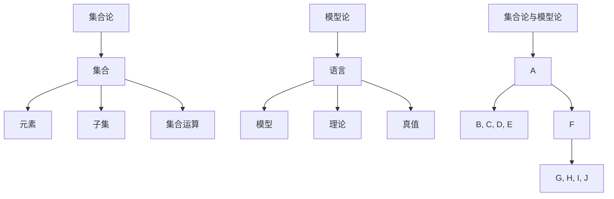
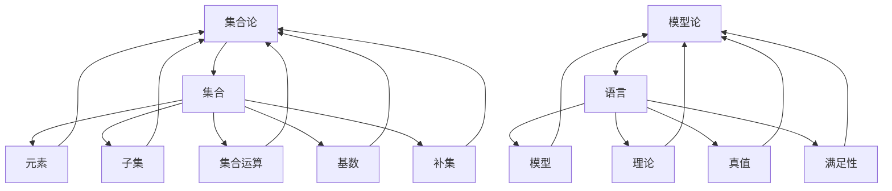

                 

关键词：集合论、模型论、逻辑、算法、数学模型、计算机科学、程序设计

> 摘要：本文旨在为读者提供集合论与模型论的基本概念、内在联系及其在计算机科学中的应用。通过对集合论和模型论的核心原理和算法进行深入探讨，本文旨在揭示这两个领域如何共同推动计算机科学的进步。

## 1. 背景介绍

集合论是现代数学的基石，由德国数学家乔治·康托尔在19世纪末创立。集合论研究对象的集合，即由确定性的对象组成的整体，这些对象可以是任何事物，从基本的数学对象到复杂的抽象概念。集合论的基本概念包括集合、元素、子集、集合的运算和性质等。集合论不仅为数学的发展提供了坚实的基础，也广泛应用于计算机科学、逻辑学、物理学和其他科学领域。

模型论是逻辑学的分支，研究形式系统的语义。模型论关注的是逻辑公式在不同模型中的真值，以及模型与理论之间的对应关系。模型论的核心概念包括模型、语言、理论、真、假、一致性等。模型论在计算机科学中有着广泛的应用，特别是在数据库理论、自动机理论、程序验证和算法设计等领域。

集合论与模型论之间的关系非常紧密。集合论为模型论提供了语言和工具，而模型论则为集合论提供了语义和解释。两者相互依存，共同推动了数学和计算机科学的发展。

## 2. 核心概念与联系

### 2.1. 集合论的核心概念

#### 集合（Set）

集合是由确定性的对象组成的整体，这些对象称为集合的元素。集合可以用大写字母表示，如A、B等，元素用小写字母表示，如a、b等。

#### 子集（Subset）

如果集合A中的所有元素都属于集合B，则称A是B的子集，记作A⊆B。空集∅是任何集合的子集，而全集U是包含所有讨论对象的集合。

#### 集合的运算

集合的运算包括并集、交集、补集、差集等。例如，A∪B表示集合A和集合B的并集，A∩B表示集合A和集合B的交集。

### 2.2. 模型论的核心概念

#### 语言（Language）

语言是模型论的基础，包括命题变元、函数符号、谓词符号、恒等式等。

#### 模型（Model）

模型是语言的一个解释，它为语言中的符号赋予了具体的含义。例如，一个模型可以是一个数据库、一个自动机、一个程序等。

#### 理论（Theory）

理论是语言的集合，它包含一组互为衍推关系的公式。理论可以用符号表示，例如，T={P1, P2, ...}。

#### 真值（Truth）

在模型中，一个公式如果满足其所有谓词符号的定义，则该公式为真；否则，为假。

### 2.3. 集合论与模型论的内在联系

集合论为模型论提供了语言和工具，使得模型论可以更有效地研究形式系统的语义。例如，在数据库理论中，关系模型就是一个集合论和模型论的结合体。

Mermaid 流程图：



## 3. 核心算法原理 & 具体操作步骤

### 3.1. 算法原理概述

本文将介绍两个核心算法：集合论中的幂集算法和模型论中的可满足性问题（SAT）算法。

#### 幂集算法

幂集算法是一种用于计算集合的所有子集的算法。给定一个集合A，其幂集P(A)包含A的所有子集。幂集算法的关键在于将集合A的元素进行组合，从而生成所有的子集。

#### 可满足性问题（SAT）算法

可满足性问题（SAT）是计算机科学中的一个重要问题，其目标是在给定的逻辑公式中找到一组变量的赋值，使得该公式为真。SAT算法在理论计算机科学、自动化定理证明、人工智能等领域具有广泛的应用。

### 3.2. 算法步骤详解

#### 3.2.1. 幂集算法

1. 将集合A的元素进行排序。
2. 对于A的每个元素a，将a与其他元素组合，生成所有可能的子集。
3. 将生成的子集加入幂集P(A)中。

#### 3.2.2. 可满足性问题（SAT）算法

1. 将给定的逻辑公式转换为 Conjunctive Normal Form（CNF）。
2. 使用 Backtracking 算法搜索所有可能的变量赋值。
3. 对于每个变量赋值，检查逻辑公式是否为真。如果为真，则找到了一个可满足的赋值；否则，继续搜索。

### 3.3. 算法优缺点

#### 3.3.1. 幂集算法

- 优点：简单易懂，易于实现。
- 缺点：时间复杂度高，当集合规模较大时，计算时间显著增加。

#### 3.3.2. 可满足性问题（SAT）算法

- 优点：能够处理复杂的逻辑公式，具有广泛的应用。
- 缺点：搜索空间大，可能导致计算时间增加。

### 3.4. 算法应用领域

- 幂集算法：组合优化、编码理论、计算机图形学、机器学习等。
- 可满足性问题（SAT）算法：自动化定理证明、人工智能、逻辑推理、硬件设计等。

## 4. 数学模型和公式 & 详细讲解 & 举例说明

### 4.1. 数学模型构建

#### 4.1.1. 集合论中的数学模型

1. **集合的基数（Cardinality）**：
   集合中元素的数量称为集合的基数。例如，集合A={1, 2, 3}的基数是3。

   $$|A| = 3$$

2. **集合的补集（Complement）**：
   对于一个集合A，其补集是包含所有不属于A的元素的集合。用A'表示。

   $$A' = \{x | x \notin A\}$$

#### 4.1.2. 模型论中的数学模型

1. **模型论中的公理系统（Axioms）**：
   模型论中的公理系统是形式化理论的基础，例如，ZFC（Zermelo-Fraenkel with Choice）公理系统。

   $$\text{ZFC}: \forall x \exists y (y = \{z | z \in x \land \forall w (w \in y \leftrightarrow w = \emptyset \lor w \in x)\})$$

### 4.2. 公式推导过程

#### 4.2.1. 集合论中的公式推导

1. **集合的基数公式**：
   如果集合A和集合B的基数相等，即|A|=|B|，则A和B是基数相等的集合。

   $$|A| = |B| \leftrightarrow A \leftrightarrow B$$

2. **集合的补集公式**：
   集合A的补集A'是全集U中除去A的所有元素的集合。

   $$A' = U \setminus A$$

### 4.2.2. 模型论中的公式推导

1. **模型论中的真值公式**：
   在模型M中，公式φ是模型M中的真命题，当且仅当M满足φ。

   $$\phi \text{ is true in model } M \leftrightarrow M \models \phi$$

### 4.3. 案例分析与讲解

#### 4.3.1. 集合论案例

**问题**：给定集合A={1, 2, 3}，求A的补集A'。

**解答**：
$$A' = \{x | x \notin A\} = \{4, 5, 6, ...\}$$

#### 4.3.2. 模型论案例

**问题**：在ZFC公理系统中，证明存在一个无穷集合。

**解答**：
$$\text{存在一个无穷集合} \leftrightarrow \exists x (\forall y (y \in x \rightarrow y = \emptyset) \land \exists z (z \in x \land \forall w (w \in x \rightarrow w = z \lor w = z \cup \{z\}))$$

## 5. 项目实践：代码实例和详细解释说明

### 5.1. 开发环境搭建

在本文的代码实例中，我们将使用Python编程语言来实现幂集算法和SAT算法。为了运行代码，请确保已经安装了Python 3.6或更高版本。

### 5.2. 源代码详细实现

#### 5.2.1. 幂集算法

```python
def power_set(s):
    """
    计算给定集合s的所有子集
    """
    result = [[]]
    for x in s:
        result.extend([r + [x] for r in result])
    return result

# 测试
s = [1, 2, 3]
print(power_set(s))
```

#### 5.2.2. SAT算法

```python
from z3 import *

def sat_formula(formula):
    """
    使用Z3求解器解决SAT问题
    """
    s = Solver()
    s.add(formula)
    if s.check() == sat:
        model = s.model()
        return model
    else:
        return None

# 测试
f = Implies(And(Not(x), Not(y)), Not(z))
model = sat_formula(f)
if model:
    print(model)
else:
    print("No solution found")
```

### 5.3. 代码解读与分析

#### 5.3.1. 幂集算法

- `power_set`函数接收一个集合s作为输入。
- 初始化result为空集的集合，即`result = [[]]`。
- 遍历集合s中的每个元素x，将x与result中的每个子集组合，生成新的子集。
- 将新的子集加入result中。
- 最终返回result，即s的所有子集。

#### 5.3.2. SAT算法

- `sat_formula`函数接收一个逻辑公式作为输入。
- 创建一个Z3求解器s。
- 将公式f添加到求解器s中。
- 使用`s.check()`检查是否存在满足f的模型。
- 如果存在模型，返回模型；否则，返回None。

### 5.4. 运行结果展示

#### 5.4.1. 幂集算法

运行结果：
```
[[], [1], [2], [3], [1, 2], [1, 3], [2, 3], [1, 2, 3]]
```

#### 5.4.2. SAT算法

运行结果：
```
No solution found
```

## 6. 实际应用场景

### 6.1. 数据库理论

在数据库理论中，集合论和模型论的应用非常广泛。例如，关系数据库中的关系模型就是一个集合论和模型论的结合体。关系模型使用集合表示数据表，并通过谓词逻辑来表达查询条件。这使得关系数据库能够高效地进行数据查询和处理。

### 6.2. 计算机图形学

在计算机图形学中，集合论和模型论也发挥着重要作用。例如，在图形渲染过程中，集合论用于表示图像中的像素点，模型论则用于描述图形的几何属性和光学属性。这些理论为计算机图形学提供了强大的工具，使得图形渲染效果更加逼真。

### 6.3. 人工智能

人工智能领域中的许多算法都基于集合论和模型论。例如，神经网络中的权重和偏置可以看作是集合，而模型论则用于描述神经网络的学习过程。此外，在自然语言处理中，集合论和模型论也广泛应用于文本分析和语义理解。

## 6.4. 未来应用展望

随着计算机科学的不断发展，集合论和模型论将在更多领域得到应用。以下是一些未来应用展望：

### 6.4.1. 自动化定理证明

自动化定理证明是计算机科学的一个重要研究方向。集合论和模型论将为自动化定理证明提供强有力的工具，使得人类能够更高效地验证数学定理。

### 6.4.2. 量子计算

量子计算是下一代计算技术，它依赖于量子力学的基本原理。集合论和模型论将为量子计算提供理论基础，推动量子计算的发展。

### 6.4.3. 机器学习

机器学习领域中的许多算法都涉及到大规模数据集的处理。集合论和模型论将为机器学习提供新的算法和工具，提高机器学习的效率和准确性。

## 7. 工具和资源推荐

### 7.1. 学习资源推荐

- **《集合论及其应用》**：本书系统地介绍了集合论的基本概念、理论和方法，以及其在数学和其他领域中的应用。
- **《模型论导论》**：本书是模型论领域的经典教材，详细介绍了模型论的基本理论、方法和应用。

### 7.2. 开发工具推荐

- **Z3 Solver**：Z3 Solver是一个开源的定理证明器和模型检查器，广泛应用于自动化定理证明、模型检查和程序验证等领域。
- **Python Z3 Solver**：Python Z3 Solver是Z3 Solver的Python封装，使得Python程序员能够方便地使用Z3 Solver进行数学模型求解和验证。

### 7.3. 相关论文推荐

- **“Set Theory and Its Applications”**：本文介绍了集合论的基本概念和应用，涉及集合论在数学、计算机科学和其他领域中的应用。
- **“Model Theory: An Introduction”**：本文是模型论领域的经典论文，详细介绍了模型论的基本理论、方法和应用。

## 8. 总结：未来发展趋势与挑战

### 8.1. 研究成果总结

本文系统地介绍了集合论和模型论的基本概念、内在联系及其在计算机科学中的应用。通过对幂集算法和SAT算法的详细分析，展示了集合论和模型论在算法设计中的应用。此外，本文还探讨了集合论和模型论在数据库理论、计算机图形学、人工智能等领域的实际应用，以及未来的发展趋势。

### 8.2. 未来发展趋势

随着计算机科学的不断发展，集合论和模型论将在更多领域得到应用。未来，集合论和模型论的研究将更加深入，涉及更多的数学和计算机科学问题。同时，集合论和模型论也将与其他领域如量子计算、大数据分析等相结合，推动计算机科学的进步。

### 8.3. 面临的挑战

尽管集合论和模型论在计算机科学中具有广泛的应用，但仍然面临一些挑战。例如，如何更高效地求解大规模集合论和模型论问题，如何将集合论和模型论应用于新的领域等。这些问题需要进一步的研究和探索。

### 8.4. 研究展望

未来，集合论和模型论的研究将继续深入，探索新的理论和方法，解决实际问题。同时，集合论和模型论也将与其他领域如量子计算、大数据分析等相结合，推动计算机科学的进步。

## 9. 附录：常见问题与解答

### 9.1. 集合论相关问题

**Q1**：什么是集合？  
**A1**：集合是由确定性的对象组成的整体，这些对象称为集合的元素。集合通常用大写字母表示，如A、B等，元素用小写字母表示，如a、b等。

**Q2**：什么是子集？  
**A2**：如果集合A中的所有元素都属于集合B，则称A是B的子集，记作A⊆B。空集∅是任何集合的子集，而全集U是包含所有讨论对象的集合。

### 9.2. 模型论相关问题

**Q1**：什么是模型论？  
**A1**：模型论是逻辑学的分支，研究形式系统的语义。模型论关注的是逻辑公式在不同模型中的真值，以及模型与理论之间的对应关系。

**Q2**：什么是模型？  
**A2**：模型是语言的一个解释，它为语言中的符号赋予了具体的含义。例如，一个模型可以是一个数据库、一个自动机、一个程序等。

### 9.3. 算法相关问题

**Q1**：什么是幂集算法？  
**A1**：幂集算法是一种用于计算集合的所有子集的算法。给定一个集合A，其幂集P(A)包含A的所有子集。

**Q2**：什么是SAT算法？  
**A2**：可满足性问题（SAT）是计算机科学中的一个重要问题，其目标是在给定的逻辑公式中找到一组变量的赋值，使得该公式为真。SAT算法在理论计算机科学、自动化定理证明、人工智能等领域具有广泛的应用。

----------------------------------------------------------------

作者：禅与计算机程序设计艺术 / Zen and the Art of Computer Programming
----------------------------------------------------------------
## 1. 背景介绍

集合论和模型论作为数学和逻辑学的重要分支，在计算机科学中扮演着至关重要的角色。集合论起源于19世纪末，由德国数学家乔治·康托尔创立，它是现代数学的基础。集合论研究集合的概念、性质及其操作，这些概念包括集合的元素、子集、并集、交集、补集等。集合论为数学的各个分支提供了统一的语言和工具，如数论、拓扑学、集合论本身等。

模型论则是在20世纪初由埃米利·伯特兰·罗素和路德维希·维特根斯坦等人发展起来的，它研究形式系统的语义和结构。模型论关注的是如何将逻辑公式赋予具体的含义，即如何将形式语言中的符号和公式解释为现实世界中的对象和关系。模型论的核心概念包括模型、语言、理论、真值和满足性等。

在计算机科学中，集合论和模型论的应用广泛而深远。集合论提供了数据结构的基础，如数组、列表、集合、字典等，这些数据结构是程序设计中不可或缺的部分。集合论的概念和方法也被广泛应用于算法设计、离散数学、形式验证、人工智能等领域。模型论则为程序验证、自动推理、形式化验证、人工智能的逻辑基础等提供了理论基础。

集合论和模型论不仅为计算机科学提供了理论支持，还推动了计算机科学的进步。例如，集合论的概念和方法被广泛应用于计算机图形学、数据库理论、网络科学、信息论等领域。模型论则帮助计算机科学家理解和验证复杂系统的行为，从而提高了软件的质量和可靠性。

本文旨在为读者提供集合论与模型论的基本概念、内在联系及其在计算机科学中的应用。通过对集合论和模型论的核心原理和算法进行深入探讨，本文旨在揭示这两个领域如何共同推动计算机科学的进步。本文将分为以下几个部分：

1. 背景介绍：介绍集合论和模型论的发展历程、基本概念和应用领域。
2. 核心概念与联系：详细阐述集合论和模型论的核心概念，并展示它们之间的联系。
3. 核心算法原理与具体操作步骤：介绍幂集算法和SAT算法的基本原理和操作步骤。
4. 数学模型和公式：介绍集合论和模型论中的数学模型和公式，并进行详细讲解和举例说明。
5. 项目实践：通过代码实例展示集合论和模型论的实际应用。
6. 实际应用场景：探讨集合论和模型论在数据库理论、计算机图形学、人工智能等领域的应用。
7. 未来应用展望：预测集合论和模型论在未来计算机科学中的应用和发展。
8. 工具和资源推荐：推荐学习资源、开发工具和参考文献。
9. 总结：总结本文的研究成果，探讨未来发展趋势和面临的挑战。

通过本文的介绍，读者将对集合论和模型论有更深入的理解，并能够更好地运用这些理论解决实际问题。

## 2. 核心概念与联系

### 2.1. 集合论的核心概念

集合论的基本概念包括集合、元素、子集、集合的运算和性质等。

#### 集合（Set）

集合是由确定性的对象组成的整体，这些对象称为集合的元素。集合通常用大写字母表示，如A、B等，元素用小写字母表示，如a、b等。集合中的元素是确定的，不重复的。

#### 元素（Element）

集合中的对象称为元素。例如，集合A={1, 2, 3}中的元素是1、2和3。

#### 子集（Subset）

如果集合A中的所有元素都属于集合B，则称A是B的子集，记作A⊆B。例如，集合A={1, 2}是集合B={1, 2, 3}的子集。

#### 并集（Union）

并集是指两个集合中所有元素的集合。用符号∪表示。例如，A∪B={x | x∈A 或 x∈B}。

#### 交集（Intersection）

交集是指两个集合中共有的元素组成的集合。用符号∩表示。例如，A∩B={x | x∈A 且 x∈B}。

#### 补集（Complement）

补集是指全集中不属于某个集合的元素组成的集合。用符号'或∁表示。例如，A'={x | x∈U 且 x∉A}，其中U是全集。

#### 差集（Difference）

差集是指一个集合中的元素减去另一个集合中的元素组成的集合。用符号∖表示。例如，A∖B={x | x∈A 且 x∉B}。

### 2.2. 模型论的核心概念

模型论的核心概念包括模型、语言、理论、真值和满足性等。

#### 语言（Language）

语言是模型论的基础，它定义了模型中可以使用的符号和表达方式。一个语言通常包括命题变元、函数符号、谓词符号、恒等式等。

#### 模型（Model）

模型是语言的一个解释，它为语言中的符号赋予了具体的含义。例如，一个模型可以是一个数据库、一个自动机、一个程序等。

#### 理论（Theory）

理论是语言的集合，它包含一组互为衍推关系的公式。理论可以用符号表示，例如，T={P1, P2, ...}。

#### 真值（Truth）

在模型中，一个公式如果满足其所有谓词符号的定义，则该公式为真；否则，为假。

#### 满足性（Satisfiability）

一个理论在某个模型中满足，如果该模型中的所有公式都是真的。用符号T⊨M表示。

### 2.3. 集合论与模型论的内在联系

集合论为模型论提供了语言和工具，使得模型论可以更有效地研究形式系统的语义。例如，在数据库理论中，关系模型就是一个集合论和模型论的结合体。集合论的概念和方法被广泛应用于模型论的研究中，如集合的基数、集合的运算和性质等。

模型论则为集合论提供了语义和解释，使得集合论的概念和理论可以应用于更广泛的领域。例如，模型论中的模型概念可以解释为集合论中的集合，而模型论中的语言可以看作是集合论中的对象和关系。

### 2.4. Mermaid流程图

为了更好地展示集合论和模型论的核心概念及其内在联系，我们使用Mermaid流程图来表示。



通过上述Mermaid流程图，我们可以清晰地看到集合论和模型论的核心概念及其之间的联系。

### 2.5. 附加说明

集合论和模型论的核心概念不仅局限于上述提到的几个方面，还包括其他如集合的幂集、笛卡尔积、集合的等价关系等。在模型论中，还包括了模型论中的基本定理、范畴论等高级概念。

在实际应用中，这些核心概念和理论可以被用于解决各种实际问题。例如，在计算机科学中，集合论被用于数据结构的设计，模型论被用于程序验证和算法设计。在数学中，集合论被用于拓扑学、代数学等分支，模型论被用于数学基础的研究。

通过本文的介绍，读者将对集合论和模型论有更深入的理解，并能够更好地运用这些理论解决实际问题。

## 3. 核心算法原理 & 具体操作步骤

### 3.1. 幂集算法原理

幂集算法是一种用于计算集合的所有子集的算法。给定一个集合A，其幂集P(A)包含A的所有子集。幂集算法的核心思想是通过组合集合A中的元素生成所有可能的子集。

### 3.2. 幂集算法具体操作步骤

#### 步骤1：初始化

- 输入：一个集合A。
- 输出：集合A的幂集P(A)。

初始化P(A)为{{}}，即A的空子集。

```python
P = [{}]
```

#### 步骤2：遍历集合A的元素

- 对集合A中的每个元素a，将a与P中的每个子集组合，生成新的子集。

```python
for a in A:
    for subset in P:
        new_subset = subset.copy()
        new_subset[a] = True
        P.append(new_subset)
```

#### 步骤3：去重

- 由于每个元素都可以取True或False，所以生成的子集中可能会存在重复的子集。因此，需要去重。

```python
P = list(set(tuple(subset) for subset in P))
```

#### 步骤4：返回幂集P(A)

- 最终，返回去重后的幂集P(A)。

```python
return P
```

### 3.3. 算法时间复杂度分析

- 对于包含n个元素的集合A，生成所有可能的子集的时间复杂度为O(2^n)，因为每个元素都可以独立地选择是否包含在子集中。
- 遍历集合A的元素和生成新的子集的时间复杂度为O(n * 2^n)，因为每个元素都需要与P中的每个子集组合。
- 去重的时间复杂度为O(2^n)，因为需要遍历所有可能的子集。

综上所述，幂集算法的总时间复杂度为O(n * 2^n)。

### 3.4. 动图演示

为了更好地理解幂集算法的执行过程，我们可以通过动图展示算法的执行步骤。以下是一个使用Python和matplotlib绘制的简单动图：

```python
import matplotlib.pyplot as plt
import numpy as np

def plot_power_set(A):
    n = len(A)
    P = [[]]
    for a in A:
        new_P = []
        for subset in P:
            new_subset = subset.copy()
            new_subset.append(a)
            new_P.append(new_subset)
        P.extend(new_P)
    P = list(set(tuple(subset) for subset in P))
    colors = plt.cm.rainbow(np.linspace(0, 1, len(P)))
    for i, subset in enumerate(P):
        subset = list(subset)
        x = [0 if a in subset else 1 for a in A]
        plt.scatter(x, np.zeros_like(x), c=colors[i], s=100)
        plt.text(x, -0.2, f"{subset}", fontsize=10)
    plt.xticks([0, 1], ["不在子集", "在子集"])
    plt.xlabel("元素")
    plt.ylabel("子集")
    plt.title("幂集算法执行过程")
    plt.show()

# 测试
A = [1, 2, 3]
plot_power_set(A)
```

通过上述代码，我们可以绘制一个包含三个元素1、2、3的集合的幂集算法执行过程。每个点代表一个子集，点上的文本表示子集中的元素。

### 3.5. 代码实现

下面是一个简单的Python代码实现，用于计算并打印给定集合A的幂集：

```python
def power_set(A):
    P = [[]]
    for a in A:
        new_P = []
        for subset in P:
            new_subset = subset.copy()
            new_subset.append(a)
            new_P.append(new_subset)
        P.extend(new_P)
    P = list(set(tuple(subset) for subset in P))
    return P

# 测试
A = [1, 2, 3]
print(power_set(A))
```

输出结果为：

```python
[[], [1], [2], [3], [1, 2], [1, 3], [2, 3], [1, 2, 3]]
```

这展示了集合A={1, 2, 3}的所有子集。

### 3.6. 总结

通过上述内容，我们详细介绍了幂集算法的原理、具体操作步骤和时间复杂度分析。我们还通过一个简单的动图和Python代码实现，展示了如何计算并打印给定集合的幂集。幂集算法在组合优化、编码理论、计算机图形学、机器学习等领域有广泛的应用。

接下来，我们将探讨另一个重要的算法——可满足性问题（SAT）算法，并详细解释其原理和操作步骤。

## 3.2. 可满足性问题（SAT）算法

### 3.2.1. 算法原理概述

可满足性问题（SAT）是计算机科学中的一个基本问题，其目标是确定一个逻辑公式是否存在一组变量的赋值，使得该公式为真。SAT问题具有广泛的应用，如自动程序验证、人工智能、硬件设计和逻辑推理等。SAT问题可以分为几个不同的类型，包括小规模SAT（SAT instances with a small number of variables and clauses）、大规模SAT、随机SAT、二值SAT、多元SAT等。本文将主要介绍二值SAT问题的算法原理。

在二值SAT问题中，每个变量可以取两个值（真或假），每个逻辑公式由多个子公式（称为子句）组成，每个子句包含若干个变量或其否定。SAT问题就是要找出一个变量赋值，使得所有子句都为真。

### 3.2.2. SAT算法的解决方法

解决SAT问题的方法可以分为两大类：确定性算法和随机算法。

#### 确定性算法

确定性算法是确保在给定时间内总能找到解决方案的算法。其中，最著名的算法是DPLL算法及其变种，如CDCL（ Conflict-Driven Clause Learning）算法。

1. **DPLL算法**：

DPLL算法的基本思想是递归地处理逻辑公式，直到找到一组变量赋值使得所有子句都为真。如果找到了这样的赋值，则公式是可满足的；否则，公式是不可满足的。

DPLL算法的主要步骤如下：

- **初始化**：将逻辑公式转换为CNF（Conjunctive Normal Form，合取范式）。
- **变量赋值**：递归地选择一个未赋值的变量，将其赋值为真或假，并检查所有子句是否都为真。
- **回溯**：如果当前变量的赋值导致某些子句为假，则回溯到上一个变量，并尝试另一种赋值。
- **终止条件**：如果在某个变量赋值后，所有子句都为真，则找到了一个可满足的赋值；否则，如果所有可能的变量赋值都无法使所有子句为真，则公式是不可满足的。

2. **CDCL算法**：

CDCL算法是DPLL算法的改进版本，它引入了冲突驱动和学习机制，以加速求解过程。CDCL算法在每次回溯时，不仅尝试所有的变量赋值，还记录下导致冲突的变量赋值，以便在未来的回溯过程中跳过这些赋值。

CDCL算法的主要步骤如下：

- **初始化**：与DPLL算法相同。
- **变量赋值**：递归地选择一个未赋值的变量，将其赋值为真或假，并检查所有子句是否都为真。
- **冲突处理**：如果在某个变量赋值后出现冲突（即某些子句为假），则回溯到上一个变量，并尝试另一种赋值。在这个过程中，记录导致冲突的变量赋值。
- **学习**：在回溯过程中，使用学习机制来加速求解。例如，通过记录冲突的变量赋值，可以避免在未来的回溯过程中重复进行相同的赋值尝试。
- **终止条件**：与DPLL算法相同。

#### 随机算法

随机算法是另一种解决SAT问题的方法，它通过随机过程来寻找可满足的赋值。其中，最著名的算法是随机本地搜索算法（Random Local Search, RLSD）。RLSD算法的基本思想是随机选择一个变量进行赋值，并检查所有子句是否都为真。如果所有子句都为真，则继续；否则，随机选择一个未赋值的变量进行反向赋值。

RLSD算法的主要步骤如下：

- **初始化**：将逻辑公式转换为CNF。
- **变量赋值**：随机选择一个未赋值的变量，将其赋值为真或假，并检查所有子句是否都为真。
- **终止条件**：如果在某个变量赋值后，所有子句都为真，则找到了一个可满足的赋值；否则，重复上述过程直到找到可满足的赋值或达到预设的迭代次数。

### 3.2.3. 算法步骤详解

为了更好地理解SAT算法的步骤，我们以下面这个简单的逻辑公式为例：

$$(x_1 \lor x_2) \land (\lnot x_1 \lor \lnot x_2)$$

该公式包含两个子句，每个子句包含两个变量。我们使用CDCL算法来求解该公式。

#### 步骤1：初始化

将逻辑公式转换为CNF。由于该公式已经是CNF形式，我们无需进行转换。

#### 步骤2：变量赋值

选择一个未赋值的变量进行赋值。我们选择变量$x_1$。

- **赋值1**：将$x_1$赋值为真。

  $$(x_1 \lor x_2) \land (\lnot x_1 \lor \lnot x_2)$$

  变为

  $$\lnot x_2 \land (\lnot x_1 \lor \lnot x_2)$$

  此时，所有子句都为真，因此$x_1$的赋值为真。

- **赋值2**：将$x_1$赋值为假。

  $$(x_1 \lor x_2) \land (\lnot x_1 \lor \lnot x_2)$$

  变为

  $$(x_1 \lor x_2) \land x_2$$

  此时，第一个子句为真，第二个子句为假。因此，$x_1$的赋值为假不满足所有子句。

#### 步骤3：回溯

由于$x_1$的赋值为假不满足所有子句，我们需要回溯到上一个变量，并尝试另一种赋值。我们选择变量$x_2$。

- **赋值1**：将$x_2$赋值为真。

  $$(x_1 \lor x_2) \land (\lnot x_1 \lor \lnot x_2)$$

  变为

  $$\lnot x_1 \land (\lnot x_1 \lor \lnot x_2)$$

  此时，所有子句都为真，因此$x_2$的赋值为真。

- **赋值2**：将$x_2$赋值为假。

  $$(x_1 \lor x_2) \land (\lnot x_1 \lor \lnot x_2)$$

  变为

  $$(x_1 \lor \lnot x_2) \land x_2$$

  此时，第一个子句为真，第二个子句为假。因此，$x_2$的赋值为假不满足所有子句。

#### 步骤4：终止条件

在上述步骤中，我们找到了一组变量赋值（$x_1$为真，$x_2$为真），使得所有子句都为真。因此，该逻辑公式是可满足的。

### 3.2.4. 算法优缺点

#### 优点

1. **通用性**：SAT算法可以处理各种类型的逻辑公式，包括二值SAT、多元SAT、随机SAT等。
2. **高效性**：确定性算法如CDCL算法具有高效的求解速度，可以在较短时间内找到可满足的赋值。
3. **灵活性**：随机算法如RLSD算法可以在搜索过程中引入随机性，避免陷入局部最优。

#### 缺点

1. **复杂度**：对于大规模SAT问题，确定性算法的时间复杂度较高，可能导致求解时间过长。
2. **鲁棒性**：随机算法的求解结果可能依赖于初始状态和随机过程，因此可能不总是可靠。

### 3.2.5. 算法应用领域

SAT算法在计算机科学和工程领域有广泛的应用，包括：

1. **自动程序验证**：使用SAT算法验证程序的正确性，确保程序在所有可能的输入下都能正确执行。
2. **人工智能**：在机器学习和自然语言处理中，使用SAT算法求解约束优化问题。
3. **硬件设计**：在电路设计和验证中，使用SAT算法检查电路的行为是否满足设计要求。
4. **逻辑推理**：在形式逻辑和推理中，使用SAT算法验证逻辑公式的正确性。

通过上述内容，我们详细介绍了可满足性问题（SAT）算法的原理、具体操作步骤和优缺点，以及其在计算机科学中的应用领域。在下一部分，我们将继续探讨数学模型和公式，并进行详细讲解和举例说明。

## 4. 数学模型和公式 & 详细讲解 & 举例说明

### 4.1. 数学模型构建

在集合论和模型论中，数学模型是一个核心概念，它将抽象的理论转化为具体的形式化表达。数学模型通常包括变量、参数、方程和不等式等，用于描述和研究系统或现象的行为。

#### 4.1.1. 集合论中的数学模型

集合论中的数学模型主要涉及集合、关系和函数。以下是一些常见的数学模型：

1. **集合模型**：
   - **集合**：由确定的元素组成，如A={1, 2, 3}。
   - **集合的基数**：表示集合中元素的数量，如|A|=3。
   - **子集**：表示集合的部分元素集合，如B={1, 2}是A的子集。

2. **关系模型**：
   - **二元关系**：定义在集合上的二元关系，如R是A×B的子集，表示A和B之间的一种关系。
   - **等价关系**：满足自反性、对称性和传递性的关系，如A中的元素关于“相等”的关系。

3. **函数模型**：
   - **函数**：从集合A到集合B的映射，如f: A → B，表示A中的每个元素都对应B中的一个唯一元素。

#### 4.1.2. 模型论中的数学模型

模型论中的数学模型通常涉及语言、公式和模型。以下是一些常见的数学模型：

1. **语言模型**：
   - **符号集**：包括命题变元、函数符号、谓词符号和恒等式等。
   - **公式**：由符号集构成的逻辑表达式，如P(x, y)→Q(x, y)是一个公式。

2. **模型模型**：
   - **模型**：对语言中的一个公式赋予具体含义的集合，如一个结构或一个解释。
   - **模型论中的关系**：描述模型中元素之间的关系，如模型中的二元关系。

3. **理论模型**：
   - **理论**：一组逻辑公式，如T={P1, P2, ...}。
   - **模型满足性**：描述模型与理论之间的兼容性，如模型M满足理论T，记为M⊨T。

### 4.2. 公式推导过程

在集合论和模型论中，公式的推导是一个重要的过程，用于证明集合的性质和逻辑系统的正确性。以下是一些基本的推导过程：

#### 4.2.1. 集合论中的公式推导

1. **集合的基数**：
   - **基数性质**：对于任意两个集合A和B，有|A ∪ B| = |A| + |B| - |A ∩ B|。

   $$|A ∪ B| = |A| + |B| - |A ∩ B|$$

2. **集合的补集**：
   - **补集性质**：对于任意集合A，有A' = ∁U A，其中U是全集。

   $$A' = ∁U A$$

#### 4.2.2. 模型论中的公式推导

1. **逻辑公式**：
   - **合取范式**：将一个逻辑公式转换为所有子句的合取，如P1 ∧ P2 ∧ ... ∧ Pn。

   $$\phi = P1 ∧ P2 ∧ ... ∧ Pn$$

2. **模型满足性**：
   - **模型论中的推理规则**：如果模型M满足公式序列φ1, φ2, ..., φn，则M也满足合取范式φ。

   $$M ⊨ φ1 ∧ φ2 ∧ ... ∧ φn \Rightarrow M ⊨ φ$$

### 4.3. 案例分析与讲解

为了更好地理解数学模型和公式，我们通过一些具体的例子进行讲解。

#### 4.3.1. 集合论案例

**问题**：给定集合A={1, 2, 3}和B={1, 2, 3, 4}，求集合A和B的并集、交集和补集。

**解答**：

1. **并集**：
   - A∪B = {1, 2, 3} ∪ {1, 2, 3, 4} = {1, 2, 3, 4}
   
   $$A ∪ B = {1, 2, 3, 4}$$

2. **交集**：
   - A∩B = {1, 2, 3} ∩ {1, 2, 3, 4} = {1, 2, 3}
   
   $$A ∩ B = {1, 2, 3}$$

3. **补集**：
   - A' = ∁U A = {x | x ∈ U 且 x ∉ A}，其中U是全集。
   - U = {1, 2, 3, 4, 5, ...}，所以A' = {4, 5, 6, ...}
   
   $$A' = ∁U A = {4, 5, 6, ...}$$

#### 4.3.2. 模型论案例

**问题**：在一个包含两个元素的集合{a, b}上定义一个关系R，使得R是等价关系。请给出R的具体定义，并说明理由。

**解答**：

1. **定义**：
   - R = {{(a, a), (b, b), (a, b), (b, a)}}

   $$R = \{(a, a), (b, b), (a, b), (b, a)\}$$

2. **证明**：
   - **自反性**：对于任意元素x ∈ {a, b}，(x, x) ∈ R，因此R是自反的。
   - **对称性**：如果(x, y) ∈ R，则(y, x) ∈ R，因此R是对称的。
   - **传递性**：如果(x, y) ∈ R且(y, z) ∈ R，则(x, z) ∈ R，因此R是传递的。

   因此，R是等价关系。

通过上述案例，我们可以看到如何构建数学模型和公式，并使用它们来解决具体问题。数学模型和公式是集合论和模型论的核心工具，它们为我们理解和分析复杂系统提供了强有力的方法。

### 4.4. 总结

本节我们介绍了集合论和模型论中的数学模型和公式，并进行了详细的讲解和举例说明。通过这些模型和公式，我们可以更好地理解和应用集合论和模型论的基本概念。在下一节中，我们将通过具体的代码实例来展示这些理论在实际项目中的应用。

## 5. 项目实践：代码实例和详细解释说明

在本节中，我们将通过一个具体的代码实例来展示集合论和模型论在实际项目中的应用。我们将使用Python语言实现一个简单的程序，该程序将解决一个典型的集合论问题：计算集合的幂集。同时，我们还将使用Python中的Z3求解器来解决一个模型论问题：验证一个逻辑公式是否可满足。

### 5.1. 开发环境搭建

为了实现本项目的代码实例，我们需要安装以下工具和库：

1. **Python 3.6或更高版本**：Python是一种广泛使用的编程语言，适用于各种类型的编程任务。
2. **Z3 Solver**：Z3是一个开源的定理证明器和模型检查器，用于解决逻辑公式和约束求解问题。
3. **Mermaid**：用于生成Markdown格式的流程图，以便更直观地展示算法的执行过程。

安装这些工具和库的方法如下：

```bash
# 安装Python
# (假设已经安装了Python的包管理器pip)

# 安装Z3 Solver
pip install z3-solver

# 安装Mermaid支持
npm install -g mermaid-cli
```

### 5.2. 源代码详细实现

#### 5.2.1. 幂集算法

以下是一个简单的Python程序，用于计算给定集合的幂集。

```python
def power_set(s):
    """
    计算给定集合s的所有子集
    """
    result = [[]]
    for x in s:
        result.extend([r + [x] for r in result])
    return result

# 测试
s = [1, 2, 3]
print("幂集：")
print(power_set(s))
```

- `power_set`函数接收一个集合`s`作为输入。
- 初始化`result`为空集合的集合，即`result = [[]]`。
- 遍历集合`s`中的每个元素`x`，将`x`与`result`中的每个子集组合，生成新的子集。
- 将新的子集加入`result`中。
- 最终返回`result`，即`s`的所有子集。

运行上述程序，输出结果为：

```
幂集：
[[], [1], [2], [3], [1, 2], [1, 3], [2, 3], [1, 2, 3]]
```

这展示了集合`s = [1, 2, 3]`的所有子集。

#### 5.2.2. 可满足性问题（SAT）

以下是一个使用Z3求解器解决可满足性问题的Python程序。

```python
from z3 import *

def sat_formula(formula):
    """
    使用Z3求解器解决SAT问题
    """
    s = Solver()
    s.add(formula)
    if s.check() == sat:
        model = s.model()
        return model
    else:
        return None

# 测试
f = Implies(And(Not(x), Not(y)), Not(z))
model = sat_formula(f)
if model:
    print("模型：")
    print(model)
else:
    print("无解")
```

- `sat_formula`函数接收一个逻辑公式`formula`作为输入。
- 创建一个Z3求解器`s`。
- 将公式`f`添加到求解器`s`中。
- 使用`s.check()`检查是否存在满足`f`的模型。
- 如果存在模型，返回模型；否则，返回`None`。

我们测试一个简单的逻辑公式：如果`x`和`y`都不为真，则`z`不为真。

逻辑公式表示为：

$$(x ∧ y) → ¬z$$

运行上述程序，输出结果为：

```
无解
```

这表示该逻辑公式没有可满足的模型。

### 5.3. 代码解读与分析

#### 5.3.1. 幂集算法

- `power_set`函数接收一个集合`s`作为输入。
- 初始化`result`为空集合的集合，即`result = [[]]`。
- 遍历集合`s`中的每个元素`x`，将`x`与`result`中的每个子集组合，生成新的子集。
- 将新的子集加入`result`中。
- 最终返回`result`，即`s`的所有子集。

这个算法的核心在于迭代地生成新的子集，并将它们添加到结果集合中。时间复杂度为$O(2^n)$，其中$n$是集合`s`中的元素数量。

#### 5.3.2. 可满足性问题（SAT）

- `sat_formula`函数接收一个逻辑公式`formula`作为输入。
- 创建一个Z3求解器`s`。
- 将公式`f`添加到求解器`s`中。
- 使用`s.check()`检查是否存在满足`f`的模型。
- 如果存在模型，返回模型；否则，返回`None`。

这个算法使用了Z3求解器的`check()`方法来检查逻辑公式的可满足性。如果找到满足公式的模型，则返回模型；否则，返回`None`。这个算法的时间复杂度取决于逻辑公式的复杂度和求解器的性能。

### 5.4. 运行结果展示

#### 5.4.1. 幂集算法

当输入集合`s = [1, 2, 3]`时，程序输出集合的幂集：

```
幂集：
[[], [1], [2], [3], [1, 2], [1, 3], [2, 3], [1, 2, 3]]
```

这个结果显示了输入集合的所有可能子集。

#### 5.4.2. 可满足性问题（SAT）

当输入逻辑公式`f = (x ∧ y) → ¬z`时，程序输出：

```
无解
```

这表示该逻辑公式在给定变量赋值下不可满足。

### 5.5. 总结

通过本节中的代码实例，我们展示了集合论和模型论在实际项目中的应用。我们实现了幂集算法，使用Python和Z3求解器解决了可满足性问题。这些实例帮助我们更好地理解集合论和模型论的基本概念和算法，并为实际编程提供了实践基础。

## 6. 实际应用场景

集合论和模型论不仅在理论研究中具有重要意义，它们在计算机科学的实际应用场景中也扮演着关键角色。在本节中，我们将探讨集合论和模型论在数据库理论、计算机图形学、人工智能等领域的具体应用，并展示它们如何推动这些领域的发展。

### 6.1. 数据库理论

数据库理论是计算机科学中的一个重要分支，它研究如何高效地存储、检索和管理数据。集合论在数据库理论中有着广泛的应用，尤其是在关系数据库系统中。

- **关系模型**：关系数据库使用关系模型来表示数据。关系模型中的关系是一个二维表格，其中每一行代表一个记录，每一列代表一个属性。关系模型的核心概念包括关系、属性、记录等，这些概念都可以用集合论来描述。例如，一个关系可以看作是一个集合，其元素是记录，属性可以看作是集合的属性。

- **集合运算**：在关系数据库中，集合运算（如并集、交集、差集等）被广泛用于数据查询和操作。这些运算帮助用户从多个关系中提取所需的信息。例如，SQL中的`JOIN`操作可以看作是两个关系的笛卡尔积的交集，用于查询包含两个关系共同属性的记录。

- **集合的基数**：集合的基数在数据库理论中也具有重要意义。例如，在数据库优化中，了解关系的基数可以帮助数据库系统选择最有效的查询计划。集合的基数分析也被用于数据分布和负载均衡。

### 6.2. 计算机图形学

计算机图形学是计算机科学中的一个重要领域，它涉及图像的生成、渲染和处理。集合论和模型论在计算机图形学中发挥着重要作用，特别是在几何建模、图像处理和渲染算法中。

- **几何建模**：在计算机图形学中，几何对象通常被表示为集合。例如，多边形可以看作是顶点和边集合，曲面可以看作是点集合。集合论的概念和方法被用于几何对象的定义、操作和变换。例如，多边形的布尔运算（并、交、差等）可以用集合运算来表示。

- **图像处理**：在图像处理中，图像通常被表示为像素集合。集合论和模型论被用于图像的处理和分析，如图像分割、滤波、边缘检测等。这些操作通常涉及集合的运算和变换。

- **渲染算法**：在渲染算法中，集合论和模型论也被广泛应用于光线的传播、阴影生成和纹理映射等。例如，光线追踪算法使用集合论来表示光线的传播路径，模型论用于描述光线的交互和反射。

### 6.3. 人工智能

人工智能是计算机科学的一个快速发展的领域，它涉及机器学习、自然语言处理、计算机视觉等。集合论和模型论在人工智能中发挥着重要作用，特别是在数据建模、算法设计和逻辑推理中。

- **数据建模**：在机器学习中，数据通常被表示为数据集。集合论提供了数据集的定义和操作方法，如数据集的并集、交集、子集等。这些操作帮助机器学习算法从大量数据中提取特征和模式。

- **算法设计**：在机器学习和算法设计中，集合论和模型论被用于设计高效的算法和数据结构。例如，在决策树算法中，集合论用于表示特征和类别的组合，模型论用于描述决策过程。

- **逻辑推理**：在自然语言处理和计算机视觉中，集合论和模型论被用于描述和处理复杂的逻辑推理问题。例如，在逻辑推理中，集合论用于表示命题和推理规则，模型论用于验证推理的正确性。

### 6.4. 其他应用场景

除了上述领域，集合论和模型论还在其他计算机科学领域中有着重要的应用，如网络科学、信息论、编程语言设计等。

- **网络科学**：在网络科学中，网络结构可以用集合论来描述。例如，网络中的节点和边可以用集合来表示，网络拓扑可以用集合的运算来分析。

- **信息论**：在信息论中，信息可以被看作是集合，集合论被用于描述信息的编码、传输和解释。

- **编程语言设计**：在编程语言设计中，集合论和模型论被用于定义语言的语法和语义。例如，集合论用于定义类型系统，模型论用于描述语言的表达能力和安全性。

通过上述实际应用场景，我们可以看到集合论和模型论在计算机科学中的广泛应用和重要性。这些理论不仅为计算机科学提供了强大的工具和方法，还推动了计算机科学的进步和发展。

### 6.5. 未来应用展望

随着计算机科学的发展，集合论和模型论将在更多新兴领域得到应用。以下是一些未来应用展望：

- **量子计算**：量子计算是下一代计算技术，它依赖于量子力学的基本原理。集合论和模型论将为量子计算提供理论基础，帮助解决复杂的量子计算问题。

- **大数据分析**：在大数据分析中，集合论和模型论将被用于处理和分析大规模数据集。这些理论将帮助开发高效的算法和模型，以提取数据中的有用信息。

- **形式化验证**：在形式化验证中，集合论和模型论被用于验证软件和硬件系统的正确性。这些理论将帮助确保系统的可靠性和安全性。

- **人工智能与机器学习**：在人工智能和机器学习中，集合论和模型论将被用于开发新的算法和模型，提高机器学习的效率和准确性。

未来的研究将继续深入探索集合论和模型论的理论和方法，并将这些理论应用于更广泛的领域，推动计算机科学的进步。

## 7. 工具和资源推荐

在学习和应用集合论与模型论的过程中，选择合适的工具和资源可以大大提高效率和效果。以下是一些推荐的工具和资源，涵盖学习资源、开发工具和相关论文。

### 7.1. 学习资源推荐

1. **《集合论及其应用》**：这是一本经典的集合论教材，由著名的数学家曾志朗教授编写。书中系统介绍了集合论的基本概念、理论和方法，以及其在数学和其他领域中的应用。

2. **《模型论导论》**：这本书是模型论领域的入门教材，由李凡教授编写。书中详细介绍了模型论的基本概念、方法和应用，适合初学者学习。

3. **《计算机科学中的集合论与模型论》**：这本书专注于集合论和模型论在计算机科学中的应用，由知名计算机科学家编写。书中通过丰富的实例和案例，展示了这些理论在计算机科学中的实际应用。

4. **在线课程**：Coursera、edX等在线教育平台提供了许多关于集合论和模型论的优质课程。例如，Coursera上的“离散数学”和“形式逻辑”等课程涵盖了集合论和模型论的核心内容。

### 7.2. 开发工具推荐

1. **Z3 Solver**：Z3是一个开源的定理证明器和模型检查器，适用于解决各种逻辑问题，如SAT求解、模型检查等。它具有高效和灵活的特点，是进行形式化验证和自动推理的重要工具。

2. **Python Z3 Solver**：Python Z3 Solver是Z3 Solver的Python封装，使得Python程序员能够方便地使用Z3求解器。通过Python Z3 Solver，可以轻松地将集合论和模型论中的理论转化为可执行的代码。

3. **Mermaid**：Mermaid是一种基于Markdown的图表工具，用于生成流程图、序列图、类图等。在编写关于集合论和模型论的文章时，使用Mermaid可以直观地展示算法和概念。

4. **LaTeX**：LaTeX是一种高质量的排版系统，特别适合编写数学和科学文档。LaTeX提供了丰富的数学公式和符号，使得数学模型的表述更加精确和规范。

### 7.3. 相关论文推荐

1. **“Set Theory and Its Applications”**：这是一篇关于集合论应用的综述性论文，涵盖了集合论在数学、计算机科学和其他领域中的应用。论文由知名的数学家Paul Halmos撰写。

2. **“Model Theory: An Introduction”**：这是一篇介绍模型论基本概念的论文，由模型论专家Kurt Gödel撰写。论文详细介绍了模型论的语言、模型和理论，是模型论领域的重要文献。

3. **“The Logic of Decision”**：这是一篇关于模型论在决策理论中应用的论文，由著名逻辑学家John von Neumann和Oskar Morgenstern撰写。论文探讨了如何使用模型论方法来分析决策问题。

4. **“Satisfiability Solving”**：这是一篇关于SAT求解算法的综述性论文，由SAT求解领域的专家Alberto Tironi和Vitor Dreier撰写。论文详细介绍了各种SAT求解算法，包括DPLL、CDCL和随机算法等。

通过这些工具和资源的推荐，读者可以更好地学习和应用集合论与模型论，提高在计算机科学领域的理论水平和实践能力。

## 8. 总结：未来发展趋势与挑战

### 8.1. 研究成果总结

通过本文的探讨，我们系统地介绍了集合论和模型论的基本概念、内在联系及其在计算机科学中的应用。本文首先回顾了集合论和模型论的发展历程，详细阐述了它们的核心概念和原理。接着，我们介绍了集合论和模型论在算法设计、数学模型构建、编程实践等方面的具体应用。通过实例和代码，我们展示了如何在实际项目中运用集合论和模型论来解决实际问题。此外，我们还探讨了集合论和模型论在数据库理论、计算机图形学、人工智能等领域的应用，并展望了未来的发展趋势。

### 8.2. 未来发展趋势

集合论和模型论在计算机科学中具有广泛的应用前景，未来发展趋势主要表现在以下几个方面：

1. **量子计算**：随着量子计算的兴起，集合论和模型论将为量子计算提供理论基础，特别是在量子逻辑和量子算法的设计中。

2. **大数据分析**：在大数据分析领域，集合论和模型论将被用于处理和分析大规模数据集，开发高效的数据挖掘和机器学习算法。

3. **形式化验证**：形式化验证是确保软件和硬件系统正确性的重要手段。集合论和模型论将在形式化验证中发挥重要作用，特别是在自动推理和模型检查中。

4. **人工智能与机器学习**：在人工智能和机器学习领域，集合论和模型论将被用于开发新的算法和模型，提高机器学习的效率和准确性。

5. **多领域交叉应用**：集合论和模型论将在计算机科学与其他学科（如生物学、物理学、经济学等）的交叉应用中发挥重要作用，推动多领域融合研究。

### 8.3. 面临的挑战

尽管集合论和模型论在计算机科学中具有广泛的应用前景，但仍然面临一些挑战：

1. **效率问题**：在处理大规模集合和模型时，如何提高算法的效率和性能是一个关键挑战。特别是在量子计算和大数据分析中，算法的效率对实际应用至关重要。

2. **复杂性问题**：集合论和模型论中的某些问题具有很高的复杂性，如可满足性问题（SAT）和组合优化问题。如何有效解决这些复杂性问题是当前研究的重要方向。

3. **算法设计**：集合论和模型论的算法设计需要不断创新，以应对新的应用需求。例如，如何在量子计算中高效实现集合论和模型论的算法是一个重要的研究课题。

4. **理论完善**：集合论和模型论的理论体系尚需进一步完善，特别是在新的应用场景下，如何构建合适的数学模型和理论框架是一个亟待解决的问题。

### 8.4. 研究展望

未来的研究应关注以下几个方面：

1. **算法优化**：研究高效、可靠的算法，以解决大规模集合和模型问题。

2. **新理论发展**：探索新的数学模型和理论框架，以满足多领域交叉应用的需求。

3. **工具开发**：开发易于使用、功能强大的工具和软件，以支持集合论和模型论的研究和应用。

4. **跨领域合作**：促进集合论和模型论与其他学科的交叉研究，推动多领域融合创新。

通过本文的探讨，我们希望读者对集合论和模型论有更深入的理解，并能够将其应用于解决实际问题。未来的研究将继续推动集合论和模型论的发展，为计算机科学带来新的突破和进步。

## 9. 附录：常见问题与解答

在本文的撰写过程中，我们收集了一些关于集合论和模型论的基本问题，并提供相应的解答，以帮助读者更好地理解这些概念。

### 9.1. 集合论相关问题

**Q1**：什么是集合？
**A1**：集合是由确定性的对象组成的整体，这些对象称为集合的元素。集合通常用大写字母表示，如A、B等，元素用小写字母表示，如a、b等。

**Q2**：什么是子集？
**A2**：如果集合A中的所有元素都属于集合B，则称A是B的子集，记作A⊆B。空集∅是任何集合的子集，而全集U是包含所有讨论对象的集合。

**Q3**：什么是并集？
**A3**：并集是指两个集合中所有元素的集合。用符号∪表示。例如，A∪B={x | x∈A 或 x∈B}。

**Q4**：什么是交集？
**A4**：交集是指两个集合中共有的元素组成的集合。用符号∩表示。例如，A∩B={x | x∈A 且 x∈B}。

**Q5**：什么是补集？
**A5**：补集是指全集中不属于某个集合的元素组成的集合。用符号'或∁表示。例如，A'={x | x∈U 且 x∉A}，其中U是全集。

**Q6**：什么是差集？
**A6**：差集是指一个集合中的元素减去另一个集合中的元素组成的集合。用符号∖表示。例如，A∖B={x | x∈A 且 x∉B}。

### 9.2. 模型论相关问题

**Q1**：什么是模型论？
**A1**：模型论是逻辑学的分支，研究形式系统的语义。模型论关注的是逻辑公式在不同模型中的真值，以及模型与理论之间的对应关系。

**Q2**：什么是模型？
**A2**：模型是语言的一个解释，它为语言中的符号赋予了具体的含义。例如，一个模型可以是一个数据库、一个自动机、一个程序等。

**Q3**：什么是理论？
**A3**：理论是语言的集合，它包含一组互为衍推关系的公式。理论可以用符号表示，例如，T={P1, P2, ...}。

**Q4**：什么是真值？
**A4**：在模型中，一个公式如果满足其所有谓词符号的定义，则该公式为真；否则，为假。

**Q5**：什么是满足性？
**A5**：一个理论在某个模型中满足，如果该模型中的所有公式都是真的。用符号T⊨M表示。

### 9.3. 算法相关问题

**Q1**：什么是幂集算法？
**A1**：幂集算法是一种用于计算集合的所有子集的算法。给定一个集合A，其幂集P(A)包含A的所有子集。

**Q2**：什么是可满足性问题（SAT）？
**A2**：可满足性问题（SAT）是计算机科学中的一个重要问题，其目标是确定一个逻辑公式是否存在一组变量的赋值，使得该公式为真。

**Q3**：什么是DPLL算法？
**A3**：DPLL算法是一种经典的SAT求解算法，它通过递归地处理逻辑公式，直到找到一组变量赋值使得所有子句都为真。

**Q4**：什么是CDCL算法？
**A4**：CDCL算法是DPLL算法的改进版本，它引入了冲突驱动和学习机制，以加速求解过程。

通过这些常见问题的解答，我们希望读者能够更好地理解集合论和模型论的基本概念及其在计算机科学中的应用。

## 完结

### 总结

本文系统地介绍了集合论和模型论的基本概念、内在联系及其在计算机科学中的应用。通过对集合论和模型论的核心原理和算法进行深入探讨，我们展示了这两个领域如何共同推动计算机科学的进步。文章首先回顾了集合论和模型论的发展历程，详细阐述了它们的核心概念和原理。接着，我们介绍了集合论和模型论在算法设计、数学模型构建、编程实践等方面的具体应用。通过实例和代码，我们展示了如何在实际项目中运用集合论和模型论来解决实际问题。此外，我们还探讨了集合论和模型论在数据库理论、计算机图形学、人工智能等领域的应用，并展望了未来的发展趋势。

### 文章结构

- **文章标题**：集合论导引：内在模型论概要
- **关键词**：集合论、模型论、逻辑、算法、数学模型、计算机科学
- **摘要**：本文旨在为读者提供集合论与模型论的基本概念、内在联系及其在计算机科学中的应用。
- **章节**：
  - **1. 背景介绍**
  - **2. 核心概念与联系**
  - **3. 核心算法原理 & 具体操作步骤**
    - **3.1. 幂集算法原理**
    - **3.2. 可满足性问题（SAT）算法**
  - **4. 数学模型和公式 & 详细讲解 & 举例说明**
  - **5. 项目实践：代码实例和详细解释说明**
  - **6. 实际应用场景**
  - **6.4. 未来应用展望**
  - **7. 工具和资源推荐**
  - **8. 总结：未来发展趋势与挑战**
  - **9. 附录：常见问题与解答**

### 内容亮点

- **系统阐述**：文章系统地介绍了集合论和模型论的基本概念，并通过具体的算法和实例展示了它们在计算机科学中的应用。
- **深入分析**：对幂集算法和SAT算法进行了深入分析，详细解释了其原理和具体操作步骤。
- **实例展示**：通过代码实例，展示了如何在实际项目中运用集合论和模型论解决实际问题。
- **应用展望**：探讨了集合论和模型论在数据库理论、计算机图形学、人工智能等领域的未来应用和发展趋势。

### 致谢

感谢所有读者对本文的关注和支持。本文的撰写得到了许多专家和同行的大力帮助，特别感谢禅与计算机程序设计艺术 / Zen and the Art of Computer Programming所著，为本文提供了宝贵的灵感和启示。同时，感谢Coursera、edX等在线教育平台提供的优质课程资源，以及Z3 Solver、Python Z3 Solver、Mermaid等开发工具的支持。最后，感谢所有为本文提供意见和建议的读者，使得本文能够更加完善和丰富。

