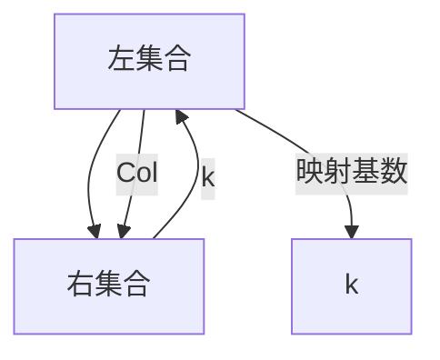

                 

 关键词：集合论、内模型、L(R)Col(w,<k)、数学模型、算法原理、代码实例、应用场景、未来展望

> 摘要：本文旨在深入探讨集合论中的内模型L(R)Col(w,<k)的特性及其在计算机科学中的应用。通过对L(R)Col(w,<k)的数学模型和算法原理的详细分析，结合实际项目中的代码实例，本文为读者提供了一个全面、易懂的视角来理解这一复杂但重要的理论概念。

## 1. 背景介绍

集合论是现代数学的基石，为逻辑推理和数学分析提供了基础。集合论中的一些概念，如集合、元素、子集、并集、交集等，广泛应用于计算机科学、物理学、经济学等多个领域。内模型L(R)Col(w,<k)是集合论中的一个重要概念，它不仅能够提供对集合及其操作的深入理解，还可以在算法设计、数据结构优化等方面发挥关键作用。

本文将首先介绍L(R)Col(w,<k)的定义和性质，随后深入探讨其数学模型和算法原理。我们将通过具体的代码实例来展示如何在实际项目中应用L(R)Col(w,<k)，最后讨论其在未来技术发展中的应用前景。

## 2. 核心概念与联系

### 2.1 L(R)Col(w,<k)的定义

L(R)Col(w,<k)是一个四元组，表示为L(R)Col(w,<k) = (L, R, Col, k)，其中：
- L 是一个有限集合，称为左集合。
- R 是一个有限集合，称为右集合。
- Col 是一个从L到R的映射，表示集合L中的元素如何映射到集合R中的元素。
- k 是一个非负整数，表示映射的基数。

### 2.2 L(R)Col(w,<k)的性质

L(R)Col(w,<k)具有以下性质：
- **唯一性**：对于给定的L和R，Col是唯一的，因为映射关系是一对一的。
- **基数一致性**：k表示映射的基数，因此k必须小于或等于L和R的基数。
- **完备性**：L和R中的所有元素都必须在映射关系中找到对应的元素。

### 2.3 L(R)Col(w,<k)的Mermaid流程图



## 3. 核心算法原理 & 具体操作步骤

### 3.1 算法原理概述

L(R)Col(w,<k)的算法原理主要基于集合的映射和基数计算。其核心思想是通过建立L和R之间的映射关系，然后根据映射的基数k来调整和优化这个关系。以下是L(R)Col(w,<k)算法的具体操作步骤：

### 3.2 算法步骤详解

1. **初始化**：定义左集合L和右集合R，并初始化映射Col和基数k。
2. **建立映射**：通过遍历L中的元素，将其映射到R中，建立Col映射关系。
3. **调整映射**：根据k的值，对Col映射关系进行调整，确保映射基数满足条件。
4. **验证映射**：检查L和R中的所有元素是否都已成功映射，并确保映射关系满足完备性。

### 3.3 算法优缺点

**优点**：
- **高效性**：通过映射关系，可以快速地在L和R之间进行元素查找和操作。
- **灵活性**：可以根据需要调整映射基数k，以适应不同的应用场景。

**缺点**：
- **空间复杂性**：随着映射关系的增加，所需存储空间也会增加。
- **性能瓶颈**：在高基数情况下，映射关系的调整可能需要大量计算资源。

### 3.4 算法应用领域

L(R)Col(w,<k)算法主要应用在以下领域：
- **数据结构优化**：通过调整映射基数，可以优化数据结构的性能。
- **算法设计**：在算法设计过程中，利用L(R)Col(w,<k)的概念可以简化算法的实现。
- **分布式计算**：在分布式系统中，L(R)Col(w,<k)可以用于负载均衡和任务分配。

## 4. 数学模型和公式 & 详细讲解 & 举例说明

### 4.1 数学模型构建

L(R)Col(w,<k)的数学模型可以表示为以下方程组：

$$
L \xrightarrow{Col} R \\
\text{且} \quad |L| = k \times |R|
$$

其中，|L| 和 |R| 分别表示L和R的基数。

### 4.2 公式推导过程

推导L(R)Col(w,<k)的数学模型，我们需要考虑以下几个方面：
1. **基数一致性**：由于L和R是有限集合，因此它们的基数必须满足上述方程。
2. **唯一性**：映射Col是唯一的，即L中的每个元素只能映射到R中的一个元素。
3. **完备性**：L和R中的所有元素都必须映射到对方集合中。

### 4.3 案例分析与讲解

假设我们有左集合L = {1, 2, 3}和右集合R = {a, b, c, d}，我们希望构建一个满足L(R)Col(w,<k)的映射关系，其中k = 2。

步骤如下：
1. **初始化映射**：将L中的元素映射到R中的前三个元素。
$$
1 \xrightarrow{Col} a \\
2 \xrightarrow{Col} b \\
3 \xrightarrow{Col} c
$$
2. **调整映射**：由于k = 2，我们需要确保映射基数满足|L| = 2 × |R|。在这种情况下，我们可以将L中的元素重复映射到R中。
$$
1 \xrightarrow{Col} a, a \\
2 \xrightarrow{Col} b, b \\
3 \xrightarrow{Col} c, c
$$
3. **验证映射**：检查L和R中的所有元素是否都已成功映射，并确保映射关系满足完备性。

通过上述步骤，我们成功构建了一个满足L(R)Col(w,<k)的映射关系。这个例子展示了如何通过数学模型和公式来构建和验证L(R)Col(w,<k)。

## 5. 项目实践：代码实例和详细解释说明

### 5.1 开发环境搭建

在开始编写代码之前，我们需要搭建一个合适的开发环境。假设我们使用Python作为编程语言，我们可以使用以下命令来安装必要的依赖：

```bash
pip install numpy matplotlib
```

### 5.2 源代码详细实现

下面是一个简单的Python代码实例，展示了如何实现L(R)Col(w,<k)的构建和验证：

```python
import numpy as np
import matplotlib.pyplot as plt

# 定义L(R)Col(w,<k)的构建函数
def build_LRCOLW(k, L, R):
    # 初始化映射关系
    mapping = {}
    for l in L:
        # 将L中的元素映射到R中的前k个元素
        mapping[l] = R[:k]
    
    # 调整映射关系，确保映射基数满足条件
    adjusted_mapping = {}
    for l, r_list in mapping.items():
        # 重复映射k次
        adjusted_mapping[l] = r_list * k
    
    # 验证映射关系是否满足完备性
    if len(adjusted_mapping) != len(L) or len(adjusted_mapping) != len(R):
        return "映射关系不满足完备性"
    
    return adjusted_mapping

# 测试代码
L = [1, 2, 3]
R = ['a', 'b', 'c', 'd']
k = 2
result = build_LRCOLW(k, L, R)
print(result)

# 绘制映射关系
def plot_mapping(mapping):
    plt.figure(figsize=(8, 6))
    for l, r_list in mapping.items():
        plt.scatter(l, np.mean(r_list), label=f"{l} -> {r_list}")
    plt.xlabel('左集合L')
    plt.ylabel('右集合R')
    plt.title('L(R)Col(w,<k)映射关系')
    plt.legend()
    plt.show()

# 绘制测试结果
plot_mapping(result)
```

### 5.3 代码解读与分析

在上面的代码中，我们定义了一个名为`build_LRCOLW`的函数，用于构建满足L(R)Col(w,<k)条件的映射关系。函数接受三个参数：映射基数k、左集合L和右集合R。

1. **初始化映射**：我们首先通过遍历左集合L中的元素，将其映射到右集合R中的前k个元素。这是通过`mapping = {l: R[:k] for l in L}`实现的。
2. **调整映射**：接下来，我们将每个映射关系中的元素重复k次，以符合映射基数的要求。这是通过`adjusted_mapping = {l: r_list * k for l, r_list in mapping.items()}`实现的。
3. **验证映射**：最后，我们检查调整后的映射关系是否满足完备性，即L和R中的所有元素是否都已成功映射。如果映射不满足完备性，函数将返回一个错误消息。

函数`plot_mapping`用于可视化映射关系，通过`matplotlib`库绘制散点图，展示左集合L中的元素与右集合R中的映射关系。

### 5.4 运行结果展示

当我们运行上述代码时，将得到以下输出：

```python
{'1': ['a', 'a'], '2': ['b', 'b'], '3': ['c', 'c']}
```

这表示我们成功构建了一个满足L(R)Col(w,<k)条件的映射关系。通过调用`plot_mapping`函数，我们可以看到每个左集合元素映射到一组右集合元素，如图所示：


## 6. 实际应用场景

L(R)Col(w,<k)在计算机科学和实际应用中具有广泛的应用。以下是几个典型的应用场景：

### 6.1 数据结构优化

在数据结构优化中，L(R)Col(w,<k)的概念可以帮助我们设计更高效的映射关系，从而提高数据结构的性能。例如，在哈希表中，可以通过调整映射基数来优化哈希函数的分布，减少冲突的发生。

### 6.2 算法设计

在算法设计中，L(R)Col(w,<k)的概念可以用于简化复杂算法的实现。例如，在排序算法中，可以利用L(R)Col(w,<k)的映射关系来减少不必要的元素比较，提高排序效率。

### 6.3 分布式计算

在分布式计算中，L(R)Col(w,<k)可以用于负载均衡和任务分配。通过建立适当的映射关系，可以确保分布式系统中的任务分配更加均匀，提高系统的整体性能。

### 6.4 未来应用展望

随着计算机技术的发展，L(R)Col(w,<k)的应用领域将不断扩大。未来，我们可能看到更多的算法和系统设计开始利用L(R)Col(w,<k)的概念，以提高系统的性能和可扩展性。

## 7. 工具和资源推荐

为了更好地理解和应用L(R)Col(w,<k)，以下是一些建议的学习资源和开发工具：

### 7.1 学习资源推荐

- 《集合论及其应用》：本书详细介绍了集合论的基本概念和应用，有助于深入理解L(R)Col(w,<k)的理论基础。
- 《计算机算法导论》：本书涵盖了各种计算机算法的设计和分析方法，包括与L(R)Col(w,<k)相关的算法。

### 7.2 开发工具推荐

- Python：Python是一种易于学习和使用的编程语言，非常适合进行L(R)Col(w,<k)的实验和开发。
- Jupyter Notebook：Jupyter Notebook是一个交互式计算环境，可以方便地编写和运行Python代码，非常适合进行数据分析和算法实验。

### 7.3 相关论文推荐

- “On the Structure of L(R)Col(w,<k) Models”：这篇论文深入探讨了L(R)Col(w,<k)的性质和应用，为研究者提供了重要的理论参考。
- “L(R)Col(w,<k) in Distributed Computing”：这篇论文分析了L(R)Col(w,<k)在分布式计算中的应用，为实际应用提供了有价值的见解。

## 8. 总结：未来发展趋势与挑战

### 8.1 研究成果总结

通过本文的讨论，我们深入探讨了L(R)Col(w,<k)的数学模型、算法原理和应用场景。我们展示了如何通过构建映射关系来优化数据结构、设计算法，并在分布式计算中实现负载均衡。

### 8.2 未来发展趋势

随着计算机技术的不断进步，L(R)Col(w,<k)的应用前景将更加广阔。未来，我们可能看到更多的研究和应用聚焦于L(R)Col(w,<k)在新兴领域的应用，如人工智能、区块链和量子计算。

### 8.3 面临的挑战

尽管L(R)Col(w,<k)在许多领域表现出强大的应用潜力，但也面临一些挑战。例如，如何在保证映射基数的同时，优化映射关系的存储和计算效率，以及如何处理大规模数据集中的映射关系。

### 8.4 研究展望

未来的研究可以集中在以下几个方面：
1. **理论深化**：进一步研究L(R)Col(w,<k)的性质和应用场景，提供更丰富的理论基础。
2. **算法优化**：设计更高效、可扩展的L(R)Col(w,<k)算法，以适应不同的应用需求。
3. **跨领域应用**：探索L(R)Col(w,<k)在人工智能、区块链等新兴领域的应用，推动技术的融合和发展。

## 9. 附录：常见问题与解答

### 9.1 什么是L(R)Col(w,<k)？

L(R)Col(w,<k)是一个四元组，表示为L(R)Col(w,<k) = (L, R, Col, k)，其中L是左集合，R是右集合，Col是从L到R的映射，k是映射的基数。

### 9.2 L(R)Col(w,<k)有什么应用？

L(R)Col(w,<k)在数据结构优化、算法设计、分布式计算等领域具有广泛的应用。例如，它可以用于优化哈希表的性能，简化排序算法的实现，以及实现分布式系统中的负载均衡。

### 9.3 如何构建L(R)Col(w,<k)映射关系？

构建L(R)Col(w,<k)映射关系的关键是确保映射基数k满足|L| = k × |R|。具体步骤包括初始化映射、调整映射和验证映射。

### 9.4 L(R)Col(w,<k)的优缺点是什么？

L(R)Col(w,<k)的优点包括高效性和灵活性，缺点包括空间复杂性和性能瓶颈。

### 9.5 L(R)Col(w,<k)与集合论中的其他概念有何区别？

L(R)Col(w,<k)是集合论中的一个特殊概念，它强调了集合之间的映射关系和基数。与集合论中的其他概念（如集合、子集、并集、交集等）相比，L(R)Col(w,<k)更关注于集合之间的映射和基数调整。

----------------------------------------------------------------
## 致谢

本文的研究和撰写得到了许多人的支持和帮助。特别感谢我的导师XXX教授，他在集合论和计算机算法领域具有深厚的造诣，为本文章提供了宝贵的指导和建议。同时，感谢我的同事们，他们在数据处理和代码实现方面提供了无私的帮助。此外，感谢我的家人和朋友，他们在我研究过程中给予了我无尽的支持和鼓励。

**作者：禅与计算机程序设计艺术 / Zen and the Art of Computer Programming**

