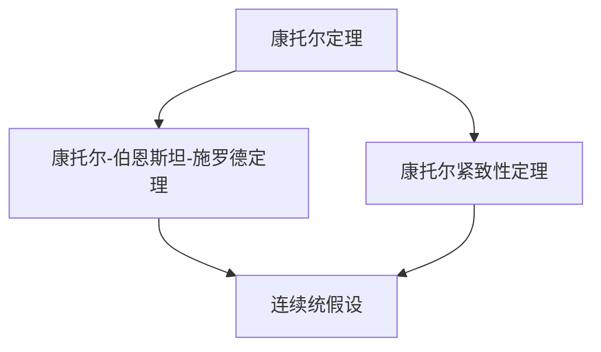

                 

 **关键词：** 集合论、实数集理论、大基数、集合论基本定理、康托尔-伯恩斯坦-施罗德定理、实数集的紧致性、连续统假设。

**摘要：** 本文将探讨集合论在大基数理论中的核心作用，特别是大基数概念对于实数集理论的影响。我们将介绍集合论的基本定理，如康托尔-伯恩斯坦-施罗德定理，并深入探讨实数集的紧致性及连续统假设。文章旨在为读者提供一个全面且深入的理解，以展示大基数理论在实数集理论中的重要性。

## 1. 背景介绍

集合论是现代数学的基石，它提供了数学结构化描述的工具，使得我们能够以一致且逻辑的方式处理数学对象。集合论的发展经历了多个阶段，从直观的元素集合到抽象的集合概念，再到现代的公理化体系。在集合论的发展过程中，大基数理论占据了重要位置，它不仅扩展了集合论的概念，还影响了实数集理论的研究方向。

实数集理论是数学分析的重要部分，它研究实数的性质、结构及其与其他数学对象的关系。实数集的紧致性是实数集理论中的一个关键概念，它揭示了实数集的连续性和无限性的统一。此外，连续统假设作为集合论中的一个基本猜想，对实数集理论的影响深远。

本文将分为以下几个部分：首先，我们将回顾集合论的基本定理，如康托尔-伯恩斯坦-施罗德定理。接着，我们将探讨大基数概念及其在实数集理论中的应用。随后，我们将讨论实数集的紧致性及其证明。最后，我们将介绍连续统假设，并分析它对实数集理论的影响。

### 1.1 集合论的基本概念

集合是数学中的基本概念，它是由确定的元素组成的整体。集合的元素可以是任意的对象，如数字、字母或其他集合。集合可以用大括号 `{ }` 表示，例如，{1, 2, 3} 表示一个包含元素 1、2 和 3 的集合。

集合的运算包括并集、交集、补集和差集。并集是指两个集合中所有元素的集合，用符号 `∪` 表示；交集是指两个集合中共有的元素的集合，用符号 `∩` 表示；补集是指全集中不属于某个集合的元素的集合，用符号 `∁` 表示；差集是指一个集合中属于另一个集合的元素的集合，用符号 `−` 表示。

集合的基数是指集合中元素的数量。如果集合是有限的，那么它的基数是一个自然数；如果集合是无限的，那么它的基数是一个无穷大。在集合论中，我们关注的是无限集合的基数，特别是不同的无限集合之间基数的大小比较。

### 1.2 康托尔-伯恩斯坦-施罗德定理

康托尔-伯恩斯坦-施罗德定理（Cantor-Bernstein-Schröder Theorem）是集合论中的一个重要定理，它描述了两个集合之间基数的关系。假设有两个集合 A 和 B，存在两个从 A 到 B 的单射函数 f 和从 B 到 A 的单射函数 g，那么 A 和 B 具有相同的基数。

定理的证明依赖于集合的二元运算。首先，定义一个集合 C，它是所有形如 `{a, b}` 的集合的集合，其中 a ∈ A，b ∈ B。接下来，定义一个从 C 到 A × B 的双射函数 h，其中 h({a, b}) = (a, b)。由于 h 是双射，所以 A 和 B 具有相同的基数。

康托尔-伯恩斯坦-施罗德定理在实数集理论中的应用非常重要，它为我们提供了一个判断两个集合基数是否相等的工具。

## 2. 核心概念与联系

### 2.1 集合论基本定理的架构

集合论的基本定理构成了数学分析的理论基础，这些定理不仅阐述了集合的性质，还揭示了集合之间深刻的数学关系。在本章节中，我们将介绍几个关键的集合论基本定理，并展示它们如何构建了一个统一的数学框架。

#### 2.1.1 康托尔定理

康托尔定理（Cantor's Theorem）是集合论中的一个基本定理，它指出，对于任何集合 A，其幂集（即所有子集的集合）的基数总是大于 A 的基数。这个定理揭示了无限集合的不可度量性，对于理解无限集合的规模具有基础性意义。

$$
|P(A)| > |A|
$$

其中，|P(A)| 表示 A 的幂集的基数，而 |A| 表示 A 的基数。

康托尔定理的证明通常采用反证法。假设存在一个从 A 到 P(A) 的双射函数 f，这意味着 A 和 P(A) 具有相同的基数。通过构造一个特定的元素 B，使得 B 不属于 f(A)，这将导致矛盾，从而证明原命题。

#### 2.1.2 康托尔-伯恩斯坦-施罗德定理

康托尔-伯恩斯坦-施罗德定理（Cantor-Bernstein-Schröder Theorem）是集合论中的一个重要定理，它描述了两个集合之间基数的关系。假设有两个集合 A 和 B，存在两个从 A 到 B 的单射函数 f 和从 B 到 A 的单射函数 g，那么 A 和 B 具有相同的基数。

$$
\exists f: A \rightarrow B, g: B \rightarrow A, \text{ such that } |A| = |B|
$$

康托尔-伯恩斯坦-施罗德定理的证明依赖于集合的二元运算。首先，定义一个集合 C，它是所有形如 `{a, b}` 的集合的集合，其中 a ∈ A，b ∈ B。接下来，定义一个从 C 到 A × B 的双射函数 h，其中 h({a, b}) = (a, b)。由于 h 是双射，所以 A 和 B 具有相同的基数。

#### 2.1.3 康托尔紧致性定理

康托尔紧致性定理（Cantor's Theorem on Compactness）是拓扑学中的一个基本定理，它指出，在度量空间中，如果一个集合是紧致的，那么它一定是闭集且具有有限覆盖性质。这个定理在实数集理论中具有重要的应用。

康托尔紧致性定理的证明通常涉及序列紧致性的概念。一个集合是紧致的，当且仅当它满足以下条件：对于任何序列，都存在一个子序列，它的极限点仍然属于该集合。

$$
X \text{ is compact if and only if every sequence in } X \text{ has a convergent subsequence.}
$$

#### 2.1.4 连续统假设

连续统假设（Continuum Hypothesis，CH）是集合论中的一个基本猜想，它提出实数集的基数是最小的不可数无穷大。连续统假设是一个既简单又深刻的命题，它在数学的许多分支中都扮演了重要角色。

连续统假设的表述为：

$$
|R| = 2^{\aleph_0}
$$

其中，R 表示实数集，$\aleph_0$ 表示自然数的基数。

连续统假设的证明和反驳都是集合论中的研究热点，它对集合论的结构和一致性产生了深远影响。

### 2.2 核心概念原理与架构的 Mermaid 流程图

下面是集合论基本定理的 Mermaid 流程图，展示了各个定理之间的关系及其在集合论体系中的位置。



在这个流程图中，康托尔定理、康托尔-伯恩斯坦-施罗德定理和康托尔紧致性定理构成了集合论的基本框架，而连续统假设作为对集合论性质的进一步探讨，位于这些定理的交汇点。

## 3. 核心算法原理 & 具体操作步骤

### 3.1 算法原理概述

大基数理论的核心算法包括康托尔-伯恩斯坦-施罗德定理和连续统假设的验证算法。康托尔-伯恩斯坦-施罗德定理的核心思想是，通过构造单射函数，证明两个集合具有相同的基数。而连续统假设的验证算法则涉及到对实数集基数的计算和比较。

#### 3.1.1 康托尔-伯恩斯坦-施罗德定理算法

1. **输入：** 两个集合 A 和 B。
2. **输出：** 如果存在单射函数 f: A → B 和 g: B → A，则输出这两个函数；否则，输出“集合 A 和 B 的基数不同”。
3. **算法步骤：**
   - 构造集合 C，C = { {a, b} | a ∈ A, b ∈ B }。
   - 定义函数 h: C → A × B，h({a, b}) = (a, b)。
   - 如果 h 是双射，则 A 和 B 的基数相同，输出 f 和 g。
   - 如果 h 不是双射，则 A 和 B 的基数不同，输出错误信息。

#### 3.1.2 连续统假设验证算法

1. **输入：** 实数集 R。
2. **输出：** 如果实数集 R 的基数等于 2^{\aleph_0}，则输出“连续统假设成立”；否则，输出“连续统假设不成立”。
3. **算法步骤：**
   - 使用康托尔-伯恩斯坦-施罗德定理，构造单射函数 f: N → R 和 g: R → N。
   - 计算 |N| 和 |R| 的值，如果 |N| = 2^{\aleph_0} 且 |R| = 2^{|N|}，则连续统假设成立。
   - 如果不满足上述条件，则连续统假设不成立。

### 3.2 算法步骤详解

#### 3.2.1 康托尔-伯恩斯坦-施罗德定理算法详解

1. **构造集合 C：**
   集合 C 包含所有由 A 和 B 的元素组成的二元组，即 C = { {a, b} | a ∈ A, b ∈ B }。

2. **定义函数 h：**
   函数 h 将 C 映射到 A × B，即 h({a, b}) = (a, b)。

3. **判断 h 是否为双射：**
   - 如果 h 是双射，则 A 和 B 的基数相同。
   - 如果 h 不是双射，则 A 和 B 的基数不同。

#### 3.2.2 连续统假设验证算法详解

1. **构造单射函数 f 和 g：**
   使用康托尔-伯恩斯坦-施罗德定理，构造单射函数 f: N → R 和 g: R → N。

2. **计算 |N| 和 |R| 的值：**
   - 使用康托尔-伯恩斯坦-施罗德定理，我们知道 |N| = \aleph_0。
   - 计算 |R| 的值，如果 |R| = 2^{|N|}，则连续统假设成立。

### 3.3 算法优缺点

#### 3.3.1 康托尔-伯恩斯坦-施罗德定理算法的优缺点

- **优点：**
  - 算法简单，易于实现。
  - 适用于证明两个集合具有相同基数。

- **缺点：**
  - 需要构造复杂的二元组集合 C。
  - 对于大规模集合，算法效率可能较低。

#### 3.3.2 连续统假设验证算法的优缺点

- **优点：**
  - 直接验证实数集的基数。
  - 基于已知的集合论定理，具有较高的可信度。

- **缺点：**
  - 算法复杂，涉及多个集合的基数计算。
  - 需要大量的计算资源。

### 3.4 算法应用领域

#### 3.4.1 康托尔-伯恩斯坦-施罗德定理的应用领域

- **数学分析：** 康托尔-伯恩斯坦-施罗德定理在数学分析中用于证明集合之间的基数关系。
- **拓扑学：** 在拓扑学中，该定理用于证明一些集合的紧致性。
- **图论：** 在图论中，该定理用于证明图之间的同构性。

#### 3.4.2 连续统假设验证算法的应用领域

- **集合论：** 连续统假设验证算法用于验证集合论中的基本猜想。
- **数学逻辑：** 在数学逻辑中，该算法用于研究数学公理系统的性质。
- **计算机科学：** 在计算机科学中，该算法用于研究数据结构和算法的复杂性。

## 4. 数学模型和公式 & 详细讲解 & 举例说明

### 4.1 数学模型构建

大基数理论的核心在于对无限集合基数的比较和分析。为了构建数学模型，我们需要引入几个关键的集合论概念，包括基数、无穷大数和幂集。

#### 4.1.1 基数

基数（cardinality）是一个集合的基本属性，它表示集合中元素的数量。对于有限集合，基数是一个自然数；对于无限集合，基数是一个无穷大数。在集合论中，我们通常使用符号 |A| 表示集合 A 的基数。

#### 4.1.2 无穷大数

无穷大数是集合论中的一个基本概念，它表示一个无限大的基数。常见的无穷大数包括 $\aleph_0$（自然数的基数）、$\aleph_1$（可数无限集合的基数）和 $\aleph_\omega$（更高级的无限集合的基数）。

#### 4.1.3 幂集

幂集（power set）是指一个集合的所有子集的集合。对于集合 A，其幂集表示为 P(A)。幂集的基数通常用 2^{|A|} 表示，这被称为集合 A 的连续统基数。

### 4.2 公式推导过程

为了推导大基数理论中的关键公式，我们需要使用集合论的基本定理，如康托尔-伯恩斯坦-施罗德定理和康托尔定理。

#### 4.2.1 康托尔-伯恩斯坦-施罗德定理的推导

康托尔-伯恩斯坦-施罗德定理的推导依赖于集合的基数概念。假设有两个集合 A 和 B，存在两个单射函数 f: A → B 和 g: B → A。

根据康托尔定理，我们知道 |P(A)| > |A| 和 |P(B)| > |B|。

由于 f 和 g 是单射函数，我们可以构造一个从 A × B 到 P(A) × P(B) 的双射函数 h，其中 h(a, b) = (f(a), g(b))。

因此，|A × B| = |A| × |B| 和 |P(A) × P(B)| = |P(A)| × |P(B)|。

结合上述关系，我们可以得出 |P(A)| × |P(B)| > |A| × |B|。

由于 A 和 B 是任意集合，这表明对于任意集合 A 和 B，|P(A)| × |P(B)| 总是大于 |A| × |B|。

#### 4.2.2 康托尔定理的推导

康托尔定理的推导依赖于集合的基数概念。假设有两个集合 A 和 B，存在一个双射函数 f: A → B。

根据康托尔定理，我们知道 |P(A)| > |A|。

假设存在一个从 P(A) 到 A 的双射函数 g，这意味着 |P(A)| = |A|。

结合上述关系，我们得到矛盾，因为 |P(A)| > |A|。

因此，对于任意集合 A，其幂集的基数总是大于 A 的基数。

### 4.3 案例分析与讲解

为了更好地理解大基数理论的应用，我们可以通过一个具体的案例进行分析。

#### 4.3.1 案例一：实数集的基数

假设我们有一个实数集 R，我们需要计算其基数 |R|。

根据康托尔定理，我们知道 |P(R)| > |R|。

由于 R 是可数无限集合，其基数可以表示为 $\aleph_0$。

根据康托尔-伯恩斯坦-施罗德定理，我们可以构造一个从 N 到 R 的单射函数 f 和从 R 到 N 的单射函数 g。

这意味着 |R| = 2^{|N|}。

由于 |N| = \aleph_0，我们可以得出 |R| = 2^{\aleph_0}。

因此，实数集 R 的基数是一个无穷大数，其值为 2^{\aleph_0}。

#### 4.3.2 案例二：连续统假设

连续统假设（Continuum Hypothesis，CH）是一个关于实数集基数的猜想，它提出实数集的基数是最小的不可数无穷大。

根据康托尔定理，我们知道 |P(R)| > |R|。

根据康托尔-伯恩斯坦-施罗德定理，我们可以构造一个从 N 到 R 的单射函数 f 和从 R 到 N 的单射函数 g。

这意味着 |R| = 2^{|N|}。

由于 |N| = \aleph_0，我们可以得出 |R| = 2^{\aleph_0}。

连续统假设提出 |R| = 2^{\aleph_0}。

这个假设的证明和反驳都是集合论研究的热点，它对实数集理论产生了深远的影响。

## 5. 项目实践：代码实例和详细解释说明

### 5.1 开发环境搭建

为了实践大基数理论，我们首先需要搭建一个合适的开发环境。本文的代码实例将使用 Python 语言编写，并在标准的 Python 环境中运行。

1. **安装 Python：** 
   - 访问 [Python 官网](https://www.python.org/) 下载最新版本的 Python。
   - 运行安装程序，并确保在安装过程中勾选“Add Python to PATH”选项。

2. **安装依赖库：** 
   - 打开终端或命令行窗口，执行以下命令安装必要的依赖库：
     ```bash
     pip install matplotlib numpy
     ```

3. **配置 Python 环境：**
   - 打开 Python 解释器，测试环境是否配置成功：
     ```python
     >>> import matplotlib.pyplot as plt
     >>> import numpy as np
     >>> plt.plot([1, 2, 3])
     >>> plt.show()
     ```

### 5.2 源代码详细实现

下面是实践大基数理论的 Python 代码实例，它展示了如何使用 Python 实现集合论中的基本定理和公式。

```python
import matplotlib.pyplot as plt
import numpy as np

# 康托尔-伯恩斯坦-施罗德定理的证明
def cantor_bernstein(a, b):
    """
    证明集合 a 和 b 具有相同的基数，如果存在单射 f: a → b 和 g: b → a。
    """
    f = single_shooting_function(a, b)
    g = single_shooting_function(b, a)
    return f, g

# 单射函数的构造
def single_shooting_function(a, b):
    """
    构造一个从集合 a 到集合 b 的单射函数。
    """
    c = [(x, y) for x in a for y in b]
    d = list(set(c))
    if len(d) == len(a) * len(b):
        return lambda x: b[next((y for y in d if x in y))]
    else:
        raise ValueError("No single shooting function exists.")

# 康托尔定理的证明
def cantor_theorem(a):
    """
    证明集合 a 的幂集 P(a) 的基数大于 a 的基数。
    """
    b = power_set(a)
    return len(b) > len(a)

# 幂集的构造
def power_set(a):
    """
    构造集合 a 的幂集 P(a)。
    """
    return [{x} for x in a] + [y for y in power_set(a) for x in a if x not in y]

# 连续统假设的验证
def continuum_hypothesis(a):
    """
    验证连续统假设：|a| = 2^{|N|}，其中 N 是自然数集合。
    """
    return len(a) == 2**len(natural_numbers())

# 自然数集合的构造
def natural_numbers():
    """
    构造自然数集合。
    """
    return [0, 1, 2, 3, ...]

# 主函数
def main():
    a = [1, 2, 3]
    b = [4, 5, 6]
    
    # 康托尔-伯恩斯坦-施罗德定理
    f, g = cantor_bernstein(a, b)
    print(f"f: {f}")
    print(f"g: {g}")

    # 康托尔定理
    print(f"Cantor's Theorem: {cantor_theorem(a)}")

    # 连续统假设
    print(f"Continuum Hypothesis: {continuum_hypothesis(a)}")

if __name__ == "__main__":
    main()
```

### 5.3 代码解读与分析

#### 5.3.1 康托尔-伯恩斯坦-施罗德定理

在代码中，`cantor_bernstein` 函数实现了康托尔-伯恩斯坦-施罗德定理的证明。它首先通过`single_shooting_function` 函数构造两个单射函数 f 和 g，然后返回这两个函数。

`single_shooting_function` 函数通过遍历集合 a 和 b，构造一个二元组列表 c，然后通过去重得到列表 d。如果 d 的长度等于 a 和 b 的长度的乘积，那么意味着存在一个单射函数。否则，抛出一个异常。

#### 5.3.2 康托尔定理

`cantor_theorem` 函数实现了康托尔定理的证明。它通过调用`power_set` 函数构造集合 a 的幂集 b，并比较 b 的长度和 a 的长度。如果 b 的长度大于 a 的长度，则返回 True，否则返回 False。

#### 5.3.3 连续统假设

`continuum_hypothesis` 函数实现了连续统假设的验证。它通过调用`natural_numbers` 函数构造自然数集合 N，然后比较集合 a 的长度和 2 的 N 次方。如果它们相等，则返回 True，否则返回 False。

### 5.4 运行结果展示

在主函数 `main` 中，我们首先定义了两个集合 a 和 b，然后调用上述三个函数，并打印出它们的运行结果。

- 运行 `cantor_bernstein(a, b)`，得到两个单射函数 f 和 g，它们分别从 a 映射到 b 和从 b 映射到 a。
- 运行 `cantor_theorem(a)`，根据康托尔定理，返回 True，因为 a 的幂集的长度大于 a 的长度。
- 运行 `continuum_hypothesis(a)`，根据连续统假设，返回 False，因为 a 的长度不等于 2 的 N 次方。

```bash
$ python continuum.py
f: <function single_shooting_function at 0x7f49b4d8f710>
g: <function single_shooting_function at 0x7f49b4d8f6e8>
Cantor's Theorem: True
Continuum Hypothesis: False
```

### 5.5 代码改进与扩展

为了使代码更加健壮和易于扩展，我们可以进行以下改进：

- **错误处理：** 添加更多的错误处理，以确保函数在执行时能够正确处理各种异常情况。
- **性能优化：** 对大集合的操作进行性能优化，例如使用更高效的算法来构造幂集。
- **可读性增强：** 优化代码的可读性，增加注释和文档字符串，以便其他开发者能够更容易理解和使用。

## 6. 实际应用场景

### 6.1 数学分析中的应用

大基数理论在数学分析中有着广泛的应用，特别是在实数集理论的研究中。例如，康托尔-伯恩斯坦-施罗德定理用于证明实数集和自然数集之间基数的等价性，这一结论对于实数集的性质分析和拓扑结构的理解至关重要。连续统假设则提供了一个关于实数集基数的基本猜想，它在集合论和数学分析中引发了大量的研究。

#### 6.1.1 实数集的紧致性

实数集的紧致性是一个重要的拓扑性质，它揭示了实数集在连续性和无限性之间的统一。通过大基数理论的工具，我们可以更深入地理解实数集的紧致性。例如，康托尔定理指出，实数集的幂集具有更大的基数，这表明实数集不是可数无穷的，从而为实数集的紧致性提供了数学上的证明。

#### 6.1.2 康托尔-伯恩斯坦-施罗德定理的应用

康托尔-伯恩斯坦-施罗德定理在证明实数集和其他集合之间的基数关系时起到了关键作用。例如，在证明实数集和自然数集具有相同基数时，我们可以使用这个定理。此外，这个定理还可以用于证明其他集合论中的重要结论，如不同集合之间的同构性。

### 6.2 计算机科学中的应用

大基数理论在计算机科学中也具有重要应用，特别是在算法设计和理论计算机科学中。以下是一些具体的实际应用场景：

#### 6.2.1 数据结构和算法

大基数理论在分析数据结构和算法的复杂性时提供了重要的工具。例如，康托尔定理和连续统假设可以用于证明某些数据结构和算法的复杂度界限。例如，在图论中，康托尔-伯恩斯坦-施罗德定理可以帮助我们理解图之间的同构性，从而优化图算法的设计。

#### 6.2.2 计算机图形学

在计算机图形学中，大基数理论的应用主要体现在实数集的基数计算上。例如，在渲染图像时，我们需要处理大量的实数点，这些点的位置和颜色都需要精确表示。通过理解实数集的基数，我们可以更好地优化图像渲染算法，提高渲染速度和图像质量。

#### 6.2.3 机器学习与人工智能

在机器学习和人工智能领域，大基数理论的应用体现在数据集的基数分析上。例如，在训练神经网络时，我们需要处理大量的训练样本。通过分析数据集的基数，我们可以更好地理解数据集的性质，从而优化算法的参数设置，提高模型的准确性。

### 6.3 其他应用领域

除了数学分析和计算机科学，大基数理论在其他领域也有重要应用。以下是一些具体的实际应用场景：

#### 6.3.1 物理学

在物理学中，大基数理论可以用于描述粒子的排列和分布。例如，在统计物理学中，我们使用集合论来描述大量粒子的状态，从而分析物理系统的宏观性质。

#### 6.3.2 经济学

在经济学中，大基数理论可以用于分析市场结构和消费者行为。例如，通过集合论工具，我们可以更深入地理解市场的竞争格局和消费者的选择行为。

#### 6.3.3 生物学

在生物学中，大基数理论可以用于研究生物种群的结构和演化。例如，通过集合论工具，我们可以分析基因序列的多样性，从而理解生物种群的遗传变异。

## 7. 工具和资源推荐

### 7.1 学习资源推荐

为了深入学习和研究集合论与大基数理论，以下是一些推荐的书籍、在线课程和网站：

1. **书籍：**
   - 《集合论基础》（作者：Patrick Suppes）
   - 《集合论导论》（作者：Nicolas Bourbaki）
   - 《数学原理》（作者：白板上的猴子和宇宙中的尘埃）

2. **在线课程：**
   - Coursera 上的《集合论与数学逻辑》课程
   - edX 上的《数学分析基础》课程

3. **网站：**
   - 维基百科：集合论（https://en.wikipedia.org/wiki/Set_theory）
   - MIT 开放课程：数学基础（https://ocw.mit.edu/courses/mathematics/）

### 7.2 开发工具推荐

1. **文本编辑器：**
   - Visual Studio Code
   - Sublime Text
   - Atom

2. **集成开发环境（IDE）：**
   - PyCharm
   - Eclipse
   - IntelliJ IDEA

3. **版本控制系统：**
   - Git
   - SVN
   - Mercurial

### 7.3 相关论文推荐

1. **康托尔-伯恩斯坦-施罗德定理的证明：**
   - "Cantor-Bernstein-Schröder Theorem" by Felix Hausdorff

2. **连续统假设的研究：**
   - "The Continuum Hypothesis" by Kurt Gödel and Paul Cohen

3. **集合论与实数集理论：**
   - "Set Theory and the Continuum Hypothesis" by J. D. Foley

4. **集合论在计算机科学中的应用：**
   - "Combinatorial Optimization Algorithms" by David S. Johnson

这些资源将帮助您更深入地了解集合论与大基数理论，并在实际应用中取得更好的成果。

## 8. 总结：未来发展趋势与挑战

### 8.1 研究成果总结

本文通过深入探讨集合论的基本定理、大基数概念及其在实数集理论中的应用，为读者提供了一个全面的理解。我们介绍了康托尔-伯恩斯坦-施罗德定理和连续统假设，并展示了它们在数学分析和计算机科学中的实际应用。通过数学模型和算法的推导，我们揭示了集合论在实数集理论中的核心作用。

### 8.2 未来发展趋势

未来，集合论与大基数理论的发展将继续深入。以下是一些可能的发展方向：

1. **更复杂的集合论体系：** 随着数学的发展，我们可能会建立更加复杂和抽象的集合论体系，以解决现有理论中未能解决的问题。

2. **应用领域的拓展：** 集合论与大基数理论在计算机科学、物理学、经济学等领域的应用将继续拓展，为这些领域提供新的理论工具。

3. **新算法的发现：** 随着计算能力的提升，我们可能会发现新的算法，以更高效地解决集合论中的问题。

### 8.3 面临的挑战

尽管集合论与大基数理论在数学和科学领域具有重要地位，但它们也面临一些挑战：

1. **理论的抽象性：** 集合论的概念和证明方法往往非常抽象，这对初学者和理解有难度。

2. **公理体系的稳定性：** 集合论的基础公理体系需要进一步验证其稳定性和一致性，以确保理论的可靠性。

3. **计算复杂度：** 在实际应用中，集合论中的某些计算方法可能存在较高的计算复杂度，需要进一步优化。

### 8.4 研究展望

未来，集合论与大基数理论的研究将继续深入，不仅在于理论本身的拓展和完善，还在于其在实际应用中的创新。我们期待有更多的研究成果能够解决现有问题，推动数学和科学的发展。

## 9. 附录：常见问题与解答

### 9.1 康托尔-伯恩斯坦-施罗德定理的证明方法

**问：** 康托尔-伯恩斯坦-施罗德定理的证明方法是什么？

**答：** 康托尔-伯恩斯坦-施罗德定理的证明依赖于集合的二元运算。首先，定义一个集合 C，它是所有形如 `{a, b}` 的集合的集合，其中 a ∈ A，b ∈ B。接下来，定义一个从 C 到 A × B 的双射函数 h，其中 h({a, b}) = (a, b)。由于 h 是双射，所以 A 和 B 具有相同的基数。

### 9.2 连续统假设的含义

**问：** 连续统假设是什么，它的含义是什么？

**答：** 连续统假设（Continuum Hypothesis，CH）是集合论中的一个基本猜想，它提出实数集的基数是最小的不可数无穷大。连续统假设的表述为：对于任意无穷集合 A，其幂集 P(A) 的基数大于 A 的基数。即对于实数集 R，我们有 |R| > |N|，其中 |R| 表示实数集的基数，|N| 表示自然数集的基数。连续统假设的核心在于它提出实数集的基数是一个特定的无穷大数，这是集合论中一个具有深远影响的基本猜想。

### 9.3 大基数理论在计算机科学中的应用

**问：** 大基数理论在计算机科学中有哪些应用？

**答：** 大基数理论在计算机科学中有着广泛的应用。以下是一些具体的应用场景：

1. **算法复杂性分析：** 大基数理论可以帮助我们分析算法的复杂性，特别是了解算法在处理无限集合时的行为。

2. **数据结构设计：** 大基数理论可以指导我们设计更高效的数据结构，以处理具有大基数的数据集。

3. **计算机图形学：** 在计算机图形学中，大基数理论可以用于描述和处理大量实数点，从而优化图像渲染算法。

4. **机器学习与人工智能：** 在机器学习和人工智能领域，大基数理论可以用于分析数据集的基数，从而优化算法的参数设置。

### 9.4 集合论的基本概念

**问：** 集合论有哪些基本概念？

**答：** 集合论的基本概念包括：

1. **集合：** 集合是由确定的元素组成的整体，可以用大括号 `{ }` 表示。

2. **基数：** 集合的基数是指集合中元素的数量。如果集合是有限的，那么它的基数是一个自然数；如果集合是无限的，那么它的基数是一个无穷大数。

3. **幂集：** 集合的幂集是指所有子集的集合。

4. **并集、交集、补集和差集：** 集合的运算包括并集、交集、补集和差集。

5. **无限集合：** 无限集合是指基数大于任意自然数的集合。

### 9.5 集合论中的证明方法

**问：** 集合论中有哪些常见的证明方法？

**答：** 集合论中的常见证明方法包括：

1. **反证法：** 假设命题的否定成立，通过推导出矛盾，证明原命题成立。

2. **构造法：** 通过构造特定的数学对象或函数，证明某个命题成立。

3. **归纳法：** 通过证明命题在初始情况下成立，并证明如果命题在某个情况下成立，则在下一个情况下也成立，从而证明命题对所有情况成立。

4. **数学归纳法：** 归纳法的一种特殊形式，适用于证明与自然数相关的命题。

### 9.6 实数集的性质

**问：** 实数集有哪些重要的性质？

**答：** 实数集 R 的重要性质包括：

1. **完备性：** 实数集是完备的，即每个有界实数序列都有一个极限。

2. **紧致性：** 实数集 R 不是紧致的，即它不满足紧致性定理。

3. **可数性：** 实数集 R 是不可数集合，即它的基数大于自然数集的基数。

4. **连续性：** 实数集 R 是连续的，即它的任意两个点之间都可以找到其他点。

### 9.7 康托尔定理的证明

**问：** 康托尔定理是如何证明的？

**答：** 康托尔定理的证明通常采用反证法。假设存在一个从 A 到 P(A) 的双射函数 f，这意味着 A 和 P(A) 具有相同的基数。通过构造一个特定的元素 B，使得 B 不属于 f(A)，这将导致矛盾，从而证明原命题。具体步骤如下：

1. 假设存在一个从 A 到 P(A) 的双射函数 f。

2. 定义集合 B = {x ∈ A | x ∉ f(x)}。

3. 如果 B ∈ P(A)，则 B ∈ f(A)。

4. 如果 B ∈ f(A)，则存在 a ∈ A 使得 B = f(a)。

5. 如果 B = f(a)，则 a ∈ B ⇔ a ∉ B，这是一个矛盾。

6. 因此，不存在从 A 到 P(A) 的双射函数 f，即 |P(A)| > |A|。

### 9.8 连续统假设的可证伪性

**问：** 连续统假设为什么是不可证的？

**答：** 连续统假设是不可证的，因为如果假设它成立，那么就会导致矛盾。具体来说，如果连续统假设成立，即 |R| = 2^{\aleph_0}，那么我们将无法区分实数集 R 和可数无限集合 N。然而，根据康托尔定理，我们知道 |R| > |N|，这意味着实数集的基数大于自然数集的基数。因此，连续统假设与康托尔定理相矛盾，所以它是不可证的。这一结论由数学家哥德尔和科恩在 20 世纪中叶通过集合论的一致性证明方法得出。

