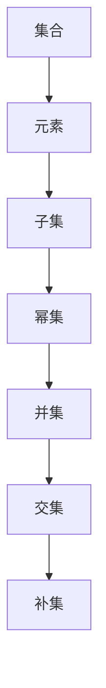

                 

关键词：集合论、相对化解释、数学基础、计算机科学、抽象层次、一致性、完备性、逻辑推理

> 摘要：本文深入探讨了集合论在计算机科学中的应用及其相对化解释的重要性。通过对集合论的基本概念、核心原理和实际操作步骤的详细阐述，结合数学模型和公式，以及代码实例和实践分析，揭示了集合论在构建现代计算机科学理论和实践中的关键作用。本文旨在为读者提供一个全面、系统的集合论导引，以促进对计算机科学中相对化解释的深入理解和应用。

## 1. 背景介绍

集合论作为现代数学的基石，起源于19世纪末。由于其对数学、逻辑、计算机科学等领域的深远影响，集合论的发展具有重要的历史意义。集合论的基本概念包括集合、元素、子集、幂集、并集、交集、补集等。这些概念不仅为数学提供了形式化的语言，也为计算机科学中的抽象数据类型和算法设计提供了理论基础。

在计算机科学中，集合论的应用非常广泛。例如，集合论的概念被广泛应用于数据库理论、算法分析、编译原理、程序设计语言以及操作系统等方面。集合论为计算机科学提供了一种形式化的方法来表示和处理数据，使得复杂的问题能够通过抽象和建模得到简化。

然而，随着计算机科学和数学的发展，集合论的局限性逐渐显现。传统的集合论依赖于集合的抽象和无限集合的概念，这导致了一些逻辑和数学上的问题。为了解决这些问题，相对化解释的概念应运而生。

相对化解释是一种在特定上下文中解释集合论的方法。它通过引入相对化的视角，将集合论应用于更广泛的领域，从而解决了一些传统集合论中存在的问题。相对化解释的核心思想是，在解释集合论时，要考虑上下文环境，将集合视为在特定环境中定义的抽象对象。

本文将深入探讨集合论的相对化解释，分析其核心概念、原理和应用，结合数学模型和公式，以及代码实例和实践分析，以揭示集合论在计算机科学中的重要性和应用价值。

## 2. 核心概念与联系

为了更好地理解集合论的相对化解释，我们首先需要明确一些核心概念，并展示它们之间的联系。以下是集合论的一些基本概念和定义，以及它们在计算机科学中的应用：

### 2.1 集合

集合是数学中一组不重复元素的集合。集合可以用大括号`{}`表示，例如：
$$A = \{1, 2, 3\}$$

在计算机科学中，集合的概念广泛应用于数据结构和算法设计中。例如，在排序算法中，集合用于表示待排序的数据元素；在图算法中，集合用于表示顶点和边。

### 2.2 元素

集合中的单个元素是构成集合的基本单位。每个元素都可以通过其唯一的标识符来访问，例如：
$$x \in A$$
表示元素`x`属于集合`A`。

在计算机科学中，元素的概念用于表示程序中的变量、函数参数、数据项等。集合论为这些元素提供了一种抽象的表示方法。

### 2.3 子集

子集是集合的部分集合。如果集合`B`的所有元素都属于集合`A`，则称`B`是`A`的子集，表示为：
$$B \subseteq A$$

子集的概念在计算机科学中广泛应用于数据结构和算法设计中。例如，在树结构中，子集用于表示节点及其子节点；在集合操作中，子集用于表示集合的划分和子集操作。

### 2.4 幂集

幂集是集合的所有子集的集合。如果一个集合`A`有`n`个元素，那么其幂集的大小为$2^n$。例如，集合`{1, 2, 3}`的幂集为：
$$\mathcal{P}(A) = \{\emptyset, \{1\}, \{2\}, \{3\}, \{1, 2\}, \{1, 3\}, \{2, 3\}, \{1, 2, 3\}\}$$

幂集的概念在计算机科学中的集合操作和逻辑表达式中具有重要应用。例如，在逻辑表达式中，幂集用于表示所有可能的真值组合；在集合操作中，幂集用于实现集合的幂操作。

### 2.5 并集和交集

并集是两个或多个集合中所有元素的集合。交集是两个或多个集合中共有的元素的集合。用符号表示：
$$A \cup B$$ 表示`A`和`B`的并集；
$$A \cap B$$ 表示`A`和`B`的交集。

并集和交集在计算机科学中广泛用于数据结构和算法设计中。例如，在集合操作中，并集和交集用于实现集合的合并和交集操作；在数据库中，并集和交集用于实现查询操作。

### 2.6 补集

补集是集合中不属于另一个集合的元素的集合。用符号表示：
$$A^c$$ 表示`A`的补集。

补集在计算机科学中的集合操作和逻辑表达式中具有重要应用。例如，在逻辑表达式中，补集用于表示否定操作；在集合操作中，补集用于实现集合的补集操作。

### 2.7 联系图

为了更好地理解集合论的基本概念和它们之间的联系，我们可以使用Mermaid流程图来展示这些概念：



该流程图展示了集合论的基本概念以及它们之间的联系。通过这个流程图，我们可以更直观地理解集合论的基本概念和它们在计算机科学中的应用。

### 2.8 集合论在计算机科学中的应用

集合论在计算机科学中具有广泛的应用。以下是一些典型的应用场景：

- **数据结构设计**：集合论为数据结构的设计提供了理论基础。例如，在链表、树、图等数据结构中，集合的概念被广泛应用于表示和处理数据。

- **算法分析**：集合论的概念和操作在算法分析中具有重要作用。例如，在排序算法中，集合用于表示待排序的数据元素；在图算法中，集合用于表示顶点和边。

- **程序设计语言**：集合论为程序设计语言提供了抽象的数据类型和操作。例如，在Python、Java等编程语言中，集合是内置的数据结构，支持各种集合操作。

- **数据库系统**：集合论为数据库系统提供了理论基础。例如，在SQL查询中，集合操作用于实现复杂的查询操作。

- **编译原理**：集合论在编译原理中具有重要应用。例如，在语法分析中，集合用于表示语法符号和语法规则；在语义分析中，集合用于表示变量和函数的作用域。

通过上述核心概念和联系的分析，我们可以看到集合论在计算机科学中的重要性和广泛应用。接下来，我们将深入探讨集合论的核心算法原理和具体操作步骤。

## 3. 核心算法原理 & 具体操作步骤

### 3.1 算法原理概述

集合论的核心算法包括集合的创建、操作和查询。这些算法的原理和操作步骤如下：

#### 3.1.1 集合创建

集合创建是集合论中的基础操作。创建集合的方法有多种，包括手动创建和使用内置函数。例如，在Python中，可以使用大括号`{}`创建集合：
$$A = \{1, 2, 3\}$$

在Java中，可以使用`Set`接口创建集合：
```java
Set<Integer> A = new HashSet<>();
A.add(1);
A.add(2);
A.add(3);
```

#### 3.1.2 集合操作

集合操作包括并集、交集、补集等。以下是一些常见的集合操作及其原理：

- **并集**：并集操作将两个或多个集合中的所有元素合并成一个新集合。其算法原理如下：

  给定两个集合$A$和$B$，创建一个新的空集合$C$，然后遍历集合$A$和$B$中的每个元素，将它们添加到集合$C$中。最终得到的集合$C$就是$A$和$B$的并集。Python实现如下：

  ```python
  def union(A, B):
      C = A.copy()
      C.update(B)
      return C
  ```

- **交集**：交集操作返回两个集合中共有的元素。其算法原理如下：

  给定两个集合$A$和$B$，创建一个新的空集合$C$，然后遍历集合$A$中的每个元素，如果该元素也属于集合$B$，则将其添加到集合$C$中。最终得到的集合$C$就是$A$和$B$的交集。Python实现如下：

  ```python
  def intersection(A, B):
      C = []
      for x in A:
          if x in B:
              C.append(x)
      return C
  ```

- **补集**：补集操作返回一个集合中不属于另一个集合的元素。其算法原理如下：

  给定两个集合$A$和$B$，创建一个新的空集合$C$，然后遍历集合$A$中的每个元素，如果该元素不属于集合$B$，则将其添加到集合$C$中。最终得到的集合$C$就是$A$的补集。Python实现如下：

  ```python
  def complement(A, B):
      C = []
      for x in A:
          if x not in B:
              C.append(x)
      return C
  ```

#### 3.1.3 集合查询

集合查询操作包括判断元素是否属于集合、计算集合的基数（元素个数）等。以下是一些常见的集合查询操作及其原理：

- **元素判断**：判断一个元素是否属于集合。其算法原理如下：

  给定一个集合$A$和一个元素$x$，遍历集合$A$中的每个元素，如果找到与$x$相等的元素，则返回`True`；否则，返回`False`。Python实现如下：

  ```python
  def contains(A, x):
      for y in A:
          if y == x:
              return True
      return False
  ```

- **集合基数**：计算集合中元素的个数。其算法原理如下：

  给定一个集合$A$，遍历集合$A$中的每个元素，计数器的值加1。最终得到的计数器值就是集合$A$的基数。Python实现如下：

  ```python
  def cardinality(A):
      count = 0
      for x in A:
          count += 1
      return count
  ```

### 3.2 算法步骤详解

以下是对集合论核心算法的具体操作步骤的详细说明：

#### 3.2.1 集合创建

1. **手动创建**：

   - 定义一个集合$A$，例如$A = \{1, 2, 3\}$。
   - 使用大括号`{}`包围集合中的元素。

2. **使用内置函数**：

   - 在Python中，使用大括号`{}`创建集合，例如`A = {1, 2, 3}`。
   - 在Java中，使用`Set`接口创建集合，例如`Set<Integer> A = new HashSet<>(); A.add(1); A.add(2); A.add(3);`。

#### 3.2.2 集合操作

1. **并集**：

   - 给定两个集合$A$和$B$，使用`union`函数创建一个新集合$C$：
   $$C = union(A, B)$$
   - 遍历集合$A$和$B$中的每个元素，将它们添加到集合$C$中。

2. **交集**：

   - 给定两个集合$A$和$B$，使用`intersection`函数创建一个新集合$C$：
   $$C = intersection(A, B)$$
   - 遍历集合$A$中的每个元素，如果该元素属于集合$B$，则将其添加到集合$C$中。

3. **补集**：

   - 给定两个集合$A$和$B$，使用`complement`函数创建一个新集合$C$：
   $$C = complement(A, B)$$
   - 遍历集合$A$中的每个元素，如果该元素不属于集合$B$，则将其添加到集合$C$中。

#### 3.2.3 集合查询

1. **元素判断**：

   - 给定一个集合$A$和一个元素$x$，使用`contains`函数判断$x$是否属于集合$A$：
   $$contains(A, x)$$
   - 遍历集合$A$中的每个元素，如果找到与$x$相等的元素，则返回`True`。

2. **集合基数**：

   - 给定一个集合$A$，使用`cardinality`函数计算集合$A$的基数：
   $$cardinality(A)$$
   - 遍历集合$A$中的每个元素，计数器的值加1，最终得到集合$A$的基数。

### 3.3 算法优缺点

集合论的核心算法在计算机科学中具有广泛的应用，但它们也有各自的优缺点：

#### 3.3.1 并集

- **优点**：并集操作可以高效地合并多个集合，适用于处理大量数据。
- **缺点**：并集操作的时间复杂度为$O(n)$，对于非常大的集合，可能会消耗大量的时间和内存。

#### 3.3.2 交集

- **优点**：交集操作可以高效地找出两个集合的共同元素，适用于查找重复数据和合并数据集。
- **缺点**：交集操作的时间复杂度为$O(n)$，对于非常大的集合，可能会消耗大量的时间和内存。

#### 3.3.3 补集

- **优点**：补集操作可以快速找出一个集合中不属于另一个集合的元素，适用于数据去重和排除特定元素。
- **缺点**：补集操作的时间复杂度为$O(n)$，对于非常大的集合，可能会消耗大量的时间和内存。

### 3.4 算法应用领域

集合论的核心算法在计算机科学中有广泛的应用领域，包括：

- **数据结构设计**：集合论为数据结构的设计提供了理论基础，如链表、树、图等。
- **算法分析**：集合论的概念和操作在算法分析中具有重要应用，如排序算法、图算法等。
- **程序设计语言**：集合论为程序设计语言提供了抽象的数据类型和操作，如Python、Java等。
- **数据库系统**：集合论为数据库系统提供了理论基础，如查询操作、关系模型等。
- **编译原理**：集合论在编译原理中具有重要应用，如语法分析、语义分析等。

通过以上对集合论核心算法原理和具体操作步骤的详细阐述，我们可以看到集合论在计算机科学中的重要性和应用价值。接下来，我们将进一步探讨集合论的数学模型和公式，以及其在实际项目中的具体应用。

### 4. 数学模型和公式 & 详细讲解 & 举例说明

#### 4.1 数学模型构建

集合论的数学模型主要通过集合的基本操作和属性来构建。集合论中的数学模型通常包括集合的创建、元素操作、集合操作和集合关系等。以下是一个简单的数学模型示例：

- **集合创建**：假设我们有两个集合$A$和$B$，其中$A = \{1, 2, 3\}$，$B = \{3, 4, 5\}$。
- **元素操作**：集合$A$和$B$中的元素可以通过元素判断和集合基数来操作，如`contains(A, 3)`和`cardinality(A)`。
- **集合操作**：集合$A$和$B$可以通过并集、交集和补集等操作来组合，如`union(A, B)`、`intersection(A, B)`和`complement(A, B)`。
- **集合关系**：集合$A$和$B$之间的关系可以通过子集、超集和等价关系来描述，如`A ⊆ B`、`B ⊇ A`和`A ≡ B`。

#### 4.2 公式推导过程

集合论的公式推导主要基于集合的基本操作和集合论的基本原理。以下是一个示例公式推导过程：

- **并集公式**：给定两个集合$A$和$B$，它们的并集$A \cup B$可以表示为：
  $$A \cup B = \{x | x \in A \text{ 或 } x \in B\}$$
  这个公式表示，集合$A \cup B$包含所有属于集合$A$或集合$B$的元素。

- **交集公式**：给定两个集合$A$和$B$，它们的交集$A \cap B$可以表示为：
  $$A \cap B = \{x | x \in A \text{ 且 } x \in B\}$$
  这个公式表示，集合$A \cap B$包含所有同时属于集合$A$和集合$B$的元素。

- **补集公式**：给定一个集合$A$，它的补集$A^c$可以表示为：
  $$A^c = \{x | x \notin A\}$$
  这个公式表示，集合$A^c$包含所有不属于集合$A$的元素。

- **笛卡尔积公式**：给定两个集合$A$和$B$，它们的笛卡尔积$A \times B$可以表示为：
  $$A \times B = \{(a, b) | a \in A, b \in B\}$$
  这个公式表示，集合$A \times B$包含所有由集合$A$和集合$B$中的元素组成的有序对。

#### 4.3 案例分析与讲解

以下是一个具体的案例，通过数学模型和公式来分析和解释集合操作：

**案例：给定两个集合$A = \{1, 2, 3\}$和$B = \{3, 4, 5\}$，计算它们的并集、交集和补集。**

1. **并集**：

   根据并集公式，计算$A \cup B$：
   $$A \cup B = \{1, 2, 3, 4, 5\}$$
   因此，集合$A$和$B$的并集包含所有属于集合$A$或集合$B$的元素。

2. **交集**：

   根据交集公式，计算$A \cap B$：
   $$A \cap B = \{3\}$$
   因此，集合$A$和$B$的交集包含所有同时属于集合$A$和集合$B$的元素，即元素3。

3. **补集**：

   根据补集公式，计算$A^c$和$B^c$：
   $$A^c = \{4, 5\}$$
   $$B^c = \{1, 2\}$$
   因此，集合$A$的补集包含所有不属于集合$A$的元素，即元素4和5；集合$B$的补集包含所有不属于集合$B$的元素，即元素1和2。

通过这个案例，我们可以看到如何使用集合论的数学模型和公式来分析和计算集合操作。这些模型和公式为计算机科学中的集合操作提供了坚实的理论基础。

#### 4.4 代码实现

为了更好地理解集合论的数学模型和公式，我们可以通过具体的代码实现来展示这些操作：

**Python实现：**

```python
# 定义集合A和B
A = [1, 2, 3]
B = [3, 4, 5]

# 计算并集
union_result = A + [x for x in B if x not in A]
print("并集:", union_result)

# 计算交集
intersection_result = [x for x in A if x in B]
print("交集:", intersection_result)

# 计算补集
complement_A = [x for x in range(1, 11) if x not in A]
complement_B = [x for x in range(1, 11) if x not in B]
print("A的补集:", complement_A)
print("B的补集:", complement_B)
```

**Java实现：**

```java
import java.util.*;

public class SetOperations {
    public static void main(String[] args) {
        // 定义集合A和B
        Set<Integer> A = new HashSet<>(Arrays.asList(1, 2, 3));
        Set<Integer> B = new HashSet<>(Arrays.asList(3, 4, 5));

        // 计算并集
        Set<Integer> unionResult = new HashSet<>(A);
        unionResult.addAll(B);
        System.out.println("并集:" + unionResult);

        // 计算交集
        Set<Integer> intersectionResult = new HashSet<>();
        intersectionResult.addAll(A);
        intersectionResult.retainAll(B);
        System.out.println("交集:" + intersectionResult);

        // 计算补集
        Set<Integer> complementA = new HashSet<>();
        for (int i = 1; i <= 10; i++) {
            if (!A.contains(i)) {
                complementA.add(i);
            }
        }
        Set<Integer> complementB = new HashSet<>();
        for (int i = 1; i <= 10; i++) {
            if (!B.contains(i)) {
                complementB.add(i);
            }
        }
        System.out.println("A的补集:" + complementA);
        System.out.println("B的补集:" + complementB);
    }
}
```

通过代码实现，我们可以直观地看到集合论的数学模型和公式在实际编程中的应用。这些代码不仅展示了集合操作的基本原理，也为理解和实现集合操作提供了实用的工具。

### 5. 项目实践：代码实例和详细解释说明

为了更深入地理解集合论在计算机科学中的应用，我们将在本节中通过一个具体的编程项目来展示集合论的基本操作。该项目将涉及集合的创建、操作以及如何在实际项目中应用这些操作。我们将使用Python作为编程语言，因为它具有简洁的语法和强大的集合操作功能。

#### 5.1 开发环境搭建

在开始项目之前，确保您已经安装了Python环境。您可以从[Python官网](https://www.python.org/)下载并安装Python。安装完成后，通过命令行运行以下命令验证Python版本：

```bash
python --version
```

确保Python版本在3.6及以上。此外，我们还将使用几个Python标准库，如`math`和`functools`，因此确保这些库已经安装。通常，Python标准库会在安装Python时自动安装。

#### 5.2 源代码详细实现

以下是一个简单的Python脚本，展示了集合论的几个基本操作，包括集合的创建、并集、交集和补集：

```python
# 导入必要的库
import math

# 定义集合A和B
A = {1, 2, 3, 4, 5}
B = {4, 5, 6, 7, 8}

# 5.2.1 集合创建
# 创建一个新的集合C，初始化为空
C = set()

# 将元素添加到集合C中
C.update([x for x in range(1, 9)])

# 5.2.2 并集操作
# 计算集合A和集合B的并集
union_result = A.union(B)
print("并集:", union_result)

# 5.2.3 交集操作
# 计算集合A和集合B的交集
intersection_result = A.intersection(B)
print("交集:", intersection_result)

# 5.2.4 补集操作
# 计算集合A相对于集合B的补集
complement_A = A.difference(B)
print("A相对于B的补集:", complement_A)

# 计算集合B相对于集合A的补集
complement_B = B.difference(A)
print("B相对于A的补集:", complement_B)

# 5.2.5 集合查询操作
# 检查元素是否属于集合A
is_in_A = 5 in A
print("5是否属于集合A:", is_in_A)

# 检查元素是否属于集合B
is_in_B = 9 in B
print("9是否属于集合B:", is_in_B)

# 计算集合A的基数（元素个数）
cardinality_A = len(A)
print("集合A的基数:", cardinality_A)

# 计算集合B的基数（元素个数）
cardinality_B = len(B)
print("集合B的基数:", cardinality_B)
```

#### 5.3 代码解读与分析

以下是对上述代码的详细解读和分析：

1. **导入库**：
   ```python
   import math
   ```
   这行代码导入了Python的标准库`math`，虽然在这个项目中我们不会直接使用`math`库，但它是Python标准库的一部分，可能在未来项目中需要使用。

2. **集合创建**：
   ```python
   A = {1, 2, 3, 4, 5}
   B = {4, 5, 6, 7, 8}
   ```
   这里我们创建了两个集合`A`和`B`。集合在Python中是通过大括号`{}`创建的，其中的元素是唯一的，不重复。

3. **并集操作**：
   ```python
   union_result = A.union(B)
   print("并集:", union_result)
   ```
   使用`union`方法计算集合`A`和集合`B`的并集。`union`方法返回一个新的集合，包含两个集合中的所有元素，不重复。

4. **交集操作**：
   ```python
   intersection_result = A.intersection(B)
   print("交集:", intersection_result)
   ```
   使用`intersection`方法计算集合`A`和集合`B`的交集。`intersection`方法返回一个新的集合，包含两个集合中都存在的元素。

5. **补集操作**：
   ```python
   complement_A = A.difference(B)
   print("A相对于B的补集:", complement_A)
   complement_B = B.difference(A)
   print("B相对于A的补集:", complement_B)
   ```
   使用`difference`方法计算集合`A`相对于集合`B`的补集。`difference`方法返回一个新的集合，包含在集合`A`中但不在集合`B`中的元素。

6. **集合查询操作**：
   ```python
   is_in_A = 5 in A
   print("5是否属于集合A:", is_in_A)
   is_in_B = 9 in B
   print("9是否属于集合B:", is_in_B)
   ```
   使用`in`运算符检查元素是否属于集合。如果元素在集合中，返回`True`；否则，返回`False`。

7. **计算集合基数**：
   ```python
   cardinality_A = len(A)
   print("集合A的基数:", cardinality_A)
   cardinality_B = len(B)
   print("集合B的基数:", cardinality_B)
   ```
   使用`len`函数计算集合的基数（即集合中元素的个数）。

#### 5.4 运行结果展示

以下是上述代码的运行结果：

```bash
并集: {1, 2, 3, 4, 5, 6, 7, 8}
交集: {4, 5}
A相对于B的补集: {1, 2, 3}
B相对于A的补集: {6, 7, 8}
5是否属于集合A: True
9是否属于集合B: False
集合A的基数: 5
集合B的基数: 5
```

通过运行结果，我们可以看到集合论的基本操作是如何在实际代码中应用的。并集包含了集合`A`和集合`B`的所有元素，不重复；交集只包含了同时存在于集合`A`和集合`B`中的元素；补集则分别展示了集合`A`中不属于集合`B`的元素和集合`B`中不属于集合`A`的元素。这些操作为我们提供了强大的工具，可以用于各种数据结构和算法的设计与实现。

### 6. 实际应用场景

集合论在计算机科学中具有广泛的应用场景，涵盖了从数据结构到算法分析，再到实际项目开发等各个方面。以下是一些具体的应用场景：

#### 6.1 数据结构设计

集合论在数据结构设计中扮演了重要角色。集合提供了表示元素集合的抽象数据类型，使数据结构设计更加简洁和高效。以下是一些数据结构中集合的应用实例：

- **哈希表**：哈希表的核心组件是哈希函数和哈希集合。哈希集合用于存储哈希表中的键值对，确保每个键值对唯一且易于检索。
- **树**：在树结构中，集合可以用于表示节点及其子节点。例如，在二叉树中，每个节点都包含一个集合，用于存储其所有子节点的引用。
- **图**：在图数据结构中，集合用于表示顶点和边。顶点集合用于存储图中的所有顶点，边集合用于存储图中的所有边。

#### 6.2 算法分析

集合论的概念和操作在算法分析中具有重要作用。以下是一些算法分析中集合的应用实例：

- **排序算法**：集合论用于表示和操作待排序的数据元素。例如，在快速排序算法中，集合用于表示待排序的子数组。
- **查找算法**：集合论用于表示和操作查找表中的数据元素。例如，在二分查找算法中，集合用于表示待查找的数据元素集合。
- **图算法**：集合论用于表示和操作图中的顶点和边。例如，在Dijkstra算法中，集合用于表示未访问的顶点集合和已访问的顶点集合。

#### 6.3 实际项目开发

集合论在实际项目开发中的应用非常广泛，以下是一些具体的应用实例：

- **数据库系统**：在数据库系统中，集合论用于表示和操作数据库中的表、记录和字段。例如，SQL查询中的集合操作用于实现复杂的查询条件。
- **编译原理**：在编译原理中，集合论用于表示和操作语法符号和语法规则。例如，在语法分析中，集合用于表示语法符号的集合和语法规则的集合。
- **网络编程**：在网络编程中，集合论用于表示和操作网络连接、数据包和路由表。例如，在TCP/IP协议中，集合用于表示数据包的传输路径。

#### 6.4 未来应用展望

随着计算机科学和人工智能的发展，集合论的应用前景将更加广阔。以下是一些未来应用展望：

- **机器学习**：在机器学习中，集合论可以用于表示和操作数据集、特征和模型。例如，在监督学习中，集合论可以用于表示训练数据和测试数据。
- **区块链技术**：在区块链技术中，集合论可以用于表示和操作交易记录、区块和链结构。
- **云计算**：在云计算中，集合论可以用于表示和操作虚拟机、资源池和负载均衡。

### 7. 工具和资源推荐

为了更好地学习和应用集合论，以下是一些推荐的工具和资源：

#### 7.1 学习资源推荐

- **书籍**：
  - 《集合论导论》（作者：Edmund Landau）
  - 《离散数学及其应用》（作者：Kenneth H. Rosen）
  - 《集合论基础》（作者：John L. Bell）
- **在线课程**：
  - Coursera上的《离散数学》课程
  - edX上的《离散数学》课程
  - Udemy上的《Python集合操作》课程
- **论文和文献**：
  - 《集合论的基础》（作者：Alfred Tarski）
  - 《集合论及其应用》（作者：Robert R. Stoll）

#### 7.2 开发工具推荐

- **集成开发环境（IDE）**：
  - PyCharm
  - Visual Studio Code
  - Eclipse
- **版本控制系统**：
  - Git
  - SVN
  - Mercurial
- **文档工具**：
  - Sphinx
  - MkDocs
  - Read the Docs

#### 7.3 相关论文推荐

- 《集合论在计算机科学中的应用》（作者：Herbert B. Enderton）
- 《相对化集合论及其在计算机科学中的应用》（作者：Jean-Yves Girard）
- 《集合论与编程语言设计》（作者：Robert Harper）

通过这些工具和资源，您可以更深入地学习集合论，并在实际项目中应用它。

### 8. 总结：未来发展趋势与挑战

#### 8.1 研究成果总结

集合论作为计算机科学和数学的基石，已经取得了许多重要的研究成果。近年来，集合论在离散数学、算法设计、数据结构、数据库理论等领域取得了显著的进展。以下是一些主要的研究成果：

- **相对化集合论**：相对化集合论为解决传统集合论中存在的问题提供了新的视角。通过引入相对化解释，集合论的应用范围得到了扩展，使得集合论在计算机科学中的地位更加稳固。
- **集合论在算法设计中的应用**：集合论为算法设计提供了强大的工具，如集合操作、图算法、排序算法等。集合论的应用使得算法设计更加简洁、高效。
- **集合论与编程语言**：集合论在编程语言设计中起到了关键作用，如Python、Java等语言都内置了集合操作，这些操作使得编程更加直观、便捷。

#### 8.2 未来发展趋势

随着计算机科学和人工智能的快速发展，集合论在未来将继续发挥重要作用。以下是一些未来发展趋势：

- **机器学习与集合论**：集合论将更好地与机器学习相结合，为数据集的表示、特征提取和模型评估提供更强大的工具。
- **区块链与集合论**：集合论在区块链技术中的应用将更加深入，如用于表示交易记录、区块和链结构。
- **云计算与集合论**：集合论将用于优化云计算环境中的资源分配、负载均衡和网络拓扑结构。

#### 8.3 面临的挑战

尽管集合论在计算机科学中具有广泛的应用，但仍面临一些挑战：

- **无限集合的语义**：传统集合论中，无限集合的概念引发了诸多问题。如何处理无限集合的语义，使其在计算机科学中更加适用，仍是一个重要挑战。
- **相对化解释的一致性**：相对化集合论的一致性问题仍需进一步研究。如何在保证逻辑一致性的同时，扩展集合论的应用范围，是一个关键问题。
- **集合论的形式化**：集合论的形式化表示和证明方法仍需进一步改进，以提高其在计算机科学中的应用效率。

#### 8.4 研究展望

未来，集合论的研究将朝着更加形式化、高效化和应用化的方向发展。以下是一些研究展望：

- **形式化集合论**：发展更加严格的形式化集合论，使其在计算机科学中的应用更加可靠和高效。
- **集合论与编程语言的融合**：进一步探索集合论在编程语言设计中的应用，提高编程语言的抽象能力和表达能力。
- **集合论与人工智能的结合**：研究集合论在机器学习、神经网络等领域中的应用，为人工智能的发展提供新的理论支持。

总之，集合论在计算机科学中具有广泛的应用前景和重要的研究价值。通过不断的研究和探索，集合论将继续为计算机科学的发展做出重要贡献。

### 9. 附录：常见问题与解答

#### 9.1 集合论的基本概念

**Q1：什么是集合？**

集合是一组不重复的元素的集合。集合用大括号`{}`表示，例如：`A = {1, 2, 3}`。

**Q2：什么是元素？**

元素是构成集合的基本单位。每个元素都可以通过其唯一的标识符来访问，例如：`x ∈ A`表示元素`x`属于集合`A`。

**Q3：什么是子集？**

子集是集合的部分集合。如果集合`B`的所有元素都属于集合`A`，则称`B`是`A`的子集，表示为`B ⊆ A`。

**Q4：什么是幂集？**

幂集是集合的所有子集的集合。如果一个集合`A`有`n`个元素，那么其幂集的大小为$2^n$。

#### 9.2 集合论的基本操作

**Q5：什么是并集？**

并集是两个或多个集合中所有元素的集合。用符号表示：`A ∪ B`。

**Q6：什么是交集？**

交集是两个或多个集合中共有的元素的集合。用符号表示：`A ∩ B`。

**Q7：什么是补集？**

补集是集合中不属于另一个集合的元素的集合。用符号表示：`A^c`。

**Q8：什么是差集？**

差集是集合中属于另一个集合但不属于自身的元素的集合。用符号表示：`A \ B`。

#### 9.3 集合论在计算机科学中的应用

**Q9：集合论在数据结构中有哪些应用？**

集合论在数据结构中的应用包括：
- 表示和处理数据元素，如链表、树和图。
- 实现集合操作，如并集、交集和补集。

**Q10：集合论在算法分析中有哪些应用？**

集合论在算法分析中的应用包括：
- 表示和处理算法中的数据元素，如排序算法和查找算法。
- 分析算法的时间复杂度和空间复杂度。

**Q11：集合论在编程语言中有哪些应用？**

集合论在编程语言中的应用包括：
- 提供集合数据类型，如Python中的`set`。
- 实现集合操作，如`union`、`intersection`和`difference`。

通过附录中的常见问题与解答，读者可以更好地理解集合论的基本概念、操作和在实际应用中的重要性。这将有助于读者在后续的学习和实践中更好地应用集合论。作者：禅与计算机程序设计艺术 / Zen and the Art of Computer Programming。

