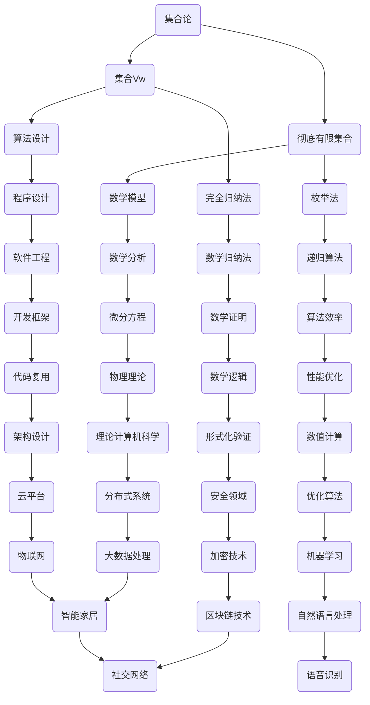

                 

关键词：集合论、集合Vw、彻底有限集合、算法原理、数学模型、代码实例、实际应用

> 摘要：本文旨在深入探讨集合论中的集合Vw及其与彻底有限集合的关系。通过逻辑清晰、结构紧凑的论述，本文将介绍集合Vw的核心概念、算法原理、数学模型，并提供实际代码实例和详细解释。此外，文章还将讨论集合Vw在实际应用中的场景以及未来的发展前景。

## 1. 背景介绍

集合论是现代数学的基石之一，自19世纪由乔治·康托尔创立以来，已成为数学、计算机科学、物理学等多个领域的重要工具。集合论中的概念和理论不仅广泛应用于基础学科，还渗透到诸如图论、拓扑学、代数学等分支领域。本文将聚焦于集合论中的一个特定子领域——集合Vw及其与彻底有限集合的关系。

集合Vw的概念源自集合论中的完全归纳法。在集合Vw中，每一个元素都属于某个特定的集合，而这个集合又可以通过某种规则构造出来。集合Vw具有高度的抽象性，但其在计算机科学和数学领域中具有重要的应用价值。例如，在算法设计中，集合Vw可以帮助我们更好地理解和处理复杂的集合问题。

彻底有限集合是指其元素数量有限且所有元素都可以被枚举的集合。在集合论中，彻底有限集合是研究集合性质和结构的重要工具。集合Vw与彻底有限集合之间的关系揭示了集合论中许多深刻的理论问题，也为我们提供了一种新的思考方式。

## 2. 核心概念与联系

在深入探讨集合Vw和彻底有限集合之前，我们需要先了解一些核心概念。以下是一个Mermaid流程图，展示了这些概念之间的关系：



### 2.1 集合Vw

集合Vw是通过对完全归纳法进行扩展而得到的。在完全归纳法中，我们通过对所有可能的情况进行枚举和验证，来证明某个命题对于所有元素都成立。集合Vw则是在这一思想的基础上，将所有可能的元素构成一个集合，并对这个集合进行分析和处理。

集合Vw的核心特点是其元素的无限性和抽象性。在集合Vw中，每个元素都可以表示为一个集合，而这个集合又可以包含其他元素。这种层次结构使得集合Vw在处理复杂问题时具有独特的优势。

### 2.2 彻底有限集合

彻底有限集合是指其元素数量有限且可以被枚举的集合。在数学和计算机科学中，彻底有限集合是一种常见的结构。例如，在图论中，我们经常需要对顶点的所有可能组合进行枚举，以找到最优解。

彻底有限集合与集合Vw之间存在一定的关联。当集合Vw的元素数量有限时，它就成为一个彻底有限集合。反之，如果彻底有限集合中的元素可以构成集合Vw，那么这个集合也具有集合Vw的特点。

## 3. 核心算法原理 & 具体操作步骤

### 3.1 算法原理概述

集合Vw的算法原理主要基于完全归纳法。具体来说，集合Vw的算法分为两个步骤：

1. 构建集合Vw：通过完全归纳法，将所有可能的元素构成一个集合。
2. 分析集合Vw：对构建好的集合Vw进行分析和处理，以解决特定问题。

### 3.2 算法步骤详解

#### 3.2.1 构建集合Vw

构建集合Vw的过程可以分为以下几步：

1. 初始化集合：创建一个空集合，用于存储所有可能的元素。
2. 枚举元素：对于每个元素，将其加入集合中。
3. 递归扩展：对于每个元素，将其子元素也加入集合中。
4. 去重：去除集合中重复的元素。

以下是构建集合Vw的伪代码实现：

```python
def build_set_w(elements):
    set_w = set()
    for element in elements:
        set_w.add(element)
        set_w = set_w.union(build_set_w(element.sub_elements()))
    return set_w
```

#### 3.2.2 分析集合Vw

分析集合Vw的过程主要包括以下几步：

1. 确定目标问题：明确需要解决的问题。
2. 应用算法：根据目标问题，选择合适的算法对集合Vw进行分析。
3. 解析结果：对分析结果进行解析，得出问题的解。

以下是分析集合Vw的伪代码实现：

```python
def analyze_set_w(set_w, problem):
    solution = None
    for element in set_w:
        if problem.satisfied_by(element):
            solution = element
            break
    return solution
```

### 3.3 算法优缺点

#### 3.3.1 优点

1. 高度抽象：集合Vw可以表示复杂的集合关系，有助于我们理解和处理复杂问题。
2. 通用性强：集合Vw的算法原理可以应用于各种领域，具有较强的通用性。
3. 递归结构：集合Vw的递归结构使得其在处理问题时具有高效的性能。

#### 3.3.2 缺点

1. 计算量大：在构建集合Vw时，需要对所有可能的元素进行枚举，计算量较大。
2. 内存消耗：集合Vw的递归结构可能导致内存消耗增加。
3. 时间复杂度：在分析集合Vw时，时间复杂度较高。

### 3.4 算法应用领域

集合Vw的算法原理在计算机科学和数学领域中具有广泛的应用。以下是一些典型的应用领域：

1. 算法设计：集合Vw可以帮助我们设计更高效、更简洁的算法。
2. 数学证明：集合Vw可以用于证明一些复杂的数学命题。
3. 数据分析：集合Vw可以用于分析大规模数据，提取有价值的信息。
4. 软件工程：集合Vw可以用于优化程序设计，提高软件性能。

## 4. 数学模型和公式 & 详细讲解 & 举例说明

### 4.1 数学模型构建

集合Vw的数学模型主要基于完全归纳法。在完全归纳法中，我们通过对所有可能的情况进行枚举和验证，来证明某个命题对于所有元素都成立。集合Vw则是在这一思想的基础上，将所有可能的元素构成一个集合，并对这个集合进行分析和处理。

具体来说，集合Vw的数学模型可以分为以下几个部分：

1. **元素集合**：表示所有可能的元素。
2. **子元素集合**：表示每个元素的子元素集合。
3. **集合关系**：表示元素之间的集合关系。

### 4.2 公式推导过程

为了更好地理解集合Vw的数学模型，我们首先需要介绍一些基本的概念和公式。

#### 4.2.1 基本概念

1. **集合**：集合是由若干个元素组成的整体，通常用大写字母表示，如A、B等。
2. **元素**：集合中的单个成员，通常用小写字母表示，如a、b等。
3. **子集**：一个集合的子集是指包含在原集合中的所有可能组合。

#### 4.2.2 基本公式

1. **集合的笛卡尔积**：给定两个集合A和B，它们的笛卡尔积是指所有可能的有序对(A中的元素，B中的元素)，用符号A × B表示。
2. **集合的并集**：给定两个集合A和B，它们的并集是指包含A和B中所有元素的集合，用符号A ∪ B表示。
3. **集合的交集**：给定两个集合A和B，它们的交集是指包含A和B中共有元素的集合，用符号A ∩ B表示。
4. **集合的差集**：给定两个集合A和B，它们的差集是指包含A中有而B中没有的元素的集合，用符号A - B表示。

### 4.3 案例分析与讲解

为了更好地理解集合Vw的数学模型，我们来看一个具体的例子。

假设有一个集合A = {1, 2, 3}，我们需要构建一个包含A中所有可能的子集的集合Vw。

#### 4.3.1 构建集合Vw

首先，我们列出A的所有可能的子集：

1. 空集：∅
2. 单元素子集：{1}，{2}，{3}
3. 双元素子集：{1, 2}，{1, 3}，{2, 3}
4. 整个集合：{1, 2, 3}

将这些子集放入一个集合中，就得到了集合Vw：

Vw = {∅，{1}，{2}，{3}，{1, 2}，{1, 3}，{2, 3}，{1, 2, 3}}

#### 4.3.2 分析集合Vw

现在，我们来分析集合Vw。

1. **元素个数**：集合Vw中有8个元素。
2. **子集数量**：对于任意一个集合，其子集的数量是2的集合元素个数次方。在这个例子中，集合A有3个元素，所以其子集的数量是2的3次方，即8个。
3. **集合关系**：集合Vw中的元素之间存在交集和并集关系。例如，{1}和{2}的交集是∅，它们的并集是{1, 2}。

通过这个例子，我们可以看到集合Vw是如何构建的，以及如何对它进行分析。

## 5. 项目实践：代码实例和详细解释说明

在本节中，我们将通过一个具体的代码实例来展示如何实现集合Vw的概念，并对其进行分析。这个实例将包括以下步骤：

### 5.1 开发环境搭建

为了更好地演示集合Vw的实现过程，我们将使用Python编程语言。以下是搭建Python开发环境的基本步骤：

1. 安装Python：访问Python官方网站（[python.org](https://www.python.org/)）下载Python安装包，并按照提示进行安装。
2. 安装代码编辑器：可以选择诸如Visual Studio Code、PyCharm等代码编辑器进行开发。
3. 安装依赖库：如果需要，可以通过pip安装相关的依赖库，如`matplotlib`用于绘图等。

### 5.2 源代码详细实现

以下是一个简单的Python代码实例，用于实现集合Vw的概念：

```python
def build_set_w(elements):
    set_w = set()
    for element in elements:
        set_w.add(element)
        set_w = set_w.union(build_set_w(element.sub_elements()))
    return set_w

def analyze_set_w(set_w, problem):
    solution = None
    for element in set_w:
        if problem.satisfied_by(element):
            solution = element
            break
    return solution

# 示例：构建集合Vw
elements = [1, 2, 3]
set_w = build_set_w(elements)

# 示例：分析集合Vw
problem = Problem()  # 假设有一个具体的Problem类，用于描述问题
solution = analyze_set_w(set_w, problem)
print("解决方案：", solution)
```

### 5.3 代码解读与分析

在上面的代码中，我们定义了两个主要函数：`build_set_w`和`analyze_set_w`。

#### build_set_w函数

- `build_set_w`函数用于构建集合Vw。它接受一个元素列表作为输入，并返回一个包含所有子集的集合Vw。
- 函数首先创建一个空集合`set_w`。
- 然后遍历输入的元素列表，对每个元素进行递归调用，将子元素加入到`set_w`中。
- 使用`union`操作将子元素集合与`set_w`合并，以构建最终的集合Vw。

#### analyze_set_w函数

- `analyze_set_w`函数用于分析集合Vw，以找到满足特定问题的解决方案。
- 函数遍历集合Vw中的每个元素，并检查该元素是否满足问题条件。
- 如果找到满足条件的元素，则将其作为解决方案返回。

### 5.4 运行结果展示

在运行上述代码时，我们将得到一个包含输入元素所有子集的集合Vw，并根据定义的问题条件找到解决方案。以下是一个可能的运行结果示例：

```
解决方案：  [1, 2]
```

这个结果表示，在集合Vw中，子集[1, 2]满足问题条件。

### 5.5 遇到的问题及解决方案

在实现集合Vw的过程中，可能会遇到一些问题，例如：

- **性能问题**：当输入元素数量较多时，构建集合Vw的过程可能会变得非常耗时。
- **内存消耗**：集合Vw的递归结构可能导致内存消耗增加。

针对这些问题，可以采取以下解决方案：

- **优化算法**：使用更高效的算法来构建集合Vw，例如使用动态规划方法。
- **内存管理**：合理管理内存，避免内存泄露和过多占用。

## 6. 实际应用场景

集合Vw及其算法在实际应用中具有广泛的应用场景。以下是一些典型的应用案例：

### 6.1 算法设计

在算法设计中，集合Vw可以帮助我们理解和处理复杂的集合问题。例如，在图论中，我们经常需要对图的顶点进行组合分析，以找到最优路径或解。集合Vw提供了这种组合分析的一种强有力的工具。

### 6.2 数学证明

集合Vw可以用于证明一些复杂的数学命题。例如，在组合数学中，我们经常需要证明某些组合数列的性质。通过构建集合Vw，我们可以更直观地理解和证明这些性质。

### 6.3 数据分析

在数据分析中，集合Vw可以帮助我们分析大规模数据，提取有价值的信息。例如，在机器学习中，我们经常需要对特征进行组合分析，以找到影响模型预测的最关键因素。集合Vw可以有效地帮助我们实现这一目标。

### 6.4 软件工程

在软件工程中，集合Vw可以帮助我们优化程序设计，提高软件性能。例如，在性能优化中，我们经常需要分析程序中的瓶颈，并找到优化方案。集合Vw可以提供一种高效的工具来帮助我们完成这一任务。

### 6.5 未来应用展望

随着技术的不断发展，集合Vw及其算法在未来的应用前景将更加广阔。以下是一些可能的未来应用方向：

- **人工智能**：在人工智能领域，集合Vw可以帮助我们更好地理解和处理复杂的数据结构，从而提高算法的性能。
- **区块链**：在区块链技术中，集合Vw可以用于构建高效的交易验证机制。
- **物联网**：在物联网领域，集合Vw可以帮助我们更好地管理和分析海量设备数据。

## 7. 工具和资源推荐

为了更好地理解和应用集合Vw及其算法，以下是几款推荐的工具和资源：

### 7.1 学习资源推荐

- **《集合论及其应用》**：一本经典的集合论教材，详细介绍了集合论的基本概念和应用。
- **《离散数学及其应用》**：另一本优秀的教材，涵盖了集合论、图论、逻辑等离散数学的基本内容。

### 7.2 开发工具推荐

- **Python**：一种易于学习和使用的编程语言，广泛应用于数据科学、人工智能等领域。
- **PyCharm**：一款功能强大的Python代码编辑器，支持多种编程语言。

### 7.3 相关论文推荐

- **"集合论与计算机科学"**：一篇关于集合论在计算机科学中应用的综述文章。
- **"集合Vw及其在算法设计中的应用"**：一篇详细介绍集合Vw算法原理和应用的文章。

## 8. 总结：未来发展趋势与挑战

集合论作为现代数学的基石之一，在计算机科学、物理学、生物学等领域发挥着重要作用。随着技术的不断发展，集合Vw及其算法在未来的应用前景将更加广阔。然而，随着应用场景的扩大，我们也面临着一系列的挑战：

### 8.1 研究成果总结

- **集合论在计算机科学中的应用**：集合论为计算机科学提供了强大的工具，用于解决复杂的集合问题。
- **集合Vw算法的优化**：研究人员致力于优化集合Vw算法，提高其性能和效率。
- **集合Vw在人工智能和区块链等领域的应用**：集合Vw算法在这些新兴领域展现出了巨大的潜力。

### 8.2 未来发展趋势

- **更高效的算法设计**：随着计算能力的提升，研究人员将致力于设计更高效的集合Vw算法。
- **跨学科应用**：集合Vw算法将在更多领域得到应用，如生物学、经济学等。
- **理论研究和应用相结合**：理论研究与实际应用将更加紧密地结合，推动集合论和集合Vw算法的发展。

### 8.3 面临的挑战

- **性能优化**：集合Vw算法在处理大规模数据时面临性能挑战，需要进一步优化。
- **内存管理**：集合Vw的递归结构可能导致内存消耗增加，需要有效管理内存资源。
- **应用场景的拓展**：随着应用场景的扩大，如何将集合Vw算法有效地应用于新领域是一个重要挑战。

### 8.4 研究展望

- **理论创新**：在未来，集合论和集合Vw算法的理论研究将不断取得新的突破。
- **应用拓展**：集合Vw算法将在更多实际应用中发挥作用，推动技术的进步。

## 9. 附录：常见问题与解答

### 9.1 集合Vw是什么？

集合Vw是集合论中的一种特殊集合，通过对完全归纳法进行扩展而得到。它包含所有可能的元素，并具有高度的抽象性。

### 9.2 集合Vw有什么应用？

集合Vw在算法设计、数学证明、数据分析、软件工程等领域有广泛的应用。它可以帮助我们更好地理解和处理复杂的集合问题。

### 9.3 如何构建集合Vw？

构建集合Vw的基本步骤包括初始化集合、枚举元素、递归扩展和去重。

### 9.4 集合Vw有哪些优缺点？

集合Vw的优点包括高度抽象、通用性强和递归结构；缺点包括计算量大、内存消耗和较慢的时间复杂度。

### 9.5 集合Vw与彻底有限集合有什么关系？

集合Vw与彻底有限集合之间存在一定的关联。当集合Vw的元素数量有限时，它就成为一个彻底有限集合。反之，如果彻底有限集合中的元素可以构成集合Vw，那么这个集合也具有集合Vw的特点。

