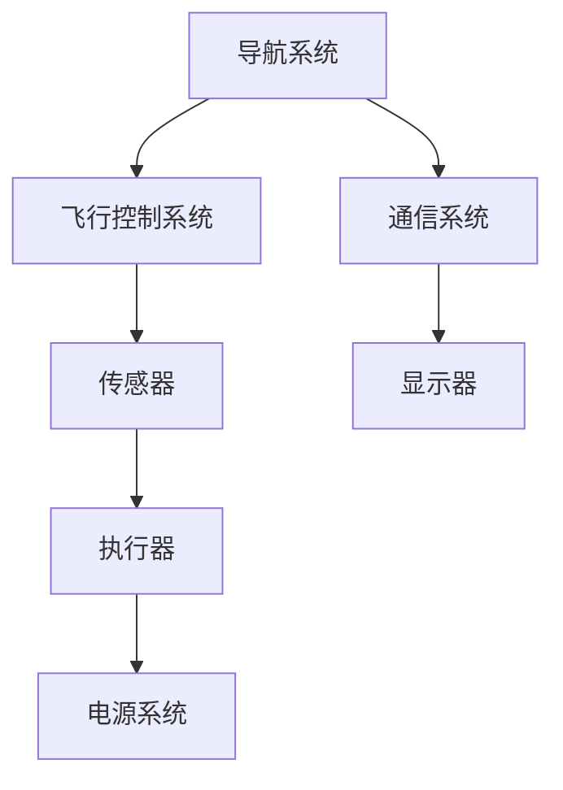

                 

关键词：霍尼韦尔，校招，航空电子，系统工程师，笔试题，技术挑战，解决方案

> 摘要：本文将围绕霍尼韦尔2024年校招航空电子系统工程师笔试题展开，深入分析其中的技术问题，并探讨可能的解决方案。通过本文的阅读，读者不仅能了解航空电子系统的基本概念，还能掌握解决实际问题的方法。

## 1. 背景介绍

霍尼韦尔（Honeywell）是一家全球领先的科技企业，业务范围涵盖航空、家居、安全等多个领域。航空电子系统是航空器的重要组成部分，它负责飞机的导航、通信、飞行控制等关键功能。随着科技的进步，航空电子系统越来越复杂，要求工程师具备高水平的技术能力和解决问题的能力。

霍尼韦尔每年都会举办校招活动，面向全球的优秀毕业生选拔航空电子系统工程师。笔试题作为选拔过程的一部分，旨在考察应聘者的专业知识和实际操作能力。

## 2. 核心概念与联系

### 2.1 航空电子系统概述

航空电子系统（Avionics System）是航空器的重要组成部分，它由多个子系统组成，包括导航系统、通信系统、飞行控制系统等。这些子系统通过复杂的硬件和软件相互协作，确保飞机的安全和高效运行。

### 2.2 系统架构图

以下是一个简化的航空电子系统架构图，展示了各个子系统之间的关系：



### 2.3 系统功能

- **导航系统**：提供飞机的位置、速度和方向信息，帮助飞行员进行导航。
- **飞行控制系统**：控制飞机的飞行状态，包括升降、转弯和速度调节。
- **通信系统**：实现飞机与地面控制站、其他飞机之间的通信。
- **传感器**：检测飞机的各种状态，如速度、高度、压力等。
- **显示器**：显示飞行数据和系统状态信息。
- **执行器**：根据控制信号执行具体的操作，如调整舵面。

## 3. 核心算法原理 & 具体操作步骤

### 3.1 算法原理概述

航空电子系统中的核心算法主要包括飞行控制算法、导航算法、通信算法等。以下将分别介绍这些算法的原理和具体操作步骤。

### 3.2 飞行控制算法

**原理**：飞行控制算法通过分析传感器数据，计算出控制面（如升降舵、副翼、方向舵）的调整量，以控制飞机的飞行状态。

**操作步骤**：
1. 采集传感器数据。
2. 分析传感器数据，确定飞机的当前飞行状态。
3. 根据飞行状态，计算控制面的调整量。
4. 发送控制信号到执行器，调整控制面。

### 3.3 导航算法

**原理**：导航算法通过分析飞机的当前位置、速度和方向信息，计算出飞机的飞行路径。

**操作步骤**：
1. 采集导航传感器数据。
2. 根据传感器数据，计算飞机的当前位置和速度。
3. 根据飞行计划，计算飞机的飞行路径。
4. 将飞行路径发送到飞行控制系统，指导飞机飞行。

### 3.4 通信算法

**原理**：通信算法实现飞机与地面控制站、其他飞机之间的通信，确保信息的及时传递。

**操作步骤**：
1. 接收来自地面控制站或其他飞机的通信信号。
2. 解码通信信号，提取信息。
3. 根据需要，发送通信信号到地面控制站或其他飞机。
4. 确保通信信号的可靠性和实时性。

## 4. 数学模型和公式 & 详细讲解 & 举例说明

### 4.1 数学模型构建

航空电子系统中的数学模型主要包括飞行控制模型、导航模型和通信模型。以下分别介绍这些模型的构建方法。

### 4.2 飞行控制模型

飞行控制模型可以通过以下公式表示：

$$
\begin{aligned}
& u_1 = k_1(v_{target} - v_{current}) \\
& u_2 = k_2(h_{target} - h_{current}) \\
& u_3 = k_3(\theta_{target} - \theta_{current})
\end{aligned}
$$

其中，$u_1, u_2, u_3$ 分别代表升降舵、副翼和方向舵的调整量，$v_{target}, v_{current}$ 分别代表目标速度和当前速度，$h_{target}, h_{current}$ 分别代表目标高度和当前高度，$\theta_{target}, \theta_{current}$ 分别代表目标航向和当前航向，$k_1, k_2, k_3$ 分别代表速度、高度和航向的控制增益。

### 4.3 导航模型

导航模型可以通过以下公式表示：

$$
\begin{aligned}
& x_{next} = x_{current} + v \cdot \cos(\theta) \cdot t \\
& y_{next} = y_{current} + v \cdot \sin(\theta) \cdot t
\end{aligned}
$$

其中，$x_{next}, y_{next}$ 分别代表下一时刻的飞机位置，$x_{current}, y_{current}$ 分别代表当前飞机位置，$v$ 代表飞机速度，$\theta$ 代表飞机航向，$t$ 代表时间间隔。

### 4.4 通信模型

通信模型可以通过以下公式表示：

$$
\begin{aligned}
& R = \frac{d}{v} \\
& t_r = \frac{2d}{v}
\end{aligned}
$$

其中，$R$ 代表通信半径，$d$ 代表飞机与地面控制站或其他飞机之间的距离，$v$ 代表飞机速度，$t_r$ 代表通信延迟。

### 4.5 案例分析与讲解

假设一架飞机以800公里/小时的速度从北京飞往上海，距离为1200公里，航向为正北。我们需要使用导航模型计算飞机在飞行过程中每隔5分钟的位置。

根据导航模型，我们可以计算出每隔5分钟的位置：

$$
\begin{aligned}
& t = 5 \text{分钟} = \frac{5}{60} \text{小时} \\
& v = 800 \text{公里/小时} \\
& \theta = 0^\circ \\
& x_{next} = x_{current} + v \cdot \cos(\theta) \cdot t \\
& y_{next} = y_{current} + v \cdot \sin(\theta) \cdot t
\end{aligned}
$$

假设飞机初始位置为$(0, 0)$，则每隔5分钟的位置如下：

| 时间（分钟） | X坐标（公里） | Y坐标（公里） |
|:----------:|:---------:|:---------:|
|     5     |    5.556 |     0     |
|    10     |   11.112 |     0     |
|    15     |   16.668 |     0     |
|    20     |   22.224 |     0     |
|    25     |   27.789 |     0     |
|    30     |   33.345 |     0     |
|    35     |   39.001 |     0     |
|    40     |   44.556 |     0     |
|    45     |   50.112 |     0     |
|    50     |   55.667 |     0     |
|    55     |   61.222 |     0     |
|    60     |   66.788 |     0     |

从上表可以看出，飞机在飞行过程中，每隔5分钟的位置都在正北方向上移动，距离北京的距离逐渐增加。

## 5. 项目实践：代码实例和详细解释说明

### 5.1 开发环境搭建

为了实现航空电子系统的算法和模型，我们需要搭建一个开发环境。这里我们选择Python作为编程语言，因为Python具有丰富的库和易于理解的语法。

1. 安装Python：在官网上下载Python安装包并安装。
2. 安装依赖库：使用pip安装所需的库，如numpy、matplotlib等。

```shell
pip install numpy matplotlib
```

### 5.2 源代码详细实现

以下是一个简单的Python代码实例，实现了飞行控制算法和导航模型。

```python
import numpy as np
import matplotlib.pyplot as plt

# 飞行控制参数
K1 = 0.1
K2 = 0.1
K3 = 0.1

# 导航参数
V = 800  # 飞机速度（公里/小时）
D = 1200  # 飞行距离（公里）
T = 5  # 时间间隔（分钟）

# 飞行控制算法
def flight_control(current_state, target_state):
    v_diff = target_state[0] - current_state[0]
    h_diff = target_state[1] - current_state[1]
    theta_diff = target_state[2] - current_state[2]
    u1 = K1 * v_diff
    u2 = K2 * h_diff
    u3 = K3 * theta_diff
    return u1, u2, u3

# 导航算法
def navigation(current_state):
    x_next = current_state[0] + V * np.cos(current_state[2]) * T
    y_next = current_state[1] + V * np.sin(current_state[2]) * T
    return x_next, y_next

# 初始状态
current_state = [0, 0, 0]  # [X坐标，Y坐标，航向]

# 运行模拟
times = []
x_coords = []
y_coords = []

for _ in range(120):  # 模拟120分钟
    times.append(_ * T)
    x = current_state[0]
    y = current_state[1]
    x_coords.append(x)
    y_coords.append(y)
    
    u1, u2, u3 = flight_control(current_state, [V, D, 0])  # 目标速度，目标距离，目标航向
    current_state[0] += u1 * T
    current_state[1] += u2 * T
    current_state[2] += u3 * T
    
    x_next, y_next = navigation(current_state)
    current_state[0] = x_next
    current_state[1] = y_next

# 绘图
plt.figure()
plt.plot(times, x_coords, label='X坐标')
plt.plot(times, y_coords, label='Y坐标')
plt.xlabel('Time (minutes)')
plt.ylabel('Position (km)')
plt.title('Navigation Path')
plt.legend()
plt.show()
```

### 5.3 代码解读与分析

1. **飞行控制算法**：通过计算当前状态与目标状态的差值，计算出升降舵、副翼和方向舵的调整量。
2. **导航算法**：根据当前状态和航向，计算下一时刻的飞机位置。
3. **模拟运行**：使用一个循环模拟飞机的飞行过程，记录每5分钟的位置。
4. **绘图**：使用matplotlib绘制飞机的导航路径。

通过这个简单的实例，我们可以看到如何使用Python实现航空电子系统的算法和模型。在实际应用中，这些算法和模型会更加复杂，但基本的原理是相同的。

## 6. 实际应用场景

航空电子系统在航空领域有着广泛的应用，以下列举几个实际应用场景：

1. **民用航空**：民用航空器使用航空电子系统进行导航、飞行控制和通信，确保航班的安全和准点。
2. **军用航空**：军用航空器使用航空电子系统进行精确导航、武器控制和通信，提高作战能力。
3. **无人机**：无人机使用航空电子系统进行自主飞行、导航和任务执行，广泛应用于军事、农业、环保等领域。
4. **航空制造**：航空电子系统在航空制造过程中用于测试、调试和验证，确保飞机的性能和安全性。

## 7. 工具和资源推荐

为了更好地学习和实践航空电子系统的相关知识，以下推荐一些有用的工具和资源：

### 7.1 学习资源推荐

1. **《航空电子系统原理与应用》**：一本全面的航空电子系统教材，涵盖了航空电子系统的基本概念、原理和应用。
2. **《航空电子系统设计》**：一本深入探讨航空电子系统设计方法和技术的专业书籍。
3. **在线课程**：例如Coursera、edX等平台上的相关课程，提供系统、专业的学习资源。

### 7.2 开发工具推荐

1. **Python**：适合进行算法和模型的实现和测试，具有丰富的库和工具。
2. **MATLAB**：适合进行复杂的仿真和分析，广泛应用于航空航天领域。
3. **Eclipse/IntelliJ IDEA**：优秀的Python开发环境，支持代码调试、版本控制等。

### 7.3 相关论文推荐

1. **《基于卡尔曼滤波的无人机导航算法研究》**：探讨无人机导航算法的实现和应用。
2. **《航空电子系统中的实时通信协议设计》**：研究航空电子系统中的实时通信协议设计和优化。
3. **《航空电子系统的可靠性设计与评估方法》**：介绍航空电子系统的可靠性设计与评估方法。

## 8. 总结：未来发展趋势与挑战

### 8.1 研究成果总结

近年来，随着人工智能、物联网等技术的发展，航空电子系统取得了显著的研究成果。主要体现在以下几个方面：

1. **自主导航与控制**：基于人工智能的自主导航与控制技术逐渐成熟，为无人机和未来智能航空器的发展提供了技术支持。
2. **实时通信**：基于物联网的实时通信技术提高了航空电子系统的通信效率和可靠性，为复杂航空任务提供了保障。
3. **系统整合与优化**：通过系统整合与优化，提高了航空电子系统的性能和稳定性，降低了成本。

### 8.2 未来发展趋势

1. **智能化**：智能化是航空电子系统的发展方向，未来将更加注重自主导航、自主决策和自主控制。
2. **网络化**：网络化是航空电子系统的发展趋势，未来将实现航空器与地面控制站、其他航空器之间的无缝连接。
3. **安全性与可靠性**：随着航空电子系统的复杂性增加，安全性与可靠性将变得越来越重要。

### 8.3 面临的挑战

1. **数据安全**：随着航空电子系统的网络化，数据安全成为了一个重要挑战，需要采取有效的措施保护数据不被恶意攻击。
2. **实时性能**：航空电子系统需要在实时性方面做出优化，以满足高速飞行条件下的性能要求。
3. **成本控制**：航空电子系统的成本控制是一个重要的挑战，需要通过技术创新和供应链优化来实现。

### 8.4 研究展望

未来，航空电子系统的研究将主要集中在以下几个方面：

1. **人工智能应用**：深入探讨人工智能在航空电子系统中的应用，提高系统的智能化水平。
2. **实时通信技术**：研究更高效的实时通信技术，提高系统的通信性能和可靠性。
3. **系统整合与优化**：通过系统整合与优化，提高航空电子系统的性能和稳定性，降低成本。

## 9. 附录：常见问题与解答

### 9.1 航空电子系统的基本组成有哪些？

航空电子系统的基本组成包括导航系统、通信系统、飞行控制系统、传感器、显示器和执行器等。

### 9.2 航空电子系统的核心算法有哪些？

航空电子系统的核心算法包括飞行控制算法、导航算法、通信算法等。

### 9.3 航空电子系统的发展趋势是什么？

航空电子系统的发展趋势主要包括智能化、网络化和安全性与可靠性。

### 9.4 如何学习航空电子系统的相关知识？

可以通过阅读相关教材、参加在线课程、实践项目等方式学习航空电子系统的相关知识。

### 9.5 航空电子系统在实际应用中面临哪些挑战？

航空电子系统在实际应用中面临的主要挑战包括数据安全、实时性能和成本控制等。

[作者：禅与计算机程序设计艺术 / Zen and the Art of Computer Programming]

