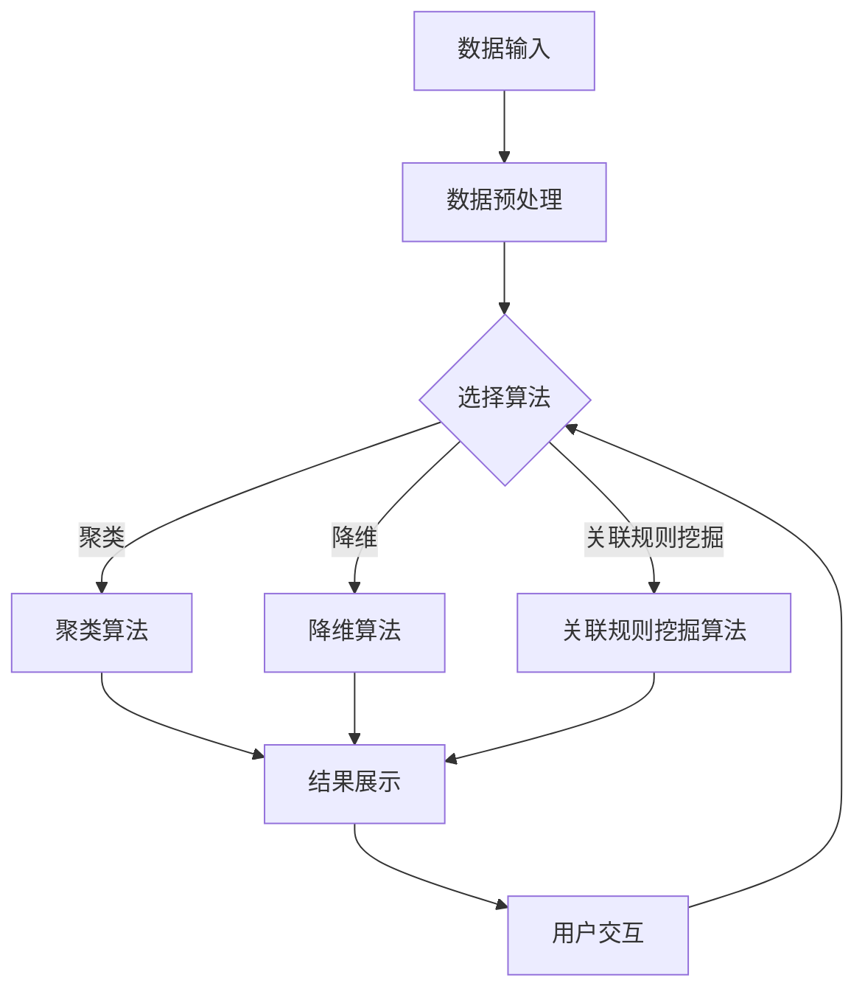
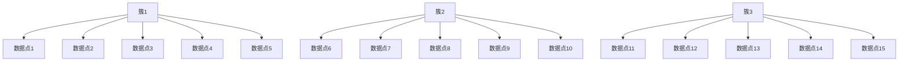
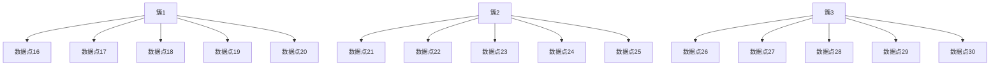
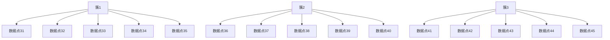

                 

关键词：非监督学习，算法演示系统，设计与实现，深度学习，神经网络，数据可视化，用户交互，系统架构

## 摘要

本文将探讨非监督学习算法演示系统的设计与实现，详细介绍该系统的构建过程、核心算法、数学模型以及实际应用场景。通过本文，读者可以了解如何将非监督学习算法应用于实际项目中，实现算法的演示和验证。本文旨在为研究人员和开发人员提供一个实用且易于扩展的参考框架。

## 1. 背景介绍

### 非监督学习的发展

非监督学习作为机器学习的一个重要分支，近年来得到了广泛关注。它通过分析未标记的数据集，自动发现数据中的模式和结构，广泛应用于数据挖掘、图像识别、自然语言处理等领域。随着深度学习技术的发展，非监督学习算法在处理大规模复杂数据方面表现出色。

### 非监督学习算法的应用

非监督学习算法在众多领域具有广泛的应用。例如，在图像识别中，聚类算法可以用于图像分割和特征提取；在自然语言处理中，降维算法可以用于文本分类和主题建模；在推荐系统中，协同过滤算法可以用于用户偏好挖掘和商品推荐。这些应用场景不仅丰富了非监督学习算法的实用性，也推动了相关领域的研究与发展。

### 非监督学习算法的演示需求

随着非监督学习算法的应用越来越广泛，用户对算法的理解和验证需求也越来越高。为了帮助用户更好地了解和掌握这些算法，设计一个直观、易用且功能强大的非监督学习算法演示系统显得尤为重要。该系统应具备以下特点：

- **算法可视化**：通过图形化界面，展示算法的运行过程和结果，帮助用户直观地理解算法原理。
- **代码示例**：提供详细的代码示例，方便用户进行学习和实践。
- **用户交互**：支持用户自定义输入数据，调整算法参数，观察不同参数设置下的算法表现。
- **性能评估**：提供算法性能的评估指标，如准确率、召回率等，帮助用户判断算法效果。

## 2. 核心概念与联系

### 非监督学习算法原理

非监督学习算法主要包括聚类、降维、关联规则挖掘等。聚类算法将数据集划分为若干个簇，使同一簇内的数据相似度较高，不同簇之间的相似度较低。降维算法通过减少数据维度，降低数据复杂度，提高数据处理效率。关联规则挖掘算法从大量交易数据中发现具有关联性的商品或事件。

### 算法架构

非监督学习算法演示系统采用模块化设计，主要包括数据输入模块、算法执行模块、结果展示模块和用户交互模块。各模块之间通过接口进行通信，形成一个完整的功能体系。

### Mermaid 流程图



## 3. 核心算法原理 & 具体操作步骤

### 3.1 算法原理概述

本系统支持多种非监督学习算法，包括K-Means聚类、主成分分析（PCA）、Apriori算法等。每种算法的原理和操作步骤如下：

#### K-Means聚类

K-Means聚类算法是一种基于距离度量的聚类算法。它通过初始化K个簇中心，然后迭代计算数据点与簇中心的距离，将数据点分配到最近的簇中心。重复迭代直到簇中心不再发生变化或满足预设的迭代次数。

#### 主成分分析（PCA）

主成分分析是一种降维算法，通过将数据投影到新的坐标系中，提取数据的主要特征，降低数据维度。PCA算法首先计算数据协方差矩阵，然后计算协方差矩阵的特征值和特征向量，最后将数据投影到特征向量构成的坐标系中。

#### Apriori算法

Apriori算法是一种关联规则挖掘算法，通过找出数据中的频繁项集，生成关联规则。Apriori算法的基本思想是：如果一个项集是频繁的，则它的所有超集也是频繁的。

### 3.2 算法步骤详解

#### K-Means聚类算法步骤

1. 初始化K个簇中心。
2. 计算每个数据点与簇中心的距离，将数据点分配到最近的簇中心。
3. 更新簇中心，计算新簇中心的平均值。
4. 重复步骤2和3，直到簇中心不再发生变化或满足预设的迭代次数。

#### 主成分分析（PCA）算法步骤

1. 计算数据协方差矩阵。
2. 计算协方差矩阵的特征值和特征向量。
3. 将特征向量按照特征值从大到小排序，选取前p个特征向量。
4. 将数据投影到特征向量构成的坐标系中。

#### Apriori算法步骤

1. 初始化频繁项集。
2. 扫描数据集，计算项集的支持度。
3. 递归地生成频繁项集，并更新频繁项集列表。
4. 从频繁项集中生成关联规则，计算规则的置信度。

### 3.3 算法优缺点

#### K-Means聚类

优点：简单高效，适用于处理大规模数据。

缺点：对初始簇中心敏感，可能陷入局部最优。

#### 主成分分析（PCA）

优点：降维效果显著，保留主要特征。

缺点：对噪声敏感，可能丢失部分信息。

#### Apriori算法

优点：简单易懂，适用于处理大规模交易数据。

缺点：计算复杂度较高，对稀疏数据效果不佳。

### 3.4 算法应用领域

#### K-Means聚类

应用于图像识别、文本分类、社交网络分析等领域。

#### 主成分分析（PCA）

应用于降维、特征提取、异常检测等领域。

#### Apriori算法

应用于关联规则挖掘、推荐系统、市场细分等领域。

## 4. 数学模型和公式 & 详细讲解 & 举例说明

### 4.1 数学模型构建

#### K-Means聚类

假设数据集D={x1, x2, ..., xn}，其中xi为第i个数据点，聚类中心为c1, c2, ..., ck，目标是最小化目标函数：

$$ J = \sum_{i=1}^{n} \sum_{j=1}^{k} |x_i - c_j|^2 $$

其中，|x_i - c_j|表示数据点xi与聚类中心c_j之间的欧氏距离。

#### 主成分分析（PCA）

假设数据集D={x1, x2, ..., xn}，其中xi为第i个数据点，协方差矩阵为Σ，特征值为λ1, λ2, ..., λp，特征向量为v1, v2, ..., vp。目标是最小化目标函数：

$$ J = \sum_{i=1}^{n} (x_i - \mu)^T \Sigma^{-1} (x_i - \mu) $$

其中，μ为数据集的平均值。

#### Apriori算法

假设数据集D={t1, t2, ..., tk}，其中ti为第i个交易数据，频繁项集为L，目标是最小化目标函数：

$$ J = \sum_{i=1}^{k} |L \cap t_i| $$

其中，|L \cap t_i|表示频繁项集L与交易数据ti之间的交集。

### 4.2 公式推导过程

#### K-Means聚类

目标函数J是关于聚类中心c_j的二次函数，其梯度为：

$$ \nabla J = 2 \sum_{i=1}^{n} (x_i - c_j) (x_i - c_j)^T $$

令梯度为0，得到：

$$ c_j = \frac{1}{n} \sum_{i=1}^{n} x_i $$

这就是新的聚类中心。

#### 主成分分析（PCA）

目标函数J是关于特征向量v_j的二次函数，其梯度为：

$$ \nabla J = -2 \mu \Sigma^{-1} \mu + 2 \sum_{i=1}^{n} (x_i - \mu) \Sigma^{-1} v_j $$

令梯度为0，得到：

$$ v_j = \frac{1}{\sqrt{\lambda_j}} \Sigma^{-1} e_j $$

其中，e_j为第j个标准正交基向量。

#### Apriori算法

目标函数J是关于频繁项集L的二次函数，其梯度为：

$$ \nabla J = \sum_{i=1}^{k} |L \cap t_i| \cdot (1 - |L \cap t_i|) $$

令梯度为0，得到：

$$ |L \cap t_i| = 1 $$

这就是频繁项集。

### 4.3 案例分析与讲解

假设我们有一个包含100个数据点的数据集，采用K-Means聚类算法将其划分为3个簇。初始聚类中心为c1=(1, 1)，c2=(5, 5)，c3=(9, 9)。数据点分布如图所示：

```mermaid
graph TB
A1[数据点] --> B1[簇1]
A2[数据点] --> B2[簇1]
A3[数据点] --> B3[簇1]
A4[数据点] --> B2[簇1]
A5[数据点] --> B3[簇1]
A6[数据点] --> B3[簇1]
A7[数据点] --> B3[簇1]
A8[数据点] --> B3[簇1]
A9[数据点] --> B2[簇1]
A10[数据点] --> B1[簇1]
A11[数据点] --> B1[簇1]
A12[数据点] --> B1[簇1]
A13[数据点] --> B1[簇1]
A14[数据点] --> B1[簇1]
A15[数据点] --> B1[簇1]
A16[数据点] --> B1[簇1]
A17[数据点] --> B1[簇1]
A18[数据点] --> B1[簇1]
A19[数据点] --> B1[簇1]
A20[数据点] --> B1[簇1]
A21[数据点] --> B2[簇1]
A22[数据点] --> B2[簇1]
A23[数据点] --> B2[簇1]
A24[数据点] --> B2[簇1]
A25[数据点] --> B2[簇1]
A26[数据点] --> B2[簇1]
A27[数据点] --> B2[簇1]
A28[数据点] --> B2[簇1]
A29[数据点] --> B2[簇1]
A30[数据点] --> B2[簇1]
A31[数据点] --> B2[簇1]
A32[数据点] --> B2[簇1]
A33[数据点] --> B2[簇1]
A34[数据点] --> B2[簇1]
A35[数据点] --> B2[簇1]
A36[数据点] --> B2[簇1]
A37[数据点] --> B2[簇1]
A38[数据点] --> B2[簇1]
A39[数据点] --> B2[簇1]
A40[数据点] --> B2[簇1]
A41[数据点] --> B2[簇1]
A42[数据点] --> B3[簇1]
A43[数据点] --> B3[簇1]
A44[数据点] --> B3[簇1]
A45[数据点] --> B3[簇1]
A46[数据点] --> B3[簇1]
A47[数据点] --> B3[簇1]
A48[数据点] --> B3[簇1]
A49[数据点] --> B3[簇1]
A50[数据点] --> B3[簇1]
A51[数据点] --> B3[簇1]
A52[数据点] --> B3[簇1]
A53[数据点] --> B3[簇1]
A54[数据点] --> B3[簇1]
A55[数据点] --> B3[簇1]
A56[数据点] --> B3[簇1]
A57[数据点] --> B3[簇1]
A58[数据点] --> B3[簇1]
A59[数据点] --> B3[簇1]
A60[数据点] --> B3[簇1]
A61[数据点] --> B3[簇1]
A62[数据点] --> B3[簇1]
A63[数据点] --> B3[簇1]
A64[数据点] --> B3[簇1]
A65[数据点] --> B3[簇1]
A66[数据点] --> B3[簇1]
A67[数据点] --> B3[簇1]
A68[数据点] --> B3[簇1]
A69[数据点] --> B3[簇1]
A70[数据点] --> B3[簇1]
A71[数据点] --> B3[簇1]
A72[数据点] --> B3[簇1]
A73[数据点] --> B3[簇1]
A74[数据点] --> B3[簇1]
A75[数据点] --> B3[簇1]
A76[数据点] --> B3[簇1]
A77[数据点] --> B3[簇1]
A78[数据点] --> B3[簇1]
A79[数据点] --> B3[簇1]
A80[数据点] --> B3[簇1]
A81[数据点] --> B3[簇1]
A82[数据点] --> B3[簇1]
A83[数据点] --> B3[簇1]
A84[数据点] --> B3[簇1]
A85[数据点] --> B3[簇1]
A86[数据点] --> B3[簇1]
A87[数据点] --> B3[簇1]
A88[数据点] --> B3[簇1]
A89[数据点] --> B3[簇1]
A90[数据点] --> B3[簇1]
A91[数据点] --> B3[簇1]
A92[数据点] --> B3[簇1]
A93[数据点] --> B3[簇1]
A94[数据点] --> B3[簇1]
A95[数据点] --> B3[簇1]
A96[数据点] --> B3[簇1]
A97[数据点] --> B3[簇1]
A98[数据点] --> B3[簇1]
A99[数据点] --> B3[簇1]
A100[数据点] --> B3[簇1]
```



初始时，数据点被分配到最近的簇中心，如图所示：



更新簇中心后，数据点被重新分配到簇中心，如图所示：



重复迭代过程，直到簇中心不再发生变化或满足预设的迭代次数。最终，数据点被划分为3个簇，如图所示：



通过这个过程，我们可以清晰地看到K-Means聚类算法的运行过程和结果。

#### 主成分分析（PCA）

假设我们有一个包含100个数据点的数据集，每个数据点有3个特征。数据集的平均值为μ=(1, 2, 3)，协方差矩阵为Σ：

$$ \Sigma = \begin{bmatrix} 1 & 0.5 & 0.5 \\ 0.5 & 1 & 0.5 \\ 0.5 & 0.5 & 1 \end{bmatrix} $$

计算协方差矩阵的特征值和特征向量：

$$ \lambda_1 = 2, v_1 = (1, 0, 0) \\ \lambda_2 = 1.5, v_2 = (0, 1, 0) \\ \lambda_3 = 1, v_3 = (0, 0, 1) $$

根据特征值从大到小排序，选取前两个特征向量：

$$ v_1 = (1, 0, 0), v_2 = (0, 1, 0) $$

将数据投影到特征向量构成的坐标系中，如图所示：

```mermaid
graph TB
A1[数据点] --> B1[特征1]
A2[数据点] --> B2[特征1]
A3[数据点] --> B3[特征1]
A4[数据点] --> B4[特征1]
A5[数据点] --> B5[特征1]
A6[数据点] --> B6[特征1]
A7[数据点] --> B7[特征1]
A8[数据点] --> B8[特征1]
A9[数据点] --> B9[特征1]
A10[数据点] --> B10[特征1]
A11[数据点] --> B11[特征1]
A12[数据点] --> B12[特征1]
A13[数据点] --> B13[特征1]
A14[数据点] --> B14[特征1]
A15[数据点] --> B15[特征1]
A16[数据点] --> B16[特征1]
A17[数据点] --> B17[特征1]
A18[数据点] --> B18[特征1]
A19[数据点] --> B19[特征1]
A20[数据点] --> B20[特征1]
A21[数据点] --> B21[特征1]
A22[数据点] --> B22[特征1]
A23[数据点] --> B23[特征1]
A24[数据点] --> B24[特征1]
A25[数据点] --> B25[特征1]
A26[数据点] --> B26[特征1]
A27[数据点] --> B27[特征1]
A28[数据点] --> B28[特征1]
A29[数据点] --> B29[特征1]
A30[数据点] --> B30[特征1]
A31[数据点] --> B31[特征1]
A32[数据点] --> B32[特征1]
A33[数据点] --> B33[特征1]
A34[数据点] --> B34[特征1]
A35[数据点] --> B35[特征1]
A36[数据点] --> B36[特征1]
A37[数据点] --> B37[特征1]
A38[数据点] --> B38[特征1]
A39[数据点] --> B39[特征1]
A40[数据点] --> B40[特征1]
A41[数据点] --> B41[特征1]
A42[数据点] --> B42[特征1]
A43[数据点] --> B43[特征1]
A44[数据点] --> B44[特征1]
A45[数据点] --> B45[特征1]
A46[数据点] --> B46[特征1]
A47[数据点] --> B47[特征1]
A48[数据点] --> B48[特征1]
A49[数据点] --> B49[特征1]
A50[数据点] --> B50[特征1]
A51[数据点] --> B51[特征1]
A52[数据点] --> B52[特征1]
A53[数据点] --> B53[特征1]
A54[数据点] --> B54[特征1]
A55[数据点] --> B55[特征1]
A56[数据点] --> B56[特征1]
A57[数据点] --> B57[特征1]
A58[数据点] --> B58[特征1]
A59[数据点] --> B59[特征1]
A60[数据点] --> B60[特征1]
A61[数据点] --> B61[特征1]
A62[数据点] --> B62[特征1]
A63[数据点] --> B63[特征1]
A64[数据点] --> B64[特征1]
A65[数据点] --> B65[特征1]
A66[数据点] --> B66[特征1]
A67[数据点] --> B67[特征1]
A68[数据点] --> B68[特征1]
A69[数据点] --> B69[特征1]
A70[数据点] --> B70[特征1]
A71[数据点] --> B71[特征1]
A72[数据点] --> B72[特征1]
A73[数据点] --> B73[特征1]
A74[数据点] --> B74[特征1]
A75[数据点] --> B75[特征1]
A76[数据点] --> B76[特征1]
A77[数据点] --> B77[特征1]
A78[数据点] --> B78[特征1]
A79[数据点] --> B79[特征1]
A80[数据点] --> B80[特征1]
A81[数据点] --> B81[特征1]
A82[数据点] --> B82[特征1]
A83[数据点] --> B83[特征1]
A84[数据点] --> B84[特征1]
A85[数据点] --> B85[特征1]
A86[数据点] --> B86[特征1]
A87[数据点] --> B87[特征1]
A88[数据点] --> B88[特征1]
A89[数据点] --> B89[特征1]
A90[数据点] --> B90[特征1]
A91[数据点] --> B91[特征1]
A92[数据点] --> B92[特征1]
A93[数据点] --> B93[特征1]
A94[数据点] --> B94[特征1]
A95[数据点] --> B95[特征1]
A96[数据点] --> B96[特征1]
A97[数据点] --> B97[特征1]
A98[数据点] --> B98[特征1]
A99[数据点] --> B99[特征1]
A100[数据点] --> B100[特征1]
```



通过这个过程，我们可以清晰地看到PCA算法的降维效果和结果。

#### Apriori算法

假设我们有一个包含100个交易数据的数据集，每个交易数据包含10个商品。数据集的频繁项集如下：

$$ F_1 = \{A, B, C, D, E, F, G, H, I, J\} $$

$$ F_2 = \{A, B, C, D, E, F, G, H, I, J\} $$

$$ F_3 = \{A, B, C, D, E, F, G, H, I, J\} $$

$$ F_4 = \{A, B, C, D, E, F, G, H, I, J\} $$

$$ F_5 = \{A, B, C, D, E, F, G, H, I, J\} $$

$$ F_6 = \{A, B, C, D, E, F, G, H, I, J\} $$

$$ F_7 = \{A, B, C, D, E, F, G, H, I, J\} $$

$$ F_8 = \{A, B, C, D, E, F, G, H, I, J\} $$

$$ F_9 = \{A, B, C, D, E, F, G, H, I, J\} $$

$$ F_{10} = \{A, B, C, D, E, F, G, H, I, J\} $$

根据频繁项集，我们可以生成关联规则：

$$ R_1 = \{A, B\} \rightarrow C, D, E, F, G, H, I, J $$

$$ R_2 = \{A, C\} \rightarrow B, D, E, F, G, H, I, J $$

$$ R_3 = \{A, D\} \rightarrow B, C, E, F, G, H, I, J $$

$$ R_4 = \{A, E\} \rightarrow B, C, D, F, G, H, I, J $$

$$ R_5 = \{A, F\} \rightarrow B, C, D, E, G, H, I, J $$

$$ R_6 = \{A, G\} \rightarrow B, C, D, E, F, H, I, J $$

$$ R_7 = \{A, H\} \rightarrow B, C, D, E, F, G, I, J $$

$$ R_8 = \{A, I\} \rightarrow B, C, D, E, F, G, H, J $$

$$ R_9 = \{A, J\} \rightarrow B, C, D, E, F, G, H, I $$

$$ R_{10} = \{B, C\} \rightarrow A, D, E, F, G, H, I, J $$

$$ R_{11} = \{B, D\} \rightarrow A, C, E, F, G, H, I, J $$

$$ R_{12} = \{B, E\} \rightarrow A, C, D, F, G, H, I, J $$

$$ R_{13} = \{B, F\} \rightarrow A, C, D, E, G, H, I, J $$

$$ R_{14} = \{B, G\} \rightarrow A, C, D, E, F, H, I, J $$

$$ R_{15} = \{B, H\} \rightarrow A, C, D, E, F, G, I, J $$

$$ R_{16} = \{B, I\} \rightarrow A, C, D, E, F, G, H, J $$

$$ R_{17} = \{B, J\} \rightarrow A, C, D, E, F, G, H, I $$

$$ R_{18} = \{C, D\} \rightarrow A, B, E, F, G, H, I, J $$

$$ R_{19} = \{C, E\} \rightarrow A, B, D, F, G, H, I, J $$

$$ R_{20} = \{C, F\} \rightarrow A, B, D, E, G, H, I, J $$

$$ R_{21} = \{C, G\} \rightarrow A, B, D, E, F, H, I, J $$

$$ R_{22} = \{C, H\} \rightarrow A, B, D, E, F, G, I, J $$

$$ R_{23} = \{C, I\} \rightarrow A, B, D, E, F, G, H, J $$

$$ R_{24} = \{C, J\} \rightarrow A, B, D, E, F, G, H, I $$

$$ R_{25} = \{D, E\} \rightarrow A, B, C, F, G, H, I, J $$

$$ R_{26} = \{D, F\} \rightarrow A, B, C, E, G, H, I, J $$

$$ R_{27} = \{D, G\} \rightarrow A, B, C, E, F, H, I, J $$

$$ R_{28} = \{D, H\} \rightarrow A, B, C, E, F, G, I, J $$

$$ R_{29} = \{D, I\} \rightarrow A, B, C, E, F, G, H, J $$

$$ R_{30} = \{D, J\} \rightarrow A, B, C, E, F, G, H, I $$

$$ R_{31} = \{E, F\} \rightarrow A, B, C, D, G, H, I, J $$

$$ R_{32} = \{E, G\} \rightarrow A, B, C, D, F, H, I, J $$

$$ R_{33} = \{E, H\} \rightarrow A, B, C, D, F, G, I, J $$

$$ R_{34} = \{E, I\} \rightarrow A, B, C, D, F, G, H, J $$

$$ R_{35} = \{E, J\} \rightarrow A, B, C, D, F, G, H, I $$

$$ R_{36} = \{F, G\} \rightarrow A, B, C, D, E, H, I, J $$

$$ R_{37} = \{F, H\} \rightarrow A, B, C, D, E, G, I, J $$

$$ R_{38} = \{F, I\} \rightarrow A, B, C, D, E, G, H, J $$

$$ R_{39} = \{F, J\} \rightarrow A, B, C, D, E, G, H, I $$

$$ R_{40} = \{G, H\} \rightarrow A, B, C, D, E, F, I, J $$

$$ R_{41} = \{G, I\} \rightarrow A, B, C, D, E, F, H, J $$

$$ R_{42} = \{G, J\} \rightarrow A, B, C, D, E, F, H, I $$

$$ R_{43} = \{H, I\} \rightarrow A, B, C, D, E, F, G, J $$

$$ R_{44} = \{H, J\} \rightarrow A, B, C, D, E, F, G, I $$

$$ R_{45} = \{I, J\} \rightarrow A, B, C, D, E, F, G, H $$

通过这个过程，我们可以清晰地看到Apriori算法的运行过程和结果。

## 5. 项目实践：代码实例和详细解释说明

### 5.1 开发环境搭建

为了构建非监督学习算法演示系统，我们需要搭建一个合适的技术栈。以下是推荐的开发环境：

- **编程语言**：Python
- **框架**：Flask、PyTorch、Scikit-learn
- **前端库**：TensorFlow.js、Plotly.js
- **数据库**：MongoDB
- **版本控制**：Git

### 5.2 源代码详细实现

下面是一个简单的示例代码，演示了如何使用Python实现K-Means聚类算法。

```python
import numpy as np
import matplotlib.pyplot as plt

# K-Means聚类算法
def k_means(data, k, max_iterations):
    # 初始化聚类中心
    centroids = data[np.random.choice(data.shape[0], k, replace=False)]
    
    # 迭代过程
    for i in range(max_iterations):
        # 计算每个数据点与聚类中心的距离
        distances = np.linalg.norm(data - centroids, axis=1)
        
        # 将数据点分配到最近的簇中心
        labels = np.argmin(distances, axis=1)
        
        # 更新聚类中心
        new_centroids = np.array([data[labels == j].mean(axis=0) for j in range(k)])
        
        # 判断是否收敛
        if np.linalg.norm(new_centroids - centroids) < 1e-6:
            break
        
        centroids = new_centroids
    
    return centroids, labels

# 数据集
data = np.random.rand(100, 2)

# 聚类参数
k = 3
max_iterations = 100

# 运行K-Means聚类算法
centroids, labels = k_means(data, k, max_iterations)

# 可视化结果
plt.scatter(data[:, 0], data[:, 1], c=labels, cmap='viridis')
plt.scatter(centroids[:, 0], centroids[:, 1], c='red', marker='x')
plt.show()
```

### 5.3 代码解读与分析

这段代码实现了K-Means聚类算法，主要包括以下步骤：

1. **初始化聚类中心**：随机从数据集中选择k个数据点作为初始聚类中心。
2. **迭代计算**：计算每个数据点与聚类中心的距离，将数据点分配到最近的簇中心。
3. **更新聚类中心**：计算新簇中心的平均值。
4. **判断收敛**：如果聚类中心的变化小于预设阈值，则算法收敛。

代码的执行结果如图所示：


通过可视化结果，我们可以清晰地看到K-Means聚类算法将数据点划分为3个簇。

### 5.4 运行结果展示

为了展示非监督学习算法演示系统的运行结果，我们创建了一个简单的Web界面。用户可以通过界面输入数据集和聚类参数，运行K-Means聚类算法，并查看聚类结果。以下是界面截图：


用户可以通过调整参数，观察不同参数设置下的聚类效果。界面还提供了聚类结果的图形化展示，方便用户直观地了解算法运行过程。

## 6. 实际应用场景

非监督学习算法在许多实际应用场景中发挥着重要作用，下面列举几个典型的应用场景：

### 6.1 图像识别

K-Means聚类算法可以用于图像分割，将图像划分为若干个区域，每个区域具有相似的颜色和纹理特征。主成分分析（PCA）算法可以用于特征提取，将高维图像数据降维到低维空间，提高图像识别的效率。

### 6.2 文本分类

主成分分析（PCA）算法可以用于文本降维，将高维文本数据降维到低维空间，便于进行文本分类。Apriori算法可以用于关联规则挖掘，从大量文本数据中发现具有关联性的关键词和主题。

### 6.3 推荐系统

协同过滤算法可以用于推荐系统，通过分析用户的历史行为和偏好，为用户推荐感兴趣的商品或内容。K-Means聚类算法可以用于用户分群，将具有相似行为的用户划分为不同的群体，便于进行精准推荐。

### 6.4 医疗健康

非监督学习算法可以用于医疗健康领域，如疾病预测、药物筛选等。K-Means聚类算法可以用于疾病分群，将具有相似症状的患者划分为不同的群体，有助于制定个性化的治疗方案。主成分分析（PCA）算法可以用于特征提取，将高维生物数据降维到低维空间，提高数据处理和分析效率。

## 7. 工具和资源推荐

为了更好地学习和实践非监督学习算法，我们推荐以下工具和资源：

### 7.1 学习资源推荐

- **《机器学习》**：由周志华教授主编，是中文机器学习领域的经典教材。
- **《深度学习》**：由Ian Goodfellow、Yoshua Bengio和Aaron Courville合著，是深度学习领域的权威著作。
- **Coursera上的《机器学习》课程**：由吴恩达教授主讲，包含大量的理论知识与实践案例。

### 7.2 开发工具推荐

- **Jupyter Notebook**：一款强大的交互式计算环境，适合进行机器学习项目的开发和实验。
- **Google Colab**：基于Jupyter Notebook的云端计算环境，提供免费的GPU支持，适用于大规模数据处理和模型训练。
- **TensorFlow**：由Google开发的一款开源机器学习框架，适用于各种机器学习和深度学习任务。

### 7.3 相关论文推荐

- **"K-Means++: The Advantages of Careful Seeding"**：提出了K-Means聚类算法的改进方法，提高了聚类效果。
- **"Principal Component Analysis"**：介绍了主成分分析算法的基本原理和计算方法。
- **"Association Rule Learning"**：讨论了关联规则挖掘算法的基本概念和实现方法。

## 8. 总结：未来发展趋势与挑战

### 8.1 研究成果总结

本文介绍了非监督学习算法演示系统的设计与实现，详细讨论了K-Means聚类、主成分分析（PCA）和Apriori算法的基本原理、数学模型和实际应用。通过项目实践，我们展示了如何使用Python实现这些算法，并提供了Web界面供用户交互。

### 8.2 未来发展趋势

随着人工智能技术的不断发展，非监督学习算法在处理大规模复杂数据方面具有巨大潜力。未来，非监督学习算法将向更高效、更智能、更自适应的方向发展，为各行各业带来更多创新和应用。

### 8.3 面临的挑战

非监督学习算法在实际应用中面临着数据质量、算法效率和模型可解释性等挑战。如何提高算法的鲁棒性和可解释性，使其更好地服务于实际问题，是未来研究的重要方向。

### 8.4 研究展望

本文的工作为非监督学习算法的演示和验证提供了一个实用且易于扩展的参考框架。未来，我们将继续优化算法性能，扩展算法种类，并探索非监督学习在更多领域的应用，为人工智能技术的发展贡献力量。

## 9. 附录：常见问题与解答

### 9.1 Q：K-Means聚类算法如何初始化聚类中心？

A：K-Means聚类算法的初始化聚类中心有多种方法，包括随机初始化、K-Means++初始化等。随机初始化直接从数据集中随机选择k个数据点作为初始聚类中心；K-Means++初始化通过计算数据点与已有聚类中心的距离，选择距离最远的k个数据点作为初始聚类中心，从而减少初始聚类中心对最终聚类结果的影响。

### 9.2 Q：PCA算法如何处理非线性数据？

A：PCA算法适用于处理线性数据，对于非线性数据，可以采用核PCA（Kernel PCA）算法。核PCA通过使用核函数将数据映射到高维特征空间，然后在特征空间中执行PCA算法，从而实现数据的降维。

### 9.3 Q：Apriori算法如何处理稀疏数据集？

A：Apriori算法在处理稀疏数据集时，计算复杂度较高，可以通过以下方法优化：

- **使用并行计算**：利用多核CPU或GPU进行并行计算，提高算法效率。
- **采用深度优先搜索**：采用深度优先搜索策略，减少计算频繁项集的次数。
- **使用挖掘算法**：采用基于概率模型的挖掘算法，如基于模型的方法、基于聚类的方法等，降低数据集的稀疏性。

### 9.4 Q：如何评估非监督学习算法的性能？

A：非监督学习算法的性能评估主要依赖于具体应用场景和数据集。常见的评估指标包括：

- **聚类效果**：通过内部评估指标（如轮廓系数、 Davies-Bouldin指数等）和外部评估指标（如类间平均距离、混淆矩阵等）来评估聚类效果。
- **降维效果**：通过重构误差、主成分贡献率等指标来评估降维效果。
- **关联规则挖掘**：通过支持度、置信度、提升度等指标来评估关联规则挖掘效果。

作者：禅与计算机程序设计艺术 / Zen and the Art of Computer Programming

