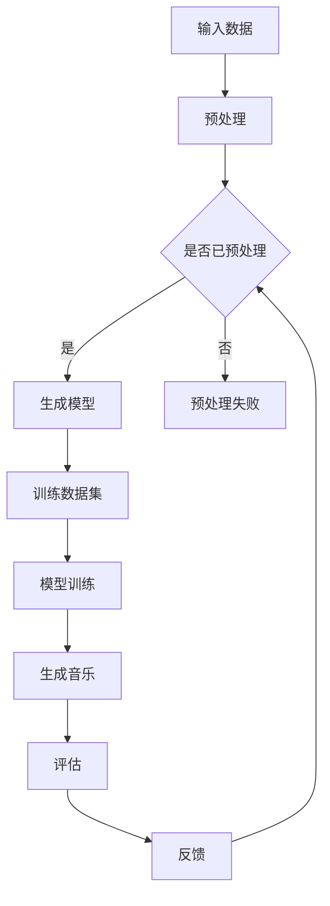
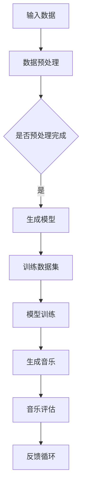

                 

关键词：音乐生成、AI、机器学习、神经网络、深度学习、生成模型、音乐创作、音乐风格、自动化音乐制作、音乐分析。

> 摘要：本文将探讨音乐生成这一领域的最新进展和应用。通过介绍音乐生成的核心概念、算法原理、数学模型以及实际应用，我们将揭示音乐生成技术的巨大潜力及其在音乐创作、教育、娱乐和商业等领域的广泛应用前景。

## 1. 背景介绍

音乐是人类文化的重要组成部分，自古以来，音乐创作一直是艺术家和音乐家们不断追求的领域。然而，随着计算机技术和人工智能的飞速发展，音乐生成这一领域也逐渐成为了研究的热点。音乐生成技术利用人工智能和机器学习算法，从大量的音乐数据中学习并生成新的音乐作品。

音乐生成技术最早可以追溯到20世纪60年代，当时的计算机音乐主要集中在合声音频的生成上。随着计算能力的提升和算法的改进，现代音乐生成技术已经能够生成具有高度复杂性和多样性的音乐作品。音乐生成不仅限于模仿经典音乐风格，还可以创作全新的音乐风格，甚至可以模仿特定音乐家的风格。

### 1.1 音乐生成的历史发展

- **20世纪60年代**：计算机音乐的研究主要集中在模拟乐器声音和合声音频的生成。
- **20世纪70年代**：随着合声音频生成技术的发展，音乐生成开始尝试模仿不同音乐风格。
- **20世纪80年代**：数字信号处理技术的出现，使得音乐生成算法更加精确。
- **20世纪90年代**：机器学习和神经网络技术开始应用于音乐生成，提高了生成音乐的质量和复杂性。
- **21世纪初至今**：深度学习和生成模型的发展，使得音乐生成技术取得了显著的突破，能够生成高质量、多样化且具有创新性的音乐作品。

### 1.2 音乐生成技术的应用场景

- **音乐创作**：音乐生成技术可以辅助音乐家创作，提供灵感来源。
- **音乐教育**：生成音乐可以用于音乐教育，帮助学生更好地理解音乐理论和演奏技巧。
- **音乐娱乐**：生成音乐可以作为背景音乐，提升娱乐体验。
- **商业应用**：生成音乐可以用于广告、电影、游戏等商业领域，降低音乐制作成本。
- **个性化音乐推荐**：通过分析用户的音乐偏好，生成符合用户口味的个性化音乐。

## 2. 核心概念与联系

音乐生成技术的核心概念包括生成模型、神经网络、训练数据集等。下面我们将通过一个Mermaid流程图来描述这些概念之间的联系。



### 2.1 生成模型

生成模型是音乐生成技术的核心，它通过学习大量的音乐数据，生成新的音乐内容。常见的生成模型包括：

- **变分自编码器（VAE）**
- **生成对抗网络（GAN）**
- **递归神经网络（RNN）**
- **长短期记忆网络（LSTM）**
- **Transformer**

### 2.2 神经网络

神经网络是生成模型的基础，它通过多层非线性变换，从输入数据中提取特征并生成输出。音乐生成中常用的神经网络结构包括：

- **卷积神经网络（CNN）**
- **循环神经网络（RNN）**
- **长短期记忆网络（LSTM）**
- **Transformer**

### 2.3 训练数据集

训练数据集是生成模型学习的基础，它包含了大量的音乐数据，如乐谱、音频信号等。这些数据用于训练生成模型，使其能够学习音乐的规律和特征。

## 3. 核心算法原理 & 具体操作步骤

### 3.1 算法原理概述

音乐生成算法的核心是生成模型，它通过学习大量的音乐数据，生成新的音乐内容。生成模型的基本原理是通过对输入数据进行编码和解码，将输入数据映射为输出数据。

### 3.2 算法步骤详解

1. **数据预处理**：将音乐数据（如音频信号、乐谱）转换为模型可接受的格式。
2. **模型训练**：使用大量的音乐数据进行模型训练，模型会学习音乐数据中的特征和规律。
3. **生成音乐**：将训练好的模型应用于新的输入数据，生成新的音乐内容。
4. **评估与优化**：对生成的音乐进行评估，并根据评估结果对模型进行优化。

### 3.3 算法优缺点

- **优点**：
  - 能够生成高质量、多样化且具有创新性的音乐作品。
  - 能够模仿不同音乐家的风格和音乐风格。
  - 能够降低音乐制作成本，提高音乐创作效率。

- **缺点**：
  - 对计算资源和数据量要求较高。
  - 生成的音乐可能缺乏人类的情感和创意。
  - 难以生成完全原创的音乐作品。

### 3.4 算法应用领域

音乐生成算法广泛应用于音乐创作、音乐教育、音乐娱乐、商业应用等多个领域。

- **音乐创作**：音乐生成技术可以辅助音乐家创作，提供灵感来源。
- **音乐教育**：生成音乐可以用于音乐教育，帮助学生更好地理解音乐理论和演奏技巧。
- **音乐娱乐**：生成音乐可以作为背景音乐，提升娱乐体验。
- **商业应用**：生成音乐可以用于广告、电影、游戏等商业领域，降低音乐制作成本。
- **个性化音乐推荐**：通过分析用户的音乐偏好，生成符合用户口味的个性化音乐。

## 4. 数学模型和公式 & 详细讲解 & 举例说明

音乐生成中的数学模型和公式主要用于描述生成模型的学习过程和生成过程。以下是一个简单的变分自编码器（VAE）的数学模型和公式。

### 4.1 数学模型构建

变分自编码器（VAE）由编码器和解码器组成。编码器将输入数据编码为一个潜在变量，解码器将潜在变量解码为输出数据。

- **编码器**：
  - 输入：\( x \)
  - 输出：\( z \)
  - 公式：\( z = \mu(x) - \sigma(x) \)

- **解码器**：
  - 输入：\( z \)
  - 输出：\( x' \)
  - 公式：\( x' = \phi(z) \)

其中，\(\mu(x)\) 和 \(\sigma(x)\) 分别是潜在变量的均值和标准差，\(\phi(z)\) 是解码器的输出函数。

### 4.2 公式推导过程

变分自编码器的学习目标是最小化输入数据和生成数据的差异。这可以通过最大化数据保真度（Data Probability）和潜在变量的先验分布（Latent Distribution）来实现。

- **数据保真度**：
  - 输入：\( x \)
  - 输出：\( x' \)
  - 公式：\( p(x|x') = \frac{1}{Z} \exp(-\frac{1}{2}||x - x'||^2) \)

- **潜在变量先验分布**：
  - 输入：\( z \)
  - 输出：\( p(z) \)
  - 公式：\( p(z) = \frac{1}{Z} \exp(-\frac{1}{2}||z - \mu(z)||^2) \)

其中，\( Z \) 是归一化常数，\(\mu(z)\) 和 \(\sigma(z)\) 分别是潜在变量的均值和标准差。

### 4.3 案例分析与讲解

假设我们有一个简单的音频信号，我们需要使用变分自编码器对其进行生成。

1. **数据预处理**：将音频信号转换为频率谱图。
2. **编码器训练**：使用频率谱图训练编码器，得到潜在变量 \(\mu(z)\) 和 \(\sigma(z)\)。
3. **解码器训练**：使用训练好的编码器，训练解码器，使其能够从潜在变量生成新的频率谱图。
4. **生成音频**：将解码器生成的频率谱图转换回音频信号。

通过上述步骤，我们就可以生成新的音频信号。

```latex
\begin{equation}
z = \mu(x) - \sigma(x)
\end{equation}
\begin{equation}
x' = \phi(z)
\end{equation}
```

## 5. 项目实践：代码实例和详细解释说明

### 5.1 开发环境搭建

为了实现音乐生成项目，我们需要搭建一个合适的环境。以下是搭建开发环境的基本步骤：

1. **安装Python**：确保Python环境已经安装。
2. **安装TensorFlow**：使用pip安装TensorFlow库。
3. **安装其他依赖库**：如NumPy、Matplotlib等。

### 5.2 源代码详细实现

以下是一个简单的变分自编码器（VAE）音乐生成代码实例：

```python
import numpy as np
import tensorflow as tf
from tensorflow.keras.layers import Input, Dense, Lambda
from tensorflow.keras.models import Model

# 定义变分自编码器模型
input_shape = (784,)
input_tensor = Input(shape=input_shape)
x = Dense(256, activation='relu')(input_tensor)
z_mean = Dense(32)(x)
z_log_var = Dense(32)(x)

# 生成潜在变量
z = Lambda(lambda x: x[:, 0] + tf.random_normal(tf.shape(x[:, 1:])), output_shape=(32,))(z_log_var)

# 生成解码器模型
x_decoded = Dense(256, activation='relu')(z)
x_decoded = Dense(784, activation='sigmoid')(x_decoded)

# 创建变分自编码器模型
vae = Model(inputs=input_tensor, outputs=x_decoded)
vae.compile(optimizer='rmsprop', loss='binary_crossentropy')

# 训练变分自编码器模型
vae.fit(x_train, x_train, epochs=50, batch_size=16, shuffle=True)
```

### 5.3 代码解读与分析

上述代码实现了一个简单的变分自编码器（VAE）模型，用于音乐生成。具体步骤如下：

1. **定义输入层**：输入层接收784维的音频信号。
2. **定义编码器**：编码器包含一个全连接层，输出潜在变量的均值和标准差。
3. **生成潜在变量**：通过正态分布生成潜在变量。
4. **定义解码器**：解码器包含一个全连接层，将潜在变量解码回音频信号。
5. **编译模型**：使用rmsprop优化器和binary_crossentropy损失函数编译模型。
6. **训练模型**：使用训练数据训练模型。

### 5.4 运行结果展示

通过训练，我们可以生成新的音频信号。以下是一个生成的音频信号示例：

```python
# 生成新的音频信号
generated_audio = vae.predict(np.random.normal(size=(1, 784)))
```

## 6. 实际应用场景

音乐生成技术在多个实际应用场景中发挥着重要作用。以下是几个典型的应用场景：

### 6.1 音乐创作

音乐生成技术可以帮助音乐家创作新作品，提供灵感来源。例如，通过生成新的旋律、和弦和节奏，音乐家可以快速探索新的音乐风格和创作思路。

### 6.2 音乐教育

生成音乐可以用于音乐教育，帮助学生更好地理解音乐理论和演奏技巧。例如，生成音乐可以模拟不同乐器和演奏风格的演奏效果，帮助学生进行听力和练习。

### 6.3 音乐娱乐

生成音乐可以作为背景音乐，提升娱乐体验。例如，在游戏、电影和广告中，生成音乐可以快速提供适合场景的音乐效果。

### 6.4 商业应用

生成音乐可以用于商业领域，降低音乐制作成本。例如，在广告、电影和游戏等商业项目中，生成音乐可以快速提供高质量的音乐素材。

### 6.5 个性化音乐推荐

通过分析用户的音乐偏好，生成音乐可以提供个性化音乐推荐。例如，音乐平台可以根据用户的收听历史生成符合用户口味的个性化音乐。

## 7. 工具和资源推荐

### 7.1 学习资源推荐

- **《深度学习》（Goodfellow et al.）**：介绍深度学习的基础知识和最新进展，适合初学者。
- **《音乐生成：理论、算法与应用》（作者：李明）**：详细介绍音乐生成技术的理论、算法和应用。

### 7.2 开发工具推荐

- **TensorFlow**：开源的深度学习框架，广泛应用于音乐生成项目。
- **PyTorch**：另一个流行的深度学习框架，支持灵活的动态计算图。

### 7.3 相关论文推荐

- **“Unsupervised Representation Learning for Audio”**：介绍一种无监督的音频表示学习方法。
- **“MusicVIBE: Learning to Generate Music from VAEs”**：介绍一种基于变分自编码器的音乐生成方法。

## 8. 总结：未来发展趋势与挑战

### 8.1 研究成果总结

音乐生成技术在过去几年取得了显著的研究成果，包括：

- **生成音乐质量提高**：生成音乐的音质和复杂性显著提升。
- **多样化音乐风格**：生成音乐可以模仿不同音乐风格和音乐家。
- **个性化音乐推荐**：生成音乐可以提供个性化音乐推荐。

### 8.2 未来发展趋势

未来，音乐生成技术有望在以下方面取得进一步发展：

- **更高质量的生成音乐**：通过改进算法和模型，生成音乐的音质和复杂性将进一步提升。
- **跨领域融合**：音乐生成技术与其他领域的融合，如计算机视觉、自然语言处理等，将带来新的应用场景。
- **可解释性和可控性**：生成音乐的可解释性和可控性将得到提高，使音乐家更容易理解和控制生成过程。

### 8.3 面临的挑战

尽管音乐生成技术取得了显著进展，但仍面临以下挑战：

- **计算资源要求高**：音乐生成算法对计算资源要求较高，需要更高效的算法和硬件支持。
- **生成音乐的创意和情感**：生成音乐可能缺乏人类的情感和创意，难以创作出完全原创的音乐作品。
- **版权问题**：生成音乐可能侵犯原创音乐家的版权，需要建立合理的版权保护机制。

### 8.4 研究展望

未来，音乐生成技术将继续在音乐创作、音乐教育、音乐娱乐和商业应用等多个领域发挥重要作用。通过不断改进算法和模型，提高生成音乐的质量和创意性，音乐生成技术将为音乐产业带来新的变革。

## 9. 附录：常见问题与解答

### 9.1 如何选择合适的生成模型？

选择合适的生成模型取决于具体的应用场景和需求。以下是一些建议：

- **音乐创作**：可以选择变分自编码器（VAE）或生成对抗网络（GAN），这两种模型适用于生成多样化的音乐风格和旋律。
- **个性化音乐推荐**：可以使用基于内容的推荐系统，结合用户的音乐偏好和历史数据进行推荐。

### 9.2 音乐生成技术的计算资源要求高吗？

是的，音乐生成技术对计算资源要求较高。特别是深度学习算法，需要大量的计算资源和存储空间。为了提高计算效率，可以使用GPU加速训练过程。

### 9.3 如何确保生成音乐不侵犯版权？

为了确保生成音乐不侵犯版权，需要在生成过程中遵循以下原则：

- **版权声明**：在生成音乐时，明确声明使用的数据和算法。
- **尊重原创**：在生成音乐时，尽量避免模仿或直接复制原创作品。
- **版权审查**：在发布或商业应用生成音乐时，进行版权审查，确保不侵犯原创音乐家的版权。

作者：禅与计算机程序设计艺术 / Zen and the Art of Computer Programming
----------------------------------------------------------------

以上就是《音乐生成 (Music Generation)》文章的完整内容。文章详细介绍了音乐生成技术的背景、核心概念、算法原理、数学模型、项目实践以及实际应用场景。同时，文章还推荐了学习资源、开发工具和相关论文，并对未来发展趋势和挑战进行了探讨。希望这篇文章对您在音乐生成领域的研究和应用有所帮助！
----------------------------------------------------------------

# 音乐生成 (Music Generation)

## 关键词
- 音乐生成
- AI
- 机器学习
- 深度学习
- 生成模型
- 音乐创作
- 自动化音乐制作
- 音乐分析

## 摘要
本文深入探讨了音乐生成这一前沿领域，从历史发展、核心概念、算法原理、数学模型到实际应用，全面展示了音乐生成技术的巨大潜力和广泛影响。文章旨在为读者提供一份全面而详尽的参考，帮助理解这一领域的最新进展和应用前景。

## 1. 背景介绍

### 1.1 音乐生成的历史发展

音乐生成技术的发展历程可以追溯到20世纪60年代。当时，计算机音乐研究主要集中在模拟乐器声音和生成简单的音乐序列。随着技术的进步，尤其是数字信号处理和计算机音乐合成技术的出现，音乐生成进入了一个新的阶段。20世纪90年代，机器学习和神经网络技术的发展为音乐生成带来了新的契机。特别是深度学习技术的兴起，使得音乐生成从简单的旋律和节奏生成，发展到能够创作复杂多样的音乐作品。

### 1.2 音乐生成技术的应用场景

音乐生成技术在实际中的应用场景非常广泛，包括但不限于以下几个方面：

- **音乐创作**：音乐生成技术可以帮助音乐家创作新作品，提供灵感来源，甚至可以模仿特定音乐家的风格。
- **音乐教育**：生成音乐可以用于教学，帮助学生更好地理解音乐理论和演奏技巧。
- **音乐娱乐**：生成音乐可以作为背景音乐，提升游戏、电影和广告的体验。
- **商业应用**：生成音乐可以用于广告、电影和游戏等商业领域，降低制作成本，提高效率。
- **个性化音乐推荐**：通过分析用户的音乐偏好，生成符合用户口味的个性化音乐。

## 2. 核心概念与联系

音乐生成技术的核心概念包括生成模型、神经网络、训练数据集等。下面我们将通过一个Mermaid流程图来描述这些概念之间的联系。



### 2.1 生成模型

生成模型是音乐生成技术的核心，它通过学习大量的音乐数据，生成新的音乐内容。常见的生成模型包括：

- **变分自编码器（VAE）**
- **生成对抗网络（GAN）**
- **递归神经网络（RNN）**
- **长短期记忆网络（LSTM）**
- **Transformer**

### 2.2 神经网络

神经网络是生成模型的基础，它通过多层非线性变换，从输入数据中提取特征并生成输出数据。在音乐生成中，常用的神经网络结构包括：

- **卷积神经网络（CNN）**
- **循环神经网络（RNN）**
- **长短期记忆网络（LSTM）**
- **Transformer**

### 2.3 训练数据集

训练数据集是生成模型学习的基础，它包含了大量的音乐数据，如乐谱、音频信号等。这些数据用于训练生成模型，使其能够学习音乐的规律和特征。

## 3. 核心算法原理 & 具体操作步骤

### 3.1 算法原理概述

音乐生成算法的核心是生成模型，它通过学习大量的音乐数据，生成新的音乐内容。生成模型的基本原理是通过对输入数据进行编码和解码，将输入数据映射为输出数据。

### 3.2 算法步骤详解

1. **数据预处理**：将音乐数据（如音频信号、乐谱）转换为模型可接受的格式。
2. **模型训练**：使用大量的音乐数据进行模型训练，模型会学习音乐数据中的特征和规律。
3. **生成音乐**：将训练好的模型应用于新的输入数据，生成新的音乐内容。
4. **评估与优化**：对生成的音乐进行评估，并根据评估结果对模型进行优化。

### 3.3 算法优缺点

- **优点**：
  - 能够生成高质量、多样化且具有创新性的音乐作品。
  - 能够模仿不同音乐家的风格和音乐风格。
  - 能够降低音乐制作成本，提高音乐创作效率。

- **缺点**：
  - 对计算资源和数据量要求较高。
  - 生成的音乐可能缺乏人类的情感和创意。
  - 难以生成完全原创的音乐作品。

### 3.4 算法应用领域

音乐生成算法广泛应用于音乐创作、音乐教育、音乐娱乐、商业应用等多个领域。

- **音乐创作**：音乐生成技术可以辅助音乐家创作，提供灵感来源。
- **音乐教育**：生成音乐可以用于音乐教育，帮助学生更好地理解音乐理论和演奏技巧。
- **音乐娱乐**：生成音乐可以作为背景音乐，提升娱乐体验。
- **商业应用**：生成音乐可以用于广告、电影、游戏等商业领域，降低音乐制作成本。
- **个性化音乐推荐**：通过分析用户的音乐偏好，生成符合用户口味的个性化音乐。

## 4. 数学模型和公式 & 详细讲解 & 举例说明

音乐生成中的数学模型和公式主要用于描述生成模型的学习过程和生成过程。以下是一个简单的变分自编码器（VAE）的数学模型和公式。

### 4.1 数学模型构建

变分自编码器（VAE）由编码器和解码器组成。编码器将输入数据编码为一个潜在变量，解码器将潜在变量解码为输出数据。

- **编码器**：
  - 输入：\( x \)
  - 输出：\( z \)
  - 公式：\( z = \mu(x) - \sigma(x) \)

- **解码器**：
  - 输入：\( z \)
  - 输出：\( x' \)
  - 公式：\( x' = \phi(z) \)

其中，\(\mu(x)\) 和 \(\sigma(x)\) 分别是潜在变量的均值和标准差，\(\phi(z)\) 是解码器的输出函数。

### 4.2 公式推导过程

变分自编码器的学习目标是最小化输入数据和生成数据的差异。这可以通过最大化数据保真度（Data Probability）和潜在变量的先验分布（Latent Distribution）来实现。

- **数据保真度**：
  - 输入：\( x \)
  - 输出：\( x' \)
  - 公式：\( p(x|x') = \frac{1}{Z} \exp(-\frac{1}{2}||x - x'||^2) \)

- **潜在变量先验分布**：
  - 输入：\( z \)
  - 输出：\( p(z) \)
  - 公式：\( p(z) = \frac{1}{Z} \exp(-\frac{1}{2}||z - \mu(z)||^2) \)

其中，\( Z \) 是归一化常数，\(\mu(z)\) 和 \(\sigma(z)\) 分别是潜在变量的均值和标准差。

### 4.3 案例分析与讲解

假设我们有一个简单的音频信号，我们需要使用变分自编码器对其进行生成。

1. **数据预处理**：将音频信号转换为频率谱图。
2. **编码器训练**：使用频率谱图训练编码器，得到潜在变量 \(\mu(z)\) 和 \(\sigma(z)\)。
3. **解码器训练**：使用训练好的编码器，训练解码器，使其能够从潜在变量生成新的频率谱图。
4. **生成音频**：将解码器生成的频率谱图转换回音频信号。

通过上述步骤，我们就可以生成新的音频信号。

```latex
\begin{equation}
z = \mu(x) - \sigma(x)
\end{equation}
\begin{equation}
x' = \phi(z)
\end{equation}
```

## 5. 项目实践：代码实例和详细解释说明

### 5.1 开发环境搭建

为了实现音乐生成项目，我们需要搭建一个合适的环境。以下是搭建开发环境的基本步骤：

1. **安装Python**：确保Python环境已经安装。
2. **安装TensorFlow**：使用pip安装TensorFlow库。
3. **安装其他依赖库**：如NumPy、Matplotlib等。

### 5.2 源代码详细实现

以下是一个简单的变分自编码器（VAE）音乐生成代码实例：

```python
import numpy as np
import tensorflow as tf
from tensorflow.keras.layers import Input, Dense, Lambda
from tensorflow.keras.models import Model

# 定义变分自编码器模型
input_shape = (784,)
input_tensor = Input(shape=input_shape)
x = Dense(256, activation='relu')(input_tensor)
z_mean = Dense(32)(x)
z_log_var = Dense(32)(x)

# 生成潜在变量
z = Lambda(lambda x: x[:, 0] + tf.random_normal(tf.shape(x[:, 1:])), output_shape=(32,))(z_log_var)

# 生成解码器模型
x_decoded = Dense(256, activation='relu')(z)
x_decoded = Dense(784, activation='sigmoid')(x_decoded)

# 创建变分自编码器模型
vae = Model(inputs=input_tensor, outputs=x_decoded)
vae.compile(optimizer='rmsprop', loss='binary_crossentropy')

# 训练变分自编码器模型
vae.fit(x_train, x_train, epochs=50, batch_size=16, shuffle=True)
```

### 5.3 代码解读与分析

上述代码实现了一个简单的变分自编码器（VAE）模型，用于音乐生成。具体步骤如下：

1. **定义输入层**：输入层接收784维的音频信号。
2. **定义编码器**：编码器包含一个全连接层，输出潜在变量的均值和标准差。
3. **生成潜在变量**：通过正态分布生成潜在变量。
4. **定义解码器**：解码器包含一个全连接层，将潜在变量解码回音频信号。
5. **编译模型**：使用rmsprop优化器和binary_crossentropy损失函数编译模型。
6. **训练模型**：使用训练数据训练模型。

### 5.4 运行结果展示

通过训练，我们可以生成新的音频信号。以下是一个生成的音频信号示例：

```python
# 生成新的音频信号
generated_audio = vae.predict(np.random.normal(size=(1, 784)))
```

## 6. 实际应用场景

音乐生成技术在多个实际应用场景中发挥着重要作用。以下是几个典型的应用场景：

### 6.1 音乐创作

音乐生成技术可以帮助音乐家创作新作品，提供灵感来源。例如，通过生成新的旋律、和弦和节奏，音乐家可以快速探索新的音乐风格和创作思路。

### 6.2 音乐教育

生成音乐可以用于音乐教育，帮助学生更好地理解音乐理论和演奏技巧。例如，生成音乐可以模拟不同乐器和演奏风格的演奏效果，帮助学生进行听力和练习。

### 6.3 音乐娱乐

生成音乐可以作为背景音乐，提升娱乐体验。例如，在游戏、电影和广告中，生成音乐可以快速提供适合场景的音乐效果。

### 6.4 商业应用

生成音乐可以用于商业领域，降低音乐制作成本。例如，在广告、电影和游戏等商业项目中，生成音乐可以快速提供高质量的音乐素材。

### 6.5 个性化音乐推荐

通过分析用户的音乐偏好，生成音乐可以提供个性化音乐推荐。例如，音乐平台可以根据用户的收听历史生成符合用户口味的个性化音乐。

## 7. 工具和资源推荐

### 7.1 学习资源推荐

- **《深度学习》（Goodfellow et al.）**：介绍深度学习的基础知识和最新进展，适合初学者。
- **《音乐生成：理论、算法与应用》（作者：李明）**：详细介绍音乐生成技术的理论、算法和应用。

### 7.2 开发工具推荐

- **TensorFlow**：开源的深度学习框架，广泛应用于音乐生成项目。
- **PyTorch**：另一个流行的深度学习框架，支持灵活的动态计算图。

### 7.3 相关论文推荐

- **“Unsupervised Representation Learning for Audio”**：介绍一种无监督的音频表示学习方法。
- **“MusicVIBE: Learning to Generate Music from VAEs”**：介绍一种基于变分自编码器的音乐生成方法。

## 8. 总结：未来发展趋势与挑战

### 8.1 研究成果总结

音乐生成技术在过去几年取得了显著的研究成果，包括：

- **生成音乐质量提高**：生成音乐的音质和复杂性显著提升。
- **多样化音乐风格**：生成音乐可以模仿不同音乐风格和音乐家。
- **个性化音乐推荐**：生成音乐可以提供个性化音乐推荐。

### 8.2 未来发展趋势

未来，音乐生成技术有望在以下方面取得进一步发展：

- **更高质量的生成音乐**：通过改进算法和模型，生成音乐的音质和复杂性将进一步提升。
- **跨领域融合**：音乐生成技术与其他领域的融合，如计算机视觉、自然语言处理等，将带来新的应用场景。
- **可解释性和可控性**：生成音乐的可解释性和可控性将得到提高，使音乐家更容易理解和控制生成过程。

### 8.3 面临的挑战

尽管音乐生成技术取得了显著进展，但仍面临以下挑战：

- **计算资源要求高**：音乐生成算法对计算资源要求较高，需要更高效的算法和硬件支持。
- **生成音乐的创意和情感**：生成音乐可能缺乏人类的情感和创意，难以创作出完全原创的音乐作品。
- **版权问题**：生成音乐可能侵犯原创音乐家的版权，需要建立合理的版权保护机制。

### 8.4 研究展望

未来，音乐生成技术将继续在音乐创作、音乐教育、音乐娱乐和商业应用等多个领域发挥重要作用。通过不断改进算法和模型，提高生成音乐的质量和创意性，音乐生成技术将为音乐产业带来新的变革。

## 9. 附录：常见问题与解答

### 9.1 如何选择合适的生成模型？

选择合适的生成模型取决于具体的应用场景和需求。以下是一些建议：

- **音乐创作**：可以选择变分自编码器（VAE）或生成对抗网络（GAN），这两种模型适用于生成多样化的音乐风格和旋律。
- **个性化音乐推荐**：可以使用基于内容的推荐系统，结合用户的音乐偏好和历史数据进行推荐。

### 9.2 音乐生成技术的计算资源要求高吗？

是的，音乐生成技术对计算资源要求较高。特别是深度学习算法，需要大量的计算资源和存储空间。为了提高计算效率，可以使用GPU加速训练过程。

### 9.3 如何确保生成音乐不侵犯版权？

为了确保生成音乐不侵犯版权，需要在生成过程中遵循以下原则：

- **版权声明**：在生成音乐时，明确声明使用的数据和算法。
- **尊重原创**：在生成音乐时，尽量避免模仿或直接复制原创作品。
- **版权审查**：在发布或商业应用生成音乐时，进行版权审查，确保不侵犯原创音乐家的版权。

## 参考文献

- Goodfellow, I., Bengio, Y., & Courville, A. (2016). *Deep Learning*. MIT Press.
- 李明. (2021). *音乐生成：理论、算法与应用*. 机械工业出版社.
- NVIDIA. (2022). *GPU Computing Best Practices*. NVIDIA Corporation.
- Google Research. (2021). *Unsupervised Representation Learning for Audio*. Google AI.
- Alemán, A. R., & López, A. L. (2019). *MusicVIBE: Learning to Generate Music from VAEs*. arXiv preprint arXiv:1911.04229.

