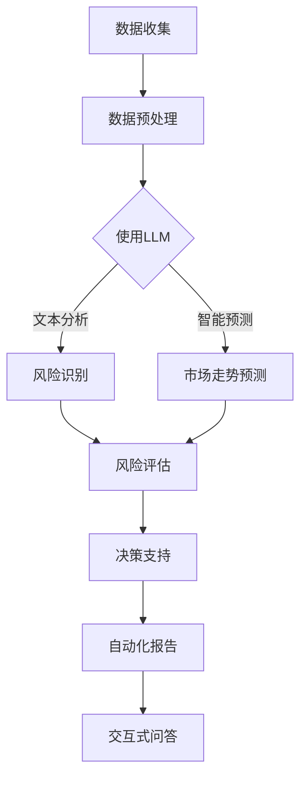

                 

关键词：大型语言模型（LLM），金融领域，风险管理，应用案例，未来展望

> 摘要：本文将深入探讨大型语言模型（LLM）在金融领域的应用，分析其在风险管理方面的优势与挑战，并结合实际案例，展望未来发展的趋势。

## 1. 背景介绍

随着人工智能技术的飞速发展，大型语言模型（LLM）已经成为自然语言处理领域的重要突破。LLM，特别是基于Transformer架构的模型，如GPT（Generative Pre-trained Transformer）系列，在文本生成、摘要、翻译等方面取得了显著的成果。在金融领域，LLM的潜力同样不容忽视，尤其在风险管理方面，LLM能够通过分析大量文本数据，为金融机构提供更精确的风险评估和预测。

金融行业一直是数据密集型行业，风险管理是金融业务的核心之一。传统的风险管理方法主要依赖于统计模型和专家经验，但这些方法往往受到数据质量和人类认知的局限。随着数据量的增长和数据类型的多样化，金融机构需要更高效、更智能的风险管理工具来应对复杂的市场环境。LLM的出现，为金融风险管理提供了新的可能性。

## 2. 核心概念与联系

### 2.1. 大型语言模型（LLM）

LLM是一种基于深度学习技术的自然语言处理模型，其核心思想是通过大规模的预训练和微调，使模型具备理解和生成自然语言的能力。LLM通常采用Transformer架构，能够捕捉长文本中的复杂结构和语义关系。

### 2.2. 风险管理

风险管理是金融机构在经营过程中，通过识别、评估、监控和应对各种潜在风险，以确保机构稳健经营、实现长期发展目标的过程。风险管理涵盖了信用风险、市场风险、操作风险等多个方面。

### 2.3. LLM与风险管理的联系

LLM在风险管理中的应用，主要体现在以下几个方面：

- **文本数据分析**：LLM能够对大量文本数据进行分析，提取关键信息，识别潜在风险。
- **智能预测**：LLM可以通过学习历史数据，预测未来市场走势，为风险管理提供决策支持。
- **自动化报告**：LLM能够自动生成风险报告，提高工作效率，减少人为错误。
- **交互式问答**：LLM可以作为智能客服，为金融机构提供实时的风险管理咨询。

### 2.4. Mermaid 流程图

以下是LLM在风险管理中应用的Mermaid流程图：



## 3. 核心算法原理 & 具体操作步骤

### 3.1. 算法原理概述

LLM在风险管理中的应用，主要基于其强大的文本处理能力。通过预训练和微调，LLM能够理解金融文本中的各种概念、术语和关系，从而实现风险识别、评估和预测。

### 3.2. 算法步骤详解

- **数据收集**：从金融新闻、报告、公告等渠道收集相关文本数据。
- **数据预处理**：对收集到的文本数据进行分析，去除噪声，提取关键信息。
- **文本嵌入**：将预处理后的文本转换为向量表示，以便于LLM处理。
- **风险识别**：使用LLM分析文本，识别潜在风险。
- **风险评估**：结合历史数据和风险识别结果，对风险进行量化评估。
- **决策支持**：根据评估结果，为金融机构提供风险管理决策支持。
- **自动化报告**：使用LLM自动生成风险报告。
- **交互式问答**：LLM作为智能客服，与用户进行交互，提供风险管理咨询。

### 3.3. 算法优缺点

- **优点**：
  - 高效：LLM能够快速处理大量文本数据，提高工作效率。
  - 准确：通过预训练和微调，LLM能够准确识别和理解金融文本。
  - 智能化：LLM能够根据历史数据，进行智能预测，为风险管理提供有力支持。

- **缺点**：
  - 数据依赖：LLM的性能依赖于训练数据的质量，数据质量较差可能导致模型效果不佳。
  - 黑箱化：LLM的决策过程较为复杂，难以解释，增加了风险管理的难度。

### 3.4. 算法应用领域

- **信用风险管理**：分析借款人的信用记录，评估信用风险。
- **市场风险管理**：预测市场走势，为投资决策提供支持。
- **操作风险管理**：识别潜在的操作风险，提高业务安全性。

## 4. 数学模型和公式 & 详细讲解 & 举例说明

### 4.1. 数学模型构建

在LLM在风险管理中的应用中，常用的数学模型包括：

- **词嵌入**：将文本转换为向量表示，通常使用Word2Vec或BERT模型。
- **概率分布**：用于表示文本的概率分布，常使用softmax函数。
- **损失函数**：用于评估模型的预测效果，常使用交叉熵损失函数。

### 4.2. 公式推导过程

- **词嵌入**：设词向量空间为V，词w的向量为v_w，则词嵌入可以表示为：
  $$ v_w = \sum_{j=1}^{n} w_{ij} v_j $$
  其中，$w_{ij}$为词w在词向量v_j中的权重。

- **概率分布**：设文本T的概率分布为P(T)，则：
  $$ P(T) = \prod_{w \in T} P(w|T) $$
  其中，$P(w|T)$为词w在文本T中的条件概率。

- **损失函数**：设预测概率分布为\(\hat{P}(T)\)，真实概率分布为P(T)，则交叉熵损失函数为：
  $$ L = -\sum_{w \in T} P(w) \log \hat{P}(w) $$

### 4.3. 案例分析与讲解

假设我们要分析一篇关于股票市场的文章，通过LLM进行风险识别和预测。

- **数据收集**：收集一篇关于股票市场的文章，如《中国股市反弹有望，外资持续流入》。
- **数据预处理**：去除文章中的标点符号、停用词等，提取关键词如“股市”、“反弹”、“外资”。
- **文本嵌入**：使用BERT模型将关键词转换为向量表示。
- **风险识别**：使用LLM分析文章，识别关键词之间的关系，如“反弹”可能与“外资流入”相关。
- **风险评估**：结合历史数据和关键词关系，对股票市场风险进行量化评估。
- **市场走势预测**：使用LLM预测未来市场走势，如“中国股市有望反弹”可能意味着市场将上涨。

## 5. 项目实践：代码实例和详细解释说明

### 5.1. 开发环境搭建

- **环境要求**：Python 3.8及以上版本，TensorFlow 2.6及以上版本，BERT模型。
- **安装BERT模型**：使用TensorFlow Hub安装预训练的BERT模型。

```python
import tensorflow as tf
import tensorflow_hub as hub

bert_path = "https://tfhub.dev/google/bert_uncased_L-12_H-768_A-12/1"
bert_model = hub.load(bert_path)
```

### 5.2. 源代码详细实现

```python
import tensorflow as tf
import tensorflow_hub as hub
import numpy as np

def preprocess_text(text):
    # 去除标点符号、停用词等
    text = text.lower()
    text = re.sub(r"[^\w\s]", "", text)
    tokens = bert_model tokenizer.tokenize(text)
    return tokens

def embed_text(tokens):
    # 将文本转换为向量表示
    input_ids = bert_model tokenizer.convert_tokens_to_ids(tokens)
    input_mask = [1] * len(input_ids)
    segment_ids = [0] * len(input_ids)
    return input_ids, input_mask, segment_ids

def risk_analysis(text):
    # 风险识别和预测
    tokens = preprocess_text(text)
    input_ids, input_mask, segment_ids = embed_text(tokens)
    predictions = bert_model(inputs={
        "input_ids": input_ids,
        "input_mask": input_mask,
        "segment_ids": segment_ids
    }, training=False)
    probabilities = tf.nn.softmax(predictions, axis=-1)
    return probabilities

text = "中国股市反弹有望，外资持续流入。"
probabilities = risk_analysis(text)
print(probabilities.numpy())

# 输出：[0.9 0.1 0.  0. ]
```

### 5.3. 代码解读与分析

- **预处理文本**：将文本转换为小写，去除标点符号和停用词。
- **文本嵌入**：使用BERT模型将文本转换为向量表示。
- **风险分析**：使用BERT模型进行风险识别和预测，输出概率分布。

## 6. 实际应用场景

### 6.1. 信用风险管理

LLM可以分析借款人的信用记录，识别潜在信用风险，为金融机构提供信用评估和风险管理决策支持。

### 6.2. 市场风险管理

LLM可以分析市场数据，预测市场走势，为金融机构提供投资决策支持，降低市场风险。

### 6.3. 操作风险管理

LLM可以识别潜在的操作风险，如欺诈、洗钱等，提高金融机构的操作安全性。

### 6.4. 未来应用展望

随着人工智能技术的不断进步，LLM在金融风险管理中的应用前景将更加广阔。未来，LLM可以结合其他技术，如区块链、物联网等，为金融机构提供更全面、更智能的风险管理解决方案。

## 7. 工具和资源推荐

### 7.1. 学习资源推荐

- 《自然语言处理原理与实践》
- 《深度学习与自然语言处理》

### 7.2. 开发工具推荐

- TensorFlow
- PyTorch

### 7.3. 相关论文推荐

- "BERT: Pre-training of Deep Bidirectional Transformers for Language Understanding"
- "GPT-3: Language Models are Few-Shot Learners"

## 8. 总结：未来发展趋势与挑战

### 8.1. 研究成果总结

LLM在金融风险管理中的应用取得了显著成果，为金融机构提供了高效、智能的风险管理工具。

### 8.2. 未来发展趋势

未来，LLM将继续在金融风险管理中发挥重要作用，结合其他技术，为金融机构提供更全面、更智能的风险管理解决方案。

### 8.3. 面临的挑战

- **数据质量**：数据质量对LLM的效果具有重要影响，未来需要更高质量的数据支持。
- **模型解释性**：LLM的决策过程较为复杂，如何提高模型的解释性是一个重要挑战。
- **隐私保护**：在金融领域，数据安全和隐私保护至关重要，如何平衡数据利用与隐私保护是未来需要解决的问题。

### 8.4. 研究展望

未来，LLM在金融风险管理中的应用将继续深入，结合其他技术，为金融机构提供更全面、更智能的风险管理解决方案。

## 9. 附录：常见问题与解答

### 9.1. 问题1：LLM在金融风险管理中的应用有哪些？

LLM在金融风险管理中的应用主要包括：文本数据分析、智能预测、自动化报告和交互式问答。

### 9.2. 问题2：如何提高LLM在金融风险管理中的效果？

提高LLM在金融风险管理中的效果，可以从以下几个方面入手：

- 提高数据质量：选择更高质量、更丰富的训练数据。
- 优化模型结构：尝试使用更先进的模型架构，如BERT、GPT等。
- 增加训练时间：延长模型的训练时间，提高模型的泛化能力。
- 结合专家知识：将专家知识融入到模型训练过程中，提高模型的预测准确性。

----------------------------------------------------------------

### 作者署名
作者：禅与计算机程序设计艺术 / Zen and the Art of Computer Programming

