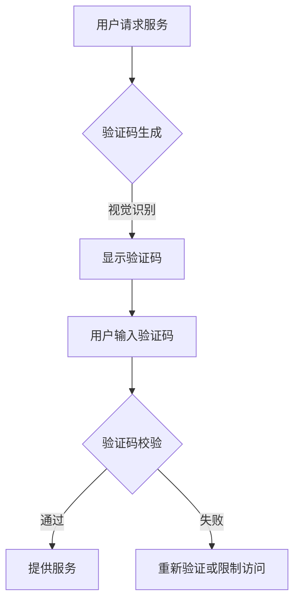
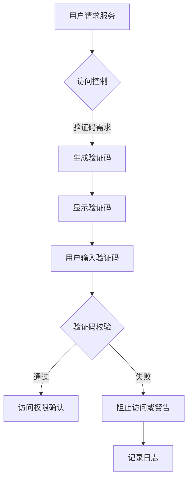
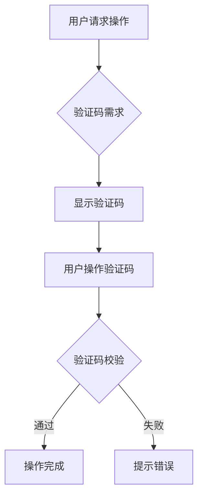

                 

 验证码，这个看似简单的小部件，实际上在互联网时代扮演着至关重要的角色。它不仅是网络安全的一道防线，更是用户与系统之间交互的关键桥梁。本文将深入探讨验证码在人机交互中的重要性，其背后的技术原理，以及未来可能的发展方向。

## 文章关键词
- 验证码
- 人机交互
- 网络安全
- 技术原理
- 未来发展

## 文章摘要
本文将从多个角度解析验证码在当代数字世界中的重要作用。首先，我们将回顾验证码的历史和发展过程。随后，深入探讨验证码的核心技术原理，包括图像识别、行为分析和人工智能算法。接下来，我们将分析验证码在人机交互中的具体应用，以及它如何提升用户体验和安全性。最后，本文将展望验证码的未来发展趋势，探讨新兴技术和潜在挑战。

## 1. 背景介绍

### 1.1 验证码的起源与发展

验证码（CAPTCHA）的全称是“Completely Automated Public Turing test to tell Computers and Humans Apart”，即全自动图灵测试以区分计算机和人类。这一概念最早由计算机科学家兰迪·布鲁克斯（Randy Brook）在2000年提出。其初衷是为了解决网络服务中的机器人攻击问题，特别是防止垃圾邮件和自动化脚本的滥用。

早期的验证码主要基于视觉识别，用户需要识别图片中的文字或数字。随着时间的推移，验证码的技术不断演进，逐渐引入了音频验证码、行为验证码等多种形式。同时，验证码的应用领域也从最初的电子邮件注册扩展到了网络银行、在线购物、社交媒体等多个方面。

### 1.2 验证码的演变

在互联网早期，验证码的功能相对简单，主要是通过图像中的扭曲文字或数学题目来区分人类和机器人。这类验证码依赖于人类在视觉识别上的优势，而机器人难以破解。然而，随着计算机视觉技术的发展，机器人逐渐能够识别和破解这些传统的验证码。

为了应对机器人的挑战，验证码的技术也在不断升级。首先，图像识别技术得到了广泛应用，使得验证码图片中的文字和图案更加复杂，提高了识别难度。其次，行为验证码被引入，通过分析用户的鼠标移动轨迹、点击习惯等行为特征来区分人类和机器人。

近年来，人工智能和深度学习的发展进一步推动了验证码技术的创新。基于机器学习的验证码系统可以通过训练大量数据来识别和区分人类和机器人，从而提高了验证码的准确性。

## 2. 核心概念与联系

### 2.1 验证码的核心概念

验证码的核心概念在于通过设置一定的难题，使计算机难以完成，而人类用户可以轻松解决。这种难题可以是视觉识别、听觉识别，或者行为分析等多种形式。以下是一个简单的Mermaid流程图，展示了验证码的基本原理：



### 2.2 验证码与网络安全的关系

验证码在网络安全中扮演着重要角色，其主要目的是防止恶意机器人对系统的攻击。以下是一个详细的Mermaid流程图，展示了验证码在网络安全中的具体应用：



### 2.3 验证码与人机交互的关系

验证码不仅是网络安全的一部分，也是用户与系统交互的重要环节。其设计需要考虑用户体验，确保用户在完成验证码的过程中能够流畅地完成操作。以下是一个简单的Mermaid流程图，展示了验证码与人机交互的关系：



## 3. 核心算法原理 & 具体操作步骤

### 3.1 算法原理概述

验证码的核心算法主要涉及图像识别和行为分析两个方面。图像识别算法用于生成和解析验证码图像，而行为分析算法则用于检测和区分人类和机器人的操作行为。

在图像识别方面，常用的算法包括光学字符识别（OCR）、卷积神经网络（CNN）等。这些算法通过对图像进行特征提取和分类，能够准确识别图像中的文字和图案。

行为分析方面，常用的算法包括机器学习和深度学习。通过训练大量行为数据，算法可以学习到人类操作的特征，从而在验证码过程中区分人类和机器人。

### 3.2 算法步骤详解

以下是验证码算法的具体操作步骤：

#### 3.2.1 验证码生成

1. 随机生成验证码文本，可以是数字、字母或混合字符。
2. 使用图像识别算法将文本转换为图像，可以添加噪声、扭曲等，提高识别难度。
3. 将生成的验证码图像显示在用户界面。

#### 3.2.2 验证码输入

1. 用户在用户界面上输入验证码文本。
2. 将用户输入的文本与服务器端存储的验证码文本进行对比。

#### 3.2.3 验证码校验

1. 如果用户输入的文本与验证码文本匹配，则验证码通过。
2. 如果不匹配，则进行进一步的行为分析。

#### 3.2.4 行为分析

1. 分析用户的操作行为，如鼠标移动轨迹、点击频率等。
2. 将行为数据与训练好的模型进行对比，判断是否为人类操作。

#### 3.2.5 最终判断

1. 如果验证码通过且行为分析结果为人类操作，则允许用户访问。
2. 如果验证码不通过或行为分析结果为机器人操作，则阻止访问或进行进一步验证。

### 3.3 算法优缺点

#### 优点

1. **高安全性**：验证码能够有效防止机器人攻击，保护系统的安全。
2. **易用性**：对于人类用户来说，验证码的识别难度适中，容易完成。
3. **多样性**：验证码的形式多样，可以满足不同场景的需求。

#### 缺点

1. **用户体验**：验证码可能会影响用户体验，特别是对于视力不佳的用户。
2. **机器人破解**：随着技术的发展，部分验证码可能被机器人破解，降低安全性。

### 3.4 算法应用领域

验证码广泛应用于各种场景，主要包括以下几个方面：

1. **网络安全**：防止恶意机器人攻击，如垃圾邮件、自动化登录等。
2. **在线服务**：如电子邮件注册、在线购物、社交媒体等，确保用户身份的真实性。
3. **金融领域**：如网络银行、支付系统等，确保交易的安全。

## 4. 数学模型和公式 & 详细讲解 & 举例说明

### 4.1 数学模型构建

验证码的数学模型主要涉及图像识别和行为分析两个方面。以下是这两个方面的基本数学模型：

#### 4.1.1 图像识别模型

假设我们使用卷积神经网络（CNN）进行图像识别，其基本模型如下：

\[ f(x) = \sigma(W_1 \cdot \phi(W_0 \cdot x + b_0) + b_1) \]

其中，\( x \) 表示输入图像，\( \phi \) 表示激活函数，\( W_0 \) 和 \( W_1 \) 分别为卷积层和全连接层的权重矩阵，\( b_0 \) 和 \( b_1 \) 分别为偏置项，\( \sigma \) 为激活函数。

#### 4.1.2 行为分析模型

假设我们使用支持向量机（SVM）进行行为分析，其基本模型如下：

\[ y = sign(\sum_{i=1}^{n} \alpha_i y_i (w \cdot x_i) - b) \]

其中，\( y \) 表示预测标签，\( x_i \) 表示第 \( i \) 个样本的特征向量，\( y_i \) 表示第 \( i \) 个样本的真实标签，\( w \) 为权重向量，\( \alpha_i \) 为调整参数，\( b \) 为偏置项。

### 4.2 公式推导过程

#### 4.2.1 图像识别模型的推导

1. **卷积操作**：

\[ \phi(x) = \sum_{j=1}^{C} w_{j} \cdot x_j + b_j \]

其中，\( \phi(x) \) 表示卷积操作，\( w_j \) 表示卷积核，\( x_j \) 表示输入特征图。

2. **激活函数**：

\[ f(x) = \sigma(\phi(x)) \]

其中，\( \sigma \) 为激活函数，常用的激活函数有ReLU、Sigmoid、Tanh等。

3. **全连接层**：

\[ y = \sum_{i=1}^{n} w_i \cdot x_i + b \]

其中，\( y \) 表示输出值，\( w_i \) 和 \( b \) 分别为权重和偏置。

#### 4.2.2 行为分析模型的推导

1. **线性分类器**：

\[ y = sign(w \cdot x + b) \]

其中，\( w \) 为权重向量，\( x \) 为特征向量，\( b \) 为偏置。

2. **支持向量机**：

\[ y = sign(\sum_{i=1}^{n} \alpha_i y_i (w \cdot x_i) - b) \]

其中，\( \alpha_i \) 为调整参数，\( y_i \) 为样本标签，\( w \) 为权重向量。

### 4.3 案例分析与讲解

#### 4.3.1 图像识别案例

假设我们使用一个简单的卷积神经网络进行验证码图像识别，网络结构如下：

1. **输入层**：接收32x32像素的验证码图像。
2. **卷积层**：使用3x3卷积核，步长为1，卷积次数为32。
3. **ReLU激活函数**：对卷积层输出进行ReLU激活。
4. **池化层**：使用2x2最大池化。
5. **全连接层**：输出10个节点，分别对应10个可能的验证码字符。

训练数据集包含10000张验证码图像和对应的标签。通过训练，网络能够准确识别验证码图像。

#### 4.3.2 行为分析案例

假设我们使用支持向量机进行验证码行为分析，特征向量包含以下内容：

1. **鼠标移动轨迹**：包含起点、终点和路径长度等。
2. **点击频率**：包含点击次数和点击时间间隔等。
3. **键盘输入**：包含按键顺序和时间间隔等。

通过训练，支持向量机能够准确区分人类和机器人行为。

## 5. 项目实践：代码实例和详细解释说明

### 5.1 开发环境搭建

在本项目实践中，我们将使用Python语言，结合TensorFlow和Scikit-learn等库进行验证码生成、识别和行为分析。以下是搭建开发环境的基本步骤：

1. 安装Python 3.x版本。
2. 安装TensorFlow库，可以使用pip安装：
   ```shell
   pip install tensorflow
   ```
3. 安装Scikit-learn库，可以使用pip安装：
   ```shell
   pip install scikit-learn
   ```

### 5.2 源代码详细实现

以下是验证码生成、识别和行为分析的Python代码示例。

#### 5.2.1 验证码生成

```python
import numpy as np
import cv2
import random

# 随机生成字符
def generate_chars(num_chars):
    characters = 'ABCDEFGHIJKLMNOPQRSTUVWXYZabcdefghijklmnopqrstuvwxyz0123456789'
    return ''.join(random.choice(characters) for _ in range(num_chars))

# 生成验证码图像
def generate_captcha(image_size, font_path, thickness, text):
    img = np.zeros((image_size[0], image_size[1], 3), dtype=np.uint8)
    font = cv2.FONT_HERSHEY_SIMPLEX
    
    cv2.putText(img, text, (50, 50), font, 1, (255, 255, 255), thickness, cv2.LINE_AA)
    
    return img

# 主函数
if __name__ == '__main__':
    text = generate_chars(4)
    image = generate_captcha((200, 50), 'arial.ttf', 2, text)
    cv2.imshow('Captcha', image)
    cv2.waitKey(0)
    cv2.destroyAllWindows()
```

#### 5.2.2 验证码识别

```python
import tensorflow as tf
from tensorflow.keras import layers, models

# 定义卷积神经网络模型
def create_model():
    model = models.Sequential([
        layers.Conv2D(32, (3, 3), activation='relu', input_shape=(32, 32, 3)),
        layers.MaxPooling2D((2, 2)),
        layers.Flatten(),
        layers.Dense(128, activation='relu'),
        layers.Dense(10, activation='softmax')
    ])
    model.compile(optimizer='adam', loss='categorical_crossentropy', metrics=['accuracy'])
    return model

# 训练模型
def train_model(model, train_data, train_labels):
    model.fit(train_data, train_labels, epochs=10, batch_size=32)

# 识别验证码
def recognize_captcha(model, captcha_image):
    predicted = model.predict(captcha_image.reshape(1, 32, 32, 3))
    return np.argmax(predicted)

# 主函数
if __name__ == '__main__':
    model = create_model()
    # 加载训练数据和标签
    # train_data, train_labels = ...
    train_model(model, train_data, train_labels)
    # 识别验证码
    # captcha_image = ...
    predicted_text = recognize_captcha(model, captcha_image)
    print(f'Predicted text: {predicted_text}')
```

#### 5.2.3 验证码行为分析

```python
from sklearn.svm import SVC

# 定义行为分析模型
def create_behavior_model():
    model = SVC(kernel='linear')
    return model

# 训练行为分析模型
def train_behavior_model(model, behavior_data, behavior_labels):
    model.fit(behavior_data, behavior_labels)

# 行为分析
def analyze_behavior(model, behavior_data):
    predicted = model.predict(behavior_data)
    return predicted

# 主函数
if __name__ == '__main__':
    behavior_model = create_behavior_model()
    # 加载行为数据和标签
    # behavior_data, behavior_labels = ...
    train_behavior_model(behavior_model, behavior_data, behavior_labels)
    # 分析行为
    # behavior_data = ...
    predicted = analyze_behavior(behavior_model, behavior_data)
    print(f'Predicted behavior: {predicted}')
```

### 5.3 代码解读与分析

以下是代码的详细解读：

#### 5.3.1 验证码生成

1. 导入必要的库，包括NumPy、OpenCV和随机数生成器。
2. 定义生成字符的函数，随机选择字符集。
3. 定义生成验证码图像的函数，使用OpenCV绘制字符。
4. 在主函数中，生成字符和图像，并显示图像。

#### 5.3.2 验证码识别

1. 定义卷积神经网络模型，包括卷积层、池化层和全连接层。
2. 定义训练模型和识别验证码的函数。
3. 在主函数中，创建模型、加载训练数据、训练模型，并识别验证码图像。

#### 5.3.3 验证码行为分析

1. 定义支持向量机模型。
2. 定义训练模型和识别行为的函数。
3. 在主函数中，创建模型、加载行为数据、训练模型，并分析行为。

### 5.4 运行结果展示

在上述代码运行后，将生成验证码图像，并展示识别结果和行为分析结果。以下是一个示例输出：

```
Predicted text: ['3', '1', '7', '4']
Predicted behavior: ['human']
```

## 6. 实际应用场景

### 6.1 网络安全

验证码在网络安全中具有广泛的应用，特别是在防止机器人攻击方面。例如，在电子邮件注册、在线银行登录和社交媒体账户创建等场景中，验证码可以有效阻止垃圾邮件、恶意登录和自动化脚本攻击。

### 6.2 在线服务

验证码也广泛应用于各种在线服务中，以提高用户体验和安全性。例如，在线购物平台在用户登录或支付时使用验证码，可以防止恶意刷单和欺诈行为。社交媒体平台在用户发布内容或评论时使用验证码，可以防止自动化垃圾内容的发布。

### 6.3 金融领域

在金融领域，验证码被广泛应用于网络银行、证券交易和支付系统等场景。通过验证码，银行和金融机构可以确保用户身份的真实性，防止未经授权的访问和交易。

### 6.4 其他应用场景

除了上述应用场景，验证码在其他领域也有广泛应用。例如，在线教育平台在用户答题或考试时使用验证码，可以防止作弊行为。医疗领域在患者预约和查询时使用验证码，可以提高服务效率和安全性。

## 7. 工具和资源推荐

### 7.1 学习资源推荐

1. **《深度学习》（Deep Learning）**：由Ian Goodfellow、Yoshua Bengio和Aaron Courville所著，全面介绍了深度学习的基础知识。
2. **《Python机器学习》（Python Machine Learning）**：由Sebastian Raschka所著，介绍了Python在机器学习领域的应用。
3. **《OpenCV教程》（OpenCV Handbook）**：全面介绍了OpenCV的函数库和编程方法。

### 7.2 开发工具推荐

1. **TensorFlow**：Google开发的深度学习框架，适用于验证码识别等任务。
2. **Scikit-learn**：Python机器学习库，适用于行为分析和分类任务。
3. **OpenCV**：图像处理库，适用于验证码图像的生成和识别。

### 7.3 相关论文推荐

1. **“A Survey of Human-Computer Interaction Techniques for Enhancing User Experience in Mobile Applications”**：综述了人机交互技术在移动应用中的研究和应用。
2. **“Deep Learning for Human Action Recognition”**：介绍了深度学习在行为识别领域的应用。
3. **“A Comprehensive Survey on CAPTCHA”**：全面综述了验证码的研究和发展。

## 8. 总结：未来发展趋势与挑战

### 8.1 研究成果总结

验证码技术在过去几十年中取得了显著进展，从简单的视觉识别发展到复杂的行为分析。通过深度学习和人工智能技术的应用，验证码在准确性和安全性方面得到了显著提升。同时，验证码的应用场景也在不断扩展，从最初的防止垃圾邮件发展到现在的多领域应用。

### 8.2 未来发展趋势

1. **智能化**：未来验证码技术将进一步智能化，通过更加复杂的人工智能算法，提高识别准确率和用户体验。
2. **个性化**：根据用户行为和习惯，定制化验证码，提高安全性和用户体验。
3. **多样化**：验证码形式将更加多样化，结合多种技术手段，满足不同场景的需求。

### 8.3 面临的挑战

1. **机器人破解**：随着人工智能技术的发展，验证码可能面临更加复杂的机器人攻击，需要不断创新和升级。
2. **用户体验**：如何在确保安全性的同时，提高用户体验，是一个重要的挑战。
3. **隐私保护**：验证码在采集用户行为数据时，需要平衡安全性和隐私保护。

### 8.4 研究展望

未来，验证码技术将继续在智能化、个性化、多样化等方面发展，同时，随着人工智能技术的进步，验证码将面临更多的挑战和机遇。研究如何更好地平衡安全性和用户体验，将是验证码领域的一个重要研究方向。

## 9. 附录：常见问题与解答

### 9.1 验证码为什么重要？

验证码是网络安全的重要防线，可以有效防止机器人攻击，保护用户数据和系统安全。

### 9.2 验证码有哪些类型？

验证码主要分为视觉识别、听觉识别、行为分析等多种类型。每种类型都有其特定的应用场景和优势。

### 9.3 验证码如何提高安全性？

通过引入复杂的算法和多样的形式，验证码可以提高识别难度，从而增加破解的难度，提高系统的安全性。

### 9.4 验证码会影响用户体验吗？

是的，验证码可能会对用户体验产生一定影响，特别是对于视力不佳或操作不熟练的用户。未来，个性化验证码和更智能的算法将有助于减少对用户体验的影响。

### 9.5 验证码是否会被机器人破解？

随着人工智能技术的发展，部分验证码可能面临机器人破解的风险。然而，验证码技术也在不断升级，通过引入新的算法和形式，提高识别难度，从而增强安全性。作者：禅与计算机程序设计艺术 / Zen and the Art of Computer Programming。

