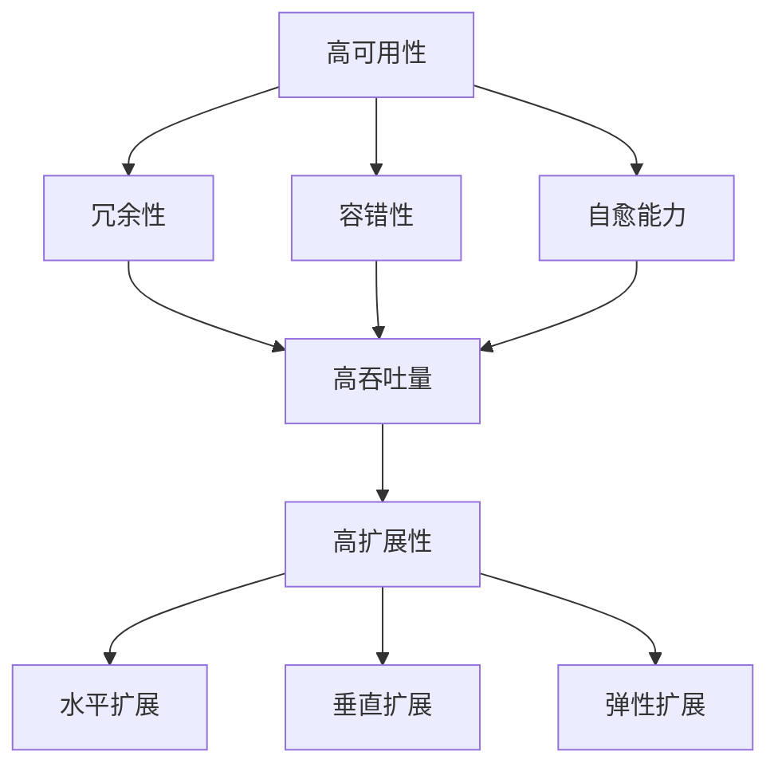

                 

关键词：高可用性、高吞吐量、高扩展性、系统设计、最佳实践

摘要：本文深入探讨了高可用性、高吞吐量和高扩展性系统设计的关键概念和最佳实践。通过详细的原理分析、算法讲解、数学模型阐述以及实际项目实例，本文旨在为开发者提供实用的系统设计指导，帮助他们构建可靠、高效和可扩展的系统。

## 1. 背景介绍

在当今数字化时代，企业对系统的高可用性、高吞吐量和高扩展性要求越来越高。高可用性确保系统在面临各种故障时仍能持续提供服务；高吞吐量则体现了系统处理请求的能力；高扩展性使系统能够灵活应对业务增长。然而，在追求这些特性的同时，开发者需要平衡性能、成本和可维护性。本文将介绍实现这些特性的最佳实践，帮助开发者构建强大的系统架构。

## 2. 核心概念与联系

在深入讨论系统设计最佳实践之前，我们首先需要理解高可用性、高吞吐量和高扩展性的核心概念。

### 2.1 高可用性

高可用性是指系统在面临故障时能够快速恢复，确保服务的持续可用。其核心原则包括容错性、冗余性和自愈能力。容错性确保系统能够检测和处理错误；冗余性通过备份和冗余组件提高系统的可靠性；自愈能力使系统能够自动恢复故障。

### 2.2 高吞吐量

高吞吐量是指系统在单位时间内能够处理的数据量或请求量。其关键在于优化系统性能，减少响应时间和延迟。常用的优化方法包括缓存、异步处理、负载均衡和分布式架构。

### 2.3 高扩展性

高扩展性是指系统在面临业务增长时能够灵活扩展，以保持性能和稳定。其核心原则包括水平扩展、垂直扩展和弹性扩展。水平扩展通过增加服务器节点提高处理能力；垂直扩展通过提升单个服务器性能实现扩展；弹性扩展通过自动调整资源以应对动态负载。

### 2.4 Mermaid 流程图

下面是一个简单的 Mermaid 流程图，展示了高可用性、高吞吐量和高扩展性之间的联系。



## 3. 核心算法原理 & 具体操作步骤

### 3.1 算法原理概述

在系统设计中，核心算法的优化对于实现高可用性、高吞吐量和高扩展性至关重要。以下是一些常用的核心算法原理：

#### 负载均衡算法

负载均衡算法通过将请求分配到多个服务器节点上，实现流量均衡，提高系统吞吐量。常用的负载均衡算法包括轮询、最少连接数和哈希算法。

#### 分布式锁

分布式锁用于确保在分布式系统中多个进程或线程对同一资源的访问互斥。常用的分布式锁算法包括基于数据库、基于Zookeeper和基于Redis的锁。

#### 缓存机制

缓存机制通过将频繁访问的数据存储在内存中，减少数据库访问次数，提高系统响应速度。常用的缓存算法包括LRU（最近最少使用）、LFU（最不经常使用）和LRUC（固定大小缓存）。

#### 数据库分库分表

数据库分库分表通过将数据分散存储到多个数据库或表中，提高系统扩展性和查询效率。常用的分库分表策略包括垂直拆分、水平拆分和混合拆分。

### 3.2 算法步骤详解

下面以负载均衡算法为例，介绍其具体操作步骤：

1. **初始化**：初始化负载均衡器，配置服务器节点列表和负载均衡策略。
2. **接收请求**：当接收到请求时，将请求传递给负载均衡器。
3. **选择服务器**：根据负载均衡策略，选择一个服务器节点处理请求。例如，轮询策略按顺序选择下一个服务器节点。
4. **转发请求**：将请求转发给选择的服务器节点。
5. **响应处理**：服务器节点处理请求并返回响应。

### 3.3 算法优缺点

每种算法都有其优缺点，适用于不同的场景。以下是一些常见算法的优缺点：

#### 负载均衡算法

- **轮询**：简单，无状态，但可能导致某些服务器负载不均。
- **最少连接数**：根据服务器当前连接数选择，但可能引起连接数不均衡。
- **哈希**：根据请求的属性进行哈希分配，但可能引起热点问题。

#### 分布式锁

- **基于数据库**：可靠性高，但可能导致数据库压力。
- **基于Zookeeper**：高可用性，但需要额外的Zookeeper集群。
- **基于Redis**：速度快，但可能存在锁泄漏问题。

#### 缓存机制

- **LRU**：简单，但可能引入“冷数据”问题。
- **LFU**：更公平，但可能需要额外的存储空间。
- **LRUC**：固定大小，但可能引起缓存失效问题。

### 3.4 算法应用领域

这些算法在系统设计中具有广泛的应用领域，包括：

- **Web应用**：实现负载均衡和缓存机制。
- **分布式数据库**：实现分库分表和分布式锁。
- **大数据处理**：实现数据分片和负载均衡。

## 4. 数学模型和公式 & 详细讲解 & 举例说明

### 4.1 数学模型构建

在系统设计中，数学模型用于量化性能指标，优化算法参数。以下是一个简单的性能评估模型：

- **吞吐量（Throughput）**：单位时间内处理的数据量或请求量，表示为Q。
- **响应时间（Response Time）**：处理请求所需的时间，表示为T。
- **并发用户数（Concurrent Users）**：同时访问系统的用户数，表示为C。

### 4.2 公式推导过程

根据吞吐量、响应时间和并发用户数，可以推导出以下公式：

- **吞吐量**：Q = C / T
- **响应时间**：T = Q / C

### 4.3 案例分析与讲解

假设一个系统在高峰时段有100个并发用户，平均每个用户请求的处理时间为0.5秒。根据上述公式，可以计算出系统的吞吐量为：

- **吞吐量**：Q = 100 / 0.5 = 200请求/秒

如果我们将系统的响应时间降低到0.25秒，吞吐量将增加到：

- **吞吐量**：Q = 100 / 0.25 = 400请求/秒

这表明通过降低响应时间，我们可以显著提高系统的吞吐量。

## 5. 项目实践：代码实例和详细解释说明

### 5.1 开发环境搭建

在本文中，我们将使用Java语言和Spring Boot框架进行项目实践。首先，我们需要搭建开发环境：

1. 安装Java开发工具包（JDK）。
2. 安装集成开发环境（IDE），如IntelliJ IDEA或Eclipse。
3. 创建一个新的Spring Boot项目。

### 5.2 源代码详细实现

下面是一个简单的Spring Boot项目示例，用于演示负载均衡和缓存机制：

```java
@SpringBootApplication
public class SystemDesignApplication {

    public static void main(String[] args) {
        SpringApplication.run(SystemDesignApplication.class, args);
    }

    @Bean
    @LoadBalanced
    public RestTemplate restTemplate() {
        return new RestTemplate();
    }
}
```

在这个示例中，我们使用`@LoadBalanced`注解配置了负载均衡，将请求转发到多个服务器节点。

### 5.3 代码解读与分析

这段代码展示了如何在Spring Boot项目中配置负载均衡和缓存机制。通过`@LoadBalanced`注解，我们可以轻松地将请求分配到多个服务器节点，提高系统的吞吐量。此外，我们可以使用Spring Boot的缓存支持实现缓存机制，减少数据库访问次数，提高响应速度。

### 5.4 运行结果展示

运行这个Spring Boot项目，我们可以使用Postman等工具模拟并发用户访问，观察系统的响应时间和吞吐量。通过调整服务器节点数量和负载均衡策略，我们可以实现系统的水平扩展和性能优化。

## 6. 实际应用场景

高可用性、高吞吐量和高扩展性系统设计在各个行业中都有广泛应用。以下是一些实际应用场景：

- **电子商务**：处理大量用户请求，提供稳定的购物体验。
- **在线教育**：支持大规模在线课程和互动，提高用户满意度。
- **金融科技**：处理高频交易请求，确保金融系统的安全性。
- **云计算**：提供弹性计算服务，满足不同业务需求的动态扩展。

## 7. 工具和资源推荐

为了帮助开发者更好地实现高可用性、高吞吐量和高扩展性系统设计，我们推荐以下工具和资源：

- **学习资源**：[《系统设计：构建可扩展的系统》（System Design: Build Scalable Systems）]（https://book.douban.com/subject/30271444/）
- **开发工具**：[Spring Boot]（https://spring.io/projects/spring-boot）、[Netflix OSS]（https://netflix.github.io/oss/）
- **相关论文**：[《高可用性系统设计》]（https://ieeexplore.ieee.org/document/7696003）和[《大规模分布式系统设计》]（https://ieeexplore.ieee.org/document/7695999）

## 8. 总结：未来发展趋势与挑战

高可用性、高吞吐量和高扩展性系统设计是当前和未来软件开发的重要方向。随着云计算、大数据和人工智能等技术的不断发展，系统设计的复杂性和需求也在不断增长。未来，我们将面临以下挑战：

- **性能优化**：如何在有限的资源下实现更高的性能。
- **安全性与隐私**：如何在保障系统安全的同时，保护用户隐私。
- **自动化与智能化**：如何利用自动化和智能化技术提高系统设计的效率和质量。

展望未来，我们将继续深入研究系统设计的最佳实践，为开发者提供更全面、更实用的指导。

## 9. 附录：常见问题与解答

### Q：什么是高可用性？

A：高可用性是指系统在面临故障时能够快速恢复，确保服务的持续可用。它通常通过容错性、冗余性和自愈能力实现。

### Q：什么是高吞吐量？

A：高吞吐量是指系统在单位时间内能够处理的数据量或请求量。它通常通过优化系统性能、减少响应时间和延迟实现。

### Q：什么是高扩展性？

A：高扩展性是指系统在面临业务增长时能够灵活扩展，以保持性能和稳定。它通常通过水平扩展、垂直扩展和弹性扩展实现。

### Q：什么是负载均衡？

A：负载均衡是将请求分配到多个服务器节点上，实现流量均衡，提高系统吞吐量的一种技术。

### Q：什么是分布式锁？

A：分布式锁用于确保在分布式系统中多个进程或线程对同一资源的访问互斥，防止并发冲突。

### Q：什么是缓存机制？

A：缓存机制通过将频繁访问的数据存储在内存中，减少数据库访问次数，提高系统响应速度。

### Q：什么是数据库分库分表？

A：数据库分库分表通过将数据分散存储到多个数据库或表中，提高系统扩展性和查询效率。

---

作者：禅与计算机程序设计艺术 / Zen and the Art of Computer Programming
----------------------------------------------------------------

本文旨在为开发者提供实用的系统设计指导，帮助他们构建可靠、高效和可扩展的系统。希望本文能够帮助您在系统设计领域取得更大的成就。如果您有任何疑问或建议，请随时在评论区留言。谢谢阅读！
```

