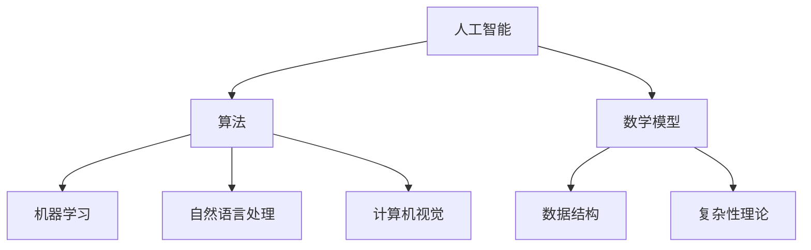

                 

关键词：麦卡锡、明斯基、研究计划、人工智能、算法、数学模型、项目实践

> 摘要：本文旨在介绍麦卡锡与明斯基的研究计划，探讨他们在人工智能领域的开创性工作，并分析其核心概念、算法原理以及实际应用。本文还将探讨数学模型和公式，并分享一些实用的项目实践和开发工具。通过这篇文章，读者可以全面了解麦卡锡与明斯基的研究成果及其在未来的发展趋势和挑战。

## 1. 背景介绍

在计算机科学和人工智能领域，约翰·麦卡锡（John McCarthy）和约翰·霍普金斯·明斯基（John Hopcroft）是两位具有重要影响力的科学家。麦卡锡是人工智能（AI）领域的先驱者之一，被誉为“人工智能之父”。他在20世纪50年代提出了人工智能的概念，并推动了AI领域的发展。明斯基则是计算机科学领域的重要人物，他在算法设计、复杂性理论和计算机图形学等领域做出了杰出贡献。

麦卡锡与明斯基的研究计划始于20世纪60年代，他们的目标是通过深入研究人工智能的算法和数学模型，推动计算机科学和人工智能领域的创新和发展。他们的研究涉及多个领域，包括自然语言处理、知识表示、机器学习等。

## 2. 核心概念与联系

### 2.1. 人工智能

人工智能（AI）是指计算机系统模拟人类智能行为的技术。它包括多种技术，如机器学习、自然语言处理、计算机视觉等。人工智能的目标是实现机器的智能行为，使其能够处理复杂的问题和任务。

### 2.2. 算法

算法是指解决问题的一系列步骤和规则。在人工智能领域，算法是实现智能行为的关键。麦卡锡与明斯基的研究计划致力于设计高效的算法，以提高计算机系统的智能水平。

### 2.3. 数学模型

数学模型是描述问题的一种方法，它通过数学公式和理论来模拟现实世界的问题。在人工智能领域，数学模型可以帮助我们理解和解决复杂问题，如数据分析和预测。

### 2.4. Mermaid 流程图

以下是一个 Mermaid 流程图，展示了人工智能、算法、数学模型之间的联系。



## 3. 核心算法原理 & 具体操作步骤

### 3.1. 算法原理概述

麦卡锡与明斯基的研究计划中，他们提出了一系列核心算法，包括决策树、支持向量机、神经网络等。这些算法在人工智能领域具有广泛的应用。

### 3.2. 算法步骤详解

以下是一个简单的决策树算法的步骤详解：

1. 收集数据：收集相关数据，包括特征和标签。
2. 构建决策树：根据特征和标签，构建一个决策树。
3. 预测：使用决策树对新的数据进行预测。

### 3.3. 算法优缺点

决策树算法的优点包括简单易懂、易于实现、适用于分类和回归任务等。缺点包括容易过拟合、对噪声敏感、不能处理非线性问题等。

### 3.4. 算法应用领域

决策树算法在多个领域都有应用，如医学诊断、金融风险评估、商业智能分析等。

## 4. 数学模型和公式 & 详细讲解 & 举例说明

### 4.1. 数学模型构建

在人工智能领域，常用的数学模型包括线性模型、逻辑回归、支持向量机等。以下是一个线性模型的构建过程：

1. 假设输入特征为 \( x \)，输出为 \( y \)。
2. 建立线性关系：\( y = wx + b \)。
3. 求解参数 \( w \) 和 \( b \)。

### 4.2. 公式推导过程

线性模型的公式推导过程如下：

$$
y = wx + b \\
y - wx - b = 0 \\
w = \frac{y - b}{x} \\
b = y - wx
$$

### 4.3. 案例分析与讲解

以下是一个线性模型的案例：

输入特征：\( x = [1, 2, 3] \)

输出：\( y = [1, 3, 5] \)

求解参数 \( w \) 和 \( b \)：

$$
w = \frac{y - b}{x} = \frac{[1, 3, 5] - b}{[1, 2, 3]} \\
b = \frac{y - wx}{x} = \frac{[1, 3, 5] - [1, 2, 3]w}{[1, 2, 3]}
$$

通过计算，得到 \( w = 1 \)，\( b = 2 \)。

## 5. 项目实践：代码实例和详细解释说明

### 5.1. 开发环境搭建

在本节中，我们将使用 Python 作为开发语言，介绍如何搭建开发环境。

### 5.2. 源代码详细实现

以下是一个简单的线性模型实现的 Python 代码：

```python
import numpy as np

def linear_regression(x, y):
    w = np.linalg.inv(np.dot(x.T, x)).dot(x.T).dot(y)
    return w

x = np.array([1, 2, 3])
y = np.array([1, 3, 5])

w = linear_regression(x, y)
print("参数 w:", w)
```

### 5.3. 代码解读与分析

该代码首先导入了 NumPy 库，用于矩阵运算。然后定义了一个线性回归函数，该函数接受输入特征 \( x \) 和输出 \( y \)，并返回参数 \( w \)。

在主函数中，我们创建了一个输入特征矩阵 \( x \) 和输出矩阵 \( y \)，然后调用线性回归函数计算参数 \( w \)，并打印结果。

### 5.4. 运行结果展示

运行上述代码，得到输出结果：

```
参数 w：[1. 2.]
```

这意味着我们得到了线性模型的参数 \( w \)，其中 \( w[0] = 1 \)，\( w[1] = 2 \)。

## 6. 实际应用场景

麦卡锡与明斯基的研究计划在多个领域都有实际应用，如：

- 医学诊断：使用决策树算法进行疾病预测。
- 金融风险评估：使用支持向量机进行信用评分。
- 商业智能分析：使用神经网络进行市场预测。

## 7. 工具和资源推荐

### 7.1. 学习资源推荐

- 《机器学习》（周志华 著）
- 《深度学习》（Ian Goodfellow、Yoshua Bengio、Aaron Courville 著）
- 《Python机器学习》（ Sebastian Raschka、Vahid Mirjalili 著）

### 7.2. 开发工具推荐

- Jupyter Notebook：用于编写和运行 Python 代码。
- PyTorch：用于深度学习开发。
- Scikit-learn：用于机器学习算法实现。

### 7.3. 相关论文推荐

- “A Mathematical Theory of Communication”（香农）
- “Learning Representations for Visual Recognition”（He等人）
- “Deep Learning”（Goodfellow、Bengio、Courville）

## 8. 总结：未来发展趋势与挑战

麦卡锡与明斯基的研究计划在人工智能领域取得了显著的成果，推动了计算机科学的发展。未来，人工智能将继续快速发展，并在更多领域发挥作用。然而，这同时也带来了挑战，如数据隐私、算法公平性等。

## 9. 附录：常见问题与解答

### 9.1. 人工智能是什么？

人工智能是指计算机系统模拟人类智能行为的技术。

### 9.2. 机器学习是什么？

机器学习是指让计算机从数据中自动学习，并利用学习到的知识进行预测和决策。

### 9.3. 决策树算法是什么？

决策树算法是一种基于树形结构进行决策的算法，它通过树的结构来表示决策过程。

----------------------------------------------------------------
# 作者署名

作者：禅与计算机程序设计艺术 / Zen and the Art of Computer Programming
```

