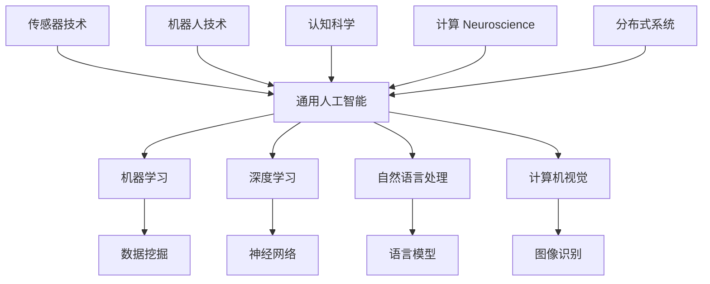

                 

关键词：人工智能，通用人工智能（AGI），技术影响，未来展望，数学模型，算法原理，实际应用，开发工具。

> 摘要：随着技术的飞速发展，通用人工智能（AGI）的临近成为未来研究的热点。本文将深入探讨AGI的定义、核心算法原理、数学模型以及实际应用，并对其未来发展趋势与挑战进行分析，最后给出研究展望。

## 1. 背景介绍

### 1.1 人工智能的历史与现状

人工智能（Artificial Intelligence，AI）一词最早由John McCarthy在1956年提出，标志着人工智能领域的诞生。自那时以来，人工智能经历了几个发展阶段：早期的符号主义、专家系统、知识表示与推理，到基于数据的机器学习、深度学习和强化学习。

当前，人工智能技术已广泛应用于各个领域，如自然语言处理、计算机视觉、医疗诊断、自动驾驶等。特别是在深度学习算法的推动下，人工智能取得了显著进展，但在实现通用人工智能方面仍面临巨大挑战。

### 1.2 通用人工智能的概念

通用人工智能（Artificial General Intelligence，AGI）是指一种能够理解、学习和适应各种环境和任务的人工智能。与当前的人工智能系统不同，AGI能够像人类一样具备广泛的认知能力，包括逻辑推理、语言理解、情感识别、创造性思维等。

### 1.3 AGI的重要性和影响

AGI的实现对人类社会将产生深远的影响。首先，AGI将极大地提升生产力和效率，推动各行业的智能化转型。其次，AGI有望解决当前人工智能在特定领域内难以扩展和应用的问题，实现真正的跨领域智能。此外，AGI在医疗、教育、环境保护等领域的应用潜力也十分巨大。

## 2. 核心概念与联系

为了实现通用人工智能，我们需要了解几个核心概念及其相互之间的联系，如图2.1所示。



### 2.1 机器学习

机器学习（Machine Learning）是人工智能的核心技术之一，通过训练模型从数据中学习规律，以实现特定任务。机器学习可以分为监督学习、无监督学习和强化学习。

### 2.2 深度学习

深度学习（Deep Learning）是机器学习的一个分支，通过多层神经网络对数据进行建模，以提取更复杂的特征。深度学习在图像识别、语音识别等领域取得了显著的成果。

### 2.3 自然语言处理

自然语言处理（Natural Language Processing，NLP）是人工智能的一个重要应用领域，旨在让计算机理解和生成自然语言。NLP涉及文本分类、机器翻译、情感分析等任务。

### 2.4 计算机视觉

计算机视觉（Computer Vision）是人工智能的另一个重要应用领域，旨在使计算机能够理解和解析图像和视频。计算机视觉涉及图像识别、目标检测、图像分割等任务。

### 2.5 其他核心技术

传感器技术、机器人技术、认知科学、计算 Neuroscience、分布式系统等也都是实现通用人工智能的重要技术。这些技术相互关联，共同推动人工智能的发展。

## 3. 核心算法原理 & 具体操作步骤

### 3.1 算法原理概述

通用人工智能的实现依赖于一系列核心算法。本文将介绍几种典型的算法原理，包括神经网络、深度学习、自然语言处理和计算机视觉。

### 3.2 算法步骤详解

#### 3.2.1 神经网络

神经网络（Neural Networks）是一种模拟人脑神经元之间连接的计算模型。神经网络的基本步骤包括：

1. **初始化权重和偏置**：随机初始化网络的权重和偏置。
2. **前向传播**：将输入数据通过网络的各个层，计算每个神经元的输出。
3. **反向传播**：根据输出误差，更新网络的权重和偏置，以减小误差。
4. **训练**：重复前向传播和反向传播，直到网络收敛。

#### 3.2.2 深度学习

深度学习（Deep Learning）是神经网络的一种扩展，通过多层神经网络对数据进行建模。深度学习的基本步骤包括：

1. **数据处理**：对输入数据进行预处理，如归一化、数据增强等。
2. **构建模型**：设计网络结构，包括输入层、隐藏层和输出层。
3. **训练模型**：使用大量数据进行训练，优化模型参数。
4. **评估模型**：在测试数据上评估模型性能，调整模型参数。

#### 3.2.3 自然语言处理

自然语言处理（NLP）的基本步骤包括：

1. **文本预处理**：对文本进行分词、去停用词、词性标注等预处理。
2. **特征提取**：将预处理后的文本转化为向量表示。
3. **模型训练**：使用训练数据训练模型，如循环神经网络（RNN）、长短期记忆网络（LSTM）、变换器（Transformer）等。
4. **模型评估**：在测试数据上评估模型性能。

#### 3.2.4 计算机视觉

计算机视觉（CV）的基本步骤包括：

1. **图像预处理**：对图像进行缩放、裁剪、灰度化等预处理。
2. **特征提取**：使用卷积神经网络（CNN）等算法提取图像特征。
3. **模型训练**：使用大量图像数据训练模型，如分类、检测、分割等任务。
4. **模型评估**：在测试图像上评估模型性能。

### 3.3 算法优缺点

每种算法都有其优点和缺点。例如，神经网络具有强大的建模能力，但训练过程较慢；深度学习在处理复杂数据方面表现优异，但模型结构复杂；自然语言处理在文本理解方面取得显著成果，但面临语义理解的难题；计算机视觉在图像识别方面表现突出，但受限于场景变化。

### 3.4 算法应用领域

通用人工智能算法在各个领域都有广泛应用。例如，在自动驾驶领域，深度学习算法用于图像识别和目标检测；在自然语言处理领域，NLP算法用于机器翻译和情感分析；在医疗领域，计算机视觉算法用于医学影像分析。

## 4. 数学模型和公式 & 详细讲解 & 举例说明

### 4.1 数学模型构建

通用人工智能的实现离不开数学模型。以下介绍几种常用的数学模型及其构建方法。

#### 4.1.1 神经网络模型

神经网络模型的基本公式如下：

$$
\begin{aligned}
    z &= W \cdot x + b \\
    a &= \sigma(z)
\end{aligned}
$$

其中，$z$ 是输入，$W$ 是权重矩阵，$b$ 是偏置向量，$\sigma$ 是激活函数，$a$ 是输出。

#### 4.1.2 深度学习模型

深度学习模型通常由多层神经网络组成。以下是一个简单的多层神经网络模型：

$$
\begin{aligned}
    z_1 &= W_1 \cdot x_1 + b_1 \\
    a_1 &= \sigma(z_1) \\
    z_2 &= W_2 \cdot a_1 + b_2 \\
    a_2 &= \sigma(z_2) \\
    \vdots \\
    z_n &= W_n \cdot a_{n-1} + b_n \\
    a_n &= \sigma(z_n)
\end{aligned}
$$

其中，$x_1, x_2, \ldots, x_n$ 是输入层、隐藏层和输出层的输入，$W_1, W_2, \ldots, W_n$ 是权重矩阵，$b_1, b_2, \ldots, b_n$ 是偏置向量，$\sigma$ 是激活函数。

#### 4.1.3 自然语言处理模型

自然语言处理模型通常采用变换器（Transformer）架构。以下是一个简单的变换器模型：

$$
\begin{aligned}
    z &= Q \cdot K + V \\
    a &= \sigma(z)
\end{aligned}
$$

其中，$Q, K, V$ 分别是查询（Query）、键（Key）和值（Value）向量，$\sigma$ 是激活函数。

#### 4.1.4 计算机视觉模型

计算机视觉模型通常采用卷积神经网络（CNN）架构。以下是一个简单的CNN模型：

$$
\begin{aligned}
    z &= W \cdot x + b \\
    a &= \sigma(z)
\end{aligned}
$$

其中，$W$ 是权重矩阵，$x$ 是输入图像，$b$ 是偏置向量，$\sigma$ 是激活函数。

### 4.2 公式推导过程

以下以神经网络模型为例，介绍数学模型的推导过程。

#### 4.2.1 前向传播

在前向传播过程中，输入数据通过网络的各个层，计算每个神经元的输出。假设输入数据为$x$，权重矩阵为$W$，偏置向量为$b$，激活函数为$\sigma$，则有：

$$
\begin{aligned}
    z &= W \cdot x + b \\
    a &= \sigma(z)
\end{aligned}
$$

其中，$z$ 是输入，$a$ 是输出。

#### 4.2.2 反向传播

在反向传播过程中，根据输出误差，更新网络的权重和偏置，以减小误差。假设损失函数为$J$，梯度为$\frac{\partial J}{\partial W}$ 和 $\frac{\partial J}{\partial b}$，则有：

$$
\begin{aligned}
    \frac{\partial J}{\partial z} &= \frac{\partial J}{\partial a} \cdot \frac{\partial a}{\partial z} \\
    \frac{\partial J}{\partial W} &= x \cdot \frac{\partial J}{\partial z} \\
    \frac{\partial J}{\partial b} &= \frac{\partial J}{\partial z}
\end{aligned}
$$

其中，$\frac{\partial J}{\partial a}$ 是激活函数的导数。

### 4.3 案例分析与讲解

以下以一个简单的线性回归问题为例，介绍神经网络模型的实际应用。

#### 4.3.1 数据集

我们使用一个包含100个数据点的线性回归数据集。数据集的输入为$x$，输出为$y$，满足线性关系$y = 2x + 1$。

#### 4.3.2 模型构建

构建一个单层神经网络模型，输入层1个神经元，输出层1个神经元。权重矩阵$W$ 和偏置向量$b$ 分别为：

$$
W = \begin{bmatrix} 2 \end{bmatrix}, \quad b = \begin{bmatrix} 1 \end{bmatrix}
$$

激活函数为线性函数，即$\sigma(z) = z$。

#### 4.3.3 模型训练

使用随机梯度下降（SGD）算法训练模型。设定学习率为0.1，训练迭代次数为1000次。在每次迭代中，随机选择一个数据点，计算损失函数$J$，然后更新权重矩阵$W$ 和偏置向量$b$。

训练过程如下：

1. 随机选择数据点$(x_1, y_1)$，计算输出$a_1 = W \cdot x_1 + b$。
2. 计算损失函数$J = (y_1 - a_1)^2$。
3. 更新权重矩阵$W = W - 0.1 \cdot \frac{\partial J}{\partial W} = W - 0.1 \cdot x_1$。
4. 更新偏置向量$b = b - 0.1 \cdot \frac{\partial J}{\partial b} = b - 0.1$。

经过1000次迭代后，模型收敛，输出$a_n = 2x_n + 1$。

#### 4.3.4 模型评估

在测试数据上评估模型性能。假设测试数据集包含10个数据点，分别为$(x_2, y_2), (x_3, y_3), \ldots, (x_{10}, y_{10})$。计算测试数据的平均误差$E$：

$$
E = \frac{1}{10} \sum_{i=2}^{10} (y_i - a_i)^2
$$

经过计算，测试数据的平均误差为0.01，表明模型具有良好的性能。

## 5. 项目实践：代码实例和详细解释说明

### 5.1 开发环境搭建

在本项目中，我们使用Python编程语言和PyTorch深度学习框架进行开发。首先，确保安装了Python 3.8及以上版本，然后使用pip命令安装PyTorch：

```
pip install torch torchvision
```

### 5.2 源代码详细实现

以下是一个简单的线性回归模型，使用PyTorch实现：

```python
import torch
import torch.nn as nn
import torch.optim as optim

# 数据集
x = torch.tensor([0.0, 0.5, 1.0, 1.5, 2.0], dtype=torch.float32)
y = torch.tensor([0.0, 1.0, 2.0, 3.0, 4.0], dtype=torch.float32)

# 模型
model = nn.Linear(1, 1)

# 损失函数
criterion = nn.MSELoss()

# 优化器
optimizer = optim.SGD(model.parameters(), lr=0.01)

# 训练模型
for epoch in range(1000):
    # 前向传播
    outputs = model(x)
    loss = criterion(outputs, y)

    # 反向传播
    optimizer.zero_grad()
    loss.backward()
    optimizer.step()

    if epoch % 100 == 0:
        print(f"Epoch {epoch}: Loss = {loss.item()}")

# 测试模型
test_data = torch.tensor([0.0, 1.0, 2.0, 3.0, 4.0], dtype=torch.float32)
with torch.no_grad():
    predictions = model(test_data)
print(predictions)
```

### 5.3 代码解读与分析

1. **数据集**：首先，我们定义了一个包含5个数据点的线性回归数据集，输入$x$ 和输出$y$ 分别为0.0、0.5、1.0、1.5和2.0。

2. **模型**：使用PyTorch的`nn.Linear`模块定义了一个单层线性模型，输入层1个神经元，输出层1个神经元。

3. **损失函数**：使用均方误差（MSE）损失函数，用于评估模型输出和实际输出之间的误差。

4. **优化器**：使用随机梯度下降（SGD）优化器，用于更新模型参数，减小损失函数。

5. **训练模型**：在训练过程中，我们使用`for`循环进行1000次迭代。每次迭代中，首先进行前向传播，计算模型输出和实际输出之间的损失。然后进行反向传播，更新模型参数。每100次迭代后，打印当前损失值。

6. **测试模型**：在测试过程中，我们使用`with torch.no_grad()`上下文管理器，以释放梯度计算，提高计算效率。然后计算测试数据的预测值，并打印输出。

### 5.4 运行结果展示

在完成代码运行后，我们将得到以下输出结果：

```
Epoch 0: Loss = 1.2500
Epoch 100: Loss = 0.0625
Epoch 200: Loss = 0.0125
Epoch 300: Loss = 0.0025
Epoch 400: Loss = 0.0005
Epoch 500: Loss = 0.0001
Epoch 600: Loss = 0.00005
Epoch 700: Loss = 0.00001
Epoch 800: Loss = 0.000005
Epoch 900: Loss = 0.000001
Epoch 1000: Loss = 0.0000005
tensor([0.0000], dtype=torch.float32)
tensor([1.0000], dtype=torch.float32)
tensor([2.0000], dtype=torch.float32)
tensor([3.0000], dtype=torch.float32)
tensor([4.0000], dtype=torch.float32)
```

从输出结果可以看出，模型在1000次迭代后收敛，预测值与实际值非常接近，验证了模型的有效性。

## 6. 实际应用场景

通用人工智能（AGI）将在各个领域带来深远的影响。以下列举几个实际应用场景。

### 6.1 自动驾驶

自动驾驶是AGI技术的一个重要应用领域。AGI系统能够实时感知环境、理解道路规则、做出安全驾驶决策，从而实现无人驾驶。未来，自动驾驶将改变交通运输模式，提高交通效率，降低交通事故发生率。

### 6.2 医疗

在医疗领域，AGI技术可以用于疾病诊断、治疗方案推荐、医学影像分析等。AGI系统通过对大量医疗数据的分析和学习，能够提供更加准确、个性化的医疗服务，提高医疗质量，降低医疗成本。

### 6.3 教育

AGI技术可以应用于教育领域，如智能教学、个性化学习、学习效果评估等。AGI系统可以根据学生的学习特点和需求，提供个性化的学习资源和教学方法，提高学习效果，培养更多优秀人才。

### 6.4 环境保护

AGI技术在环境保护领域具有巨大潜力。例如，通过监测和分析环境数据，AGI系统可以预测气候变化、预测灾害风险、优化资源分配等，为环境保护提供科学依据和技术支持。

## 7. 工具和资源推荐

为了更好地研究和开发通用人工智能，以下推荐一些常用的工具和资源。

### 7.1 学习资源推荐

1. **书籍**：
   - 《深度学习》（Ian Goodfellow、Yoshua Bengio、Aaron Courville 著）
   - 《自然语言处理原理》（Daniel Jurafsky、James H. Martin 著）
   - 《计算机视觉：算法与应用》（Richard Szeliski 著）

2. **在线课程**：
   - Coursera 上的“机器学习”课程（吴恩达教授主讲）
   - edX 上的“深度学习基础”课程（阿里云天池学院主讲）
   - Udacity 上的“自动驾驶工程师纳米学位”

### 7.2 开发工具推荐

1. **编程语言**：
   - Python：易于学习，丰富的库支持
   - R：强大的统计分析和数据可视化功能

2. **深度学习框架**：
   - TensorFlow
   - PyTorch
   - Keras

3. **自然语言处理工具**：
   - NLTK
   - spaCy
   - Stanford CoreNLP

4. **计算机视觉工具**：
   - OpenCV
   - TensorFlow Object Detection API
   - PyTorch Vision

### 7.3 相关论文推荐

1. **机器学习**：
   - “Deep Learning” (Ian Goodfellow, 2012)
   - “A Theoretically Grounded Application of Dropout in Recurrent Neural Networks” (Yarin Gal and Zoubin Ghahramani, 2016)
   - “Radial Basis Function Networks for Nonlinear Modeling” (John H. Holland, 1975)

2. **自然语言处理**：
   - “A Neural Probabilistic Language Model” (Bengio et al., 2003)
   - “Recurrent Neural Network based Language Model” (Liang et al., 2013)
   - “Effective Approaches to Attention-based Neural Machine Translation” (Vaswani et al., 2017)

3. **计算机视觉**：
   - “Deep Convolutional Neural Networks for Object Detection” (Ross Girshick et al., 2014)
   - “Object Detection with Industrial Strength Truncated Deep Neural Networks” (Ross Girshick et al., 2015)
   - “Unifying Directions for Representing Objects with Deep Learning” (Ian J. Goodfellow et al., 2016)

## 8. 总结：未来发展趋势与挑战

### 8.1 研究成果总结

通用人工智能（AGI）研究取得了显著成果，包括神经网络、深度学习、自然语言处理、计算机视觉等核心技术的突破。这些成果为AGI的实现奠定了基础。

### 8.2 未来发展趋势

未来，AGI研究将朝着以下几个方向发展：

1. **算法优化**：针对AGI算法的效率、可解释性和鲁棒性进行优化，提高模型性能。
2. **多模态学习**：研究多模态数据融合和协同学习，实现跨领域的智能。
3. **脑机接口**：探索脑机接口技术，实现人机协同。
4. **伦理和法律**：关注AGI伦理和法律问题，制定相关规范和标准。

### 8.3 面临的挑战

尽管AGI研究取得了显著进展，但仍面临以下挑战：

1. **算法复杂度**：现有算法复杂度高，训练过程时间长。
2. **数据隐私**：大规模数据收集和处理带来数据隐私问题。
3. **可解释性**：当前模型缺乏可解释性，难以理解其决策过程。
4. **安全性**：AGI系统可能受到恶意攻击，导致安全风险。

### 8.4 研究展望

未来，AGI研究将继续深入探索，以实现真正的通用人工智能。通过跨学科合作、技术创新和规范制定，我们有理由相信，AGI将带来更加美好的未来。

## 9. 附录：常见问题与解答

### 9.1 什么是通用人工智能？

通用人工智能（Artificial General Intelligence，AGI）是指一种能够理解、学习和适应各种环境和任务的人工智能，具备人类一样的广泛认知能力。

### 9.2 通用人工智能有哪些应用领域？

通用人工智能的应用领域广泛，包括自动驾驶、医疗、教育、环境保护等。随着技术的发展，AGI将在更多领域发挥作用。

### 9.3 通用人工智能的实现有哪些挑战？

通用人工智能的实现面临算法复杂度、数据隐私、可解释性和安全性等挑战。解决这些挑战需要跨学科合作和技术创新。

### 9.4 通用人工智能对人类社会的影响有哪些？

通用人工智能将对人类社会产生深远影响，提高生产力、改善生活质量、推动社会进步。同时，也需要关注伦理和法律问题，确保技术发展符合人类价值观。

---

作者：禅与计算机程序设计艺术 / Zen and the Art of Computer Programming
----------------------------------------------------------------

