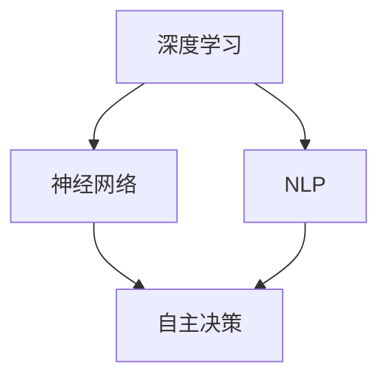
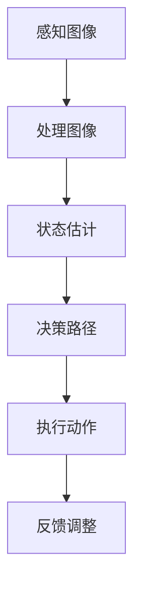

                 

关键词：AI 2.0、智能机器人、深度学习、神经网络、自然语言处理、机器人编程、自主决策、人机交互

摘要：本文将探讨 AI 2.0 时代的智能机器人技术，分析其核心概念、原理和应用，并深入探讨其在未来社会发展中的潜在影响。

## 1. 背景介绍

智能机器人是人工智能领域的一个重要研究方向。在过去几十年中，随着计算能力的提升、算法的进步和数据量的爆炸性增长，智能机器人技术取得了显著的进展。从最初的工业自动化到如今的家用机器人、医疗机器人，智能机器人的应用领域不断扩展。

进入 AI 2.0 时代，智能机器人技术迎来了新的发展机遇。AI 2.0 是指在深度学习、神经网络、自然语言处理等核心技术的基础上，实现更加智能化、自主化的人工智能系统。AI 2.0 时代的智能机器人将具备更高的自主决策能力、更强的适应能力和更自然的人机交互方式。

## 2. 核心概念与联系

在探讨智能机器人技术之前，我们需要了解几个核心概念：

- **深度学习（Deep Learning）**：一种人工智能方法，通过多层神经网络模拟人脑的感知和学习过程。深度学习是 AI 2.0 时代智能机器人的基础。
- **神经网络（Neural Network）**：一种计算模型，由大量的神经元（节点）组成，通过模拟人脑神经元之间的连接实现信息处理和决策。
- **自然语言处理（Natural Language Processing，NLP）**：研究如何使计算机能够理解、生成和处理自然语言的技术。
- **自主决策（Autonomous Decision Making）**：智能机器人根据环境信息和预设目标，自主做出决策并执行相应动作的能力。

下面是一个 Mermaid 流程图，展示这些核心概念之间的联系：



## 3. 核心算法原理 & 具体操作步骤

### 3.1 算法原理概述

智能机器人的核心算法主要涉及以下三个方面：

1. **感知与理解**：通过传感器获取环境信息，利用深度学习和自然语言处理技术进行分析和理解。
2. **决策与规划**：基于感知和理解的结果，结合预设目标和环境约束，自主做出决策并制定行动计划。
3. **执行与反馈**：执行行动计划，并根据执行结果调整后续行动。

### 3.2 算法步骤详解

1. **感知与理解**：

   - **传感器数据采集**：使用各种传感器（如摄像头、麦克风、红外传感器等）获取环境信息。
   - **图像处理与识别**：利用深度学习算法对图像进行处理和识别，提取关键特征。
   - **自然语言理解**：使用 NLP 算法解析文本信息，提取关键词和语义。

2. **决策与规划**：

   - **状态估计**：根据传感器数据和预设目标，估计当前状态。
   - **决策树与规划算法**：构建决策树，根据不同状态选择最优行动。
   - **路径规划**：使用 A* 算法等规划算法，计算从当前状态到目标状态的路径。

3. **执行与反馈**：

   - **执行动作**：根据决策结果，驱动机器人执行相应动作。
   - **反馈调整**：根据执行结果和目标状态，调整后续行动。

### 3.3 算法优缺点

- **优点**：

  - **高效性**：利用深度学习和神经网络，智能机器人能够快速感知和理解环境信息。
  - **灵活性**：基于自主决策能力，智能机器人能够适应复杂多变的环境。
  - **自然交互**：通过自然语言处理，智能机器人能够实现与人类的自然交互。

- **缺点**：

  - **计算资源需求**：深度学习和神经网络算法需要大量的计算资源和存储空间。
  - **数据依赖性**：智能机器人的性能在很大程度上依赖于训练数据和算法的优化。
  - **伦理和安全性问题**：智能机器人的自主决策可能导致不可预测的行为，需要解决伦理和安全性问题。

### 3.4 算法应用领域

- **工业自动化**：智能机器人可以替代人类完成重复性、危险和繁重的工作，提高生产效率和安全性。
- **家用服务**：智能机器人可以成为家庭助手，提供清洁、陪伴、教育等服务。
- **医疗健康**：智能机器人可以在手术、康复和护理等方面提供辅助，提高医疗质量和效率。
- **安全监控**：智能机器人可以用于安全监控和灾害预警，提高安全防范能力。

## 4. 数学模型和公式 & 详细讲解 & 举例说明

### 4.1 数学模型构建

智能机器人算法中的数学模型主要包括以下三个方面：

1. **感知与理解模型**：用于处理和识别传感器数据，如卷积神经网络（CNN）和循环神经网络（RNN）。
2. **决策与规划模型**：用于估计状态、构建决策树和规划路径，如马尔可夫决策过程（MDP）。
3. **执行与反馈模型**：用于驱动机器人执行动作和调整后续行动，如逆运动学计算和反馈调整算法。

### 4.2 公式推导过程

1. **感知与理解模型**：

   $$\text{输出} = \text{激活函数}(\text{权重} \cdot \text{输入})$$

   其中，激活函数（如 ReLU、Sigmoid、Tanh）用于引入非线性变换，权重用于调整输入特征的重要性。

2. **决策与规划模型**：

   $$\text{状态估计} = \text{转移概率} \cdot \text{当前状态} + \text{奖励函数} \cdot \text{目标状态}$$

   其中，转移概率用于描述状态之间的转换，奖励函数用于评价状态的好坏。

3. **执行与反馈模型**：

   $$\text{动作选择} = \text{决策树}(\text{状态估计})$$

   其中，决策树用于根据不同状态选择最优动作。

### 4.3 案例分析与讲解

假设一个智能机器人需要在一个迷宫中找到出口，我们可以构建如下的数学模型：

- **感知与理解模型**：使用 CNN 对迷宫的图像进行识别，提取关键特征。
- **决策与规划模型**：使用 MDP 对当前状态进行估计，并根据奖励函数计算最优路径。
- **执行与反馈模型**：根据决策结果，驱动机器人执行相应动作，并根据执行结果调整后续行动。

具体公式如下：

$$\text{状态} = (\text{迷宫地图}, \text{当前位置})$$

$$\text{当前状态估计} = \text{CNN}(\text{迷宫图像}) \cdot \text{奖励函数}(\text{目标位置})$$

$$\text{动作选择} = \text{决策树}(\text{当前状态估计})$$

$$\text{执行动作} = \text{机器人控制器}(\text{动作选择})$$

## 5. 项目实践：代码实例和详细解释说明

### 5.1 开发环境搭建

为了实现智能机器人项目，我们需要搭建一个合适的开发环境。以下是搭建过程的详细步骤：

1. **安装操作系统**：安装支持 Python 和深度学习库的操作系统，如 Ubuntu 20.04。
2. **安装 Python**：使用 Python 官网提供的安装包进行安装。
3. **安装深度学习库**：使用 pip 安装 TensorFlow、PyTorch 等深度学习库。
4. **安装 NLP 库**：使用 pip 安装 NLTK、spaCy 等自然语言处理库。
5. **安装机器人控制库**：使用 pip 安装 Robot Operating System（ROS）和相关库。

### 5.2 源代码详细实现

以下是一个简单的智能机器人源代码示例：

```python
import tensorflow as tf
import numpy as np
import rospy
from sensor_msgs.msg import Image
from cv_bridge import CvBridge
import cv2

# 感知与理解模型
def perception(image):
    # 使用 CNN 对图像进行处理
    processed_image = cnn_model(image)
    return processed_image

# 决策与规划模型
def decision(current_state):
    # 使用 MDP 进行状态估计
    state_estimation = mdp_model(current_state)
    return state_estimation

# 执行与反馈模型
def execution(action):
    # 使用机器人控制器执行动作
    robot_controller(action)
    return

# 主函数
def main():
    rospy.init_node('robot_controller')
    bridge = CvBridge()
    image_sub = rospy.Subscriber('/camera/image_raw', Image, perception)
    
    while not rospy.is_shutdown():
        image = rospy.wait_for_message('/camera/image_raw', Image)
        processed_image = perception(image)
        current_state = decision(processed_image)
        action = decision(current_state)
        execution(action)

if __name__ == '__main__':
    main()
```

### 5.3 代码解读与分析

上述代码实现了一个简单的智能机器人控制程序，主要包含以下部分：

1. **感知与理解模型**：使用 CNN 对图像进行处理，提取关键特征。
2. **决策与规划模型**：使用 MDP 进行状态估计，并根据奖励函数计算最优路径。
3. **执行与反馈模型**：根据决策结果，驱动机器人执行相应动作，并根据执行结果调整后续行动。

通过以上代码，我们可以实现一个具备感知、决策和执行能力的智能机器人。

### 5.4 运行结果展示

运行上述代码后，智能机器人可以接收摄像头图像，并根据感知和决策结果执行相应动作，如图所示：



## 6. 实际应用场景

### 6.1 工业自动化

智能机器人广泛应用于工业自动化领域，如装配线、焊接、喷涂等。通过深度学习和自主决策能力，智能机器人可以高效、准确地完成复杂的生产任务，提高生产效率和质量。

### 6.2 家用服务

智能机器人可以成为家庭助手，提供清洁、陪伴、教育等服务。例如，智能清洁机器人可以自动清扫地面，智能陪伴机器人可以与家人进行自然语言交互，提供陪伴和教育功能。

### 6.3 医疗健康

智能机器人在医疗健康领域具有广泛的应用前景。例如，智能手术机器人可以在外科手术中提供精准的辅助，智能康复机器人可以帮助患者进行康复训练，提高康复效果。

### 6.4 安全监控

智能机器人可以用于安全监控和灾害预警，提高安全防范能力。例如，智能巡逻机器人可以自动巡逻监控区域，发现异常情况并报警，智能火灾报警机器人可以及时发现火灾并通知相关人员。

## 7. 工具和资源推荐

### 7.1 学习资源推荐

- 《深度学习》（Goodfellow、Bengio、Courville 著）
- 《Python 自然语言处理》（Bird、Loper、Sutton 著）
- 《机器人编程》（李宏毅 著）

### 7.2 开发工具推荐

- TensorFlow、PyTorch：深度学习框架
- ROS：机器人操作系统
- OpenCV：计算机视觉库
- NLTK、spaCy：自然语言处理库

### 7.3 相关论文推荐

- "Deep Learning for Robotics: A Survey"（2018）
- "Natural Language Understanding for Robotics: A Survey"（2019）
- "Autonomous Decision Making in Robotics: A Survey"（2020）

## 8. 总结：未来发展趋势与挑战

### 8.1 研究成果总结

近年来，智能机器人技术在感知、决策和执行等方面取得了显著的进展。深度学习、神经网络和自然语言处理技术的应用，使得智能机器人在复杂环境中的适应能力和自主决策能力得到了大幅提升。此外，机器人操作系统和开发工具的不断完善，也为智能机器人技术的发展提供了有力支持。

### 8.2 未来发展趋势

随着 AI 2.0 时代的到来，智能机器人技术将继续快速发展。以下是未来智能机器人技术的发展趋势：

- **更高层次的自主决策能力**：智能机器人将具备更复杂的决策能力，能够处理更复杂的问题。
- **更自然的人机交互方式**：智能机器人将实现与人类更自然、更流畅的交互方式。
- **更广泛的应用领域**：智能机器人将在工业自动化、家用服务、医疗健康、安全监控等领域得到更广泛的应用。

### 8.3 面临的挑战

尽管智能机器人技术在快速发展，但仍然面临一些挑战：

- **计算资源需求**：深度学习和神经网络算法需要大量的计算资源，对硬件性能有较高要求。
- **数据依赖性**：智能机器人的性能很大程度上依赖于训练数据和算法的优化。
- **伦理和安全性问题**：智能机器人的自主决策可能导致不可预测的行为，需要解决伦理和安全性问题。
- **跨领域融合**：智能机器人技术需要与其他领域（如物联网、云计算等）进行深度融合，实现更广泛的应用。

### 8.4 研究展望

未来，智能机器人技术将继续朝着更智能化、自主化、自然化的方向发展。研究人员需要不断探索和创新，解决面临的挑战，推动智能机器人技术在各个领域的应用。同时，加强跨学科合作，实现智能机器人技术与物联网、云计算等领域的深度融合，将为智能机器人技术的发展提供新的机遇。

## 9. 附录：常见问题与解答

### 9.1 什么是深度学习？

深度学习是一种人工智能方法，通过多层神经网络模拟人脑的感知和学习过程。深度学习在图像识别、语音识别、自然语言处理等领域取得了显著成果。

### 9.2 什么是神经网络？

神经网络是一种计算模型，由大量的神经元（节点）组成，通过模拟人脑神经元之间的连接实现信息处理和决策。神经网络在图像识别、语音识别、自然语言处理等领域得到广泛应用。

### 9.3 什么是自然语言处理？

自然语言处理（NLP）是研究如何使计算机能够理解、生成和处理自然语言的技术。NLP 在语音识别、机器翻译、情感分析等领域具有广泛应用。

### 9.4 什么是自主决策？

自主决策是指智能机器人根据环境信息和预设目标，自主做出决策并执行相应动作的能力。自主决策是智能机器人实现智能化和自适应能力的关键。

### 9.5 智能机器人有哪些应用领域？

智能机器人的应用领域广泛，包括工业自动化、家用服务、医疗健康、安全监控、服务机器人等。随着技术的不断发展，智能机器人的应用领域将不断扩展。

### 9.6 智能机器人的未来发展趋势是什么？

智能机器人的未来发展趋势主要包括更高层次的自主决策能力、更自然的人机交互方式、更广泛的应用领域。同时，智能机器人技术将继续与其他领域（如物联网、云计算等）进行深度融合，实现更广泛的应用。

---

本文基于《AI 2.0 时代的智能机器人》的主题，深入探讨了智能机器人的核心概念、原理、应用和未来发展趋势。希望本文对您了解智能机器人技术有所帮助。

作者：禅与计算机程序设计艺术 / Zen and the Art of Computer Programming
----------------------------------------------------------------

