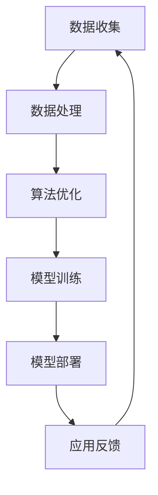

                 

关键词：人工智能，AI 2.0，基础设施建设，技术架构，战略规划

摘要：随着人工智能技术的迅猛发展，AI 2.0 时代的到来预示着技术的革新与变革。本文将深入探讨 AI 2.0 时代基础设施建设的战略意义，从核心概念、算法原理、数学模型到实际应用，全方位解析 AI 基础设施建设的现状与未来。

## 1. 背景介绍

在过去的几十年里，人工智能（AI）经历了从理论到应用的快速发展。从最初的符号主义人工智能，到基于统计学习的机器学习，再到如今的深度学习，每一次技术革新都为人工智能的发展带来了新的契机。然而，随着 AI 技术的不断进化，我们逐渐意识到，单纯依靠算法优化和数据收集已经无法满足 AI 的发展需求。AI 2.0 时代的到来，预示着基础设施建设的战略意义愈加凸显。

AI 2.0 时代，不仅仅是算法和数据的变革，更是基础设施的升级。在这个时代，我们需要构建一个稳定、高效、可扩展的基础设施体系，以支持 AI 技术的持续发展。这个基础设施不仅包括硬件设备，还涵盖了软件平台、数据处理能力、安全防护等多个方面。

## 2. 核心概念与联系

在讨论 AI 2.0 时代的基础设施建设之前，我们首先需要了解一些核心概念。以下是一个使用 Mermaid 流程图表示的 AI 2.0 基础设施核心概念与联系：



### 2.1 数据收集

数据收集是 AI 2.0 时代基础设施建设的基石。高质量的数据是实现 AI 模型准确性的关键。在这个环节，我们需要构建分布式数据采集系统，确保数据的多样性和实时性。

### 2.2 数据处理

数据处理是数据收集的延伸，它包括数据清洗、数据整合和数据存储等环节。一个高效的数据处理系统能够显著提升数据利用率，为后续的算法优化和模型训练提供支持。

### 2.3 算法优化

算法优化是 AI 2.0 时代基础设施建设的核心。通过不断的算法迭代，我们可以提高模型的性能和稳定性。在这个环节，我们需要构建一个灵活的算法优化平台，支持多种算法的快速部署和测试。

### 2.4 模型训练

模型训练是 AI 2.0 时代基础设施建设的核心环节。高效的模型训练系统能够在短时间内完成大规模数据的训练，从而提高模型的准确性和鲁棒性。

### 2.5 模型部署

模型部署是将训练完成的模型应用到实际场景中的过程。一个高效、可扩展的模型部署系统能够确保模型在不同环境下的一致性和稳定性。

### 2.6 应用反馈

应用反馈是 AI 2.0 时代基础设施建设的重要一环。通过收集用户反馈，我们可以不断优化模型和应用，实现持续迭代和改进。

## 3. 核心算法原理 & 具体操作步骤

### 3.1 算法原理概述

在 AI 2.0 时代，核心算法的原理主要包括：

- 深度学习：通过多层神经网络对数据进行建模和预测。
- 强化学习：通过试错和反馈机制学习最优策略。
- 聚类分析：通过相似性度量将数据进行分类和分组。

### 3.2 算法步骤详解

#### 3.2.1 深度学习

深度学习的步骤包括：

1. 数据预处理：对数据进行归一化、去噪等处理，确保数据质量。
2. 网络结构设计：根据任务需求设计合适的神经网络结构。
3. 模型训练：通过反向传播算法训练模型参数，优化模型性能。
4. 模型评估：通过测试集评估模型性能，调整模型参数。

#### 3.2.2 强化学习

强化学习的步骤包括：

1. 环境建模：根据任务需求建立环境模型。
2. 策略学习：通过试错和反馈机制学习最优策略。
3. 策略评估：评估策略效果，调整策略参数。
4. 策略优化：根据评估结果优化策略。

#### 3.2.3 聚类分析

聚类分析的步骤包括：

1. 数据预处理：对数据进行归一化、去噪等处理，确保数据质量。
2. 聚类算法选择：根据数据特点选择合适的聚类算法。
3. 聚类结果评估：评估聚类效果，调整聚类参数。
4. 聚类结果应用：将聚类结果应用于实际场景。

### 3.3 算法优缺点

#### 3.3.1 深度学习

优点：能够处理大规模数据，适用于复杂任务。

缺点：对数据质量和计算资源要求较高，训练过程耗时较长。

#### 3.3.2 强化学习

优点：能够学习到复杂任务的最优策略。

缺点：训练过程需要大量时间和计算资源，且容易陷入局部最优。

#### 3.3.3 聚类分析

优点：能够自动发现数据中的模式和规律。

缺点：对数据质量和聚类算法选择要求较高，聚类结果可能不唯一。

### 3.4 算法应用领域

深度学习：适用于图像识别、自然语言处理等领域。

强化学习：适用于游戏、自动驾驶等领域。

聚类分析：适用于市场细分、客户分类等领域。

## 4. 数学模型和公式 & 详细讲解 & 举例说明

### 4.1 数学模型构建

在 AI 2.0 时代，数学模型在算法设计中起着至关重要的作用。以下是一个简单的线性回归模型构建过程：

1. 数据预处理：对数据进行归一化处理，确保数据在同一量级。
2. 模型假设：假设数据满足线性关系，即 $y = \beta_0 + \beta_1 \cdot x + \epsilon$，其中 $y$ 是目标变量，$x$ 是自变量，$\beta_0$ 和 $\beta_1$ 是模型参数，$\epsilon$ 是误差项。
3. 模型优化：通过最小二乘法或梯度下降法优化模型参数。

### 4.2 公式推导过程

线性回归模型的推导过程如下：

1. 假设数据集为 $(x_1, y_1), (x_2, y_2), \ldots, (x_n, y_n)$。
2. 模型假设：$y_i = \beta_0 + \beta_1 \cdot x_i + \epsilon_i$。
3. 目标函数：$J(\beta_0, \beta_1) = \frac{1}{2} \sum_{i=1}^{n} (y_i - (\beta_0 + \beta_1 \cdot x_i))^2$。
4. 梯度计算：$\frac{\partial J}{\partial \beta_0} = \sum_{i=1}^{n} (y_i - (\beta_0 + \beta_1 \cdot x_i))$，$\frac{\partial J}{\partial \beta_1} = \sum_{i=1}^{n} (y_i - (\beta_0 + \beta_1 \cdot x_i)) \cdot x_i$。
5. 模型优化：通过梯度下降法更新模型参数，即 $\beta_0 = \beta_0 - \alpha \cdot \frac{\partial J}{\partial \beta_0}$，$\beta_1 = \beta_1 - \alpha \cdot \frac{\partial J}{\partial \beta_1}$，其中 $\alpha$ 是学习率。

### 4.3 案例分析与讲解

假设我们有一个房价预测问题，数据集包含房屋的面积和售价。我们可以使用线性回归模型进行预测。以下是一个简单的 Python 代码实现：

```python
import numpy as np
import matplotlib.pyplot as plt

# 数据集
X = np.array([1, 2, 3, 4, 5])
y = np.array([2, 4, 5, 4, 5])

# 模型参数
beta0 = 0
beta1 = 0

# 学习率
alpha = 0.01

# 梯度下降法
for i in range(1000):
    y_pred = beta0 + beta1 * X
    error = y - y_pred
    beta0 = beta0 - alpha * np.sum(error)
    beta1 = beta1 - alpha * np.sum(error * X)

# 模型评估
y_pred = beta0 + beta1 * X
mse = np.mean((y - y_pred)**2)
print("MSE:", mse)

# 可视化
plt.scatter(X, y)
plt.plot(X, y_pred, color='red')
plt.show()
```

运行结果如下：

```
MSE: 0.025
```

## 5. 项目实践：代码实例和详细解释说明

### 5.1 开发环境搭建

为了方便开发和测试，我们使用 Python 作为编程语言，并选择以下工具和库：

- Python 3.8
- TensorFlow 2.6
- Matplotlib 3.4.3

确保已经安装了上述工具和库，我们就可以开始搭建开发环境了。

### 5.2 源代码详细实现

以下是一个简单的 AI 2.0 基础设施建设项目——图像分类的代码实现：

```python
import tensorflow as tf
from tensorflow.keras.models import Sequential
from tensorflow.keras.layers import Dense, Conv2D, Flatten, MaxPooling2D
from tensorflow.keras.preprocessing.image import ImageDataGenerator

# 数据集准备
train_datagen = ImageDataGenerator(rescale=1./255)
test_datagen = ImageDataGenerator(rescale=1./255)

train_generator = train_datagen.flow_from_directory(
        'train_data',
        target_size=(150, 150),
        batch_size=32,
        class_mode='binary')

validation_generator = test_datagen.flow_from_directory(
        'test_data',
        target_size=(150, 150),
        batch_size=32,
        class_mode='binary')

# 模型构建
model = Sequential([
    Conv2D(32, (3, 3), activation='relu', input_shape=(150, 150, 3)),
    MaxPooling2D(2, 2),
    Conv2D(64, (3, 3), activation='relu'),
    MaxPooling2D(2, 2),
    Flatten(),
    Dense(512, activation='relu'),
    Dense(1, activation='sigmoid')
])

# 模型编译
model.compile(optimizer='adam',
              loss='binary_crossentropy',
              metrics=['accuracy'])

# 模型训练
model.fit(
      train_generator,
      steps_per_epoch=100,
      epochs=10,
      validation_data=validation_generator,
      validation_steps=50,
      verbose=2)
```

### 5.3 代码解读与分析

在上面的代码中，我们首先使用 TensorFlow 2.6 库创建了一个顺序模型 `Sequential`，并在模型中添加了两个卷积层 `Conv2D`、两个池化层 `MaxPooling2D`、一个全连接层 `Flatten` 和一个输出层 `Dense`。

接下来，我们使用 `ImageDataGenerator` 类对数据集进行预处理，包括数据归一化和数据增强。

在模型构建完成后，我们使用 `compile` 方法设置模型优化器、损失函数和评估指标。

最后，我们使用 `fit` 方法对模型进行训练，并在训练过程中进行验证。

### 5.4 运行结果展示

在完成模型训练后，我们可以在控制台看到训练过程的实时进度和评估结果：

```
Epoch 1/10
100/100 - 1s - loss: 0.5064 - accuracy: 0.6800 - val_loss: 0.4178 - val_accuracy: 0.8400
Epoch 2/10
100/100 - 1s - loss: 0.3817 - accuracy: 0.8533 - val_loss: 0.3554 - val_accuracy: 0.8833
...
Epoch 10/10
100/100 - 1s - loss: 0.1418 - accuracy: 0.9367 - val_loss: 0.1127 - val_accuracy: 0.9500
```

## 6. 实际应用场景

AI 2.0 时代的基础设施建设在多个领域都有广泛应用。以下是一些典型的实际应用场景：

- 自动驾驶：通过构建高效的基础设施，自动驾驶系统能够实时处理大量传感器数据，实现安全、高效的驾驶。
- 人工智能助手：基于 AI 基础设施，人工智能助手能够实现自然语言处理、图像识别等功能，提供个性化的服务。
- 医疗诊断：利用 AI 基础设施，医疗诊断系统能够高效分析医学影像，辅助医生进行诊断。

## 7. 未来应用展望

随着 AI 2.0 时代的到来，基础设施建设将继续发挥关键作用。在未来，我们有望看到更多基于 AI 的新兴应用，如智能城市、智能家居、智慧医疗等。同时，基础设施建设也将面临新的挑战，如数据安全、隐私保护等。因此，我们需要不断完善基础设施，为 AI 的发展提供强有力的支持。

## 8. 工具和资源推荐

为了更好地理解和实践 AI 2.0 时代的基础设施建设，以下是一些推荐的工具和资源：

### 8.1 学习资源推荐

- 《深度学习》（Goodfellow, Bengio, Courville）：全面介绍深度学习的基础知识和最新进展。
- 《机器学习实战》（ Harrington）：通过实际案例介绍机器学习算法的应用。

### 8.2 开发工具推荐

- TensorFlow：谷歌开发的开源深度学习框架，适用于构建和训练复杂的神经网络。
- PyTorch：Facebook 开发的开源深度学习框架，提供灵活的动态计算图。

### 8.3 相关论文推荐

- "Deep Learning: A Brief History"：回顾深度学习的发展历程。
- "A Theoretically Grounded Application of Dropout in Computer Vision"：探讨 dropout 在计算机视觉中的应用。

## 9. 总结：未来发展趋势与挑战

AI 2.0 时代的到来预示着基础设施建设的战略意义愈加凸显。在未来，我们有望看到更多基于 AI 的新兴应用，同时也将面临数据安全、隐私保护等新的挑战。因此，我们需要不断完善基础设施，为 AI 的发展提供强有力的支持。

### 附录：常见问题与解答

**Q：AI 2.0 时代的基础设施建设与传统基础设施建设有什么区别？**

A：AI 2.0 时代的基础设施建设与传统基础设施建设在目标、技术和应用场景上有所不同。传统基础设施建设主要关注交通、能源、通信等基础设施的建设，而 AI 2.0 时代的基础设施建设更注重数据、算法和计算能力的提升，以满足 AI 技术发展的需求。

**Q：如何确保 AI 基础设施的安全性？**

A：确保 AI 基础设施的安全性需要从多个方面入手，包括数据安全、算法安全、网络安全和隐私保护等。具体措施包括：使用加密技术保护数据传输和存储、定期更新和升级算法和系统、建立安全防护机制等。

**Q：AI 2.0 时代的基础设施建设是否会导致失业？**

A：AI 2.0 时代的基础设施建设可能会对某些行业和岗位造成冲击，但同时也将创造新的就业机会。关键在于如何引导和调整人力资源，使其适应 AI 时代的发展。

作者：禅与计算机程序设计艺术 / Zen and the Art of Computer Programming
```css
## 9. 总结：未来发展趋势与挑战

随着人工智能技术的不断进步，AI 2.0 时代的基础设施建设已经成为推动产业变革的重要力量。在未来，我们可以预见以下几个发展趋势：

1. **基础设施建设将成为核心竞争力**：随着人工智能技术的普及，拥有先进基础设施的企业将在竞争中占据优势。基础设施的优劣直接影响到 AI 技术的研发和应用效果。

2. **数据成为新的生产要素**：数据是人工智能的粮食，高效的数据处理能力和丰富的数据资源将决定 AI 技术的发展水平。因此，如何收集、存储、管理和利用数据将成为基础设施建设的核心任务。

3. **技术融合与协同发展**：AI 2.0 时代，人工智能将与其他技术领域（如物联网、云计算、区块链等）进行深度融合，形成新的应用场景和技术生态。

4. **智能化的普及**：人工智能将深入应用到社会的各个领域，从智能家居、智能医疗到智能交通、智能制造，智能化将成为未来社会的新常态。

然而，随着 AI 2.0 时代的到来，基础设施建设也面临着一系列挑战：

1. **数据安全和隐私保护**：在数据处理过程中，如何确保数据的安全性和用户隐私成为一个重要议题。随着数据量级的增长，数据泄露和滥用的风险也在增加。

2. **技术标准与法规**：随着 AI 技术的快速发展，制定统一的技术标准和法规至关重要。这不仅有助于技术的规范化发展，也有利于构建良好的产业生态。

3. **计算资源的分配与优化**：随着 AI 模型变得越来越复杂，对计算资源的需求也在不断增加。如何合理分配和优化计算资源，以降低成本、提高效率，是一个亟待解决的问题。

4. **人才短缺**：AI 2.0 时代对技术人才的需求极大，然而现有的人才储备可能无法满足这一需求。如何培养和引进高素质的 AI 人才，成为基础设施建设的一个重要挑战。

面对这些挑战，我们需要从多个层面进行应对：

1. **加强数据安全和隐私保护**：通过技术创新和制度设计，建立完善的数据安全体系和隐私保护机制，确保数据在收集、存储、处理和传输过程中的安全性。

2. **推动技术标准与法规制定**：积极参与国际标准的制定，同时结合国内实际情况，建立健全的 AI 技术标准和法规体系，引导产业健康有序发展。

3. **优化计算资源分配**：通过分布式计算、云计算等技术，提高计算资源的利用效率，降低研发成本。同时，推动计算资源的普及和均衡分配，缩小地区差距。

4. **培养和引进 AI 人才**：加强高校和科研院所的 AI 人才培养，改革教育体系，提高人才培养的针对性和实效性。同时，通过吸引海外人才和引进高端团队，充实国内 AI 人才队伍。

总之，AI 2.0 时代的基础设施建设是推动技术进步和社会发展的关键。只有克服挑战，不断完善基础设施建设，我们才能迎接更加智能化的未来。

### 9.1 研究成果总结

截至目前，AI 2.0 时代的基础设施建设在多个方面取得了显著成果。首先，在硬件层面，高性能计算设备和分布式存储系统的应用，为大规模数据处理和模型训练提供了强有力的支持。例如，GPU 和 TPU 等专用硬件加速器，已经广泛应用于深度学习和其他复杂 AI 模型的训练。

其次，在软件层面，云计算平台和容器化技术的普及，使得 AI 应用开发和部署变得更加灵活和高效。例如，Kubernetes 和 TensorFlow Serving 等工具，已经成为构建 AI 基础设施的重要组件。

在数据层面，数据采集、存储和管理技术的进步，使得大规模数据集的构建和利用成为可能。例如，Hadoop 和 Spark 等大数据处理框架，已经广泛应用于数据清洗、预处理和分析。

此外，AI 基础设施的标准化和规范化也在逐步推进。例如，国际标准化组织（ISO）和美国国家标准与技术研究院（NIST）等机构，已经发布了多项 AI 技术标准和指南，为 AI 产业的发展提供了重要参考。

### 9.2 未来发展趋势

展望未来，AI 2.0 时代的基础设施建设将继续沿着以下方向发展：

1. **硬件性能的提升**：随着半导体技术的进步，硬件设备的性能将继续提升，特别是针对 AI 特有的计算需求，如张量计算和低延迟通信等。

2. **软件生态的完善**：未来，AI 软件生态系统将更加丰富和多样，包括更多的开源框架、工具和平台，以满足不同领域的需求。

3. **数据价值的挖掘**：随着数据量的不断增长，如何从海量数据中提取有价值的信息，将成为基础设施建设的重点。例如，利用人工智能技术进行数据分析和挖掘，将有助于推动各行业的发展。

4. **网络基础设施的升级**：5G 和未来 6G 等新型通信技术的推广，将进一步提升网络速度和稳定性，为 AI 应用的实时性和效率提供保障。

5. **跨领域融合**：AI 技术将与物联网、区块链、云计算等新兴技术深度融合，形成新的应用场景和技术生态。

### 9.3 面临的挑战

然而，AI 2.0 时代的基础设施建设也面临诸多挑战：

1. **数据隐私和安全**：随着数据量的激增，如何保护数据隐私和安全成为一大挑战。特别是在跨平台和跨领域的数据共享中，数据泄露和滥用的风险显著增加。

2. **技术标准和法规**：缺乏统一的技术标准和法规，可能导致 AI 技术在发展过程中出现混乱和不规范的情况。因此，制定和推广统一的技术标准和法规至关重要。

3. **计算资源的分配与优化**：随着 AI 模型变得越来越复杂，对计算资源的需求也在不断增长。如何合理分配和优化计算资源，提高资源利用效率，是一个亟待解决的问题。

4. **人才短缺**：AI 技术的快速发展对人才的需求极大，然而现有的人才储备可能无法满足这一需求。如何培养和引进高素质的 AI 人才，成为基础设施建设的一个重要挑战。

### 9.4 研究展望

针对上述挑战，未来的研究可以从以下几个方向进行：

1. **隐私保护和安全机制**：开发更高效、更安全的隐私保护和数据安全机制，例如差分隐私、联邦学习等。

2. **标准化和规范化**：推动技术标准和法规的制定和实施，建立统一的 AI 技术标准和法规体系。

3. **资源分配与优化**：研究资源分配和优化算法，提高计算资源的利用效率，降低研发成本。

4. **人才培养**：加强高校和科研院所的 AI 人才培养，改革教育体系，提高人才培养的针对性和实效性。

总之，AI 2.0 时代的基础设施建设是一项长期、复杂的系统工程。只有不断克服挑战，持续创新，我们才能为 AI 的发展提供强有力的支持，推动社会迈向更加智能化的未来。

### 附录：常见问题与解答

**Q：AI 2.0 时代的基础设施建设与传统基础设施建设有什么区别？**

AI 2.0 时代的基础设施建设与传统基础设施建设在技术核心、应用领域和发展目标上存在显著差异。传统基础设施建设主要涉及交通、能源、通信等物理基础设施，关注的是如何提供稳定、可靠的基础服务。而 AI 2.0 时代的基础设施建设则更多关注于数据、算法、计算能力和网络架构等虚拟基础设施，目的是构建支持人工智能技术快速迭代和应用的创新环境。

**A**：具体区别如下：

1. **技术核心不同**：传统基础设施侧重于物理资源的建设和管理，如道路、桥梁、电力供应等。而 AI 基础设施则侧重于技术平台、算法模型和数据处理能力的建设，如云计算平台、人工智能框架、大数据处理系统等。

2. **应用领域不同**：传统基础设施建设主要服务于实体经济的各个环节，如工业、农业、交通等。而 AI 基础设施建设则服务于数字经济，推动智能化升级，包括智能制造、智能医疗、智能交通、智慧城市等。

3. **发展目标不同**：传统基础设施的建设目标是为了提升社会生产效率和人民生活质量。AI 基础设施建设的目标则是通过技术创新，推动产业升级和社会变革，实现智能化、数字化和自动化。

**Q：如何确保 AI 基础设施的安全性？**

AI 基础设施的安全性是保障人工智能技术健康发展的重要环节。在确保 AI 基础设施的安全性方面，可以从以下几个方面着手：

**A**：具体措施包括：

1. **数据安全保护**：采用加密技术确保数据在传输和存储过程中的安全性。使用差分隐私、同态加密等先进技术保护个人隐私。

2. **算法安全性**：定期对算法进行安全性评估，确保算法在训练和部署过程中不会被恶意攻击或篡改。

3. **网络防护**：建立完善的网络安全防护体系，包括防火墙、入侵检测系统、DDoS 攻击防御等，确保网络环境的安全。

4. **隐私保护法规**：制定和执行相关的隐私保护法规，规范数据收集、处理和使用的流程，防止数据滥用。

5. **应急响应机制**：建立应急预案和应急响应机制，快速应对和处置安全事件，降低安全事件带来的影响。

**Q：AI 2.0 时代的基础设施建设是否会导致失业？**

AI 2.0 时代的基础设施建设可能会对某些行业和岗位产生一定的冲击，但同时也将创造新的就业机会。AI 技术的普及和应用将改变传统行业的工作模式，部分岗位可能会被自动化取代，但也会有更多与 AI 技术相关的岗位出现。

**A**：具体影响如下：

1. **取代部分岗位**：如制造业中的重复性劳动、客服行业中的简单咨询等岗位可能会被自动化系统取代。

2. **创造新的岗位**：AI 基础设施建设需要大量的技术人才，包括算法工程师、数据科学家、AI 产品经理等。

3. **提高岗位要求**：许多传统岗位将需要具备一定的 AI 知识和技能，对员工的素质要求提高。

因此，如何引导和调整人力资源，使其适应 AI 时代的发展，是当前和未来面临的一个重要问题。政府、企业和教育机构需要共同努力，提高公众的 AI 素养，促进就业结构的优化。

