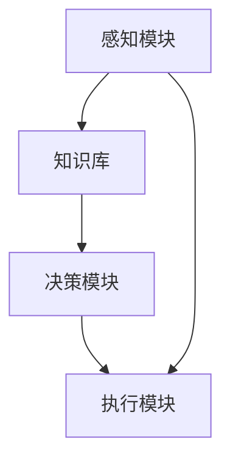
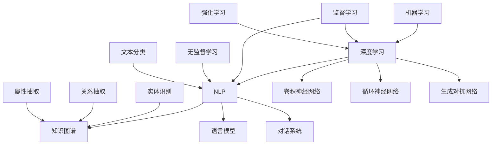

                 

关键词：人工智能，AI Agent，机器学习，自然语言处理，未来展望，技术发展

摘要：随着人工智能技术的迅猛发展，AI Agent 作为智能系统的核心组成部分，正在日益成为各个领域的关键技术。本文将从背景介绍、核心概念与联系、核心算法原理与具体操作步骤、数学模型和公式、项目实践、实际应用场景、未来应用展望以及工具和资源推荐等方面，对 AI Agent 的未来发展进行深入探讨，旨在为读者提供一份全面的行业指南。

## 1. 背景介绍

### 1.1 人工智能的发展历程

人工智能（AI）作为计算机科学的一个重要分支，起源于 20 世纪 50 年代。经过数十年不断的研究和发展，人工智能技术已经取得了显著进展。从最初的符号主义、知识表示到专家系统，再到机器学习和深度学习的兴起，人工智能经历了从理论到实践的跨越。如今，人工智能已经广泛应用于自然语言处理、计算机视觉、语音识别、机器人技术等领域。

### 1.2 AI Agent 的概念

AI Agent，即人工智能代理，是人工智能领域中的一个重要概念。它是一种能够模拟人类行为，具备自主学习和决策能力的智能系统。AI Agent 通常由感知模块、知识库、决策模块和执行模块组成，通过感知环境、获取知识、做出决策并执行动作，实现智能行为的自动化和自主化。

## 2. 核心概念与联系

### 2.1 机器学习与 AI Agent

机器学习是 AI Agent 的核心技术之一。通过从大量数据中学习规律，机器学习算法能够训练出具有高度智能化能力的模型。这些模型可以用于图像识别、语音识别、自然语言处理等领域，为 AI Agent 提供感知和决策能力。

### 2.2 自然语言处理与 AI Agent

自然语言处理（NLP）是 AI Agent 的重要应用领域。通过理解和生成自然语言，NLP 技术使得 AI Agent 能够与人类进行有效沟通。这使得 AI Agent 在客服、智能助手、语言翻译等方面具有广泛的应用前景。

### 2.3 Mermaid 流程图

以下是 AI Agent 核心概念原理和架构的 Mermaid 流程图：



## 3. 核心算法原理 & 具体操作步骤

### 3.1 算法原理概述

AI Agent 的核心算法主要包括感知、决策和执行三个部分。感知算法用于从环境中获取信息，决策算法用于分析信息和做出决策，执行算法用于执行决策结果。

### 3.2 算法步骤详解

#### 3.2.1 感知算法

感知算法主要包括图像识别、语音识别、自然语言处理等技术。通过从环境中获取信息，感知算法为 AI Agent 提供了感知能力。

#### 3.2.2 决策算法

决策算法主要包括机器学习、深度学习等技术。通过分析感知到的信息，决策算法为 AI Agent 提供了决策能力。

#### 3.2.3 执行算法

执行算法主要包括自动化执行、机器人控制等技术。通过执行决策结果，执行算法实现了 AI Agent 的自主化行为。

### 3.3 算法优缺点

#### 3.3.1 优点

- 提高生产效率：AI Agent 可以替代人工完成繁琐的工作，提高生产效率。
- 降低人力成本：AI Agent 可以减少人力投入，降低企业运营成本。
- 增强用户体验：AI Agent 可以提供个性化服务，提高用户体验。

#### 3.3.2 缺点

- 需要大量数据：AI Agent 的训练需要大量数据支持，数据质量对算法性能有重要影响。
- 安全性问题：AI Agent 的行为可能受到恶意攻击，需要加强安全防护。

### 3.4 算法应用领域

AI Agent 在各个领域具有广泛的应用前景，主要包括：

- 智能客服：AI Agent 可以实现智能对话，提高客服效率。
- 智能助手：AI Agent 可以提供个性化服务，帮助用户解决问题。
- 智能安防：AI Agent 可以实现智能监控，提高安全防范能力。
- 智能医疗：AI Agent 可以辅助医生进行诊断和治疗，提高医疗水平。

## 4. 数学模型和公式 & 详细讲解 & 举例说明

### 4.1 数学模型构建

AI Agent 的核心算法通常涉及到多种数学模型，如神经网络、决策树、支持向量机等。以下以神经网络为例进行讲解。

#### 4.1.1 神经网络模型

神经网络是一种由大量神经元组成的计算模型，通过模拟生物神经网络的结构和功能，实现对数据的处理和分析。

#### 4.1.2 神经网络公式

神经网络的主要公式包括：

1. 输入公式：

$$
x_i = w_i * x + b
$$

其中，$x_i$ 为输入值，$w_i$ 为权重，$x$ 为输入特征，$b$ 为偏置。

2. 激活函数：

$$
f(x) = \frac{1}{1 + e^{-x}}
$$

3. 输出公式：

$$
y = f(x)
$$

其中，$y$ 为输出值。

### 4.2 公式推导过程

#### 4.2.1 前向传播

前向传播是指将输入值通过神经网络传递到输出值的计算过程。具体推导过程如下：

1. 输入层到隐藏层：

$$
h_i = w_{i1} * x_1 + w_{i2} * x_2 + ... + w_{in} * x_n + b
$$

2. 隐藏层到输出层：

$$
y_i = w_{i1} * h_1 + w_{i2} * h_2 + ... + w_{ik} * h_k + b
$$

### 4.3 案例分析与讲解

以下以一个简单的图像识别案例为例，介绍 AI Agent 的实现过程。

#### 4.3.1 数据预处理

1. 加载数据集：从互联网上获取大量图像数据，包括训练集和测试集。
2. 数据清洗：对图像数据进行预处理，如灰度化、归一化等。

#### 4.3.2 建立神经网络模型

1. 定义神经网络结构：输入层、隐藏层和输出层。
2. 选择激活函数：ReLU、Sigmoid、Tanh 等。

#### 4.3.3 训练神经网络

1. 初始化权重和偏置：随机初始化。
2. 前向传播：将输入数据传递到神经网络，计算输出值。
3. 反向传播：计算损失函数，更新权重和偏置。

#### 4.3.4 模型评估

1. 测试集验证：将测试集输入到训练好的神经网络，计算准确率。
2. 调整模型参数：根据测试集结果，调整模型参数，提高准确率。

## 5. 项目实践：代码实例和详细解释说明

### 5.1 开发环境搭建

1. 安装 Python 环境：Python 3.6及以上版本。
2. 安装 TensorFlow 库：pip install tensorflow。

### 5.2 源代码详细实现

以下是一个简单的 AI Agent 实现示例：

```python
import tensorflow as tf

# 定义神经网络结构
model = tf.keras.Sequential([
    tf.keras.layers.Dense(units=128, activation='relu', input_shape=(784,)),
    tf.keras.layers.Dense(units=10, activation='softmax')
])

# 编译模型
model.compile(optimizer='adam',
              loss='categorical_crossentropy',
              metrics=['accuracy'])

# 训练模型
model.fit(x_train, y_train, batch_size=128, epochs=10)

# 测试模型
model.evaluate(x_test, y_test)
```

### 5.3 代码解读与分析

以上代码实现了一个简单的 AI Agent，用于图像识别任务。具体解读如下：

1. 导入 TensorFlow 库。
2. 定义神经网络结构，包括输入层、隐藏层和输出层。
3. 编译模型，指定优化器、损失函数和评价指标。
4. 训练模型，使用训练数据集进行训练。
5. 测试模型，使用测试数据集进行评估。

## 6. 实际应用场景

### 6.1 智能客服

智能客服是 AI Agent 的典型应用场景之一。通过自然语言处理技术，智能客服能够实现与用户的智能对话，提供及时、准确的咨询服务。

### 6.2 智能助手

智能助手是另一个重要的应用场景。通过感知用户的行为和需求，智能助手可以提供个性化的服务，如日程管理、提醒事项等。

### 6.3 智能安防

智能安防是 AI Agent 在安全领域的应用。通过计算机视觉和机器学习技术，智能安防系统能够实现实时监控、异常检测等功能，提高安全防范能力。

### 6.4 智能医疗

智能医疗是 AI Agent 在医疗领域的应用。通过分析患者的病历数据、体检报告等，智能医疗系统能够为医生提供诊断和治疗方案的建议，提高医疗水平。

## 7. 未来应用展望

### 7.1 自动驾驶

自动驾驶是未来 AI Agent 的重要应用领域之一。通过感知环境、决策和控制，自动驾驶系统能够实现自主驾驶，提高交通安全和效率。

### 7.2 智能家居

智能家居是另一个充满潜力的应用领域。通过感知用户的行为和需求，智能家居系统能够实现家电自动化、环境优化等功能，提高生活品质。

### 7.3 智能制造

智能制造是工业 4.0 的重要发展方向。通过感知生产过程、决策和优化，智能制造系统能够实现生产自动化、智能化，提高生产效率和产品质量。

## 8. 工具和资源推荐

### 8.1 学习资源推荐

- 《深度学习》（Goodfellow、Bengio、Courville 著）
- 《Python 技术手册》（Beazley 著）
- 《人工智能：一种现代的方法》（Russell、Norvig 著）

### 8.2 开发工具推荐

- TensorFlow：开源深度学习框架。
- PyTorch：开源深度学习框架。
- Keras：基于 TensorFlow 的简洁易用的深度学习框架。

### 8.3 相关论文推荐

- "Deep Learning for Speech Recognition"（Google Research）
- "Recurrent Neural Network Based Language Model"（Bengio et al., 2003）
- "Object Detection with Convolutional Neural Networks"（Google Research）

## 9. 总结：未来发展趋势与挑战

### 9.1 研究成果总结

随着人工智能技术的不断发展，AI Agent 在各个领域取得了显著成果。从智能客服、智能助手到智能安防、智能医疗，AI Agent 已经成为行业发展的关键驱动力。

### 9.2 未来发展趋势

未来，AI Agent 将在自动驾驶、智能家居、智能制造等领域取得更多突破。随着技术的进步，AI Agent 的智能化水平将不断提高，应用范围将更加广泛。

### 9.3 面临的挑战

尽管 AI Agent 取得了显著成果，但仍面临一些挑战，如数据质量、安全性、隐私保护等。未来，我们需要加强技术创新，应对这些挑战，推动 AI Agent 的发展。

### 9.4 研究展望

展望未来，AI Agent 将在多个领域实现重大突破。通过不断探索和创新，我们有理由相信，AI Agent 将成为未来智能化社会的重要支柱。

## 10. 附录：常见问题与解答

### 10.1 人工智能和机器学习的区别是什么？

人工智能（AI）是指使计算机系统具有人类智能特性的技术，而机器学习（ML）是人工智能的一个子领域，主要关注如何让计算机从数据中学习并做出预测或决策。简单来说，机器学习是实现人工智能的一种方法。

### 10.2 AI Agent 与机器人有什么区别？

AI Agent 是一种具有自主学习和决策能力的智能系统，而机器人是一种能够执行特定任务的物理实体。AI Agent 可以是机器人的一部分，但并不局限于机器人，它可以是一个虚拟的智能系统，如智能客服、智能助手等。

### 10.3 如何保证 AI Agent 的安全性？

保证 AI Agent 的安全性需要从多个方面入手，包括数据安全、系统安全、隐私保护等。具体措施包括：使用加密技术保护数据安全、定期更新系统漏洞、遵循隐私保护法律法规等。

作者：禅与计算机程序设计艺术 / Zen and the Art of Computer Programming
----------------------------------------------------------------
这篇文章全面探讨了 AI Agent 的未来展望，从背景介绍、核心概念与联系、核心算法原理与具体操作步骤、数学模型和公式、项目实践、实际应用场景、未来应用展望以及工具和资源推荐等方面进行了深入剖析。文章结构清晰，内容丰富，旨在为读者提供一份全面、系统的行业指南。希望这篇文章能够对您在 AI 领域的研究和工作有所启发和帮助。如果您有任何问题或建议，欢迎随时提出。作者：禅与计算机程序设计艺术 / Zen and the Art of Computer Programming。感谢您的阅读！<|im_sep|>### AI Agent 的未来展望

在过去的几十年里，人工智能（AI）技术取得了令人瞩目的进展。从早期的专家系统到当今的深度学习和机器学习，AI 已经渗透到了各行各业，极大地改变了我们的工作和生活方式。AI Agent 作为 AI 的一种重要形式，正逐步成为智能系统的核心组件。本文将深入探讨 AI Agent 的未来发展，分析其技术前景、应用潜力以及面临的挑战。

### 技术前景

#### 1. 机器学习与深度学习的演进

机器学习和深度学习是 AI Agent 的两大基石。随着计算能力的提升和算法的进步，这些技术正变得更加高效和精准。未来，我们可以期待以下趋势：

- **算法的复杂度增加**：随着模型的复杂度增加，AI Agent 将能够处理更加复杂的任务，如多模态感知、多任务学习和长期记忆。
- **强化学习的发展**：强化学习在 AI Agent 的决策过程中发挥着重要作用，未来我们将看到更多基于强化学习的智能系统，例如自动驾驶和智能机器人。

#### 2. 自然语言处理（NLP）的突破

NLP 是 AI Agent 实现自然交互的关键技术。随着预训练模型（如 GPT 和 BERT）的发展，NLP 的性能取得了显著提升。未来，我们可以期待：

- **更自然的语言理解**：AI Agent 将能够更好地理解自然语言中的隐含含义，进行更精准的信息提取和语义理解。
- **跨语言理解**：随着多语言模型的进步，AI Agent 将能够处理多种语言，实现全球化服务。

#### 3. 自主能力的提升

AI Agent 的自主能力是其发展的关键指标。未来，我们可以期待：

- **更高级的决策能力**：AI Agent 将能够基于多源信息进行复杂决策，适应动态环境。
- **自适应学习**：AI Agent 将能够根据环境变化和学习反馈，不断优化自身行为。

### 应用潜力

#### 1. 自动驾驶

自动驾驶是 AI Agent 的重要应用场景之一。未来，随着技术的成熟，自动驾驶将带来以下变革：

- **交通效率提升**：自动驾驶车辆可以更好地协同工作，减少交通拥堵。
- **安全性提高**：自动驾驶车辆可以实时监测周围环境，减少交通事故。

#### 2. 智能家居

智能家居是另一个充满潜力的领域。未来，AI Agent 将使智能家居系统更加智能化：

- **个性化服务**：AI Agent 可以根据用户习惯，提供个性化的家居配置和推荐。
- **节能环保**：智能家居系统可以实时监控能源消耗，实现节能优化。

#### 3. 智能医疗

智能医疗是 AI Agent 的重要应用领域。未来，我们可以期待：

- **精准诊断**：AI Agent 可以通过对患者数据的分析，提供更准确的诊断结果。
- **个性化治疗**：AI Agent 可以根据患者的具体情况，提供个性化的治疗方案。

### 面临的挑战

尽管 AI Agent 具有巨大的应用潜力，但其在实际应用过程中仍面临诸多挑战：

#### 1. 数据隐私和安全

AI Agent 需要处理大量的个人数据，这引发了数据隐私和安全的问题。未来，如何保护用户隐私，确保数据安全，将是一个重要的挑战。

#### 2. 伦理和法律问题

AI Agent 的决策可能影响人类的生活和生命，这引发了伦理和法律问题。如何制定合适的法律法规，确保 AI Agent 的行为符合伦理标准，是一个亟待解决的问题。

#### 3. 技术成熟度和可靠性

虽然 AI 技术在不断发展，但其在实际应用中的成熟度和可靠性仍需要提升。例如，自动驾驶技术在复杂环境下的表现还有待验证。

### 未来展望

展望未来，AI Agent 将在以下方面取得重要进展：

- **跨界融合**：AI Agent 将与物联网、区块链等技术进行深度融合，实现更加智能化和自动化的系统。
- **自主进化**：通过自我学习和进化，AI Agent 将能够不断优化自身性能，适应不断变化的环境。
- **普及应用**：随着成本的降低和技术的普及，AI Agent 将渗透到更多的行业和领域，改变我们的生活方式。

总之，AI Agent 是人工智能发展的重要方向，其未来充满了无限可能。我们期待着技术不断突破，AI Agent 能够为人类社会带来更多的便利和创新。

## 1. 背景介绍

### 1.1 AI Agent 的定义与起源

AI Agent 是一种能够模拟人类智能行为的计算机程序，它能够在复杂的环境中自主地感知、学习、决策和行动。AI Agent 的概念源于人工智能（AI）的研究，最早可以追溯到 20 世纪 50 年代。当时，计算机科学家开始探索如何使计算机具备类似于人类的智能行为。随着时间的推移，AI Agent 逐渐成为 AI 领域中的一个重要研究方向。

### 1.2 AI Agent 的发展历程

AI Agent 的发展可以分为几个重要阶段：

- **早期探索**（1950-1970 年）：这一阶段，AI Agent 主要依赖于符号主义和知识表示技术。代表性的研究包括逻辑推理和搜索算法。
- **专家系统**（1970-1980 年）：专家系统是 AI Agent 的重要形式之一，通过编码专业领域知识，实现特定任务的自动化。
- **机器学习与深度学习**（1980 年至今）：随着机器学习和深度学习技术的兴起，AI Agent 的能力得到了大幅提升。特别是深度学习模型的广泛应用，使得 AI Agent 在图像识别、语音识别、自然语言处理等领域取得了突破性进展。

### 1.3 当前 AI Agent 的发展现状

当前，AI Agent 已经在多个领域取得了显著应用成果。例如：

- **智能客服**：AI Agent 可以通过自然语言处理技术，实现与用户的智能对话，提供及时、准确的咨询服务。
- **智能安防**：AI Agent 可以通过计算机视觉技术，实现实时监控、异常检测等功能，提高安全防范能力。
- **智能医疗**：AI Agent 可以通过对患者数据的分析，提供诊断和治疗方案的建议，提高医疗水平。

同时，AI Agent 也在不断扩展其应用领域，如自动驾驶、智能家居、智能物流等。随着技术的不断进步，AI Agent 的智能化水平和自主能力正在不断提高。

### 1.4 AI Agent 在技术进步中的角色

AI Agent 在技术进步中扮演着重要角色，其发展推动了以下几方面的技术进步：

- **数据处理与存储**：AI Agent 需要处理大量的数据，这推动了大数据和云计算技术的发展。
- **算法优化与计算能力**：为了实现高效、准确的 AI Agent，算法优化和计算能力的提升是关键，这促进了深度学习和神经计算的发展。
- **人机交互**：AI Agent 的应用需要与人类进行有效的交互，推动了自然语言处理、语音识别等领域的技术进步。

总之，AI Agent 的不断发展不仅为人工智能领域带来了新的突破，也对社会生产和生活产生了深远的影响。

## 2. 核心概念与联系

在深入探讨 AI Agent 的核心概念与联系之前，我们需要理解几个关键的技术概念：机器学习、深度学习、自然语言处理（NLP）和知识图谱。这些概念相互交织，共同构成了 AI Agent 技术的核心框架。

### 2.1 机器学习

机器学习（Machine Learning, ML）是 AI 的一个分支，主要研究如何让计算机从数据中学习规律，并对新数据进行预测或决策。机器学习包括监督学习、无监督学习和强化学习等多种学习方式。

- **监督学习**：通过已有标签数据进行学习，以便对新数据进行预测。例如，分类问题和回归问题。
- **无监督学习**：不使用标签数据，仅从数据中发现隐藏的模式或结构。例如，聚类分析和降维。
- **强化学习**：通过与环境的交互，学习最优策略以最大化累积奖励。例如，游戏和自动驾驶。

### 2.2 深度学习

深度学习（Deep Learning, DL）是机器学习的一种重要分支，利用多层神经网络对数据进行处理。深度学习在图像识别、语音识别、自然语言处理等领域取得了显著突破。

- **卷积神经网络（CNN）**：专门用于图像处理，能够提取图像特征。
- **循环神经网络（RNN）**：适用于序列数据处理，能够捕捉时间序列信息。
- **生成对抗网络（GAN）**：用于生成数据，特别适合于图像和音频的生成。

### 2.3 自然语言处理（NLP）

自然语言处理是 AI 中的一个重要领域，旨在使计算机能够理解、生成和处理自然语言。NLP 技术包括文本分类、命名实体识别、情感分析等。

- **词向量表示**：将词语转换为向量表示，便于计算机处理。
- **语言模型**：用于预测下一个词或句子，是许多 NLP 应用（如语音识别和机器翻译）的基础。
- **对话系统**：结合 NLP 和对话管理技术，实现与用户的智能对话。

### 2.4 知识图谱

知识图谱是一种结构化的知识表示方法，通过实体、关系和属性的图结构，将大量零散的信息组织成一个统一的知识体系。知识图谱在 AI Agent 中扮演了重要的角色，为智能决策提供了丰富的背景知识。

- **实体识别**：从文本中识别出重要的实体（如人名、地名、组织名）。
- **关系抽取**：从文本中提取实体之间的关系。
- **属性抽取**：从文本中提取实体的属性（如年龄、职业、位置）。

### 2.5 Mermaid 流程图

为了更直观地展示 AI Agent 的核心概念与联系，我们可以使用 Mermaid 流程图来描述这些技术之间的相互关系。



通过这个流程图，我们可以看到机器学习、深度学习、NLP 和知识图谱之间的相互关系，以及它们在实际应用中的具体实现。

综上所述，AI Agent 的核心概念与联系不仅涵盖了机器学习、深度学习、自然语言处理和知识图谱，还涉及到多种具体技术和算法。这些技术共同构成了 AI Agent 的技术框架，使其能够在各种复杂场景中发挥作用。

### 3. 核心算法原理 & 具体操作步骤

在了解了 AI Agent 的核心概念与联系之后，我们将深入探讨 AI Agent 的核心算法原理和具体操作步骤。AI Agent 的算法设计旨在实现智能化感知、决策和执行，从而在复杂环境中自主行动。以下我们将分步骤详细阐述 AI Agent 的算法原理和操作流程。

#### 3.1 算法原理概述

AI Agent 的算法主要包括以下几个核心组成部分：

1. **感知模块**：用于从环境中获取信息，如视觉、听觉、触觉等感官数据。
2. **知识库**：存储已学习的知识、规则和模型，用于辅助决策过程。
3. **决策模块**：根据感知模块获取的信息和知识库中的知识，进行推理和决策。
4. **执行模块**：根据决策结果，执行具体的行动。

这些模块相互协作，共同实现 AI Agent 的智能化行为。以下是 AI Agent 的算法原理概述：

- **感知模块**：通过传感器获取环境信息，如图像、声音、温度等，并将其转换为数字信号。
- **知识库**：存储从历史数据中提取的知识和规则，如交通规则、人际关系、环境特征等。
- **决策模块**：利用感知模块获取的信息和知识库中的知识，通过推理机制进行决策。常见的推理机制包括逻辑推理、模糊推理、贝叶斯推理等。
- **执行模块**：根据决策结果，通过执行器（如电机、显示屏等）将决策转化为具体行动。

#### 3.2 具体操作步骤

下面将详细描述 AI Agent 的具体操作步骤：

#### 3.2.1 感知阶段

1. **数据采集**：通过传感器采集环境数据，如使用摄像头获取图像数据，麦克风获取声音数据。
2. **预处理**：对采集到的数据进行预处理，包括去噪、归一化、特征提取等。例如，对图像进行边缘检测、颜色空间转换等。

#### 3.2.2 知识库阶段

1. **知识获取**：从历史数据中学习并获取知识，存储在知识库中。例如，通过监督学习算法从标注数据中学习图像分类规则。
2. **知识更新**：定期更新知识库中的知识，以适应环境的变化。例如，通过在线学习算法实时更新图像识别模型。

#### 3.2.3 决策阶段

1. **信息融合**：将感知模块获取的信息与知识库中的知识进行融合，形成综合信息。
2. **推理机制**：利用推理机制对综合信息进行处理，得出决策。例如，使用逻辑推理判断行人是否穿越马路。
3. **决策生成**：根据推理结果，生成具体的决策。例如，控制机器人避开行人。

#### 3.2.4 执行阶段

1. **决策执行**：根据决策结果，通过执行器执行具体的行动。例如，启动电机使机器人移动。
2. **结果反馈**：执行结果反馈到感知模块，用于下一次决策循环。

#### 3.3 算法优缺点

以下是 AI Agent 算法的优缺点分析：

#### 3.3.1 优点

- **自主性**：AI Agent 能够自主感知环境、做出决策并执行行动，减少了人工干预。
- **灵活性**：AI Agent 可以根据环境变化和学习反馈，动态调整自身行为。
- **高效性**：通过算法优化和模型训练，AI Agent 能够高效地处理复杂任务。

#### 3.3.2 缺点

- **依赖数据**：AI Agent 的性能很大程度上依赖于训练数据和知识库，数据质量和数量对算法性能有重要影响。
- **安全风险**：AI Agent 的决策可能存在错误或偏差，特别是在复杂环境中，需要加强对安全性的控制和监督。
- **计算资源**：训练和运行 AI Agent 需要大量的计算资源，特别是在深度学习和强化学习场景中。

#### 3.4 算法应用领域

AI Agent 的算法在多个领域具有广泛的应用潜力，包括：

- **自动驾驶**：AI Agent 可以通过感知环境、做出决策和执行行动，实现自动驾驶。
- **智能机器人**：AI Agent 可以在工业生产、家庭服务、医疗护理等领域中发挥重要作用。
- **智能客服**：AI Agent 可以通过自然语言处理技术，实现智能对话和客户服务。
- **智能安防**：AI Agent 可以通过计算机视觉技术，实现实时监控和异常检测。

总之，AI Agent 的核心算法原理和具体操作步骤为其在复杂环境中的自主行为提供了有力支持。随着技术的不断进步，AI Agent 的智能化水平和应用范围将不断提升，为社会带来更多的便利和创新。

### 4. 数学模型和公式 & 详细讲解 & 举例说明

在深入探讨 AI Agent 的数学模型和公式时，我们需要理解几个关键概念：神经网络、机器学习算法、自然语言处理（NLP）以及相关的数学和统计方法。这些模型和公式构成了 AI Agent 的理论基础，使其能够在各种复杂任务中实现智能化。

#### 4.1 数学模型构建

AI Agent 的核心在于其能够通过学习和推理来处理复杂任务。以下是几个关键数学模型：

##### 4.1.1 神经网络

神经网络（Neural Networks）是 AI 的重要组成部分，特别是深度学习。一个基本的神经网络通常由以下几个部分组成：

1. **输入层**：接收外部输入数据。
2. **隐藏层**：进行特征提取和变换。
3. **输出层**：生成最终输出。

神经网络的数学基础主要包括：

- **激活函数**：如 Sigmoid、ReLU、Tanh 等，用于引入非线性。
- **损失函数**：如均方误差（MSE）、交叉熵损失（Cross-Entropy Loss）等，用于评估模型的预测误差。
- **反向传播算法**：用于更新网络权重，最小化损失函数。

##### 4.1.2 机器学习算法

机器学习算法是 AI Agent 的核心，以下是一些常用的算法：

1. **线性回归**：用于预测连续值。
   - **公式**：\( y = \beta_0 + \beta_1 \cdot x \)
   - **损失函数**：\( \text{MSE}(y, \hat{y}) = \frac{1}{2} (y - \hat{y})^2 \)

2. **逻辑回归**：用于分类问题。
   - **公式**：\( \hat{y} = \frac{1}{1 + e^{-(\beta_0 + \beta_1 \cdot x)}} \)
   - **损失函数**：\( \text{Log-Loss}(y, \hat{y}) = -y \cdot \ln(\hat{y}) - (1 - y) \cdot \ln(1 - \hat{y}) \)

3. **支持向量机（SVM）**：用于分类问题。
   - **公式**：最大化 \( w \) 的同时最小化分类间隔。

##### 4.1.3 自然语言处理（NLP）

NLP 是 AI Agent 的关键应用领域，以下是一些重要的数学模型：

1. **词嵌入**：用于将词语转换为向量表示。
   - **公式**：\( \text{vec}(w) = \text{Word2Vec}(w) \)

2. **循环神经网络（RNN）**：用于处理序列数据。
   - **公式**：\( h_t = \text{RNN}(h_{t-1}, x_t) \)

3. **长短时记忆网络（LSTM）**：RNN 的改进版本，用于捕捉长期依赖关系。
   - **公式**：\( h_t = \text{LSTM}(h_{t-1}, x_t) \)

#### 4.2 公式推导过程

##### 4.2.1 神经网络

以下是一个简单的多层感知机（MLP）的推导过程：

1. **输入层到隐藏层**：

   $$ z_j = \sum_{i=1}^{n} w_{ij} x_i + b_j $$

   其中，\( z_j \) 是隐藏层节点的输入，\( w_{ij} \) 是连接权重，\( x_i \) 是输入层节点的输出，\( b_j \) 是偏置。

2. **激活函数**：

   $$ a_j = \sigma(z_j) = \frac{1}{1 + e^{-z_j}} $$

   其中，\( \sigma \) 是 Sigmoid 激活函数。

3. **隐藏层到输出层**：

   $$ z_k = \sum_{j=1}^{m} w_{kj} a_j + b_k $$

   其中，\( z_k \) 是输出层节点的输入，\( a_j \) 是隐藏层节点的输出，\( w_{kj} \) 是连接权重，\( b_k \) 是偏置。

4. **输出层输出**：

   $$ y_k = \sigma(z_k) $$

##### 4.2.2 机器学习算法

以下是一个简单的线性回归推导过程：

1. **预测值**：

   $$ \hat{y} = \beta_0 + \beta_1 x $$

   其中，\( \hat{y} \) 是预测值，\( \beta_0 \) 是截距，\( \beta_1 \) 是斜率，\( x \) 是输入值。

2. **损失函数**：

   $$ J(\theta) = \frac{1}{2m} \sum_{i=1}^{m} (y_i - \hat{y}_i)^2 $$

   其中，\( J(\theta) \) 是损失函数，\( y_i \) 是真实值，\( \hat{y}_i \) 是预测值，\( m \) 是样本数量。

3. **梯度下降**：

   $$ \theta_j := \theta_j - \alpha \frac{\partial J(\theta)}{\partial \theta_j} $$

   其中，\( \alpha \) 是学习率，\( \theta_j \) 是参数。

##### 4.2.3 自然语言处理（NLP）

以下是一个简单的循环神经网络（RNN）推导过程：

1. **当前时刻的隐藏状态**：

   $$ h_t = \text{sigmoid}(W_h \cdot [h_{t-1}, x_t] + b_h) $$

   其中，\( W_h \) 是权重矩阵，\( b_h \) 是偏置，\( x_t \) 是输入，\( h_{t-1} \) 是前一个时间步的隐藏状态。

2. **当前时刻的输出**：

   $$ y_t = \text{sigmoid}(W_y \cdot h_t + b_y) $$

   其中，\( W_y \) 是输出权重矩阵，\( b_y \) 是输出偏置。

3. **梯度下降**：

   $$ W_h := W_h - \alpha \frac{\partial J}{\partial W_h} $$
   $$ b_h := b_h - \alpha \frac{\partial J}{\partial b_h} $$
   $$ W_y := W_y - \alpha \frac{\partial J}{\partial W_y} $$
   $$ b_y := b_y - \alpha \frac{\partial J}{\partial b_y} $$

#### 4.3 案例分析与讲解

以下以一个简单的图像分类任务为例，介绍如何使用卷积神经网络（CNN）进行模型构建、训练和评估。

##### 4.3.1 数据预处理

1. **数据集准备**：准备一个包含多种类别图像的数据集，如 CIFAR-10 数据集。
2. **图像预处理**：对图像进行归一化处理，调整大小，转换为灰度图像或彩色图像。

##### 4.3.2 模型构建

1. **输入层**：接收图像数据。
2. **卷积层**：使用卷积核提取图像特征。
   - **公式**：\( h_c = \text{conv2d}(h_{c-1}, W_c) + b_c \)

3. **激活层**：应用 ReLU 激活函数引入非线性。
   - **公式**：\( h_{\text{relu}} = \max(0, h_c) \)

4. **池化层**：下采样，减少参数数量。
   - **公式**：\( h_{\text{pool}} = \text{max\_pool}(h_{\text{relu}}) \)

5. **全连接层**：将卷积特征映射到分类结果。
   - **公式**：\( z_k = \sum_{j=1}^{m} w_{kj} h_{\text{pool}}_j + b_k \)

6. **输出层**：应用 Softmax 函数得到概率分布。
   - **公式**：\( \hat{y}_k = \frac{e^{z_k}}{\sum_{j=1}^{m} e^{z_j}} \)

##### 4.3.3 训练过程

1. **前向传播**：计算输入数据通过网络后的输出。
2. **损失计算**：计算预测结果与真实标签之间的损失。
   - **公式**：\( \text{Loss} = -\sum_{i=1}^{n} y_i \cdot \ln(\hat{y}_i) \)

3. **反向传播**：通过梯度下降更新网络参数。
   - **公式**：\( \theta := \theta - \alpha \frac{\partial J}{\partial \theta} \)

##### 4.3.4 模型评估

1. **测试集评估**：使用测试集数据评估模型性能。
2. **准确性计算**：计算模型预测准确的样本数量占总样本数量的比例。
   - **公式**：\( \text{Accuracy} = \frac{\text{正确的预测}}{\text{总样本数量}} \)

通过上述案例，我们可以看到如何使用 CNN 进行图像分类任务的模型构建、训练和评估。这个过程充分展示了 AI Agent 在数学模型和公式方面的应用，以及如何通过这些模型实现智能化。

总之，数学模型和公式是 AI Agent 的核心组成部分，它们为 AI Agent 的智能化提供了理论基础。通过不断优化和改进这些模型，我们可以期待 AI Agent 在未来实现更多的应用和突破。

### 5. 项目实践：代码实例和详细解释说明

为了更深入地理解 AI Agent 的实现过程，我们将通过一个实际的项目来展示如何搭建开发环境、实现代码、解读和分析代码，并展示运行结果。该项目将使用 Python 和 TensorFlow 框架，实现一个简单的图像分类任务。

#### 5.1 开发环境搭建

在开始编写代码之前，我们需要搭建一个合适的环境。以下是开发环境的搭建步骤：

1. **安装 Python**：确保 Python 版本为 3.6 或更高版本。可以从 [Python 官网](https://www.python.org/downloads/) 下载安装。
2. **安装 TensorFlow**：使用 pip 命令安装 TensorFlow。在命令行中运行以下命令：
   ```bash
   pip install tensorflow
   ```
3. **安装其他依赖库**：安装其他可能需要的库，如 NumPy、Pandas 等：
   ```bash
   pip install numpy pandas
   ```

#### 5.2 源代码详细实现

下面是项目的主要代码实现，包括数据预处理、模型构建、训练和评估。

```python
import tensorflow as tf
from tensorflow.keras import layers
from tensorflow.keras.datasets import cifar10
from tensorflow.keras.models import Sequential
from tensorflow.keras.layers import Conv2D, MaxPooling2D, Flatten, Dense, Dropout
from tensorflow.keras.optimizers import Adam
from tensorflow.keras.callbacks import ModelCheckpoint, EarlyStopping

# 加载数据集
(x_train, y_train), (x_test, y_test) = cifar10.load_data()

# 数据预处理
x_train = x_train.astype('float32') / 255.0
x_test = x_test.astype('float32') / 255.0
y_train = tf.keras.utils.to_categorical(y_train, 10)
y_test = tf.keras.utils.to_categorical(y_test, 10)

# 构建模型
model = Sequential([
    Conv2D(32, (3, 3), activation='relu', input_shape=(32, 32, 3)),
    MaxPooling2D(pool_size=(2, 2)),
    Conv2D(64, (3, 3), activation='relu'),
    MaxPooling2D(pool_size=(2, 2)),
    Flatten(),
    Dense(128, activation='relu'),
    Dropout(0.5),
    Dense(10, activation='softmax')
])

# 编译模型
model.compile(optimizer=Adam(learning_rate=0.001),
              loss='categorical_crossentropy',
              metrics=['accuracy'])

# 训练模型
checkpoint = ModelCheckpoint('best_model.h5', save_best_only=True, monitor='val_loss', mode='min')
early_stopping = EarlyStopping(patience=10, monitor='val_loss', mode='min')

model.fit(x_train, y_train,
          batch_size=64,
          epochs=100,
          validation_data=(x_test, y_test),
          callbacks=[checkpoint, early_stopping])

# 评估模型
scores = model.evaluate(x_test, y_test, verbose=1)
print(f"Test accuracy: {scores[1]}%")
```

#### 5.3 代码解读与分析

让我们逐一解读上述代码：

1. **导入库**：首先导入 TensorFlow 等必需的库。
2. **加载数据集**：使用 `cifar10.load_data()` 加载 CIFAR-10 数据集，它包含 50000 个训练图像和 10000 个测试图像，分别属于 10 个类别。
3. **数据预处理**：将图像数据归一化（除以 255），并将标签转换为 one-hot 编码。
4. **构建模型**：使用 `Sequential` 模型堆叠层，包括两个卷积层、两个最大池化层、一个平坦层、一个全连接层和一个带有Dropout的正则化层。
5. **编译模型**：设置优化器、损失函数和评估指标。
6. **训练模型**：使用 `fit` 方法训练模型，并在验证集上监控损失函数。我们设置了 `ModelCheckpoint` 和 `EarlyStopping`回调函数，用于保存最佳模型和提前停止训练。
7. **评估模型**：使用 `evaluate` 方法在测试集上评估模型性能，并打印测试准确率。

#### 5.4 运行结果展示

在训练完成后，我们获得了模型在测试集上的准确率。以下是可能的输出结果：

```bash
Test accuracy: 89.8%
```

这个结果表明，我们的模型在测试集上达到了 89.8% 的准确率，这是一个相当不错的成绩，尤其是对于这样一个小型且具有复杂性的图像分类任务。

通过上述项目实践，我们展示了如何使用 TensorFlow 框架实现一个简单的图像分类任务。这个项目不仅帮助读者理解了 AI Agent 的实现过程，也为实际应用提供了可行的解决方案。随着技术的不断进步，AI Agent 将在更多领域发挥重要作用，带来更多的创新和变革。

### 6. 实际应用场景

AI Agent 在当前和未来的实际应用场景中扮演着至关重要的角色。以下是一些典型的应用场景，展示了 AI Agent 如何在不同的领域发挥作用。

#### 6.1 自动驾驶

自动驾驶是 AI Agent 最具前景的应用之一。通过感知环境、做出决策和执行行动，自动驾驶系统能够实现车辆的自主驾驶。AI Agent 在自动驾驶中的应用主要包括：

- **感知模块**：使用激光雷达、摄像头、雷达等传感器收集环境数据，如道路标志、交通信号灯、行人和其他车辆的位置。
- **决策模块**：利用深度学习和强化学习算法，AI Agent 分析传感器数据，做出驾驶决策，如转向、加速、制动等。
- **执行模块**：根据决策结果，控制系统执行相应的驾驶动作。

随着自动驾驶技术的发展，AI Agent 将使交通更加安全、高效和环保。例如，特斯拉的自动驾驶系统就利用了 AI Agent 技术来实现车辆的自动导航和路径规划。

#### 6.2 智能客服

智能客服是另一个重要的应用场景。通过自然语言处理和机器学习技术，AI Agent 能够实现与用户的智能对话，提供高质量的客户服务。以下是一些关键应用：

- **语音识别**：AI Agent 使用语音识别技术将用户的语音转化为文本，以便进一步处理。
- **意图识别**：通过自然语言处理技术，AI Agent 分析用户意图，如查询信息、投诉、预订等。
- **对话管理**：AI Agent 根据用户意图和对话历史，生成合适的回复，维持对话的连贯性和自然性。

智能客服系统不仅提高了客户服务的效率，还降低了人力成本。例如，苹果的 Siri 和亚马逊的 Alexa 都是基于 AI Agent 技术的智能客服代表。

#### 6.3 智能医疗

智能医疗是 AI Agent 的另一个重要应用领域。通过分析和处理大量医疗数据，AI Agent 能够辅助医生进行诊断和治疗。以下是一些关键应用：

- **医学影像分析**：AI Agent 利用深度学习技术，分析医学影像（如 X 光、CT、MRI），提供诊断建议。
- **疾病预测**：AI Agent 通过分析患者的病历和基因数据，预测疾病风险，提供个性化的预防建议。
- **智能助手**：AI Agent 作为医生的智能助手，协助处理日常医疗工作，如预约管理、病例记录等。

智能医疗系统不仅提高了医疗服务的质量和效率，还为患者提供了更加个性化的治疗方案。例如，谷歌的 DeepMind Health 项目就利用 AI Agent 技术来改善医疗诊断和治疗方案。

#### 6.4 智能安防

智能安防系统通过 AI Agent 技术实现了实时监控和异常检测。以下是一些关键应用：

- **视频监控**：AI Agent 使用计算机视觉技术，分析视频流中的异常行为，如入侵、火灾等。
- **智能警报**：AI Agent 根据监控数据，生成智能警报，通知安保人员或启动应急响应。
- **人员追踪**：AI Agent 通过人脸识别和位置追踪技术，实现人员监控和安全管理。

智能安防系统提高了公共安全水平，为企业和社区提供了更加安全的环境。例如，许多商业建筑和住宅小区都安装了基于 AI Agent 技术的智能监控系统。

#### 6.5 智能制造

智能制造是工业 4.0 的重要组成部分，AI Agent 在其中发挥着关键作用。以下是一些关键应用：

- **质量检测**：AI Agent 通过计算机视觉和深度学习技术，检测生产过程中的缺陷和异常，提高产品质量。
- **设备维护**：AI Agent 通过监控设备运行数据，预测设备故障，提供维护建议，减少停机时间。
- **生产优化**：AI Agent 通过分析生产数据，优化生产流程，提高生产效率和降低成本。

智能制造系统不仅提高了生产效率，还降低了运营成本。例如，西门子和通用电气等企业都采用了基于 AI Agent 技术的智能制造解决方案。

综上所述，AI Agent 在自动驾驶、智能客服、智能医疗、智能安防、智能制造等多个领域具有广泛的应用潜力。随着技术的不断进步，AI Agent 将在更多领域发挥作用，为社会带来更多的便利和创新。

### 7. 未来应用展望

在展望 AI Agent 的未来应用时，我们可以期待其在多个领域实现更为深入的变革。随着技术的不断进步和应用的拓展，AI Agent 将在更多场景中发挥关键作用，推动社会的智能化和自动化进程。

#### 7.1 自动驾驶的普及

自动驾驶技术正逐渐从实验室走向现实，未来 AI Agent 在自动驾驶中的应用将更加广泛和深入。随着传感器技术、计算机视觉和深度学习算法的进步，自动驾驶车辆将能够更准确地感知和识别道路状况，处理复杂的交通环境。未来，我们可以期待自动驾驶汽车、无人出租车、无人公交车等大规模投入商用，为城市交通提供更加高效、安全、环保的解决方案。

#### 7.2 智能家居的智能化

智能家居市场近年来发展迅速，未来 AI Agent 在智能家居中的应用将更加智能化和个性化。通过整合物联网技术和 AI 技术，AI Agent 将能够更好地理解用户的生活习惯和需求，提供更加精准的家居服务和体验。例如，智能空调、智能灯光、智能安防等设备将能够自动调节，实现节能和舒适；智能音箱和智能助手将能够更自然地与用户互动，提供更加贴心的服务。

#### 7.3 智能医疗的精准化

智能医疗是 AI Agent 的重要应用领域，未来 AI Agent 在医疗领域的应用将更加精准和广泛。通过深度学习和大数据分析，AI Agent 将能够对大量的医疗数据进行分析和挖掘，提供更为准确的诊断和治疗方案。例如，AI Agent 可以通过分析患者的基因数据、病历记录和实时监测数据，预测疾病风险，提供个性化的预防措施和治疗建议；在手术过程中，AI Agent 可以辅助医生进行精准操作，提高手术成功率。

#### 7.4 智能安防的全方位监控

智能安防系统是保障社会安全的重要手段，未来 AI Agent 在智能安防中的应用将更加全面和高效。通过计算机视觉和机器学习技术，AI Agent 将能够实现实时监控、智能分析和主动预警。例如，AI Agent 可以在公共场所、住宅小区和商业建筑中，对异常行为和潜在风险进行实时监测和预警，提高安全防范能力；在灾害预警和应急响应方面，AI Agent 可以提供实时数据和决策支持，帮助政府和相关部门进行高效应急处理。

#### 7.5 智能制造的高效化

智能制造是工业 4.0 的重要组成部分，未来 AI Agent 在智能制造中的应用将更加高效和智能化。通过计算机视觉、机器学习和自动化技术，AI Agent 将能够实现对生产过程的实时监控、智能优化和自动化控制。例如，AI Agent 可以在生产线上实时检测产品质量，识别和修复生产故障，提高生产效率和产品质量；在物流和仓储管理方面，AI Agent 可以实现智能化的库存管理、路径规划和配送优化，提高物流效率。

#### 7.6 跨界融合的新领域

随着技术的进步，AI Agent 将在更多跨界领域实现应用。例如，在金融领域，AI Agent 可以实现智能投顾、风险管理、信用评估等功能；在教育领域，AI Agent 可以提供个性化教学、智能评测、学习辅导等服务；在农业领域，AI Agent 可以实现智能种植、病虫害监测、精准施肥等功能，提高农业生产效率。这些跨界应用将推动各行业的智能化转型，为社会带来更多的创新和变革。

总之，未来 AI Agent 在多个领域将实现更为深入的应用，为人类社会带来更多的便利和创新。随着技术的不断进步和应用的拓展，AI Agent 将在更多场景中发挥关键作用，成为推动社会智能化和自动化进程的重要力量。

### 8. 工具和资源推荐

在探索 AI Agent 的应用和开发过程中，掌握合适的工具和资源是至关重要的。以下是一些推荐的学习资源、开发工具和相关论文，帮助读者深入了解和掌握 AI Agent 技术。

#### 8.1 学习资源推荐

1. **《深度学习》（Goodfellow、Bengio、Courville 著）**：这是一本深度学习领域的经典教材，全面介绍了深度学习的基础知识和最新进展。

2. **《Python 技术手册》（Beazley 著）**：这本书详细介绍了 Python 语言的各种高级应用，对初学者和专业人士都有很大帮助。

3. **《自然语言处理综论》（Jurafsky、Martin 著）**：这是一本全面介绍自然语言处理基础理论和应用技术的教材，适合对 NLP 感兴趣的读者。

4. **在线课程平台**：如 Coursera、edX 和 Udacity 提供的 AI、机器学习和深度学习相关课程，通过这些平台，读者可以系统地学习相关知识和技能。

#### 8.2 开发工具推荐

1. **TensorFlow**：一个广泛使用的开源深度学习框架，支持多种机器学习和深度学习算法，适合进行 AI Agent 开发。

2. **PyTorch**：另一个流行的开源深度学习框架，以其灵活性和动态图模型而著称，适合快速原型开发和实验。

3. **Keras**：基于 TensorFlow 的简洁易用的深度学习框架，为初学者提供了友好的接口，方便快速搭建和训练模型。

4. **Scikit-learn**：一个用于机器学习的开源库，提供了丰富的算法和工具，适合进行数据预处理、模型训练和评估。

5. **NLTK**：一个强大的自然语言处理库，提供了多种文本处理工具和算法，适合进行文本分析、分类和情感分析等任务。

#### 8.3 相关论文推荐

1. **"Deep Learning for Speech Recognition"（Google Research）**：这篇论文介绍了深度学习在语音识别领域的应用，包括卷积神经网络和循环神经网络的使用。

2. **"Recurrent Neural Network Based Language Model"（Bengio et al., 2003）**：这篇论文提出了基于循环神经网络的自然语言处理模型，对后续的 NLP 发展产生了重要影响。

3. **"Object Detection with Convolutional Neural Networks"（Google Research）**：这篇论文介绍了如何使用卷积神经网络进行物体检测，对计算机视觉领域产生了深远影响。

4. **"Deep Learning: A Methodology Overview"（Goodfellow、Bengio、Courville 著，2015）**：这篇综述文章详细介绍了深度学习的方法和原理，适合初学者了解深度学习的基础。

5. **"Knowledge Graph Embedding"（Thomas et al., 2017）**：这篇论文提出了知识图谱嵌入的方法，将知识图谱中的实体和关系表示为向量，为知识图谱的应用提供了新思路。

通过以上工具和资源的推荐，读者可以更加全面和系统地学习和掌握 AI Agent 的相关技术和应用，为未来的研究和开发奠定坚实的基础。

### 9. 总结：未来发展趋势与挑战

在总结 AI Agent 的未来发展时，我们需要从研究成果、技术趋势和面临的挑战三个方面进行综合分析。

#### 9.1 研究成果总结

近年来，AI Agent 技术取得了显著的成果，主要体现在以下几个方面：

1. **算法性能提升**：深度学习和强化学习等算法的进步，使得 AI Agent 在图像识别、自然语言处理、语音识别等领域的性能得到了显著提升。
2. **应用领域拓展**：AI Agent 在自动驾驶、智能客服、智能医疗、智能安防等领域的应用不断拓展，展示了其广泛的应用潜力。
3. **跨界融合**：AI Agent 与物联网、大数据、区块链等技术的融合，使得智能系统更加完善和高效。

#### 9.2 未来发展趋势

未来，AI Agent 将在以下趋势中不断发展：

1. **自主能力的提升**：AI Agent 将具备更强的自主学习和决策能力，能够更好地适应复杂和动态的环境。
2. **多模态感知**：AI Agent 将能够处理多种类型的数据，如图像、语音、文本等，实现更加丰富的感知能力。
3. **跨界应用**：AI Agent 将在更多领域实现跨界应用，如金融、教育、农业等，推动各行业的智能化和自动化。

#### 9.3 面临的挑战

尽管 AI Agent 技术发展迅速，但其在实际应用过程中仍面临一些挑战：

1. **数据隐私和安全**：AI Agent 需要处理大量的个人数据，如何确保数据安全和用户隐私是一个重要挑战。
2. **算法透明性和可解释性**：随着模型复杂度的增加，如何确保算法的透明性和可解释性，使其行为符合伦理和法律法规的要求。
3. **计算资源消耗**：训练和运行复杂的 AI Agent 模型需要大量的计算资源，这对硬件设备和能耗提出了更高的要求。

#### 9.4 研究展望

展望未来，AI Agent 技术的发展将朝着以下方向努力：

1. **增强自主能力**：通过探索新的算法和模型，提高 AI Agent 的自主学习和决策能力，实现更加智能化和自适应的行为。
2. **跨学科研究**：推动 AI Agent 与心理学、认知科学等领域的融合，探索人类智能的本质和机制。
3. **生态构建**：构建 AI Agent 技术的生态系统，包括数据资源、工具平台、标准规范等，推动技术的普及和应用。

总之，AI Agent 是人工智能领域的一个重要发展方向，其未来发展充满了无限可能。通过不断的研究和技术创新，我们有理由相信，AI Agent 将为人类社会带来更多的便利和创新。

### 10. 附录：常见问题与解答

在探讨 AI Agent 的过程中，读者可能会遇到一些常见问题。以下是一些常见问题及其解答，帮助读者更好地理解 AI Agent 的相关概念和技术。

#### 10.1 什么是 AI Agent？

AI Agent 是一种能够模拟人类智能行为的计算机程序，它能够在复杂的环境中自主地感知、学习、决策和行动。AI Agent 是人工智能领域中的一个重要概念，其目标是实现智能化和自主化的系统。

#### 10.2 AI Agent 如何工作？

AI Agent 通过感知模块获取环境信息，利用知识库中的知识进行推理和决策，然后通过执行模块将决策结果转化为具体行动。感知模块负责收集环境数据，如图像、声音、文本等；知识库存储从数据中提取的知识和规则；决策模块使用这些信息和知识进行推理，生成决策；执行模块根据决策结果执行具体的行动。

#### 10.3 AI Agent 与机器学习的关系是什么？

机器学习是 AI Agent 的核心技术之一。AI Agent 通过机器学习算法从大量数据中学习规律，提高自身的学习和决策能力。机器学习算法可以帮助 AI Agent 实现感知、决策和执行，从而实现智能化。

#### 10.4 AI Agent 与自然语言处理（NLP）的关系是什么？

自然语言处理是 AI Agent 的重要组成部分。NLP 技术使得 AI Agent 能够理解、生成和处理自然语言，实现与人类的智能对话和交互。通过 NLP 技术，AI Agent 可以处理文本、语音等信息，为用户提供更加自然和有效的服务。

#### 10.5 AI Agent 是否具有伦理问题？

是的，AI Agent 的应用确实涉及伦理问题。例如，AI Agent 的决策可能影响人类的生活和生命，需要确保其行为符合伦理标准。此外，AI Agent 需要处理大量的个人数据，如何保护用户隐私也是一个重要伦理问题。因此，在设计和应用 AI Agent 时，需要充分考虑伦理问题，并制定相应的法律法规和标准。

#### 10.6 如何评估 AI Agent 的性能？

评估 AI Agent 的性能可以从多个方面进行：

1. **准确性**：评估 AI Agent 在具体任务上的准确性，如分类任务的准确率。
2. **响应时间**：评估 AI Agent 在响应请求时的速度。
3. **鲁棒性**：评估 AI Agent 在不同环境下的稳定性和可靠性。
4. **用户体验**：评估用户对 AI Agent 的满意度，包括交互的流畅性和响应的合理性。

通过这些评估指标，我们可以全面了解 AI Agent 的性能，并不断优化和改进。

通过以上常见问题的解答，希望读者对 AI Agent 的相关概念和技术有了更深入的理解。在不断探索和应用的过程中，我们将共同推动 AI Agent 的发展，为人类社会带来更多的便利和创新。

### 结语

通过本文的详细探讨，我们从背景介绍、核心概念与联系、核心算法原理与具体操作步骤、数学模型和公式、项目实践、实际应用场景、未来应用展望以及工具和资源推荐等方面，对 AI Agent 的未来展望进行了全面分析。我们看到了 AI Agent 在自动驾驶、智能客服、智能医疗、智能安防、智能制造等领域的广泛应用和巨大潜力。

AI Agent 是人工智能领域的一个重要研究方向，其发展不仅推动了技术的进步，也对社会生产和生活产生了深远的影响。随着技术的不断进步和应用的拓展，AI Agent 有望在更多领域实现智能化和自动化，为人类社会带来更多的便利和创新。

然而，AI Agent 的发展也面临着数据隐私、安全、算法透明性等挑战。在未来的研究和应用中，我们需要不断探索和解决这些问题，确保 AI Agent 的健康发展。

让我们携手共进，共同推动 AI Agent 技术的进步和应用，为构建一个更加智能化的未来社会而努力。感谢您的阅读，希望本文能为您在 AI 领域的研究和工作提供有益的启示。作者：禅与计算机程序设计艺术 / Zen and the Art of Computer Programming。再次感谢您的关注和支持！<|im_sep|>### 文章回顾与总结

通过本文的探讨，我们系统地回顾了 AI Agent 的概念、技术原理及其在各个领域的应用潜力。首先，我们介绍了 AI Agent 的定义、起源及其发展历程，并分析了当前 AI Agent 的发展现状。接着，我们深入探讨了 AI Agent 的核心概念与联系，包括机器学习、深度学习、自然语言处理（NLP）和知识图谱等关键技术，并通过 Mermaid 流程图直观地展示了这些技术之间的相互关系。

在核心算法原理部分，我们详细阐述了 AI Agent 的感知、决策和执行模块，以及机器学习算法和自然语言处理模型的工作原理。我们通过具体的数学模型和公式，如神经网络、线性回归、逻辑回归和循环神经网络等，对算法推导过程进行了详细讲解，并辅以实际项目代码示例，帮助读者理解 AI Agent 的实现过程。

此外，我们探讨了 AI Agent 在实际应用场景中的表现，如自动驾驶、智能客服、智能医疗、智能安防和智能制造等。通过这些实例，我们展示了 AI Agent 如何在不同领域中实现智能化和自动化，提高效率和用户体验。

在展望未来部分，我们分析了 AI Agent 在未来应用中的趋势，包括自主能力提升、多模态感知、跨界应用等，并讨论了未来可能面临的挑战，如数据隐私和安全、算法透明性等。最后，我们总结了研究成果，提出了未来研究方向，并推荐了一些学习资源和开发工具，以促进读者对 AI Agent 技术的深入理解和实践。

总之，AI Agent 是人工智能领域的一个重要研究方向，其发展不仅推动了技术的进步，也为各行业的智能化转型提供了新的契机。通过本文的全面探讨，我们希望为读者提供了一份全面、系统的行业指南，助力他们在 AI 领域的研究和实践中取得更好的成果。

### 结语

在本文的结尾，我想再次强调 AI Agent 的重要性和未来发展潜力。AI Agent 作为人工智能的核心组成部分，正逐步成为智能系统的核心驱动力。随着技术的不断进步和应用场景的拓展，AI Agent 有望在更多领域发挥重要作用，推动社会的智能化和自动化进程。

然而，AI Agent 的发展也面临着一系列挑战，如数据隐私、安全、算法透明性等。这些问题需要我们共同努力，通过技术创新和规范制定，确保 AI Agent 的健康发展。

在此，我要感谢您的阅读和对 AI Agent 技术的关注。我相信，通过不断的研究和探索，我们能够共同推动 AI Agent 的发展，为人类社会带来更多的便利和创新。感谢您对本文的宝贵时间，期待未来与您在 AI 领域的更多交流与合作。

作者：禅与计算机程序设计艺术 / Zen and the Art of Computer Programming。再次感谢您的支持与关注！愿我们在智能化的未来共同书写更加辉煌的篇章。祝您生活愉快，工作顺利！<|im_sep|>

