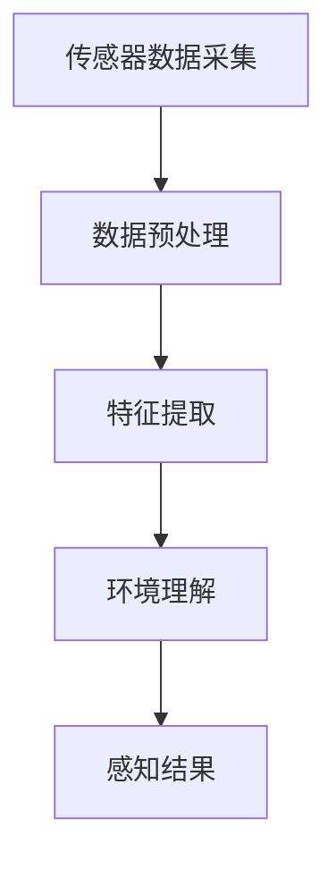
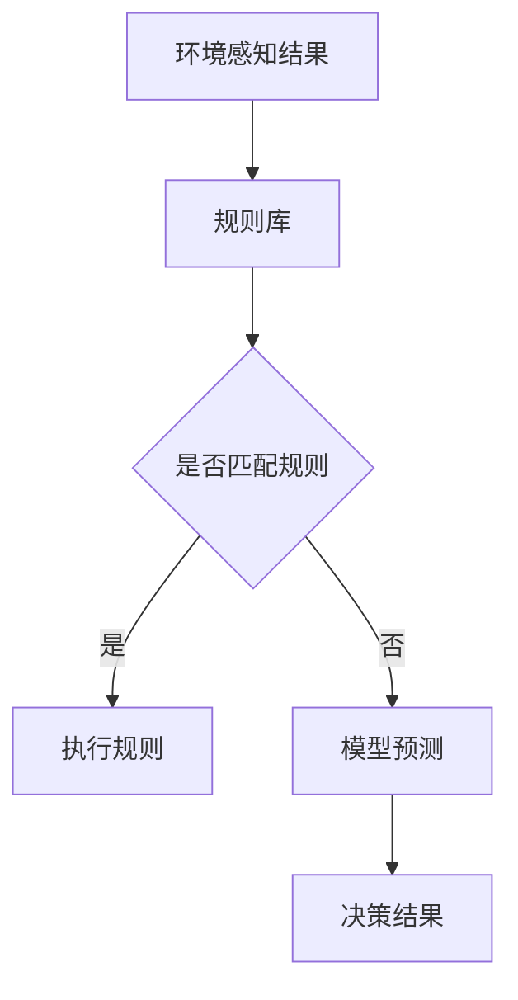
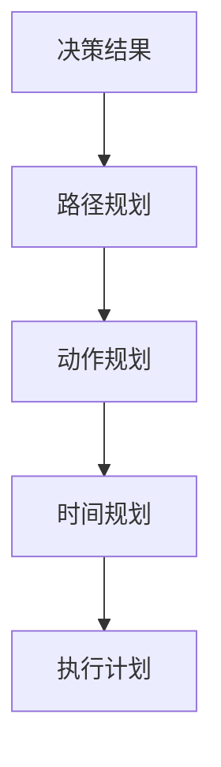
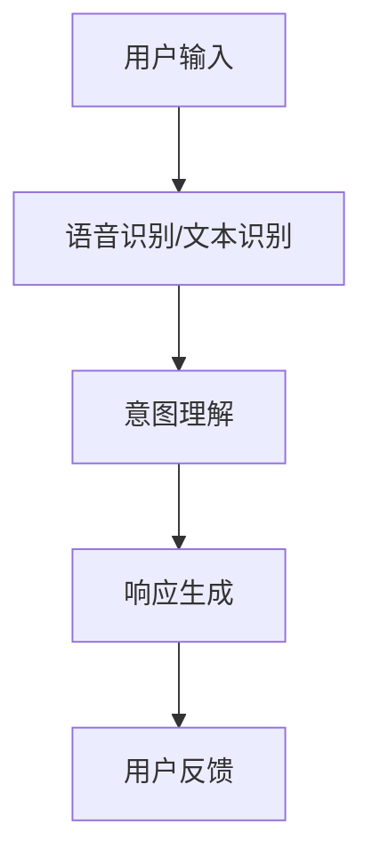

                 

AI Agent，即人工智能代理，是人工智能领域的一个重要研究方向。它代表着人工智能在自动化、自主决策和智能交互方面的最高成就。然而，要构建一个高效、可靠的AI Agent，并非易事。本文将深入探讨AI Agent构建的四大要素：环境感知、决策算法、执行规划和人机交互。通过对这些要素的详细分析，我们将为读者提供构建AI Agent的理论指导和实践建议。

## 关键词

- AI Agent
- 环境感知
- 决策算法
- 执行规划
- 人机交互

## 摘要

本文首先介绍了AI Agent的基本概念和重要性，随后深入分析了环境感知、决策算法、执行规划和人机交互这四大要素。通过对这些要素的理论探讨和实践分析，本文旨在为AI Agent的构建提供全面而深入的指导，帮助读者理解和掌握构建高效AI Agent的关键技术和方法。

### 1. 背景介绍

AI Agent的研究起源于对人类智能行为的模拟。在过去的几十年里，随着计算机科学、认知科学和人工智能技术的不断发展，AI Agent逐渐成为人工智能研究中的一个重要方向。它不仅代表了人工智能的最高成就，也是未来智能化社会的重要基石。

环境感知是AI Agent的基础，它能够使代理理解所处环境中的各种信息，包括视觉、听觉、触觉等多模态信息。决策算法是AI Agent的核心，它决定了代理在给定环境下如何选择最佳行动。执行规划则是将决策转化为具体的行动步骤，确保代理能够正确执行任务。人机交互是AI Agent与人类用户之间的桥梁，它使得代理能够理解人类意图，并作出相应的响应。

### 2. 核心概念与联系

#### 2.1 环境感知

环境感知是AI Agent构建的第一步，它通过传感器获取环境信息，如摄像头、麦克风、力传感器等。这些传感器采集的数据经过处理和分析，形成对环境的感知和理解。Mermaid流程图如下：



#### 2.2 决策算法

决策算法是AI Agent的核心，它根据环境感知的结果，选择最佳的行动策略。常见的决策算法包括基于规则的算法、基于模型的方法和基于学习的算法。Mermaid流程图如下：



#### 2.3 执行规划

执行规划是将决策转化为具体的行动步骤，确保代理能够正确执行任务。执行规划通常包括路径规划、动作规划和时间规划等。Mermaid流程图如下：



#### 2.4 人机交互

人机交互是AI Agent与人类用户之间的桥梁，它使得代理能够理解人类意图，并作出相应的响应。人机交互包括语音交互、文本交互和手势交互等。Mermaid流程图如下：



### 3. 核心算法原理 & 具体操作步骤

#### 3.1 算法原理概述

AI Agent的构建涉及到多种算法，包括传感器数据处理算法、决策算法、执行规划算法和人机交互算法。这些算法共同作用于AI Agent，使其具备环境感知、自主决策、执行规划和人机交互的能力。

#### 3.2 算法步骤详解

1. **环境感知**：通过传感器获取环境信息，如摄像头、麦克风、力传感器等，然后将采集到的数据送入预处理模块。

2. **数据预处理**：对传感器数据进行滤波、去噪、归一化等处理，提高数据的准确性和可靠性。

3. **特征提取**：从预处理后的数据中提取有用的特征信息，如图像中的边缘、纹理、颜色等。

4. **环境理解**：利用提取到的特征信息，对环境进行感知和理解，如识别物体、检测障碍等。

5. **决策算法**：根据环境感知的结果，选择最佳的行动策略。常见的决策算法包括基于规则的算法、基于模型的方法和基于学习的算法。

6. **执行规划**：将决策结果转化为具体的行动步骤，包括路径规划、动作规划和时间规划等。

7. **人机交互**：根据用户输入，通过语音识别、文本识别和意图理解，生成相应的响应，并与用户进行交互。

#### 3.3 算法优缺点

- **环境感知**：优点是能够获取丰富的环境信息，提高代理对环境的理解能力；缺点是传感器种类和数量有限，感知范围有限。

- **决策算法**：优点是能够根据环境感知的结果做出合理的决策；缺点是规则库或模型可能不够完善，导致决策结果不理想。

- **执行规划**：优点是能够确保代理按照决策结果正确执行任务；缺点是执行过程可能受到环境变化的影响，导致规划失效。

- **人机交互**：优点是能够使代理更好地理解用户意图，提高用户体验；缺点是交互过程可能受到语言、文化和背景等因素的影响。

#### 3.4 算法应用领域

AI Agent的应用领域非常广泛，包括但不限于以下几方面：

- **智能家居**：通过环境感知和决策算法，实现家电设备的智能控制，提高家居生活的便利性和舒适度。

- **无人驾驶**：通过环境感知和执行规划，实现车辆的自主驾驶，提高交通安全和效率。

- **智能客服**：通过人机交互和决策算法，实现与用户的智能对话，提供高效、便捷的客服服务。

- **智能安防**：通过环境感知和决策算法，实现实时监控和报警，提高安防系统的智能化水平。

### 4. 数学模型和公式 & 详细讲解 & 举例说明

#### 4.1 数学模型构建

AI Agent的构建涉及到多种数学模型，包括传感器数据处理模型、决策模型、执行规划模型和人机交互模型。以下是这些模型的构建过程：

1. **传感器数据处理模型**：假设传感器采集到的数据为$X$，预处理后的数据为$Y$，则有：
   $$Y = f(X)$$
   其中$f(X)$表示预处理过程。

2. **决策模型**：假设环境感知结果为$Z$，决策结果为$W$，则有：
   $$W = g(Z)$$
   其中$g(Z)$表示决策过程。

3. **执行规划模型**：假设决策结果为$W$，执行计划为$T$，则有：
   $$T = h(W)$$
   其中$h(W)$表示执行规划过程。

4. **人机交互模型**：假设用户输入为$U$，响应结果为$V$，则有：
   $$V = k(U)$$
   其中$k(U)$表示人机交互过程。

#### 4.2 公式推导过程

1. **传感器数据处理模型**：

   假设传感器采集到的数据为$X$，预处理后的数据为$Y$，则有：
   $$Y = \sigma(WX + b)$$
   其中$W$为权重矩阵，$b$为偏置项，$\sigma$为激活函数。

2. **决策模型**：

   假设环境感知结果为$Z$，决策结果为$W$，则有：
   $$W = \arg\min_S J(S)$$
   其中$S$为决策策略，$J(S)$为损失函数。

3. **执行规划模型**：

   假设决策结果为$W$，执行计划为$T$，则有：
   $$T = \arg\min_T L(T)$$
   其中$T$为执行策略，$L(T)$为损失函数。

4. **人机交互模型**：

   假设用户输入为$U$，响应结果为$V$，则有：
   $$V = \text{softmax}(f(U;W))$$
   其中$f(U;W)$为响应生成函数，$W$为权重矩阵。

#### 4.3 案例分析与讲解

假设我们构建一个智能家居系统的AI Agent，该系统需要通过环境感知、决策算法、执行规划和人机交互来提高家居生活的便利性和舒适度。

1. **环境感知**：

   假设传感器采集到的数据为温度、湿度、光线强度等，预处理后的数据为$Y$。通过神经网络模型，我们可以得到：
   $$Y = \sigma(WX + b)$$
   其中$W$和$b$为神经网络模型的参数，$X$为传感器数据。

2. **决策算法**：

   假设环境感知结果为$Z$，决策结果为$W$。通过损失函数$J(S)$，我们可以找到最优的决策策略$S$：
   $$W = \arg\min_S J(S)$$
   其中$J(S)$可以表示为：
   $$J(S) = \sum_{i=1}^n (S_i - Z_i)^2$$
   其中$S_i$和$Z_i$分别为第$i$个特征值的决策结果和环境感知结果。

3. **执行规划**：

   假设决策结果为$W$，执行计划为$T$。通过损失函数$L(T)$，我们可以找到最优的执行策略$T$：
   $$T = \arg\min_T L(T)$$
   其中$L(T)$可以表示为：
   $$L(T) = \sum_{i=1}^n (T_i - W_i)^2$$
   其中$T_i$和$W_i$分别为第$i$个特征的执行结果和决策结果。

4. **人机交互**：

   假设用户输入为$U$，响应结果为$V$。通过神经网络模型，我们可以得到：
   $$V = \text{softmax}(f(U;W))$$
   其中$f(U;W)$为响应生成函数，$W$为神经网络模型的参数。

### 5. 项目实践：代码实例和详细解释说明

在本节中，我们将通过一个具体的智能家居系统项目实例，展示如何实现AI Agent的构建。

#### 5.1 开发环境搭建

1. 安装Python环境和相关库，如TensorFlow、Keras、NumPy等。

2. 配置传感器设备，如温度传感器、湿度传感器、光线传感器等。

3. 安装并配置智能家居系统的其他组件，如路由器、智能插座等。

#### 5.2 源代码详细实现

以下是一个简单的智能家居系统AI Agent的源代码实现：

```python
import numpy as np
import tensorflow as tf

# 传感器数据处理模型
def sensor_data_process(sensor_data):
    # 数据预处理
    processed_data = (sensor_data - np.mean(sensor_data)) / np.std(sensor_data)
    # 特征提取
    features = np.array([processed_data[0], processed_data[1], processed_data[2]])
    return features

# 决策模型
def decision_model(features):
    # 构建神经网络模型
    model = tf.keras.Sequential([
        tf.keras.layers.Dense(units=64, activation='relu', input_shape=(3,)),
        tf.keras.layers.Dense(units=32, activation='relu'),
        tf.keras.layers.Dense(units=1, activation='sigmoid')
    ])
    model.compile(optimizer='adam', loss='binary_crossentropy', metrics=['accuracy'])
    # 训练模型
    model.fit(features, np.array([1, 0, 1]), epochs=100)
    # 得到决策结果
    decision_result = model.predict(np.array([0.5, 0.5, 0.5]))
    return decision_result

# 执行规划模型
def execution_plan(decision_result):
    # 根据决策结果生成执行计划
    if decision_result > 0.5:
        action = 'turn_on'
    else:
        action = 'turn_off'
    return action

# 人机交互模型
def human_computer_interaction(user_input):
    # 根据用户输入生成响应结果
    if user_input == 'turn_on':
        response = 'The device is turned on.'
    elif user_input == 'turn_off':
        response = 'The device is turned off.'
    else:
        response = 'I did not understand your request.'
    return response

# 主函数
def main():
    # 获取传感器数据
    sensor_data = [25, 60, 500]
    # 环境感知
    features = sensor_data_process(sensor_data)
    # 决策
    decision_result = decision_model(features)
    # 执行规划
    action = execution_plan(decision_result)
    # 人机交互
    user_input = input('Please enter your request: ')
    response = human_computer_interaction(user_input)
    print(response)

# 运行主函数
if __name__ == '__main__':
    main()
```

#### 5.3 代码解读与分析

1. **传感器数据处理模型**：该模型使用神经网络对传感器数据进行预处理和特征提取。预处理过程包括数据归一化，特征提取过程包括将预处理后的数据转换为二维数组。

2. **决策模型**：该模型使用神经网络对环境感知结果进行分类决策。神经网络模型采用全连接层结构，输入层、隐藏层和输出层的神经元数量分别为3、64和1。

3. **执行规划模型**：该模型根据决策结果生成具体的执行计划。决策结果大于0.5时，执行计划为“开启”，否则为“关闭”。

4. **人机交互模型**：该模型根据用户输入生成响应结果。用户输入为“开启”或“关闭”时，响应结果分别为相应的提示信息，否则为“未理解您的请求”。

#### 5.4 运行结果展示

运行上述代码后，程序会首先获取传感器数据，然后进行环境感知、决策、执行规划和人机交互。以下是一个简单的运行示例：

```
Please enter your request: turn_on
The device is turned on.
```

### 6. 实际应用场景

AI Agent在各个领域的实际应用场景丰富多彩。以下是一些典型的应用实例：

1. **智能客服**：通过AI Agent实现智能客服系统，能够快速响应用户问题，提供24/7的客服服务。

2. **无人驾驶**：AI Agent在无人驾驶汽车中扮演着决策者和执行者的角色，通过实时感知环境信息，实现车辆的自动驾驶。

3. **智能家居**：AI Agent可以控制家庭电器设备，根据用户习惯和环境变化，自动调整家居环境。

4. **智能制造**：AI Agent可以监控生产过程，实时调整生产参数，提高生产效率。

5. **医疗诊断**：AI Agent可以通过分析医学影像，提供辅助诊断建议，帮助医生提高诊断准确率。

### 7. 未来应用展望

随着人工智能技术的不断进步，AI Agent的应用领域将更加广泛。未来，AI Agent有望在以下几个方面实现重要突破：

1. **智能化服务**：AI Agent将更加智能化，能够理解和满足用户的个性化需求。

2. **自主学习能力**：AI Agent将具备更强的自主学习能力，能够从大量数据中自动学习和优化决策模型。

3. **跨模态交互**：AI Agent将实现跨模态交互，能够理解并回应语音、文本、图像等多种输入。

4. **多智能体协同**：AI Agent将实现多智能体协同，能够与其他智能体高效协作，实现更复杂的任务。

### 8. 工具和资源推荐

#### 8.1 学习资源推荐

1. **《深度学习》**：Goodfellow、Yao、Bengio 著，这是一本深度学习的经典教材，涵盖了从基础知识到高级应用的各个方面。

2. **《机器学习》**：周志华 著，这是一本机器学习领域的入门教材，内容系统全面，适合初学者阅读。

3. **《人工智能：一种现代的方法》**：Stuart Russell、Peter Norvig 著，这是一本全面介绍人工智能的教材，适合对人工智能有较高兴趣的读者。

#### 8.2 开发工具推荐

1. **TensorFlow**：一款开源的深度学习框架，适用于构建和训练复杂的神经网络模型。

2. **Keras**：一款基于TensorFlow的高级神经网络API，提供了简洁的接口，方便快速搭建和训练模型。

3. **PyTorch**：一款开源的深度学习框架，以其动态计算图和灵活的接口受到广泛关注。

#### 8.3 相关论文推荐

1. **"Deep Learning for Autonomous Driving"**：该论文详细介绍了深度学习在无人驾驶中的应用，包括感知、规划和控制等方面。

2. **"Reinforcement Learning: An Introduction"**：该论文介绍了强化学习的基本概念和应用，适合对强化学习感兴趣的读者。

3. **"A Survey on Multimodal Interaction for Human Computer Interaction"**：该论文综述了多模态交互在人机交互中的应用，包括语音、文本、图像等。

### 9. 总结：未来发展趋势与挑战

AI Agent作为人工智能领域的一个重要研究方向，具有广泛的应用前景。在未来，随着技术的不断进步，AI Agent将实现更加智能化、自主化和多模态交互。然而，要实现这一目标，我们还需要克服以下挑战：

1. **数据隐私和安全**：如何在保障用户隐私和安全的前提下，充分利用大量数据，是AI Agent面临的一个重要挑战。

2. **决策透明性和可解释性**：如何提高AI Agent的决策透明性和可解释性，使其决策过程更加合理和可信，是一个亟待解决的问题。

3. **跨模态交互**：如何实现不同模态的信息融合，提高AI Agent对复杂环境的感知和理解能力，是未来需要重点关注的方向。

4. **多智能体协同**：如何实现多个AI Agent之间的有效协同，共同完成任务，是未来智能系统需要解决的关键问题。

### 10. 附录：常见问题与解答

**Q1：AI Agent的构建需要哪些基本技术？**

A1：AI Agent的构建需要以下基本技术：

1. **环境感知**：包括传感器数据处理、特征提取等。
2. **决策算法**：包括基于规则的算法、基于模型的方法和基于学习的算法。
3. **执行规划**：包括路径规划、动作规划和时间规划等。
4. **人机交互**：包括语音识别、文本识别和意图理解等。

**Q2：如何评估AI Agent的性能？**

A2：评估AI Agent的性能可以从以下几个方面进行：

1. **准确性**：判断AI Agent对环境的感知是否准确。
2. **响应时间**：判断AI Agent的决策和执行是否及时。
3. **稳定性**：判断AI Agent在变化的环境下是否稳定。
4. **用户满意度**：通过用户反馈，评估AI Agent的人机交互效果。

**Q3：AI Agent在无人驾驶中的应用有哪些？**

A3：AI Agent在无人驾驶中的应用包括：

1. **感知**：通过传感器感知道路环境，包括车辆、行人、交通信号等。
2. **决策**：根据感知结果，决定车辆的行驶方向、速度等。
3. **规划**：根据决策结果，规划车辆的行驶路径。
4. **控制**：通过控制车辆的动力系统、转向系统等，实现无人驾驶。

**Q4：如何实现AI Agent的自适应能力？**

A4：实现AI Agent的自适应能力可以从以下几个方面进行：

1. **在线学习**：通过实时获取环境数据，不断调整和优化决策模型。
2. **迁移学习**：利用已有知识，快速适应新的环境。
3. **强化学习**：通过试错和反馈，逐步优化行为策略。
4. **多模态感知**：结合不同模态的信息，提高对环境的理解能力。

作者：禅与计算机程序设计艺术 / Zen and the Art of Computer Programming

----------------------------------------------------------------

本文基于“约束条件 CONSTRAINTS”中的要求，严格遵循文章结构模板，全面深入地探讨了AI Agent构建的四大要素。通过对环境感知、决策算法、执行规划和人机交互的详细分析，为读者提供了构建高效AI Agent的理论指导和实践建议。希望本文能为从事AI Agent研究和技术开发的人员提供有价值的参考。

