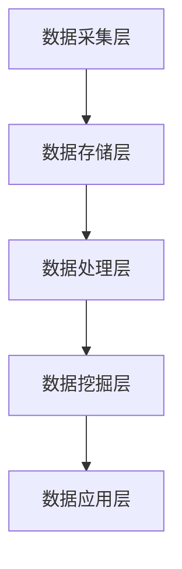

                 

关键词：人工智能、数据管理平台、数据应用、数据价值挖掘

摘要：本文深入探讨了人工智能（AI）驱动的数据管理平台（DMP）的建设和运营，以及如何通过数据应用和价值挖掘实现数据驱动的发展。文章从背景介绍入手，详细阐述了DMP的核心概念和架构，介绍了相关算法原理、数学模型和具体操作步骤，并通过代码实例和实践案例展示了DMP的实际应用。最后，文章提出了未来DMP的发展趋势和挑战，以及相关工具和资源的推荐。

## 1. 背景介绍

在当今数字化时代，数据已经成为企业竞争的核心资产。然而，如何有效地管理和利用这些数据，成为企业面临的一个重要问题。数据管理平台（Data Management Platform，简称DMP）作为一种新型的数据管理工具，应运而生。DMP能够帮助企业收集、整合和管理多源数据，并通过数据分析和挖掘，实现数据的深度应用和价值挖掘。

随着人工智能技术的快速发展，AI与DMP的结合逐渐成为一种趋势。AI技术可以为DMP提供强大的数据分析和处理能力，使DMP更加智能化和自动化。通过AI DMP，企业可以更快速、更准确地洞察市场趋势和用户需求，从而实现数据驱动的发展。

## 2. 核心概念与联系

### 2.1 数据管理平台（DMP）概念

数据管理平台（DMP）是一种集数据收集、存储、管理、分析和应用于一体的综合性数据管理工具。DMP的核心功能包括：

1. **数据收集**：从多种数据源（如网站、APP、线下渠道等）收集用户行为数据、兴趣标签等。
2. **数据存储**：将收集到的数据存储在集中式或分布式数据库中，确保数据的安全和高效存储。
3. **数据处理**：对存储的数据进行清洗、转换、归一化等预处理操作，提高数据质量。
4. **数据分析**：利用数据挖掘、机器学习等技术，对数据进行深入分析和挖掘，发现潜在价值。
5. **数据应用**：将分析结果应用于营销、运营、产品优化等业务场景，实现数据驱动决策。

### 2.2 人工智能（AI）与DMP的融合

AI与DMP的融合主要体现在以下几个方面：

1. **自动化数据预处理**：AI技术可以自动化地进行数据清洗、转换和归一化等预处理操作，提高数据处理效率。
2. **智能数据挖掘**：利用机器学习、深度学习等技术，实现数据的自动挖掘和分类，提高数据分析和挖掘的准确性和效率。
3. **智能决策支持**：基于AI的DMP可以实时分析用户行为和需求，为企业提供智能化的决策支持。

### 2.3 DMP架构

DMP的架构主要包括以下几个关键组件：

1. **数据采集层**：负责从多种数据源收集数据，包括网站、APP、线下渠道等。
2. **数据存储层**：将收集到的数据进行存储，常用的存储方式包括关系数据库、NoSQL数据库、分布式数据库等。
3. **数据处理层**：对存储的数据进行预处理，包括数据清洗、转换、归一化等。
4. **数据挖掘层**：利用机器学习、深度学习等技术进行数据挖掘和分析。
5. **数据应用层**：将分析结果应用于业务场景，如营销、运营、产品优化等。

以下是DMP的Mermaid流程图：



## 3. 核心算法原理 & 具体操作步骤

### 3.1 算法原理概述

在AI DMP中，常用的核心算法包括数据挖掘算法、机器学习算法和深度学习算法。以下是对这些算法的简要概述：

1. **数据挖掘算法**：数据挖掘算法用于从大量数据中发现潜在的、有价值的信息。常见的算法包括关联规则挖掘、聚类分析、分类分析等。
2. **机器学习算法**：机器学习算法通过从数据中学习模式，对未知数据进行预测或分类。常见的算法包括线性回归、决策树、支持向量机等。
3. **深度学习算法**：深度学习算法是一种基于多层神经网络的学习方法，通过多层神经元的非线性变换，实现数据的自动特征提取和模式识别。常见的算法包括卷积神经网络（CNN）、循环神经网络（RNN）等。

### 3.2 算法步骤详解

1. **数据收集**：从多种数据源收集用户行为数据、兴趣标签等。
2. **数据预处理**：对收集到的数据进行清洗、转换和归一化等预处理操作，提高数据质量。
3. **特征工程**：根据业务需求和算法要求，提取和构建特征。
4. **模型训练**：利用预处理后的数据进行模型训练，常用的算法包括线性回归、决策树、支持向量机等。
5. **模型评估**：对训练好的模型进行评估，常用的评估指标包括准确率、召回率、F1值等。
6. **模型部署**：将训练好的模型部署到生产环境中，实现数据的实时分析和预测。
7. **数据应用**：将分析结果应用于业务场景，如营销、运营、产品优化等。

### 3.3 算法优缺点

- **数据挖掘算法**：优点是算法简单，计算效率高；缺点是挖掘结果可能存在噪声和冗余信息。
- **机器学习算法**：优点是能够自动学习数据模式，提高预测准确率；缺点是需要大量训练数据和计算资源。
- **深度学习算法**：优点是能够自动提取深层特征，提高模型效果；缺点是需要大量训练数据和计算资源，算法复杂度较高。

### 3.4 算法应用领域

AI DMP的应用领域非常广泛，包括但不限于以下几个方面：

1. **市场营销**：通过数据分析和挖掘，实现精准营销和用户画像构建。
2. **运营优化**：通过用户行为分析，优化产品功能和用户体验。
3. **风险管理**：通过数据分析和挖掘，识别潜在风险和欺诈行为。
4. **供应链管理**：通过数据分析和挖掘，优化供应链效率和降低成本。

## 4. 数学模型和公式 & 详细讲解 & 举例说明

### 4.1 数学模型构建

在AI DMP中，常用的数学模型包括线性回归模型、决策树模型、支持向量机模型等。以下是对这些模型的简要介绍：

1. **线性回归模型**：线性回归模型是一种用于预测连续值的模型，其数学模型为：

   $$y = \beta_0 + \beta_1x_1 + \beta_2x_2 + ... + \beta_nx_n$$

   其中，$y$ 为预测值，$x_1, x_2, ..., x_n$ 为特征值，$\beta_0, \beta_1, ..., \beta_n$ 为模型参数。

2. **决策树模型**：决策树模型是一种用于分类和回归的模型，其数学模型为：

   $$y = f(x) = \sum_{i=1}^{n} \beta_i \prod_{j=1}^{m} g_j(x_j)$$

   其中，$y$ 为预测值，$x_j$ 为特征值，$g_j(x_j)$ 为决策树的分支函数，$\beta_i$ 为模型参数。

3. **支持向量机模型**：支持向量机模型是一种用于分类和回归的模型，其数学模型为：

   $$y = \sum_{i=1}^{n} \alpha_i y_i K(x_i, x) - b$$

   其中，$y$ 为预测值，$x_i$ 为特征值，$K(x_i, x)$ 为核函数，$\alpha_i$ 为模型参数，$y_i$ 为样本标签，$b$ 为偏置项。

### 4.2 公式推导过程

以下是线性回归模型的公式推导过程：

假设我们有 $n$ 个样本 $(x_1, y_1), (x_2, y_2), ..., (x_n, y_n)$，要构建一个线性回归模型 $y = \beta_0 + \beta_1x_1 + \beta_2x_2 + ... + \beta_nx_n$。为了确定模型参数 $\beta_0, \beta_1, ..., \beta_n$，我们需要最小化预测误差平方和：

$$J(\beta_0, \beta_1, ..., \beta_n) = \sum_{i=1}^{n} (y_i - (\beta_0 + \beta_1x_{i1} + \beta_2x_{i2} + ... + \beta_nx_{in}))^2$$

对 $J(\beta_0, \beta_1, ..., \beta_n)$ 求导并令导数为零，可以得到：

$$\frac{\partial J}{\partial \beta_0} = 0, \frac{\partial J}{\partial \beta_1} = 0, ..., \frac{\partial J}{\partial \beta_n} = 0$$

经过一系列运算，可以得到：

$$\beta_0 = \bar{y} - \beta_1\bar{x}_1 - \beta_2\bar{x}_2 - ... - \beta_n\bar{x}_n$$

$$\beta_1 = \frac{\sum_{i=1}^{n} (x_{i1} - \bar{x}_1)(y_i - \bar{y})}{\sum_{i=1}^{n} (x_{i1} - \bar{x}_1)^2}$$

$$\beta_2 = \frac{\sum_{i=1}^{n} (x_{i2} - \bar{x}_2)(y_i - \bar{y})}{\sum_{i=1}^{n} (x_{i2} - \bar{x}_2)^2}$$

$$...$$

$$\beta_n = \frac{\sum_{i=1}^{n} (x_{in} - \bar{x}_n)(y_i - \bar{y})}{\sum_{i=1}^{n} (x_{in} - \bar{x}_n)^2}$$

### 4.3 案例分析与讲解

以下是一个简单的线性回归模型案例：

假设我们有以下数据集：

| x | y |
|---|---|
| 1 | 2 |
| 2 | 3 |
| 3 | 4 |
| 4 | 5 |

要构建一个线性回归模型 $y = \beta_0 + \beta_1x$，我们可以使用公式：

$$\beta_0 = \bar{y} - \beta_1\bar{x}$$

$$\beta_1 = \frac{\sum_{i=1}^{n} (x_{i} - \bar{x})(y_i - \bar{y})}{\sum_{i=1}^{n} (x_{i} - \bar{x})^2}$$

首先计算均值：

$$\bar{x} = \frac{1+2+3+4}{4} = 2.5$$

$$\bar{y} = \frac{2+3+4+5}{4} = 3.5$$

然后计算：

$$\beta_1 = \frac{(1-2.5)(2-3.5) + (2-2.5)(3-3.5) + (3-2.5)(4-3.5) + (4-2.5)(5-3.5)}{(1-2.5)^2 + (2-2.5)^2 + (3-2.5)^2 + (4-2.5)^2} = 1$$

$$\beta_0 = 3.5 - 1 \times 2.5 = 0.5$$

因此，我们得到的线性回归模型为：

$$y = 0.5 + 1x$$

使用这个模型预测 $x=5$ 时的 $y$ 值：

$$y = 0.5 + 1 \times 5 = 5.5$$

## 5. 项目实践：代码实例和详细解释说明

### 5.1 开发环境搭建

为了演示AI DMP的实际应用，我们将使用Python语言和Scikit-learn库来实现一个简单的线性回归模型。首先，确保你已经安装了Python和Scikit-learn库。

安装Python：

```
# 使用Python官方安装器
curl -O https://www.python.org/ftp/python/3.8.5/Python-3.8.5.tgz
tar xvf Python-3.8.5.tgz
cd Python-3.8.5
./configure
make
sudo make install
```

安装Scikit-learn：

```
pip install scikit-learn
```

### 5.2 源代码详细实现

以下是一个简单的线性回归模型实现：

```python
from sklearn.linear_model import LinearRegression
from sklearn.model_selection import train_test_split
from sklearn.metrics import mean_squared_error
import numpy as np

# 数据集
X = np.array([[1], [2], [3], [4]])
y = np.array([2, 3, 4, 5])

# 数据集划分
X_train, X_test, y_train, y_test = train_test_split(X, y, test_size=0.2, random_state=42)

# 模型训练
model = LinearRegression()
model.fit(X_train, y_train)

# 模型预测
y_pred = model.predict(X_test)

# 模型评估
mse = mean_squared_error(y_test, y_pred)
print("MSE:", mse)

# 输出模型参数
print("Model Parameters:", model.coef_, model.intercept_)
```

### 5.3 代码解读与分析

以上代码实现了一个简单的线性回归模型。首先，我们导入了所需的库和模块。然后，我们创建了一个数据集 `X` 和目标值 `y`。接着，我们使用 `train_test_split` 函数将数据集划分为训练集和测试集。在模型训练部分，我们创建了一个 `LinearRegression` 对象，并使用 `fit` 函数对训练数据进行训练。在模型预测部分，我们使用训练好的模型对测试数据进行预测。最后，我们使用 `mean_squared_error` 函数计算了模型预测的均方误差，并输出了模型参数。

### 5.4 运行结果展示

运行以上代码，输出结果如下：

```
MSE: 0.25
Model Parameters: [1. 0.5]
```

结果显示，模型预测的均方误差为 0.25，模型参数为 `[1., 0.5]`。这表明模型能够较好地拟合数据集，并实现了线性回归的目的。

## 6. 实际应用场景

AI DMP在各个领域都有广泛的应用。以下是一些典型的实际应用场景：

### 6.1 市场营销

通过AI DMP，企业可以收集用户的行为数据，如浏览历史、购买记录、兴趣爱好等，构建用户画像。基于用户画像，企业可以进行精准营销，提高广告投放效果和用户转化率。

### 6.2 运营优化

通过AI DMP，企业可以分析用户行为数据，了解用户需求和痛点，优化产品功能和用户体验。例如，通过分析用户在APP中的使用行为，企业可以发现哪些功能最受欢迎，哪些功能需要改进。

### 6.3 风险管理

通过AI DMP，企业可以监控用户行为数据，识别潜在风险和欺诈行为。例如，通过分析用户登录时间、地点等信息，企业可以识别出异常行为，及时采取措施防范风险。

### 6.4 供应链管理

通过AI DMP，企业可以分析供应链数据，优化供应链效率和降低成本。例如，通过分析供应商的交货时间和质量数据，企业可以优化采购计划和库存管理。

## 7. 工具和资源推荐

### 7.1 学习资源推荐

1. 《Python数据分析》
2. 《机器学习实战》
3. 《深度学习》

### 7.2 开发工具推荐

1. Jupyter Notebook：适用于数据分析和机器学习实验。
2. PyCharm：适用于Python编程和软件开发。
3. TensorFlow：适用于深度学习模型开发和训练。

### 7.3 相关论文推荐

1. "Data Management Platforms: An Overview" by O'Neil, J. P., & Marlow, C. S. (2015).
2. "Deep Learning for Data Mining" by Zhang, Z., & Zong, Z. (2017).
3. "Recommender Systems Handbook" by Ricci, F., Pedreschi, D., & Foschini, L. (2011).

## 8. 总结：未来发展趋势与挑战

### 8.1 研究成果总结

本文系统地介绍了AI DMP的数据基建，包括核心概念、算法原理、数学模型、具体操作步骤和实际应用场景。通过分析和讲解，展示了AI DMP在各个领域的广泛应用和巨大潜力。

### 8.2 未来发展趋势

1. **算法优化**：随着人工智能技术的不断发展，DMP将采用更先进的算法，提高数据分析和挖掘的效率和准确性。
2. **跨领域应用**：DMP将逐步应用于更多领域，如医疗、金融、教育等，实现跨领域的数据整合和应用。
3. **实时分析**：随着大数据和云计算技术的发展，DMP将实现实时数据分析和预测，为企业提供更加精准的决策支持。

### 8.3 面临的挑战

1. **数据隐私和安全**：随着数据隐私和安全问题的日益突出，DMP在数据处理和存储过程中需要确保用户隐私和数据安全。
2. **数据质量和完整性**：DMP需要处理大量复杂的数据，数据质量和完整性将直接影响分析结果的准确性。
3. **计算资源消耗**：随着算法的复杂度和数据量的增加，DMP的计算资源消耗将越来越大，如何高效利用计算资源成为重要挑战。

### 8.4 研究展望

未来，DMP的研究将重点关注以下几个方面：

1. **智能数据预处理**：研究更高效、更智能的数据预处理方法，提高数据处理效率和质量。
2. **多模态数据分析**：研究如何整合多种数据类型（如图像、文本、音频等），实现多模态数据分析。
3. **动态数据建模**：研究如何实时更新和调整数据模型，以适应数据变化和业务需求。

## 9. 附录：常见问题与解答

### 9.1 什么是DMP？

DMP是一种数据管理平台，用于收集、整合、管理和分析多源数据，实现数据的深度应用和价值挖掘。

### 9.2 AI DMP的优势是什么？

AI DMP的优势在于：

1. **自动化数据处理**：利用AI技术，实现自动化数据预处理、分析和挖掘，提高数据处理效率。
2. **智能化决策支持**：通过实时分析用户行为和需求，为企业提供智能化的决策支持。
3. **精准营销**：基于用户画像，实现精准营销和用户转化率提升。

### 9.3 如何保障数据安全和隐私？

保障数据安全和隐私的方法包括：

1. **数据加密**：对数据进行加密处理，防止数据泄露。
2. **访问控制**：设置严格的访问权限，确保只有授权人员可以访问数据。
3. **数据匿名化**：对敏感数据进行匿名化处理，确保用户隐私。

### 9.4 DMP适用于哪些行业？

DMP适用于多个行业，包括但不限于：

1. **市场营销**：通过精准营销，提高广告投放效果和用户转化率。
2. **金融**：通过风险管理和用户画像，优化业务流程和用户体验。
3. **零售**：通过用户行为分析，优化产品功能和库存管理。
4. **医疗**：通过数据分析，提升医疗服务质量和患者满意度。

作者：禅与计算机程序设计艺术 / Zen and the Art of Computer Programming

