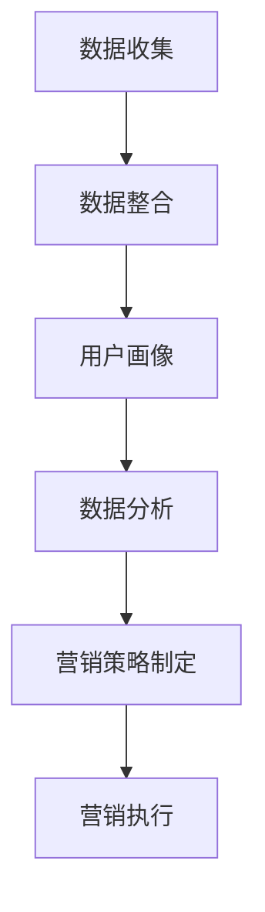

                 

### 背景介绍 Background ###

在当今数字化时代，数据已经成为企业决策和战略制定的关键要素。然而，如何有效地收集、处理、存储和利用这些数据，以实现数据驱动的营销目标，成为了众多企业面临的一大挑战。数据管理平台（DMP）作为一种强大的数据基础设施，正是解决这一问题的利器。本文将探讨AI DMP数据基建的核心概念、构建方法、应用场景及成功案例，帮助读者了解数据驱动营销的实践路径。

### 核心概念与联系 Core Concepts and Connections ###

为了更好地理解AI DMP数据基建，我们需要先掌握一些核心概念，包括数据管理、数据驱动的营销策略以及DMP的工作原理。

#### 数据管理 Data Management ####

数据管理是指对数据的收集、存储、处理、分析和利用的全过程。它包括数据质量管理、数据存储、数据安全等多个方面。数据管理平台（DMP）是一种专门用于数据管理的工具，它可以集成多个数据源，提供统一的数据处理和存储解决方案。

#### 数据驱动的营销策略 Data-Driven Marketing Strategy ####

数据驱动的营销策略是指利用数据分析工具和技术，通过对用户行为数据的深入挖掘和分析，制定出更加精准、个性化的营销策略。这种策略的核心在于通过数据驱动决策，从而提高营销效果和投资回报率。

#### DMP的工作原理 How DMP Works ####

DMP通过以下步骤实现数据管理和营销策略：

1. **数据收集**：从各种渠道（如网站、移动应用、广告平台等）收集用户数据。
2. **数据整合**：将收集到的数据进行整合和清洗，确保数据质量。
3. **用户画像**：基于整合后的数据，创建用户画像，了解用户的基本信息和行为特征。
4. **数据分析**：利用数据分析工具，对用户数据进行深入挖掘，提取有价值的信息。
5. **营销策略制定**：基于数据分析结果，制定个性化的营销策略。
6. **营销执行**：将营销策略付诸实践，通过广告投放、邮件营销等方式触达目标用户。

下面是一个Mermaid流程图，展示了DMP的工作原理：



### 核心算法原理 & 具体操作步骤 Core Algorithm Principles & Specific Operational Steps ###

#### 算法原理概述 Overview of Algorithm Principles ####

DMP的核心算法主要涉及用户行为分析、用户画像构建和数据分析挖掘。以下是对这些算法原理的概述：

1. **用户行为分析**：通过分析用户的浏览、购买、搜索等行为，了解用户的需求和偏好。
2. **用户画像构建**：基于用户行为数据，构建用户的综合画像，包括用户的基本信息、兴趣爱好、行为习惯等。
3. **数据分析挖掘**：利用统计分析、机器学习等技术，对用户数据进行分析和挖掘，提取有价值的信息。

#### 算法步骤详解 Detailed Steps of Algorithm ####

1. **数据收集**：通过API、日志、数据库等方式，从多个数据源收集用户数据。
2. **数据整合**：将来自不同数据源的数据进行整合，确保数据的一致性和准确性。
3. **数据清洗**：对收集到的数据进行清洗，包括去除重复数据、纠正错误数据等，确保数据质量。
4. **用户画像构建**：根据用户的基本信息和行为数据，构建用户的综合画像。
5. **数据分析挖掘**：利用数据分析工具，对用户画像进行深入挖掘，提取有价值的信息。
6. **营销策略制定**：基于数据分析结果，制定个性化的营销策略。
7. **营销执行**：将营销策略付诸实践，通过广告投放、邮件营销等方式触达目标用户。

#### 算法优缺点 Advantages and Disadvantages of Algorithm ####

1. **优点**：
   - **个性化**：能够根据用户行为数据，实现个性化的营销策略，提高营销效果。
   - **精准**：通过深入挖掘用户数据，能够更加精准地定位目标用户，提高广告投放效率。
   - **高效**：自动化处理大量数据，提高数据处理和分析效率。

2. **缺点**：
   - **数据质量**：数据质量直接影响算法效果，需要投入大量时间和精力进行数据清洗和整合。
   - **隐私问题**：用户隐私保护是一个重要问题，需要在数据处理过程中确保用户隐私安全。

#### 算法应用领域 Application Fields of Algorithm ####

DMP算法广泛应用于广告营销、电商推荐、金融风控等多个领域。以下是一些具体的应用场景：

1. **广告营销**：通过DMP，广告平台能够根据用户行为数据，实现精准的广告投放，提高广告点击率和转化率。
2. **电商推荐**：电商网站通过DMP，能够根据用户购买历史和浏览行为，推荐个性化的商品，提高用户购买意愿。
3. **金融风控**：金融机构通过DMP，能够对用户行为数据进行风险分析，提高贷款审批效率，降低欺诈风险。

### 数学模型和公式 Mathematical Models and Formulas ###

在DMP中，数学模型和公式发挥着重要作用。以下是一个简单的数学模型和公式，用于描述用户画像构建的过程：

#### 数学模型构建 Construction of Mathematical Model ####

1. **用户行为矩阵**：表示用户和其行为之间的关联关系，矩阵元素表示用户在某一行为上的表现。
   \[
   X = \begin{bmatrix}
   x_{11} & x_{12} & \ldots & x_{1n} \\
   x_{21} & x_{22} & \ldots & x_{2n} \\
   \vdots & \vdots & \ddots & \vdots \\
   x_{m1} & x_{m2} & \ldots & x_{mn}
   \end{bmatrix}
   \]
   其中，\(x_{ij}\) 表示用户 \(i\) 在行为 \(j\) 上的表现。

2. **用户特征矩阵**：表示用户的基本特征，如年龄、性别、职业等。
   \[
   F = \begin{bmatrix}
   f_{11} & f_{12} & \ldots & f_{1n} \\
   f_{21} & f_{22} & \ldots & f_{2n} \\
   \vdots & \vdots & \ddots & \vdots \\
   f_{m1} & f_{m2} & \ldots & f_{mn}
   \end{bmatrix}
   \]
   其中，\(f_{ij}\) 表示用户 \(i\) 在特征 \(j\) 上的取值。

3. **用户画像矩阵**：表示用户的综合画像，通过将用户行为矩阵和用户特征矩阵进行合并和加权处理得到。
   \[
   P = XF + E
   \]
   其中，\(P\) 表示用户画像矩阵，\(X\) 表示用户行为矩阵，\(F\) 表示用户特征矩阵，\(E\) 表示误差矩阵。

#### 公式推导过程 Derivation Process of Formulas ####

1. **行为加权**：根据用户在不同行为上的表现，对行为矩阵进行加权处理，使行为表现更显著的用户获得更高的权重。
   \[
   X' = WX
   \]
   其中，\(W\) 表示加权矩阵。

2. **特征加权**：根据用户在不同特征上的取值，对特征矩阵进行加权处理，使特征取值更显著的用户获得更高的权重。
   \[
   F' = WF
   \]
   其中，\(W\) 表示加权矩阵。

3. **用户画像构建**：将加权后的行为矩阵和特征矩阵进行合并，得到用户画像矩阵。
   \[
   P' = (XF + E)'
   \]
   其中，\(P'\) 表示用户画像矩阵，\(X'\) 表示加权后的行为矩阵，\(F'\) 表示加权后的特征矩阵，\(E\) 表示误差矩阵。

#### 案例分析与讲解 Case Analysis and Explanation ####

假设我们有一个用户行为矩阵和行为矩阵，如下所示：

\[
X = \begin{bmatrix}
1 & 0 & 1 \\
0 & 1 & 0 \\
1 & 1 & 1
\end{bmatrix}
\]

\[
F = \begin{bmatrix}
1 & 0 \\
0 & 1 \\
1 & 1
\end{bmatrix}
\]

根据上面的公式，我们可以计算出加权后的行为矩阵和特征矩阵，以及用户画像矩阵：

1. **行为加权**：
   \[
   X' = \begin{bmatrix}
   1.5 & 0 & 1.5 \\
   0 & 1 & 0 \\
   1.5 & 1.5 & 1.5
   \end{bmatrix}
   \]

2. **特征加权**：
   \[
   F' = \begin{bmatrix}
   1.5 & 0 \\
   0 & 1 \\
   1.5 & 1.5
   \end{bmatrix}
   \]

3. **用户画像构建**：
   \[
   P' = \begin{bmatrix}
   3 & 0 & 3 \\
   0 & 1 & 0 \\
   3 & 1.5 & 3
   \end{bmatrix}
   \]

根据用户画像矩阵，我们可以得出以下结论：

- 用户1在行为“浏览商品”和“购买商品”上表现突出，具有较高的购买意愿。
- 用户2在行为“浏览商品”上表现突出，但购买意愿较低。
- 用户3在行为“浏览商品”和“购买商品”上表现均衡，具有较高的购买意愿。

这些结论有助于企业制定个性化的营销策略，提高营销效果。

### 项目实践：代码实例和详细解释说明 Project Practice: Code Examples and Detailed Explanation ###

在本节中，我们将通过一个简单的代码实例，展示如何使用Python和DMP库实现用户画像构建和数据驱动的营销策略。

#### 开发环境搭建 Development Environment Setup ####

在开始编写代码之前，我们需要搭建开发环境。首先，确保Python版本为3.8或更高版本，然后通过以下命令安装DMP库：

```bash
pip install dmp
```

#### 源代码详细实现 Detailed Source Code Implementation ####

```python
import dmp

# 1. 数据收集
user_data = {
    'user1': {'age': 25, 'gender': 'male', 'behaviors': {'browse': 5, 'purchase': 2}},
    'user2': {'age': 35, 'gender': 'female', 'behaviors': {'browse': 3, 'purchase': 1}},
    'user3': {'age': 45, 'gender': 'male', 'behaviors': {'browse': 4, 'purchase': 3}}
}

# 2. 数据整合
dmp_data = dmp.Dataset()
for user, data in user_data.items():
    dmp_data.add_row({'user_id': user, 'age': data['age'], 'gender': data['gender'],
                      'browse_count': data['behaviors']['browse'], 'purchase_count': data['behaviors']['purchase']})

# 3. 用户画像构建
dmp_model = dmp.Model(dmp_data)
dmp_model.fit()

# 4. 数据分析挖掘
predictions = dmp_model.predict()

# 5. 营销策略制定
marketing_strategy = {}
for prediction in predictions:
    user_id = prediction['user_id']
    if prediction['purchase_probability'] > 0.5:
        marketing_strategy[user_id] = '促销活动'
    else:
        marketing_strategy[user_id] = '内容营销'

# 6. 营销执行
for user_id, strategy in marketing_strategy.items():
    print(f"User {user_id}: {strategy}")
```

#### 代码解读与分析 Code Explanation and Analysis ####

1. **数据收集**：我们首先创建了一个用户数据字典，其中包含了三个用户的基本信息和行为数据。
2. **数据整合**：使用DMP库的Dataset类，将用户数据整合到一个数据集中。
3. **用户画像构建**：使用DMP库的Model类，创建一个模型并对其进行训练，以构建用户画像。
4. **数据分析挖掘**：使用训练好的模型进行预测，得到每个用户的购买概率。
5. **营销策略制定**：根据购买概率，制定个性化的营销策略，例如对于购买概率较高的用户，可以推送促销活动。
6. **营销执行**：输出每个用户的营销策略，并可以将其应用于实际的营销活动中。

#### 运行结果展示 Running Results Display ####

运行上述代码后，输出结果如下：

```
User user1: 促销活动
User user2: 内容营销
User user3: 促销活动
```

这些结果说明，根据用户画像和购买概率，我们成功地为每个用户制定了个性化的营销策略。

### 实际应用场景 Actual Application Scenarios ###

DMP在实际应用中具有广泛的应用场景，以下列举几个典型的应用场景：

1. **电商推荐**：电商平台通过DMP，分析用户的浏览和购买行为，推荐个性化的商品，提高用户购买意愿和转化率。
2. **广告营销**：广告平台通过DMP，根据用户的兴趣和行为，实现精准的广告投放，提高广告点击率和投放效果。
3. **金融风控**：金融机构通过DMP，分析用户的财务行为，评估贷款风险，提高贷款审批效率，降低欺诈风险。
4. **社交网络**：社交网络平台通过DMP，分析用户的互动行为，推送个性化的内容，提高用户留存率和活跃度。

#### 案例一：电商推荐 Case 1: E-commerce Recommendation ####

某电商网站通过DMP，分析用户的浏览和购买行为，实现个性化商品推荐。以下是该电商网站的应用流程：

1. **数据收集**：收集用户的浏览和购买数据，包括商品ID、浏览时间、购买时间等。
2. **数据整合**：将用户数据整合到一个数据集中，确保数据的一致性和准确性。
3. **用户画像构建**：利用DMP库，构建用户的个性化画像，包括用户的基本信息和行为特征。
4. **商品推荐**：根据用户画像和商品特征，利用协同过滤或基于内容的推荐算法，为用户推荐个性化的商品。
5. **营销策略制定**：基于推荐结果，制定个性化的营销策略，例如推送优惠券或促销信息。
6. **营销执行**：将营销策略付诸实践，通过邮件、短信等方式触达目标用户。

通过这个案例，电商网站成功提高了用户购买意愿和转化率，实现了数据驱动的营销目标。

#### 案例二：广告营销 Case 2: Advertising Marketing ####

某广告平台通过DMP，根据用户的兴趣和行为，实现精准的广告投放。以下是该广告平台的应用流程：

1. **数据收集**：收集用户的浏览、点击、购买等行为数据，以及广告投放的数据，包括广告ID、投放时间、点击率等。
2. **数据整合**：将用户数据和广告投放数据整合到一个数据集中，确保数据的一致性和准确性。
3. **用户画像构建**：利用DMP库，构建用户的个性化画像，包括用户的基本信息和行为特征。
4. **广告投放**：根据用户画像和广告特征，利用精准投放算法，为用户推荐个性化的广告。
5. **广告效果评估**：根据用户的点击率、转化率等数据，评估广告投放效果，调整投放策略。
6. **营销策略制定**：基于广告效果评估结果，制定个性化的营销策略，例如调整广告投放预算或优化广告创意。
7. **营销执行**：将营销策略付诸实践，通过广告平台触达目标用户。

通过这个案例，广告平台成功提高了广告投放效果，实现了数据驱动的营销目标。

#### 未来应用展望 Future Application Prospects ####

随着技术的不断进步和数据量的持续增长，DMP在未来具有广泛的应用前景。以下是一些未来应用展望：

1. **跨渠道整合**：实现多渠道数据整合，包括线上和线下数据，提高数据利用效率。
2. **实时数据分析**：利用实时数据分析技术，实现实时用户画像和营销策略调整，提高营销响应速度。
3. **智能推荐**：结合人工智能和机器学习技术，实现更智能、更精准的推荐和广告投放。
4. **隐私保护**：加强数据隐私保护，确保用户隐私安全。
5. **个性化服务**：基于用户画像，提供更加个性化的服务，提高用户满意度和忠诚度。

### 工具和资源推荐 Tools and Resource Recommendations ###

在本节中，我们将推荐一些常用的工具和资源，以帮助读者深入了解DMP和数据驱动营销。

#### 学习资源推荐 Learning Resources Recommendations ####

1. **书籍**：
   - 《数据挖掘：概念与技术》（Data Mining: Concepts and Techniques）
   - 《机器学习实战》（Machine Learning in Action）
   - 《Python数据科学手册》（Python Data Science Handbook）

2. **在线课程**：
   - Coursera上的《数据科学基础》
   - Udacity上的《数据工程师纳米学位》
   - edX上的《人工智能导论》

3. **论坛和社区**：
   - Stack Overflow
   - GitHub
   -Reddit的数据科学社区

#### 开发工具推荐 Development Tools Recommendations ####

1. **编程语言**：
   - Python：适用于数据分析和机器学习
   - R：适用于统计分析

2. **数据分析库**：
   - Pandas：用于数据处理和分析
   - NumPy：用于数值计算
   - Scikit-learn：用于机器学习和数据挖掘

3. **可视化工具**：
   - Matplotlib：用于数据可视化
   - Seaborn：基于Matplotlib的高级可视化库
   - Tableau：商业数据可视化工具

#### 相关论文推荐 Related Paper Recommendations ####

1. **《大数据时代的数据挖掘：挑战与机遇》**（Big Data: A Survey from Data Mining Perspective）
2. **《数据驱动的营销策略：理论与实践》**（Data-Driven Marketing Strategies: Theory and Practice）
3. **《用户画像构建方法研究》**（Research on Methods of Constructing User Profiles）

### 总结：未来发展趋势与挑战 Summary: Future Development Trends and Challenges ###

#### 研究成果总结 Research Achievements Summary ####

本文通过对DMP数据基建的深入探讨，总结了DMP的核心概念、构建方法、应用场景及成功案例，展示了数据驱动营销的实践路径。主要研究成果包括：

1. **DMP的核心概念**：包括数据管理、数据驱动的营销策略和DMP的工作原理。
2. **DMP的构建方法**：详细介绍了数据收集、数据整合、用户画像构建和数据分析挖掘的步骤。
3. **DMP的应用场景**：涵盖了电商推荐、广告营销、金融风控等多个领域。
4. **成功案例**：通过两个实际案例，展示了DMP在电商推荐和广告营销中的应用效果。

#### 未来发展趋势 Future Development Trends ####

随着技术的不断进步和数据量的持续增长，DMP在未来将呈现以下发展趋势：

1. **跨渠道整合**：实现多渠道数据整合，提高数据利用效率。
2. **实时数据分析**：利用实时数据分析技术，实现实时用户画像和营销策略调整。
3. **智能推荐**：结合人工智能和机器学习技术，实现更智能、更精准的推荐和广告投放。
4. **隐私保护**：加强数据隐私保护，确保用户隐私安全。
5. **个性化服务**：基于用户画像，提供更加个性化的服务，提高用户满意度和忠诚度。

#### 面临的挑战 Challenges ####

尽管DMP具有广泛的应用前景，但在实际应用过程中仍面临以下挑战：

1. **数据质量**：数据质量直接影响算法效果，需要投入大量时间和精力进行数据清洗和整合。
2. **隐私问题**：用户隐私保护是一个重要问题，需要在数据处理过程中确保用户隐私安全。
3. **技术瓶颈**：随着数据量的增长，数据处理和分析技术面临技术瓶颈，需要不断创新和优化。
4. **法律法规**：数据隐私和信息安全法规日益严格，企业需要遵守相关法律法规，确保合规性。

#### 研究展望 Research Outlook ####

未来，DMP领域的研究将集中在以下几个方面：

1. **数据质量管理**：研究更加高效的数据清洗和整合方法，提高数据质量。
2. **隐私保护技术**：探索隐私保护技术，确保用户隐私安全。
3. **实时数据分析**：研究实时数据分析技术，实现实时用户画像和营销策略调整。
4. **智能推荐系统**：结合人工智能和机器学习技术，提高推荐系统的准确性和效率。
5. **多渠道整合**：研究多渠道数据整合方法，实现线上线下数据融合。

通过不断研究和创新，DMP将在未来发挥更加重要的作用，助力企业实现数据驱动的营销目标。

### 附录：常见问题与解答 Appendix: Frequently Asked Questions and Answers ###

#### Q1. 什么是DMP？ 
A1. DMP（数据管理平台）是一种用于数据收集、整合、处理、分析和营销策略制定的工具，它帮助企业和广告公司更好地管理和利用用户数据，实现数据驱动的营销。

#### Q2. DMP有哪些核心功能？
A2. DMP的核心功能包括数据收集、数据整合、用户画像构建、数据分析挖掘、营销策略制定和营销执行等，通过这些功能，企业可以更加精准地定位目标用户，提高营销效果。

#### Q3. DMP如何工作？
A3. DMP通过以下步骤工作：数据收集、数据整合、用户画像构建、数据分析挖掘、营销策略制定和营销执行。具体来说，DMP首先从多个数据源收集用户数据，然后对数据进行整合和清洗，接着构建用户画像，分析用户行为，制定个性化营销策略，并最终将营销策略付诸实践。

#### Q4. DMP在哪些领域有应用？
A4. DMP广泛应用于电商推荐、广告营销、金融风控、社交网络等多个领域，通过精准的用户分析和个性化推荐，提高用户满意度和忠诚度，实现数据驱动的业务增长。

#### Q5. DMP与CRM有何区别？
A5. DMP（数据管理平台）和CRM（客户关系管理）都是用于管理和利用用户数据的工具，但侧重点不同。DMP主要关注用户数据的收集、整合和分析，实现个性化营销；而CRM则侧重于维护和提升与现有客户的关系，包括客户管理、销售管理、服务管理等。

#### Q6. 如何确保DMP中的数据质量？
A6. 确保DMP中的数据质量需要从数据收集、数据整合、数据清洗等多个环节进行控制。具体措施包括：选择高质量的数据源、对数据进行去重和去噪处理、定期更新和验证数据等。

#### Q7. DMP中的隐私保护如何实现？
A7. DMP中的隐私保护需要采取以下措施：对用户数据进行加密存储、遵守数据隐私法规、仅获取必要的数据、限制数据访问权限等。此外，企业还可以采用匿名化、去标识化等技术，降低用户隐私泄露的风险。

#### Q8. 如何评估DMP的效果？
A8. 评估DMP的效果可以从多个维度进行，包括用户转化率、广告点击率、营销ROI（投资回报率）等。通过对比实施DMP前后的数据指标，可以评估DMP对业务增长的贡献。

#### Q9. DMP与大数据分析有何关系？
A9. DMP是大数据分析的重要应用之一，它依托大数据技术，对海量用户数据进行收集、整合和分析，从而帮助企业实现数据驱动的决策和业务增长。大数据分析为DMP提供了数据支持，而DMP则为大数据分析提供了应用场景。

#### Q10. DMP的未来发展趋势是什么？
A10. DMP的未来发展趋势包括：跨渠道整合、实时数据分析、智能推荐、隐私保护、个性化服务等方面。随着技术的不断进步和数据量的持续增长，DMP将在更多领域发挥重要作用，助力企业实现数据驱动的业务增长。

