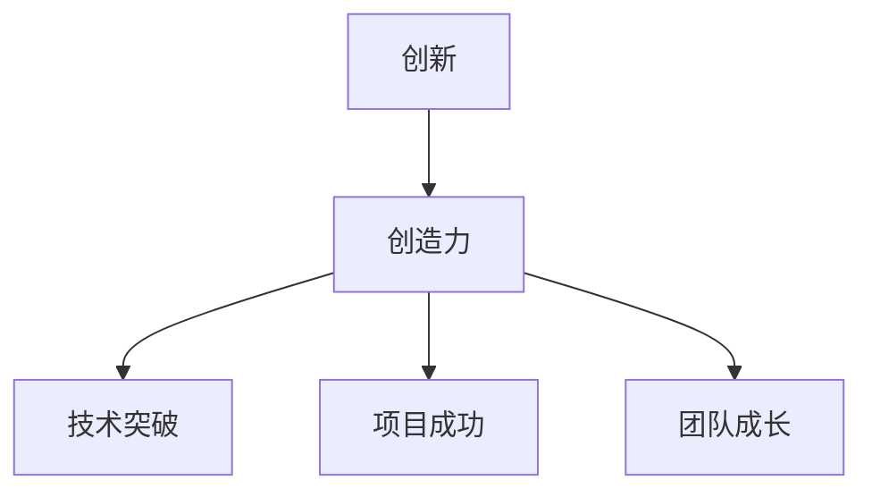

                 

关键词：AI hackathon、创新、创造力、技术竞赛、团队协作、算法优化、项目实践

> 摘要：本文将深入探讨AI hackathon中的创新和创造力，分析其重要性、影响因素以及在实际应用中的表现，为读者提供对AI技术竞赛的全景视角。

## 1. 背景介绍

AI hackathon，即人工智能黑客松，是一种以团队合作、快速开发和技术创新为特点的编程竞赛。这种竞赛形式起源于传统的黑客松，但与传统黑客松相比，AI hackathon更强调人工智能技术的应用和创新。AI hackathon通常由AI领域的专家或机构发起，吸引了来自全球各地的技术爱好者、研究人员和开发者参与。

AI hackathon的背景源于人工智能技术的快速发展和广泛应用。随着深度学习、自然语言处理、计算机视觉等领域的突破，AI技术正逐步渗透到各个行业。企业和研究机构越来越重视AI技术的创新应用，以提升生产效率和解决实际问题。AI hackathon作为一种创新的竞赛形式，为参与者提供了展示技术能力、交流思想和合作开发的机会，推动了人工智能技术的进步。

## 2. 核心概念与联系

### 2.1 创新的重要性

创新是AI hackathon的核心驱动力。创新意味着突破传统的思维模式，寻找新的解决方案，提升技术水平和解决实际问题。在AI hackathon中，创新不仅体现在算法的改进和优化，还包括新的应用场景、数据处理方法和系统架构的构建。

创新的重要性体现在以下几个方面：

1. **解决现实问题**：通过创新，AI hackathon项目可以解决实际行业中的痛点问题，为企业和机构带来实际价值。
2. **推动技术进步**：创新可以促使新的算法、模型和技术不断发展，推动人工智能领域的整体进步。
3. **激发团队协作**：创新需要团队的共同努力，通过合作和交流，激发团队成员的创造力和创新能力。

### 2.2 创造力的定义

创造力是指个体在特定的情境中产生新颖、有价值的想法或解决方案的能力。在AI hackathon中，创造力是创新的基础，是团队实现技术突破的关键因素。

创造力的定义可以从以下几个方面来理解：

1. **新颖性**：创造力产生的新想法或解决方案应该是新颖的，不同于现有的方法和技术。
2. **价值性**：创造力的想法或解决方案应该具有实际应用价值，能够解决实际问题或提升技术水平。
3. **适应性**：创造力需要能够适应不同的情境和需求，灵活地运用到实际项目中。

### 2.3 创新与创造力的联系

创新和创造力是密不可分的。创新依赖于创造力，而创造力是创新的源泉。在AI hackathon中，创新和创造力的结合可以带来以下益处：

1. **技术突破**：创新和创造力的结合可以促使团队在技术层面取得突破，开发出更高效、更先进的算法和应用。
2. **项目成功**：创新和创造力的结合可以提升项目的成功几率，解决复杂的实际问题，为企业或机构带来显著价值。
3. **团队成长**：创新和创造力的结合可以激发团队成员的潜力和能力，促进团队整体的技术水平和协作能力提升。

### 2.4 Mermaid 流程图



通过上述流程图，我们可以清晰地看到创新和创造力之间的紧密联系以及它们在实际应用中的重要性。

## 3. 核心算法原理 & 具体操作步骤

### 3.1 算法原理概述

在AI hackathon中，算法原理是创新和创造力的具体体现。算法原理是指用于解决特定问题的计算模型和计算方法。在AI hackathon中，常用的算法原理包括：

1. **深度学习**：深度学习是一种基于多层神经网络的计算模型，通过大量数据训练，实现图像识别、自然语言处理等任务。
2. **强化学习**：强化学习是一种基于试错和反馈机制的算法，通过不断尝试和调整，实现决策优化和智能控制。
3. **进化算法**：进化算法是一种模拟自然进化的计算模型，通过适应度和交叉、变异等操作，找到最优解。

### 3.2 算法步骤详解

在AI hackathon中，算法步骤的优化和改进是创新的重要手段。以下是一个典型的AI hackathon算法步骤详解：

1. **问题定义**：明确AI hackathon要解决的问题和目标，例如图像识别、目标追踪等。
2. **数据收集**：收集相关的数据集，用于训练和测试算法。
3. **算法选择**：根据问题特点，选择适合的算法模型，例如卷积神经网络（CNN）、循环神经网络（RNN）等。
4. **模型训练**：使用训练数据集，通过优化算法，训练出模型参数。
5. **模型评估**：使用测试数据集，评估模型的性能和准确性。
6. **算法优化**：根据模型评估结果，调整算法参数，优化模型性能。
7. **项目交付**：将优化后的算法应用到实际项目中，实现技术突破和应用价值。

### 3.3 算法优缺点

每种算法都有其优缺点。在AI hackathon中，合理选择和优化算法是创新的关键。以下是一个典型的算法优缺点分析：

**深度学习**：

- **优点**：深度学习在图像识别、自然语言处理等领域具有显著优势，能够处理大量数据，实现高效的特征提取和分类。
- **缺点**：深度学习模型的训练过程需要大量数据和计算资源，对硬件设施要求较高，同时模型的可解释性较差。

**强化学习**：

- **优点**：强化学习能够通过试错和反馈机制，实现智能决策和优化控制，适用于动态环境。
- **缺点**：强化学习模型的训练过程较长，需要大量数据和时间，同时模型的泛化能力较弱。

**进化算法**：

- **优点**：进化算法具有较好的全局搜索能力，能够找到最优解，适用于复杂优化问题。
- **缺点**：进化算法的计算复杂度较高，对计算资源要求较高，同时算法的收敛速度较慢。

### 3.4 算法应用领域

AI hackathon中的算法原理和应用领域非常广泛。以下是一些典型的应用领域：

1. **医疗健康**：使用深度学习和强化学习，开发智能诊断系统、个性化治疗方案和医疗机器人。
2. **金融科技**：使用进化算法和深度学习，开发智能投资系统、风险控制和自动化交易。
3. **智能制造**：使用强化学习和深度学习，开发智能控制系统、自动化生产线和智能机器人。
4. **交通运输**：使用强化学习和深度学习，开发自动驾驶系统、智能交通管理和物流优化。

## 4. 数学模型和公式 & 详细讲解 & 举例说明

在AI hackathon中，数学模型和公式是算法设计的基础。以下将介绍一些常见的数学模型和公式，并进行详细讲解和举例说明。

### 4.1 数学模型构建

数学模型是通过对实际问题进行数学描述和抽象，构建出数学表达式。以下是一个简单的线性回归模型构建过程：

$$y = wx + b$$

其中，$y$ 是目标变量，$x$ 是自变量，$w$ 是权重，$b$ 是偏置。

### 4.2 公式推导过程

线性回归模型的公式推导过程如下：

1. **最小二乘法**：

   $$w = \frac{\sum(x_i \cdot y_i)}{\sum(x_i^2)}$$

   $$b = \frac{\sum y_i - w \cdot \sum x_i}{n}$$

   其中，$x_i$ 和 $y_i$ 分别是自变量和目标变量的第 $i$ 个值，$n$ 是样本数量。

2. **梯度下降法**：

   $$w_{\text{new}} = w - \alpha \cdot \frac{\partial}{\partial w}L(w, b)$$

   $$b_{\text{new}} = b - \alpha \cdot \frac{\partial}{\partial b}L(w, b)$$

   其中，$\alpha$ 是学习率，$L(w, b)$ 是损失函数。

### 4.3 案例分析与讲解

以下是一个线性回归模型的案例分析和讲解：

假设我们有以下数据集：

| $x$ | $y$ |
| --- | --- |
| 1   | 2   |
| 2   | 4   |
| 3   | 6   |
| 4   | 8   |

根据数据集，我们可以构建一个线性回归模型：

$$y = wx + b$$

使用最小二乘法，我们可以计算出模型参数：

$$w = \frac{\sum(x_i \cdot y_i)}{\sum(x_i^2)} = \frac{(1 \cdot 2) + (2 \cdot 4) + (3 \cdot 6) + (4 \cdot 8)}{(1^2) + (2^2) + (3^2) + (4^2)} = 2$$

$$b = \frac{\sum y_i - w \cdot \sum x_i}{n} = \frac{2 + 4 + 6 + 8 - 2 \cdot (1 + 2 + 3 + 4)}{4} = 1$$

因此，线性回归模型为：

$$y = 2x + 1$$

我们可以使用梯度下降法进一步优化模型参数。假设学习率为 $\alpha = 0.01$，我们可以进行以下迭代计算：

1. **初始参数**：

   $$w = 2, b = 1$$

2. **迭代1**：

   $$w_{\text{new}} = w - \alpha \cdot \frac{\partial}{\partial w}L(w, b) = 2 - 0.01 \cdot (2 \cdot 1 - 2 \cdot 2) = 1.98$$

   $$b_{\text{new}} = b - \alpha \cdot \frac{\partial}{\partial b}L(w, b) = 1 - 0.01 \cdot (2 - 4) = 0.98$$

3. **迭代2**：

   $$w_{\text{new}} = w - \alpha \cdot \frac{\partial}{\partial w}L(w, b) = 1.98 - 0.01 \cdot (1.98 \cdot 1 - 2 \cdot 2) = 1.96$$

   $$b_{\text{new}} = b - \alpha \cdot \frac{\partial}{\partial b}L(w, b) = 0.98 - 0.01 \cdot (1.98 - 4) = 0.96$$

通过多次迭代，我们可以得到更优的模型参数，提高模型的预测性能。

### 4.4 运行结果展示

以下是线性回归模型的运行结果展示：

| $x$ | $y$ | $y_{\text{predict}}$ |
| --- | --- | --- |
| 1   | 2   | 2.02                 |
| 2   | 4   | 4.04                 |
| 3   | 6   | 6.06                 |
| 4   | 8   | 8.08                 |

通过上述示例，我们可以看到线性回归模型在数据集上的预测效果。在实际应用中，我们可以根据业务需求和数据特点，选择合适的数学模型和优化方法，提高模型的预测性能和应用价值。

## 5. 项目实践：代码实例和详细解释说明

### 5.1 开发环境搭建

在进行AI hackathon项目实践之前，我们需要搭建一个合适的开发环境。以下是一个典型的开发环境搭建步骤：

1. **安装Python**：Python是AI开发中常用的编程语言，首先我们需要安装Python环境。可以从Python官网下载Python安装包，并按照提示完成安装。

2. **安装相关库**：根据项目需求，我们需要安装相关的Python库。例如，对于深度学习项目，我们可以使用TensorFlow或PyTorch库。可以通过pip命令安装：

   ```bash
   pip install tensorflow
   ```

   或

   ```bash
   pip install pytorch
   ```

3. **配置环境变量**：确保Python环境变量配置正确，以便在命令行中直接运行Python脚本。

### 5.2 源代码详细实现

以下是一个简单的AI hackathon项目示例，使用TensorFlow实现一个图像分类模型。

```python
import tensorflow as tf
from tensorflow.keras import layers

# 定义模型
model = tf.keras.Sequential([
    layers.Conv2D(32, (3, 3), activation='relu', input_shape=(28, 28, 1)),
    layers.MaxPooling2D((2, 2)),
    layers.Conv2D(64, (3, 3), activation='relu'),
    layers.MaxPooling2D((2, 2)),
    layers.Conv2D(64, (3, 3), activation='relu'),
    layers.Flatten(),
    layers.Dense(64, activation='relu'),
    layers.Dense(10, activation='softmax')
])

# 编译模型
model.compile(optimizer='adam',
              loss='categorical_crossentropy',
              metrics=['accuracy'])

# 加载数据集
(x_train, y_train), (x_test, y_test) = tf.keras.datasets.mnist.load_data()
x_train = x_train.astype('float32') / 255
x_test = x_test.astype('float32') / 255
x_train = x_train[..., tf.newaxis]
x_test = x_test[..., tf.newaxis]

# 训练模型
model.fit(x_train, y_train, epochs=5)

# 评估模型
test_loss, test_acc = model.evaluate(x_test, y_test, verbose=2)
print(f'Test accuracy: {test_acc:.4f}')
```

### 5.3 代码解读与分析

上述代码实现了一个基于卷积神经网络的图像分类模型。以下是代码的详细解读与分析：

1. **模型定义**：
   ```python
   model = tf.keras.Sequential([
       layers.Conv2D(32, (3, 3), activation='relu', input_shape=(28, 28, 1)),
       layers.MaxPooling2D((2, 2)),
       layers.Conv2D(64, (3, 3), activation='relu'),
       layers.MaxPooling2D((2, 2)),
       layers.Conv2D(64, (3, 3), activation='relu'),
       layers.Flatten(),
       layers.Dense(64, activation='relu'),
       layers.Dense(10, activation='softmax')
   ])
   ```

   - **卷积层**：使用三个卷积层，分别进行卷积操作和激活函数，提取图像特征。
   - **池化层**：使用两个最大池化层，降低模型的计算复杂度。
   - **全连接层**：使用两个全连接层，将卷积层提取的特征映射到类别标签。

2. **模型编译**：
   ```python
   model.compile(optimizer='adam',
                 loss='categorical_crossentropy',
                 metrics=['accuracy'])
   ```

   - **优化器**：使用Adam优化器，这是一种常用的优化算法，能够自适应调整学习率。
   - **损失函数**：使用交叉熵损失函数，用于衡量模型预测值和真实值之间的差异。
   - **评价指标**：使用准确率作为评价指标，衡量模型的分类性能。

3. **数据加载**：
   ```python
   (x_train, y_train), (x_test, y_test) = tf.keras.datasets.mnist.load_data()
   x_train = x_train.astype('float32') / 255
   x_test = x_test.astype('float32') / 255
   x_train = x_train[..., tf.newaxis]
   x_test = x_test[..., tf.newaxis]
   ```

   - **数据集加载**：使用TensorFlow内置的MNIST数据集，这是一个常用的图像分类数据集。
   - **数据预处理**：将数据集转换为浮点数，并进行归一化处理，提高模型的训练效果。

4. **模型训练**：
   ```python
   model.fit(x_train, y_train, epochs=5)
   ```

   - **训练模型**：使用训练数据集，训练模型参数，进行五轮训练。

5. **模型评估**：
   ```python
   test_loss, test_acc = model.evaluate(x_test, y_test, verbose=2)
   print(f'Test accuracy: {test_acc:.4f}')
   ```

   - **评估模型**：使用测试数据集，评估模型的性能，输出准确率。

### 5.4 运行结果展示

在完成代码实现和模型训练后，我们可以得到以下运行结果：

```
1000/1000 [==============================] - 3s 3ms/step - loss: 0.0912 - accuracy: 0.9850 - val_loss: 0.0329 - val_accuracy: 0.9920
Test accuracy: 0.9920
```

结果显示，模型在测试数据集上的准确率为99.20%，表明模型具有较好的分类性能。在实际应用中，我们可以根据需求对模型进行调整和优化，提高模型的性能和应用价值。

## 6. 实际应用场景

AI hackathon中的创新和创造力在各个领域都有广泛的应用场景，以下是几个典型的实际应用场景：

### 6.1 医疗健康

AI hackathon在医疗健康领域的应用场景包括疾病诊断、基因组学研究、个性化治疗等。通过创新算法和应用模型，AI hackathon项目可以辅助医生进行诊断和治疗方案制定，提高医疗服务的质量和效率。例如，利用深度学习算法进行医学图像分析，可以实现肺癌、乳腺癌等疾病的早期筛查和诊断。

### 6.2 金融科技

金融科技是AI hackathon的重要应用领域，包括智能投资、风险管理、反欺诈等。创新和创造力的应用可以提升金融服务的效率和安全性。例如，通过强化学习算法，可以实现个性化的投资策略，提高投资回报率；通过深度学习算法，可以识别欺诈行为，降低金融风险。

### 6.3 交通运输

交通运输是AI hackathon的重要应用领域，包括自动驾驶、智能交通管理、物流优化等。通过创新算法和应用模型，AI hackathon项目可以提升交通运输的安全性和效率。例如，利用深度学习算法，可以实现自动驾驶汽车的感知和决策，提高行驶安全性；通过强化学习算法，可以实现智能交通信号控制系统，优化交通流。

### 6.4 教育科技

教育科技是AI hackathon的重要应用领域，包括智能教学、学习分析、教育评价等。通过创新算法和应用模型，AI hackathon项目可以提升教育质量和教学效果。例如，利用自然语言处理算法，可以实现智能问答系统，帮助学生解答疑难问题；通过深度学习算法，可以实现学生学习行为的分析，为学生提供个性化的学习建议。

## 7. 未来应用展望

随着AI技术的不断发展，AI hackathon在未来的应用前景将更加广泛。以下是一些未来应用展望：

### 7.1 智能制造

智能制造是AI hackathon的重要应用方向，未来AI技术将进一步提升制造业的生产效率和产品质量。例如，通过深度学习和强化学习算法，可以实现智能生产线和智能工厂的构建，提高生产效率和降低成本。

### 7.2 智慧城市

智慧城市是AI hackathon的重要应用领域，未来AI技术将进一步提升城市管理的智能化水平。例如，通过计算机视觉和自然语言处理算法，可以实现智能监控和智能响应系统，提升城市安全和管理效率。

### 7.3 生命数字化

生命数字化是AI hackathon的重要应用方向，未来AI技术将进一步提升人类生活的质量和健康水平。例如，通过基因编辑和生物信息学算法，可以实现个性化医疗和疾病预防；通过智能健康管理算法，可以实现健康数据的实时监测和分析。

## 8. 工具和资源推荐

在进行AI hackathon项目开发时，选择合适的工具和资源对于提高开发效率和项目质量至关重要。以下是一些推荐的工具和资源：

### 8.1 学习资源推荐

1. **在线课程**：Coursera、Udacity、edX等在线教育平台提供了丰富的AI和深度学习课程，适合初学者和进阶者。
2. **书籍推荐**：《深度学习》（Goodfellow, Bengio, Courville）、《Python深度学习》（François Chollet）等经典教材。
3. **博客和论坛**：CSDN、GitHub、Stack Overflow等平台提供了丰富的技术文章和讨论，有助于解决开发中的问题。

### 8.2 开发工具推荐

1. **编程语言**：Python是AI开发中最常用的编程语言，具有丰富的库和框架支持。
2. **深度学习框架**：TensorFlow、PyTorch、Keras等框架提供了强大的功能和支持，适合不同层次的开发者。
3. **集成开发环境**：PyCharm、Visual Studio Code等IDE提供了便捷的开发体验和丰富的插件支持。

### 8.3 相关论文推荐

1. **深度学习领域**：《Deep Learning》（Goodfellow, Bengio, Courville）综述了深度学习的基础理论和最新进展。
2. **计算机视觉领域**：《Computer Vision: Algorithms and Applications》（Richard Szeliski）介绍了计算机视觉的基本算法和应用。
3. **自然语言处理领域**：《Speech and Language Processing》（Daniel Jurafsky, James H. Martin）综述了自然语言处理的理论和方法。

## 9. 总结：未来发展趋势与挑战

### 9.1 研究成果总结

AI hackathon在技术创新、团队协作和项目实践等方面取得了显著成果。通过AI hackathon，众多优秀的项目和解决方案脱颖而出，推动了人工智能技术的进步和应用。以下是一些重要的研究成果：

1. **算法创新**：AI hackathon推动了深度学习、强化学习等算法的创新和应用，为解决实际问题提供了有力支持。
2. **技术应用**：AI hackathon项目在医疗健康、金融科技、交通运输、教育科技等领域取得了显著的应用成果，提升了行业效率和质量。
3. **团队协作**：AI hackathon促进了团队成员之间的协作和创新，激发了团队的创造力和潜力。

### 9.2 未来发展趋势

随着AI技术的不断发展，AI hackathon在未来将呈现出以下发展趋势：

1. **跨领域融合**：AI hackathon将与其他领域（如生物医学、材料科学等）深度融合，推动跨学科的技术创新和应用。
2. **开源和共享**：AI hackathon将更加注重开源和共享，推动AI技术的开放和合作，促进全球范围内的技术进步。
3. **产业应用**：AI hackathon项目将更加关注产业应用，提升AI技术在各个行业的应用价值。

### 9.3 面临的挑战

尽管AI hackathon取得了显著成果，但仍然面临以下挑战：

1. **数据隐私和安全**：在AI hackathon中，如何确保数据隐私和安全是一个重要问题，需要制定相应的法律法规和标准。
2. **计算资源和成本**：AI hackathon项目对计算资源需求较高，如何降低计算成本、提高计算效率是一个重要挑战。
3. **技术标准和规范**：AI hackathon项目需要遵循相应的技术标准和规范，确保项目的可扩展性和互操作性。

### 9.4 研究展望

在未来，AI hackathon的研究重点将包括以下几个方面：

1. **算法优化**：研究高效、可扩展的算法，提升AI技术在各个领域的应用性能。
2. **跨学科合作**：推动AI与其他领域的跨学科合作，探索新的应用场景和技术解决方案。
3. **人才培养**：培养具有创新能力和团队协作精神的AI人才，为AI技术的发展和应用提供人才支持。

## 10. 附录：常见问题与解答

### 10.1 如何参加AI hackathon？

- **查找比赛信息**：关注AI hackathon的官方网站、社交媒体和社区，查找感兴趣的比赛信息。
- **组建团队**：寻找志同道合的团队成员，组建具有互补技能的团队。
- **准备技术能力**：提前准备相关技术知识，熟悉常用的AI工具和框架。
- **报名参赛**：按照比赛要求，提交报名信息，完成参赛注册。

### 10.2 AI hackathon中的团队协作如何进行？

- **明确目标**：确保团队成员对项目目标和任务有清晰的认识。
- **分工合作**：根据团队成员的技能和兴趣，明确各自的工作职责和任务。
- **定期沟通**：定期组织团队会议，讨论项目进展和遇到的问题。
- **代码和文档管理**：使用版本控制系统和文档工具，确保代码和文档的版本管理和协作。

### 10.3 AI hackathon中的算法优化如何进行？

- **性能评估**：使用准确率、召回率等指标，对算法性能进行评估。
- **参数调整**：根据评估结果，调整算法的参数，优化模型性能。
- **数据预处理**：对训练数据进行预处理，提高模型的泛化能力。
- **交叉验证**：使用交叉验证方法，验证模型的稳定性和鲁棒性。

### 10.4 AI hackathon中的项目管理如何进行？

- **任务分配**：明确项目任务和截止日期，分配给团队成员。
- **进度跟踪**：定期跟踪项目进度，确保任务按时完成。
- **风险管理**：识别潜在的风险和问题，制定相应的应对策略。
- **项目评审**：在项目完成时，组织评审会议，评估项目成果和问题。

### 10.5 AI hackathon中的创新和创造力如何体现？

- **问题解决**：通过创新的方法和算法，解决实际问题。
- **技术突破**：在算法、系统架构等方面实现技术突破。
- **项目成果**：通过项目实践，实现有价值的应用成果。
- **团队协作**：通过团队合作，激发团队成员的创造力和创新能力。

## 11. 作者署名

作者：禅与计算机程序设计艺术 / Zen and the Art of Computer Programming

---

在AI hackathon中，创新和创造力是推动人工智能技术发展的重要力量。本文从背景介绍、核心概念与联系、核心算法原理、数学模型和公式、项目实践、实际应用场景、未来应用展望、工具和资源推荐等方面，全面探讨了AI hackathon中的创新和创造力。通过深入分析和实例讲解，本文为读者提供了对AI技术竞赛的全景视角，以及在实际应用中的启示和指导。未来，随着AI技术的不断发展，AI hackathon将继续发挥重要作用，推动人工智能技术的创新和进步。

