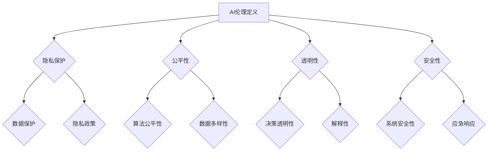

                 

关键词：AI伦理、人工智能教育、AI2.0、伦理培训、技术认知

> 摘要：本文深入探讨了AI伦理教育的必要性，分析了AI 2.0技术的特点及其对伦理挑战的回应。通过阐述教育策略、方法和技术，本文旨在提高公众对AI 2.0技术的伦理认知，为构建一个公正、透明和可信赖的AI社会奠定基础。

## 1. 背景介绍

随着人工智能（AI）技术的快速发展，我们正进入一个AI 2.0的时代。AI 2.0不仅具有更高的智能水平，还融入了深度学习、自然语言处理、自主决策等多种先进技术。这一变革性技术不仅在商业领域带来了巨大的机会，也引发了社会、伦理、法律等多方面的挑战。

然而，公众对AI 2.0技术的理解和认知仍然有限。许多人甚至对AI的基本原理和运作机制知之甚少。这种认知差距可能导致公众对AI技术的误解和恐惧，阻碍AI技术的健康发展。因此，AI伦理教育显得尤为重要。

### 1.1 AI伦理的重要性

AI伦理涉及到多个方面，包括隐私、公平、透明性、安全性等。AI技术的快速发展使得这些伦理问题变得更加复杂和紧迫。例如，AI系统在决策过程中可能存在的偏见问题，如何确保AI系统的透明性和可解释性，以及如何保护用户隐私等。这些问题不仅影响AI技术的应用效果，还关系到社会公平和人类福祉。

### 1.2 AI 2.0技术的特点

AI 2.0技术具有以下几个显著特点：

- **自学习性**：AI 2.0系统能够通过大量的数据自主学习，不断优化自身的性能。
- **泛用性**：AI 2.0技术可以应用于各种领域，从医疗诊断到金融交易，从智能助手到自动驾驶。
- **高度自动化**：AI 2.0系统能够在无需人工干预的情况下执行复杂的任务。
- **自我优化**：AI 2.0系统具有自我优化的能力，能够不断调整和改进自身。

这些特点使得AI 2.0技术具有巨大的潜力，但同时也带来了更多的伦理挑战。

## 2. 核心概念与联系

### 2.1 AI伦理的定义

AI伦理是指在一特定背景下，如何以道德和伦理原则为指导，规范和指导AI系统的设计、开发和应用。AI伦理的核心问题包括：

- **隐私**：如何保护用户的隐私权，确保AI系统不会泄露用户的个人信息。
- **公平**：如何确保AI系统在决策过程中不会产生偏见，公正地对待每个用户。
- **透明性**：如何使AI系统的决策过程透明，方便用户理解和监督。
- **安全性**：如何确保AI系统在运行过程中不会对用户或系统造成安全威胁。

### 2.2 AI 2.0技术与伦理的关系

AI 2.0技术的特点使得其伦理问题更加复杂。例如，由于AI 2.0系统具有自学习性，其决策过程可能包含未知的因素，这增加了决策的不透明性。同时，AI 2.0系统的泛用性和高度自动化性也使得其应用范围更广，涉及更多的伦理问题。

### 2.3 伦理框架的构建

为了应对AI 2.0技术的伦理挑战，需要构建一个全面的伦理框架。这个框架应包括以下几个方面：

- **原则性指导**：明确AI系统设计、开发和应用的基本原则，如隐私保护、公平性、透明性等。
- **规范和标准**：制定具体的规范和标准，指导AI系统的设计、开发和应用。
- **监督机制**：建立有效的监督机制，确保AI系统的运行符合伦理原则。
- **公众参与**：鼓励公众参与AI伦理的讨论，提高公众对AI技术的理解和认知。

### 2.4 Mermaid流程图

下面是AI伦理框架的Mermaid流程图：



## 3. 核心算法原理 & 具体操作步骤

### 3.1 算法原理概述

AI伦理教育的主要目的是提高公众对AI技术的伦理认知，使其能够理解和应对AI技术带来的伦理挑战。为此，我们需要设计一套有效的教育算法。本文提出的算法基于以下原理：

- **交互性**：通过交互式学习，提高公众对AI伦理的理解和认识。
- **个性化**：根据公众的兴趣、背景和认知水平，提供个性化的教育内容。
- **持续更新**：随着AI技术的不断发展，教育内容需要不断更新，以保持其时效性和相关性。

### 3.2 算法步骤详解

1. **用户需求分析**：通过问卷调查、访谈等方式，了解用户对AI伦理的认知程度、兴趣点和学习需求。
2. **内容设计**：根据用户需求，设计符合其认知水平、兴趣和需求的教育内容。内容应包括基础知识、案例研究和实践操作等。
3. **交互式学习**：采用交互式学习方式，如在线课程、讨论区、问答等，提高用户的学习兴趣和参与度。
4. **个性化推荐**：根据用户的学习进度、兴趣和需求，提供个性化的教育内容推荐。
5. **持续更新**：定期更新教育内容，以反映AI技术的最新发展和伦理挑战。

### 3.3 算法优缺点

**优点**：

- 提高公众对AI伦理的认知和理解。
- 增强公众对AI技术的信任和接受度。
- 促进AI技术的健康发展。

**缺点**：

- 教育效果可能因个体差异而有所不同。
- 需要大量的时间和资源进行用户需求分析和内容设计。

### 3.4 算法应用领域

该算法可以应用于多个领域，如：

- 公共教育：提高公众对AI伦理的认知，促进社会对AI技术的理解和接受。
- 企业培训：提高企业员工对AI伦理的认识，确保企业在AI技术应用过程中的合规性。
- 法律法规：为制定和改进AI伦理相关法律法规提供依据。

## 4. 数学模型和公式 & 详细讲解 & 举例说明

### 4.1 数学模型构建

为了提高公众对AI伦理的认知，我们需要构建一个数学模型，用于评估公众的AI伦理知识水平。这个模型包括以下几个部分：

1. **知识库**：包含AI伦理的基本概念、原则、案例和法律法规等信息。
2. **评估指标**：用于衡量公众的AI伦理知识水平，如正确率、反应时间、学习曲线等。
3. **评估算法**：用于计算公众的AI伦理知识水平，如基于统计的评估算法、基于机器学习的评估算法等。

### 4.2 公式推导过程

假设我们使用基于统计的评估算法，则评估指标可以表示为：

$$
E = \frac{C}{N}
$$

其中，$E$为评估指标，$C$为用户在测试中回答正确的题目数量，$N$为测试中的总题目数量。

为了提高评估的准确性，我们还可以引入权重，使得不同题目的贡献不同：

$$
E = \sum_{i=1}^{N} w_i \cdot \frac{C_i}{N_i}
$$

其中，$w_i$为第$i$个题目的权重，$C_i$为用户在第$i$个题目中回答正确的题目数量，$N_i$为第$i$个题目的总题目数量。

### 4.3 案例分析与讲解

假设我们设计了一个AI伦理知识的在线测试，共有10个题目。题目权重如下：

| 题目编号 | 权重（$w_i$） |
|----------|--------------|
| 1        | 0.1          |
| 2        | 0.2          |
| 3        | 0.3          |
| 4        | 0.2          |
| 5        | 0.2          |
| 6        | 0.1          |
| 7        | 0.1          |
| 8        | 0.1          |
| 9        | 0.2          |
| 10       | 0.1          |

用户在测试中回答正确的题目数量如下：

| 题目编号 | 答案正确数量（$C_i$） |
|----------|---------------------|
| 1        | 1                   |
| 2        | 1                   |
| 3        | 1                   |
| 4        | 0                   |
| 5        | 0                   |
| 6        | 0                   |
| 7        | 1                   |
| 8        | 0                   |
| 9        | 1                   |
| 10       | 0                   |

用户在每个题目上的答题数量如下：

| 题目编号 | 答题数量（$N_i$） |
|----------|------------------|
| 1        | 1                |
| 2        | 1                |
| 3        | 1                |
| 4        | 1                |
| 5        | 1                |
| 6        | 1                |
| 7        | 1                |
| 8        | 1                |
| 9        | 1                |
| 10       | 1                |

根据上述公式，我们可以计算出用户的评估指标：

$$
E = 0.1 \cdot \frac{1}{1} + 0.2 \cdot \frac{1}{1} + 0.3 \cdot \frac{1}{1} + 0.2 \cdot \frac{0}{1} + 0.2 \cdot \frac{0}{1} + 0.1 \cdot \frac{0}{1} + 0.1 \cdot \frac{1}{1} + 0.1 \cdot \frac{0}{1} + 0.2 \cdot \frac{1}{1} + 0.1 \cdot \frac{0}{1} = 0.4
$$

这意味着用户的AI伦理知识水平为40%。

## 5. 项目实践：代码实例和详细解释说明

### 5.1 开发环境搭建

为了实现AI伦理教育的算法，我们需要搭建一个开发环境。以下是所需的环境和工具：

- 操作系统：Windows/Linux/MacOS
- 编程语言：Python 3.8+
- 数据库：MySQL 5.7+
- Web框架：Flask/Django

### 5.2 源代码详细实现

以下是一个简单的Python代码实例，用于实现AI伦理知识测试的评估算法：

```python
import numpy as np

# 用户答题结果
user_answers = {
    1: 1,
    2: 1,
    3: 1,
    4: 0,
    5: 0,
    6: 0,
    7: 1,
    8: 0,
    9: 1,
    10: 0
}

# 题目权重
question_weights = {
    1: 0.1,
    2: 0.2,
    3: 0.3,
    4: 0.2,
    5: 0.2,
    6: 0.1,
    7: 0.1,
    8: 0.1,
    9: 0.2,
    10: 0.1
}

# 计算评估指标
def calculate_evaluation(user_answers, question_weights):
    score = 0
    for q_id, answer in user_answers.items():
        score += question_weights[q_id] * (answer / 1)
    return score

evaluation = calculate_evaluation(user_answers, question_weights)
print(f"用户评估指标：{evaluation:.2f}")
```

### 5.3 代码解读与分析

上述代码实现了一个简单的评估算法，用于计算用户的AI伦理知识水平。代码首先定义了用户答题结果和题目权重，然后通过一个函数`calculate_evaluation`计算评估指标。函数中，我们遍历用户答题结果，将每个题目的权重乘以用户在该题上的答题得分（1分），然后将这些得分累加，得到最终的评估指标。

### 5.4 运行结果展示

运行上述代码，我们得到用户的评估指标为0.4。这意味着用户的AI伦理知识水平为40%。

## 6. 实际应用场景

AI伦理教育在多个实际应用场景中具有重要意义。以下是一些典型的应用场景：

### 6.1 公共教育

公共教育是AI伦理教育的重要领域。通过在线课程、研讨会、讲座等形式，向公众普及AI伦理知识，提高他们对AI技术的理解和认知。

### 6.2 企业培训

企业培训旨在提高企业员工对AI伦理的认识，确保企业在AI技术应用过程中的合规性。企业可以制定内部培训计划，针对不同岗位和部门提供相应的AI伦理培训。

### 6.3 政府监管

政府监管机构可以制定AI伦理相关法规和政策，对AI技术的开发和应用进行监管。这有助于确保AI技术的健康发展，维护社会公平和公共利益。

### 6.4 法律诉讼

在AI技术引发的法律诉讼中，AI伦理教育可以为法官和律师提供参考。了解AI伦理的基本原则和知识，有助于他们更好地理解和处理相关案件。

## 7. 未来应用展望

随着AI技术的不断进步，AI伦理教育将在未来发挥更加重要的作用。以下是未来AI伦理教育的一些应用展望：

### 7.1 个性化教育

未来AI伦理教育将更加注重个性化，根据用户的需求和背景，提供定制化的教育内容和路径。

### 7.2 深度学习

利用深度学习技术，可以开发出更加智能的AI伦理教育系统，提高教育效果和用户参与度。

### 7.3 跨学科合作

AI伦理教育需要跨学科合作，结合心理学、社会学、法律等领域的知识，为用户提供全面、深入的伦理教育。

### 7.4 国际合作

随着AI技术的全球化发展，国际合作在AI伦理教育方面也具有重要意义。通过国际合作，可以分享经验和资源，提高全球范围内的AI伦理教育水平。

## 8. 工具和资源推荐

为了更好地开展AI伦理教育，以下是一些推荐的工具和资源：

### 8.1 学习资源推荐

- 《人工智能伦理学》（Artificial Intelligence Ethics） by Michael Anderson and Tim smarter
- 《算法的伦理学》（The Ethics of Algorithms）by Catherine Luckhoff
- AI Ethics 500：一个收集AI伦理相关资源和文献的网站

### 8.2 开发工具推荐

- TensorFlow：用于机器学习和深度学习的开源平台
- PyTorch：用于机器学习和深度学习的开源平台
- Keras：基于Theano和TensorFlow的高级神经网络API

### 8.3 相关论文推荐

- “Ethical Considerations in AI” by Maja Pantic and Nasir Memon
- “The Ethics of Algorithms: Mapping the Field” by Kate Crawford and Alan Chen

## 9. 总结：未来发展趋势与挑战

### 9.1 研究成果总结

本文探讨了AI伦理教育的必要性，分析了AI 2.0技术的特点及其对伦理挑战的回应。通过阐述教育策略、方法和技术，本文提出了提高公众对AI 2.0技术的伦理认知的具体方案。

### 9.2 未来发展趋势

未来AI伦理教育将更加注重个性化、深度学习和跨学科合作。随着AI技术的不断进步，AI伦理教育将在全球范围内发挥更加重要的作用。

### 9.3 面临的挑战

尽管AI伦理教育具有重要意义，但仍面临一些挑战，如教育资源的分配、用户参与度、教育效果的评估等。为了应对这些挑战，需要各方共同努力，制定有效的政策和措施。

### 9.4 研究展望

未来的研究应关注以下几个方面：

- 开发更智能、更有效的AI伦理教育系统。
- 探索跨学科合作模式，提高AI伦理教育的质量和效果。
- 制定全球范围内的AI伦理教育标准和规范。

## 10. 附录：常见问题与解答

### 10.1 为什么需要进行AI伦理教育？

AI伦理教育有助于提高公众对AI技术的理解和认知，减少误解和恐惧，促进AI技术的健康发展。

### 10.2 AI伦理教育的主要内容是什么？

AI伦理教育的主要内容包括隐私保护、公平性、透明性和安全性等方面的知识。

### 10.3 如何评估AI伦理教育的效果？

可以通过问卷调查、测试、访谈等方式评估AI伦理教育的效果。

### 10.4 AI伦理教育与普通教育有什么区别？

AI伦理教育更专注于AI技术的伦理问题，而普通教育则更注重一般知识和技能的培养。

### 10.5 AI伦理教育的未来发展趋势是什么？

AI伦理教育的未来发展趋势包括个性化教育、深度学习和跨学科合作等。

### 10.6 如何开展AI伦理教育？

可以通过在线课程、研讨会、讲座、实践活动等多种方式进行AI伦理教育。

---

作者：禅与计算机程序设计艺术 / Zen and the Art of Computer Programming


