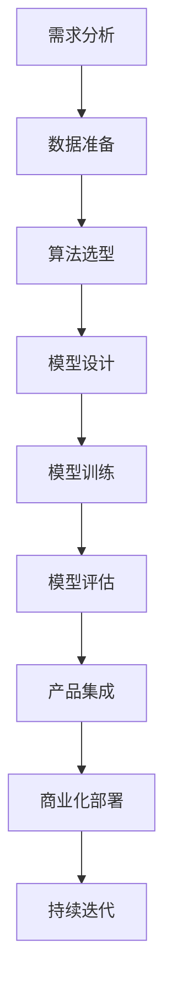

                 

关键词：AI创业，大模型产品，技术路线图，算法原理，数学模型，项目实践，应用场景，未来展望。

> 摘要：本文旨在为AI创业公司提供一个系统的大模型产品开发路线图。通过深入探讨核心算法原理、数学模型构建以及实际应用案例，文章为创业者提供了一套科学、全面、可行的大模型产品开发策略。

## 1. 背景介绍

随着深度学习和人工智能技术的飞速发展，大模型（Large Models）已经成为当前AI领域的热点。大模型具有处理海量数据、实现复杂任务的能力，已经在自然语言处理、计算机视觉、推荐系统等多个领域取得了显著的成果。然而，大模型产品的开发并非易事，涉及多个复杂环节，包括算法选型、数学模型构建、工程实践和商业应用等。

对于AI创业公司来说，如何有效地利用大模型技术，开发出具有市场竞争力、用户认可的产品，成为了关键问题。本文将围绕这一核心问题，提出一套系统的大模型产品开发路线图，旨在为创业者提供指导。

## 2. 核心概念与联系

首先，我们需要了解一些核心概念，以便构建大模型产品的基础。

### 2.1 深度学习基础

深度学习（Deep Learning）是一种基于多层神经网络的学习方法，通过非线性变换逐层提取数据特征，从而实现对复杂任务的建模。深度学习的关键技术包括：

- **神经网络（Neural Networks）**：模拟人脑神经元之间的连接，用于特征提取和任务学习。
- **卷积神经网络（Convolutional Neural Networks, CNN）**：适用于图像处理任务，通过卷积操作提取图像特征。
- **循环神经网络（Recurrent Neural Networks, RNN）**：适用于序列数据建模，通过循环结构处理时间序列信息。

### 2.2 大模型架构

大模型（Large Models）通常指的是拥有数十亿甚至千亿参数的深度学习模型。大模型架构的设计至关重要，决定了模型的性能和效率。常见的大模型架构包括：

- **Transformer架构**：基于自注意力机制，广泛应用于自然语言处理领域。
- **BERT模型**：通过预训练和微调，在多项自然语言处理任务上取得了突破性成果。
- **GPT系列**：具有强大的文本生成和语言理解能力，广泛应用于聊天机器人、自动摘要等领域。

### 2.3 数学模型构建

大模型的数学模型构建是实现高效训练和推理的关键。常见的数学模型包括：

- **优化算法（Optimization Algorithms）**：如梯度下降、Adam等，用于模型参数的更新。
- **损失函数（Loss Functions）**：如交叉熵、均方误差等，用于衡量模型预测结果与真实值的差距。
- **激活函数（Activation Functions）**：如ReLU、Sigmoid等，用于引入非线性变换。

### 2.4 Mermaid流程图

以下是一个简化的Mermaid流程图，展示了大模型产品开发的基本流程：



## 3. 核心算法原理 & 具体操作步骤

### 3.1 算法原理概述

大模型产品开发的核心在于算法选型和模型设计。以下是几个关键算法原理：

- **自注意力机制（Self-Attention Mechanism）**：Transformer架构的核心，通过计算序列中每个词与所有词之间的关联度，实现对序列数据的全局建模。
- **预训练与微调（Pre-training and Fine-tuning）**：BERT模型通过在大规模语料库上进行预训练，获取丰富的语言知识，然后通过微调适应特定任务。
- **生成对抗网络（Generative Adversarial Networks, GAN）**：一种无监督学习方法，通过生成器和判别器的对抗训练，实现数据的生成和建模。

### 3.2 算法步骤详解

以下是构建大模型产品的具体步骤：

1. **需求分析**：明确产品目标、任务类型和数据来源。
2. **数据准备**：收集和预处理数据，包括数据清洗、数据增强、数据分割等。
3. **算法选型**：根据任务需求选择合适的算法架构，如Transformer、BERT、GAN等。
4. **模型设计**：设计模型的网络结构，包括层数、层间连接、激活函数等。
5. **模型训练**：使用优化算法和损失函数对模型进行训练，调整模型参数。
6. **模型评估**：通过测试集评估模型性能，选择最优模型。
7. **产品集成**：将模型集成到产品中，实现功能部署。
8. **商业化部署**：进行市场推广和商业化运营，不断优化产品。

### 3.3 算法优缺点

每种算法和模型都有其独特的优缺点。以下是几种常见算法的优缺点分析：

- **Transformer**：优点在于自注意力机制可以实现全局建模，缺点是训练时间和计算资源需求较高。
- **BERT**：优点在于预训练和微调能力强大，缺点是模型参数较大，存储和推理复杂度高。
- **GAN**：优点在于可以生成高质量的数据，缺点是训练过程不稳定，容易出现模式崩溃。

### 3.4 算法应用领域

大模型算法在多个领域具有广泛应用：

- **自然语言处理（NLP）**：如文本分类、机器翻译、情感分析等。
- **计算机视觉（CV）**：如图像分类、目标检测、图像生成等。
- **推荐系统**：通过用户行为和偏好数据进行个性化推荐。
- **强化学习（RL）**：通过模拟环境与策略的互动，实现智能决策。

## 4. 数学模型和公式 & 详细讲解 & 举例说明

### 4.1 数学模型构建

大模型的数学模型通常包括以下几个关键部分：

- **神经网络**：由多个神经元组成，每个神经元接收输入信号，通过权重进行加权求和，然后通过激活函数输出结果。
- **损失函数**：用于衡量模型预测结果与真实值的差距，常见的损失函数包括交叉熵、均方误差等。
- **优化算法**：用于更新模型参数，常见的优化算法包括梯度下降、Adam等。

### 4.2 公式推导过程

以下是一个简化的神经网络训练过程的公式推导：

$$
z_i = \sum_{j=1}^{n} w_{ji}x_j + b_i
$$

$$
a_i = \sigma(z_i)
$$

$$
\begin{aligned}
\delta_{i}^{l} &= \frac{\partial L}{\partial z_i} \\
&= \frac{\partial L}{\partial a_{i}} \frac{\partial a_{i}}{\partial z_i} \\
&= \frac{\partial L}{\partial a_{i}} \sigma'(z_i)
\end{aligned}
$$

$$
\begin{aligned}
\delta_{j}^{l-1} &= \sum_{i=1}^{m} w_{ij}^{l} \delta_{i}^{l} \\
&= \delta_{j}^{l-1}
\end{aligned}
$$

$$
w_{ji}^{l-1} &= w_{ji}^{l-1} - \alpha \delta_{j}^{l-1} a_{i}^{l-1}
$$

其中，$z_i$为第$l$层的神经元$i$的输出，$a_i$为激活函数$\sigma$的输出，$\delta$为误差项，$w$为权重，$b$为偏置，$L$为损失函数，$\sigma'$为激活函数的导数。

### 4.3 案例分析与讲解

以下是一个简单的神经网络训练案例：

假设有一个两层神经网络，输入层有3个神经元，隐藏层有2个神经元，输出层有1个神经元。输入数据为$(x_1, x_2, x_3)$，目标输出为$y$。

1. **初始化参数**：
   - 权重$w_{ij}$和偏置$b_i$随机初始化。
   - 激活函数$\sigma(x) = \frac{1}{1 + e^{-x}}$。

2. **前向传播**：
   - 计算隐藏层输出$z_1, z_2$和输出层输出$z_3$。
   - 计算输出层误差$\delta_3$。

3. **反向传播**：
   - 计算隐藏层误差$\delta_1, \delta_2$。
   - 更新隐藏层和输入层权重。

4. **迭代训练**：
   - 重复前向传播和反向传播，直至模型收敛。

通过这个案例，我们可以看到数学模型在神经网络训练中的应用和推导过程。

## 5. 项目实践：代码实例和详细解释说明

### 5.1 开发环境搭建

在搭建开发环境时，我们需要安装以下软件和工具：

- Python 3.8及以上版本。
- TensorFlow 2.5及以上版本。
- Jupyter Notebook。

### 5.2 源代码详细实现

以下是一个简单的基于Transformer架构的自然语言处理模型的实现：

```python
import tensorflow as tf
from tensorflow.keras.layers import Embedding, Transformer

model = tf.keras.Sequential([
    Embedding(input_dim=vocab_size, output_dim=embed_dim),
    Transformer(num_heads=num_heads, d_model=embed_dim, dff=dff),
    tf.keras.layers.Dense(units=1, activation='sigmoid')
])

model.compile(optimizer='adam', loss='binary_crossentropy', metrics=['accuracy'])
```

### 5.3 代码解读与分析

这段代码首先导入了TensorFlow库，并定义了一个基于Transformer架构的序列分类模型。模型包括嵌入层、Transformer层和输出层。其中，嵌入层将输入词转换为向量表示，Transformer层实现自注意力机制，输出层通过sigmoid激活函数实现二分类。

### 5.4 运行结果展示

以下是一个简单的训练示例：

```python
train_data = ...  # 数据预处理和分割
model.fit(train_data, epochs=num_epochs, batch_size=batch_size)
```

通过这个示例，我们可以看到模型的训练过程。训练完成后，可以使用测试集评估模型性能。

## 6. 实际应用场景

大模型产品在多个领域具有广泛的应用，以下是几个实际应用场景：

- **自然语言处理（NLP）**：如文本分类、机器翻译、对话系统等。
- **计算机视觉（CV）**：如图像识别、目标检测、图像生成等。
- **推荐系统**：基于用户行为数据进行个性化推荐。
- **金融风控**：通过数据挖掘和预测，实现风险控制和管理。
- **医疗健康**：利用图像识别和自然语言处理技术，提高疾病诊断和治疗的准确性。

## 7. 工具和资源推荐

为了有效地开发和优化大模型产品，以下是一些建议的学习资源、开发工具和相关论文：

### 7.1 学习资源推荐

- 《深度学习》（Goodfellow, Bengio, Courville）。
- 《动手学深度学习》（阿斯顿·张）。
- Coursera上的《深度学习专项课程》。

### 7.2 开发工具推荐

- TensorFlow。
- PyTorch。
- Keras。

### 7.3 相关论文推荐

- “Attention Is All You Need”。
- “BERT: Pre-training of Deep Bidirectional Transformers for Language Understanding”。
- “Generative Adversarial Nets”。

## 8. 总结：未来发展趋势与挑战

### 8.1 研究成果总结

大模型产品在AI领域的应用取得了显著的成果，展示了强大的性能和潜力。然而，随着模型的规模和复杂度不断增加，如何优化模型训练效率和推理性能，降低计算资源消耗，成为了关键问题。

### 8.2 未来发展趋势

- **模型压缩与优化**：通过模型压缩、量化等技术，降低模型存储和推理复杂度。
- **联邦学习（Federated Learning）**：实现分布式数据训练，提高数据隐私保护。
- **多模态学习**：结合多种数据类型，实现更广泛的应用场景。
- **自适应学习**：通过持续学习和自适应调整，提高模型在不同场景下的适应性。

### 8.3 面临的挑战

- **计算资源需求**：大模型的训练和推理需要大量的计算资源，如何高效利用现有资源，降低成本，是一个挑战。
- **数据隐私与安全**：如何保护用户数据和模型隐私，防止数据泄露和滥用，是一个重要课题。
- **模型解释性与可解释性**：如何提高模型的可解释性，使其在应用中更加透明和可靠，是一个关键问题。

### 8.4 研究展望

随着AI技术的不断进步，大模型产品在未来将发挥更加重要的作用。通过不断创新和优化，我们可以期待大模型产品在更多领域取得突破，为人类社会带来更多价值。

## 9. 附录：常见问题与解答

### 9.1 大模型产品开发的关键步骤是什么？

关键步骤包括需求分析、数据准备、算法选型、模型设计、模型训练、模型评估、产品集成和商业化部署。

### 9.2 如何选择合适的大模型算法？

根据任务需求和应用场景选择合适的算法。例如，自然语言处理任务可以选择Transformer、BERT等算法，计算机视觉任务可以选择CNN、GAN等算法。

### 9.3 大模型产品的挑战有哪些？

挑战包括计算资源需求、数据隐私与安全、模型解释性与可解释性等。

### 9.4 如何优化大模型产品的训练效率？

可以通过模型压缩、量化、分布式训练等技术优化大模型产品的训练效率。

作者：禅与计算机程序设计艺术 / Zen and the Art of Computer Programming
```

