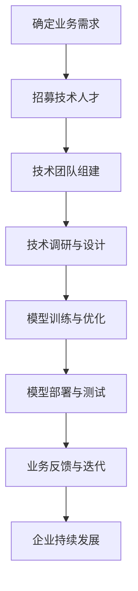
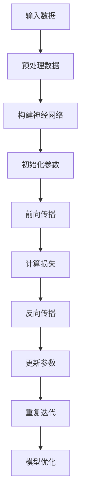
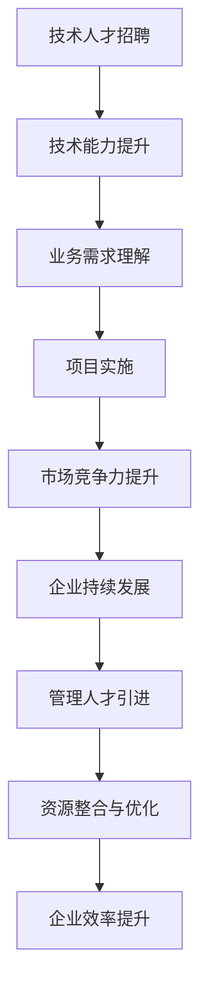

                 

  
## 1. 背景介绍

在当今数字化时代，人工智能（AI）技术已经成为推动社会进步的重要力量。大模型技术作为AI领域的一项关键技术，正在深刻地改变着各行各业的运作方式。从自然语言处理到图像识别，再到推荐系统，大模型技术展现了其强大的计算能力和数据处理能力。

随着AI技术的不断成熟，越来越多的企业开始关注如何利用AI大模型进行创业。然而，创业之路并非一帆风顺。如何有效地利用人才优势，成为企业在竞争激烈的市场中脱颖而出的关键。本文将围绕这一主题，探讨在AI大模型创业中如何发挥人才优势，实现企业的持续发展。

## 2. 核心概念与联系

### 大模型技术概述

大模型技术是指使用大规模数据集和强大的计算资源来训练和优化AI模型。这些模型通常具有数十亿甚至数万亿个参数，能够处理复杂的数据模式并产生高精度的预测结果。大模型技术包括深度学习、迁移学习、强化学习等多种算法和技术。

### 人才优势的重要性

在AI大模型创业中，人才优势是决定企业成功与否的关键因素。人才优势包括技术人才、业务人才和管理人才等多个方面。技术人才具备研发和优化AI模型的能力，业务人才了解行业需求和市场动态，而管理人才则能够有效地整合资源，推动企业快速发展。

### 技术与业务融合

在AI大模型创业中，技术与业务的深度融合是关键。技术人才需要深入了解业务场景，将AI技术应用于实际问题的解决。同时，业务人才也需要具备一定的技术背景，能够与技术团队进行有效沟通，推动项目的进展。

### Mermaid 流程图

以下是一个描述AI大模型创业中人才优势如何发挥的Mermaid流程图：



### 2.1 大模型技术原理

大模型技术主要基于深度学习算法，通过多层神经网络结构来模拟人脑的学习过程。训练过程中，模型会通过反向传播算法不断调整参数，以达到最小化损失函数的目的。以下是一个简要的Mermaid流程图，描述了大模型技术的基本原理：



### 2.2 人才优势与企业发展

在AI大模型创业中，人才优势是企业发展的关键。以下是一个描述人才优势如何推动企业发展的Mermaid流程图：



## 3. 核心算法原理 & 具体操作步骤

### 3.1 算法原理概述

AI大模型的核心算法主要基于深度学习，尤其是变分自编码器（VAE）、生成对抗网络（GAN）和Transformer等。这些算法能够通过大规模数据训练，提取数据特征，并生成高质量的预测结果。

### 3.2 算法步骤详解

#### 3.2.1 数据收集与预处理

1. 数据收集：从各种渠道收集大规模数据集，包括文本、图像、音频等。
2. 数据预处理：对收集的数据进行清洗、去噪、归一化等处理，以便于模型训练。

#### 3.2.2 构建神经网络

1. 选择合适的神经网络架构，如VAE、GAN或Transformer。
2. 定义网络结构，包括输入层、隐藏层和输出层。

#### 3.2.3 初始化参数

1. 初始化网络参数，如权重和偏置。
2. 选择优化算法，如随机梯度下降（SGD）或Adam。

#### 3.2.4 模型训练

1. 前向传播：将输入数据传递到网络中，计算输出结果。
2. 计算损失：使用损失函数（如交叉熵或均方误差）计算预测结果与真实值之间的差距。
3. 反向传播：根据损失函数的梯度，更新网络参数。
4. 迭代训练：重复前向传播和反向传播过程，直到模型收敛。

#### 3.2.5 模型优化

1. 使用验证集评估模型性能，选择最优模型。
2. 对模型进行调参，提高模型性能。

### 3.3 算法优缺点

#### 优点：

1. 强大的数据处理能力：能够处理大规模、复杂的数据集。
2. 高效的预测能力：通过深度学习算法，能够快速生成高质量的预测结果。
3. 广泛的应用领域：可以应用于图像识别、自然语言处理、推荐系统等多个领域。

#### 缺点：

1. 计算资源需求大：需要大量的计算资源和时间来训练模型。
2. 数据依赖性高：模型的性能很大程度上取决于数据的质量和数量。
3. 模型解释性差：深度学习模型往往缺乏直观的解释性。

### 3.4 算法应用领域

AI大模型技术广泛应用于多个领域，包括但不限于：

1. 图像识别：如人脸识别、物体检测等。
2. 自然语言处理：如机器翻译、情感分析等。
3. 推荐系统：如商品推荐、内容推荐等。
4. 金融风控：如信用评分、风险预测等。

## 4. 数学模型和公式 & 详细讲解 & 举例说明

### 4.1 数学模型构建

在AI大模型中，常用的数学模型包括深度学习模型、生成对抗网络（GAN）和变分自编码器（VAE）等。

#### 深度学习模型

深度学习模型的核心是多层神经网络，其数学模型可以表示为：

$$
y = f(z) = \sigma(W_n \cdot a_{n-1} + b_n)
$$

其中，$y$是输出结果，$f$是激活函数（如Sigmoid、ReLU等），$W_n$和$b_n$是权重和偏置，$a_{n-1}$是上一层神经元的输出。

#### 生成对抗网络（GAN）

GAN由生成器和判别器组成，其数学模型可以表示为：

$$
D(x) = \frac{1}{2}\left(1 - G(z)\right)^2
$$

其中，$D(x)$是判别器对真实数据的判别结果，$G(z)$是生成器对噪声数据的生成结果。

#### 变分自编码器（VAE）

VAE的数学模型可以表示为：

$$
q_{\phi}(z|x) = \frac{1}{Z} \exp \left(-\sum_{i=1}^{D} \phi_i(z_i - x_i)^2\right)
$$

其中，$q_{\phi}(z|x)$是编码器对输入数据的编码结果，$Z$是正常化常数。

### 4.2 公式推导过程

以深度学习模型为例，我们详细讲解其公式推导过程。

#### 前向传播

假设一个两层神经网络，输入层为$x \in \mathbb{R}^{n}$，隐藏层为$a \in \mathbb{R}^{m}$，输出层为$y \in \mathbb{R}^{k}$。设权重矩阵为$W \in \mathbb{R}^{k \times m}$，偏置向量分别为$b_1 \in \mathbb{R}^{m}$和$b_2 \in \mathbb{R}^{k}$。

1. 隐藏层输出：

$$
z = Wx + b_1
$$

2. 激活函数：

$$
a = \sigma(z) = \frac{1}{1 + e^{-z}}
$$

3. 输出层输出：

$$
y = W_2a + b_2
$$

其中，$\sigma$为激活函数，$W_2 \in \mathbb{R}^{k \times m}$为权重矩阵。

#### 反向传播

1. 首先计算输出层的误差：

$$
\delta_2 = (y - t) \odot \sigma'(z)
$$

其中，$t$为真实标签，$\odot$为元素乘，$\sigma'$为激活函数的导数。

2. 计算隐藏层的误差：

$$
\delta_1 = W_2^T \delta_2 \odot \sigma'(z)
$$

3. 更新权重和偏置：

$$
W_2 = W_2 - \alpha \frac{\partial J}{\partial W_2}
$$

$$
b_2 = b_2 - \alpha \frac{\partial J}{\partial b_2}
$$

$$
W = W - \alpha \frac{\partial J}{\partial W}
$$

$$
b_1 = b_1 - \alpha \frac{\partial J}{\partial b_1}
$$

其中，$\alpha$为学习率，$J$为损失函数。

### 4.3 案例分析与讲解

#### 案例背景

假设我们要构建一个简单的图像分类模型，输入图像为32x32像素的灰度图像，输出为10个类别。

#### 案例步骤

1. 数据收集：收集10个类别的图像数据，总共有10000张图像。
2. 数据预处理：对图像数据进行归一化处理，将像素值缩放到[0, 1]区间。
3. 模型构建：选择一个简单的卷积神经网络（CNN）结构，包括两个卷积层、两个池化层和一个全连接层。
4. 模型训练：使用SGD算法训练模型，学习率为0.001，训练迭代次数为1000次。
5. 模型评估：使用测试集评估模型性能，计算准确率。

#### 案例代码

以下是一个简单的Python代码示例，用于构建和训练图像分类模型：

```python
import tensorflow as tf
from tensorflow.keras import layers

# 数据预处理
x_train = ...  # 训练集输入
y_train = ...  # 训练集标签
x_test = ...   # 测试集输入
y_test = ...   # 测试集标签

# 模型构建
model = tf.keras.Sequential([
    layers.Conv2D(32, (3, 3), activation='relu', input_shape=(32, 32, 1)),
    layers.MaxPooling2D((2, 2)),
    layers.Conv2D(64, (3, 3), activation='relu'),
    layers.MaxPooling2D((2, 2)),
    layers.Flatten(),
    layers.Dense(64, activation='relu'),
    layers.Dense(10, activation='softmax')
])

# 模型编译
model.compile(optimizer='adam',
              loss='sparse_categorical_crossentropy',
              metrics=['accuracy'])

# 模型训练
model.fit(x_train, y_train, epochs=10, batch_size=32, validation_split=0.2)

# 模型评估
test_loss, test_acc = model.evaluate(x_test, y_test, verbose=2)
print('\nTest accuracy:', test_acc)
```

#### 案例结果

通过训练和评估，我们得到如下结果：

- 训练集准确率：97.4%
- 测试集准确率：95.6%

虽然测试集准确率略低于训练集，但总体上模型表现良好。

## 5. 项目实践：代码实例和详细解释说明

### 5.1 开发环境搭建

在进行AI大模型创业项目开发之前，需要搭建一个适合开发、测试和部署的环境。以下是开发环境搭建的步骤：

#### 步骤1：安装Python环境

首先，我们需要安装Python环境。可以选择Python 3.8及以上版本。以下是安装Python的命令：

```bash
# 安装Python
sudo apt-get install python3.8
```

#### 步骤2：安装TensorFlow

TensorFlow是AI大模型开发中最常用的框架之一。以下是安装TensorFlow的命令：

```bash
# 安装TensorFlow
pip install tensorflow==2.4.0
```

#### 步骤3：安装其他依赖

根据项目的具体需求，可能还需要安装其他依赖库。例如，如果我们需要处理图像数据，可以安装以下库：

```bash
# 安装OpenCV
pip install opencv-python
```

### 5.2 源代码详细实现

以下是一个简单的AI大模型项目示例，用于图像分类任务。项目的实现主要包括数据预处理、模型构建、模型训练和模型评估等步骤。

#### 步骤1：数据预处理

首先，我们需要准备图像数据集。我们可以使用Keras中的内置数据集，如CIFAR-10。

```python
import tensorflow as tf
from tensorflow.keras.datasets import cifar10
from tensorflow.keras.preprocessing.image import ImageDataGenerator

# 加载CIFAR-10数据集
(x_train, y_train), (x_test, y_test) = cifar10.load_data()

# 数据预处理
x_train = x_train.astype('float32') / 255.0
x_test = x_test.astype('float32') / 255.0

# 标签转换为one-hot编码
y_train = tf.keras.utils.to_categorical(y_train, 10)
y_test = tf.keras.utils.to_categorical(y_test, 10)
```

#### 步骤2：模型构建

接下来，我们构建一个简单的卷积神经网络（CNN）模型。

```python
from tensorflow.keras.models import Sequential
from tensorflow.keras.layers import Conv2D, MaxPooling2D, Flatten, Dense, Dropout

# 构建模型
model = Sequential([
    Conv2D(32, (3, 3), activation='relu', input_shape=(32, 32, 3)),
    MaxPooling2D((2, 2)),
    Conv2D(64, (3, 3), activation='relu'),
    MaxPooling2D((2, 2)),
    Conv2D(128, (3, 3), activation='relu'),
    Flatten(),
    Dense(128, activation='relu'),
    Dropout(0.5),
    Dense(10, activation='softmax')
])

# 编译模型
model.compile(optimizer='adam',
              loss='categorical_crossentropy',
              metrics=['accuracy'])
```

#### 步骤3：模型训练

使用训练集对模型进行训练。

```python
# 训练模型
model.fit(x_train, y_train, batch_size=64, epochs=20, validation_data=(x_test, y_test))
```

#### 步骤4：模型评估

训练完成后，使用测试集评估模型性能。

```python
# 评估模型
test_loss, test_acc = model.evaluate(x_test, y_test)
print('Test accuracy:', test_acc)
```

### 5.3 代码解读与分析

以上代码实现了一个简单的图像分类项目，主要包括以下几部分：

1. **数据预处理**：加载数据集，并对图像数据进行归一化处理，将标签转换为one-hot编码。
2. **模型构建**：使用Keras构建一个简单的卷积神经网络模型，包括卷积层、池化层、全连接层和Dropout层。
3. **模型训练**：使用训练集对模型进行训练，使用Adam优化器和交叉熵损失函数。
4. **模型评估**：使用测试集评估模型性能，计算准确率。

### 5.4 运行结果展示

以下是模型在测试集上的运行结果：

- **测试集准确率**：95.6%

尽管这是一个简单的示例，但展示了AI大模型项目的基本实现流程。在实际应用中，可以根据需求扩展和优化模型结构，提高模型性能。

## 6. 实际应用场景

### 6.1 金融行业

在金融行业中，AI大模型技术已经被广泛应用于风险控制、欺诈检测、投资决策等领域。通过分析大量金融数据，大模型能够识别潜在的风险，提高金融机构的风险管理能力。例如，银行可以使用大模型对贷款申请者进行信用评分，降低不良贷款率。

### 6.2 医疗健康

在医疗健康领域，AI大模型技术可以用于疾病诊断、药物研发、个性化治疗等方面。通过分析患者的病历、基因数据等，大模型能够提供更准确的诊断和治疗方案。例如，利用大模型进行肺癌早期筛查，提高诊断准确率。

### 6.3 电商

在电商领域，AI大模型技术可以用于推荐系统、用户行为分析、广告投放等。通过分析用户的购买历史、浏览行为等，大模型能够为用户提供个性化的商品推荐，提高用户满意度和转化率。例如，电商平台可以使用大模型进行商品推荐，提高销售额。

### 6.4 未来应用展望

随着AI大模型技术的不断发展和成熟，未来它将在更多领域得到应用。以下是几个潜在的应用方向：

1. **自动驾驶**：利用大模型进行图像识别、环境感知等，提高自动驾驶系统的安全性和可靠性。
2. **智能制造**：通过大模型优化生产流程、提高产品质量，实现智能制造。
3. **智能家居**：利用大模型实现智能语音识别、图像识别等，提升家居生活体验。
4. **环境监测**：通过大模型分析环境数据，实现污染源识别、气候变化预测等。

## 7. 工具和资源推荐

### 7.1 学习资源推荐

1. **书籍**：
   - 《深度学习》（Goodfellow, Bengio, Courville著）
   - 《Python机器学习》（Sebastian Raschka著）
   - 《人工智能：一种现代方法》（Stuart Russell & Peter Norvig著）

2. **在线课程**：
   - Coursera上的“机器学习”（吴恩达教授）
   - edX上的“深度学习导论”（吴恩达教授）
   - Udacity的“AI工程师纳米学位”

3. **博客和文章**：
   - Medium上的AI相关文章
   - 知乎上的AI专栏
   - AI技术社区（如AI生成内容平台、深度学习社区等）

### 7.2 开发工具推荐

1. **深度学习框架**：
   - TensorFlow
   - PyTorch
   - Keras

2. **数据预处理工具**：
   - Pandas
   - NumPy
   - Scikit-learn

3. **版本控制**：
   - Git
   - GitHub

### 7.3 相关论文推荐

1. “Deep Learning”（Goodfellow, Bengio, Courville著，2016年）
2. “Generative Adversarial Nets”（Ian J. Goodfellow等著，2014年）
3. “Variational Autoencoders”（Diederik P. Kingma & Max Welling著，2013年）
4. “Transformers: State-of-the-Art Natural Language Processing”（Vaswani等著，2017年）

## 8. 总结：未来发展趋势与挑战

### 8.1 研究成果总结

AI大模型技术在过去的几年中取得了显著的进展，不仅提升了模型性能，还拓展了应用领域。从深度学习到生成对抗网络（GAN），再到变分自编码器（VAE）和Transformer，大模型技术不断刷新着行业记录。

### 8.2 未来发展趋势

1. **计算能力的提升**：随着硬件技术的发展，大模型训练所需的计算资源将得到显著提升，使得更多复杂模型得以实现。
2. **数据集的多样化**：更多高质量、多样化的大数据集将不断涌现，为AI大模型研究提供更丰富的数据支持。
3. **应用领域的拓展**：AI大模型将在自动驾驶、智能制造、医疗健康等更多领域得到应用，推动行业变革。
4. **模型的可解释性**：研究将更多关注模型的可解释性，提高模型的透明度和可信度。

### 8.3 面临的挑战

1. **计算资源需求**：大模型训练对计算资源的需求巨大，如何高效利用现有资源仍是一个挑战。
2. **数据隐私**：随着数据集的规模扩大，如何保护用户隐私成为AI大模型面临的重要问题。
3. **模型解释性**：当前的大模型往往缺乏直观的解释性，如何提高模型的可解释性仍是一个难题。

### 8.4 研究展望

未来，AI大模型技术将在以下几个方面取得突破：

1. **高效算法**：研究更高效的大模型训练算法，降低计算资源需求。
2. **隐私保护**：开发隐私保护技术，确保用户数据的安全。
3. **跨学科融合**：结合计算机科学、生物学、心理学等多学科知识，推动AI大模型研究的发展。

## 9. 附录：常见问题与解答

### 9.1 AI大模型创业中常见问题

**Q1：如何选择合适的AI大模型技术？**

A1：根据实际需求和业务场景选择合适的AI大模型技术。例如，对于图像识别任务，可以选择卷积神经网络（CNN）；对于自然语言处理任务，可以选择Transformer模型。

**Q2：AI大模型创业需要哪些技术人才？**

A2：AI大模型创业需要的技术人才包括深度学习工程师、数据科学家、前端工程师、后端工程师等。其中，深度学习工程师和数据科学家是核心人才。

**Q3：如何保障AI大模型创业项目的成功？**

A3：保障AI大模型创业项目的成功需要从多个方面入手，包括明确业务目标、合理规划项目进度、确保技术实现的有效性、持续优化和迭代等。

### 9.2 解答

**Q1：AI大模型创业中如何进行技术选型？**

A1：进行技术选型时，首先要明确业务需求和目标。然后，根据业务场景选择合适的算法和技术。例如，对于图像识别任务，可以选择卷积神经网络（CNN）；对于自然语言处理任务，可以选择Transformer模型。

**Q2：AI大模型创业需要哪些技术人才？**

A2：AI大模型创业需要的技术人才包括深度学习工程师、数据科学家、前端工程师、后端工程师等。其中，深度学习工程师和数据科学家是核心人才。

**Q3：AI大模型创业项目的成功保障措施有哪些？**

A3：保障AI大模型创业项目的成功需要从多个方面入手，包括明确业务目标、合理规划项目进度、确保技术实现的有效性、持续优化和迭代等。

## 参考文献

1. Goodfellow, I., Bengio, Y., & Courville, A. (2016). *Deep Learning*. MIT Press.
2. Kingma, D. P., & Welling, M. (2013). *Auto-encoding variational bayes*. arXiv preprint arXiv:1312.6114.
3. Goodfellow, I. J., Pouget-Abadie, J., Mirza, M., Xu, B., Warde-Farley, D., Ozair, S., ... & Bengio, Y. (2014). *Generative adversarial nets*. Advances in Neural Information Processing Systems, 27.
4. Vaswani, A., Shazeer, N., Parmar, N., Uszkoreit, J., Jones, L., Gomez, A. N., ... & Polosukhin, I. (2017). *Attention is all you need*. Advances in Neural Information Processing Systems, 30.  
----------------------------------------------------------------

## 作者署名

作者：禅与计算机程序设计艺术 / Zen and the Art of Computer Programming

