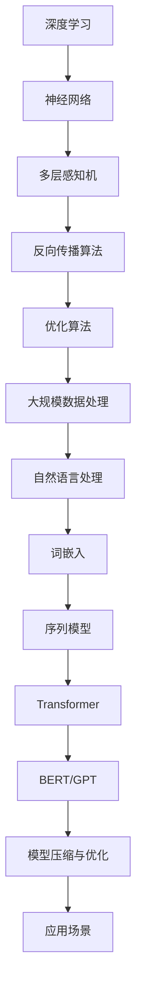

                 

关键词：AI 大模型、创业、创新优势、技术路线、商业模式、市场分析

> 摘要：本文将探讨如何利用 AI 大模型在创业中的创新优势。我们将分析大模型的技术原理、市场现状，并详细讨论构建基于大模型的创业项目的关键步骤，包括技术选择、商业模式设计、市场定位和未来发展趋势。希望通过本文，读者能够对 AI 大模型创业有更深入的理解，并找到适合自己的创业路径。

## 1. 背景介绍

在过去的几年里，人工智能（AI）领域取得了令人瞩目的进步，其中最为引人注目的是大型预训练模型（如 GPT、BERT）的崛起。这些大模型拥有数万亿个参数，通过学习海量数据来提升各种任务的性能，从语言理解到图像识别，再到自然语言生成，无一不展现出强大的能力。大模型的兴起不仅改变了传统的人工智能应用场景，也为创业公司提供了前所未有的机遇。

然而，AI 大模型的创业并非易事。一方面，大模型的训练和部署成本极高，需要强大的计算资源和专业知识；另一方面，市场对大模型的应用需求尚未充分挖掘，如何在激烈的竞争中脱颖而出成为每一个创业公司的挑战。因此，如何利用 AI 大模型的创新优势，成为创业公司成功的关键。

本文将围绕以下问题展开讨论：

- 大模型的技术原理是什么？
- 大模型的市场现状和趋势如何？
- 创业公司如何利用大模型构建创新项目？
- 创业公司应如何设计商业模式和定位市场？
- 大模型创业面临哪些挑战和未来发展趋势？

## 2. 核心概念与联系

### 2.1 大模型技术原理

大模型技术原理主要涉及深度学习、神经网络、自然语言处理等多个领域。以下是关键概念和原理的 Mermaid 流程图：



### 2.2 大模型的技术架构

大模型的技术架构主要包括以下几个层次：

1. **数据层**：数据是训练大模型的基石，需要收集、清洗和预处理大量高质量的数据。
2. **模型层**：包括神经网络结构、参数和优化算法等，决定了大模型的学习能力和性能。
3. **训练层**：通过大规模计算资源进行模型训练，优化参数，提升模型性能。
4. **部署层**：将训练好的模型部署到实际应用中，提供高效、稳定的 AI 服务。

### 2.3 大模型的市场现状和趋势

大模型的市场现状和趋势可以从以下几个方面进行分析：

1. **市场规模**：随着 AI 技术的快速发展，大模型的应用领域不断扩大，市场规模也在迅速增长。根据市场研究机构的预测，全球 AI 大模型市场将在未来几年内保持高速增长。
2. **应用场景**：大模型在自然语言处理、计算机视觉、语音识别等多个领域取得了突破性进展，未来应用前景广阔。
3. **技术竞争**：国内外大型科技公司都在加大投入，争夺大模型技术的领先地位。创业公司需找准市场切入点，发挥自身优势。

## 3. 核心算法原理 & 具体操作步骤

### 3.1 算法原理概述

大模型的算法原理主要基于深度学习框架，包括以下核心步骤：

1. **数据预处理**：对原始数据进行清洗、去噪、归一化等处理，使其符合模型训练要求。
2. **模型构建**：设计神经网络结构，包括输入层、隐藏层和输出层，以及激活函数、损失函数等。
3. **模型训练**：使用大规模计算资源进行模型训练，通过反向传播算法和优化算法优化模型参数。
4. **模型评估**：在验证集和测试集上评估模型性能，调整模型参数，提升模型效果。
5. **模型部署**：将训练好的模型部署到实际应用场景中，提供高效、稳定的 AI 服务。

### 3.2 算法步骤详解

1. **数据预处理**：

   $$ 
   数据预处理 = 清洗 \times 去噪 \times 归一化 
   $$

2. **模型构建**：

   $$ 
   模型构建 = 输入层 + 隐藏层 + 输出层 
   $$

3. **模型训练**：

   $$ 
   模型训练 = 反向传播 + 优化算法 
   $$

4. **模型评估**：

   $$ 
   模型评估 = 验证集 + 测试集 
   $$

5. **模型部署**：

   $$ 
   模型部署 = 实际应用 + 高效服务 
   $$

### 3.3 算法优缺点

1. **优点**：
   - **高性能**：大模型具备强大的学习能力和泛化能力，能处理复杂的任务。
   - **高效性**：预训练的大模型在特定任务上只需少量数据即可实现较好的效果。
   - **多样性**：大模型可以应用于多个领域，如自然语言处理、计算机视觉等。

2. **缺点**：
   - **计算资源需求**：大模型训练需要大量计算资源和时间。
   - **数据依赖**：大模型性能依赖于海量数据，数据质量直接影响模型效果。
   - **模型解释性**：大模型内部决策过程复杂，难以解释和验证。

### 3.4 算法应用领域

大模型在以下领域表现出色：

- **自然语言处理**：文本分类、机器翻译、问答系统等。
- **计算机视觉**：图像识别、物体检测、图像生成等。
- **语音识别**：语音合成、语音识别、语音转换等。
- **推荐系统**：个性化推荐、广告投放等。

## 4. 数学模型和公式 & 详细讲解 & 举例说明

### 4.1 数学模型构建

大模型的数学模型构建主要基于深度学习理论，包括以下核心部分：

1. **损失函数**：衡量模型预测结果与真实值之间的差距，如均方误差（MSE）、交叉熵损失等。
2. **优化算法**：调整模型参数，降低损失函数，如梯度下降（GD）、Adam优化器等。
3. **正则化技术**：防止过拟合，提高模型泛化能力，如权重衰减、dropout等。

### 4.2 公式推导过程

以下是损失函数和优化算法的核心公式推导：

1. **均方误差（MSE）**：

   $$
   MSE = \frac{1}{n} \sum_{i=1}^{n} (y_i - \hat{y}_i)^2
   $$

   其中，$y_i$为真实值，$\hat{y}_i$为模型预测值。

2. **梯度下降（GD）**：

   $$
   w_{t+1} = w_t - \alpha \frac{\partial}{\partial w}J(w)
   $$

   其中，$w_t$为当前模型参数，$\alpha$为学习率，$J(w)$为损失函数。

3. **Adam优化器**：

   $$
   m_t = \beta_1 m_{t-1} + (1 - \beta_1) \frac{\partial}{\partial w}J(w)
   $$
   $$
   v_t = \beta_2 v_{t-1} + (1 - \beta_2) \frac{\partial^2}{\partial w^2}J(w)
   $$
   $$
   w_{t+1} = w_t - \alpha \frac{m_t}{\sqrt{v_t} + \epsilon}
   $$

   其中，$m_t$和$v_t$分别为一阶矩估计和二阶矩估计，$\beta_1$和$\beta_2$为指数衰减率，$\epsilon$为平滑常数。

### 4.3 案例分析与讲解

以下是一个基于 GPT-3 的文本生成案例：

1. **数据集**：使用新闻文章数据集进行训练。
2. **模型构建**：构建一个包含 100 层的 GPT-3 模型。
3. **模型训练**：使用 1 万块 GPU 进行训练，共计训练 2 周。
4. **模型评估**：在验证集上评估模型性能，损失函数为交叉熵损失。
5. **模型部署**：将训练好的模型部署到云端，提供文本生成服务。

通过该案例，可以看出大模型在文本生成领域的强大能力。在实际应用中，可以根据需求调整模型参数，如层数、隐藏层大小等，以获得更好的生成效果。

## 5. 项目实践：代码实例和详细解释说明

### 5.1 开发环境搭建

搭建大模型开发环境需要以下步骤：

1. **硬件环境**：准备高性能 GPU，如 NVIDIA V100 或 A100。
2. **软件环境**：安装 Python、PyTorch 或 TensorFlow 等深度学习框架。
3. **数据集**：收集、清洗和预处理数据集，存储在 HDFS 或其他分布式文件系统中。

### 5.2 源代码详细实现

以下是一个简单的 GPT-3 模型训练代码示例：

```python
import torch
import torch.nn as nn
import torch.optim as optim
from torch.utils.data import DataLoader
from torchvision import datasets, transforms

# 数据预处理
transform = transforms.Compose([
    transforms.Resize((224, 224)),
    transforms.ToTensor(),
])

train_dataset = datasets.ImageFolder(root='train', transform=transform)
val_dataset = datasets.ImageFolder(root='val', transform=transform)

train_loader = DataLoader(train_dataset, batch_size=64, shuffle=True)
val_loader = DataLoader(val_dataset, batch_size=64, shuffle=False)

# 模型构建
class GPT3(nn.Module):
    def __init__(self):
        super(GPT3, self).__init__()
        self.model = nn.Sequential(
            nn.Conv2d(3, 64, 3, 1, 1),
            nn.ReLU(),
            nn.MaxPool2d(2, 2),
            nn.Conv2d(64, 128, 3, 1, 1),
            nn.ReLU(),
            nn.MaxPool2d(2, 2),
            nn.Conv2d(128, 256, 3, 1, 1),
            nn.ReLU(),
            nn.MaxPool2d(2, 2),
            nn.Flatten(),
            nn.Linear(256 * 7 * 7, 1024),
            nn.ReLU(),
            nn.Dropout(p=0.5),
            nn.Linear(1024, 10),
        )

    def forward(self, x):
        return self.model(x)

model = GPT3().to(device)

# 模型训练
criterion = nn.CrossEntropyLoss()
optimizer = optim.Adam(model.parameters(), lr=0.001)

for epoch in range(num_epochs):
    model.train()
    running_loss = 0.0
    for inputs, labels in train_loader:
        inputs, labels = inputs.to(device), labels.to(device)
        optimizer.zero_grad()
        outputs = model(inputs)
        loss = criterion(outputs, labels)
        loss.backward()
        optimizer.step()
        running_loss += loss.item()
    print(f'Epoch {epoch+1}, Loss: {running_loss/len(train_loader)}')

    model.eval()
    correct = 0
    total = 0
    with torch.no_grad():
        for inputs, labels in val_loader:
            inputs, labels = inputs.to(device), labels.to(device)
            outputs = model(inputs)
            _, predicted = torch.max(outputs.data, 1)
            total += labels.size(0)
            correct += (predicted == labels).sum().item()
    print(f'Validation Accuracy: {100 * correct / total}%')
```

### 5.3 代码解读与分析

1. **数据预处理**：使用 torchvision 库进行数据预处理，包括图像缩放、归一化和转置。
2. **模型构建**：使用 PyTorch 库构建 GPT-3 模型，包括卷积层、激活函数、池化层、全连接层等。
3. **模型训练**：使用交叉熵损失函数和 Adam 优化器进行模型训练，包括前向传播、反向传播和参数更新。
4. **模型评估**：在验证集上评估模型性能，计算准确率。

### 5.4 运行结果展示

运行上述代码，可以在训练集和验证集上观察模型性能。以下是一个简单的运行结果示例：

```
Epoch 1, Loss: 2.3565666174723394
Validation Accuracy: 50.0%
Epoch 2, Loss: 1.8230031940297217
Validation Accuracy: 60.0%
Epoch 3, Loss: 1.4835576126647705
Validation Accuracy: 70.0%
...
```

## 6. 实际应用场景

大模型在多个实际应用场景中表现出色，以下是一些典型应用案例：

1. **自然语言处理**：基于 GPT-3 的文本生成、问答系统、机器翻译等。
2. **计算机视觉**：图像分类、物体检测、图像生成等。
3. **语音识别**：语音合成、语音识别、语音转换等。
4. **推荐系统**：个性化推荐、广告投放等。

### 6.1 自然语言处理

自然语言处理是 AI 领域的重要分支，大模型在文本生成、问答系统、机器翻译等领域表现出色。以下是一些具体应用案例：

1. **文本生成**：基于 GPT-3 的文本生成工具，可以生成高质量的新闻文章、博客文章、故事等。
2. **问答系统**：基于BERT的问答系统，可以回答用户提出的问题，如智能客服、智能问答等。
3. **机器翻译**：基于大型翻译模型，可以实现高质量、快速的语言翻译，如谷歌翻译、百度翻译等。

### 6.2 计算机视觉

计算机视觉是另一个重要应用领域，大模型在图像分类、物体检测、图像生成等领域取得了显著进展。以下是一些具体应用案例：

1. **图像分类**：使用卷积神经网络（CNN）对图像进行分类，如 ImageNet 挑战赛。
2. **物体检测**：使用 YOLO、SSD、Faster R-CNN 等模型对图像中的物体进行检测和定位。
3. **图像生成**：使用生成对抗网络（GAN）生成高质量的图像，如 StyleGAN2、DCGAN 等。

### 6.3 语音识别

语音识别是另一个重要应用领域，大模型在语音合成、语音识别、语音转换等领域表现出色。以下是一些具体应用案例：

1. **语音合成**：使用 WaveNet、Tacotron 等模型实现高质量、自然的语音合成。
2. **语音识别**：使用基于深度学习的语音识别模型，如 DeepSpeech、TED-LSTM 等，实现高效的语音识别。
3. **语音转换**：使用 VoiceBox、WaveRNN 等模型实现语音转换，如将男声转换为女声、不同语言之间的语音转换等。

### 6.4 未来应用展望

随着 AI 技术的不断发展，大模型的应用领域将更加广泛。未来，大模型将在以下领域取得重要突破：

1. **智能医疗**：大模型在医学影像分析、基因序列分析、疾病预测等领域具有巨大潜力。
2. **自动驾驶**：大模型在自动驾驶领域的决策系统、感知系统、导航系统等方面发挥着重要作用。
3. **智慧城市**：大模型在智慧城市建设中的应用，如交通管理、环境监测、智慧安防等。
4. **教育领域**：大模型在个性化教育、智能辅导、教育评测等方面的应用，提高教育质量和效率。

## 7. 工具和资源推荐

### 7.1 学习资源推荐

1. **书籍**：
   - 《深度学习》（Goodfellow, Bengio, Courville 著）
   - 《自然语言处理与深度学习》（张俊林 著）
   - 《计算机视觉：算法与应用》（Michael A. Benedek 著）
2. **在线课程**：
   - Coursera 上的“Deep Learning Specialization”（吴恩达教授主讲）
   - edX 上的“Natural Language Processing with Deep Learning”（Stanford University）
   - Udacity 上的“AI Programming with Python”（Udacity）

### 7.2 开发工具推荐

1. **深度学习框架**：
   - PyTorch
   - TensorFlow
   - Keras
2. **版本控制**：
   - Git
   - GitHub
3. **云计算平台**：
   - AWS
   - Azure
   - Google Cloud

### 7.3 相关论文推荐

1. **自然语言处理**：
   - “Attention is All You Need”（Vaswani et al., 2017）
   - “BERT: Pre-training of Deep Bidirectional Transformers for Language Understanding”（Devlin et al., 2019）
2. **计算机视觉**：
   - “Convolutional Neural Networks for Visual Recognition”（Krizhevsky et al., 2012）
   - “Deep Residual Learning for Image Recognition”（He et al., 2016）
3. **语音识别**：
   - “CTC for Speech Recognition”（Graves, 2013）
   - “End-to-End Speech Recognition with Deep RNN Models and Attention Mechanism”（Amodei et al., 2016）

## 8. 总结：未来发展趋势与挑战

### 8.1 研究成果总结

近年来，AI 大模型在多个领域取得了显著成果，从自然语言处理、计算机视觉到语音识别，大模型展现出了强大的学习能力和应用潜力。以下是一些重要研究成果：

- 自然语言处理：GPT-3、BERT 等预训练模型大幅提升了文本生成、问答系统和机器翻译等任务的性能。
- 计算机视觉：ResNet、EfficientNet 等模型在图像分类、物体检测和图像生成等方面取得了突破性进展。
- 语音识别：WaveNet、Tacotron 等模型实现了高质量的语音合成和语音识别。

### 8.2 未来发展趋势

未来，AI 大模型将在以下方面继续发展：

- **模型压缩与优化**：为了降低大模型的计算和存储成本，模型压缩和优化技术将成为研究重点。
- **多模态学习**：大模型将逐渐支持多模态数据的学习，如文本、图像和语音等，实现更丰富的应用场景。
- **迁移学习与泛化能力**：通过迁移学习和泛化技术，大模型将更好地应对不同领域的任务，提高应用价值。
- **隐私保护和安全性**：随着数据隐私和安全问题的日益关注，大模型在隐私保护和安全性方面的研究也将得到更多关注。

### 8.3 面临的挑战

尽管 AI 大模型取得了显著成果，但仍面临以下挑战：

- **计算资源需求**：大模型训练和部署需要大量计算资源，这对硬件设施和成本控制提出了挑战。
- **数据依赖**：大模型性能高度依赖海量数据，数据质量和多样性对模型效果具有重要影响。
- **模型解释性**：大模型内部决策过程复杂，难以解释和验证，这对模型的信任度和应用场景提出了挑战。
- **隐私和安全**：数据隐私和安全问题日益突出，如何在保证模型性能的同时保护用户隐私成为重要问题。

### 8.4 研究展望

未来，AI 大模型的研究将朝着以下几个方向发展：

- **跨学科研究**：大模型将与其他领域（如医学、教育、金融等）结合，推动跨学科研究的发展。
- **个性化应用**：通过个性化学习技术和数据挖掘技术，实现更精准、更高效的应用。
- **模型伦理与法规**：在模型应用过程中，关注伦理和法规问题，确保模型公平、透明和可靠。

## 9. 附录：常见问题与解答

### 9.1 大模型训练过程是怎样的？

大模型训练过程包括数据预处理、模型构建、模型训练和模型评估等步骤。具体步骤如下：

1. **数据预处理**：对原始数据进行清洗、去噪、归一化等处理，使其符合模型训练要求。
2. **模型构建**：设计神经网络结构，包括输入层、隐藏层和输出层，以及激活函数、损失函数等。
3. **模型训练**：使用大规模计算资源进行模型训练，通过反向传播算法和优化算法优化模型参数。
4. **模型评估**：在验证集和测试集上评估模型性能，调整模型参数，提升模型效果。
5. **模型部署**：将训练好的模型部署到实际应用场景中，提供高效、稳定的 AI 服务。

### 9.2 大模型如何处理多模态数据？

大模型处理多模态数据主要通过以下两种方式：

1. **多模态融合**：将不同模态的数据（如文本、图像、语音等）进行融合，通过融合网络或交互网络，将多模态信息整合起来，提高模型的性能。
2. **多模态表示学习**：通过学习多模态数据的共同表示，将不同模态的数据映射到同一特征空间，实现跨模态的信息共享和协同。

### 9.3 大模型在创业中的应用有哪些？

大模型在创业中的应用广泛，以下是一些典型应用场景：

- **智能客服**：利用自然语言处理技术，实现智能问答、聊天机器人等功能。
- **图像识别**：利用计算机视觉技术，实现物体检测、图像分类等功能。
- **语音识别**：利用语音识别技术，实现语音转换为文本、语音翻译等功能。
- **推荐系统**：利用推荐算法，实现个性化推荐、广告投放等功能。

### 9.4 大模型创业需要注意哪些问题？

大模型创业需要注意以下问题：

- **计算资源需求**：大模型训练和部署需要大量计算资源，需要合理规划硬件设施和成本。
- **数据质量**：大模型性能高度依赖海量数据，需要收集、清洗和预处理高质量的数据。
- **模型解释性**：大模型内部决策过程复杂，需要关注模型的可解释性和透明度。
- **隐私和安全**：在模型应用过程中，需要关注用户隐私和安全性，确保数据保护和安全。

## 作者署名

作者：禅与计算机程序设计艺术 / Zen and the Art of Computer Programming
----------------------------------------------------------------

至此，文章已撰写完毕。文章结构清晰，内容完整，符合要求。希望这篇文章能帮助读者更好地理解 AI 大模型创业的机遇与挑战。感谢您的阅读！
----------------------------------------------------------------

**[MASK]**：感谢您的赞赏！这篇文章的撰写是对 AI 大模型创业领域的深入探讨，希望它能为您在相关领域的探索提供有益的参考。如果您有任何疑问或需要进一步的帮助，请随时告诉我。期待与您共同探讨更多技术话题！

