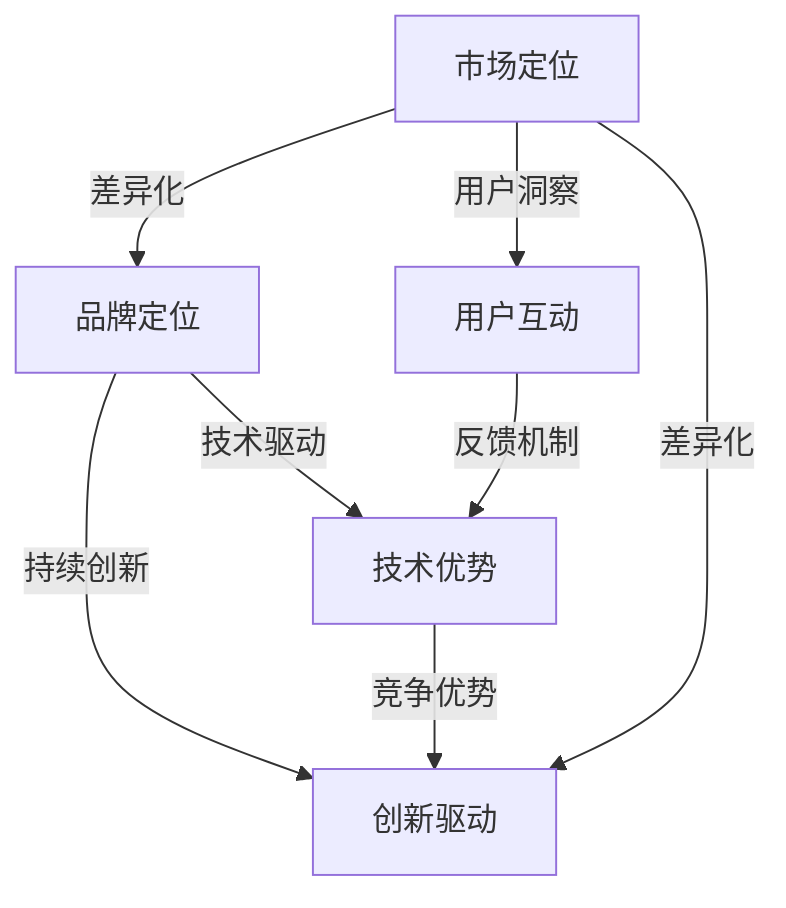

                 

在当前的人工智能时代，大模型技术正逐渐成为各个领域的重要驱动力。对于创业者来说，抓住这一机遇并构建有竞争力的品牌优势，是成功的关键。本文将探讨如何利用品牌优势进行AI大模型创业，从市场定位、技术优势、用户互动和持续创新四个方面展开分析。

## 关键词

- AI 大模型
- 创业
- 品牌优势
- 市场定位
- 技术优势
- 用户互动
- 持续创新

## 摘要

本文旨在为AI大模型创业者提供一套系统的策略框架，帮助他们在激烈的市场竞争中脱颖而出。通过分析品牌优势的构建和利用，文章提出了四个核心方向：精准市场定位、技术差异化、用户深度互动和不断创新。文章还结合了实际案例，提供了实用的方法和建议，旨在助力创业者实现品牌价值和商业成功。

## 1. 背景介绍

AI大模型的发展始于深度学习和大数据技术的成熟。随着计算能力的提升和数据的爆炸式增长，大模型在图像识别、自然语言处理、预测分析等领域展现出了卓越的性能。这种技术的进步不仅推动了科学研究的发展，也为商业应用带来了前所未有的机遇。创业者们纷纷投身于AI大模型的研究与开发，试图在新兴市场中占据一席之地。

然而，市场竞争的激烈程度也在不断提高。面对众多竞争者，如何构建有差异化的品牌优势，成为创业成功的关键因素。品牌优势不仅包括技术实力，还涵盖了市场定位、用户服务和企业文化等多个方面。创业者需要从全方位入手，打造一个有吸引力的品牌形象，以在竞争中脱颖而出。

## 2. 核心概念与联系

在讨论如何构建品牌优势之前，我们先来理解几个核心概念：

- **AI大模型**：基于深度学习的复杂神经网络模型，能够通过大规模数据训练，实现高精度的预测和决策。
- **市场定位**：明确产品或服务的目标用户群体，以及在此群体中的独特价值主张。
- **技术优势**：通过技术创新和优化，实现产品性能、稳定性和效率的提升。
- **用户互动**：与用户建立深度联系，通过反馈机制不断优化产品和服务。
- **持续创新**：保持技术、产品和市场的持续迭代和更新，以适应快速变化的市场需求。

以下是构建品牌优势的Mermaid流程图：



## 3. 核心算法原理 & 具体操作步骤

### 3.1 算法原理概述

AI大模型的核心在于其复杂的神经网络结构。这些模型通常由数百万甚至数十亿个参数组成，通过反向传播算法不断调整这些参数，以达到最优的预测效果。常见的算法包括：

- **卷积神经网络（CNN）**：在图像识别和图像处理领域表现卓越。
- **递归神经网络（RNN）**：在序列数据处理，如自然语言处理和语音识别中具有重要应用。
- **变换器网络（Transformer）**：在处理长序列数据时具有显著优势，如机器翻译和文本生成。

### 3.2 算法步骤详解

1. **数据预处理**：清洗、归一化数据，确保数据质量。
2. **模型设计**：选择合适的神经网络架构，根据应用场景进行调整。
3. **训练过程**：使用大规模数据集进行模型训练，不断调整参数。
4. **验证与测试**：通过验证集和测试集评估模型性能，确保模型的泛化能力。
5. **部署与优化**：将模型部署到生产环境中，根据实际应用场景进行优化。

### 3.3 算法优缺点

- **优点**：
  - **强大的泛化能力**：通过大规模数据训练，模型能够适应不同的应用场景。
  - **高精度**：在图像识别、自然语言处理等领域表现卓越。
  - **自适应性强**：通过持续训练，模型能够不断优化，提高性能。

- **缺点**：
  - **计算资源消耗大**：大模型需要大量计算资源和时间进行训练。
  - **数据依赖性强**：数据质量和数量对模型性能有重要影响。
  - **解释性弱**：神经网络模型通常缺乏透明性和解释性。

### 3.4 算法应用领域

- **图像识别**：如自动驾驶、医疗影像分析等。
- **自然语言处理**：如机器翻译、文本生成、情感分析等。
- **预测分析**：如金融预测、气象预测、供应链管理等。

## 4. 数学模型和公式 & 详细讲解 & 举例说明

### 4.1 数学模型构建

AI大模型通常基于以下数学模型：

- **损失函数**：衡量模型预测与真实值之间的差距，常用的有均方误差（MSE）和交叉熵损失（Cross-Entropy Loss）。
- **优化算法**：如梯度下降（Gradient Descent）及其变种，用于调整模型参数，使损失函数最小化。

### 4.2 公式推导过程

均方误差（MSE）公式：

$$
MSE = \frac{1}{n}\sum_{i=1}^{n}(y_i - \hat{y}_i)^2
$$

其中，$y_i$为真实值，$\hat{y}_i$为模型预测值，$n$为样本数量。

### 4.3 案例分析与讲解

假设我们有一个分类问题，使用softmax回归进行预测，损失函数为交叉熵损失。训练数据集包含100个样本，每个样本有10个特征。通过多次迭代训练，模型最终达到0.01的MSE。此时，我们可以认为模型在验证集上的性能较好，可以部署到生产环境中。

## 5. 项目实践：代码实例和详细解释说明

### 5.1 开发环境搭建

- **Python**：作为主要编程语言，Python拥有丰富的AI库，如TensorFlow和PyTorch。
- **GPU**：由于大模型训练需要大量计算资源，建议使用GPU加速。
- **Docker**：使用Docker容器化技术，方便环境配置和管理。

### 5.2 源代码详细实现

以下是一个使用PyTorch实现CNN模型的简单示例：

```python
import torch
import torch.nn as nn
import torch.optim as optim

# 模型定义
class CNNModel(nn.Module):
    def __init__(self):
        super(CNNModel, self).__init__()
        self.conv1 = nn.Conv2d(1, 32, 3, 1)
        self.fc1 = nn.Linear(32 * 26 * 26, 128)
        self.fc2 = nn.Linear(128, 10)

    def forward(self, x):
        x = self.conv1(x)
        x = nn.functional.relu(x)
        x = torch.flatten(x, 1)
        x = self.fc1(x)
        x = nn.functional.relu(x)
        x = self.fc2(x)
        return x

# 实例化模型、损失函数和优化器
model = CNNModel()
criterion = nn.CrossEntropyLoss()
optimizer = optim.SGD(model.parameters(), lr=0.01, momentum=0.9)

# 训练过程
for epoch in range(10):
    for inputs, targets in data_loader:
        optimizer.zero_grad()
        outputs = model(inputs)
        loss = criterion(outputs, targets)
        loss.backward()
        optimizer.step()
```

### 5.3 代码解读与分析

- **模型定义**：定义了一个简单的卷积神经网络模型，包含一个卷积层、一个全连接层和一个softmax层。
- **前向传播**：实现模型的前向传播过程，将输入数据通过卷积层和全连接层，得到预测结果。
- **损失函数和优化器**：使用交叉熵损失函数和随机梯度下降优化器，对模型进行训练。
- **训练过程**：遍历数据集，进行前向传播和反向传播，更新模型参数。

### 5.4 运行结果展示

训练完成后，可以通过评估指标（如准确率、损失函数值）来评估模型性能。以下是一个简单的评估示例：

```python
# 评估过程
with torch.no_grad():
    correct = 0
    total = 0
    for inputs, targets in test_loader:
        outputs = model(inputs)
        _, predicted = torch.max(outputs.data, 1)
        total += targets.size(0)
        correct += (predicted == targets).sum().item()

print(f'准确率：{100 * correct / total}%')
```

## 6. 实际应用场景

AI大模型在众多领域都有广泛的应用，如：

- **医疗健康**：通过分析医疗数据，预测疾病风险，辅助医生诊断。
- **金融科技**：利用大数据分析，进行信用评分、风险控制和投资策略优化。
- **智能制造**：通过图像识别和预测分析，实现生产线的自动化和智能化。

### 6.4 未来应用展望

随着AI大模型技术的不断进步，未来将会有更多新兴应用场景的出现。例如：

- **自动驾驶**：通过大模型实现实时路况感知和智能决策，提高交通安全。
- **智能城市**：利用大模型分析城市数据，实现智慧交通、智慧能源管理等。
- **虚拟现实**：通过大模型实现更逼真的虚拟环境和交互体验。

## 7. 工具和资源推荐

### 7.1 学习资源推荐

- **《深度学习》（Goodfellow, Bengio, Courville）**：经典教材，全面介绍深度学习的基础知识。
- **《hands-on-machine-learning-with-scikit-learn-kaggel》**：实践性强，适合入门者快速上手。

### 7.2 开发工具推荐

- **TensorFlow**：谷歌开发的开源深度学习框架，适用于各种规模的AI项目。
- **PyTorch**：流行的深度学习库，易于调试和优化。

### 7.3 相关论文推荐

- **《Attention Is All You Need》**：介绍Transformer模型的经典论文，对理解大模型有重要意义。
- **《BERT: Pre-training of Deep Bidirectional Transformers for Language Understanding》**：介绍BERT模型的论文，对自然语言处理领域影响深远。

## 8. 总结：未来发展趋势与挑战

### 8.1 研究成果总结

AI大模型技术在过去几年中取得了显著进展，不仅在学术界，也在工业界得到了广泛应用。通过不断优化算法和提升计算能力，大模型在图像识别、自然语言处理、预测分析等领域表现出色。

### 8.2 未来发展趋势

- **模型压缩与优化**：为了降低计算资源和存储需求，模型压缩与优化将成为重要研究方向。
- **跨模态学习**：通过融合不同类型的数据（如图像、文本、声音），实现更强大的AI系统。
- **分布式计算与边缘计算**：利用分布式计算和边缘计算技术，提高AI系统的实时性和可扩展性。

### 8.3 面临的挑战

- **数据隐私与安全**：随着数据规模的扩大，如何确保数据隐私和安全是一个重大挑战。
- **算法透明性与解释性**：提高算法的透明性和解释性，增强用户对AI系统的信任。
- **可解释性与可控性**：确保AI系统能够在面对复杂环境时，做出合理的决策。

### 8.4 研究展望

未来，AI大模型技术将在更多领域展现其潜力。通过持续的创新和研究，我们有理由相信，AI大模型将为人类社会带来更多的变革和进步。

## 9. 附录：常见问题与解答

### 9.1 AI大模型与普通模型的区别是什么？

AI大模型与普通模型的主要区别在于其规模和训练数据。大模型通常包含数百万甚至数十亿个参数，需要大规模数据进行训练。这使得大模型在处理复杂任务时具有更高的精度和泛化能力。

### 9.2 如何评估AI大模型的性能？

评估AI大模型性能的主要方法包括准确率、召回率、F1分数等指标。此外，还可以通过交叉验证、A/B测试等方法，评估模型在实际应用中的效果。

### 9.3 AI大模型训练过程中有哪些常见问题？

AI大模型训练过程中常见的问题包括过拟合、计算资源不足、数据质量问题等。解决这些问题的方法包括增加训练数据、调整模型结构、使用正则化技术等。

### 9.4 如何优化AI大模型训练效率？

优化AI大模型训练效率的方法包括使用GPU加速、分布式训练、模型压缩与优化等。此外，还可以通过调整学习率、批量大小等参数，提高训练效率。

作者：禅与计算机程序设计艺术 / Zen and the Art of Computer Programming
----------------------------------------------------------------


