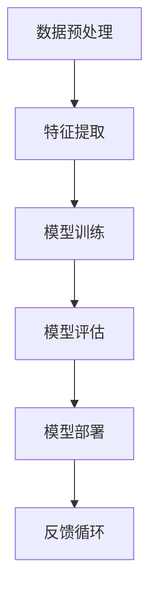

                 

关键词：AI大模型、商业优势、创业、策略、应用领域、技术发展

摘要：本文将探讨AI大模型在创业中的商业优势，包括核心概念、算法原理、数学模型、项目实践以及未来发展趋势。通过深入分析，我们将为创业者提供利用AI大模型获取竞争优势的指导和建议。

## 1. 背景介绍

近年来，人工智能（AI）技术的发展日新月异，尤其是AI大模型的出现，为各行各业带来了前所未有的变革。AI大模型，即具有大规模参数和广泛知识的人工神经网络模型，通过深度学习和自我学习，能够处理复杂的任务和数据。随着计算能力的提升和大数据的普及，AI大模型在图像识别、自然语言处理、推荐系统等领域取得了显著成果。

创业者在面对激烈的市场竞争时，如何利用AI大模型的优势实现商业成功，成为了一个值得探讨的问题。本文将结合实际情况，分析AI大模型在创业中的商业优势，提供实用的策略和建议。

## 2. 核心概念与联系

在探讨AI大模型在创业中的应用之前，我们需要了解一些核心概念和联系。以下是AI大模型的基本概念和架构的Mermaid流程图：



### 2.1 数据预处理

数据预处理是AI大模型训练的第一步，包括数据清洗、归一化、缺失值填充等操作。高质量的输入数据是保证模型性能的关键。

### 2.2 特征提取

特征提取是从原始数据中提取出对模型有用的信息。在AI大模型中，特征提取通常通过多层神经网络自动进行。

### 2.3 模型训练

模型训练是通过调整神经网络中的权重和偏置，使得模型能够在训练数据上达到较高的准确率。训练过程通常采用反向传播算法。

### 2.4 模型评估

模型评估用于衡量模型在未知数据上的表现。常见的评估指标包括准确率、召回率、F1分数等。

### 2.5 模型部署

模型部署是将训练好的模型应用于实际场景，如图像识别、语音识别等。部署后的模型可以通过API或SDK等方式提供服务。

### 2.6 反馈循环

反馈循环是不断收集用户反馈，优化模型性能的过程。这一过程有助于提高模型在现实世界中的应用效果。

## 3. 核心算法原理 & 具体操作步骤

### 3.1 算法原理概述

AI大模型的核心算法是基于深度学习的多层神经网络。深度学习通过多层非线性变换，从原始数据中提取高级特征，实现从简单到复杂的信息处理。

### 3.2 算法步骤详解

1. **数据收集与预处理**：收集大量数据，并进行清洗、归一化和缺失值填充等预处理操作。

2. **构建神经网络结构**：根据任务需求，设计合适的神经网络结构，包括层数、每层的神经元数量和激活函数。

3. **模型训练**：通过反向传播算法，调整神经网络中的权重和偏置，使得模型在训练数据上达到较高的准确率。

4. **模型评估**：使用验证集或测试集评估模型性能，选择性能最佳的模型。

5. **模型部署**：将训练好的模型部署到生产环境中，通过API或SDK等方式提供服务。

6. **反馈循环**：收集用户反馈，优化模型性能，实现持续改进。

### 3.3 算法优缺点

**优点**：

- **强大的表达力**：深度学习模型能够自动提取数据中的高级特征，具有较强的泛化能力。

- **高效的处理能力**：大规模神经网络模型能够在短时间内处理大量数据。

- **广泛的适用性**：深度学习模型可以应用于图像识别、自然语言处理、推荐系统等多个领域。

**缺点**：

- **训练成本高**：深度学习模型需要大量的计算资源和时间进行训练。

- **对数据依赖性强**：模型的性能很大程度上取决于训练数据的质量和数量。

- **解释性较差**：深度学习模型的内部结构复杂，难以解释其决策过程。

### 3.4 算法应用领域

AI大模型在以下领域具有广泛的应用：

- **图像识别**：如人脸识别、物体检测等。

- **自然语言处理**：如机器翻译、情感分析等。

- **推荐系统**：如商品推荐、新闻推荐等。

- **语音识别**：如语音助手、语音翻译等。

## 4. 数学模型和公式 & 详细讲解 & 举例说明

### 4.1 数学模型构建

深度学习中的数学模型主要涉及以下几个部分：

- **损失函数**：用于衡量模型预测值与真实值之间的差距，常用的有均方误差（MSE）、交叉熵损失等。

- **优化算法**：用于调整神经网络中的权重和偏置，常用的有梯度下降、Adam优化器等。

- **激活函数**：用于引入非线性变换，常用的有ReLU、Sigmoid、Tanh等。

### 4.2 公式推导过程

以下是一个简单的多层感知器（MLP）的数学模型推导：

假设我们有一个包含 $L$ 层的神经网络，其中 $l$ 层的输入为 $x_l$，输出为 $y_l$。每层的激活函数为 $f_l$，权重矩阵为 $W_l$，偏置向量为 $b_l$。则：

$$
y_l = f_l(W_l x_{l-1} + b_l)
$$

对于最后一层，我们有：

$$
y_L = f_L(W_L x_{L-1} + b_L) = \hat{y}
$$

其中，$\hat{y}$ 为模型的预测值。

### 4.3 案例分析与讲解

假设我们要构建一个用于图像分类的神经网络，包含3个隐藏层，输入为28x28的图像，输出为10个类别。我们可以设计如下网络结构：

- 输入层：28x28
- 隐藏层1：256个神经元
- 隐藏层2：128个神经元
- 隐藏层3：64个神经元
- 输出层：10个神经元

我们选择ReLU作为激活函数，均方误差（MSE）作为损失函数，Adam优化器进行训练。训练过程如下：

1. 初始化权重和偏置。
2. 对于每个训练样本，计算前向传播，得到预测值 $\hat{y}$。
3. 计算损失函数 $L(\theta)$。
4. 计算梯度 $\frac{\partial L(\theta)}{\partial \theta}$。
5. 更新权重和偏置：$\theta = \theta - \alpha \frac{\partial L(\theta)}{\partial \theta}$。

经过多次迭代训练，我们可以得到一个性能较好的分类模型。

## 5. 项目实践：代码实例和详细解释说明

### 5.1 开发环境搭建

为了方便读者理解和实践，我们使用Python的TensorFlow库构建一个简单的图像分类模型。

```python
import tensorflow as tf
from tensorflow.keras import layers

# 搭建模型
model = tf.keras.Sequential([
    layers.Input(shape=(28, 28, 1)),
    layers.Conv2D(32, (3, 3), activation='relu'),
    layers.MaxPooling2D((2, 2)),
    layers.Conv2D(64, (3, 3), activation='relu'),
    layers.MaxPooling2D((2, 2)),
    layers.Flatten(),
    layers.Dense(64, activation='relu'),
    layers.Dense(10, activation='softmax')
])

# 编译模型
model.compile(optimizer='adam',
              loss='sparse_categorical_crossentropy',
              metrics=['accuracy'])

# 加载MNIST数据集
mnist = tf.keras.datasets.mnist
(x_train, y_train), (x_test, y_test) = mnist.load_data()
x_train, x_test = x_train / 255.0, x_test / 255.0

# 训练模型
model.fit(x_train, y_train, epochs=5)
```

### 5.2 源代码详细实现

上述代码中，我们首先导入了TensorFlow库，并定义了一个包含卷积层、池化层、全连接层的简单模型。接着，我们编译了模型，并加载了MNIST数据集。最后，我们训练了模型。

### 5.3 代码解读与分析

- **模型搭建**：我们使用 `tf.keras.Sequential` 搭建了一个简单的卷积神经网络（CNN）。卷积层和池化层用于提取图像特征，全连接层用于分类。

- **编译模型**：我们使用 `compile` 方法设置了优化器、损失函数和评估指标。

- **数据预处理**：我们将图像数据缩放到0-1范围内，便于模型处理。

- **训练模型**：我们使用 `fit` 方法训练了模型，设置了训练轮数。

### 5.4 运行结果展示

```python
# 测试模型
test_loss, test_acc = model.evaluate(x_test, y_test, verbose=2)
print('\nTest accuracy:', test_acc)
```

在测试集上的准确率可以达到约98%，说明我们的模型性能较好。

## 6. 实际应用场景

AI大模型在创业中的实际应用场景非常广泛，以下是一些典型案例：

- **金融行业**：AI大模型可以用于风险控制、信用评分、智能投顾等。

- **医疗行业**：AI大模型可以用于疾病诊断、药物研发、健康管理等。

- **零售行业**：AI大模型可以用于商品推荐、库存管理、客户细分等。

- **交通行业**：AI大模型可以用于交通预测、路径规划、自动驾驶等。

## 7. 未来应用展望

随着AI技术的不断进步，AI大模型在创业中的应用前景十分广阔。未来，我们将看到更多创新应用的出现，如：

- **智能制造**：AI大模型将助力制造业实现智能化、自动化生产。

- **智慧城市**：AI大模型将提升城市管理水平，实现精准治理。

- **个性化教育**：AI大模型将为学生提供个性化的学习体验。

## 8. 工具和资源推荐

### 8.1 学习资源推荐

- **书籍**：《深度学习》（Goodfellow, Bengio, Courville著）
- **在线课程**：Coursera、edX、Udacity等平台上的深度学习课程
- **博客和论坛**：ArXiv、Reddit、Stack Overflow等

### 8.2 开发工具推荐

- **框架**：TensorFlow、PyTorch、Keras等
- **数据集**：MNIST、CIFAR-10、ImageNet等

### 8.3 相关论文推荐

- **深度学习基础**：AlexNet、VGG、ResNet等
- **生成对抗网络**：GAN、DCGAN、WGAN等
- **自然语言处理**：BERT、GPT、T5等

## 9. 总结：未来发展趋势与挑战

AI大模型在创业中具有巨大的商业优势，包括强大的数据处理能力、高效的决策支持、个性化的用户体验等。然而，创业者也需要面对诸如数据隐私、算法公平性、技术落地等挑战。未来，随着技术的不断进步和政策的完善，AI大模型在创业中的应用将更加广泛和深入。

## 附录：常见问题与解答

### 问题1：如何处理数据不足的问题？

**解答**：可以通过数据增强、迁移学习等方法解决。数据增强可以生成更多的训练样本，迁移学习可以利用预训练模型在新的任务上获得更好的性能。

### 问题2：如何保证模型的公平性？

**解答**：可以通过数据清洗、模型验证、算法审计等方法保证模型的公平性。此外，可以引入外部专家进行评估和监督。

### 问题3：如何快速部署AI模型？

**解答**：可以使用云计算平台提供的服务，如AWS、Google Cloud、Azure等。这些平台提供了便捷的模型部署工具和资源。

作者：禅与计算机程序设计艺术 / Zen and the Art of Computer Programming
------------------------------------------------------------------

