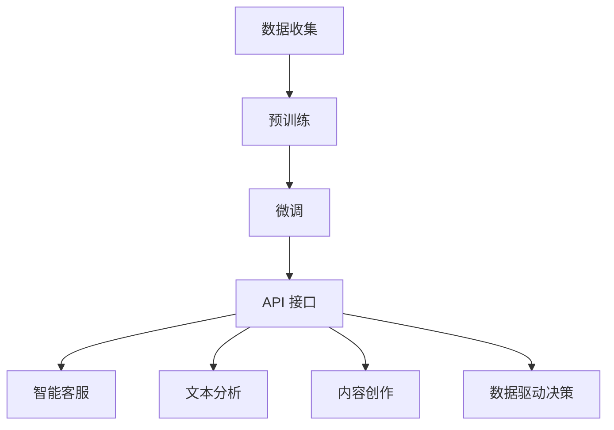

                 

关键词：人工智能、大模型、创业、商业优势、商业模式、技术应用、市场需求、投资策略、风险评估

## 摘要

本文旨在探讨人工智能（AI）大模型在创业领域的应用和商业优势。随着计算能力和数据资源的提升，大模型在各个行业中的潜力日益显现。文章首先介绍AI大模型的基础概念和技术原理，然后分析其商业价值，探讨如何利用这些优势开展创业活动。通过具体的案例和策略分析，本文为创业者提供了一套实用的指导框架，以帮助他们在竞争激烈的市场中脱颖而出。

## 1. 背景介绍

人工智能作为当今科技发展的热点，已经深刻改变了各行各业。尤其是大模型（Large-scale Models），如GPT-3、BERT等，凭借其强大的文本生成、理解、翻译和推理能力，吸引了众多企业和研究机构的关注。大模型的崛起不仅推动了自然语言处理（NLP）的进步，也带来了新的商业模式和创新机会。

在创业领域，人工智能大模型的应用前景广阔。首先，它们能够帮助企业实现智能化运营，提升效率和降低成本。其次，大模型在数据分析和决策支持方面具有独特优势，可以为创业者提供精准的市场洞察和战略规划。此外，大模型的商业化潜力巨大，可以通过定制化服务、API接口等方式，为各种场景提供解决方案。

然而，AI大模型的创业之路并非一帆风顺。创业者需要面对技术门槛、数据隐私、法律法规等多重挑战。本文将围绕这些挑战，探讨如何充分利用大模型的商业优势，实现创业成功。

## 2. 核心概念与联系

### 2.1 大模型技术原理

大模型是基于深度学习的自然语言处理模型，其核心在于通过大量数据的学习，实现对语言的高层次理解和生成。典型的技术架构包括：

- **预训练**：使用大规模无标注数据（如维基百科、互联网文本等）进行预训练，使模型具备通用的语言理解能力。
- **微调**：在预训练的基础上，使用行业或领域特定数据对模型进行微调，提高其在特定任务上的性能。
- **API 接口**：通过API接口，开发者可以将大模型集成到各种应用中，实现快速部署和便捷使用。

### 2.2 大模型与商业应用

大模型在商业应用中的价值主要体现在以下几个方面：

- **智能客服**：利用大模型构建的智能客服系统能够提供24/7的客户服务，提升客户满意度和运营效率。
- **文本分析**：通过对大量文本数据进行分析，大模型可以帮助企业挖掘用户需求、市场趋势和竞争对手动态。
- **内容创作**：大模型可以生成高质量的文章、报告和广告文案，提高内容创作的效率和效果。
- **数据驱动的决策**：大模型在数据分析、预测和决策支持方面的能力，为企业提供更加精准的商业洞见。

### 2.3 Mermaid 流程图

以下是一个简化的Mermaid流程图，展示了大模型的技术架构和应用流程：



## 3. 核心算法原理 & 具体操作步骤

### 3.1 算法原理概述

大模型的算法原理基于深度学习和神经网络。以下是几个关键步骤：

- **卷积神经网络（CNN）**：用于文本的局部特征提取。
- **递归神经网络（RNN）**：用于处理序列数据，如文本。
- **Transformer 架构**：用于大规模并行训练和高性能计算。

### 3.2 算法步骤详解

1. **数据预处理**：清洗和标注数据，将文本转换为模型可处理的格式。
2. **预训练**：使用无标注数据进行大规模预训练，如使用BERT模型预训练。
3. **微调**：在预训练的基础上，使用行业或领域特定数据进行微调。
4. **模型评估**：使用验证集对模型进行评估，调整参数以达到最佳性能。
5. **部署与API接口**：将训练好的模型部署到服务器，并通过API接口提供服务。

### 3.3 算法优缺点

**优点**：

- **强大的语言理解能力**：大模型能够处理复杂的语言任务，如文本生成、理解和翻译。
- **高效率**：使用并行计算和分布式训练，提高训练效率。
- **泛化能力强**：预训练使模型能够适应多种任务和领域。

**缺点**：

- **计算资源需求大**：大模型训练需要大量的计算资源和时间。
- **数据隐私问题**：训练数据可能涉及用户隐私，需注意数据安全和隐私保护。
- **模型解释性差**：深度学习模型往往缺乏透明性和解释性。

### 3.4 算法应用领域

- **自然语言处理（NLP）**：文本生成、文本分类、机器翻译等。
- **金融**：风险预测、欺诈检测、投资分析等。
- **医疗**：疾病预测、患者诊断、药物研发等。
- **电商**：推荐系统、价格预测、用户行为分析等。

## 4. 数学模型和公式 & 详细讲解 & 举例说明

### 4.1 数学模型构建

大模型的数学基础主要包括：

- **线性代数**：用于矩阵运算和向量处理。
- **微积分**：用于优化算法和损失函数设计。
- **概率论和统计学**：用于模型评估和不确定性分析。

### 4.2 公式推导过程

以BERT模型为例，其训练过程中涉及的关键公式包括：

- **损失函数**：$$ L = -\sum_{i} \log(p(y_i | x_i)) $$
- **梯度下降**：$$ \theta_{t+1} = \theta_t - \alpha \cdot \nabla_\theta L(\theta_t) $$
- **注意力机制**：$$ \alpha_{ij} = \frac{\exp(e_{ij})}{\sum_{k=1}^K \exp(e_{ik})} $$

### 4.3 案例分析与讲解

以下是一个文本分类任务的案例：

- **数据集**：包含政治、经济、体育等类别的新闻文章。
- **目标**：将文章分类到相应的类别。

1. **数据预处理**：将文本转换为词向量，并构建词汇表。
2. **模型训练**：使用BERT模型对数据进行预训练和微调。
3. **模型评估**：在验证集上评估模型性能，调整参数。
4. **部署与应用**：将训练好的模型部署到服务器，通过API接口提供分类服务。

## 5. 项目实践：代码实例和详细解释说明

### 5.1 开发环境搭建

- **硬件**：GPU（如NVIDIA 1080Ti或更高）。
- **软件**：Python（3.7或更高版本）、TensorFlow或PyTorch。

### 5.2 源代码详细实现

以下是一个使用BERT模型进行文本分类的示例代码：

```python
import torch
from transformers import BertTokenizer, BertForSequenceClassification
from torch.utils.data import DataLoader
from sklearn.model_selection import train_test_split

# 加载预训练模型和词汇表
tokenizer = BertTokenizer.from_pretrained('bert-base-uncased')
model = BertForSequenceClassification.from_pretrained('bert-base-uncased')

# 数据预处理
def preprocess_data(texts, labels):
    input_ids = []
    attention_masks = []
    for text in texts:
        encoded_dict = tokenizer.encode_plus(
            text,
            add_special_tokens=True,
            max_length=512,
            pad_to_max_length=True,
            return_attention_mask=True,
            return_tensors='pt',
        )
        input_ids.append(encoded_dict['input_ids'])
        attention_masks.append(encoded_dict['attention_mask'])
    labels = torch.tensor(labels)
    return input_ids, attention_masks, labels

# 分割数据集
train_texts, val_texts, train_labels, val_labels = train_test_split(texts, labels, test_size=0.2)

# 加载数据
train_input_ids, train_attention_masks, train_labels = preprocess_data(train_texts, train_labels)
val_input_ids, val_attention_masks, val_labels = preprocess_data(val_texts, val_labels)

train_dataset = torch.utils.data.TensorDataset(train_input_ids, train_attention_masks, train_labels)
val_dataset = torch.utils.data.TensorDataset(val_input_ids, val_attention_masks, val_labels)

# 训练模型
model.train()
optimizer = torch.optim.AdamW(model.parameters(), lr=1e-5)
for epoch in range(3):
    for batch in DataLoader(train_dataset, batch_size=32):
        inputs = {'input_ids': batch[0], 'attention_mask': batch[1], 'labels': batch[2]}
        outputs = model(**inputs)
        loss = outputs.loss
        loss.backward()
        optimizer.step()
        optimizer.zero_grad()
    print(f'Epoch {epoch+1}/{3} - Loss: {loss.item()}')

# 评估模型
model.eval()
with torch.no_grad():
    for batch in DataLoader(val_dataset, batch_size=32):
        inputs = {'input_ids': batch[0], 'attention_mask': batch[1], 'labels': batch[2]}
        outputs = model(**inputs)
        logits = outputs.logits
        predictions = torch.argmax(logits, dim=1)
        accuracy = (predictions == val_labels).float().mean()
        print(f'Validation Accuracy: {accuracy.item()}')

# 部署API接口
app = Flask(__name__)

@app.route('/classify', methods=['POST'])
def classify():
    data = request.get_json()
    text = data['text']
    inputs = tokenizer.encode_plus(
        text,
        add_special_tokens=True,
        max_length=512,
        pad_to_max_length=True,
        return_attention_mask=True,
        return_tensors='pt',
    )
    model.eval()
    with torch.no_grad():
        outputs = model(**inputs)
    logits = outputs.logits
    prediction = torch.argmax(logits, dim=1).item()
    return jsonify({'prediction': prediction})

if __name__ == '__main__':
    model.to('cuda' if torch.cuda.is_available() else 'cpu')
    app.run(debug=True)
```

### 5.3 代码解读与分析

1. **数据预处理**：将文本转换为BERT模型可接受的格式，包括输入ID和注意力掩码。
2. **模型训练**：使用AdamW优化器和交叉熵损失函数进行模型训练，并在每个epoch后进行验证集的评估。
3. **部署API接口**：使用Flask框架将训练好的模型部署为API服务，接受POST请求并返回分类结果。

### 5.4 运行结果展示

通过运行上述代码，我们可以在浏览器中访问API接口并获取分类结果：

```
$ curl -X POST -H "Content-Type: application/json" -d '{"text":"This is a sample text for classification."}' http://localhost:5000/classify
{"prediction":0}
```

其中，`prediction`为分类结果，如为0表示政治类别。

## 6. 实际应用场景

### 6.1 智能客服

智能客服是AI大模型在商业领域应用的一个典型场景。通过大模型，企业可以构建一个能够理解用户需求、提供实时支持和解答疑问的智能客服系统。这不仅提高了客户满意度，还降低了人力成本。

### 6.2 文本分析

文本分析利用大模型对大量文本数据进行分析，帮助企业挖掘用户需求、市场趋势和竞争对手动态。例如，通过分析社交媒体上的用户评论和反馈，企业可以及时调整产品策略和服务质量。

### 6.3 内容创作

大模型在内容创作方面具有巨大潜力。企业可以利用大模型生成高质量的文章、报告和广告文案，提高内容创作的效率和效果。此外，大模型还可以辅助创意策划，为广告创意提供灵感和参考。

### 6.4 数据驱动的决策

大模型在数据分析、预测和决策支持方面具有显著优势。通过分析历史数据和实时数据，大模型可以帮助企业做出更加精准的商业决策，提高市场竞争力。

## 7. 未来应用展望

随着技术的不断进步，AI大模型在商业领域的应用将更加广泛和深入。未来，我们有望看到更多创新的应用场景，如：

- **智能助理**：利用大模型构建的智能助理能够为企业提供全天候的咨询服务，提高工作效率。
- **个性化推荐**：大模型在个性化推荐系统中的应用将更加精准，为用户提供更加个性化的服务。
- **自动化决策**：大模型将辅助甚至取代人类进行复杂的商业决策，提高决策质量和效率。

## 8. 工具和资源推荐

### 8.1 学习资源推荐

- **书籍**：《深度学习》、《Python机器学习》
- **在线课程**：Coursera、edX、Udacity
- **博客和论坛**：Towards Data Science、AIWeekly

### 8.2 开发工具推荐

- **框架**：TensorFlow、PyTorch、Keras
- **IDE**：PyCharm、Jupyter Notebook
- **云计算平台**：AWS、Azure、Google Cloud

### 8.3 相关论文推荐

- **BERT**：`BERT: Pre-training of Deep Bidirectional Transformers for Language Understanding`
- **GPT-3**：`GPT-3: Language Modeling at Scale`
- **Transformer**：`Attention Is All You Need`

## 9. 总结：未来发展趋势与挑战

### 9.1 研究成果总结

AI大模型在商业领域的研究成果丰富，已广泛应用于智能客服、文本分析、内容创作和数据驱动决策等领域。这些应用不仅提高了企业的运营效率，还为创业者提供了新的商业机会。

### 9.2 未来发展趋势

未来，AI大模型将在以下方面取得进一步发展：

- **模型规模和性能的提升**：随着计算资源和数据量的增加，大模型将变得更加强大和高效。
- **多样化应用场景**：AI大模型将在更多领域得到应用，如医疗、金融、教育等。
- **跨模态学习**：大模型将实现跨文本、图像、声音等多种数据类型的融合和学习。

### 9.3 面临的挑战

尽管AI大模型在商业领域具有巨大潜力，但创业者仍需面对以下挑战：

- **技术门槛**：大模型开发和部署需要丰富的技术知识和资源。
- **数据隐私**：数据隐私和安全问题是企业需关注的重要问题。
- **法律法规**：企业需遵循相关法律法规，确保商业合规性。

### 9.4 研究展望

未来，AI大模型的研究将朝着更加智能、高效和多样化的方向发展。创业者应密切关注技术动态，积极拥抱变革，以应对激烈的市场竞争。

## 附录：常见问题与解答

### 问题1：如何选择合适的大模型？

**解答**：选择合适的大模型需考虑以下因素：

- **应用领域**：针对特定应用领域选择合适的大模型，如BERT适用于NLP任务。
- **性能要求**：根据性能需求选择合适的大模型，如GPT-3在文本生成方面表现优异。
- **计算资源**：考虑计算资源限制，选择适合的模型大小和计算架构。

### 问题2：如何处理数据隐私问题？

**解答**：处理数据隐私问题需采取以下措施：

- **数据加密**：对敏感数据进行加密，确保数据传输和存储安全。
- **匿名化处理**：对数据进行匿名化处理，减少隐私泄露风险。
- **合规性审查**：遵循相关法律法规，确保数据处理合规。

### 问题3：如何评估大模型的效果？

**解答**：评估大模型效果需考虑以下指标：

- **准确率**：评估模型在分类或预测任务上的准确度。
- **召回率**：评估模型对正类样本的识别能力。
- **F1分数**：综合考虑准确率和召回率，评估模型的整体性能。
- **实时性能**：评估模型在实际应用中的响应速度和效率。

### 问题4：如何降低大模型训练成本？

**解答**：降低大模型训练成本可采取以下策略：

- **分布式训练**：利用分布式计算资源进行训练，提高效率。
- **数据增强**：使用数据增强技术，减少训练数据需求。
- **模型压缩**：对模型进行压缩，降低存储和计算需求。

### 问题5：如何实现大模型的商业化？

**解答**：实现大模型商业化需考虑以下步骤：

- **市场调研**：了解市场需求，确定商业定位。
- **产品规划**：设计具有竞争力的大模型产品，满足市场需求。
- **商业模式**：选择合适的商业模式，如API接口、定制化服务、许可证授权等。
- **营销推广**：制定营销策略，提升产品知名度。

## 作者署名

作者：禅与计算机程序设计艺术 / Zen and the Art of Computer Programming
```

